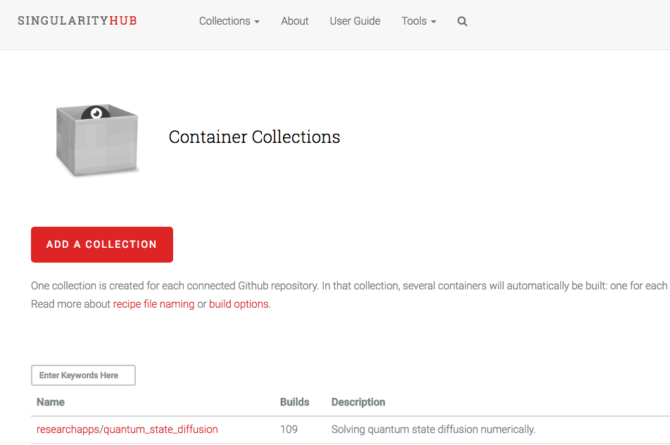
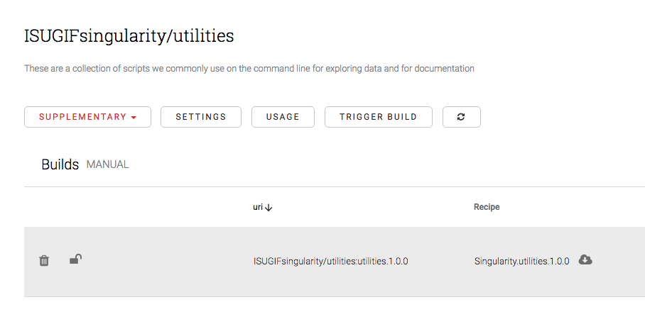

# Introduction to Singularity Containers

## What are Containers?

A container can be thought of as a light weight Virtual machine that are in itself a portable linux environment.  They help with reproducibility and dependencies required to run a script, program or pipeline.


## Initial setup

In order to use the container you will need to load the Singularity module on your HPC resource or install it on your local machine. This will vary from HPC resource to HPC resource.  You can find what your HPC called the module by using the ```module avail``` command.  In many cases it will be as simple as the command below.

```
module load singularity
```

## Finding and Downloading a Singularity Container

There are two main places that you can find containers that will work with singularity.

* https://singularity-hub.org/
* https://hub.docker.com

The first time you use singularity it will by default put a .singularity folder in your home directory which commonly has limited storage space.  Therefore it is important that you move that folder to a different location and then create a softlink from your home directory to the new location.

#### Example from Docker shub.


```
singularity pull docker://sjackman/maker
singularity exec --bind $PWD ./maker.img maker --help
```

#### Example from Singularity Hub

First go to [Singularity Hub](https://www.singularity-hub.org/) and locate the container you want through the search box located on the left side just below the ```ADD A COLLECTION``` button and above the list of containers.




 For this example searched for ISUGIF and will download one called utilities. First you click on the utilities part of the link which will bring you to a page that looks like this:




The uri is the important bit of information you will need to download this image using the singularity pull command. Unfortunately, there is no easy way to copy this so I typically just copy the header and then manually type in the container name (:utilities.1.0.0) in the command below.

```
singularity pull shub://ISUGIFsingularity/utilities:1.0.1
```
If you get a **CERTIFICATE_VERIFY_FAILED:** error then you can set your python certificate verification to off.
```export PYTHONHTTPSVERIFY=0```

#### Direct execution of Singularity containers
Containers often have runscripts that will provide you with useful information on how to use the container. The run scripts get initiated by executing the image as follows:
```
./ISUGIFsingularity-utilities-master-1.0.1.simg
```
Which in this case produces a list of files that can be called by the image.
```
colsum  createhist.awk  intervalBins.awk  nb  nbsearch  new_Assemblathon.pl  readme  README.md  seqlen.awk  summary.sh
```

 As I mentioned above, these are useful scripts often used in our group.  One script borrowed from the Assemblathon paper, new_Assemblathon.pl, we use when evaluating genome assemblies and want to get a summary of the assembly statistics.  To use this script via the container we can execute it in the following manner.

```
singularity exec ISUGIFsingularity-utilities-master-1.0.1.simg new_Assemblathon.pl Spirochaete.fasta
```

This way of executing containers is kind of tedious as it requires so much more than just the new_Assemblathon.pl script that you could just download and place it somewhere in your path.  Later in this tutorial, we will show you how to create a bash script wrapper that will simplify calling the function from within the container.  In most cases creating a container for a simple script (perl, python, bash) doesn't make sense as it creates a small overhead to load singularity and the container before executing the script.  Where containers shine, is when your script or pipeline requires lots and lots of software prerequisites (for example: a specific version of perl, blast, qiime, samtools, etc)

We ran the new_Assemblathon.pl script from the container on a spirochaete genome we had handy and it produced the desired output.
```
---------------- Information for assembly '/Users/severin/Downloads/Spirochaete.fasta' ----------------


                                         Number of scaffolds          1
                                     Total size of scaffolds    3251735
                                            Longest scaffold    3251735
                                           Shortest scaffold    3251735
                                 Number of scaffolds > 1K nt          1 100.0%
                                Number of scaffolds > 10K nt          1 100.0%
                               Number of scaffolds > 100K nt          1 100.0%
                                 Number of scaffolds > 1M nt          1 100.0%
                                Number of scaffolds > 10M nt          0   0.0%
                                          Mean scaffold size    3251735
                                        Median scaffold size    3251735
                                         N50 scaffold length    3251735
                                          L50 scaffold count          1
                                                 scaffold %A      25.62
                                                 scaffold %C      24.57
                                                 scaffold %G      24.21
                                                 scaffold %T      25.60
                                                 scaffold %N       0.00
                                         scaffold %non-ACGTN       0.00
                             Number of scaffold non-ACGTN nt          0
...
This output has been truncated
```


## How to install and use Singularity on your locall machine (Mac)
If you want to explore containers on your local Mac you canfFollow the directions on this website [http://singularity.lbl.gov/install-mac](http://singularity.lbl.gov/install-mac)

Note: You may need to issue the following command if you update your operating system or get a new computer.

```
Note you may need to allow Oracle permission via your security settings if you are on a mac.  See [this website](https://apple.stackexchange.com/questions/301303/virtualbox-5-1-28-fails-to-install-on-macos-10-13-due-to-kext-security)
```

#### Starting a singularity Virtual Machine (VM) instance on the Mac

If you are using your local machine, this will allow you to not only execute containers but also build containers from recipes and test them out.

```
mkdir singularity-vm
cd singularity-vm
vagrant destroy
vagrant init singularityware/singularity-2.4
vagrant up
vagrant ssh
```


#### Running a command using a Singularity container.  (Same as above)
```
singularity exec ISUGIFsingularity-utilities-master-1.0.1.simg new_Assemblathon.pl Spirochaete.fasta
```


#### transferring files off and onto a local vagrant virtual machines

You probably started your vm and realized that you can't access any of your files to try out the command above.
If you are running a VM locally to use singularity, you can transfer files to and from your VM using ```scp``` and the VM private key.

Change into the folder you initiated your vagrant vm ```singularity-vm``` and run the vagrant ssh-config command to get the private key
```
vagrant ssh-config
```
OUTPUT
```
Host default
  HostName 127.0.0.1
  User vagrant
  Port 2222
  UserKnownHostsFile /dev/null
  StrictHostKeyChecking no
  PasswordAuthentication no
  IdentityFile /Users/severin/singularity-vm/.vagrant/machines/default/virtualbox/private_key
  IdentitiesOnly yes
  LogLevel FATAL
```

Then using that key scp files off of the virtual box from a newly opened terminal that is not in the VM.

```
scp -P 2222 -i /Users/severin/singularity-vm/.vagrant/machines/default/virtualbox/private_key vagrant@127.0.0.1:/home/vagrant/recipe .
```
or transfer a file to the VM.
```
scp -P 2222 -i /Users/severin/singularity-vm/.vagrant/machines/default/virtualbox/private_key  ~/Downloads/Spirochaete.fasta vagrant@127.0.0.1:/home/vagrant/
```


#### creating wrappers for the singularity commands

Here is an example bash script wrapper for a singularity execution of a command in a container.  

```
new_assemblathon
#!/bin/bash

singularity exec ISUGIFsingularity-utilities-master.simg new_Assemblathon.pl
```

This wrapper contains the singularity command and once put in your path you can just use

```
new_Assemblathon
```

to execute the script via the singularity container.


#### To create your own containers see the next tutorial

[How to create your own Containers](creatingContainers.md)

---
[Table of contents](../../programs.md)
