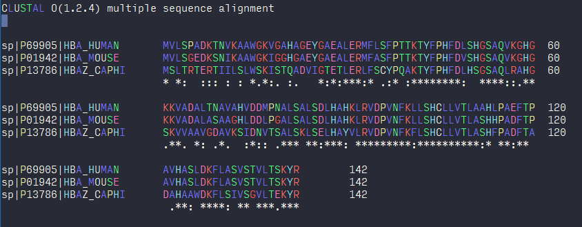

# Syntax high-lighting for Biology specific files

If you're a coder, then you already know how useful the syntax highlighting is for your programming language. However, if you're a biologist and work with lots of biology specific files (fasta, msa, vcf etc) on command-line, then you might have noticed how non-intuitive it feels for manually inspecting them. This tutorial aims to reduce that feeling a little bit and makes working on CLI a bit better!

If you want a hands-on approach with support to custom files, first section covers `nano` text editor syntax coloring. Since for `vim` has complicated syntax file formats, we will use a readymade solution that uses the program called `BioSyntax`. BioSyntax comes with present syntax coloring for pretty much all types of files in Biology/Bioinformatics and works with various other commands as well (like `less`, `vim` etc.).

## Nano as the text editor (custom syntax coloring)

For `nano` most settings can be set in `.nanorc` file located in your home directory (`/home/username/.nanorc` or simply `~/.nanorc`).

You can add file specific syntax coloring by editing `.nanorc` file. For example, for nucleotide file (file extensions `.fna` `.fasta` or `.fa`), you can add this section:

```bash
# fasta format nucleotide sequences.
syntax "fasta" "\.fasta$" "\.fas$" "\.fa$"
color brightwhite "^\>.*"
color brightgreen "[Aa]"
color brightred "[Tt]"
color brightblue "[Cc]"
color brightyellow "[Gg]"

```


Similarly, for amino acid fasta files, you can add these lines (ending with `.faa` or `.aa`):


```bash
#colored based on aminoacid properties
syntax "fasta" "\.faa$" "\.aa$"
color brightwhite "^\>.*"
color brightblue "[AILMFWV]"
color brightred "[RK]"
color brightgreen "[NQ]"
color white "[C]"
color magenta "[ED]"
color red "[G]"
color cyan "[HY]"
color brightyellow "[P]"
color green "[ST]"
```


This can also be used for alignment files (nucleotide or proteins) by adding more extensions to the above syntax coloring. You can also add other coloring patterns for other file extensions using the same method.

Other examples:

FASTQ file
```bash
## For FASTQ file
syntax "fastq" "\.fq$" "\.fastq$"
color brightred "^(@|\+).*$"
color brightgreen "^[ATGCN]+$"
```
For DNA sequence in NEXUS/PAUP format

```bash
 "nexus" "\.nexus$" "\.nex$"
color brightgreen "[Aa]"
color brightred "[Tt]"
color brightblue "[Cc]"
color brightyellow "[Gg]"
color brightwhite "(^[  ])\{?[0-9A-Z_!@#$*?-]+\}?"
color brightwhite  start="\[" end="\]"
color brightred "(#NEXUS|End|;)"
color brightyellow "(Dimensions|Format|Matrix)"
color brightcyan "(Begin DATA|ntax|nchar|datatype|gap)"
color brightred "\=\{?[0-9A-Z_!@#$*?-]+\}?"
```

Alignment files (protein)

```bash
## For Protein CLUSTALW format
syntax "clustalw" "\.clw$" "\.aln$"
color brightblue "[AILMFWV]"
color brightred "[RK]"
color brightgreen "[NQ]"
color white "[C]"
color magenta "[ED]"
color red "[G]"
color cyan "[HY]"
color brightyellow "[P]"
color green "[ST]"
```

The screenshot for the above format:




## Using BioSyntax (for vim and other tools)

[BioSyntax](https://github.com/bioSyntax/bioSyntax) integrates  with vim, less, gedit, & sublime and automatically recognizes file formats for various biological [file formats](https://biosyntax.org/man#supported-file-formats). The publication is available [here](https://bmcbioinformatics.biomedcentral.com/articles/10.1186/s12859-018-2315-y) and you should cite the article if you use this tool in your project.

### Install

Follow [these](biosyntax.org/install) guidelines from their official website. SInce you will most likely not have `sudo` access, you may have to install `source-highlight` program manually first before attempting BioSyntax installation. Follow these steps:
```
wget ftp://ftp.gnu.org/gnu/src-highlite/source-highlight-3.1.8.tar.gz
tar xf source-highlight-3.1.8.tar.gz
mkdir /path/to/somedir/sourcehighlight/
cd source-highlight-3.1.8
./configure --prefix=/path/to/somedir/sourcehighlight
make
make install
```
 Once installed, set the variables correctly so that the program can find the files it needs. Add these lines to your `.bashrc`

 ```
 PATH=PATH:/path/to/installationdir/bin
LD_LIBRARY_PATH=LD_LIBRARY_PATH:/path/to/installationdir/lib
LIBRARY_PATH=LIBRARY_PATH:/path/to/installationdir/lib
PKG_CONFIG_PATH=PKG_CONFIG_PATH:/path/to/installationdir/lib/pkgconfig
CMAKE_LIBRARY_PATH=CMAKE_LIBRARY_PATH:/path/to/installationdir/lib
LD_LIBRARY_PATH=LD_LIBRARY_PATH:/path/to/installationdir/lib
C_INCLUDE_PATH=C_INCLUDE_PATH:/path/to/installationdir/include
CPLUS_INCLUDE_PATH=CPLUS_INCLUDE_PATH:/path/to/installationdir/include
CMAKE_INCLUDE_PATH=CMAKE_INCLUDE_PATH:/path/to/installationdir/include
MANPATH=MANPATH:/path/to/installationdir/share/man
```

Now, you are ready to install `bioSyntax`

```bash
wget https://github.com/bioSyntax/bioSyntax/releases/download/v1.0.0/bioSyntax-1.0.0.zip
unzip bioSyntax-1.0.0.zip
cd bioSyntax-master
# for installing colors for less
bash bioSyntax_INSTALL.sh less
# or for vim
bash bioSyntax_INSTALL.sh vim
```

restart the terminal and you're all set to use the bioSyntax!
