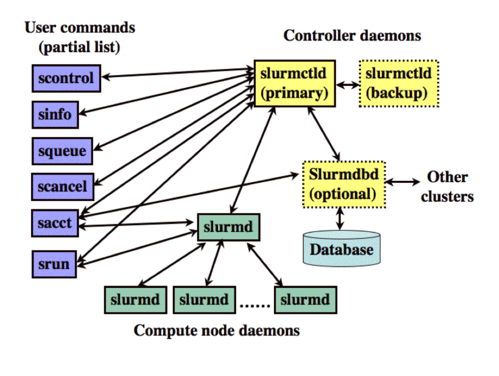

# Introduction to SLURM: Simple Linux Utility for Resource Management

* Open source fault-tolerant, and highly scalable cluster management and job scheduling system for large and small Linux clusters.
* HPC systems admins use this system for smooth resource distribution among various users. A user can submit jobs with specific resources to the centralized manager.

## The three objectives of SLURM:

* Lets a user request a compute node to do an analysis (job)
* Provides a framework (commands) to start, cancel, and monitor a job
* Keeps track of all jobs to ensure everyone can efficiently use all computing resources without stepping on each others toes.

## SLURM Commands:

The main SLURM user commands, shown on the left, give the user access to information pertaining to the super computing cluster and the ability to submit or cancel a job.  See table below for a description of the main SLURM user functions.

|command | Description |
| - | - |
|<span style="color:Blue">sbatch</span> | Submit a batch script to SLURM |
|<span style="color:Blue">squeue</span>| List all jobs currently running or in queue |
|<span style="color:Blue">scancel</span>| Cancel a job you submitted |
|<span style="color:Blue">sinfo</span>| Check the availability of nodes within all partitions|
|<span style="color:Blue">scontrol</span> | See the configuration of a specific node or information about a job |
|<span style="color:Blue">sacct</span>| Displays accounting data for all jobs |
| <span style="color:Blue">salloc</span> | reserve an interactive node |


<!--  Photo from [schedmd](https://slurm.schedmd.com/overview.html) -->

## <span style="color:Blue">squeue</span>

The first SLURM command to learn is <span style="color:Blue">squeue</span>. It provides a list of all jobs that have been submitted to the SLURM scheduler by everyone using the supercomputer.  This command can tell you how busy a super computing resource is and if your job is running or not.

```bash
squeue

JOBID PARTITION     NAME     USER ST       TIME  NODES NODELIST(REASON)
        2910274 long_1nod porechop  severin  PD   3:30:32      1 (Nodes required for job are DOWN, Drained or reserved)
        2910262 long_1nod       sh  severin  R    4:01:00      1 nova013
        2909617 long_1nod     bash   remkv6  R    7:13:38      1 nova027
```


| Header column | Definition |
| - | - |
| JOBID | The ID that job has been given, usually a large number |
| PARTITION| the partition assigned to a given job |
| NAME | the name provided to SLURM by the user for this job |
| USER | The name of the user who submitted the job |
| ST | The state of the job, running(R), PenDing(PD)|
| NODES | number of nodes requested |
|NODELIST(REASON)| which node(s) is the job running on (or the reason why is it not running)

This can be a really long list especially if you only want to see your own jobs.  To do that you can specify a user using the '-u' parameter.

```bash
squeue -u $USER

JOBID PARTITION     NAME     USER ST       TIME  NODES NODELIST(REASON)
           2867457     short P3826e00 sivanand  R   21:50:29      1 ceres14-compute-53
           2867458     short P6370337 sivanand  R   21:50:29      1 ceres14-compute-53
           2867459     short Pa0567fb sivanand  R   21:50:29      1 ceres19-compute-38
           2867456      long   Falcon sivanand  R   21:50:45      1 ceres14-compute-55
           2867883     short       sh sivanand  R      48:03      1 ceres14-compute-64
```

In the above example `$USER` is your username.


## <span style="color:Blue">scancel</span>

If you submit a job and realize you need to cancel it for some reason, you will use the scancel command with the JOBID described above in <span style="color:Blue">squeue</span>

```
scancel 2867457
```

This sends a signal to the SLURM schedule to stop a running job or remove a pending job from the SLURM queue.


## <span style="color:Blue">sbatch</span>
<span style="color:Blue">
</span>

The <span style="color:Blue">sbatch</span> command is the most important command as it is used to submit jobs to the super computing cluster.  A job is a script that runs on computing resources.  The script contains the commands you want to run on the super computing node.

```bash
sbatch slurm.batch.sh
```

Super easy to use once you have written the SLURM submission script.  This is the part that many new users get stuck on but it really isn't so bad.  You just have to add a header to a text file that has your commands in it.

## SLURM batch script: Guidelines

The SLURM script contains a header with a SLURM SBATCH comment `#SBATCH`.  These comments tell the SLURM schedule the following information.

* Number of nodes
* Desired number of processors or jobs
* Type of partition/queue you want to use (optional)
* Memory requirement (Optional)
* Length of time you want to run the job (Each partition has a default)
* Where to write output and error files
* Name for your job while running on HPC
* Email ID to get job status (Optional)

Here is a table descriptions for the most commonly used #SBATCH comments

| SBATCH command | Description|
| -- | -- |
| #SBATCH -N 1 | Reserve a single node |
| #SBATCH -n 4 | The job steps will launch a max of 4 jobs|
| #SBATCH -p short|Reserve in the short partition|
| #SBATCH -t 01:00:00| Reserve for 01 hour:00 minutes:00 seconds|
| #SBATCH -J sleep|the name of the job is "sleep"|
| #SBATCH -o sleep.o%j| write any std output to a file named sleep.o%j where %j is automatically replaced with the jobid|
| #SBATCH -e sleep.e%j| write any std output to a file named sleep.e%j where %j is automatically replaced with the jobid|
| #SBATCH --mail-user=user@domain.edu| Notify me at this email address|
| #SBATCH --mail-type=begin| Notify by email when the job begins|
| #SBATCH --mail-type=end| Notify by email when the job ends|


#### **Super computing etiquette**

One of the most important takeaways in this tutorial is that a job is best run on `compute nodes` and not on the `login node`. We generally write a batch script where we can reserve the necessary resources and then write the commands or the actual job that you want to do. Obviously this example is trivial, however in reality most jobs run by users involve at least some component of heavy computing or memory. It is poor etiquette to do any intensive computing on the `headnode` as it slows everyone down sometimes to the point where no one can use the `ls` command.

## Writing a SLURM job script

Now that you know a little more about #SBATCH comments, A SLURM job script is straight forward to write and contains two components:

  * SLURM header with #SBATCH comments that define the resources you need
  * The commands you want to run

### SLURM header

once you write this once, you could reuse it for other scripts you need by modifying the #SBATCH comments according to your need.

```bash
#!/bin/bash
##The shebang line or the absolute path to the bash interpreter

## All the lines below that start with a single `#SBATCH` is a SLURM SBATCH comment

#SBATCH -N 1
#SBATCH -n 4
#SBATCH -p short
#SBATCH -t 01:00:00
#SBATCH -J sleep
#SBATCH -o sleep.o%j
#SBATCH -e sleep.e%j
#SBATCH --mail-user=user@domain.edu
#SBATCH --mail-type=begin
#SBATCH --mail-type=end

cd $SLURM_SUBMIT_DIR  # this line changes you into the directory you submitted the script once the job starts
```

### Commands you want to run

In this example we will be taking advantage of the sleep command.

```
## The following lines are the commands that you want to run


sleep 10 && echo "I slept for 10 seconds"
sleep 20 && ech "I slept for 20 seconds"
## Note in the above line, I deliberately mis spelt `ech`; this would cause a std error to be output
sleep 60 && echo "I slept for 1 min"

scontrol show job $SLURM_JOB_ID
## scontrol above is a slurm command to view the slurm configuration or state. It is useful to see how much of the resources you have used.
```

### Copy the "SLURM header" and the "Commands you want to run" into a new file

* save the job script as `slurm.batch.sh`

This script can be submitted as follows:

```bash
sbatch slurm.batch.sh
```

This job will at least run for 1-2 mins, so soon after submitting you can actually issue commands to see the job run.

```bash
squeue -u $USER
             JOBID PARTITION     NAME     USER ST       TIME  NODES NODELIST(REASON)
           2935316     short    sleep sivanand  R       0:04      1 ceres14-compute-34
```

**Notes**:  We are using the `-u` option for `squeue` and supplying the variable `$USER`, which referes to your ****user name****. We notice that the job, ****sleep****, is running on the node `ceres14-compute-34` in the `short` partition and has a job ID `2935316`.

Once the job is completed the following files appear

```bash
sleep.o2935316 # this is the standard output where 2935316 is the JOBID
sleep.e2935316 # this is the standard error where 2935316 is the JOBID
```

Let's take a look at the standard output file

```bash
more sleep.o2935316

I slept for 10 seconds
I slept for 1 min

JobId=2935316 JobName=sleep
   UserId=sivanandan.chudalayandi(1727000561) GroupId=sivanandan.chudalayandi(1727000561) MCS_label=N/A
   Priority=213721 Nice=0 Account=scinet QOS=memlimit
   JobState=RUNNING Reason=None Dependency=(null)
   Requeue=1 Restarts=0 BatchFlag=1 Reboot=0 ExitCode=0:0
   RunTime=00:00:01 TimeLimit=01:00:00 TimeMin=N/A
   SubmitTime=2020-05-18T10:40:25 EligibleTime=2020-05-18T10:40:26
   AccrueTime=2020-05-18T10:40:26
   StartTime=2020-05-18T10:40:26 EndTime=2020-05-18T11:40:26 Deadline=N/A
   PreemptEligibleTime=2020-05-18T10:40:26 PreemptTime=None
   SuspendTime=None SecsPreSuspend=0 LastSchedEval=2020-05-18T10:40:26
   Partition=short AllocNode:Sid=ceres19-ipa-0:39699
   ReqNodeList=(null) ExcNodeList=(null)
   NodeList=ceres14-compute-34
   BatchHost=ceres14-compute-34
   NumNodes=1 NumCPUs=4 NumTasks=4 CPUs/Task=1 ReqB:S:C:T=0:0:*:*
   TRES=cpu=4,mem=12400M,node=1,billing=4
   Socks/Node=* NtasksPerN:B:S:C=0:0:*:* CoreSpec=*
   MinCPUsNode=1 MinMemoryCPU=3100M MinTmpDiskNode=0
   Features=(null) DelayBoot=00:00:00
   OverSubscribe=OK Contiguous=0 Licenses=(null) Network=(null)
   Command=/project/isu_gif_vrsc/Siva/Service/Slurm/slurm.batch.sh
   WorkDir=/project/isu_gif_vrsc/Siva/Service/Slurm
   StdErr=/project/isu_gif_vrsc/Siva/Service/Slurm/sleep.e2935316
   StdIn=/dev/null
   StdOut=/project/isu_gif_vrsc/Siva/Service/Slurm/sleep.o2935316
   Power=

```
****Note****: the line starting with `JobID` through `Power=` is the slurm configuration and state (`scontrol`) and gives you an idea of how many resources you have used as mentioned before. The last two lines are directly from our `echo` command in the script.

Additionally, the error file `sleep.e2935316`:

```bash
more sleep.e2935316
/var/spool/slurmd/job2935316/slurm_script: line 16: ech: command not found
```
This tells us that the command `ech` (deliberately mis-spelt) is not found.

## <span style="color:Blue">sinfo</span>

Sometimes it can be difficult to get a node and you end up in the SLURM queue for a long time or you just want to test a script out before you submit and walk away to make sure that it will run well.  The easiest way to find out what nodes are available is to use the <span style="color:Blue">sinfo</span> command.

```bash
$ sinfo
PARTITION        AVAIL  TIMELIMIT  NODES  STATE NODELIST
debug               up    1:00:00      1  maint ceres19-compute-26
debug               up    1:00:00      1    mix ceres14-compute-4
debug               up    1:00:00      1   idle ceres19-compute-25
brief-low           up    2:00:00      2  maint ceres19-compute-[26,40]
brief-low           up    2:00:00      1  down* ceres19-compute-37
brief-low           up    2:00:00     59    mix ceres18-compute-[0-17,19-27],ceres19-compute-[0-5,7-9,12,21-24,35-36,38-39,41-42,44-45,47,55-63]
brief-low           up    2:00:00      4  alloc ceres18-compute-18,ceres19-compute-[6,28,43]
brief-low           up    2:00:00     26   idle ceres19-compute-[10-11,13-20,25,27,29-34,46,48-54]
mem768-low          up    2:00:00      3   idle ceres18-mem768-0,ceres19-mem768-[0-1]
mem-low             up    2:00:00      3    mix ceres18-mem-[0-1],ceres19-mem-1
```

SINFO provides the following information


| Header column | Definition |
| - | - |
|PARTITION| a group of nodes |
| AVAIL | whether or not the node is up, down or in some other state|
|TIMELIMIT| the amount of time a user can request a node in a given partition|
| NODES | the number of nodes in a given partition |
| STATE | maintenance, mix, idle, down, allocated |
| NODELIST| the node names with a given STATE|

With this information it is possible to find partitions that have idle nodes that could be used for a job.  Unfortunately, <span style="color:Blue">sinfo</span> by itself is a bit messy so I have created an alias that formats the output to be easier to read

```bash
sinfo -o "%20P %5D %14F %10m %11l %N"
PARTITION            NODES NODES(A/I/O/T) MEMORY     TIMELIMIT   NODELIST
debug                3     0/3/0/3        126000+    1:00:00     ceres14-compute-4,ceres19-compute-[25-26]
brief-low            92    33/58/1/92     381000     2:00:00     ceres18-compute-[0-27],ceres19-compute-[0-63]
priority-gpu         1     1/0/0/1        379000     14-00:00:00 ceres18-gpu-0
short*               100   51/48/1/100    126000+    2-00:00:00  ceres14-compute-[1-24,26-29,32-39,44-56,58-67],ceres18-compute-[24-27],ceres19-compute-[27-63]
medium               67    49/17/1/67     126000+    7-00:00:00  ceres14-compute-[26-29,32-39,44-56,58-67],ceres18-compute-[25-27],ceres19-compute-[35-63]
long                 34    31/3/0/34      126000+    21-00:00:00 ceres14-compute-[44-56,58-67],ceres18-compute-[26-27],ceres19-compute-[55-63]
mem                  8     3/4/1/8        1530000+   7-00:00:00  ceres14-mem-[0-3],ceres18-mem-2,ceres19-mem-[2-4]
mem768               1     0/1/0/1        763000     7-00:00:00  ceres18-mem768-1
huge                 1     1/0/0/1        4:16:1   3095104    14990      1-00:00:00  fat,AVX,AVX2,AVX novahuge001

```

If you edit your .bashrc file in your home directory and add this alias you can use si instead.

```bash
nano ~/.bashrc
#add the following line
alias si='sinfo -o "%20P %5D %14F %10m %11l %N"'
#exit nano
si
debug                3     0/3/0/3        126000+    1:00:00     ceres14-compute-4,ceres19-compute-[25-26]
brief-low            92    33/58/1/92     381000     2:00:00     ceres18-compute-[0-27],ceres19-compute-[0-63]
priority-gpu         1     1/0/0/1        379000     14-00:00:00 ceres18-gpu-0
short*               100   51/48/1/100    126000+    2-00:00:00  ceres14-compute-[1-24,26-29,32-39,44-56,58-67],ceres18-compute-[24-27],ceres19-compute-[27-63]
medium               67    49/17/1/67     126000+    7-00:00:00  ceres14-compute-[26-29,32-39,44-56,58-67],ceres18-compute-[25-27],ceres19-compute-[35-63]
long                 34    31/3/0/34      126000+    21-00:00:00 ceres14-compute-[44-56,58-67],ceres18-compute-[26-27],ceres19-compute-[55-63]
mem                  8     3/4/1/8        1530000+   7-00:00:00  ceres14-mem-[0-3],ceres18-mem-2,ceres19-mem-[2-4]
mem768               1     0/1/0/1        763000     7-00:00:00  ceres18-mem768-1
huge                 1     1/0/0/1        4:16:1   3095104    14990      1-00:00:00  fat,AVX,AVX2,AVX novahuge001

```


## <span style="color:Blue">scontrol</span>

If you need to see the configuration of a specific node to determine if that type of node is sufficient for your analysis or to diagnose a problem (like insufficient memory <span style="color:Red">segmentation fault</span>). <span style="color:Blue">scontrol</span> can be used to look up information on a node for example `ceres14-compute-8`

```bash
$ scontrol show nodes ceres14-compute-8

NodeName=ceres14-compute-8 Arch=x86_64 CoresPerSocket=10
   CPUAlloc=0 CPUTot=40 CPULoad=0.01
   AvailableFeatures=AVX
   ActiveFeatures=AVX
   Gres=(null)
   NodeAddr=ceres14-compute-8 NodeHostName=ceres14-compute-8 Version=19.05.5
   OS=Linux 3.10.0-1062.12.1.el7.x86_64 #1 SMP Tue Feb 4 23:02:59 UTC 2020
   RealMemory=126000 AllocMem=0 FreeMem=85536 Sockets=2 Boards=1
   State=IDLE ThreadsPerCore=2 TmpDisk=975 Weight=1 Owner=N/A MCS_label=N/A
   Partitions=short,geneious
   BootTime=2020-02-17T17:14:55 SlurmdStartTime=2020-02-18T17:12:06
   CfgTRES=cpu=40,mem=126000M,billing=40
   AllocTRES=
   CapWatts=n/a
   CurrentWatts=0 AveWatts=0
   ExtSensorsJoules=n/s ExtSensorsWatts=0 ExtSensorsTemp=n/s
```

Sometimes, you want to know more about the job you just ran or is currently running.

```bash
scontrol show job JOBID
```

You can get the JOBID from the output of the squeue command

```bash
scontrol show job 2909617

JobId=2909617 JobName=bash
   UserId=remkv6(298590) GroupId=domain users(101) MCS_label=N/A
   Priority=84730 Nice=0 Account=gif QOS=gif
   JobState=RUNNING Reason=None Dependency=(null)
   Requeue=1 Restarts=0 BatchFlag=0 Reboot=0 ExitCode=0:0
   RunTime=06:58:38 TimeLimit=10:00:00 TimeMin=N/A
   SubmitTime=2020-05-18T07:29:05 EligibleTime=2020-05-18T07:29:05
   AccrueTime=Unknown
   StartTime=2020-05-18T07:29:05 EndTime=2020-05-18T17:29:05 Deadline=N/A
   SuspendTime=None SecsPreSuspend=0 LastSchedEval=2020-05-18T07:29:05
   Partition=long_1node192 AllocNode:Sid=nova:71501
   ReqNodeList=(null) ExcNodeList=(null)
   NodeList=nova027
   BatchHost=nova027
   NumNodes=1 NumCPUs=4 NumTasks=4 CPUs/Task=1 ReqB:S:C:T=0:0:*:*
   TRES=cpu=4,mem=20400M,node=1
   Socks/Node=* NtasksPerN:B:S:C=4:0:*:* CoreSpec=*
   MinCPUsNode=4 MinMemoryCPU=5100M MinTmpDiskNode=0
   Features=(null) DelayBoot=00:00:00
   OverSubscribe=OK Contiguous=0 Licenses=(null) Network=(null)
   Command=bash
   WorkDir=/work/gif/remkv6/Baum/04_DovetailSCNGenome/01_mikadoRerurn/01_BrakerFix/braker
   Comment=Time 600, Med priority, overdrawn
   Power=
```

**Hint** if you put this code at the end of your SLURM script it will output this to your standard out file after your job completes.

```bash
scontrol show job $SLURM_JOB_ID
```

## sacct

This command provides useful accounting information about submitted jobs.

| Column | Description |
| - | - |
|JobID| Job ID number |
|JobName| Name of the Job|
|Partition | What partition of the SLURM queue is it running or queued for|
|Account | Which account/group is it running on |
|AllocCPUS|  Number of CPUs allocated/requested|
|State ExitCode | State of job or exit code|


By itself this command will only give you information about your jobs
```
sacct
```

Adding the `-a` parameter will provide information about all accounts.

```
sacct -a
```

And there is a format option that can give more useful column information.

```
sacct -a --format JobID,Partition,Timelimit,Start,Elapsed,NodeList%20,ExitCode,ReqMem,MaxRSS,MaxVMSize,AllocCPUS
```


## <span style="color:Blue">salloc</span>

### Interactive Session

We could have also run the commands in the job script interactively by first reserving a node in the partition using `salloc`

```bash
# this command will give 1 Node with 4 cpu in the short partitio for a time of 00 hours: 30 minutes: 00 seconds

$ salloc -N 1 -n 4 -p short -t 00:30:00

salloc: Pending job allocation 2935626
salloc: job 2935626 queued and waiting for resources
salloc: job 2935626 has been allocated resources
salloc: Granted job allocation 2935626
salloc: Waiting for resource configuration
salloc: Nodes ceres14-compute-48 are ready for job
export TMPDIR=/local/bgfs//2935626
export TMOUT=5400

```

In an interactive session, we can primarily use it to run small test runs of a large job and/or run say, a bunch of file `compression` or `un-tarring`.

We can run the commands from out job script above directly in the interactive session.

```bash
sleep 10 && echo "I slept for 10 seconds"
I slept for 10 seconds
```
or

```bash
sleep 20 && ech "I slept for 20 seconds"
bash: ech: command not found

```

## Additional Resources

* Other Slurm tutorials
  * [schedmd.com](https://slurm.schedmd.com/tutorials.html)
  * [Fulton supercomputing](https://www.youtube.com/watch?v=U42qlYkzP9k&feature=player_embedded)


## References

This tutorial is a rehash of material found on [schedmd](https://slurm.schedmd.com/overview.html)

## Those useful aliases you wanted to put in your `~/.bashrc` file.

```bash
alias si='sinfo -o "%20P %5D %14F %10m %11l %N"'
alias sq='squeue -o "%8i %12j %4t %10u %20q %20a %10g %20P %10Q %5D %11l %11L %R"'
alias sacct='sacct --format JobID,Partition,Timelimit,Start,Elapsed,NodeList%20,ExitCode,ReqMem,MaxRSS,MaxVMSize,AllocCPUS'
```
