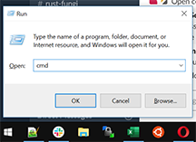
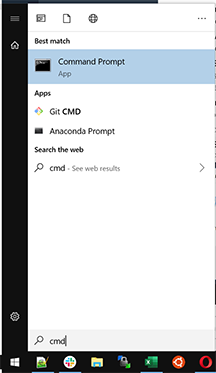
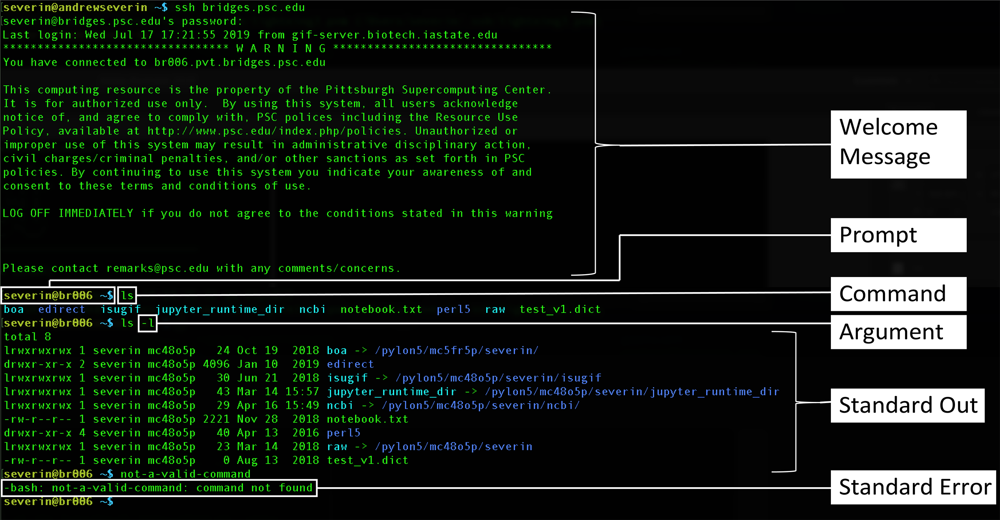



# Introduction
---

## What is Unix?
* Multiuser operating system
* Linux: free version of this type of operating system
  * Red Hat Enterprise Linux, Ubuntu, and CentOS
* Used on high-end workstations, database servers, web servers and managing shared resources
* Standard features include: Security, reliability, scalability
  * Can supports 100s of users at a time


## Can I learn Unix?

* **Yes!** Absolutely. It is just another way of operating your computer
* No more difficult than learning Word, Excel or Powerpoint
* Biggest difference
  * In Linux:  You type the command to execute
  * In Windows and Mac: You use your mouse to execute a command
* **Remember. In the Terminal, “Don’t use the mouse.”**


## What is a terminal?

A terminal is the program that is used to access files on your laptop/computer that is sitting in front of you (local machine) or access to files on a supercomputer in a different location (remote machine).  You can access a terminal on a Mac or Windows machine as described below.

### On a Mac (OS)

1. Use the Finder  and search for and open the Terminal program .
2. Type ```ssh username@hostname```
  * Example1:  ```ssh andrew.severin@ceres.scinet.science```
  * Example2: ```ssh severin@bridges.psc.edu```
3. Hit by &#8629; (`Enter`) key and enter your password and verification code.
  * Note: as you type the password, you will not see your typing.

### On a PC (Windows)

On Windows, it will be easier for you to login first to a linux based system for the rest of this tutorial (remote machine).  You will first need to open up the command prompt which is similar to a terminal in the Mac OS operating system.

1. Press windows key + r, type cmd and enter

  

* Type ssh usename@hostname
  * Example1:  ```ssh andrew.severin@ceres.scinet.science```
  * Example2: ```ssh severin@bridges.psc.edu```
  * Hit by &#8629; (`Enter`) key and enter your password and verification code.
    * Note: as you type the password, you will not see your typing.

2. Search for ```cmd``` using Window's search.

  

**Note:** The window can be resized with the mouse and the font text can be increased by pressing `cmd +` or `control +` on Mac or Windows, respectively.

## Terminal Terminology

When working in a terminal, it is helpful to know some basic terminology for when asking for help or describing a problem.

  * **Welcome Message:** the startup message when logging into a remote machine
  * **Prompt:** The text next to where you type your commands
    * prompts can be modified to include addtional information like hostname or current folder location
  * **Command:** the function or script you are trying to run.
  * **Argument:** added to a Command to modify the output
    * there is always a space between a command an the argument
  * **Standard Out:** the result of a command
  * **Standard Error:** the error of a failed command




# Getting started

---

Let us start by getting everyone logged in and to the same location in the file system. If you haven't already logged in to a remote machine by typing in the following command in the terminal.

**NOTE** When you are prompted for a password you won't see the typing.  Just keep typing.

```
ssh usename@hostname
```
* username is your username for the system
  * severin
  * andrew.severin
  * etc
* hostname is the name of the computer
  * bridges.psc.edu
  * ceres.scinet.science
  * etc

Once you have logged in you will see a bunch of text fly by your screen.  That text is the welcome message on the remote machine. Now that everyone is logged in. Let us make sure everyone is in their home directory and set the behavior of the pwd command so there is no difference in the output of this command.  Type in the two following commands and hit the &#8629; (`Enter`) key

```
cd
alias pwd="pwd -P"
clear
```


|| ||
|--|--|--|
| <span style="color:Green">_Command_</span>|<span style="color:Green">_Function_</span>|<span style="color:Green">_Syntax/example usage_</span> |
|`mkdir`	|make directory	|`mkdir` <span style="color:Red">DIRECTORY</span>|
|`pwd`	|print working directory	|`pwd`|
|`cd`|change directory	|`cd` ~ or `cd` 		#home directory|
| | 			|`cd` .. #previous (parent directory)|
|`ls` 	|list contents	|`ls` <span style="color:Red">[OPTIONS] DIRECTORY</span>|


This section will introduce you to some basic file/directory navigation

## mkdir -- <span style="color:Blue">M</span>a<span style="color:Blue">k</span>e <span style="color:Blue">Dir</span>ectory Command
Let's make a new directory (folder) called unixTutorial.  To create a directory, the `mkdir` (`m`a`k`e `dir`ectory) command can be used. Type in the next command and hit the &#8629; (`Enter`) key. Notice there is a space between the mkdir command and the filename we supply to the mkdir command

```
mkdir unixTutorial
```

**NOTE:** Unlike PC/Mac folders, in Unix it is better to not include spaces in names for directories. (the underscore "\_" can be used to replace any spaces you might want).

Once you hit return, you will not see anything it will just give you a new prompt and if you try to type it again you will get an error message. Go ahead and try this if you want.

```
mkdir unixTutorial
mkdir: cannot create directory ‘unixTutorial’: File exists
```


## pwd -- <span style="color:Blue">P</span>ath of <span style="color:Blue">W</span>orking <span style="color:Blue">D</span>irectory

At this point you might be feeling like you are completely blind because you can't see the result of what you did.  So let me teach you a few more commands and change that.  This command will tell you where you are.

```
pwd
```
In my case this returns the following to standard out where severin is my username that I used to log in.
```
/home/severin
```

What this is telling me is that I am in a directory named severin which is in a directory named home.

## `cd` -- <span style="color:Blue">C</span>hange <span style="color:Blue">D</span>irectory

You will recall we made a directory called unixTutorial above. We can change to that directory using the `cd` command.

```
cd unixTutorial
```
Now if we type the path of working directory command `pwd` we get the following
```
pwd
/home/severin/unixTutorial
```
We are now in a directory called unixTutorial which is a subdirectory of severin which is a subdirectory of home.

To change back to the previous directory we can type in the full path like so.

```
cd /home/severin/
```

or we can use `..` which refers to the directory above the one you are in and type this.


```
cd ..
```

**NOTE:** Present directory is represented as `.` (dot) and parent directory is represented as `..` (dot dot).

Try this out with the following commands

```
cd
cd unixTutorial
pwd
cd ..
pwd
cd ..
pwd
cd ..
pwd
cd
cd unixTutorial
pwd
```
**TIP**: You can type in first few letters of the directory name and then press `Tab` to auto complete rest of the name (especially useful when the file/directory name is long). This only works when there are unique matches for the starting letters you have typed. If there is more than one matching files/directories, pressing `Tab` twice will list all the matching names.


# File creation editing
---

|| ||
|--|--|--|
| <span style="color:Green">_Command_</span>|<span style="color:Green">_Function_</span>|<span style="color:Green">_Syntax/example usage_</span> |
|`ls` 	|list contents	|`ls` <span style="color:Red">[OPTIONS] DIRECTORY</span>|
|`nano`	|edit file	|`nano` <span style="color:Red">FILENAME</span>|
|`vim` | edit a file | `vim` <span style="color:Red">FILENAME</span>


## `ls` (<span style="color:Blue">l</span>i<span style="color:Blue">s</span>t) command

Now that we know how to move between directories, The contents of a directory can be viewed using `ls`. If no directory name is provided then `ls` will list all the contents of the present directory.
```
ls
ls .
ls DIRECTORY
```
Everyone should currently be in their unixTutorial directory that they just created, which is empty so the `ls` command will return you to a new prompt without anything written to standard out. To exit nano you type this series of keys -- hit `ctr x` press `y` for yes to save and hit `enter`.  Nano tells you how to exit along with many of the following shortcuts at the bottom of your screen and will step you through how to exit and save.

## nano -- Text editor more like a GUI

Nano opens up and will feel like a typical text editor you are familiar with.  Arrow keys can be used navigate the text. Below are some additional shortcuts.

|NANO SHORTCUTS| |
|--|--|
| <span style="color:Green">_Command_</span>|<span style="color:Green">_Function_</span>|
|`ctrl+o`	|save file|
|`ctrl+x`	|close file|
|`alt+/`	|go to end of the file|
|`ctrl+a`	|go to start of the line|
|`ctrl+e`	|go to end of the line|
|`ctrl+c`	|show line number|
|`ctrl+_`	|go to line number |
|`ctrl+w`	|find matching word|
|`alt+w`	|find next match|
|`ctrl+\`	|find and replace|

#### <span style="color:Green">Exercise:</span>

Copy and paste the following text into a file named myFirstfile.txt
```
The greatest challenge is sifting through all the data that is generated by the
simulation.  In fact, it is impossible.  Impossible because to record every
event everywhere in the artificial universe would take more hard drive space
than was physically possible to create given Earth's dwindling resources.
Therefore, my life's greatest achievement was to encode a method to filter the
data, so only the most relevant events related to what we want is recorded. In
our case, that means space travel.  But not just any space travel, space travel
between galaxies.
```

Start by copying the text above using your mouse then in a terminal use nano to create a file named myFirstfile.txt

```
nano myFirstfile.txt
```
Paste your text and then hit `ctr x` press `y` for yes to save and hit `enter`, which will return you to the prompt.  This will save the file with the text in it.

## VIM

`vim` is another text editor that when you are more comfortable with the unix command line, it will be worth your time to learn.  Many first time Unix users type in `vim` to enter the editor and get stuck in the editor as it is less intuitive than nano.  I will not go into great detail in this introductory tutorial but want to provide you with resources to explore on your own. There is a command line like feature in this editor that a user can use to execute very powerful text editing functions.

|Vim | Very Basics Usage|
| -- | -- |
|esc| Hitting escape will take you back to the original state when you opened vim.|
|i| insert mode: In this mode it is possible to add/edit the text |
|esc :wq| hitting escape then typing `:` `w` `q` will write(save) the file and quit|

Copying and pasting work like other editors as long as you are in the insert mode.

* [Things-about-vim-i-wish-i-knew-earlier](https://blog.petrzemek.net/2016/04/06/things-about-vim-i-wish-i-knew-earlier/)
* [Learn-Vim-Progressively](http://yannesposito.com/Scratch/en/blog/Learn-Vim-Progressively/)
* [Vim-adventures](http://vim-adventures.com/)


#  Viewing file contents
---

Easy to remember these commands using this sentence.

A `cat` has a `head` and a `tail`, `more` or `less`

|File/Directory operations | | |
|--|--|--|
|`cat`	|catalog file contents	|`cat` <span style="color:Red">FILE</span>|
|`head`|show first few lines of a file	|`head` <span style="color:Red">FILE</span>|
|`tail`	|show last few lines of a file	|`tail` <span style="color:Red">FILE</span>|
|`more`|view file (with less options)	|`more` <span style="color:Red">FILE</span>|
|`less`	|view file (with more options)	|`less` <span style="color:Red">FILE</span>|
|`seq` | write a sequence of numbers | `seq` <span style="color:Red">1 1 10</span>|

## `seq` -- short for <span style="color:Blue">seq</span>uence of numbers

To fully appreciate the commands for viewing the contents of a file let's create a file with the numbers from 1 to 100.  Execute the following command and put it into a file named `numSeq.txt`

```
seq 1 1 100
#copy the output then use nano
nano numSeq.txt
#make sure there is no extra empty lines at the end of the file.
```

## `cat` -- con<span style="color:Blue">cat</span>enate and print files

This command will print out the entire file. Try it out with the numSeq.txt file.  You should see all 100 numbers print to the screen.

## `head` -- head of the file.

This command will give you the first 10 lines of a file. Try it out with the numSeq.txt file.

```
head numSeq.txt
head -n 5 numSeq.txt
```
The `-n` parameter tells the `head` function to printout in this case 5 lines instead of the default 10 lines.

## `tail` -- tail of the file

This command will give you the last 10 lines of a file.  Try it out with the numSeq.txt file.

```
tail numSeq.txt
tail -n 5 numSeq.txt
```

## `more` -- command to step through a file one screen length at a time using the spacebar. hit `q` to quit the file before reaching the end.

```
more numSeq.txt
```

## `less` -- similar to the more command but lets you scroll backwards as well.

```
less numSeq.txt
```

|less navigation | |
|--|--|
|`q` | quit|
|`u` | up one screen|
|`d` or `space bar`| down one screen|
|`g` <span style="color:Red">NUM</span>| go to line NUM|


# Renaming, copying and deleting files and directories

---

|File/Directory operations | | |
|--|--|--|
| <span style="color:Green">_Command_</span>|<span style="color:Green">_Function_</span>|<span style="color:Green">_Syntax/example usage_</span> |
|`touch`|	create file	|`touch` <span style="color:Red">FILE</span>|
|`mkdir`	|make directory	|`mkdir` <span style="color:Red">DIRECTORY</span>|
|`rmdir`	|remove empty directory	|`rmdir` <span style="color:Red">DIRECTORY</span>|
|`rm`	|remove file(s)	|`rm` <span style="color:Red">FILE</span>|
|`cp`|copy files/directories	|`cp `<span style="color:Red">SOURCE DESTINATION</span>|
|`mv`	|move files/directories	|`mv` <span style="color:Red">SOURCE DESTINATION</span>|


## `touch` command

This command is used to quickly create many empty files.

```
touch AA.txt
touch BB.txt
touch CC.txt
touch 1.txt
touch 2.txt
touch 3.txt
```

Now if you use the `ls` command the standard output will be

```
1.txt 2.txt 3.txt AA.txt BB.txt CC.txt
```
You can also create multiple files using this command.
```
touch DD.txt EE.txt GG.txt 4.txt 5.txt 6.txt
ls
```

The standard output now returns
```
1.txt 2.txt 3.txt 4.txt 5.txt 6.txt AA.txt BB.txt CC.txt DD.txt EE.txt GG.txt
```

## `mkdir` -- <span style="color:Blue">M</span>a<span style="color:Blue">k</span>e <span style="color:Blue">Dir</span>ectory
We have already discussed the mkdir command but here is a brief review.  For this section of the tutorial we are going to make four folders named Numbers, Letters, Deleteme and Deleteme2.

```
mkdir Numbers
mkdir Letters
mkdir Deleteme
mkdir Deleteme2
mkdir Deleteme3
ls
```

Let's also put a couple of files in the Deleteme and Deleteme2 folders.  We can accomplish this by using the touch command and a local path to where we want the file.  Up to this point we have put all the files into the same folder we are in.  In this example we will create an empty file named deleteme.txt and deleteme2 in the subfolders Deleteme and Deleteme2.

```
touch Deleteme/deleteme.txt
touch Deleteme/deleteme1.txt
touch Deleteme2/deleteme2.txt
touch Deleteme2/deleteme3.txt
```

You can verify its there by using the ls command

```
#ls will show you the subfolder Deleteme and Deleteme2 exists
ls

#ls Deleteme will show you the contents of the subfolder Deleteme
ls Deleteme
ls Deleteme2
ls Deleteme3
```

### Warning about deleting files and directories

In Unix there is no undo command.  If you delete a file it is gone.  There is no trash bin.  The next two commands are very powerful commands and cna lead to unfortunate losses if not used with care. With that said you can only delete files you have created.  So it is impossible to delete someone else files without permission.

## `rmdir` -- <span style="color:Blue">R</span>e<span style="color:Blue">m</span>ove <span style="color:Blue">Dir</span>ectory
This command can remove an empty directory

Let's remove the extra Deleteme2 directory using this command

```
ls
rmdir Deleteme3
ls
```
The ls commands show the before and after usage of this command.

Now try to delete the Deleteme folder

```
rmdir Deletem2
```
It will return
```
rmdir: Deleteme2: Directory not empty
```
In order to remove this directory with the rmdir command you would have to delete all the files and folders in the directory.  However, you can use the remove (`rm`) command instead.

## `rm` -- <span style="color:Blue">R</span>e<span style="color:Blue">m</span>ove file

In this example, we will remove the file deleteme3.txt in the Deleteme2 directory.

```
ls Deleteme
ls Deleteme2
rm Deleteme2/deleteme3.txt
ls Deleteme2
ls Deleteme
```

#### <span style="color:Green">Exercise:</span> Remove the deleteme2.txt file.

Now, having deleted both files from Deleteme2 directory we can use the rmdir command to delete the folder.

```
rmdir Deleteme2
```

If however, we do not want to go through and delete all the files we can also use the `rm` command to delete a folder without emptying it.

```
ls
rm -r Deleteme
ls
```

The `-r` is a parameter that attempts to remove directories as well as other types of files

## `mv` -- <span style="color:Blue">m</span>o<span style="color:Blue">v</span>e command

Move is used to move files to a different location and to rename a file.

If we look in our unixTutorial directory using the `ls` command There should only be the following files and folders.  

```
1.txt           3.txt           5.txt           AA.txt           CC.txt           EE.txt           Letters         myFirstfile.txt
2.txt           4.txt           6.txt           BB.txt           DD.txt           GG.txt           Numbers         numSeq.txt
```

Let's clean this up by moving all of the numbered txt files into Numbers and all the Letter txt files into Letters

```
mv 1.txt Numbers
mv 2.txt 3.txt Numbers
mv 4.txt 5.txt 6.txt Numbers
```
As you can see you can move more than one file at a time into a folder by listing multiple files before the directory you wish to move them to.

#### <span style="color:Green">Exercise:</span> Put all the letter files into the Letters directory.

The second function for the mv command is to rename a file.  If you look inside the Letters directory, you will see that one of the letter.txt files is not in sequence.

```
ls Letters
AA.txt BB.txt CC.txt DD.txt EE.txt GG.txt
```

If we wanted to rename GG.txt to FF.txt we would do the following.

```
cd Letters
ls
mv GG.txt FF.txt
ls
```

## `cp` -- <span style="color:Blue">c</span>o<span style="color:Blue">p</span>y command

The `cp` command can be used to duplicate a file

```
ls  
cp myFirstFile.txt mySecondfile.txt
ls
```
You can verify it is a copy by `cat`ing the file, or you can use `more` or `less`
```
cat myFirstfile.txt
cat mySecondfile.txt
```

You can also use the `-l` long format parameter that modifies the `ls` command to get more information about the files such size, date of creation, and ownership. As you can see with the following commands in the 5th column, the files are the same size (563 bytes).

```
ls -l myFirstfile.txt mySecondfile.txt
```


To copy a folder you have to add the `-r` parameter to copy recursively

```
cp -r Letters Letters_copy
```

Verify to yourself that the contents of the folder was copied correctly

```
ls -l Letters
ls -l Letters_copy
```


# Counting, Sorting and Redirecting output
---

Up to this point we have learned individual commands that give you roughly the same kind of ability as you would using your mouse in in IOS or Windows operating systems.  From this point forward however, you will start to understand the power of being able to combine commands on the command line to execute more complex tasks and save time.


| | | |
|--|--|--|
|`wc`	|word count	|`wc` <span style="color:Red">FILENAME</span>| `wc` <span style="color:Red">FILENAME</span>|
|`sort`	|sort files	|`sort` <span style="color:Red">FILE1</span> `>` <span style="color:Red">SORTED_FILE1</span>|
|`uniq`	|display unique lines 	|`uniq` <span style="color:Red">[OPTIONS] INFILE</span> `>` <span style="color:Red">OUTFILE</span>|
|cmd1 `\|` <span style="color:Red">cmd2</span> 	|send output of cmd1 to cmd2| cat <span style="color:Red">FILENAME</span> `\|` sort `\|` uniq |
|`tr`	|translate or transliterate a file	|`tr` <span style="color:Red">[OPTIONS] "STRING1" "STRING2"</span>  `<` <span style="color:Red">INFILE</span> |
|`shuf`| Generate random permutations| `shuf` <span style="color:Red">FILENAME</span>|

|PIPES, REDIRECTS| |
|--|--|
| <span style="color:Green">_Command_</span>|<span style="color:Green">_Function_</span>|
|cmd `<` <span style="color:Red">file</span>	|use file as input|
|cmd `>` <span style="color:Red">file</span>	|write output to file|
|cmd `>>` <span style="color:Red">file</span>	|append output to file|
|cmd1 `|` <span style="color:Red">cmd2</span> 	|send output of cmd1 to cmd2|

## `wc` -- <span style="color:Blue">w</span>ord <span style="color:Blue">c</span>ount

This function will give you the number of lines, the number of words and the number of characters in a file.

The file numSeq.txt for example we created earlier and we know there are 100 lines and 100 words (ie numbers).  Use the following command to confirm this and to also determine the number of characters this file has.
```
wc  numSeq.txt
```


The wordcount  (`wc`) output can be modified with parameters to give you just the line count (`-l`), just the word count (`-w`) or just the character count ('-c').

```
wc -l numSeq.txt
wc -c numSeq.txt
wc -w numSeq.txt
```

**Note** The `-c` assumes that the characters are single byte if you are using multibyte characters you will want to use `-m`


## `tr` -- <span style="color:Blue">tr</span>anslate

This command can take any individual character and replace it with another character

For example, it can be useful to replace the output of the `seq` command with a comma separate list of numbers.  This command is a little different than other commands as it requires that the command requires standard output as the input rather than a filename.  To do this, we will use the `<` redirect symbol.

```
tr '\n' ',' < numSeq.txt
```
The above command means translate new line characters `\n` into commas take input `<` from file numSeq.txt

Your output will look like this.

```
1,2,3,4,5,6,7,8,9,10,11,12,13,14,15,16,17,18,19,20,21,22,23,24,25,26,27,28,29,30,31,32,33,34,35,36,37,38,39,40,41,42,43,44,45,46,47,48,49,50,51,52,53,54,55,56,57,58,59,60,61,62,63,64,65,66,67,68,69,70,71,72,73,74,75,76,77,78,79,80,81,82,83,84,85,86,87,88,89,90,91,92,93,94,95,96,97,98,99,100,
```

## `|` -- Pipe redirect

Pipe can be found on different keyboards as shown below by the yellow boxes.  Pipe `|` is extremely powerful tool.  It can take the output of one command and pass it to the next command without having to write to a file in between.

For example we could repeat the last `tr` command by using the pipe `|` as follows.

```
cat numSeq.txt | tr '\n' ','
```
The above command first uses `cat` to put the contents of the file to standard out and then pipe's `|` it to the translate `tr` command.  If you are having trouble finding the `|` on the keyboard see the yellow highlighted keys below.


## `shuf` -- <span style="color:Blue">shuf</span>fle

**NOTE:** If you are running this in IOS rather than on a linux machine you will need to use `gshuf` or `alias shuf=gshuf` for the above commands to run properly.

Generate random permutations of lines of the file supplied.

Let's use this command to shuffle our numSeq.txt file and then output into a new file using another redirect symbol `>`. Let's repeat this process but instead of overwriting the new file we append `>>` the standard output to the numSeqRandom.txt file.

```
shuf numSeq.txt > numSeqRandom.txt
shuf numSeq.txt >> numSeqRandom.txt
```
The first command will shuffle the contents of numSeq.txt and then redirect `>` the standard output to a new file named numSeqRandom.txt.  The second command will append the same content to the file rather than over writing the file.  Let's confirm we have 200 randomly sorted lines.

```
wc -l numSeqRandom.txt
```

#### <span style="color:Green">Exercise:</span> Use `nano` to add 1e-10 and 1e10 to the top of the numSeqRandom.txt file.  We will show you how to sort all the numbers in the next section.


## `sort` -- sort a file by lines, alpha numerically

We can use this command to sort the shuffled numSeqRandom.txt file

```
sort numSeqRandom.txt | head
1
1
10
10
100
100
11
11
12
12
```
Above, we sorted the numSeqRandom.txt file and then piped the output to head showing the first 10 lines rather than all 200 lines.

Unfortunately, this isn't sorted numerically as we expect.  To do that we use the `-n` parameter.

```
1
1
1e-10
1e10
2
2
3
3
4
4

```

This is closer but the `-n` parameter doesn't handle the scientific notation in order to correctly sort this, we will need to use the `-g` general numerical sort parameter.

```
sort -g numSeqRandom.txt | head
1e-10
1
1
2
2
3
3
4
4
5
```

That worked but how do we remove the duplicates.

## uniq -- <span style="color:Blue">Uniq</span>ue command to remove duplicates of adjacent (presorted) lines

uniq will remove duplicate lines but only if the file is sorted first.

```
wc numSeqRandom.txt
uniq numSeqRandom.txt | wc -l
```
The above comamnd fails with the same number or close to the same number of line as the original file.

```
wc numSeqRandom.txt
sort -g numSeqRandom.txt | uniq | wc -l
```
However, when we sort first we remove all the duplicate numbers and should have 102 lines.

## Counting lines `uniq -c`

If we wanted to know how many of each number there was in this file we could use the `-c` parameter for the `uniq` command.

```
sort -g numSeqRandom.txt | uniq -c | head
1 1e-10
   2 1
   2 2
   2 3
   2 4
   2 5
   2 6
   2 7
   2 8
   2 9
```
The first number represents the number of times the line was found (its frequency).

#### <span style="color:Green">Exercise:</span> Identify the 5 most used words in myFirstfile.txt.  (Hint: cat,tr,sort, uniq, sort, tail, \|)

```
cat myFirstfile.txt  | tr ' ' '\n' | sort | uniq -c | sort -n | tail -n 4
  4 is
  4 space
  5 the
  5 to
```
If that last line looks intimidating, build it up one command at a time and see what each output produces.

```
cat myFirstfile.txt | head
cat myFirstfile.txt | tr ' ' '\n' | head
cat myFirstfile.txt | tr ' ' '\n' | sort | head
cat myFirstfile.txt | tr ' ' '\n' | sort | uniq -c | head
cat myFirstfile.txt | tr ' ' '\n' | sort | uniq -c | sort -n | head
cat myFirstfile.txt | tr ' ' '\n' | sort | uniq -c | sort -n | tail -n 4
```
It is through this method that a long Unix 'one-liner' can be created. By looking at the standard output and seeing what each command does you can tweek each command using parameters until you get the desired output.

# Find and Replace
---
| | | |
|--|--|--|
|`grep`	|search a pattern	|grep <span style="color:Red">[OPTIONS] "PATTERN" FILENAME</span>|
|`sed` | stream editor | `sed 'OPERATION/REGEXP/REPLACEMENT/FLAGS'` <span style="color:Red">FILENAME</span> |  
|`*`| variable used to represent many characters| `ls` <span style="color:Red">*.txt</span>|
|'?'| variable used to represent any one character| 'ls' <span style="color:Red">?.txt</span> |


## `grep` -- <span style="color:Blue">g</span>lobal <span style="color:Blue">r</span>egular <span style="color:Blue">e</span>xpression <span style="color:Blue">p</span>rint

This command will replace your find command in a text document.

```
grep "space" myFirstFile.txt
grep "space" myFirstFile.txt | wc
2
```
This will print the lines where it finds the word "space" in it.

If you wanted to print every occurrence of the word then you can use the '-o' parameter.  You might want to use that to count the number of times a word occurred in a file.

```
grep -o "space" myFirstFile.txt
grep -o "space" myFirstFile.txt | wc
```

Some other commonly used parameters.

| | |
|--|--|
|-i | ignore case|
|-v | invert matching, i.e. select non-matching lines|
|-c | print only the count of matching lines|
|-n | prefix the output with line number|

## `history` -- gives a history of recently used Unix commands

Browse all your previously used commands by typing `history` on your terminal (typically, last 500 commands will be saved in this file).

It is often convenient to find a command or oneliner by searching your history. Try these oneliners.

```
history | grep myFirstFile | tail -n 5
history | grep -i myfirst | tail -n 5
history | grep -i myfirst | grep -v space | grep uniq
```

You can also recall your previous commands by pressing &#8593; or &#8595; arrow keys.

## `?` and `*` -- variables to represent one or many chracters

First, let's undo our sorting of numbers and letters by using the `*` variable that represents all letters repeated for as many times

```
mv Numbers/*.txt .
mv Letters/*.txt .
ls
```
Here is an easier way using variables. You will notice that all the numbers have a single character and all the letters have two characters.  We can use the `?` variable to represent any single character.  Therefore, all the Number files will have this pattern: `?.txt` and all the Letter text files will have this pattern: `??.txt`

First, verify this with the `ls` command
```
ls ??.txt
ls ?.txt
```
Then repeat the sorting using the `mv` command
```
mv ??.txt Letters
mv ?.txt Numbers
```
And we are done.


## `sed` --  <span style="color:Blue">s</span>tream <span style="color:Blue">ed</span>itor

Most common use of `sed` is to substitute text, matching a pattern. The syntax for doing this in `sed` is as follows:

```
sed 'OPERATION/REGEXP/REPLACEMENT/FLAGS' FILENAME
```
Let's replace the word galaxies with the word universes in myFirstFile.txt

```
sed 's/galaxies/universes/g' myFirstFile.txt
```
We can either write it to a new file like this.

```
sed 's/galaxies/universes/g' myFirstFile.txt > myFirstFilev2.txt
```

or we can edit the file inplace using the `-i`, meaning the change will take effect in the file without the generation of a new file.
```
sed -i 's/galaxies/universes/g' myFirstFile.txt
```

# Downloading and transferring data
---

| | | |
|--|--|--|
|`wget` |URL	download specified URL| `wget` <span style="color:Red">https://saltandpepper.jpg</span>|
|`scp` | secure copy| `scp` <span style="color:Red">username@hostname/Path2Folder/FILENAME .</span> |
|`rsync`| remote sync | `rsync -avz -e ssh` <span style="color:Red">username@hostname:/Path2Folder .</span> |

## `wget` -- download(get) from the www

Here are some images you can download.  You can download anything on the web with this command as long as you have an https address. First let's make sure we are still in the unixTutorial folder.

```
pwd
cd
cd unixTutorial
```
Then
```
wget https://bioinformaticsworkbook.org/Appendix/Unix/assets/Cat.jpg
wget https://bioinformaticsworkbook.org/Appendix/Unix/assets/saltandpepper.jpg
```

## `scp` -- <span style="color:Blue">s</span>ecure <span style="color:Blue">c</span>o<span style="color:Blue">p</span>y

To transfer files from a remote machine to your local machine you can use `scp`.  Open up a new terminal on your local machine and change to your downloads folder.

```
cd Downloads
scp username@remotehostname:/home/andrew.severin/unixTutorial/Cat.jpg .

#example
scp andrew.severin@ceres.scinet.science:/home/andrew.severin/unixTutorial/Cat.jpg .
```
The above command does a secure copy from the remote server : in folder unixTutorial to copy Cat.jpg to this folder (`.`)

#### <span style="color:Green">Exercise:</span> Repeat this but for the saltandpepper.jpg image.  Use your mouse to look at the images you just downloaded.

**NOTE:** If you don't know your hostname you can use the command `hostname` to find out. Try it.

## `rsync` -- <span style="color:Blue">r</span>emote <span style="color:Blue">sync</span>

Sometimes you want to download an entire folder.  This can be achieved using the `rsync` command. In your local machine in the Downloads folder execute the following command.

```
rsync -avz -e ssh username@remotehostname:/home/andrew.severin/unixTutorial .
```

**Warning:** Be careful not to include a final `/` at the end of unixTutorial as it will result in copying all the files in the folder to your current folder rather than copying the folder to your current folder.

# The Unix manual pages and soft links
---
## man -- <span style="color:Blue">man</span>uel

This command will provide a description of a unix command and list the parameters that can be used to modify its behavior.  To exit the manual for a command you press `q` like you do in the `less` command.

```
man ls
man cat
man more
man less
```

## ln -- <span style="color:Blue">l</span>i<span style="color:Blue">n</span>k

Creating a symbolic link can be very useful when you need the same file in multiple locations.  This command will create a link to the file without actually duplicating the file.  All the unix commands will still work on the symbolic link as if it were a copy of the file in the folder.

```
cd Numbers
ls
ln -s ../myFirstFile.txt
ls
ls -l
```
You can see that you now have a new "file" which is really a pointer that is linked to the real file which is up one directory (`.. `)


**NOTE**
* The rm utility removes symbolic links, not the files referenced by the links.
* Remote copying of files and folders may copy only the symbolic link and not the file it is linked to unless specified as a parameter.

```
rm myFirstFile.txt
```
This will not affect the file in unixTutorial but will remove it from the subfolder Numbers.


# Further Reading
---
* [Summary of Unix commands](UnixCheatSheet.md)
