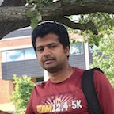
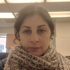

# Collaborators

### Andrew Severin

{: .align-left}
Andrew Severin is the manager of the Genome Informatics Facility. He assumed the position of manager of the new facility on September 1, 2011. He is an interdisciplinary scientist, working at the interface of genetics and bioinformatics. He earned his Ph.D. from Iowa State University in 2009.

### Sivanandan Chudalayandi

{: .align-left}
My expertise is in the field of molecular biology, genetics and computational biology, modern biological research routinely produce large scale data that aid in shedding light on a phenomena or point us in a newer research direction. As an Associate Scientist at the Genome Informatics Facility, I work as a bioinformatics liaison for the USDA community at large, I contribute to the community by way of tutorials, online discussions etc. I also collaborate with researchers in my capacity as computational biologist to perform data driven discovery.

### Rick E. Masonbrink
{: .align-left}
Currently, I am an associate scientist in the Genome Informatics Facility at Iowa State University, working with a group of amazing people. Here, I work on a multitude of projects, including a continuation of my previous research. Some of these projects involve:  characterizing the genomes of endangered abalone species, assessing the cellular roles of small RNAs in nematodes, creating user-friendly bioinformatics tutorials, assessing transposition in irradiated maize, trans-splicing in nematodes, etc.  With the huge variation of collaborative projects that come into the Genome Informatics Facility, the constant influx of novel ideas creates an environment conducive to my development as a contributing member of the scientific community.

### Maryam Sayadi
{: .align-left}
I have recently joined the Genome Informatics Facility at Iowa State University. I am mostly involved in generating and updating bioinformatics tutorials. My background is protein structure and function through molecular modeling simulations. My goal is a multidisciplinary approach involving protein interaction and structure and gene regulation.

### Arun S. Seetharam
{: .align-left}
My main interests are in the fields of bioinformatics and evolutionary genomics. Currently, I am working on various projects involving next-generation sequencing including the first de novo assembly of a teosinte genome. I am also developing pipelines to streamline the assembly and annotation process for newly sequenced organisms. My long-term goal is to study the genome organization and evolution of grass species.
