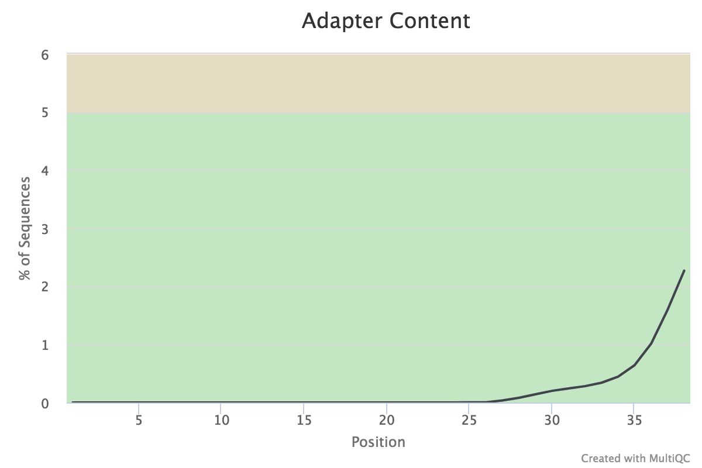

### ATAC-seq tutorial:
The data for this tutorial is based on this [paper](http://europepmc.org/backend/ptpmcrender.fcgi?accid=PMC5471679&blobtype=pdf). The author's describe a chromatin remodeling protein in Arabidopsis seedling morphogenesis. They have based their conclusions on a combination of CHIPseq, ATAC-seq, MNAseseq and FAIREseq. In this tutorial, we will work through the ATAC-seq dataset. Check the methods section in the paper for more about how the ATAC-seq


__Download fastq files directly from ENA website__
The fastq files for all the experiments described are available at the ENA website under the bioproject [PRJNA351855](https://www.ebi.ac.uk/ena/data/view/PRJNA351855)
 libraries were prepared. The ATAC-seq data is the only paired end libraries in the list. We can download it directly using wget.
 ```
 wget ftp://ftp.sra.ebi.ac.uk/vol1/fastq/SRR473/002/SRR4733912/SRR4733912_1.fastq.gz
 wget ftp://ftp.sra.ebi.ac.uk/vol1/fastq/SRR473/002/SRR4733912/SRR4733912_2.fastq.gz
 ```
__Download Arabidopsis Genome__
Before starting the alignment, we need the _Arabidopsis_ genome, which one can download from either [Araport](https://www.araport.org/data/araport11) or [EnsemblPlants](http://plants.ensembl.org/index.html).

We already have the _Arabidopsis_ genome downloaded, so we  make a `symbolic link or shortcut ` to it and then refer to the link for the making the index.

```
ln -s /path/to/Arabidopsis_thaliana.TAIR10.dna.toplevel.fa At_Genome
```
The shortcut we have made is __At_Genome__

We will use bowtie2 to align and the following section describes that aspect.

__Building the Genome Index__
We use environment modules in our cluster, so load the appropriate module and get going.
```
module load bowtie2
mkdir bwt_index
bowtie2-build At_Genome bwt_index/At.TAIR10
```
Because transposase adapters are used in ATAC-seq it is important to check for these adapter sequences and generally perform other quality checks. I

__Quality Check__
```
mkdir Quality_ATAC
module load fastqc
fastqc -o Quality_ATAC /path/to/atac_data/public/sra/*.gz
```
We found that the nextera adapters have already been removed before depositing the sequences. We also confirmed this with the authors.


 However, it was found that transposase adapters were present in large amounts the raw reads, we can remove them using one of many apter trimming programs, for example [cutadapt](http://cutadapt.readthedocs.io/en/stable/guide.html).


bowtie2:
bowtie2 --threads 8 -x bwt_index/At.TAIR10 -q -1 ATAC_paired/SRR4733912_1.fastq.gz -2 ATAC_paired/SRR4733912_2.fastq.gz -S bwt_out/SRR4733912.sam >& SRR473912.bwt.log&

convert SAM to bam and sort on the fly:

samtools view --threads 7 -bS SRR4733912.sam | samtools sort --threads 7 - > SRR4733912.sorted.bam 2>sam_bam_sorted.log&

[csiva@condo135 bwt_out]$ samtools view -H SRR4733912.sorted.bam
@HD     VN:1.0  SO:coordinate
@SQ     SN:1    LN:30427671
@SQ     SN:2    LN:19698289
@SQ     SN:3    LN:23459830
@SQ     SN:4    LN:18585056
@SQ     SN:5    LN:26975502
@SQ     SN:Mt   LN:366924
@SQ     SN:Pt   LN:154478
@PG     ID:bowtie2      PN:bowtie2      VN:2.2.6        CL:"/opt/rit/app/bowtie2/2.2.6/bin/bowtie2-align-s --wrapper basic-0 --threads 8 -x bwt_index/At.TAIR10 -q -S bwt_out/SRR4733912.sam -1 /tmp/26409.inpipe1 -2 /tmp/26409.inpipe2"

Build the index:
samtools index SRR4733912.sorted.bam

Remove reads aligning to Mt and Chloroplast:
samtools idxstats SRR4733912.sorted.bam | cut -f1 | grep -v Mt | grep -v Pt | xargs samtools view --threads 7 -b SRR4733912.sorted.bam > SRR4733912.sorted.noorg.bam 2> SRR.noorg.log&


I see > 5 million alignments to plastid and 3 million reads not aligned also many unmapped pairs on each chromosome
[csiva@condo135 bwt_out]$ samtools idxstats SRR4733912.sorted.noorg.bam
1       30427671        2018268 43655
2       19698289        2796545 47708
3       23459830        1738071 36100
4       18585056        1290746 26515
5       26975502        1795689 40246
Mt      366924  0       0
Pt      154478  0       0
*       0       0       3016596
[csiva@condo135 bwt_out]$ samtools idxstats SRR4733912.sorted.bam
1       30427671        2018268 43655
2       19698289        2796545 47708
3       23459830        1738071 36100
4       18585056        1290746 26515
5       26975502        1795689 40246
Mt      366924  2469591 35167
Pt      154478  44476436        524929
*       0       0       3016596

PEAK Calling:

 macs2 callpeak -t ../bwt_out/SRR4733912.sorted.noorg.bam -q 0.05 --broad -f BAMPE -n SRR4733912 -B --trackline --outdir . &>SRR4733912.peak.log&

[csiva@condo135 Peak_Calls]$ more SRR4733912.peak.log
INFO  @ Mon, 19 Feb 2018 15:21:58:
# Command line: callpeak -t ../bwt_out/SRR4733912.sorted.noorg.bam -q 0.05 --broad -f BAMPE -n SRR4733912 -B --trackline --outdir .
# ARGUMENTS LIST:
# name = SRR4733912
# format = BAMPE
# ChIP-seq file = ['../bwt_out/SRR4733912.sorted.noorg.bam']
# control file = None
# effective genome size = 2.70e+09
# band width = 300
# model fold = [5, 50]
# qvalue cutoff for narrow/strong regions = 5.00e-02
# qvalue cutoff for broad/weak regions = 1.00e-01
# Larger dataset will be scaled towards smaller dataset.
# Range for calculating regional lambda is: 10000 bps
# Broad region calling is on
# Paired-End mode is on

INFO  @ Mon, 19 Feb 2018 15:21:58: #1 read fragment files...
INFO  @ Mon, 19 Feb 2018 15:21:58: #1 read treatment fragments...
INFO  @ Mon, 19 Feb 2018 15:22:07:  1000000
INFO  @ Mon, 19 Feb 2018 15:22:16:  2000000
INFO  @ Mon, 19 Feb 2018 15:22:25:  3000000
INFO  @ Mon, 19 Feb 2018 15:22:34:  4000000
INFO  @ Mon, 19 Feb 2018 15:22:48: #1 mean fragment size is determined as 139 bp from treatment
INFO  @ Mon, 19 Feb 2018 15:22:48: #1 fragment size = 139
INFO  @ Mon, 19 Feb 2018 15:22:48: #1  total fragments in treatment: 4321009
INFO  @ Mon, 19 Feb 2018 15:22:48: #1 user defined the maximum fragments...
INFO  @ Mon, 19 Feb 2018 15:22:48: #1 filter out redundant fragments by allowing at most 1 identical fragment(s)
INFO  @ Mon, 19 Feb 2018 15:22:54: #1  fragments after filtering in treatment: 4002590
INFO  @ Mon, 19 Feb 2018 15:22:54: #1  Redundant rate of treatment: 0.07
INFO  @ Mon, 19 Feb 2018 15:22:54: #1 finished!
INFO  @ Mon, 19 Feb 2018 15:22:54: #2 Build Peak Model...
INFO  @ Mon, 19 Feb 2018 15:22:54: #2 Skipped...
INFO  @ Mon, 19 Feb 2018 15:22:54: #2 Use 139 as fragment length
INFO  @ Mon, 19 Feb 2018 15:22:54: #3 Call peaks...
INFO  @ Mon, 19 Feb 2018 15:22:54: #3 Call broad peaks with given level1 -log10qvalue cutoff and level2: 1.301030, 1.000000...
INFO  @ Mon, 19 Feb 2018 15:22:54: #3 Pre-compute pvalue-qvalue table...
INFO  @ Mon, 19 Feb 2018 15:23:08: #3 In the peak calling step, the following will be performed simultaneously:
INFO  @ Mon, 19 Feb 2018 15:23:08: #3   Write bedGraph files for treatment pileup (after scaling if necessary)... SRR4733912_treat_pileup.bdg
INFO  @ Mon, 19 Feb 2018 15:23:08: #3   Write bedGraph files for control lambda (after scaling if necessary)... SRR4733912_control_lambda.bdg
INFO  @ Mon, 19 Feb 2018 15:23:08: #3 Call peaks for each chromosome...
INFO  @ Mon, 19 Feb 2018 15:23:44: #4 Write output xls file... ./SRR4733912_peaks.xls
INFO  @ Mon, 19 Feb 2018 15:23:44: #4 Write broad peak in broadPeak format file... ./SRR4733912_peaks.broadPeak
INFO  @ Mon, 19 Feb 2018 15:23:44: #4 Write broad peak in bed12/gappedPeak format file... ./SRR4733912_peaks.gappedPeak
INFO  @ Mon, 19 Feb 2018 15:23:44: Done!


bioawk -c fastx '{print $name, length($seq)}' ../At_Genome > At_chr.sizes

Clipped the bed graph files:
bedtools slop -i SRR4733912_treat_pileup.bdg -g At_chr.sizes -b 0 | /work/GIF4/usha/bedClip stdin At_chr.sizes SRR4733912_treat_pileup.clipped.bdg

sorted the clipped files:
sort -k1,1 -k2,2n SRR4733912_treat_pileup.clipped.bdg > SRR4733912_treat_pileup.clipped.sorted.bdg

convert to bigwig:
/work/GIF4/usha/bedGraphToBigWig SRR4733912_treat_pileup.clipped.sorted.bdg At_chr.sizes SRR4733912_treat_pileup.clipped.sorted.bw
