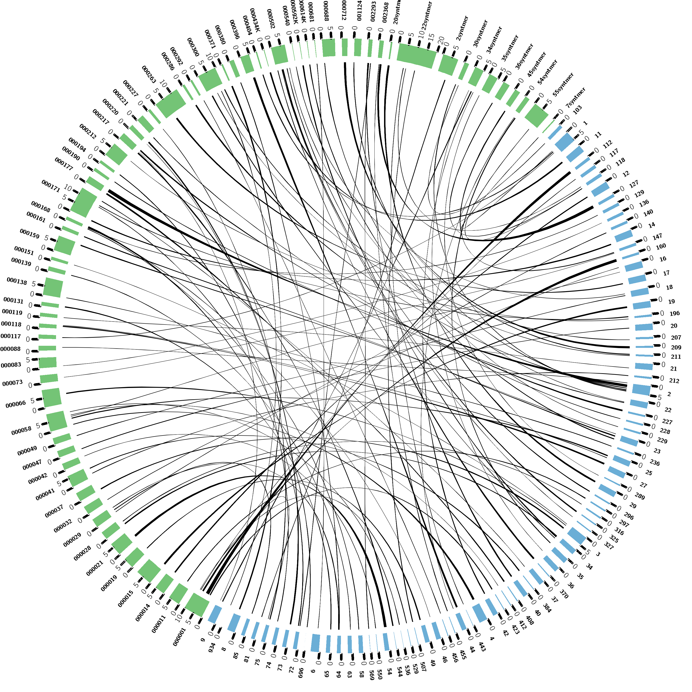

# Opscan Ortholog Calling Tutorial
Opscan is a software that will call orthologous genes between two sets of genes, a prerequisite for constructing synteny between species.
There are many other software options out there that can provide ortholog calling capabilities, including BLAST, OrthoMCL, OrthoFinder, etc.  However, Opscan offers some unique benefits and is extremely fast. (20mins on 30k genes)
Opscan was published was also published as part of a synteny software, thus corroborating its use for such  [Opscan Publication](https://www.ncbi.nlm.nih.gov/pmc/articles/PMC3961402/).

##### Synopsis from Opscan manual
"Fastp then NWS (without end gap penalties) operon search in genome
database starting with an operon file. Can be used with
a genome database instead of an operon in genome versus
genome comparisons.""


### Download the program files
```
#available here http://www.lcqb.upmc.fr/CHROnicle/SynChro.html
wget http://www.lcqb.upmc.fr/CHROnicle/telechargements/SynChro_linux.zip
unzip SynChro_linux.unzip
The relevant program file can be found in the downloaded folder directory
/1SynChro/Opscan/bin/opscan
```

### Create the input files
Opscan uses two files that you will need to create from a predicted protein fasta file of the genes and a gff annotating gene positions in the genome.
```
:Usage of opscan
Opscan [options] -O <operon.db> [<genome.db>]

:Files that need to be created from the gff and and protein fasta for each species
1.  operon.db
2.  genome.db
```

### Acquire your gff and gene fasta.
Note: it is good to make sure that no repetitive elements (Transposons,etc) are not called in your gene set.  This can cause downstream errors with synteny.

Sample 1 protein fasta
```
>GPLIN_000192700 transcript_id=GPLIN_000192700 gene_id=GPLIN_000192700
MSGRGRGGGFVPKKRLNISNQIGINESQQMTAIIQKDEQPKKDMQKDEQSKKDIQKDEQS
KKDIQKDELPKKEESKESLEKQPAERLQQQHPPPPIVHHNQKEHHHIVARKQPVVCFYCK
YEGHMLADCEKRMHMEAKKKAAQIVPRVVNYTFRRTTSQERSGGVGAVSAVTVSPNENSS
FDVFTKPYEGGQSEDDDVATGEDDEEKENDVNEEEKKNAEEERGKDGGKEEQKDEEGTGD
EHHRQQKQEQPLKDVVAAGLVNDGQQEQHQRKKATTASSKKPLVVVPLPVPVSTVKAQVQ
LRSKLLSSNSAGGSPAATSPVVVNPRSESSEEEDDEEVVETPEEDNGSCGEEVGGQSKTI
VTSSATASEETAPPKTEGTEGLEKLVQKLNMDEVDTQDEHLQPEKGGGEDELETVSVKVD
GCVEFDSDSSSYYDCSDGEGGGDGRRLKRIVEEDEYYGEHGALLDLEDDEPAVVGLAAEA
VDTKNEGEEPQQEEGAETDSY
>GPLIN_001029200 transcript_id=GPLIN_001029200 gene_id=GPLIN_001029200
MALVNGKCKHFCRLIKCWLHELAIMKMEQKQYIKNFNFVLKLSEFSLSYYEVYKVLEAIL
IESNAASAIITNERPPAVHTFLKQHFISKLYRKSIKLKQYIRLKFGSNMNKVDCAFVHFG
REMERRLEENSFISYPRFSEYVEQMEEEKCGEAPHNQNTQNTTDLGSKQLAMKLFHEPLW
NYARAIQIDSHECKAVLQFADALRP
>GPLIN_001497500 transcript_id=GPLIN_001497500 gene_id=GPLIN_001497500
MVENATVAATTTDFPPTPTGSTPEGPLNRMGNFLAGLVGGEHQQQLQQTTTPGANASDHE
ALSNNDRVANASSTVSANIDAGGIATTVTPPLDNTTSNVFSSTTEMSPSIVEGPEVEVWN
FAEGMDNMTTPSSTSSTTTERPPVPASAAVALNAWAVNLVASAAVVAVVFFRSF
>GPLIN_001590800 transcript_id=GPLIN_001590800 gene_id=GPLIN_001590800
MKGRWRPANSEHAVTEQVVVRDGGRRKKSDERHWGASARGPAERAHGDPQPGHARTSSGA
RSLAPPTGRRSRVCGTLAAIFHLTV
>GPLIN_000513900 transcript_id=GPLIN_000513900 gene_id=GPLIN_000513900
MEEVAASTPTSRDQSQTRHIRHRKGSDHFEPMYNQQLFVNIENSIGGSAHQSTSNLMHSP
KNVFENGQSQLVLELIGTEEEKPRYYSMPPEVQSEPAVIKLMQSGKKLHIYEGHIFVAVK
PRGRDNMDVYKQQHFQHEHRGSGLARILEAQPS
>GPLIN_000179500 transcript_id=GPLIN_000179500 gene_id=GPLIN_000179500
MSDNPKKVEKRLKEIFICDDVLFAVFKFCGPFELGLKVALISDRFDLLVDAHFKSMEWSL
GCLEIHSATDGSGAEIVKCLSNNGQVERRLPIPQEALPDNVIGFKRLEISYMDQSVIEFF
YRIRRLFASNGISLLISTKTNQKRSWEIIWQRIWPLINDNICGLFSLFPYNLERLRRFSP
TILRDCAKLRMIYSNNLFLKLSADDSAGASSEQALAKWLHTPRGDGLPKEFDNSAEPVNF
IIRFWHCYSDDIMPFELKNILTGERLVLRQINDFEWLLVRCRIERDEDKWTEWENKAVEG
DWRQRFAILFRDSAIGDG
>GPLIN_000089400 transcript_id=GPLIN_000089400 gene_id=GPLIN_000089400
MQQWGTSDIWKGLELDEHDCHAYFDGCQTYSCVDENGDQIFVVNSCVPDIGNCTHSDLDS
ICTKDGGTPKCEICYNGLCNKAKIELKKPLLKTVQKPNNPPETGTGGAKDKSSSEENGMT
TGAKNESSSEKNGMTTGAKNESSSEENGTTGAKASSTPAD
>GPLIN_000832600 transcript_id=GPLIN_000832600 gene_id=GPLIN_000832600
MLSNNFSILFVLLLVLIENNFIFAKSTRTPRTTTATASDEELDEIVNSISETPKNDGDDN
LSTSNEIFELGANSPTTNNGKNQYSASSHDSDEQQQQLALPKMRTEGNFTILPPPILTTE
QIDAIARQSAAMITRSALKHSKEIFAKFAPDSWTEALADVPLSTIRCTVRVSTKVRLLQQ
QAFLHEHLSFTLNNENEDDDTEADVISDGSDRETTTTTTTSNSNGGTPFGAEEASEIRSH
DQAAKTINETIRQLPPHVRQTLEEYGKRFKNQSLYLGGAEAVASIKSILVDLLEELKSVT
SEEREQLGDLFPKLRNVVTPLHTPV
>GPLIN_000567000 transcript_id=GPLIN_000567000 gene_id=GPLIN_000567000
MKTNKRQKVSSSEEEFDPNQKGEDYDLFMDNEEREKFDKMTEKEREIEIYKRLEQREIMK
TREKIKKKLEMAAGKKADEEGSSSQKKRKRKISEESNEGNDDEKEDSPSEAGEVDSSSDE
PKESSSSKGPVKAEPDESDGEIDADYHKPSEVANKQSKKKAMAELLSKRRNKRQTEEKRK
KETLKATLDLDEVFGNEDEEGKSASSSSSSTSSSRSSSPDLGKSRSPSPVAKQEIHTRDE
LIRCQLFRRKLAKFVHAPFFAKTVVGCFVRISIGPNKLDGKQVYRVVEVVETAKIYEVEP
NSDIRTNKGFRLKVCDGEPMRVYRLEFISNSHIVESEFLFWLNKLRSTNTPVPTVDFVDR
KRKEIVDALIYNYNESEVNLLIKEKQRFKRQPTNFAFQKAELLKIKVGG
etc.
```
Sample 1 genome gff
```
##gff-version 3
##sequence-region pathogens_Gpal_scaffold_1 1 599721
# Gene gene:GPLIN_000000100
pathogens_Gpal_scaffold_1       WormBase_imported       gene    32      1060    .       +       .       ID=gene:GPLIN_000000100;Name=GPLIN_000000100;biotype=protein_coding
pathogens_Gpal_scaffold_1       WormBase_imported       mRNA    32      1060    .       +       .       ID=transcript:GPLIN_000000100;Parent=gene:GPLIN_000000100;Name=GPLIN_000000100
pathogens_Gpal_scaffold_1       WormBase_imported       exon    32      166     .       +       .       ID=exon:GPLIN_000000100.1;Parent=transcript:GPLIN_000000100
pathogens_Gpal_scaffold_1       WormBase_imported       exon    483     585     .       +       .       ID=exon:GPLIN_000000100.2;Parent=transcript:GPLIN_000000100
pathogens_Gpal_scaffold_1       WormBase_imported       exon    685     792     .       +       .       ID=exon:GPLIN_000000100.3;Parent=transcript:GPLIN_000000100
pathogens_Gpal_scaffold_1       WormBase_imported       exon    837     1060    .       +       .       ID=exon:GPLIN_000000100.4;Parent=transcript:GPLIN_000000100
pathogens_Gpal_scaffold_1       WormBase_imported       CDS     32      166     .       +       0       ID=cds:GPLIN_000000100;Parent=transcript:GPLIN_000000100
pathogens_Gpal_scaffold_1       WormBase_imported       CDS     483     585     .       +       0       ID=cds:GPLIN_000000100;Parent=transcript:GPLIN_000000100
pathogens_Gpal_scaffold_1       WormBase_imported       CDS     685     792     .       +       2       ID=cds:GPLIN_000000100;Parent=transcript:GPLIN_000000100
pathogens_Gpal_scaffold_1       WormBase_imported       CDS     837     1060    .       +       2       ID=cds:GPLIN_000000100;Parent=transcript:GPLIN_000000100
###
# Gene gene:GPLIN_000000200
pathogens_Gpal_scaffold_1       WormBase_imported       gene    47003   48028   .       +       .       ID=gene:GPLIN_000000200;Name=GPLIN_000000200;biotype=protein_coding
pathogens_Gpal_scaffold_1       WormBase_imported       mRNA    47003   48028   .       +       .       ID=transcript:GPLIN_000000200;Parent=gene:GPLIN_000000200;Name=GPLIN_000000200;info=method:InterPro accession:IPR012677 description:Nucleotide-binding%2C alpha-beta plait %0Amethod:InterPro accession:IPR015047 description:Domain of unknown function DUF1866
pathogens_Gpal_scaffold_1       WormBase_imported       exon    47003   47013   .       +       .       ID=exon:GPLIN_000000200.1;Parent=transcript:GPLIN_000000200
pathogens_Gpal_scaffold_1       WormBase_imported       exon    47446   47475   .       +       .       ID=exon:GPLIN_000000200.2;Parent=transcript:GPLIN_000000200
pathogens_Gpal_scaffold_1       WormBase_imported       exon    47527   47655   .       +       .       ID=exon:GPLIN_000000200.3;Parent=transcript:GPLIN_000000200
pathogens_Gpal_scaffold_1       WormBase_imported       exon    47711   47888   .       +       .       ID=exon:GPLIN_000000200.4;Parent=transcript:GPLIN_000000200
pathogens_Gpal_scaffold_1       WormBase_imported       exon    47942   48028   .       +       .       ID=exon:GPLIN_000000200.5;Parent=transcript:GPLIN_000000200
pathogens_Gpal_scaffold_1       WormBase_imported       CDS     47003   47013   .       +       0       ID=cds:GPLIN_000000200;Parent=transcript:GPLIN_000000200
pathogens_Gpal_scaffold_1       WormBase_imported       CDS     47446   47475   .       +       1       ID=cds:GPLIN_000000200;Parent=transcript:GPLIN_000000200
pathogens_Gpal_scaffold_1       WormBase_imported       CDS     47527   47655   .       +       1       ID=cds:GPLIN_000000200;Parent=transcript:GPLIN_000000200
pathogens_Gpal_scaffold_1       WormBase_imported       CDS     47711   47888   .       +       1       ID=cds:GPLIN_000000200;Parent=transcript:GPLIN_000000200
pathogens_Gpal_scaffold_1       WormBase_imported       CDS     47942   48028   .       +       0       ID=cds:GPLIN_000000200;Parent=transcript:GPLIN_000000200
###
# Gene gene:GPLIN_000000300
pathogens_Gpal_scaffold_1       WormBase_imported       gene    48851   67668   .       -       .       ID=gene:GPLIN_000000300;Name=GPLIN_000000300;biotype=protein_coding
pathogens_Gpal_scaffold_1       WormBase_imported       mRNA    48851   67668   .       -       .       ID=transcript:GPLIN_000000300;Parent=gene:GPLIN_000000300;Name=GPLIN_000000300;info=method:InterPro accession:IPR001452 description:SH3 domain %0Amethod:InterPro accession:IPR002017 description:Spectrin repeat %0Amethod:InterPro accession:IPR002048 description:EF-hand domain %0Amethod:InterPro accession:IPR011992 description:EF-hand domain pair %0Amethod:InterPro accession:IPR013315 description:Spectrin alpha chain%2C SH3 domain %0Amethod:InterPro accession:IPR014837 description:EF-hand%2C Ca insensitive %0Amethod:InterPro accession:IPR018159 description:Spectrin/alpha-actinin %0Amethod:InterPro accession:IPR018247 description:EF-Hand 1%2C calcium-binding site
pathogens_Gpal_scaffold_1       WormBase_imported       exon    67540   67668   .       -       .       ID=exon:GPLIN_000000300.1;Parent=transcript:GPLIN_000000300
pathogens_Gpal_scaffold_1       WormBase_imported       exon    66788   66928   .       -       .       ID=exon:GPLIN_000000300.2;Parent=transcript:GPLIN_000000300
pathogens_Gpal_scaffold_1       WormBase_imported       exon    66320   66394   .       -       .       ID=exon:GPLIN_000000300.3;Parent=transcript:GPLIN_000000300
pathogens_Gpal_scaffold_1       WormBase_imported       exon    65702   65926   .       -       .       ID=exon:GPLIN_000000300.4;Parent=transcript:GPLIN_000000300
pathogens_Gpal_scaffold_1       WormBase_imported       exon    65138   65239   .       -       .       ID=exon:GPLIN_000000300.5;Parent=transcript:GPLIN_000000300
pathogens_Gpal_scaffold_1       WormBase_imported       exon    64951   65084   .       -       .       ID=exon:GPLIN_000000300.6;Parent=transcript:GPLIN_000000300
pathogens_Gpal_scaffold_1       WormBase_imported       exon    64486   64675   .       -       .       ID=exon:GPLIN_000000300.7;Parent=transcript:GPLIN_000000300
pathogens_Gpal_scaffold_1       WormBase_imported       exon    63771   63983   .       -       .       ID=exon:GPLIN_000000300.8;Parent=transcript:GPLIN_000000300
pathogens_Gpal_scaffold_1       WormBase_imported       exon    63423   63504   .       -       .       ID=exon:GPLIN_000000300.9;Parent=transcript:GPLIN_000000300
pathogens_Gpal_scaffold_1       WormBase_imported       exon    63059   63231   .       -       .       ID=exon:GPLIN_000000300.10;Parent=transcript:GPLIN_000000300
pathogens_Gpal_scaffold_1       WormBase_imported       exon    62815   62997   .       -       .       ID=exon:GPLIN_000000300.11;Parent=transcript:GPLIN_000000300
pathogens_Gpal_scaffold_1       WormBase_imported       exon    62428   62760   .       -       .       ID=exon:GPLIN_000000300.12;Parent=transcript:GPLIN_000000300
pathogens_Gpal_scaffold_1       WormBase_imported       exon    62027   62096   .       -       .       ID=exon:GPLIN_000000300.13;Parent=transcript:GPLIN_000000300
pathogens_Gpal_scaffold_1       WormBase_imported       exon    61825   61931   .       -       .       ID=exon:GPLIN_000000300.14;Parent=transcript:GPLIN_000000300
pathogens_Gpal_scaffold_1       WormBase_imported       exon    61173   61397   .       -       .       ID=exon:GPLIN_000000300.15;Parent=transcript:GPLIN_000000300
pathogens_Gpal_scaffold_1       WormBase_imported       exon    60831   60998   .       -       .       ID=exon:GPLIN_000000300.16;Parent=transcript:GPLIN_000000300
pathogens_Gpal_scaffold_1       WormBase_imported       exon    60548   60676   .       -       .       ID=exon:GPLIN_000000300.17;Parent=transcript:GPLIN_000000300
pathogens_Gpal_scaffold_1       WormBase_imported       exon    60396   60505   .       -       .       ID=exon:GPLIN_000000300.18;Parent=transcript:GPLIN_000000300
pathogens_Gpal_scaffold_1       WormBase_imported       exon    59946   60017   .       -       .       ID=exon:GPLIN_000000300.19;Parent=transcript:GPLIN_000000300
pathogens_Gpal_scaffold_1       WormBase_imported       exon    59768   59858   .       -       .       ID=exon:GPLIN_000000300.20;Parent=transcript:GPLIN_000000300
pathogens_Gpal_scaffold_1       WormBase_imported       exon    59561   59647   .       -       .       ID=exon:GPLIN_000000300.21;Parent=transcript:GPLIN_000000300
pathogens_Gpal_scaffold_1       WormBase_imported       exon    59294   59428   .       -       .       ID=exon:GPLIN_000000300.22;Parent=transcript:GPLIN_000000300
pathogens_Gpal_scaffold_1       WormBase_imported       exon    58935   59069   .       -       .       ID=exon:GPLIN_000000300.23;Parent=transcript:GPLIN_000000300
pathogens_Gpal_scaffold_1       WormBase_imported       exon    58749   58892   .       -       .       ID=exon:GPLIN_000000300.24;Parent=transcript:GPLIN_000000300
etc.
```

Sample 2 Protein fasta
```
>g1.t1
CWIQKIADGNEWKREPLVHFAKVVWLDLMRASLIASHCANVIYAGKQTDIDIDHRTIKLRLQEITAHLANWIAKMLEITWPTISRTRAKSAIGDSDIAES
KEAYQSVAEKIKEELGQFGAEKYDYAVIVFPNWTNPEAKAIICEANSCFELIDVKQINVIVVRIEDNETNFELACKANEWFTPRMESIMKNTIRMWWERQ
KELKLSDLANMLKEWLQFYRHLVLIHNWKFFSSAATITLGVTPTFVRSARAEKGFNHKIDPTFAEAEIFHVHMLL
>g2.t1
MAQIVNLISFLTLVISWPNALSSDTEAVKELATQFSSLTSSTWDIVNQLRFVSENAMEFVRAAGAVGAIIGRAVDIEFGPESDEQKAIKELHEFIKTKFE
ALQRHRQQESNAIKHNFIGTDYQNVLKI
>g3.t1
MKHNLVEKCQLPSQEQMERYAAVLELFQKIEQRHLLLLNQNDVILVEKYKSIKSSILAKSAVAPMQDKLNTILNSANSADEVWQALIKLNMDFHYAENTC
WIQSIADGNEWKREPLFHFAQLVCLDLMKMSLIALHCVNIMYAGKAIEHTLRQIELMLQEIASHMADWIAKMLEITWPTISRIYAKSAIGVSPIKESKDG
YQFVAEKIKEELVQFGAEKYDYAVIVFPNWTDPEAMAIISEANSYFELIDVKQINVIVVRIEDNETNFELACKAAEWFTPRIETKMKEAIKMWWDHKRHL
KLSDLADMLKEWLQFYRNLVLVHNWKFFSSAATITLGVTPTFVRSARAEKGFRHKIVPALFDAEIFHVHMLL
>g4.t1
MRAKCRKVRPKKDGDKMPKVMPKKGGDKMPTKWDKTPKNAGQKRMGQNAGKCCAAKKDGQMAKTKCGVGGVPILPREMGQNAGKPCPDDIRTTSVAIRRT
AHGHCMSFDVRDEFFDQSGVGIRFFVLILPRNGTNMMRMETLRETVEVDELIQNNLTIYNRITQRDEPFSRICRRFCTINEPVRLFYDGFKDHQRRVAKH
QQPSHNVQLDYPTSTVFGQRINIQPNFFGIHFANTTSSSSSEASSSNRFTNMDSVEMVVLLYRAERIGGWKDDDISDYEMSISNYFKDKYIGQHIRVLTI
STSYVQVEVDRAGNIIRSYFGFGLAVMILCSLFSNSLSAFFMHQFSIYKLPVAVFACLCPFMASGTALGILFFAGVRHSSILAVTPFLILALGVDDAFLM
IHSWQLASKRRRHEGGRAVMAHDALSVNLAVVDQLAEVLEDTGPAILISTLTNIFADLVGAFLGSEEITLLCIGNIASIIVDFFYQITLFTAVLVICARR
ELISARKRDNNKIHATNSNNLSEDDVKPTKSGGFRHSLERKFNAFKDIYICLISSLLVCIVWAAFLVVCLNALLKFEINLTLKKLFPPDSPLLEIEKYRE
EKVLPFYTTAQLFVNNPGDLSNATRRAHLNGLIDEMEHLKYAYPAESSLYFVRTYEEFLHGDSAGILDAAAEEENAKNGTATNEFDLSELETFLNWPEFR
HWRGLLKYHHTTHPQQEQSAESQGNGTELTLATNRSDGTQLDAMMTTVAYHGDELQDWYNRALMLREWRQVVDKYVPEFNVSVLHDDGLYLDLLETWYGR
GRMGKTIWYGRGEWGNATWYGRGNGDRENGTPINIWQSVVVTLLCMAAICGLFMCNMFVVFVTTCVIASIFIETLGIMALMDMTMDPVVMAAVTISIGFS
VDMPAHVSYHFHAAKWAGTLGGQNVHGIADQSVEHKIRHAFTSVGFPALQASICTCICVLSLAFVKIYTAQVFVRVLCVCIVLCAVHSLFLLPALFTFLD
AICKLFRQFMCQRR
>g5.t1
MNDNDRAISNHRQKQQQQQGGDINGAIVINNFTDQQHQHQQQQRQLINSAIHRRHRRHPRPRHPPLPTVTRRPNRFPPAAPSVSMRSLRVPIAAGPILWW
HIRTKLCSYASS
>g6.t1
MSELYLALQGEQCYYTVPSIHKGFNVKNLPFECPSFSIALEQQLQQIVDFSGCVKAIETWKAEHMYNRTDCLDSVKKAILESIIDAYNIYQNEADRMHRE
NVLHKYSHSIADLCAFVRTWQQRLNHLLGLLQKSDGLCGLEMMNVLFGQWTFQCCINDWRYRTIETALLAGSSAMHQLLVSWLLDAKLAPAALTRWFIRP
KFVPSSDDPNESQLQRPRHSFNNSVLSAAQLTMNGSANALNMSIAANTTTNYQNELCLFEAPPPTADAVIMASATTMTRNSASFFGTTTAGSDAASIGTG
TGTFVVAAAGAVVEDRIGWASQQQLILSVQLDTDVLPAPFYGCEELLNMIMDIGRKVHFLKMLRPAHANNEQQQSLCAQLPTNVWCTPSAIGRMATILRQ
MHAVVSEEMGRELMGRQRLMDHLCLVHGYFFMLRGDFASALEHILFIKTAKTTATKKCATPFSSRKNVSHSTKIAEKCVNDALAMCSPPANVADLMHLLC
GVKLTKREQMKCKIFSEKFMLKSRLREGQRNEFQAVAEFFSTNALRAYKRVFGFVSNLQLQRAQLDYTGQNLLRVVRQRLATRSEYRSSFYSMLIILQKV
RMFLNRLAHYVFEEVLLLESIYIFDKVRATKDPHVLLAGLYPLLSGVLLALFLPSALSKLHESVQQCIRNASDFVGSISKFCVFIEHSDSDVLDALLLAS
TDDDDDGTATNDDRDTNKNISNQHQQDDEDGTDHRHDVLSNGHPHHQQNCNANNDDCCDGIEQRENQPPPSEEEEEGQQQRAQQQQQQAQKVVTYNNTNS
NDNSSANGLRSAAENRNNSRTTDADQQQFHSVVFAISDSNVNFEASVAKLRNDLATLLAECSSSETKSRYFTPYWSKLNALLFHD
>g7.t1
MPWRTFESYTANDQNAQSFLVSLTEFLSPYAEIDQDKAGVSPEELRAAFFRCGGVNAHSWRILVLAAEGDNETTKFIGKLLDFLTAEGTSAPLTNCPPAA
APPNSQLANPPLQHQAGTSQASQFPFSAAIHSQSGLTCRQEVVGGIAGLKTPPDHIYDTISSSSSADDSHSPHKKLSTLPGHIYHTVMTTTSDGSQCSSV
FYDVPPPSSTIPRESVTTTPPPVPQHTSVVRPMSTSSTDGSQRSSVIYDVPPTPPPPVPQHTHGGEKNRKKNETPSPASKCSDAKKKRKETPKKDSDGKN
>g8.t1
MSKRRLRQELQDMVKNPLPEGCTARPLDQRTMNSWTVTIRGRAGTPYANGNFQLSMAFPRDYPFKAPQVTFTTRIFHPNIDTRGKVCLDILQTHWAPTLT
IEKVVISIIVLLNDPNPDNSPINAQAASLYRTDRAEFNRRAREMTLAYAR
>g9.t1
MNSFLFQPKAGAAVPTPQTSAAGGPPGAAEAPLSVKSSEKSGGTKKGPTPNASTMSRSLTYKPHVVSKDLALLQSEPNYGTLAGLDKEIFAKEQQAKGGM
PPPPMGAPQPQQQAPGPAMTPTTDPNYWTLKNLDADIFTKNAPAKPAAAPKAGPAPHGGGGQALTPTTDPNYGTLQNLDAEIFVKK
>g10.t1
MDQLPVTTTEITAAMANDQPLQTVLQFLRNRWPAKSTDSEISPYFPKRDKIFEVDNFLLYEDRVIVPTSLRSRILKALHIAHPGIVRMKELARRHVYWPG
MDSAIEKVVSTCEECQLGQKKPTKASLSPWPTTDKVFQRVHVDFAGPCSDGRQYLILIDSFSKWPEVYRMNTISAYATVFVLRSIIFQLGIPEEIVSDNG
TQFRSAEFATFCKEFGIKHIFTPPFHPQSNGQVERFVDTFKRSMKKMSKGEKDWIEKMLFAYRTTPHVALDGFSPDQLFFSRKLRTKLTLIHPKGEKAEN
FDQNSFKKGQSKYTDKMAQNFDRKHGSKLTNFFPNDHVLLINYRNNKTEWLQGKIVERLHNSLFHLNKICLSQPIPRW
>g11.t1
MYRHNLASAHNFLLCLILIVSAAYYDSSATAAHTIIISVLHHTSSSSVYWGQSAWKFCYAFGAHIDHRKGGFDRVLDLDYIIRAHQAVPNGVRYFANGRL
IKVFSAHAMLIRATPQQH
>g12.t1
MLGLRIPRNSPLLFNCCVSPPKSEFARFHVARSMTSGPSNFRHAFDHLIKSQQRRHYASGAMPKYTYNNRKADAILPDKWGAIFFLACSQSR
>g13.t1
MLGLRIPRNSSLLFNCCVSPPKSEFARFHVARSMISGPSNFRHAFDHLIKSQQRRHYASGAMPKYTYNNRKADALLPDKWGAIVFFGFFGLFIGYPIYGD
etc.
```
Sample 2 genome gff
```
000080K AUGUSTUS        gene    1       3549    0.8     +       .       ID=g1;
000080K AUGUSTUS        mRNA    1       3549    0.8     +       .       ID=g1.t1;Parent=g1
000080K AUGUSTUS        intron  1       355     0.8     +       .       Parent=g1.t1;
000080K AUGUSTUS        CDS     356     449     0.95    +       1       ID=g1.t1.CDS1;Parent=g1.t1
000080K AUGUSTUS        exon    356     449     .       +       .       ID=g1.t1.exon1;Parent=g1.t1;
000080K AUGUSTUS        intron  450     1162    1       +       .       Parent=g1.t1;
000080K AUGUSTUS        CDS     1163    1297    1       +       0       ID=g1.t1.CDS2;Parent=g1.t1
000080K AUGUSTUS        exon    1163    1297    .       +       .       ID=g1.t1.exon2;Parent=g1.t1;
000080K AUGUSTUS        intron  1298    2313    1       +       .       Parent=g1.t1;
000080K AUGUSTUS        CDS     2314    2450    1       +       0       ID=g1.t1.CDS3;Parent=g1.t1
000080K AUGUSTUS        exon    2314    2450    .       +       .       ID=g1.t1.exon3;Parent=g1.t1;
000080K AUGUSTUS        intron  2451    2838    1       +       .       Parent=g1.t1;
000080K AUGUSTUS        CDS     2839    3054    1       +       1       ID=g1.t1.CDS4;Parent=g1.t1
000080K AUGUSTUS        exon    2839    3054    .       +       .       ID=g1.t1.exon4;Parent=g1.t1;
000080K AUGUSTUS        intron  3055    3248    1       +       .       Parent=g1.t1;
000080K AUGUSTUS        CDS     3249    3385    1       +       1       ID=g1.t1.CDS5;Parent=g1.t1
000080K AUGUSTUS        exon    3249    3385    .       +       .       ID=g1.t1.exon5;Parent=g1.t1;
000080K AUGUSTUS        intron  3386    3439    1       +       .       Parent=g1.t1;
000080K AUGUSTUS        CDS     3440    3549    1       +       2       ID=g1.t1.CDS6;Parent=g1.t1
000080K AUGUSTUS        exon    3440    3549    .       +       .       ID=g1.t1.exon6;Parent=g1.t1;
000080K AUGUSTUS        stop_codon      3547    3549    .       +       0       Parent=g1.t1;
000080K AUGUSTUS        gene    9538    11185   0.39    +       .       ID=g2;
000080K AUGUSTUS        mRNA    9538    11185   0.39    +       .       ID=g2.t1;Parent=g2
000080K AUGUSTUS        start_codon     9538    9540    .       +       0       Parent=g2.t1;
000080K AUGUSTUS        CDS     9538    9558    0.98    +       0       ID=g2.t1.CDS1;Parent=g2.t1
000080K AUGUSTUS        exon    9538    9558    .       +       .       ID=g2.t1.exon1;Parent=g2.t1;
000080K AUGUSTUS        intron  9559    9604    0.99    +       .       Parent=g2.t1;
000080K AUGUSTUS        CDS     9605    9653    0.98    +       0       ID=g2.t1.CDS2;Parent=g2.t1
000080K AUGUSTUS        exon    9605    9653    .       +       .       ID=g2.t1.exon2;Parent=g2.t1;
000080K AUGUSTUS        intron  9654    10139   0.99    +       .       Parent=g2.t1;
000080K AUGUSTUS        CDS     10140   10306   0.97    +       2       ID=g2.t1.CDS3;Parent=g2.t1
000080K AUGUSTUS        exon    10140   10306   .       +       .       ID=g2.t1.exon3;Parent=g2.t1;
000080K AUGUSTUS        intron  10307   11035   0.85    +       .       Parent=g2.t1;
000080K AUGUSTUS        CDS     11036   11185   0.39    +       0       ID=g2.t1.CDS4;Parent=g2.t1
000080K AUGUSTUS        exon    11036   11185   .       +       .       ID=g2.t1.exon4;Parent=g2.t1;
000080K AUGUSTUS        stop_codon      11183   11185   .       +       0       Parent=g2.t1;
000080K AUGUSTUS        gene    13004   16505   0.55    +       .       ID=g3;
000080K AUGUSTUS        mRNA    13004   16505   0.55    +       .       ID=g3.t1;Parent=g3
000080K AUGUSTUS        start_codon     13004   13006   .       +       0       Parent=g3.t1;
000080K AUGUSTUS        CDS     13004   13166   0.55    +       0       ID=g3.t1.CDS1;Parent=g3.t1
000080K AUGUSTUS        exon    13004   13166   .       +       .       ID=g3.t1.exon1;Parent=g3.t1;
000080K AUGUSTUS        intron  13167   13250   0.93    +       .       Parent=g3.t1;
000080K AUGUSTUS        CDS     13251   13301   0.93    +       2       ID=g3.t1.CDS2;Parent=g3.t1
000080K AUGUSTUS        exon    13251   13301   .       +       .       ID=g3.t1.exon2;Parent=g3.t1;
000080K AUGUSTUS        intron  13302   13442   0.93    +       .       Parent=g3.t1;
000080K AUGUSTUS        CDS     13443   13524   0.94    +       2       ID=g3.t1.CDS3;Parent=g3.t1
000080K AUGUSTUS        exon    13443   13524   .       +       .       ID=g3.t1.exon3;Parent=g3.t1;
000080K AUGUSTUS        intron  13525   13784   0.96    +       .       Parent=g3.t1;
000080K AUGUSTUS        CDS     13785   13878   0.99    +       1       ID=g3.t1.CDS4;Parent=g3.t1
000080K AUGUSTUS        exon    13785   13878   .       +       .       ID=g3.t1.exon4;Parent=g3.t1;
000080K AUGUSTUS        intron  13879   13943   1       +       .       Parent=g3.t1;
000080K AUGUSTUS        CDS     13944   14072   1       +       0       ID=g3.t1.CDS5;Parent=g3.t1
000080K AUGUSTUS        exon    13944   14072   .       +       .       ID=g3.t1.exon5;Parent=g3.t1;
000080K AUGUSTUS        intron  14073   15000   1       +       .       Parent=g3.t1;
000080K AUGUSTUS        CDS     15001   15137   1       +       0       ID=g3.t1.CDS6;Parent=g3.t1
000080K AUGUSTUS        exon    15001   15137   .       +       .       ID=g3.t1.exon6;Parent=g3.t1;
000080K AUGUSTUS        intron  15138   15394   1       +       .       Parent=g3.t1;
000080K AUGUSTUS        CDS     15395   15610   1       +       1       ID=g3.t1.CDS7;Parent=g3.t1
000080K AUGUSTUS        exon    15395   15610   .       +       .       ID=g3.t1.exon7;Parent=g3.t1;
etc.
```


### The goal is to obtain operon.db and genome.db files that follow this format
Because gff and protein names are so variable between species, it is hard to standardize a script to deal with such huge variation in formatting and naming schemes. However, the file format below is what we are aiming for.  Notice that the typical +/- designation for strand is now D/C which stands for Direct and Complementary strand.  Relative gene number is essentially providing a count for opscan, so just number as integers from 1- onward.
```
><genename@Species@Scaffold> <relative gene number> <start> <end> <strand in C and D format, not - and +> <scaffold_name>
MADQQQQQQDDLGPPPDPVMEVPPPKEIKVLESADDIQSRRTEVLDHYAQFQGFATIKRERLEEARQFQYFKRDADELEIWILEKLQTAAEESFRDPTNLQAKIQKHEAFVAEVQAHSNAITKLDKTGNDMIQHDHYEKDTIRKRLDRLHELWDRLFAMLEGKGIKLQQTLKLLQFVRKCDEMLYWIRDKIQFVSSDDLGADLEHVEVMQRKFDEFLKELKSHESRVLDINHEANTLIDEGHPEQQQIHGKRDEVNEAWHKLGTLTSTRGEALFGAQQIQRFYRDIDETLAWMGEKELTLATDDYGRDLNNVQALQRKHEGTERDLAALESKMDKLGSETNRLCQLYPEKSGDIATKMDEAKGRWEALKLGAEQRKRGLDRSYNRHRFMADYRELGEWIKGIQALIQSSELAKDVAGAEALLEQHQEHKGEIEARADSFKQTAETGQRLLDEEDIDNAXXXXXXXXXXXXXXXXXXXXXXNLISFLATGAKLQEANQEQLFNRNIEDVELWLSELEGQLASEDFGKDLVSVQNLQKKLGLVESDYNAHQERIDAIGHQTREFHDTGHFNAPLISKKFDVLQQRFEALREPLQRRKQKLAESLLGHQLFRDIDHELAWIREKEQIAASTNRGRDLVGVQNLIKKQNALHTEIANHEQQMEQVAQSAEQMVQRGHFLAPDIRDKKSQLRDNWRALKTKADKRKQDLQDSLQAHQYLADANEAESWMRDKEPLVGSTDYGKDEDSAESLLKKHRALMSDLEAFNTTIEELRKEAGQCKYQEQLGGQLGKECVVALYEYTEKSPREVSMKKGDVLTLLNASNKDWWKVEVSDRQGFVPAAYVKRIEPGSQHHHQAMAGQPMNTINAKQSQSEDQYKRLLMLGEQRKRKLEEACKAYQLLREANDLAEWIRSRETVASQQEIGQDLEQVEVLQNKFNDFKNDLKANEVRLQEMNQIATRLSQMGQTETAVRIRQQIDDLNARWKALEQKAEERGQQLESAHEVQRFHKDVDETKDWIQEKNETLDSEDFGRDLRSVQALQRKHEGVERDLAALGDKIRALDEKANRLRQTHPEAAEQIYDLQRQLNEQWTTLTQKANRRKDKLLDRPCVSMKKGDVLTLLNASNKDWWKVEVSDRQGFVPAAYVKRIEPGSQHHHQAMAGQPMNTINAKQSQSEDQYKRLLMLGEQRKRKLEEACKAYQLLREANDLAEWIRSRETVASQQEIGQDLEQVEVLQNKFNDFKNDLKANEVRLQEMNQIATRLSQMGQTETAVRIRQQIDDLNARWKALEQKAEERGQQLESAHEVQRFHKDVDETKDWIQEKNETLDSEDFGRDLRSVQALQRKHEGVERDLAALGDKIRALDEKANRLRQTHPEAAEQIYDLQRQLNEQWTTLTQKANRRKDKLLDSYGQCFLKAALIEKRSKLGESQTLQQFSRDAERWRIGWRRSSKSRRRRPTGPTNIQQKHQKQQAFEAELSANADRIATLISAGQNLITAAKCGGGETAVSARLRALNDQWEQLVKTTTEKSHRLKEANKQKTFMAAVKDLEFWLGEVETLLASEDYGRDLASIENLLKKHQLLEADITAHADRVEDMNRQADALLESEQFDQAQIDGRRRNINERYERVKDAANVRRDKLNKAITVHQFLRDIDEEESWIKEKKLLVSSDDYGRDLAGVQNLRRKHRRFDTELATHQPQVQVVRSKGMELMASSEIGVPEIVKRIKALDQSWTHMVELTEDRHKKLQESEEFQNFIGRVEEEEAWLNEKQQILSSPNVGENMAAVQGLLKKHDTFEVDLQMHQQRIDELQRQGEELINAGNHHAKNIGTRMEQLVKHLILVKELAVRRLQKLRDNNAYMQFMWKCDVVESWIGDKEPHVRSTDFGRDLSSVQLLLNKQDTFDNGLNNFEHEGIQRVTELKDQLLEAEHEQSAAIEQRHQAVIQRWQQLLMNSLERRKKLTEAQAHFKNIEDLYLTFAKKASAFNSWFENAEEDLTDPVRCNSLEEIREHSTVGLAQAWDQLDQLAMRMQHNLEQQIQARNQSGVSEEALREFSMMFRHFDREKLGRLDHQQFKSCLRALGYDLPMVDEGQPEPEFQRILDLVDPNRDGYVTLQEFMAFMINKETENVRSSEEIEMAFRALSKEFRPYVIAEELFANLTPEQADYCINRMKPYVDAASGRTIAGALDFEQFVQSVFMN
><genename@Species@Scaffold> <relative gene number> <start> <end> <strand in C and D format, not - and +> <scaffold_name>
VGSAGLLCETGGFCPWLRAVSLRGGAWTSGESCLWSASAACMLVRAGVRQESGLSSHARKLHSSEKEARANLHAPRCLSAMPKFTATFEANTLSELLSQIKGVLAEGNSVGVGAKKPSVGEAGGVAKAGGKAAKRKRLRQQAAAAVVAAKHAKGGDEEAAETSEKQVDPSSTKPPKKDKPHRKSLEGKE
```
sample 1 operon.db file example
```
>GPLIN_000000100@G.pallida@1 1 1060 32 D 1
VGSAGLLCETGGFCPWLRAVSLRGGAWTSGESCLWSASAACMLVRAGVRQESGLSSHARKLHSSEKEARANLHAPRCLSAMPKFTATFEANTLSELLSQIKGVLAEGNSVGVGAKKPSVGEAGGVAKAGGKAAKRKRLRQQAAAAVVAAKHAKGGDEEAAETSEKQVDPSSTKPPKKDKPHRKSLEGKE
>GPLIN_000000200@G.pallida@2 2 48028 47003 D 1
MSKAAEPLLKDAIISLGPPNSTIVCAVSGHPTSFPQRLCNAIFSKIYELGITILVSKLEGRFLHVQLGSGMDALMALSMDGVVLGEDLRLEVCLGFAGCWLDLLMADLQCLGVVREIRMRKVMNCLAMGKRLFWTMFRSLISPM
>GPLIN_000000300@G.pallida@3 3 67668 48851 C 1
MADQQQQQQDDLGPPPDPVMEVPPPKEIKVLESADDIQSRRTEVLDHYAQFQGFATIKRERLEEARQFQYFKRDADELEIWILEKLQTAAEESFRDPTNLQAKIQKHEAFVAEVQAHSNAITKLDKTGNDMIQHDHYEKDTIRKRLDRLHELWDRLFAMLEGKGIKLQQTLKLLQFVRKCDEMLYWIRDKIQFVSSDDLGADLEHVEVMQRKFDEFLKELKSHESRVLDINHEANTLIDEGHPEQQQIHGKRDEVNEAWHKLGTLTSTRGEALFGAQQIQRFYRDIDETLAWMGEKELTLATDDYGRDLNNVQALQRKHEGTERDLAALESKMDKLGSETNRLCQLYPEKSGDIATKMDEAKGRWEALKLGAEQRKRGLDRSYNRHRFMADYRELGEWIKGIQALIQSSELAKDVAGAEALLEQHQEHKGEIEARADSFKQTAETGQRLLDEEDIDNAXXXXXXXXXXXXXXXXXXXXXXNLISFLATGAKLQEANQEQLFNRNIEDVELWLSELEGQLASEDFGKDLVSVQNLQKKLGLVESDYNAHQERIDAIGHQTREFHDTGHFNAPLISKKFDVLQQRFEALREPLQRRKQKLAESLLGHQLFRDIDHELAWIREKEQIAASTNRGRDLVGVQNLIKKQNALHTEIANHEQQMEQVAQSAEQMVQRGHFLAPDIRDKKSQLRDNWRALKTKADKRKQDLQDSLQAHQYLADANEAESWMRDKEPLVGSTDYGKDEDSAESLLKKHRALMSDLEAFNTTIEELRKEAGQCKYQEQLGGQLGKECVVALYEYTEKSPREVSMKKGDVLTLLNASNKDWWKVEVSDRQGFVPAAYVKRIEPGSQHHHQAMAGQPMNTINAKQSQSEDQYKRLLMLGEQRKRKLEEACKAYQLLREANDLAEWIRSRETVASQQEIGQDLEQVEVLQNKFNDFKNDLKANEVRLQEMNQIATRLSQMGQTETAVRIRQQIDDLNARWKALEQKAEERGQQLESAHEVQRFHKDVDETKDWIQEKNETLDSEDFGRDLRSVQALQRKHEGVERDLAALGDKIRALDEKANRLRQTHPEAAEQIYDLQRQLNEQWTTLTQKANRRKDKLLDRPCVSMKKGDVLTLLNASNKDWWKVEVSDRQGFVPAAYVKRIEPGSQHHHQAMAGQPMNTINAKQSQSEDQYKRLLMLGEQRKRKLEEACKAYQLLREANDLAEWIRSRETVASQQEIGQDLEQVEVLQNKFNDFKNDLKANEVRLQEMNQIATRLSQMGQTETAVRIRQQIDDLNARWKALEQKAEERGQQLESAHEVQRFHKDVDETKDWIQEKNETLDSEDFGRDLRSVQALQRKHEGVERDLAALGDKIRALDEKANRLRQTHPEAAEQIYDLQRQLNEQWTTLTQKANRRKDKLLDSYGQCFLKAALIEKRSKLGESQTLQQFSRDAERWRIGWRRSSKSRRRRPTGPTNIQQKHQKQQAFEAELSANADRIATLISAGQNLITAAKCGGGETAVSARLRALNDQWEQLVKTTTEKSHRLKEANKQKTFMAAVKDLEFWLGEVETLLASEDYGRDLASIENLLKKHQLLEADITAHADRVEDMNRQADALLESEQFDQAQIDGRRRNINERYERVKDAANVRRDKLNKAITVHQFLRDIDEEESWIKEKKLLVSSDDYGRDLAGVQNLRRKHRRFDTELATHQPQVQVVRSKGMELMASSEIGVPEIVKRIKALDQSWTHMVELTEDRHKKLQESEEFQNFIGRVEEEEAWLNEKQQILSSPNVGENMAAVQGLLKKHDTFEVDLQMHQQRIDELQRQGEELINAGNHHAKNIGTRMEQLVKHLILVKELAVRRLQKLRDNNAYMQFMWKCDVVESWIGDKEPHVRSTDFGRDLSSVQLLLNKQDTFDNGLNNFEHEGIQRVTELKDQLLEAEHEQSAAIEQRHQAVIQRWQQLLMNSLERRKKLTEAQAHFKNIEDLYLTFAKKASAFNSWFENAEEDLTDPVRCNSLEEIREHSTVGLAQAWDQLDQLAMRMQHNLEQQIQARNQSGVSEEALREFSMMFRHFDREKLGRLDHQQFKSCLRALGYDLPMVDEGQPEPEFQRILDLVDPNRDGYVTLQEFMAFMINKETENVRSSEEIEMAFRALSKEFRPYVIAEELFANLTPEQADYCINRMKPYVDAASGRTIAGALDFEQFVQSVFMN
>GPLIN_000000400@G.pallida@4 4 74810 70588 C 1
MITTRLSTCHCTFVGGFFRSHRSENFKKINKAVNIKCQPRMPKKLLPVTSELKTHFEILLERFLDQKYSQAYLNLFTLYLKTFKQFTAFSEEQAIEALAKLEDFFTKMSLDSEIQLSDLNAQLLTLLKNYDSDERHSWEVSELEQLALYTKHITGNVSDWIQNELEDAWPDELSRAAKNALGIEQISDPYAYNKTAHIIKDAVSSRGVPGFIYTILVSLDWDPIANFWYKCNPDYCFPVKGFHGINFVVLRHEIGSQQRAEQAEKWFEAQKSAMIKTIRDNDKISDLGSLIRKGAKVRRKLEEFAH
>GPLIN_000000500@G.pallida@5 5 78993 78641 D 1
MDERFEQSLEGCWFFETAKRMASDFNQVSECLETQFEVREWESEFSGEEDAPLPKMREICSRANLHLMAQDEPSGGKQKSAEVVAAIEDNCF
>GPLIN_000000600@G.pallida@6 6 85516 82522 D 1
MLINIGFFFVSIKLLFLVNIDKVSSCALTRYDKGGCCKRNVWSEAIVCPRPYEPNCNIFEYNCVGCTYVFDKANACSVRVYCSCFYCCDPKYAESCPDGCRRCILDGIGGCPENVPDINSSSSMPESEAKAWKHFNLIDVDKSGSLSLNEAVEHLGSKPDNGTFAKHLAKNLSWFAEIDRNANNQIEPWEFDRSLIGVNNHTNG
>GPLIN_000000700@G.pallida@7 7 95835 94711 D 1
etc.
```
sample 2 genome.db files example
```
>g1@H.glycines@000085K 1 6346 3036 C 000085K
MSSVRSISSTARAGNVLVLLDLYASGFASSNTSPTIPMLTSRTISFPLNFWLAMLLVIASISGTMLIILLMNAFAHRLDITVHKNGLAVIIEAFLEWLYGFNNFRVAFLFMLLHDAPITLANFFLLGACRCAGPNVLSWPLLLSALAIALSLCWRLLLLRFAYARLVFRRPSPDPNSAFPSRSHSFRQQFAADQCTASQNEVNSQLDELWAIRRARAIVYGEKRGKCWEGTAGETLYLGEEEEGARGTGRSMGQCCGFWSSWVLLKGFDLFCAFPNSFSHRHKCAKTFVRHFSLLFHYVIFGFSLCFSALLILLNVVLIFSTQLVGPNQWPPEISRLCISVSPHRRIVRPLFLPQSSLFSSFLLPPKQMNNGTAADLRSHSLVQCKPIWDLPHQQTLVDKWAPGLSRKSPSPWQSRFPLQDGRVLAVSTHFVSDHSEEQSPCHTLFYDFALLTVGADNSSKTTKCARQRSSGWFFANARNVLAFPYFWACSPSISIRKGTLINCQSLTKH
>g2@H.glycines@000085K 2 9212 7856 C 000085K
MNAFCSAPSEGPVTIELRQKIVDFFKPEHLEVECESRLHNVPKGAEKHFRVQIVSDKFNGMTQLHRQRMVNKLLAEELREKIHALRIEAKIPSEWHGTKQTPAPPCEGGEKKRRQSEQPKRQ
>g3@H.glycines@000085K 3 14129 11906 C 000085K
MLSPLASSSSARPSYSRHHKQSTYFHRPTLIKSEPEELCSSVPPSLVPKQLRPPPLIDTSTPESLERDFHAWLKGELSRSERPFCARHSDCFSAQSPPPSAMFLTPLGNVKNELVVCPTDFGGDFVFGMELEPSNSDFCASTAAFAPSISMNGPFPPMQTQMIRMPMPSLSASITQEDQQMAYLLSSAGQSPSGSSQHSSLEGSPLQPNCHQTMLLSIGKYELNDRKMLTELSGEVKTDGAKKMAATDAAMTAPNSPGGRSSGTNQLGRTYSPGLPLSMVERQKIVQLFHEGWKICDISKYLCVTHSCVSKILQRFRATGSVRPKDAKEGRQESPLVAAIRDYRQRLGIMRQSEIREQLIRDGLCRRENAPSRSSINHILRTKLSGLEAPTIGKRSSNQTTENANGKRQTDGRGENDGTAANAATARVYYDE
>g4@H.glycines@000085K 4 20477 18394 C 000085K
MVPFRFRLHLPLAIRSADCSIIRSLHAHRHFCERMIPLKSSSASVTVSTSSAMFVGADSCRRRSVRRFSAPFPKMLPTALLLCASIVFMTNPSVDAEISIKIERHFPCSAASGPKKENLIIKFPSYKSTGVAFKEEKDDAGHKCFQMGGGKVEVYAPGLDGNKKYYVHVETRIGIHGKPERCVNPDKEGCGGIGSCVHCDICQTIGGFRQFIQIFKGDKPAECSAKGLPPGTYDNLSLKVCLPSKDELLPFLDQNSSRAEQLWDVFVSSRARSGGEIPLVIAARIFDRPINKLSIKELNDALHNTKKGMIGCHWIYATVRSINQD
>g5@H.glycines@000085K 5 27425 26288 D 000085K
MDIPPFIFLLFLVPTLSVQLTIDDEEFGLNLQLIKHQPCPFKSDKSKWDRKLEFEAGNEQEGPKLVQRPNEPNCYSIGGKVTVFSEFKGEFSIYLELRSSANKKQVPEPCHNRKDDGCGGFGSCLYCDACQTLEENRGLKAQLLVDGKSISCGQELSPGTYENMELVFCLPNAEEMLKSQGLTKETFKSLIQTEDGTNLRSLGVFATIYVFDRDVRKLVQTQQKVETVYRKTKRTLFKDEPLPPDVYWSLPFNSVIKEQKMFVACHKIFGNMQIRSNK
>g6@H.glycines@000085K 6 30496 27473 C 000085K
MLNPSVNKIHFSKDELDKILRDADEQRDFPALLRSLGQLAFRPTDGFSLPSSALSQMASHFASLSPFSAFHWANGLFALLPSAENHANSEVLIVSLLRSLVDNVPLLNANKLRAFVKTEISRQCVSFWQIGKAHLASALTLCVLRILLMELSYLEAIQNGVCRADLIAEAQNIWSQMLSADELLKVDPGAFLRLSSSLFHSALGLDYPLTNSLEANIVVCLKKCSNEMGSQNGCDSLYCASLFDLLSAHLATFCQILPGDVCRAMFEFLIAHSERDNLEILLKQLAKNSAIRCGECCEKVFRSLYDLPMPSPSFNLEEIWSIETKISGKKETQAQKIDESQLSWASLLSLSDECLANSLVGVSNAKIESIVLSADFAVFQPEICLRLLISLMKIKRTLVIPFRCEFVHLILAEEAPKSRSLEFGAKLLEMHAHSADSDAFPAKSDFVSFCLAIFQPIDQLDCDQCAKRDFLLAELYFLRALFSVLPHLLTSFAPLIVQLLPDFFVSSNFYRRTLREWPESRFADRLEHSLALLCREIVRRKKCFNKLLPFVISSSLTGDRELCFPMYLLFSALDENDLALLSSNLSAAEKLKFSRLKVQFYASNKIIG
>g7@H.glycines@000085K 7 32733 30713 C 000085K
MNLTRVNSNDHPELYQLIGPIEELYQLIPIGQIDVASDYVNYQLIGPIHAINDAVFYNTLALSNQLEAPIQLLAIEGPPQFQLVGPVPRLARIRCRFANDSHRLVDLVWTDNNHRMYRYAKLAHTDFIDITTFEGHQWVFCDALDGELNSLNPGGVKKFIASIHQNSHRRRLRVSAISSVEGLTLKRVILRLLASKIFDHWNSTDCCDCRSIGLFLETLRLPVCIQVQLANFLISCILYQFKFDSNRSNIGQKHLFDGLVNFIRSKTQIYYEN

etc.
```
#Code to convert Sample 1 to operon.db
```
#essentially this approach assumes the same naming scheme for genes and proteins, puts each file into single line format, sorts, and pastes together.
paste <( awk '$3=="gene" {print $1,$4,$5,$7,$9}' globodera_pallida.PRJEB123.WBPS7.annotations.gff3 |sed 's/ID=gene://g' |sed 's/;/\t/g' |sed 's/pathogens_Gpal_scaffold_//g' |awk '{print $5,NR,$3,$2,$4,$1}' |less) <(awk '{print $1}'  globodera_pallida.PRJEB123.WBPS7.protein.fa |tr "\n" "\t" |tr ">" "\n" |sed 's/\t/#/1' |sed 's/\t//g' |sed 's/#/\t/g' |sort -k1,1V |sed '/^$/d') |awk '{print ">"$1"@G.pallida@"$6,$2,$3,$4,$5,$6"\n"$8}' |sed 's/-/C/g' |sed 's/+/D/g' >operon.db
```
#Code to convert sample 2 to genome.db
```
#This uses the same approach, but the protein file includes proteins predicted from alternatively spliced transcripts.  Since primary transcripts are of the most importance and we want to prevent artificial duplication, we will grep "t1" when the fasta file is single lines.
paste <(awk '$3=="gene" {print $1,$4,$5,$7,$9}' 738.polished.mitofixed.repmod.gff3 |sed 's/ID=//g' |sed 's/;/\t/g' |awk '{print $5,NR,$3,$2,$4,$1}' ) <(awk '{print $1}'  738.polished.mitofixed.repmod.aa |tr "\n" "\t" |tr ">" "\n" |sed 's/\t/#/1' |sed 's/\t//g' |sed 's/#/\t/g' |grep "t1" |sort -k1,1V ) |awk '{print ">"$1"@H.glycines@"$6,$2,$3,$4,$5"\n"$8}' |sed '/^$/d' |sed 's/\.t1//g'  |sed 's/-/C/g' |sed 's/+/D/g' >genome.db
```
Beware, the code above assumes that the genes are sorted correctly, yours may be different.

### Run opscan
```
#-S no classes computed, -b two or more operon.db genes can be a homolog with a genome.db gene, -C output suboperons in operon genes
./opscan -S -b -C -Q -O operon.db genome.db  >iadhorePlazaTable
```
Sample of the output above
```
CO  List of similar genes with operon GPLIN_000000100:
CO      gene g12170 (score  31.85 dlen ratio  1.17)
CO      gene g27614 (score  31.85 dlen ratio  1.08)
CO      gene g22305 (score  31.21 dlen ratio  1.06)
CO      gene g9207 (score  29.20 dlen ratio  1.02)
CO      gene g25628 (score  28.25 dlen ratio  1.21)
CO      gene g13794 (score  28.05 dlen ratio  1.27)

CO  List of similar genes with operon GPLIN_000000200:
CO      gene g11691 (score  32.56 dlen ratio  1.27)
CO      gene g24814 (score  30.41 dlen ratio  1.08)
CO      gene g15389 (score  29.84 dlen ratio  1.11)
CO      gene g15392 (score  29.38 dlen ratio  1.11)
CO      gene g10490 (score  28.17 dlen ratio  1.25)
CO      gene g10488 (score  28.17 dlen ratio  1.25)

CO  List of similar genes with operon GPLIN_000000300:
CO      gene g16041 (score  70.59 dlen ratio  1.11)
CO      gene g6503 (score  30.20 dlen ratio  1.08)
CO      gene g25240 (score  29.64 dlen ratio  1.07)
CO      gene g14467 (score  26.47 dlen ratio  1.10)
CO      gene g13713 (score  24.66 dlen ratio  1.23)
CO      gene g7023 (score  24.66 dlen ratio  1.23)

CO  List of similar genes with operon GPLIN_000000400:
CO      gene g29333 (score  38.45 dlen ratio  1.24)
CO      gene g25693 (score  29.49 dlen ratio  1.30)
CO      gene g25617 (score  29.02 dlen ratio  1.29)
CO      gene g18315 (score  28.36 dlen ratio  1.27)
CO      gene g11308 (score  27.85 dlen ratio  1.19)
CO      gene g3825 (score  27.27 dlen ratio  1.08)

CO  List of similar genes with operon GPLIN_000000500:
CO      gene g21617 (score  31.30 dlen ratio  1.23)
CO      gene g28038 (score  30.65 dlen ratio  1.23)
CO      gene g5356 (score  29.47 dlen ratio  1.21)
CO      gene g6095 (score  28.57 dlen ratio  1.19)
CO      gene g6092 (score  28.57 dlen ratio  1.19)
CO      gene g27039 (score  28.49 dlen ratio  1.26)

CO  List of similar genes with operon GPLIN_000000600:
CO      gene g1861 (score  47.97 dlen ratio  1.15)
CO      gene g25809 (score  47.68 dlen ratio  1.00)
CO      gene g1868 (score  43.01 dlen ratio  1.10)
CO      gene g25829 (score  41.27 dlen ratio  1.00)
CO      gene g1862 (score  39.47 dlen ratio  1.07)
CO      gene g11644 (score  33.72 dlen ratio  1.07)

CO  List of similar genes with operon GPLIN_000000700:
CO      gene g3508 (score  30.92 dlen ratio  1.22)
CO      gene g25120 (score  29.57 dlen ratio  1.27)
CO      gene g11695 (score  28.33 dlen ratio  1.24)
CO      gene g18323 (score  28.17 dlen ratio  1.28)
CO      gene g17973 (score  28.17 dlen ratio  1.28)
CO      gene g23796 (score  27.60 dlen ratio  1.29)
```
# Reformat opscan output to suitable format for iAdhore synteny
Because a greater number of syntenic regions in the genome may indicate when our ortholog calls are the most accurate, applying filtering criteria to the opscan output will be informative.
```
#reformatting the above will generate a one to one ortholog relationship of the top scoring gene :
 less iadhorePlazaTable |cut -f 2- |sed 's/CO  List of similar genes with operon //g' |sed 's/://g' |grep -A 1 "GPLIN" |sed 's/--//g' |sed '/^$/d' |awk '{if(NF>1) {print $2} else {print "#"$0}}'|tr "\n" "\t" |tr "#" "\n" |sed '/^$/d' |less


 #However since this does not provide any cutoffs, there are probably inaccurately called orthologs with low scores or poor length ratios.  This command filters the opscan output for a NWS score of 40 and a protein length ratio of .8>x<1.2.
 less iadhorePlazaTable |cut -f 2- |sed 's/CO  List of similar genes with operon //g' |sed 's/://g' |grep -A 1 "GPLIN" |sed 's/--//g' |sed '/^$/d' |awk '{if(NF>1 && $4>40 && $7>.8 && $7<1.2) {print $2} else if (NF==1){print "#"$0}}' |grep "g" -B 1 |sed 's/--//g' |sed '/^$/d' |tr "\n" " " |tr "#" "\n" |sed '/^$/d' |sed 's/@/\t/g' |awk '{print $1"\t"$4}' >OrthologousGenes.list

```
#sample of the output from the code above (tab delimited as is required for iadhore)
```
GPLIN_000000100 g12170
GPLIN_000000200 g11691
GPLIN_000000300 g16041
GPLIN_000000400 g29333
GPLIN_000000500 g21617
GPLIN_000000600 g1861
GPLIN_000000700 g3508
GPLIN_000000800 g17807
GPLIN_000000900 g25809
GPLIN_000001000 g2058
GPLIN_000001100 g17530
GPLIN_000001200 g23779
GPLIN_000001300 g18358
GPLIN_000001400 g5028
GPLIN_000001500 g18095
GPLIN_000001600 g23645
GPLIN_000001700 g25395
GPLIN_000001800 g29162
GPLIN_000001900 g24049
GPLIN_000002000 g10142
GPLIN_000002100 g21109
GPLIN_000002200 g10141
GPLIN_000002300 g24950
GPLIN_000002400 g25562
GPLIN_000002500 g19960
GPLIN_000002600 g10139
GPLIN_000002700 g10574
GPLIN_000002800 g18246
GPLIN_000002900 g18237
GPLIN_000003000 g8285
GPLIN_000003100 g16829
GPLIN_000003200 g28534
GPLIN_000003300 g3532
GPLIN_000003400 g14435
GPLIN_000003500 g19032
GPLIN_000003600 g25157
GPLIN_000003700 g13927
GPLIN_000003800 g4160
etc.
```

# Infer Synteny from ortholgous GENES

First there are two types of synteny.
1.  Is using DNA to DNA alignments to identify conserved genomic fragments (Mummer, BLAST, etc).  
2.  Is to use gene sequences only, to identify conserved gene order (iAdhore,mummer(promer)).   

Both types of synteny are useful for inferring chromosomal rearrangements and for identifying highly conserved genes. The first type of synteny is only appropriate for very closely related organisms, as nucleotide similarity is quickly lost when species diverge.  The second type of synteny is useful for finding conserved chromosome fragments in more divergent species. This allows for lots of change in intergenic regions, while we can rely more on evolutionary constrained genes to infer conserved gene order.

Iadhore is a program that uses gene order to identify synteny, and thus can be leveraged in many species comparisons.

First step here is to have a list of orthologs between your two targeted species already calculated.  This can be done with blast, opscan, orthoMCL, etc.  For this part of the tutorial, I will be using the prerequisite files (operon.db and genome.db) as well as the orthologs that were calculated above (OrthologousGenes.list)

### Obtain prerequisite files
genome.db
```
>g1 1 1923 1 + 000085K
CQPAFNSTQHQHQCAPSSSTHFVATTHHFIMSDMSAYMGSGPAEPAPSSGAAEASPSSGVASAYMGSGPAEPAPSSGAAEASPSSGVASAYMGASPAYEPPAQEKSPDQSAYMFIIAVKNEEEHQQNRLRPYEIDPTRGIAERPRLKKYLRNDEAIRRLVIDFDHKENKNQADIINHIHALQYRLGMKGFEEWD
>g2 1 2912 2263 + 000085K
MGRGAHLPEDPQPRPRPCRWPTQAKLAGTSGFFVQLDELYKTVSMAAFRFAFPDGRSPPVPPLSVILRQSLLANHSKFRQEPEKLRHFYDNGETNAFMRSTFRDDQHSKKIVMGNGGGGEKEEKREDEKRK
>g3 1 6346 3036 - 000085K
MSSVRSISSTARAGNVLVLLDLYASGFASSNTSPTIPMLTSRTISFPLNFWLAMLLVIASISGTMLIILLMNAFAHRLDITVHKNGLAVIIEAFLEWLYGFNNFRVAFLFMLLHDAPITLANFFLLGACRCAGPNVLSWPLLLSALAIALSLCWRLLLLRFAYARLVFRRPSPDPNSAFPSRSHSFRQQFAADQCTASQNEVNSQLDELWAIRRARAIVYGEKRGKCWEGTAGETLYLGEEEEGARGTGRSMGQCCGFWSSWVLLKGFDLFCALCRRLLCLLLSLFLCSVCLSVGCVPCLHHYSCSPNSFSHRHKCAKTFVRHFSLLFHYVIFGFSLCFSALLILLNVVLIFSTQLVGPNQWPPEISRLCISVSPHRRIVRPLFLPQSSLFSSFLLPPKQMNNGTAADLRSHSLVQCKPIWDLPHQQTLVDKWAPGLSRKSPSPWQSRFPLQDGRVLAVSTHFVSDHSEEQSPCHTLFYDFALLTVGADNSSKTTKCARQRSSGWFFANARNVLAFPYFWACSPSISIRKGTLINCQSLTKH
>g4 1 9212 7856 - 000085K
MNAFCSAPSEGPVTIELRQKIVDFFKPEHLEVECESRLHNVPKGAEKHFRVQIVSDKFNGMTQLHRQRMVNKLLAEELREKIHALRIEAKIPSEWHGTKQTPAPPCEGGEKKRRQSEQPKRQ
>g5 1 14129 11906 - 000085K
MLSPLASSSSARPSYSRHHKQSTYFHRPTLIKSEPEELCSSVPPVSSLSSSSSLSSSSSSSSSSLSSSSLSSSSKSLVPKQLRPPPLIDTSTPESLERDFHAWLKGELSRSERPFCARHSDCFSAQSPPPSAMFLTPLGNVKNELVVCPTDFGGDFVFGMELEPSNSDFCASTAAFAPSISMNGPFPPMQTQMIRMPMPSLSASITQEDQQMAYLLSSAGQSPSGSSQHSSLEGSPLQPNCHQTMLLSIGKYELNDRKMLTELSGEVKTDGAKKMAATDAAMTAPNSPGGRSSGTNQLGRTYSPGLPLSMVERQKIVQLFHEGWKICDISKYLCVTHSCVSKILQRFRATGSVRPKDAKEGRQESPLVAAIRDYRQRLGIMRQSEIREQLIRDGLCRRENAPSRSSINHILRTKLSGLEAPTIGKRSSNQTTENANGKRQTDGRGENDGTAANAATARVYYDE
etc.
```
operon.db
```
>GPLIN_000000100 1 1060 32 + 1
VGSAGLLCETGGFCPWLRAVSLRGGAWTSGESCLWSASAACMLVRAGVRQESGLSSHARKLHSSEKEARANLHAPRCLSAMPKFTATFEANTLSELLSQIKGVLAEGNSVGVGAKKPSVGEAGGVAKAGGKAAKRKRLRQQAAAAVVAAKHAKGGDEEAAETSEKQVDPSSTKPPKKDKPHRKSLEGKE
>GPLIN_000000200 1 48028 47003 + 1
MSKAAEPLLKDAIISLGPPNSTIVCAVSGHPTSFPQRLCNAIFSKIYELGITILVSKLEGRFLHVQLGSGMDALMALSMDGVVLGEDLRLEVCLGFAGCWLDLLMADLQCLGVVREIRMRKVMNCLAMGKRLFWTMFRSLISPM
>GPLIN_000000300 1 67668 48851 - 1
MADQQQQQQDDLGPPPDPVMEVPPPKEIKVLESADDIQSRRTEVLDHYAQFQGFATIKRERLEEARQFQYFKRDADELEIWILEKLQTAAEESFRDPTNLQAKIQKHEAFVAEVQAHSNAITKLDKTGNDMIQHDHYEKDTIRKRLDRLHELWDRLFAMLEGKGIKLQQTLKLLQFVRKCDEMLYWIRDKIQFVSSDDLGADLEHVEVMQRKFDEFLKELKSHESRVLDINHEANTLIDEGHPEQQQIHGKRDEVNEAWHKLGTLTSTRGEALFGAQQIQRFYRDIDETLAWMGEKELTLATDDYGRDLNNVQALQRKHEGTERDLAALESKMDKLGSETNRLCQLYPEKSGDIATKMDEAKGRWEALKLGAEQRKRGLDRSYNRHRFMADYRELGEWIKGIQALIQSSELAKDVAGAEALLEQHQEHKGEIEARADSFKQTAETGQRLLDEEDIDNAXXXXXXXXXXXXXXXXXXXXXXNLISFLATGAKLQEANQEQLFNRNIEDVELWLSELEGQLASEDFGKDLVSVQNLQKKLGLVESDYNAHQERIDAIGHQTREFHDTGHFNAPLISKKFDVLQQRFEALREPLQRRKQKLAESLLGHQLFRDIDHELAWIREKEQIAASTNRGRDLVGVQNLIKKQNALHTEIANHEQQMEQVAQSAEQMVQRGHFLAPDIRDKKSQLRDNWRALKTKADKRKQDLQDSLQAHQYLADANEAESWMRDKEPLVGSTDYGKDEDSAESLLKKHRALMSDLEAFNTTIEELRKEAGQCKYQEQLGGQLGKECVVALYEYTEKSPREVSMKKGDVLTLLNASNKDWWKVEVSDRQGFVPAAYVKRIEPGSQHHHQAMAGQPMNTINAKQSQSEDQYKRLLMLGEQRKRKLEEACKAYQLLREANDLAEWIRSRETVASQQEIGQDLEQVEVLQNKFNDFKNDLKANEVRLQEMNQIATRLSQMGQTETAVRIRQQIDDLNARWKALEQKAEERGQQLESAHEVQRFHKDVDETKDWIQEKNETLDSEDFGRDLRSVQALQRKHEGVERDLAALGDKIRALDEKANRLRQTHPEAAEQIYDLQRQLNEQWTTLTQKANRRKDKLLDRPCVSMKKGDVLTLLNASNKDWWKVEVSDRQGFVPAAYVKRIEPGSQHHHQAMAGQPMNTINAKQSQSEDQYKRLLMLGEQRKRKLEEACKAYQLLREANDLAEWIRSRETVASQQEIGQDLEQVEVLQNKFNDFKNDLKANEVRLQEMNQIATRLSQMGQTETAVRIRQQIDDLNARWKALEQKAEERGQQLESAHEVQRFHKDVDETKDWIQEKNETLDSEDFGRDLRSVQALQRKHEGVERDLAALGDKIRALDEKANRLRQTHPEAAEQIYDLQRQLNEQWTTLTQKANRRKDKLLDSYGQCFLKAALIEKRSKLGESQTLQQFSRDAERWRIGWRRSSKSRRRRPTGPTNIQQKHQKQQAFEAELSANADRIATLISAGQNLITAAKCGGGETAVSARLRALNDQWEQLVKTTTEKSHRLKEANKQKTFMAAVKDLEFWLGEVETLLASEDYGRDLASIENLLKKHQLLEADITAHADRVEDMNRQADALLESEQFDQAQIDGRRRNINERYERVKDAANVRRDKLNKAITVHQFLRDIDEEESWIKEKKLLVSSDDYGRDLAGVQNLRRKHRRFDTELATHQPQVQVVRSKGMELMASSEIGVPEIVKRIKALDQSWTHMVELTEDRHKKLQESEEFQNFIGRVEEEEAWLNEKQQILSSPNVGENMAAVQGLLKKHDTFEVDLQMHQQRIDELQRQGEELINAGNHHAKNIGTRMEQLVKHLILVKELAVRRLQKLRDNNAYMQFMWKCDVVESWIGDKEPHVRSTDFGRDLSSVQLLLNKQDTFDNGLNNFEHEGIQRVTELKDQLLEAEHEQSAAIEQRHQAVIQRWQQLLMNSLERRKKLTEAQAHFKNIEDLYLTFAKKASAFNSWFENAEEDLTDPVRCNSLEEIREHSTVGLAQAWDQLDQLAMRMQHNLEQQIQARNQSGVSEEALREFSMMFRHFDREKLGRLDHQQFKSCLRALGYDLPMVDEGQPEPEFQRILDLVDPNRDGYVTLQEFMAFMINKETENVRSSEEIEMAFRALSKEFRPYVIAEELFANLTPEQADYCINRMKPYVDAASGRTIAGALDFEQFVQSVFMN
>GPLIN_000000400 1 74810 70588 - 1
MITTRLSTCHCTFVGGFFRSHRSENFKKINKAVNIKCQPRMPKKLLPVTSELKTHFEILLERFLDQKYSQAYLNLFTLYLKTFKQFTAFSEEQAIEALAKLEDFFTKMSLDSEIQLSDLNAQLLTLLKNYDSDERHSWEVSELEQLALYTKHITGNVSDWIQNELEDAWPDELSRAAKNALGIEQISDPYAYNKTAHIIKDAVSSRGVPGFIYTILVSLDWDPIANFWYKCNPDYCFPVKGFHGINFVVLRHEIGSQQRAEQAEKWFEAQKSAMIKTIRDNDKISDLGSLIRKGAKVRRKLEEFAH
etc.
```

OrthologousPairs.list (tab delimited)
```
GPLIN_000000100 g12170
GPLIN_000000200 g11691
GPLIN_000000300 g16041
GPLIN_000000400 g29333
GPLIN_000000500 g21617
GPLIN_000000600 g1861
GPLIN_000000700 g3508
GPLIN_000000800 g17807
GPLIN_000000900 g25809
GPLIN_000001000 g2058
GPLIN_000001100 g17530
GPLIN_000001200 g23779
GPLIN_000001300 g18358
GPLIN_000001400 g5028
GPLIN_000001500 g18095
GPLIN_000001600 g23645
GPLIN_000001700 g25395
etc
```

We now need to create the files necessary for running iadhore.  The easiest way to do this is to create a new folder with the above three files, and run the commands below.
```
mkdir subject
mkdir query
cd query/
#this creates a file for each scaffold containing gene and strand information
tr "\n" "\t" <../operon.db |sed 's/>/\n>/g'|sed 's/@/\t/g' |awk '{if ($7=="C") { print $1"+",$8}else  {print $1"-",$8}}'|sed 's/>//g' |awk '{print >> $2 ".lst"; close($2)}'
#gets rid of the extra column
sed -i 's/ .*//g' *.lst
#puts all files in this directory listed in input.txt
ls *lst >input.txt
#Creates the query file for iadhore, scaffold \t folder/file.lst
  paste <(cut -f 1 -d "." input.txt) <(awk '{print "query/"$1}' input.txt)>query.ini

#repeat the same procedure for the subject
cd ../subject/
tr "\n" "\t" <../genome.db |sed 's/>/\n>/g'|sed 's/@/\t/g' |awk '{if ($7=="C") { print $1"+",$8}else  {print $1"-",$8}}'|sed 's/>//g' |awk '{print >> $2 ".lst"; close($2)}'
sed -i 's/ .*//g' *.lst
ls *lst >input.txt
paste <(cut -f 1 -d "." input.txt) <(awk '{print "subject/"$1}' input.txt)>subject.ini

#now we make the actual input file for iadhore which points to all of these files.
cd ../
cat query/query.ini subject/subject.ini |tr "\t" " " >iadhore.ini

```
Now you have the input file for iadhore that needs some manual modifications to work. Currently it looks as such.
```
1 query/1.lst
2 query/2.lst
3 query/3.lst
4 query/4.lst
5 query/5.lst
6 query/6.lst
7 query/7.lst
8 query/8.lst
9 query/9.lst
10 query/10.lst
etc.
9183 query/9183.lst
9185 query/9185.lst
9186 query/9186.lst
9192 query/9192.lst
000001 subject/000001.lst
1syntmer subject/1syntmer.lst
000002 subject/000002.lst
2syntmer subject/2syntmer.lst
000003 subject/000003.lst
3syntmer subject/3syntmer.lst
4syntmer subject/4syntmer.lst
5syntmer subject/5syntmer.lst
6syntmer subject/6syntmer.lst
7syntmer subject/7syntmer.lst
000008 subject/000008.lst
8syntmer subject/8syntmer.lst
etc.
```
We need to add some relevant information to change this file for iadhore
```
#this is what is put in the iadhore.ini file
genome=G.pallida
1 query/1.lst
2 query/2.lst
3 query/3.lst
4 query/4.lst
5 query/5.lst
6 query/6.lst
7 query/7.lst
8 query/8.lst
9 query/9.lst
10 query/10.lst
etc...
#empty newline
genome=H.glycines
000001 subject/000001.lst
1syntmer subject/1syntmer.lst
000002 subject/000002.lst
2syntmer subject/2syntmer.lst
000003 subject/000003.lst
3syntmer subject/3syntmer.lst
4syntmer subject/4syntmer.lst
#empty newline
prob_cutoff=0.001
anchor_points=3
number_of_threads=16
visualizeAlignment=true
blast_table= OrthologousGenes.list
output_path= output
alignment_method=gg2
gap_size=15
cluster_gap=20
level_2_only=true
q_value=.05
```
# Filtering of orthologs for improved synteny and ortholog calling.
If synteny exists between the species you've analyzed and the formatting and filtering is correct for iadhore, you should have multiplicons (syntenic regions) in your output/multiplicons.txt file. However, the accuracy of the orthologs and synteny will improve when if various filtering parameters are tested on the NWS score and the relative protein length.
```
#remember this command form earlier? You can modify the parameters for which the orthologs were selected to improve synteny and ortholog calls. Be sure to check the length of your mulitiplicons also. More is not always

#this gave me 96 multiplicons with a mean size of 9 (min 3, max 29)
 less iadhorePlazaTable |cut -f 2- |sed 's/CO  List of similar genes with operon //g' |sed 's/://g' |grep -A 1 "GPLIN" |sed 's/--//g' |sed '/^$/d' |awk '{if(NF>1 && $4>40 && $7>.8 && $7<1.2) {print $2} else if (NF==1){print "#"$0}}' |grep "g" -B 1 |sed 's/--//g' |sed '/^$/d' |tr "\n" " " |tr "#" "\n" |sed '/^$/d' |sed 's/@/\t/g' |awk '{print $1"\t"$4}' >OrthologousGenes.list


#this gave me 80 multiplicons with a mean size of 10 (min 3, max 29)
#this is the one that I went forward with.
  less iadhorePlazaTable |cut -f 2- |sed 's/CO  List of similar genes with operon //g' |sed 's/://g' |grep -A 1 "GPLIN" |sed 's/--//g' |sed '/^$/d' |awk '{if(NF>1 && $4>50 && $7>.8 && $7<1.2) {print $2} else if (NF==1){print "#"$0}}' |grep "g" -B 1 |sed 's/--//g' |sed '/^$/d' |tr "\n" " " |tr "#" "\n" |sed '/^$/d' |sed 's/@/\t/g' |awk '{print $1"\t"$4}' >OrthologousGenes.list
#this gave me 61 multiplicons with a mean size of 9 (min 3, max 27)
   less iadhorePlazaTable |cut -f 2- |sed 's/CO  List of similar genes with operon //g' |sed 's/://g' |grep -A 1 "GPLIN" |sed 's/--//g' |sed '/^$/d' |awk '{if(NF>1 && $4>60 && $7>.8 && $7<1.2) {print $2} else if (NF==1){print "#"$0}}' |grep "g" -B 1 |sed 's/--//g' |sed '/^$/d' |tr "\n" " " |tr "#" "\n" |sed '/^$/d' |sed 's/@/\t/g' |awk '{print $1"\t"$4}' >OrthologousGenes.list
   less iadhorePlazaTable |cut -f 2- |sed 's/CO  List of similar genes with operon //g' |sed 's/://g' |grep -A 1 "GPLIN" |sed 's/--//g' |sed '/^$/d' |awk '{if(NF>1 && $4>60 && $7>.8 && $7<1.2) {print $2} else if (NF==1){print "#"$0}}' |grep "g" -B 1 |sed 's/--//g' |sed '/^$/d' |tr "\n" " " |tr "#" "\n" |sed '/^$/d' |sed 's/@/\t/g' |awk '{print $1"\t"$4}' >OrthologousGenes.list


#this gave me 39 multiplicons
 less iadhorePlazaTable |cut -f 2- |sed 's/CO  List of similar genes with operon //g' |sed 's/://g' |grep -A 1 "GPLIN" |sed 's/--//g' |sed '/^$/d' |awk '{if(NF>1 && $4>70 && $7>.7 && $7<1.3) {print $2} else if (NF==1){print "#"$0}}' |grep "g" -B 1 |sed 's/--//g' |sed '/^$/d' |tr "\n" " " |tr "#" "\n" |sed '/^$/d' |sed 's/@/\t/g' |awk '{print $1"\t"$4}' >OrthologousGenes.listwith a mean size of 8 (min 4, max 49)
less iadhorePlazaTable |cut -f 2- |sed 's/CO  List of similar genes with operon //g' |sed 's/://g' |grep -A 1 "GPLIN" |sed 's/--//g' |sed '/^$/d' |awk '{if(NF>1 && $4>70 && $7>.7 && $7<1.3) {print $2} else if (NF==1){print "#"$0}}' |grep "g" -B 1 |sed 's/--//g' |sed '/^$/d' |tr "\n" " " |tr "#" "\n" |sed '/^$/d' |sed 's/@/\t/g' |awk '{print $1"\t"$4}' >OrthologousGenes.list
```
While a visualization of the synteny is available from the output of iadhore, it is in a scaffold by scaffold context. Here is the longest multiplicon from the above work.


With each box representing a gene, colored boxes indicate orthologues, and black boxes are genes without homology
# Visualization of synteny with circos
Circos is a genomic visualization tool that can display many types of data, but it is one of the most appealing and useful ways to visualize synteny. A plethora of tutorials, examples, and documentation can be found on their website, http://circos.ca/.
There are a number of files that are needed to make a circos figure in addition to the multiplicons.txt file generated above. Because circos is essentially its own code, it is easier to use templates of existing files to create them from the beginning.  
There are 5 essential files.

ticks.conf
```
show_ticks          = yes
show_tick_labels    = yes
<ticks>
    radius           = 1r
    color            = black
    thickness        = 10p
    multiplier       = 1e-5
    format           = %d
 <tick>
    spacing        = 5u
    size           = 25p
    show_label     = yes
    label_size     = 25p
    label_offset   = 10p
    format         = %d
  </tick>

</ticks>

```
bands.conf
```
<bands>
   show_bands = yes
   fill_bands = yes
   band_transparency = 4
</bands>
```

ideogram.conf
```
<ideogram>
  <spacing>
    default = 0.006r
    break   = 30u
    axis_break_at_edge = yes
    axis_break         = yes
    axis_break_style   = 2
    <break_style 1>
          stroke_color     = black
          thickness        = 0.45r
          stroke_thickness = 2p
    </break>
    <break_style 2>
          stroke_color     = black
          stroke_thickness = 5p
          thickness        = 4r
    </break>
  </spacing>
  radius           = 0.89r
  thickness        = 80p
  fill             = yes
  stroke_color     = white
  stroke_thickness = 4p
  fill_color       = black
  show_label       = yes
  label_font       = bold
  label_size       = 20
  label_parallel   = no

  label_radius = dims(ideogram,radius_outer) + 0.06r
</ideogram>
```

circos.conf
```
karyotype = ./karyotype.conf
chromosomes_units = 100000
  <<include ideogram.conf>>
  <<include ticks.conf>>
  <<include bands.conf>>

  <links>
  <link>
    file=SyntenicRibbons.conf
    radius = 0.98r
    bezier_radius = 0.1r
    thickness = 1
    ribbon = yes
  </link>
  </links>


<image>
  <<include /shared/software/GIF/programs/circos/0.69.2/etc/image.conf>>
angle_offset* = -46
</image>
<<include /shared/software/GIF/programs/circos/0.69.2/etc/colors_fonts_patterns.conf>>
```

# Two files to make, karyotype.conf and syntenicribbons.conf

```
We are going to extract the genomic positions of the first and last gene in each syntenic fragment.
To do this we need to modify the gff files to allow for perfect matches full word matches with grep -w
awk '$3=="gene"' 738.polished.mitofixed.repmod.gff3 |sed 's/;//g' |sed 's/ID=//g' >SCNMod.gff
awk '$3=="gene"' globodera_pallida.PRJEB123.WBPS7.annotations.gff3 |sed 's/;/\t/g' |sed 's/ID=gene://g' >GpalMod.gff
```
Now we are going to use our segments.txt file that iadhore created to create the syntenic ribbons for circos.
It should look something like this.
```
id      multiplicon     genome  list    first   last    order
1       1       H.glycines      6syntmer        g10101  g10117  0
2       1       G.pallida       11      GPLIN_000069900 GPLIN_000071600 1
3       2       H.glycines      000292  g19603  g19628  0
4       2       G.pallida       54      GPLIN_000273400 GPLIN_000275600 1
5       3       G.pallida       127     GPLIN_000497100 GPLIN_000499800 0
6       3       H.glycines      53syntmer       g14365  g14385  1
7       4       H.glycines      000227  g7191   g7214   0
8       4       G.pallida       29      GPLIN_000162900 GPLIN_000164500 1
9       5       G.pallida       507     GPLIN_001087900 GPLIN_001088600 0
10      5       H.glycines      000265  g7523   g7530   1
11      6       G.pallida       160     GPLIN_000577800 GPLIN_000579000 0
12      6       H.glycines      000181  g6403   g6415   1
13      7       G.pallida       49      GPLIN_000254000 GPLIN_000254600 0
14      7       H.glycines      000414K g14871  g14877  1
15      8       H.glycines      000670K g16610  g16619  0
16      8       G.pallida       40      GPLIN_000213800 GPLIN_000214600 1
17      9       G.pallida       147     GPLIN_000547400 GPLIN_000548300 0
18      9       H.glycines      000101  g9167   g9179   1
```

Essentially the first part of these four scripts are swapping the above columns so that G. pallida genes are always in columns 1, 2, 3, and 4 and H. glycines are in 5, 6, 7, 8, while ditching some irrelevant information.
```
less segments.txt |awk 'NR>1' |awk '{if(NR%2) {print "#"$3,$4,$5,$6}else {print $3,$4,$5,$6}}' |tr "\n" "\t" |tr "#" "\n" |awk '{if($5=="G.pallida") {print $5,$6,$7,$8,$1,$2,$3,$4} else {print $1,$2,$3,$4,$5,$6,$7,$8}}' |less
```
The above script is part of the four scripts below that extract the the four gene positions.
```
less segments.txt |awk 'NR>1' |awk '{if(NR%2) {print "#"$3,$4,$5,$6}else {print $3,$4,$5,$6}}' |tr "\n" " " |tr "#" "\n" |awk '{if($5=="G.pallida") {print $5,$6,$7,$8,$1,$2,$3,$4} else {print $1,$2,$3,$4,$5,$6,$7,$8}}' |awk '{print $3}' |sed '/^$/d' |while read line; do grep -w $line GpalMod.gff; done |awk '{if($7=="+") {print $5} else {print $4}}' >Col3
less segments.txt |awk 'NR>1' |awk '{if(NR%2) {print "#"$3,$4,$5,$6}else {print $3,$4,$5,$6}}' |tr "\n" " " |tr "#" "\n" |awk '{if($5=="G.pallida") {print $5,$6,$7,$8,$1,$2,$3,$4} else {print $1,$2,$3,$4,$5,$6,$7,$8}}' |awk '{print $4}' |sed '/^$/d' |while read line; do grep -w $line GpalMod.gff; done |awk '{if($7=="+") {print $4} else {print $5}}' >Col4
less segments.txt |awk 'NR>1' |awk '{if(NR%2) {print "#"$3,$4,$5,$6}else {print $3,$4,$5,$6}}' |tr "\n" " " |tr "#" "\n" |awk '{if($5=="G.pallida") {print $5,$6,$7,$8,$1,$2,$3,$4} else {print $1,$2,$3,$4,$5,$6,$7,$8}}' |awk '{print $7}' |sed '/^$/d' |while read line; do grep -w $line SCNMod.gff; done |awk '{if($7=="+") {print $5} else {print $4}}' >Col7
less segments.txt |awk 'NR>1' |awk '{if(NR%2) {print "#"$3,$4,$5,$6}else {print $3,$4,$5,$6}}' |tr "\n" " " |tr "#" "\n" |awk '{if($5=="G.pallida") {print $5,$6,$7,$8,$1,$2,$3,$4} else {print $1,$2,$3,$4,$5,$6,$7,$8}}' |awk '{print $8}' |sed '/^$/d' |while read line; do grep -w $line SCNMod.gff; done |awk '{if($7=="+") {print $4} else {print $5}}' >Col8

#This code uses the list from the first step to paste the scaffold names and scaffold positions in the proper orientation as in the example output below (space separated)
less segments.txt |awk 'NR>1' |awk '{if(NR%2) {print "#"$3,$4,$5,$6}else {print $3,$4,$5,$6}}' |tr "\n" "\t" |tr "#" "\n" |awk '{if($5=="G.pallida") {print $5,$6,$7,$8,$1,$2,$3,$4} else {print $1,$2,$3,$4,$5,$6,$7,$8}}' |awk '{print $2,$6}' |awk 'NR>1' |paste - Col3 Col4 Col7 Col8 |awk '{print $1,$3,$4,$2,$5,$6}' >SyntenicRibbons.conf
```  

Your end file should be space separated and look  like this.
<scaffold#> <start position> <end position> <scaffold#> <start position> <end position>
SyntenicRibbons.conf
```
11 75168 141884 6syntmer 8293 67069
54 20891 142511 000292 141506 243297
127 6950 165341 53syntmer 166571 252128
29 18344 100822 000227 40581 121935
507 27596 67643 000265 1098749 1117756
160 49531 159235 000181 636286 673554
49 183367 228811 000414K 142821 163767
40 154422 211237 000670K 54347 90354
147 87553 130708 000101 171712 207932
2 181497 230277 000534K 311054 365249
8 196946 262443 000431K 40428 110016
29 146506 295697 000421K 274687 337420
112 29325 102680 000167 308612 391812
63 82492 98132 000334 80396 115724
3 360072 381682 000673K 32550 61735
64 149917 186398 000327K 375677 403197
2 108037 151858 000538K 212320 276634
73 25222 55157 52syntmer 215368 264136
1 248579 304406 000324 36127 102477
21 307238 353867 35syntmer 26751 95044
412 62951 71632 001622K 607692 619348
438 40971 85597 000244 427997 443265
25 324014 336805 000380 217592 231019
423 15708 62803 000167 175861 202193
etc.
```

The last file that we need to make is that which describes the scaffolds we want to display.  This subset of scaffolds can be taken from your SyntenicRibbons.conf file.  To get scaffold lengths we can use bioawk, grep and the genome fastas.  Make sure that the scaffold names in this file and the SyntenicRibbons.conf file match.
```
 module load bioawk
 #G.pallidaKaryotype
 bioawk -c fastx '{print $name,length($seq)}' globodera_pallida.PRJEB123.WBPS7.genomic_softmasked.fa |awk '{print "chr","-",$1,$1,"0",$2,"blue"}' |sed 's/pathogens_Gpal_scaffold_//g' >G.pallidaKaryotype.conf

#H.glycinesKaryotype
bioawk -c fastx '{print $name,length($seq)}' genome738sl.polished.mitoFixed.fa |awk '{print "chr","-",$1,$1,"0",$2,"green"}' >H.glycinesKaryotype.conf


#this just grabs the correct scaffold from the karyotype.conf files above that have a syntenic ribbon in SyntenicRibbons.conf
  ##Because this prints to a temp file, if you make a mistake, you need to delete the tempKaryotype.conf1 and tempKaryotype.conf2 files before rerunning the sh scripts again.
awk '{print $1}' SyntenicRibbons.conf|while read line; do echo "awk '\$3==\""$line"\"' G.pallidaKaryotype.conf >>tmpKaryotype.conf1";done >G.pallidaKaryotype.sh
sh G.pallidaKaryotype.sh
awk '{print $4}' SyntenicRibbons.conf|while read line; do echo "awk '\$3==\""$line"\"' H.glycinesKaryotype.conf >>tmpKaryotype.conf2";done >H.glycinesKaryotype.sh
sh H.glycinesKaryotype.sh


cat <(sort tmpKaryotype.conf1 |uniq) <(sort tmpKaryotype.conf2 |uniq) >karyotype.conf

```


karyotype.conf
```
chr - scaffold_5 scaffold_5 0 1042978 green
chr - scaffold_16 scaffold_16 0 874394 green
chr - scaffold_14 scaffold_14 0 891198 green
chr - scaffold_33 scaffold_33 0 628838 green
chr - scaffold_41 scaffold_41 0 566278 green
chr - scaffold_12 scaffold_12 0 911565 green
chr - scaffold_36 scaffold_36 0 602358 green
chr - scaffold_25 scaffold_25 0 714661 green
chr - scaffold_60 scaffold_60 0 465007 green
chr - scaffold_53 scaffold_53 0 491105 green
chr - scaffold_59 scaffold_59 0 466286 green
chr - scaffold_58 scaffold_58 0 469186 green
chr - scaffold_52 scaffold_52 0 499914 green
chr - scaffold_66 scaffold_66 0 430898 green
chr - scaffold_29 scaffold_29 0 657481 green
chr - scaffold_82 scaffold_82 0 381180 green
chr - scaffold_84 scaffold_84 0 375857 green
chr - scaffold_79 scaffold_79 0 384640 green
chr - scaffold_81 scaffold_81 0 383483 green
chr - scaffold_88 scaffold_88 0 354636 green
```

# Want to make the circos figure even more pretty?  How about reducing syntenic band overlap so they can be seen more clearly.  Circos comes with an optional utilities suite that makes life easier.
```
 wget http://circos.ca/distribution/circos-tools-0.22.tgz
 tar -zxvf circos-tools-0.22.tgz

 #We will use the G.pallida tmpKaryotype.conf1 file to get the scaffold names that we want grouped together.
 sort tmpKaryotype.conf1 |uniq|awk '{print $3}' |tr "\n" "," |sed 's/.$//' |awk '{print "circos-tools-0.22/tools/orderchr/bin/orderchr -links SyntenicRibbons.conf -karyotype karyotype.conf - "$0" -static_rx "$0 }' |less

#Then run the command that it generates.
circos-tools-0.22/tools/orderchr/bin/orderchr -links SyntenicRibbons.conf -karyotype karyotype.conf - 103,1,11,112,117,118,12,127,129,136,140,14,147,160,16,17,18,19,196,20,207,209,211,21,212,2,22,227,228,229,23,236,25,27,289,29,296,297,316,325,327,3,34,35,36,370,37,384,40,408,412,423,42,4,443,44,455,456,46,49,507,529,536,544,54,550,569,58,63,64,65,6,696,72,73,74,75,81,85,8,934,9 -static_rx 103,1,11,112,117,118,12,127,129,136,140,14,147,160,16,17,18,19,196,20,207,209,211,21,212,2,22,227,228,229,23,236,25,27,289,29,296,297,316,325,327,3,34,35,36,370,37,384,40,408,412,423,42,4,443,44,455,456,46,49,507,529,536,544,54,550,569,58,63,64,65,6,696,72,73,74,75,81,85,8,934,9
```
#this program then outputs a command that will go in your circos.conf file
#circos.conf now.
```
karyotype = ./karyotype.conf
chromosomes_units = 100000
  <<include ideogram.conf>>
  <<include ticks.conf>>
  <<include bands.conf>>

  <links>
  <link>
    file=SyntenicRibbons.conf
    radius = 0.98r
    bezier_radius = 0.1r
    thickness = 1
    ribbon = yes
  </link>
  </links>


<image>
  <<include /shared/software/GIF/programs/circos/0.69.2/etc/image.conf>>
angle_offset* = -46
chromosomes_order = 000001,160,75,117,423,112,529,2,30syntmer,001124,000286,000177,000088,000058,16,536,25,412,4,000502,325,370,22,327,296,000168,46,58,72,129,000171,37,696,14,196,000300,211,207,34,934,1,000117,000404,7syntmer,118,36syntmer,55syntmer,22syntmer,23,000614K,000161,000159,3,000037,000066,000151,000592K,000028,000029,85,64,140,000217,227,9,544,002293,40,569,443,507,34syntmer,42,36,147,000073,45syntmer,000032,18,000049,000540,000212,000712,000190,000118,44,54syntmer,000396,000380,73,000220,000227,316,000041,212,384,27,408,209,002368,455,127,103,35,11,000434K,12,000014,136,000083,17,000263,19,000015,20,000047,21,000119,228,000221,229,000688,236,000138,289,35syntmer,29,20syntmer,297,000011,456,000292,49,000019,54,000021,550,000042,63,000139,65,000131,6,000681,74,000194,81,2syntmer,8,000371


</image>
<<include /shared/software/GIF/programs/circos/0.69.2/etc/colors_fonts_patterns.conf>>
<<include /shared/software/GIF/programs/circos/0.69.2/etc/housekeeping.conf>>

```
This gives us a nice visualization of synteny, as well as an estimate to which the extent of synteny exists between your two species.


