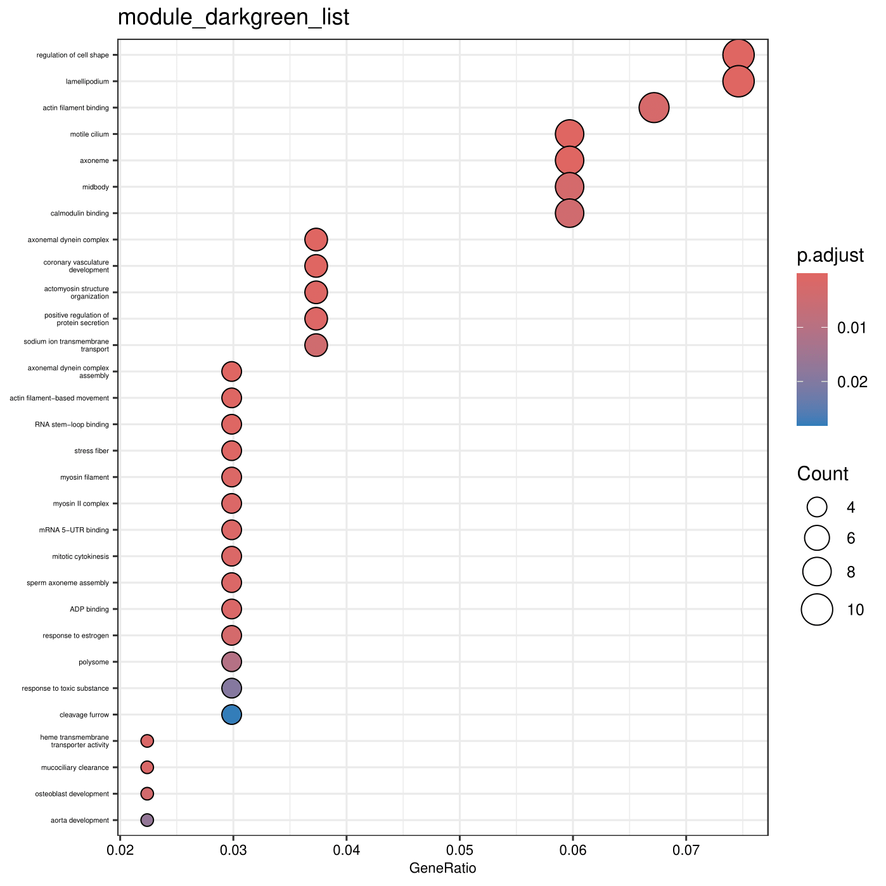
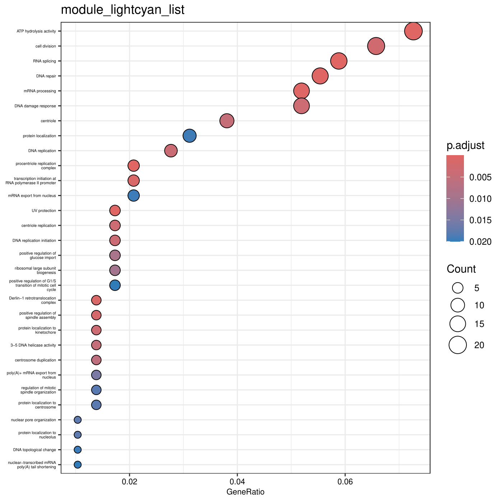
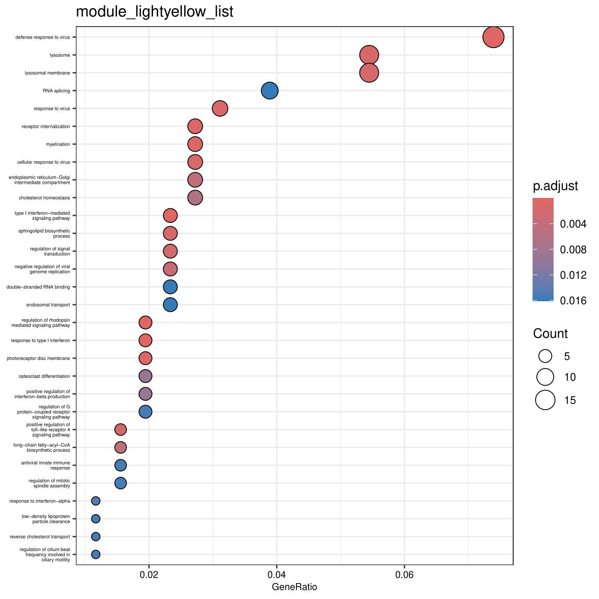

### Introduction to ClusterProfiler 
Gene enrichment analysis is an important step in understanding the biological significance of gene sets identified in high-throughput omics studies. One of the best tools available for performing functional enrichment analysis is ClusterProfiler, an R package that allows users to efficiently assess gene ontology (GO) terms, pathway enrichment, and more. This tutorial provides a step-by-step guide on how to use ClusterProfiler to perform functional gene enrichment analysis on gene sets and visualize the results.

ClusterProfiler supports a wide range of annotation databases, including Gene Ontology (GO), Kyoto Encyclopedia of Genes and Genomes (KEGG), Disease Ontology (DO), etc. While we use GO as an example here, the terms that can be used are limitless, enabling users to gain functional gene information from genes of interest. Additionally, ClusterProfiler offers intuitive visualizations, such as dot plots and bar charts, that help in interpreting the results of enrichment analyses.

By the end of this tutorial, you'll learn how to perform enrichment analysis using ClusterProfiler, generate publication-quality plots, and interpret the significance of the results to deepen your understanding of gene function and its role in disease, development, or other biological contexts.


### Installation of ClusterProfiler Using a Micromamba Environment

```bash
# Creates the clusterProfiler named environment with some commonly used packages
micromamba create -n r-clusterprofiler r-base r-essentials -c conda-forge
micromamba activate r-clusterprofiler
R

BiocManager::install(c("enrichplot", "ggplot2", "DOSE", "meshes", "clusterProfiler", "KEGGREST"))

library(clusterProfiler)
library(enrichplot)
library(ggplot2)
library(DOSE)
library(meshes)
```

### Create the necessary files to run an enrichment

##### Create GO to GeneID tables 
I created this file from an interproscan of Bison proteins. This tabular file lists each gene multiple times according to the number of GO terms.

**BisGos.tab**
```
GO:0042448      Bisbis_mRNA19527
GO:0047442      Bisbis_mRNA19527
GO:0005506      Bisbis_mRNA19766
GO:0005789      Bisbis_mRNA19766
GO:0006704      Bisbis_mRNA19766
GO:0008202      Bisbis_mRNA19766
GO:0020037      Bisbis_mRNA19766
GO:0042446      Bisbis_mRNA19766
GO:0042448      Bisbis_mRNA19766
GO:0047442      Bisbis_mRNA19766
GO:0005634      Bisbis_mRNA21341
GO:0005737      Bisbis_mRNA21341
GO:0006006      Bisbis_mRNA21341
GO:0006915      Bisbis_mRNA21341
GO:0006974      Bisbis_mRNA21341
GO:0008283      Bisbis_mRNA21341
GO:0010212      Bisbis_mRNA21341
GO:0016477      Bisbis_mRNA21341
GO:0030307      Bisbis_mRNA21341
GO:0051646      Bisbis_mRNA21341
GO:0005634      Bisbis_mRNA21342
GO:0005737      Bisbis_mRNA21342
GO:0006006      Bisbis_mRNA21342
GO:0006915      Bisbis_mRNA21342
GO:0006974      Bisbis_mRNA21342
GO:0008283      Bisbis_mRNA21342
GO:0010212      Bisbis_mRNA21342
GO:0016477      Bisbis_mRNA21342
GO:0030307      Bisbis_mRNA21342
GO:0051646      Bisbis_mRNA21342
GO:0001885      Bisbis_mRNA12766
GO:0004659      Bisbis_mRNA12766
GO:0005634      Bisbis_mRNA12766
GO:0005739      Bisbis_mRNA12766
GO:0005783      Bisbis_mRNA12766
GO:0005789      Bisbis_mRNA12766
GO:0006744      Bisbis_mRNA12766
GO:0009234      Bisbis_mRNA12766
```

##### Create GO definition file from go-basic.obo file

This is a generic file that has the full definitions of GO terms
```bash
wget https://purl.obolibrary.org/obo/go/go-basic.obo
grep -w -A 1 "id:" go-basic.obo | grep -w -v "\-\-" | sed 's/:/\t/1' | cut -f 2- | tr "\n" "\t" | sed 's/GO:/\nGO:/g' | awk 'NR>1' | sed 's/\t//2' | sed 's/ $//g' | sed 's/ //1' | sed 's/ /_/g' >GOTerm2Definition.tab
```

**GOTerm2Definition.tab**
```
GO:0000001      mitochondrion_inheritance
GO:0000002      mitochondrial_genome_maintenance
GO:0000003      reproduction
GO:0000005      obsolete_ribosomal_chaperone_activity
GO:0000006      high-affinity_zinc_transmembrane_transporter_activity
GO:0000007      low-affinity_zinc_ion_transmembrane_transporter_activity
GO:0000008      obsolete_thioredoxin
GO:0000009      alpha-1,6-mannosyltransferase_activity
GO:0000010      trans-hexaprenyltranstransferase_activity
GO:0000011      vacuole_inheritance
GO:0000012      single_strand_break_repair
GO:0000014      single-stranded_DNA_endodeoxyribonuclease_activity
GO:0000015      phosphopyruvate_hydratase_complex
GO:0000016      lactase_activity
GO:0000017      alpha-glucoside_transport
GO:0000018      regulation_of_DNA_recombination
GO:0000019      regulation_of_mitotic_recombination
GO:0000020      obsolete_negative_regulation_of_recombination_within_rDNA_repeats
GO:0000022      mitotic_spindle_elongation
GO:0000023      maltose_metabolic_process
GO:0000024      maltose_biosynthetic_process
GO:0000025      maltose_catabolic_process
GO:0000026      alpha-1,2-mannosyltransferase_activity
GO:0000027      ribosomal_large_subunit_assembly
GO:0000028      ribosomal_small_subunit_assembly
```

##### Create a gene list file or set of files

**module_magenta_list.txt**
```
Bisbis_mRNA10000
Bisbis_mRNA10004
Bisbis_mRNA10005
Bisbis_mRNA10058
Bisbis_mRNA10091
Bisbis_mRNA10093
Bisbis_mRNA101
Bisbis_mRNA10102
Bisbis_mRNA10120
Bisbis_mRNA10121
Bisbis_mRNA1013
Bisbis_mRNA10143
Bisbis_mRNA10151
Bisbis_mRNA10155
Bisbis_mRNA10162
Bisbis_mRNA10180
Bisbis_mRNA10198
Bisbis_mRNA10205
Bisbis_mRNA10221
Bisbis_mRNA10244
Bisbis_mRNA10252
Bisbis_mRNA1026
Bisbis_mRNA1027
Bisbis_mRNA10284
Bisbis_mRNA10285
Bisbis_mRNA10289
Continued...
```

These are my files that have specific gene sets

* module_lightcyan_list.txt
* module_darkgreen_list.txt
* module_magenta_list.txt

### Run ClusterProfiler on a single set of genes
```R
R

# Load necessary libraries
library(clusterProfiler)  # For enrichment analysis
library(enrichplot)       # For visualization
library(ggplot2)          # For plotting
library(meshes)           # Only needed for MeSH (Medical Subject Headings) enrichment analysis
library(DOSE)             # Required for GSEA (Gene Set Enrichment Analysis)

# Read the gene list from a CSV file (assumes first column contains gene IDs)
d <- read.csv("module_lightcyan_list.txt")

# Extract only the gene IDs from the first column
gene <- d[,1]

# Read the TERM2GENE mapping file (links GO terms to genes)
Term2Gene <- read.table("BisGos.tab")

# Read the TERM2NAME mapping file (provides GO term definitions)
Term2Name <- read.table("GOTerm2Definition.tab")

# Perform GO enrichment analysis
enricherGO <- enricher(
  gene,                # Gene list to analyze
  pvalueCutoff = 0.05, # P-value threshold for significance
  pAdjustMethod = "BH",# Benjamini-Hochberg correction for multiple testing
  TERM2GENE = Term2Gene, # Custom GO term-to-gene mapping
  TERM2NAME = Term2Name  # Custom GO term definitions
)

# Save the enrichment results to a CSV file
write.csv(enricherGO, file="module_lightcyan_list.tab", quote = FALSE, row.names = FALSE)

# Generate a dot plot visualization of the enrichment results
dotplot(enricherGO, 
        showCategory = 30,    # Display the top 30 enriched GO terms
        font.size = 8) +      # Set font size for better readability
  ggtitle("module_lightcyan_list") +  # Add a title
  theme(axis.text.y = element_text(size = 4)) # Adjust Y-axis text size

# Save the dot plot as a PDF file
ggsave("module_lightcyan_listDotplot.pdf")
```


### Create scripts to run enrichment on multiple gene sets

##### Unix script to create code to execute in R
```bash
for f in *txt; do printf "\nd <- read.csv(\""$f"\")\ngene <-d[,1]\nTerm2Gene <- read.table(\"BisGos.tab\")\nTerm2Name <- read.table(\"GOTerm2Definition.tab\")\nenricherGO <- enricher(gene,pvalueCutoff = 0.05, pAdjustMethod = \"BH\", TERM2GENE=Term2Gene, TERM2NAME=Term2Name)\nwrite.csv(enricherGO, file=\""${f%.*}".tab\",quote = FALSE,row.names = F)\ndotplot(enricherGO, showCategory=30, font.size=8)  + ggtitle(\""${f%.*}"\")  + theme(axis.text.y = element_text(size = 4)) \nggsave(\""${f%.*}"Dotplot.pdf\")\n"; done >clusterprofiler_scripts
```

##### Commands to execute enrichment with ClusterProfiler create with script above
These commands run the enrichment test three times, once for each .txt file in my current directory.
```R
d <- read.csv("module_lightcyan_list.txt")
gene <- d[,1]
Term2Gene <- read.table("BisGos.tab")
Term2Name <- read.table("GOTerm2Definition.tab")
enricherGO <- enricher(gene, pvalueCutoff = 0.05, pAdjustMethod = "BH", TERM2GENE=Term2Gene, TERM2NAME=Term2Name)
write.csv(enricherGO, file="module_lightcyan_list.tab", quote = FALSE, row.names = F)
dotplot(enricherGO, showCategory = 30, font.size = 8) + ggtitle("module_lightcyan_list") + theme(axis.text.y = element_text(size = 4))
ggsave("module_lightcyan_listDotplot.pdf")

d <- read.csv("module_darkgreen_list.txt")
gene <- d[,1]
Term2Gene <- read.table("BisGos.tab")
Term2Name <- read.table("GOTerm2Definition.tab")
enricherGO <- enricher(gene, pvalueCutoff = 0.05, pAdjustMethod = "BH", TERM2GENE=Term2Gene, TERM2NAME=Term2Name)
write.csv(enricherGO, file="module_darkgreen_list.tab", quote = FALSE, row.names = F)
dotplot(enricherGO, showCategory = 30, font.size = 8) + ggtitle("module_darkgreen_list") + theme(axis.text.y = element_text(size = 4))
ggsave("module_darkgreen_listDotplot.pdf")

d <- read.csv("module_magenta_list.txt")
gene <- d[,1]
Term2Gene <- read.table("BisGos.tab")
Term2Name <- read.table("GOTerm2Definition.tab")
enricherGO <- enricher(gene, pvalueCutoff = 0.05, pAdjustMethod = "BH", TERM2GENE=Term2Gene, TERM2NAME=Term2Name)
write.csv(enricherGO, file="module_magenta_list.tab", quote = FALSE, row.names = F)
dotplot(enricherGO, showCategory = 30, font.size = 8) + ggtitle("module_magenta_list") + theme(axis.text.y = element_text(size = 4))
ggsave("module_magenta_listDotplot.pdf")
```

### End results of running ClusterProfiler

The end result of the analysis is a tabular file that contains enriched GO terms for each gene set, as well as visualizations such as dot plots.

**module_magenta_list.tab**
```
ID,Description,GeneRatio,BgRatio,RichFactor,FoldEnrichment,zScore,pvalue,p.adjust,qvalue,geneID,Count
GO:0008066,glutamate_receptor_activity,5/415,19/19549,0.263157894736842,12.3963221306278,7.31918499333518,3.82773502553865e-05,0.0253823892675311,0.0224419621064915,Bisbis_mRNA17785/Bisbis_mRNA4406/Bisbis_mRNA5333/Bisbis_mRNA5334/Bisbis_mRNA5335,5
GO:0086012,membrane_depolarization_during_cardiac_muscle_cell_action_potential,4/415,11/19549,0.363636363636364,17.1294633077766,7.88040495790282,5.86911951539324e-05,0.0253823892675311,0.0224419621064915,Bisbis_mRNA3121/Bisbis_mRNA3122/Bisbis_mRNA3123/Bisbis_mRNA3125,4
GO:0043523,regulation_of_neuron_apoptotic_process,5/415,21/19549,0.238095238095238,11.2157200229489,6.89798228675598,6.4679711801258e-05,0.0253823892675311,0.0224419621064915,Bisbis_mRNA16583/Bisbis_mRNA16584/Bisbis_mRNA5333/Bisbis_mRNA5334/Bisbis_mRNA5335,5
GO:0045211,postsynaptic_membrane,14/415,196/19549,0.0714285714285714,3.36471600688468,4.90010298030439,8.05093293958866e-05,0.0253823892675311,0.0224419621064915,Bisbis_mRNA17785/Bisbis_mRNA18440/Bisbis_mRNA19162/Bisbis_mRNA20025/Bisbis_mRNA3121/Bisbis_mRNA3122/Bisbis_mRNA3123/Bisbis_mRNA4406/Bisbis_mRNA5333/Bisbis_mRNA5334/Bisbis_mRNA5335/Bisbis_mRNA9107/Bisbis_mRNA9108/Bisbis_mRNA9109,14
GO:0061337,cardiac_conduction,4/415,12/19549,0.333333333333333,15.7020080321285,7.5025805903209,8.6562811583462e-05,0.0253823892675311,0.0224419621064915,Bisbis_mRNA3121/Bisbis_mRNA3122/Bisbis_mRNA3123/Bisbis_mRNA3125,4
GO:0005245,voltage-gated_calcium_channel_activity,5/415,23/19549,0.217391304347826,10.2404400209534,6.5301364575936,0.000103276282230437,0.0253823892675311,0.0224419621064915,Bisbis_mRNA17785/Bisbis_mRNA3121/Bisbis_mRNA3122/Bisbis_mRNA3123/Bisbis_mRNA3125,5
GO:0035249,synaptic_transmission,_glutamatergic,6/415,37/19549,0.162162162162162,7.63881471833279,5.95268422954539,0.000117511061423755,0.0253823892675311,0.0224419621064915,Bisbis_mRNA10954/Bisbis_mRNA10955/Bisbis_mRNA4406/Bisbis_mRNA5333/Bisbis_mRNA5334/Bisbis_mRNA5335,6
GO:0050804,modulation_of_chemical_synaptic_transmission,9/415,92/19549,0.0978260869565217,4.60819800942902,5.10879722775335,0.000147303727399966,0.0255894944394935,0.0226250751449156,Bisbis_mRNA16948/Bisbis_mRNA2995/Bisbis_mRNA3911/Bisbis_mRNA4810/Bisbis_mRNA5333/Bisbis_mRNA5334/Bisbis_mRNA5335/Bisbis_mRNA7516/Bisbis_mRNA8401,9
GO:0098839,postsynaptic_density_membrane,9/415,93/19549,0.0967741935483871,4.5586474931986,5.06607942963432,0.000160080219488109,0.0255894944394935,0.0226250751449156,Bisbis_mRNA19162/Bisbis_mRNA19738/Bisbis_mRNA3121/Bisbis_mRNA3122/Bisbis_mRNA3123/Bisbis_mRNA3125/Bisbis_mRNA5333/Bisbis_mRNA5334/Bisbis_mRNA5335,9
GO:0045762,positive_regulation_of_adenylate_cyclase_activity,4/415,14/19549,0.285714285714286,13.4588640275387,6.86764890914132,0.000169242688091888,0.0255894944394935,0.0226250751449156,Bisbis_mRNA3121/Bisbis_mRNA3122/Bisbis_mRNA3123/Bisbis_mRNA3125,4
GO:2000145,regulation_of_cell_motility,4/415,15/19549,0.266666666666667,12.5616064257028,6.59690982786411,0.000226929559711759,0.030552037094158,0.0270127312096774,Bisbis_mRNA16511/Bisbis_mRNA2217/Bisbis_mRNA2218/Bisbis_mRNA8525,4
GO:0032024,positive_regulation_of_insulin_secretion,6/415,42/19549,0.142857142857143,6.72943201376936,5.47410725468662,0.00024247648487427,0.030552037094158,0.0270127312096774,Bisbis_mRNA13511/Bisbis_mRNA21732/Bisbis_mRNA21733/Bisbis_mRNA3121/Bisbis_mRNA3122/Bisbis_mRNA3123,6
GO:0008331,high_voltage-gated_calcium_channel_activity,4/415,17/19549,0.235294117647059,11.0837703756201,6.12556819424018,0.000382574594029781,0.0384908051157591,0.0340318313123184,Bisbis_mRNA3121/Bisbis_mRNA3122/Bisbis_mRNA3123/Bisbis_mRNA3125,4
GO:0060402,calcium_ion_transport_into_cytosol,4/415,17/19549,0.235294117647059,11.0837703756201,6.12556819424018,0.000382574594029781,0.0384908051157591,0.0340318313123184,Bisbis_mRNA3121/Bisbis_mRNA3122/Bisbis_mRNA3123/Bisbis_mRNA3125,4
GO:0051721,protein_phosphatase_2A_binding,5/415,30/19549,0.166666666666667,7.85100401606426,5.53042358732761,0.000387075439355592,0.0384908051157591,0.0340318313123184,Bisbis_mRNA10547/Bisbis_mRNA16416/Bisbis_mRNA3121/Bisbis_mRNA3122/Bisbis_mRNA3123,5
GO:0043198,dendritic_shaft,6/415,47/19549,0.127659574468085,6.01353499102794,5.06787310499445,0.000453946615400255,0.0384908051157591,0.0340318313123184,Bisbis_mRNA17785/Bisbis_mRNA18440/Bisbis_mRNA2741/Bisbis_mRNA3121/Bisbis_mRNA3122/Bisbis_mRNA3123,6
GO:0006939,smooth_muscle_contraction,4/415,18/19549,0.222222222222222,10.4680053547523,5.9184071159314,0.000483680752116021,0.0384908051157591,0.0340318313123184,Bisbis_mRNA11915/Bisbis_mRNA3121/Bisbis_mRNA3122/Bisbis_mRNA3123,4
Continued...
```




### References

* Guangchuang Yu. Using meshes for MeSH term enrichment and semantic analyses. Bioinformatics. 2018, 34(21):3766-3767, doi:10.1093/bioinformatics/bty410
* Guangchuang Yu, Li-Gen Wang, Guang-Rong Yan, Qing-Yu He. DOSE: an R/Bioconductor package for Disease Ontology Semantic and Enrichment analysis. Bioinformatics. 2015, 31(4):608-609
* S Xu, E Hu, Y Cai, Z Xie, X Luo, L Zhan, W Tang, Q Wang, B Liu, R Wang, W Xie, T Wu, L Xie, G Yu. Using clusterProfiler to characterize multiomics data. Nature Protocols. 2024, 19(11):3292-3320

---
[Table of contents](compGenomics_index.md)
