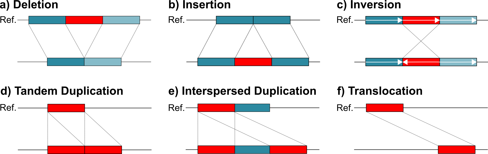
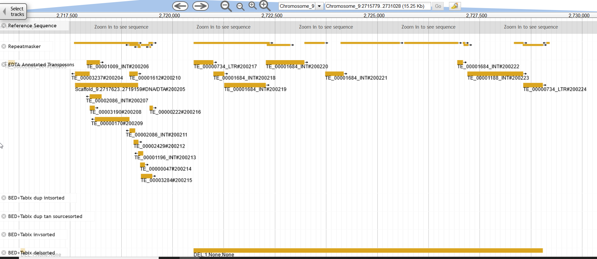

### Prerequisites
Data
* An annotated genome
* Long reads
* Repeat annotation

Software
* minimap2
* samtools
* bedtools -- for comparisons only
* tabix -- for visualization only


### Installation
```
/work/gif/remkv6/USDA/04_TEJumper
conda create -n svim_env --channel bioconda svim
source activate svim_env
```

### Map your long reads to your genome with minimap

My directory locale
```
/work/gif/remkv6/USDA/04_TEJumper
```

Create the temp folders for samtools
```
for f in *fastq; do mkdir ${f%.*}tmp; done
```
Map the reads to your genome with minimap, sort, convert to bam, and index with samtools
```
ml minimap2;ml samtools;minimap2 -a -x map-ont MindFlayergenome.fasta EvilPowers_1_1fastq/EvilPowers1_1.fastq| samtools sort -T EvilPowers_1_1fastq/EvilPowers1_1tmp -o EvilPowers_1_1fastq/EvilPowers1_1.sorted.bam ;samtools index EvilPowers_1_1fastq/EvilPowers1_1.sorted.bam
ml minimap2;ml samtools;minimap2 -a -x map-ont MindFlayergenome.fasta EvilPowers_1_2fastq/EvilPowers1_2.fastq| samtools sort -T EvilPowers_1_2fastq/EvilPowers1_2tmp -o EvilPowers_1_2fastq/EvilPowers1_2.sorted.bam ;samtools index EvilPowers_1_2fastq/EvilPowers1_2.sorted.bam
ml minimap2;ml samtools;minimap2 -a -x map-ont MindFlayergenome.fasta EvilPowers_2_1fastq/EvilPowers2_1.fastq| samtools sort -T EvilPowers_2_1fastq/EvilPowers2_1tmp -o EvilPowers_2_1fastq/EvilPowers2_1.sorted.bam ;samtools index EvilPowers_2_1fastq/EvilPowers2_1.sorted.bam
ml minimap2;ml samtools;minimap2 -a -x map-ont MindFlayergenome.fasta EvilPowers_2_2fastq/EvilPowers2_2.fastq| samtools sort -T EvilPowers_2_2fastq/EvilPowers2_2tmp -o EvilPowers_2_2fastq/EvilPowers2_2.sorted.bam ;samtools index EvilPowers_2_2fastq/EvilPowers2_2.sorted.bam
```

### Run SVIM on your mapped reads
My directory locale
```
/work/gif/remkv6/USDA/04_TEJumper
```
Run SVIM
```
for f in *bam; do echo "ml miniconda3; source activate svim_env; svim alignment /work/gif/remkv6/USDA/04_Pseudogenome/ "$f" MindFlayergenome.fasta";done >svim.sh
```
<details>
  <summary>svim.sh -- Click to see content</summary>
  <pre>
ml miniconda3; source activate svim_env; svim alignment /work/gif/remkv6/USDA/04_Pseudogenome/ EvilPowers1_1.sorted.bam MindFlayergenome.fasta
ml miniconda3; source activate svim_env; svim alignment /work/gif/remkv6/USDA/04_Pseudogenome/ EvilPowers1_2.sorted.bam MindFlayergenome.fasta
ml miniconda3; source activate svim_env; svim alignment /work/gif/remkv6/USDA/04_Pseudogenome/ EvilPowers2_1.sorted.bam MindFlayergenome.fasta
ml miniconda3; source activate svim_env; svim alignment /work/gif/remkv6/USDA/04_Pseudogenome/ EvilPowers2_2.sorted.bam MindFlayergenome.fasta
</pre>
</details>

### Understanding SVIM output


This is a fantastic illustration of SVIM output [source](https://github.com/eldariont/svim) . Within your candidates/ and signatures/ folders you will have bed files corresponding to each of these different types. While transposons may be associated with insertions and deletions, the other four categories can provide a clearer picture of genome source and destination for these jumping genes.


### Compare SVIM output with Repeat annotation and build TE jumping candidates

Move to output directory (signatures have a higher confidence than the candidates)
```
/work/gif/remkv6/USDA/04_TEJumper/signatures
```
Softlink the repeat annotation
```
ln -s /work/gif/remkv6/04_DovetailMindFlayerGenome/49_RenameChromosomes/01_Transfer2Box/RepeatMaskerFormatted.gff3
```
Identify repeats that overlap with these structural variants. Unless your genome is a model, this takes a little guesswork and manual assessment of duplication associations with TEs. Start by taking a look at overlaps between your SVIM bed files and your transposon annotations.  Ideally I am looking for a complete duplication source and destination overlap with the same type of repeat. This doesnt happen very often with my dataset, so I concatenated all of the bed files.

I can look directly at interspersed duplication overlaps with repeats
```
ml bedtools2
bedtools intersect -wo -f .2 -a dup_int.bed -b RepeatMaskerFormatted.gff3 |less -S
````
In my dataset, TE jumps were not that plentiful, so I concatenated all bed files in attempt to find the goal I mention above (complete duplication source and destination overlap). I remove variant events that are associated with supplemental alignments and remove most of the short structural variants to limit the noisiness of the data.

Filter the bed files
```
cat *bed |grep -v "suppl" |awk '($3-$2)>1000' >LargeEverythingNoSuppl.bed
```
Examine variant and repeat overlaps with at least 20% overlap. Varients only from non-supplmental alignments and above 1kb.
```
bedtools intersect -wo -f .2 -a LargeEverythingNoSuppl.bed -b RepeatMaskerFormatted.gff3|less -S
```
What is my most actively modified transposon/repeat?
```
ml bedtools2
bedtools intersect -wo -f .2 -a LargeEverythingNoSuppl.bed -b RepeatMaskerFormatted.gff3 |sort -k1,1V -k2,3nr |cut -f 15 |sed 's/:/\t/g' |sed 's/\.\./\t/g' |cut -f 2 |sort|uniq -c |sort -k1,1nr  |less
```

<details>
  <summary>Results of above command -- Click to see content</summary>
  <pre>
 18 rnd-5_family-3824
  14 rnd-3_family-296
  12 rnd-4_family-1175
  12 rnd-4_family-554
  10 rnd-4_family-3941
  10 rnd-4_family-586
  10 rnd-5_family-506
   8 rnd-3_family-742
   8 rnd-4_family-1889
   8 rnd-4_family-233
   8 rnd-4_family-3318
   8 rnd-4_family-871
   8 rnd-5_family-2024
   8 rnd-5_family-62
   6 rnd-3_family-259
   6 rnd-3_family-755
   6 rnd-4_family-1030
   6 rnd-4_family-1939
   6 rnd-4_family-2286
   6 rnd-4_family-615
   6 rnd-4_family-636
   6 rnd-4_family-676
   6 rnd-4_family-76
   6 rnd-4_family-78
   6 rnd-5_family-1296
   6 rnd-5_family-2138
   6 rnd-5_family-2592
   6 rnd-5_family-2847
   6 rnd-5_family-3299
   6 rnd-5_family-3786
   6 rnd-5_family-884
   4 rnd-3_family-136
   4 rnd-3_family-45
   4 rnd-3_family-675
   4 rnd-3_family-92
   4 rnd-4_family-1093
   4 rnd-4_family-1163
   4 rnd-4_family-136
   4 rnd-4_family-1655
   4 rnd-4_family-2265
   4 rnd-4_family-2283
   4 rnd-4_family-2901
   4 rnd-4_family-294
   4 rnd-4_family-3130
   4 rnd-4_family-329
   4 rnd-4_family-344
   4 rnd-4_family-36
   4 rnd-4_family-397
</pre>
</details>

Since rnd-5_family-3824 is the most abundantly modified, lets look at all possible modified areas with this repeat.
```
bedtools intersect -wo -f .2 -a LargeEverythingNoSuppl.bed -b RepeatMaskerFormatted.gff3 |grep "rnd-5_family-3824" |sort|uniq|less -S
rnd-5_family-3824
```

<details>
  <summary>Results of above command -- Click to see content</summary>
  <pre>
Chromosome_1    21394028        21395344        INS;1;None;None 1.0     [Chromosome_1|21394028|21395344|INS;cigar|afa26991-52ed-4c97-964a-ed17aace0ded] Chromosome_1    RepeatMasker    similarity      21394241        21394627        3.7     -       .       ID=Motif:rnd-5_family-3824..1769-2162#166139    387
Chromosome_1    21394028        21395344        INS;1;None;None 1.0     [Chromosome_1|21394028|21395344|INS;cigar|afa26991-52ed-4c97-964a-ed17aace0ded] Chromosome_1    RepeatMasker    similarity      21395018        21395525        0.8     -       .       ID=Motif:rnd-5_family-3824..597-1126#166142     327
Chromosome_3    11203022        11204503        INS;1;None;None 1.0     [Chromosome_3|11203022|11204503|INS;cigar|311e9af7-3a96-41a9-a805-dd0ae1ba4684] Chromosome_3    RepeatMasker    similarity      11203770        11204822        1.9     -       .       ID=Motif:rnd-5_family-3824..613-1659#80436      734
Chromosome_3    13650014        13651306        DEL;1;None;None 1.0     [Chromosome_3|13650014|13651306|DEL;cigar|2fb4442e-82ce-441e-99f5-967e803d35fc] Chromosome_3    RepeatMasker    similarity      13650932        13651308        3.7     +       .       ID=Motif:rnd-5_family-3824..1769-2162#83910     375
Chromosome_4    3724167 3725709 DEL;1;None;None 1.0     [Chromosome_4|3724167|3725709|DEL;cigar|04e14531-dd48-4da3-8386-8fa5c0d31a88]   Chromosome_4    RepeatMasker    similarity      3724168 3724558 3.4     -       .       ID=Motif:rnd-5_family-3824..1769-2167#108415    391
Chromosome_4    3724167 3725709 DEL;1;None;None 1.0     [Chromosome_4|3724167|3725709|DEL;cigar|04e14531-dd48-4da3-8386-8fa5c0d31a88]   Chromosome_4    RepeatMasker    similarity      3725358 3725707 0.9     -       .       ID=Motif:rnd-5_family-3824..618-962#108425      350
Chromosome_8    3875115 3876378 DEL;1;None;None 1.0     [Chromosome_8|3875115|3876378|DEL;cigar|bc18a171-d6da-4e52-b895-55f20b0f603d]   Chromosome_8    RepeatMasker    similarity      3875527 3875878 22.2    +       .       ID=Motif:rnd-5_family-3824..1109-1432#43663     352
Chromosome_8    5192359 5193624 DEL;1;None;None 1.0     [Chromosome_8|5192359|5193624|DEL;cigar|3b657f3f-05e2-49fd-9c3d-d27ae0408b84]   Chromosome_8    RepeatMasker    similarity      5192370 5192776 3.3     -       .       ID=Motif:rnd-5_family-3824..1769-2162#46002     407
Chromosome_8    5192359 5193624 DEL;1;None;None 1.0     [Chromosome_8|5192359|5193624|DEL;cigar|3b657f3f-05e2-49fd-9c3d-d27ae0408b84]   Chromosome_8    RepeatMasker    similarity      5193276 5193634 0.6     -       .       ID=Motif:rnd-5_family-3824..618-962#46012       349

</pre>
</details>

### Explore transpositions visually

Create sorted Tabix indices of each bed file.
```
ml tabix; for f in *bed; do sort -k1,1V -k2,3n $f >${f%.*}sorted.bed;bgzip ${f%.*}sorted.bed; tabix -p bed ${f%.*}sorted.bed.gz; done
```

Viewing your best candidates visually is probably the best way to determine if your TE jump is real. There are a few options to do this.  If your genome is hosted online in JBrowse. Go there, select the appropriate genome from "Genome", then select "Track" and "open track file or URL".  There you should select files and upload your bed.gz files and your .tbi indices. If you do not have your genome in an online browser, you can still view by downloading JBrowse desktop [here](https://jbrowse.org/blog/).

To use JBrowse desktop with your custom genome, you will have to create all of the proper indices. Note: getting the sorting right on gene.gff files can be difficult
* .fai index of genome
* .fasta file of genome
* sorted and indexed gff/bed file of repeats
* the SVIM indexed bed files
* sorted.bam file and sorted.bam.bai index

```
ml samtools; samtools faidx genome.fa
ml tabix; bgzip RepeatMaskerFormatted.gff3; tabix -p gff3 RepeatMaskerFormatted.gff3.gz
ml tabix; bgzip genes.gff3; tabix -p gff3 genes.gff3.gz
```

An example of a putative deletion caused by a transposon (excision in the reads/insertion in the genome). Also demonstrating the utility of having multiple repeat annotations for your genome. While my repeat annotations were generic for Repeatmasker/modeler, EDTA provided some intuitive information, that this deletion is bordered by LTR elements, a retrotransposon. 
```
Chromosome_9   2720515 2729040 DEL;1;None;None 1.0     [Chromosome_9|2720515|2729040|DEL;cigar|68340730-b565-45db-9f86-4d2bc128e721]
```



### References
* https://github.com/lh3/minimap2
* https://github.com/eldariont/svim
* https://jbrowse.org/blog/

[Table of contents](Repeats_index.md)
