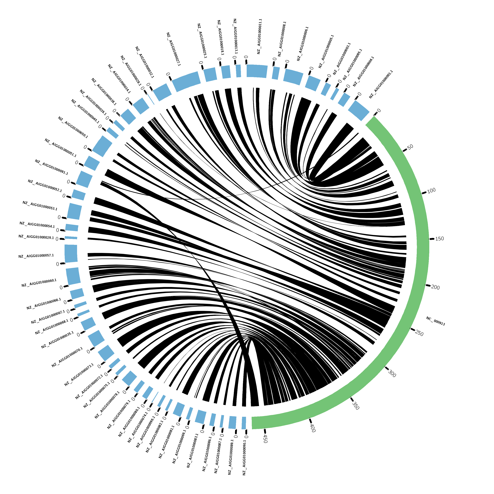

# Finding orthology and synteny with orthofinder, iadhore, and circos.
Orthofinder is a robust software that can find orthologs very quickly and with very little input.  We are going to take the output from orthofinder and use it as input for iAdhore.  I adhore is a program that uses homeologous genes to identify longer-term ancestral synteny (in comparison to direct chromosomal alignments (Mummer)).  With some modifications, the output from iadhore can be used to draw synteny plots with circos, or just to identify genomic feature overlap with Bedtools by creating a synteny gff.

###  The necessary files -- Genome, proteins, GFF
```
#/work/GIF/remkv6/USDA/15_OrthoFinderSynteny
#Pathogenic E. coli
wget ftp://ftp.ncbi.nlm.nih.gov/genomes/all/GCF/000/249/815/GCF_000249815.1_ASM24981v2/GCF_000249815.1_ASM24981v2_genomic.fna.gz
wget ftp://ftp.ncbi.nlm.nih.gov/genomes/all/GCF/000/249/815/GCF_000249815.1_ASM24981v2/GCF_000249815.1_ASM24981v2_protein.faa.gz
wget ftp://ftp.ncbi.nlm.nih.gov/genomes/all/GCF/000/249/815/GCF_000249815.1_ASM24981v2/GCF_000249815.1_ASM24981v2_genomic.gff.gz

#Non-pathogenic E. coli
wget ftp://ftp.ncbi.nlm.nih.gov/genomes/all/GCF/000/005/845/GCF_000005845.2_ASM584v2/GCF_000005845.2_ASM584v2_genomic.fna.gz
wget ftp://ftp.ncbi.nlm.nih.gov/genomes/all/GCF/000/005/845/GCF_000005845.2_ASM584v2/GCF_000005845.2_ASM584v2_protein.faa.gz
wget ftp://ftp.ncbi.nlm.nih.gov/genomes/all/GCF/000/005/845/GCF_000005845.2_ASM584v2/GCF_000005845.2_ASM584v2_genomic.gff.gz


#unzip all those files
for f in *gz; do gunzip $f;done
```

### Run orthofinder on protein sets
If your protein fasta has more than one protein isoform for each gene, then you need to extract just the primary isoform.  Otherwise there will be downstream errors with iadhore.  This can usually be done filtering names by the last characters of the first column of your fasta header.  
Orthofinder is pretty amazing. All that is needed is a new folder that has just your protein fastas. There are lots of options to play with, but I just used default for simplicity.  (-M dendroblast, -S BLAST, -T fasttree, -I 1.5).  For the E. coli genomes I used, this took 7 minutes.
```
#/work/GIF/remkv6/USDA/15_OrthoFinderSynteny/02_DEC8BvsMG1655
module load orthofinder
orthofinder -f 02_DEC8BvsMG1655 -t 16 -n Orthofinder
```

### Prepare Ortholog file input
I go up  one directory from the results, and create a new directory 02_iadhore. Just FYI, some of my commands depend on this structure. <brk>

iADhore is the best synteny prediction program that I've used, and takes minutes to run.  However, preparing the input can be complex, and if a single gene is missing from your files, it will complain with some vague errors. Here are some of the important points to preparing the files for iADhore:  Every gene must be represented in both the ortholog file and in the scaffold files.  The gene names must be an EXACT MATCH between the ortholog file and the scaffold files. The ortholog file must be TAB separated, while the iadhore.ini file needs to be space separated.    <brk>

```
#/work/GIF/remkv6/USDA/15_OrthoFinderSynteny/02_iadhore
ln -s ../GCF_000250075.1_ASM25007v2_genomic.gff
ln -s ../GCF_000005845.2_ASM584v2_genomic.gff

less ../Results_Orthofinder_Jun19/Orthogroups.txt |tr " " "\n" |awk -v Family=0 '{if(substr($1,1,2)=="OG") {Family=$1} else {print $0,Family}}' |sed 's/://g' |cat - <(dos2unix ../Results_Orthofinder_Jun19/Orthogroups_UnassignedGenes.csv |awk 'NR>1 {print $2,$1}') |tr " " "\t" >Orthologues.list

#This is the output that is needed family of orthologues (FYI: iadhore calls this a blast table). Essentially it is getting EVERY gene from your "Orthogroups.txt" and "Orthogroups_UnassignedGenes.csv", and creating a table assigning genes to a family.
###################################################
NP_414894.2     OG0000000
NP_415921.2     OG0000000
NP_417338.3     OG0000000
NP_417516.3     OG0000000
NP_418692.2     OG0000000
YP_026163.2     OG0000000
XWP_000422741.1 OG0000000
XWP_000435663.1 OG0000000
XWP_001171554.1 OG0000000
NP_414776.1     OG0000001
NP_415449.1     OG0000001
NP_415895.1     OG0000001
NP_416719.1     OG0000001
XWP_000749863.1 OG0000001
XWP_000824375.1 OG0000001
XWP_000837930.1 OG0000001
XWP_000865576.1 OG0000001
XWP_000977920.1 OG0000001
NP_414995.1     OG0000002
NP_416965.1     OG0000002
NP_417732.1     OG0000002
NP_417971.1     OG0000002
XWP_000024892.1 OG0000002
XWP_001132475.1 OG0000002
XWP_001273152.1 OG0000002
XWP_001273217.1 OG0000002
NP_415086.1     OG0000003
NP_416074.4     OG0000003
XWP_000284510.1 OG0000003
XWP_000284516.1 OG0000003
XWP_000284524.1 OG0000003
XWP_001072901.1 OG0000003
XWP_024164617.1 OG0000003
XWP_085948261.1 OG0000003
NP_416850.1     OG0000004
NP_416937.2     OG0000004
NP_417111.1     OG0000004
XWP_000772642.1 OG0000004
XWP_001218764.1 OG0000004
XWP_001218841.1 OG0000004
XWP_001345280.1 OG0000004
XWP_094192939.1 OG0000004
NP_417196.1     OG0000005
NP_417377.1     OG0000005
NP_418177.1     OG0000005
XWP_000012618.1 OG0000005
XWP_000110313.1 OG0000005
XWP_000643236.1 OG0000005
XWP_001333025.1 OG0000005
NP_416747.1     OG0000006
NP_416808.1     OG0000006

etc...
###################################################

```
### Create lists of files named by scaffold name
The next step is to create files containing lists of genes with strand orientation. BEWARE, the genes/proteins must have the EXACT same names as the genes in your "Orthologs.list" file. Iadhore will throw errors if your two species have scaffolds with the exact same names. You will also run into errors if you did not eliminate all non-primary protein isoforms from your Orthofinder run.
```
#/work/GIF/remkv6/USDA/15_OrthoFinderSynteny/02_iadhore  (same directory)
#Essentially here, you are extracting: scaffold name, protein name, strand orientation.
Beware, the names extracted from your gff must match the names in your protein fasta, so this can be tricky if they are named differently or if your protein name is not always in the same column.  The feature type can also vary among different gffs, so your column 3 feature may be: gene, CDS, or mRNA.
This is how I check to make sure I have the correct number of genes in my gff extraction that are in my protein fasta. The last bit eliminates secondary protein isoforms.

less ../GCF_000005845.2_ASM584v2_genomic.gff |awk '$3=="CDS"' |sed 's/;/\t/g' |awk '{print $12}' |sort|uniq|sed 's/Name=//g'|awk 'substr($1,11,11)==1' |wc
   3307    3307   39684
grep  ">" ../../GCF_000005845.2_ASM584v2_protein.faa |awk 'substr($1,12,12)==1' |wc
      3307   38379  336277

#now make all the query files for iadhore
### This will make a two columned file with (protein_nameOrientation scaffold_name).  The scaffold name will be used to name the files in the last bit of code below, but we will get rid of it later.

less ../GCF_000005845.2_ASM584v2_genomic.gff |awk '$3=="CDS"' |sed 's/;/\t/g' |awk '{print $1,$7,$12}' |sed 's/Name=//g'|awk 'substr($3,11,11)==1 {print $3$2,$1}'  |sort|uniq|awk '{print >> $2 ".lst"; close($2)}'

#since we used the scaffold name to create/name the files, we can get rid of it now.
sed -i 's/ .*//g' *.lst

ls *lst >input.txt
#This can vary also if you have periods "." in your gene names.
paste <(cut -f 1 -d "." input.txt) <(awk '{print "query/"$1}' input.txt)>query.ini
#Since this is a complete genome, I only have one scaffold file, which is named after the single scaffold.
##############################################################
NC_000913.3.lst  input.txt  query.ini
##############################################################

#It is filled with protein names and orientation.  see below
less NC_000913.3.lst
###############################################################
NP_414542.1+
NP_414543.1+
NP_414544.1+
NP_414545.1+
NP_414546.1+
NP_414547.1-
NP_414548.1-
NP_414549.1+
NP_414550.1+
etc..
###############################################################

#Now lets do the same for the subject genome.
cd ../
mkdir subject
cd subject

grep -c ">" /work/GIF/remkv6/Stromberg/03_genomes/02_STEC_2/GCF_000249815.1_ASM24981v2_protein.faa
5017

#this one was a bugger.  Two problems with this gff.  The first is that the protein names were not consistently in the same column. Second the same 70 genes had two separate entries in the gff annotation. I fudged this one a bit and just took the first annotation for each gene (the sort -u command).  70 genes should not significantly affect the results.
less ../ModGCF_000249815.1_ASM24981v2_genomic.gff |sed 's/Protein Homology/Protein_Homology/g' |awk '$3=="CDS"' |sed 's/;/\t/g'|sed 's/Name=//g'|awk 'substr($12,1,3)=="XWP"' |awk '{print $12,$7,$1}' |sort|uniq|sort -u -k1,1 |wc
   5017   15051  180612

less ../ModGCF_000249815.1_ASM24981v2_genomic.gff |sed 's/Protein Homology/Protein_Homology/g' |awk '$3=="CDS"' |sed 's/;/\t/g'|sed 's/Name=//g'|awk 'substr($12,1,3)=="XWP"' |awk '{print $12,$7,$1}' |sort|uniq|sort -u -k1,1 |awk '{print $1$2,$3}' |awk '{print >> $2 ".lst"; close($2)}'

sed -i 's/ .*//g' *.lst
ls *lst >input.txt
paste <(cut -f 1,2 -d "." input.txt) <(awk '{print "subject/"$1}' input.txt)>subject.ini

#now exit the subject folder and concatenate the query and subject output
cd ..
 cat query/query.ini subject/subject.ini |tr "\t" " " >iadhore.ini

#iadhore.ini comes out like this
####################################################
NC_000913 query/NC_000913.3.lst
NZ_AIGG01000001.1 subject/NZ_AIGG01000001.1.lst
NZ_AIGG01000002.1 subject/NZ_AIGG01000002.1.lst
NZ_AIGG01000003.1 subject/NZ_AIGG01000003.1.lst
NZ_AIGG01000004.1 subject/NZ_AIGG01000004.1.lst
NZ_AIGG01000005.1 subject/NZ_AIGG01000005.1.lst
NZ_AIGG01000006.1 subject/NZ_AIGG01000006.1.lst
NZ_AIGG01000008.1 subject/NZ_AIGG01000008.1.lst
NZ_AIGG01000009.1 subject/NZ_AIGG01000009.1.lst
NZ_AIGG01000010.1 subject/NZ_AIGG01000010.1.lst
NZ_AIGG01000011.1 subject/NZ_AIGG01000011.1.lst
NZ_AIGG01000012.1 subject/NZ_AIGG01000012.1.lst
NZ_AIGG01000013.1 subject/NZ_AIGG01000013.1.lst
NZ_AIGG01000014.1 subject/NZ_AIGG01000014.1.lst
NZ_AIGG01000015.1 subject/NZ_AIGG01000015.1.lst
NZ_AIGG01000016.1 subject/NZ_AIGG01000016.1.lst
NZ_AIGG01000017.1 subject/NZ_AIGG01000017.1.lst
NZ_AIGG01000018.1 subject/NZ_AIGG01000018.1.lst
NZ_AIGG01000019.1 subject/NZ_AIGG01000019.1.lst
NZ_AIGG01000020.1 subject/NZ_AIGG01000020.1.lst
NZ_AIGG01000021.1 subject/NZ_AIGG01000021.1.lst
NZ_AIGG01000022.1 subject/NZ_AIGG01000022.1.lst
NZ_AIGG01000025.1 subject/NZ_AIGG01000025.1.lst
NZ_AIGG01000026.1 subject/NZ_AIGG01000026.1.lst
NZ_AIGG01000027.1 subject/NZ_AIGG01000027.1.lst
NZ_AIGG01000028.1 subject/NZ_AIGG01000028.1.lst
NZ_AIGG01000029.1 subject/NZ_AIGG01000029.1.lst
NZ_AIGG01000030.1 subject/NZ_AIGG01000030.1.lst
NZ_AIGG01000031.1 subject/NZ_AIGG01000031.1.lst
NZ_AIGG01000032.1 subject/NZ_AIGG01000032.1.lst
NZ_AIGG01000033.1 subject/NZ_AIGG01000033.1.lst
NZ_AIGG01000034.1 subject/NZ_AIGG01000034.1.lst
NZ_AIGG01000035.1 subject/NZ_AIGG01000035.1.lst
NZ_AIGG01000036.1 subject/NZ_AIGG01000036.1.lst
NZ_AIGG01000037.1 subject/NZ_AIGG01000037.1.lst
NZ_AIGG01000038.1 subject/NZ_AIGG01000038.1.lst
NZ_AIGG01000039.1 subject/NZ_AIGG01000039.1.lst
NZ_AIGG01000040.1 subject/NZ_AIGG01000040.1.lst
NZ_AIGG01000041.1 subject/NZ_AIGG01000041.1.lst
NZ_AIGG01000042.1 subject/NZ_AIGG01000042.1.lst
NZ_AIGG01000043.1 subject/NZ_AIGG01000043.1.lst
NZ_AIGG01000044.1 subject/NZ_AIGG01000044.1.lst
NZ_AIGG01000045.1 subject/NZ_AIGG01000045.1.lst
NZ_AIGG01000046.1 subject/NZ_AIGG01000046.1.lst
NZ_AIGG01000049.1 subject/NZ_AIGG01000049.1.lst
NZ_AIGG01000050.1 subject/NZ_AIGG01000050.1.lst
NZ_AIGG01000051.1 subject/NZ_AIGG01000051.1.lst
NZ_AIGG01000052.1 subject/NZ_AIGG01000052.1.lst
NZ_AIGG01000053.1 subject/NZ_AIGG01000053.1.lst
NZ_AIGG01000054.1 subject/NZ_AIGG01000054.1.lst
NZ_AIGG01000055.1 subject/NZ_AIGG01000055.1.lst
NZ_AIGG01000056.1 subject/NZ_AIGG01000056.1.lst
NZ_AIGG01000057.1 subject/NZ_AIGG01000057.1.lst
NZ_AIGG01000058.1 subject/NZ_AIGG01000058.1.lst
NZ_AIGG01000059.1 subject/NZ_AIGG01000059.1.lst
NZ_AIGG01000060.1 subject/NZ_AIGG01000060.1.lst
NZ_AIGG01000061.1 subject/NZ_AIGG01000061.1.lst
NZ_AIGG01000062.1 subject/NZ_AIGG01000062.1.lst
NZ_AIGG01000063.1 subject/NZ_AIGG01000063.1.lst
NZ_AIGG01000064.1 subject/NZ_AIGG01000064.1.lst
NZ_AIGG01000066.1 subject/NZ_AIGG01000066.1.lst
NZ_AIGG01000067.1 subject/NZ_AIGG01000067.1.lst
NZ_AIGG01000068.1 subject/NZ_AIGG01000068.1.lst
NZ_AIGG01000069.1 subject/NZ_AIGG01000069.1.lst
NZ_AIGG01000070.1 subject/NZ_AIGG01000070.1.lst
NZ_AIGG01000071.1 subject/NZ_AIGG01000071.1.lst
NZ_AIGG01000072.1 subject/NZ_AIGG01000072.1.lst
NZ_AIGG01000073.1 subject/NZ_AIGG01000073.1.lst
NZ_AIGG01000074.1 subject/NZ_AIGG01000074.1.lst
NZ_AIGG01000075.1 subject/NZ_AIGG01000075.1.lst
NZ_AIGG01000076.1 subject/NZ_AIGG01000076.1.lst
NZ_AIGG01000078.1 subject/NZ_AIGG01000078.1.lst
NZ_AIGG01000079.1 subject/NZ_AIGG01000079.1.lst
NZ_AIGG01000080.1 subject/NZ_AIGG01000080.1.lst
NZ_AIGG01000081.1 subject/NZ_AIGG01000081.1.lst
NZ_AIGG01000082.1 subject/NZ_AIGG01000082.1.lst
NZ_AIGG01000083.1 subject/NZ_AIGG01000083.1.lst
NZ_AIGG01000084.1 subject/NZ_AIGG01000084.1.lst
NZ_AIGG01000085.1 subject/NZ_AIGG01000085.1.lst
NZ_AIGG01000086.1 subject/NZ_AIGG01000086.1.lst
NZ_AIGG01000087.1 subject/NZ_AIGG01000087.1.lst
NZ_AIGG01000088.1 subject/NZ_AIGG01000088.1.lst
NZ_AIGG01000089.1 subject/NZ_AIGG01000089.1.lst
NZ_AIGG01000090.1 subject/NZ_AIGG01000090.1.lst
NZ_AIGG01000091.1 subject/NZ_AIGG01000091.1.lst
NZ_AIGG01000092.1 subject/NZ_AIGG01000092.1.lst
NZ_AIGG01000093.1 subject/NZ_AIGG01000093.1.lst
NZ_AIGG01000095.1 subject/NZ_AIGG01000095.1.lst
NZ_AIGG01000096.1 subject/NZ_AIGG01000096.1.lst
NZ_AIGG01000097.1 subject/NZ_AIGG01000097.1.lst
NZ_AIGG01000099.1 subject/NZ_AIGG01000099.1.lst
###############################################


#This is exactly what iadhore wants in this iadhore.ini file (INCLUDING THE NEWLINES!)
####################################################
genome=nonpathogenic
NC_000913 query/NC_000913.3.lst

genome=pathenogenic
NZ_AIGG01000001.1 subject/NZ_AIGG01000001.1.lst
NZ_AIGG01000002.1 subject/NZ_AIGG01000002.1.lst
NZ_AIGG01000003.1 subject/NZ_AIGG01000003.1.lst
NZ_AIGG01000004.1 subject/NZ_AIGG01000004.1.lst
NZ_AIGG01000005.1 subject/NZ_AIGG01000005.1.lst
NZ_AIGG01000006.1 subject/NZ_AIGG01000006.1.lst
NZ_AIGG01000008.1 subject/NZ_AIGG01000008.1.lst
NZ_AIGG01000009.1 subject/NZ_AIGG01000009.1.lst
NZ_AIGG01000010.1 subject/NZ_AIGG01000010.1.lst
NZ_AIGG01000011.1 subject/NZ_AIGG01000011.1.lst
NZ_AIGG01000012.1 subject/NZ_AIGG01000012.1.lst
NZ_AIGG01000013.1 subject/NZ_AIGG01000013.1.lst
NZ_AIGG01000014.1 subject/NZ_AIGG01000014.1.lst
NZ_AIGG01000015.1 subject/NZ_AIGG01000015.1.lst
NZ_AIGG01000016.1 subject/NZ_AIGG01000016.1.lst
NZ_AIGG01000017.1 subject/NZ_AIGG01000017.1.lst
NZ_AIGG01000018.1 subject/NZ_AIGG01000018.1.lst
NZ_AIGG01000019.1 subject/NZ_AIGG01000019.1.lst
NZ_AIGG01000020.1 subject/NZ_AIGG01000020.1.lst
NZ_AIGG01000021.1 subject/NZ_AIGG01000021.1.lst
NZ_AIGG01000022.1 subject/NZ_AIGG01000022.1.lst
NZ_AIGG01000025.1 subject/NZ_AIGG01000025.1.lst
NZ_AIGG01000026.1 subject/NZ_AIGG01000026.1.lst
NZ_AIGG01000027.1 subject/NZ_AIGG01000027.1.lst
NZ_AIGG01000028.1 subject/NZ_AIGG01000028.1.lst
NZ_AIGG01000029.1 subject/NZ_AIGG01000029.1.lst
NZ_AIGG01000030.1 subject/NZ_AIGG01000030.1.lst
NZ_AIGG01000031.1 subject/NZ_AIGG01000031.1.lst
NZ_AIGG01000032.1 subject/NZ_AIGG01000032.1.lst
NZ_AIGG01000033.1 subject/NZ_AIGG01000033.1.lst
NZ_AIGG01000034.1 subject/NZ_AIGG01000034.1.lst
NZ_AIGG01000035.1 subject/NZ_AIGG01000035.1.lst
NZ_AIGG01000036.1 subject/NZ_AIGG01000036.1.lst
NZ_AIGG01000037.1 subject/NZ_AIGG01000037.1.lst
NZ_AIGG01000038.1 subject/NZ_AIGG01000038.1.lst
NZ_AIGG01000039.1 subject/NZ_AIGG01000039.1.lst
NZ_AIGG01000040.1 subject/NZ_AIGG01000040.1.lst
NZ_AIGG01000041.1 subject/NZ_AIGG01000041.1.lst
NZ_AIGG01000042.1 subject/NZ_AIGG01000042.1.lst
NZ_AIGG01000043.1 subject/NZ_AIGG01000043.1.lst
NZ_AIGG01000044.1 subject/NZ_AIGG01000044.1.lst
NZ_AIGG01000045.1 subject/NZ_AIGG01000045.1.lst
NZ_AIGG01000046.1 subject/NZ_AIGG01000046.1.lst
NZ_AIGG01000049.1 subject/NZ_AIGG01000049.1.lst
NZ_AIGG01000050.1 subject/NZ_AIGG01000050.1.lst
NZ_AIGG01000051.1 subject/NZ_AIGG01000051.1.lst
NZ_AIGG01000052.1 subject/NZ_AIGG01000052.1.lst
NZ_AIGG01000053.1 subject/NZ_AIGG01000053.1.lst
NZ_AIGG01000054.1 subject/NZ_AIGG01000054.1.lst
NZ_AIGG01000055.1 subject/NZ_AIGG01000055.1.lst
NZ_AIGG01000056.1 subject/NZ_AIGG01000056.1.lst
NZ_AIGG01000057.1 subject/NZ_AIGG01000057.1.lst
NZ_AIGG01000058.1 subject/NZ_AIGG01000058.1.lst
NZ_AIGG01000059.1 subject/NZ_AIGG01000059.1.lst
NZ_AIGG01000060.1 subject/NZ_AIGG01000060.1.lst
NZ_AIGG01000061.1 subject/NZ_AIGG01000061.1.lst
NZ_AIGG01000062.1 subject/NZ_AIGG01000062.1.lst
NZ_AIGG01000063.1 subject/NZ_AIGG01000063.1.lst
NZ_AIGG01000064.1 subject/NZ_AIGG01000064.1.lst
NZ_AIGG01000066.1 subject/NZ_AIGG01000066.1.lst
NZ_AIGG01000067.1 subject/NZ_AIGG01000067.1.lst
NZ_AIGG01000068.1 subject/NZ_AIGG01000068.1.lst
NZ_AIGG01000069.1 subject/NZ_AIGG01000069.1.lst
NZ_AIGG01000070.1 subject/NZ_AIGG01000070.1.lst
NZ_AIGG01000071.1 subject/NZ_AIGG01000071.1.lst
NZ_AIGG01000072.1 subject/NZ_AIGG01000072.1.lst
NZ_AIGG01000073.1 subject/NZ_AIGG01000073.1.lst
NZ_AIGG01000074.1 subject/NZ_AIGG01000074.1.lst
NZ_AIGG01000075.1 subject/NZ_AIGG01000075.1.lst
NZ_AIGG01000076.1 subject/NZ_AIGG01000076.1.lst
NZ_AIGG01000078.1 subject/NZ_AIGG01000078.1.lst
NZ_AIGG01000079.1 subject/NZ_AIGG01000079.1.lst
NZ_AIGG01000080.1 subject/NZ_AIGG01000080.1.lst
NZ_AIGG01000081.1 subject/NZ_AIGG01000081.1.lst
NZ_AIGG01000082.1 subject/NZ_AIGG01000082.1.lst
NZ_AIGG01000083.1 subject/NZ_AIGG01000083.1.lst
NZ_AIGG01000084.1 subject/NZ_AIGG01000084.1.lst
NZ_AIGG01000085.1 subject/NZ_AIGG01000085.1.lst
NZ_AIGG01000086.1 subject/NZ_AIGG01000086.1.lst
NZ_AIGG01000087.1 subject/NZ_AIGG01000087.1.lst
NZ_AIGG01000088.1 subject/NZ_AIGG01000088.1.lst
NZ_AIGG01000089.1 subject/NZ_AIGG01000089.1.lst
NZ_AIGG01000090.1 subject/NZ_AIGG01000090.1.lst
NZ_AIGG01000091.1 subject/NZ_AIGG01000091.1.lst
NZ_AIGG01000092.1 subject/NZ_AIGG01000092.1.lst
NZ_AIGG01000093.1 subject/NZ_AIGG01000093.1.lst
NZ_AIGG01000095.1 subject/NZ_AIGG01000095.1.lst
NZ_AIGG01000096.1 subject/NZ_AIGG01000096.1.lst
NZ_AIGG01000097.1 subject/NZ_AIGG01000097.1.lst
NZ_AIGG01000099.1 subject/NZ_AIGG01000099.1.lst

#OK, you can modify some of these to suit your needs
blast_table=Orthologues.list
table_type=family
prob_cutoff=0.001
anchor_points=3
number_of_threads=16
visualizeAlignment=false
output_path= output
alignment_method=gg2
gap_size=15
cluster_gap=20
level_2_only=true
q_value=.05

#####################################################

#time to run iadhore!
module load iadhore
i-adhore iadhore.ini


If you get a gene missing from blast table error, most likely you either have a gene naming scheme that does not match your files in the query and subject folders, or your blast table (Orthologues.list) space separated, when it should be tab separated.

If iadhore is successful, you will generate an output folder with some informative files like "multiplicons.txt" and "segments.txt"

```
### Time to put it into circos!
Circos is just a good visualization tool for synteny, which I find to be more informative than dot plots. Circos can go much further than dot plots by allowing other features to be plotted alongside the synteny, for example: gene density, repeat density, etc)
```

#I create a new folder above the 02_iadhore folder. Again, some of my commands depend on this.  
#/work/GIF/remkv6/USDA/15_OrthoFinderSynteny/03_circos

#Softlink all relevant files:(genome, GFF, segments.txt)
ln -s ../GCF_000005845.2_ASM584v2_genomic.fna
ln -s ../ GCF_000249815.1_ASM24981v2_genomic.fna
ln -s ../02_iadhore/output/segments.txt
ln -s ../ModGCF_000249815.1_ASM24981v2_genomic.gff
ln -s ../GCF_000005845.2_ASM584v2_genomic.gff

#All I am doing here is creating a column in the gff that has only the protein name.  This way I can use grep -w to get exact matches later on.

sed 's/;/\t/g' GCF_000005845.2_ASM584v2_genomic.gff |sed 's/Protein Homology/Protein_Homology/g' |sed 's/Name=//g' |awk '$3=="CDS"' >5845GrepMod.gff
sed 's/;/\t/g' ModGCF_000249815.1_ASM24981v2_genomic.gff |sed 's/Protein Homology/Protein_Homology/g' |sed 's/Name=//g' |awk '$3=="CDS"' >24981GrepMod.gff


# The five scripts below will just work if you change 3 things.  1.  change "pathenogenic" to whatever you named your second genome in your iadhore.ini file.  2.  change 24891GrepMod.gff to the grepMod gff that is associated with the second genome name in your iadhore.ini file.  3. change the 5845GrepMod.gff to the grepMod gff you created that is associated with the first genome name in your iadhore.ini file.
Essentially what is happening below is that you swapping columns in segments.txt until you get pathogenic all on one side.  Then I extract the 5' position for the 5' syntenic gene and the 3' position for the 3' syntenic gene for each genome
less segments.txt |awk 'NR>1'  |sed 'N;s/\n/ /' |awk '$3!=$10 {print $1,$2,$3,$4,$5,$6,$7"\n"$8,$9,$10,$11,$12,$13,$14}' |awk '{if(NR%2) {print "#"$3,$4,$5,$6}else {print $3,$4,$5,$6}}' |tr "\n" " " |tr "#" "\n" |awk '{if($5=="pathenogenic") {print $5,$6,$7,$8,$1,$2,$3,$4} else {print $1,$2,$3,$4,$5,$6,$7,$8}}' |awk '{print $3}' |sed '/^$/d' |while read line; do grep -w $line 24981GrepMod.gff; done |awk '{if($7=="+") {print $5} else {print $4}}' >Col3
less segments.txt |awk 'NR>1' |sed 'N;s/\n/ /' |awk '$3!=$10 {print $1,$2,$3,$4,$5,$6,$7"\n"$8,$9,$10,$11,$12,$13,$14}'  |awk '{if(NR%2) {print "#"$3,$4,$5,$6}else {print $3,$4,$5,$6}}' |tr "\n" " " |tr "#" "\n" |awk '{if($5=="pathenogenic") {print $5,$6,$7,$8,$1,$2,$3,$4} else {print $1,$2,$3,$4,$5,$6,$7,$8}}' |awk '{print $4}' |sed '/^$/d' |while read line; do grep -w $line 24981GrepMod.gff; done |awk '{if($7=="+") {print $4} else {print $5}}' >Col4
less segments.txt |awk 'NR>1' |sed 'N;s/\n/ /' |awk '$3!=$10 {print $1,$2,$3,$4,$5,$6,$7"\n"$8,$9,$10,$11,$12,$13,$14}'  |awk '{if(NR%2) {print "#"$3,$4,$5,$6}else {print $3,$4,$5,$6}}' |tr "\n" " " |tr "#" "\n" |awk '{if($5=="pathenogenic") {print $5,$6,$7,$8,$1,$2,$3,$4} else {print $1,$2,$3,$4,$5,$6,$7,$8}}' |awk '{print $7}' |sed '/^$/d' |while read line; do grep -w $line 5845GrepMod.gff; done |awk '{if($7=="+") {print $5} else {print $4}}' >Col7
less segments.txt |awk 'NR>1' |sed 'N;s/\n/ /' |awk '$3!=$10 {print $1,$2,$3,$4,$5,$6,$7"\n"$8,$9,$10,$11,$12,$13,$14}' |awk '{if(NR%2) {print "#"$3,$4,$5,$6}else {print $3,$4,$5,$6}}' |tr "\n" " " |tr "#" "\n" |awk '{if($5=="pathenogenic") {print $5,$6,$7,$8,$1,$2,$3,$4} else {print $1,$2,$3,$4,$5,$6,$7,$8}}' |awk '{print $8}' |sed '/^$/d' |while read line; do grep -w $line 5845GrepMod.gff; done |awk '{if($7=="+") {print $4} else {print $5}}' >Col8

#This last step adds the scaffold names to the gene positions extracted above.
less segments.txt |awk 'NR>1' |sed 'N;s/\n/ /' |awk '$3!=$10 {print $1,$2,$3,$4,$5,$6,$7"\n"$8,$9,$10,$11,$12,$13,$14}'  |awk '{if(NR%2) {print "#"$3,$4,$5,$6}else {print $3,$4,$5,$6}}' |tr "\n" "\t" |tr "#" "\n" |awk '{if($5=="pathenogenic") {print $5,$6,$7,$8,$1,$2,$3,$4} else {print $1,$2,$3,$4,$5,$6,$7,$8}}' |awk '{print $2,$6}' |awk 'NR>1' |paste - Col3 Col4 Col7 Col8 |awk '{print $1,$3,$4,$2,$5,$6}' >SyntenicRibbons.conf

#Here is the SyntenicRibbons.conf file #scaffold position position,scaffold, position, position
#These two commands are essentially extracting the scaffold lengths in your genome and putting them in the proper format.
bioawk -c fastx '{print $name,length($seq)}' GCF_000249815.1_ASM24981v2_genomic.fna  |awk '{print "chr","-",$1,$1,"0",$2,"blue"}'  >PathenogenicKaryotype.conf

bioawk -c fastx '{print $name,length($seq)}' GCF_000005845.2_ASM584v2_genomic.fna |sed 's/\.3//g' |awk '{print "chr","-",$1,$1,"0",$2,"green"}' >NonpathKaryotype.conf


#The next six scripts below are essentially extracting the scaffolds that have some synteny. You dont want to display those scaffolds that do not have any information, right?.  Make sure you have the proper column for each extraction.  Remember column 1 is one species' scaffolds, and column 4 is the other species' scaffolds
awk '{print $4}' SyntenicRibbons.conf|while read line; do echo "awk '\$3==\""$line"\"' NonpathKaryotype.conf >>tmpKaryotype.conf1";done >NonpathKaryotype.sh
sh NonpathKaryotype.sh

awk '{print $1}' SyntenicRibbons.conf|while read line; do echo "awk '\$3==\""$line"\"' PathenogenicKaryotype.conf >>tmpKaryotype.conf2";done >PathenogenicKaryotype.sh
sh PathenogenicKaryotype.sh
cat <(sort tmpKaryotype.conf1 |uniq) <(sort tmpKaryotype.conf2 |uniq) >karyotype.conf


#Now lets reduce the number of times the circos synteny plot lines overlap, so it is more pleasing to the eye.  
#I just download this tool everytime because it is small and easier than finding the original circos installation directory

wget http://circos.ca/distribution/circos-tools-0.22.tgz
 tar -zxvf circos-tools-0.22.tgz

 #We will use the tmpKaryotype.conf1 file to get the scaffold names that we want grouped together.  You can also use tmpKaryotype.conf2 to do this.  I would suggest using the file that is the smallest.
 #the below script generates the command.
 sort tmpKaryotype.conf1 |uniq|awk '{print $3}' |tr "\n" "," |sed 's/.$//' |awk '{print "circos-tools-0.22/tools/orderchr/bin/orderchr -links SyntenicRibbons.conf -karyotype karyotype.conf - "$0" -static_rx "$0 }' |less


 #it runs something like this
 circos-tools-0.22/tools/orderchr/bin/orderchr -links SyntenicRibbons.conf -karyotype karyotype.conf - NC_000913 -static_rx NC_000913
 calculating round 0
 report round 0 minimize init 9066 final 5848 change 35.50%
 calculating round 1
 report round 1 minimize init 5848 final 874 change 85.05%
 calculating round 2
 report round 2 minimize init 874 final 459 change 47.48%
 calculating round 3
 report round 3 minimize init 459 final 365 change 20.48%
 scorereport init 9066 final 365 change 95.97%
 chromosomes_order = NC_000913,NZ_AIGG01000090.1,NZ_AIGG01000089.1,NZ_AIGG01000087.1,NZ_AIGG01000086.1,NZ_AIGG01000083.1,NZ_AIGG01000069.1,NZ_AIGG01000081.1,NZ_AIGG01000082.1,NZ_AIGG01000096.1,NZ_AIGG01000074.1,NZ_AIGG01000080.1,NZ_AIGG01000079.1,NZ_AIGG01000078.1,NZ_AIGG01000075.1,NZ_AIGG01000072.1,NZ_AIGG01000073.1,NZ_AIGG01000070.1,NZ_AIGG01000035.1,NZ_AIGG01000068.1,NZ_AIGG01000067.1,NZ_AIGG01000066.1,NZ_AIGG01000060.1,NZ_AIGG01000057.1,NZ_AIGG01000029.1,NZ_AIGG01000054.1,NZ_AIGG01000053.1,NZ_AIGG01000052.1,NZ_AIGG01000091.1,NZ_AIGG01000051.1,NZ_AIGG01000050.1,NZ_AIGG01000045.1,NZ_AIGG01000039.1,NZ_AIGG01000038.1,NZ_AIGG01000034.1,NZ_AIGG01000028.1,NZ_AIGG01000032.1,NZ_AIGG01000027.1,NZ_AIGG01000025.1,NZ_AIGG01000018.1,NZ_AIGG01000013.1,NZ_AIGG01000011.1,NZ_AIGG01000008.1,NZ_AIGG01000006.1,NZ_AIGG01000005.1,NZ_AIGG01000003.1,NZ_AIGG01000095.1,NZ_AIGG01000004.1,NZ_AIGG01000001.1


 #the last bit is what we want chromosomes_order = .....
```
### Paste in the remaining Circos files and run Circos!
```

#Essentially you can copy and paste the four files listed below: circos.conf, ticks.conf, bands.conf, and ideogram.conf. However, not every genome is the same size as an E.coli genome, so a few things can be changed.
1. In ideogram.conf you can change "radius           = 0.84r".  This will alter how far out your scaffold names will display
2. In circos.conf you can change "chromosomes_units = 100000" to a larger or smaller number to shrink or enlarge how the chromosomes display
3.  In ticks.conf you can change "multiplier       = 1e-5" to decide how often to label your ticks in your circos chart.

#circos.conf
#############################################################################
karyotype = ./karyotype.conf
chromosomes_units = 100000
  <<include ideogram.conf>>
  <<include ticks.conf>>
  <<include bands.conf>>

  <links>
  <link>
    file=SyntenicRibbons.conf
    radius = 0.94r
    bezier_radius = 0.1r
    thickness = 1
    ribbon = yes
  </link>
  </links>


<image>
  <<include /shared/software/GIF/programs/circos/0.69.2/etc/image.conf>>
angle_offset* = -46
</image>
<<include /shared/software/GIF/programs/circos/0.69.2/etc/colors_fonts_patterns.conf>>
 <<include ./housekeeping.conf>>
 chromosomes_order = NC_000913,NZ_AIGG01000090.1,NZ_AIGG01000089.1,NZ_AIGG01000087.1,NZ_AIGG01000086.1,NZ_AIGG01000083.1,NZ_AIGG01000069.1,NZ_AIGG01000081.1,NZ_AIGG01000082.1,NZ_AIGG01000096.1,NZ_AIGG01000074.1,NZ_AIGG01000080.1,NZ_AIGG01000079.1,NZ_AIGG01000078.1,NZ_AIGG01000075.1,NZ_AIGG01000072.1,NZ_AIGG01000073.1,NZ_AIGG01000070.1,NZ_AIGG01000035.1,NZ_AIGG01000068.1,NZ_AIGG01000067.1,NZ_AIGG01000066.1,NZ_AIGG01000060.1,NZ_AIGG01000057.1,NZ_AIGG01000029.1,NZ_AIGG01000054.1,NZ_AIGG01000053.1,NZ_AIGG01000052.1,NZ_AIGG01000091.1,NZ_AIGG01000051.1,NZ_AIGG01000050.1,NZ_AIGG01000045.1,NZ_AIGG01000039.1,NZ_AIGG01000038.1,NZ_AIGG01000034.1,NZ_AIGG01000028.1,NZ_AIGG01000032.1,NZ_AIGG01000027.1,NZ_AIGG01000025.1,NZ_AIGG01000018.1,NZ_AIGG01000013.1,NZ_AIGG01000011.1,NZ_AIGG01000008.1,NZ_AIGG01000006.1,NZ_AIGG01000005.1,NZ_AIGG01000003.1,NZ_AIGG01000095.1,NZ_AIGG01000004.1,NZ_AIGG01000001.1

#############################################################################

ticks.conf
###############################################################################
show_ticks          = yes
show_tick_labels    = yes
<ticks>
   radius           = 1r
   color            = black
   thickness        = 10p
   multiplier       = 1e-4
   format           = %d
<tick>
   spacing        = 10u
   size           = 25p
   show_label     = yes
   label_size     = 25p
   label_offset   = 10p
   format         = %d
 </tick>

</ticks>

###############################################################################

bands.conf
###############################################################################
<bands>
   show_bands = yes
   fill_bands = yes
   band_transparency = 4
</bands>
###############################################################################

ideogram.conf
###############################################################################
<ideogram>
 <spacing>
   default = 0.006r
   break   = 30u
   axis_break_at_edge = yes
   axis_break         = yes
   axis_break_style   = 2
   <break_style 1>
         stroke_color     = black
         thickness        = 0.45r
         stroke_thickness = 2p
   </break>
   <break_style 2>
         stroke_color     = black
         stroke_thickness = 5p
         thickness        = 4r
   </break>
 </spacing>
 radius           = 0.74r
 thickness        = 80p
 fill             = yes
 stroke_color     = white
 stroke_thickness = 4p
 fill_color       = black
 show_label       = yes
 label_font       = bold
 label_size       = 16
 label_parallel   = no

 label_radius = dims(ideogram,radius_outer) + 0.06r
</ideogram>
###############################################################################

#This last file I always copy to the working directory, just in case I have more than 200 chromosomes I want to display.
If so, change this line
"max_ideograms        = 200"

cp /work/GIF/software/programs/circos/0.69-4/etc/housekeeping.conf .


#All that is left is to run circos!

circos -conf circos.conf
```


