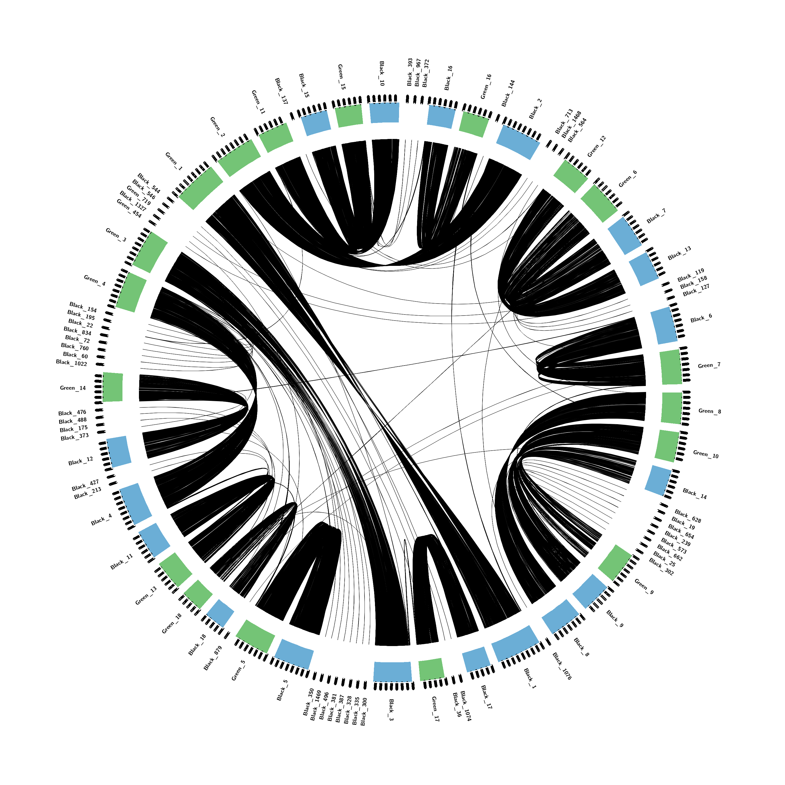

# Finding orthology and synteny with orthofinder, iadhore, and circos.

Here we will be using Orthofinder to identify orthologous genes across three species of Abalone. Orthofinder output will be used as input for i-adhore to identify long-term ancestral synteny using homeologous gene order. This information will then be converted  needed to create a Circos plot displaying synteny between two species.

Orthofinder is a robust software that can find orthologs very quickly and with very little input.  We are going to take the output from orthofinder and use it as input for iAdhore.  I adhore is a program that uses homeologous genes to identify longer-term ancestral synteny (in comparison to direct chromosomal alignments (Mummer, Minimap2)).  With some modifications, the output from iadhore can be used to draw synteny plots with circos, or just to identify genomic feature overlap with Bedtools by creating a synteny gff.


### iadhore installation
```


#Download the source from the Vandepeer lab site
https://www.vandepeerlab.org/?q=tools/i-adhore30


tar -zxvf i-adhore-3.0.01.tar.gz
cd i-adhore-3.0.01/
mkdir build; cd build
cmake .. -DCMAKE_INSTALL_PREFIX=.
make
make install

# add the iadhore bin to your path. 
vi ~/.bashrc
## Add the path to your installations iadhore bin. 
export PATH="/work/gif3/masonbrink/USDA/01_OrthofinderSynteny/04_iadhoreInstall/i-adhore-3.0.01/build/bin/:$PATH"
source ~/.bashrc

```


###  The necessary files -- Genome, proteins, GFF
```
/work/gif3/masonbrink/USDA/01_OrthofinderSynteny/01_GenomicResources
#Black Abalone
ln -s /work/gif/remkv6/Purcell/04_Black_Abalone/16_Mikado_AllAbalone/H_cracherodiiGenome.fasta BlackAbGenome.fasta
ln -s /work/gif/remkv6/Purcell/04_Black_Abalone/16_Mikado_AllAbalone/mikado.loci.gff3 BlackAbGeneAnnots.gff3

#White Abalone
ln -s /work/gif/remkv6/Purcell/02_WhiteAbalanePseudomolecule/19_mikado2/mikado.loci.gff3 WhiteAbGeneAnnots.gff3
ln -s /work/gif/archiveNova/Purcell/abalone/whiteabalone/Assemblies/FilteredH.sorenseniGenome.fasta WhiteAbGenome.fasta

#Green Abalone
ln -s /work/gif/remkv6/Purcell/03_Green_Abalone/18_mikado2/mikado.loci.gff3 GreenAbGeneAnnots.gff3
ln -s /work/gif/remkv6/Purcell/03_Green_Abalone/18_mikado2/SoftmaskedFilteredHalful_medaka.FINAL.fasta GreenAbGenome.fasta
```

Convert GFF to Proteins of acceptable format
If your protein fasta has more than one protein isoform for each gene, then you need to extract just the primary isoform.  Otherwise there will be downstream errors with iadhore.  This can usually be done filtering names by the last characters of the first column of your fasta header.  
```
#getting proteins
ml miniconda3; source activate cufflinks
gffread -g BlackAbGenome.fasta BlackAbGeneAnnots.gff3 -y BlackAbProteins.fasta -x BlackAbTranscripts.fasta
gffread -g WhiteAbGenome.fasta WhiteAbGeneAnnots.gff3 -y WhiteAbProteins.fasta -x WhiteAbTranscripts.fasta
gffread -g GreenAbGenome.fasta GreenAbGeneAnnots.gff3 -y GreenAbProteins.fasta -x GreenAbTranscripts.fasta

#Remove extra info from fasta header, add identifying info to fasta header, remove periods at the end of protein sequence
less BlackAbProteins.fasta |awk '{print $1}' |sed 's/>/>Black_/g' | sed '/^[^>]/s/\.$//' >CleanBlackAbProteins.fasta
less GreenAbProteins.fasta |awk '{print $1}' |sed 's/>/>Green_/g' | sed '/^[^>]/s/\.$//' >CleanGreenAbProteins.fasta
less WhiteAbProteins.fasta |awk '{print $1}' |sed 's/>/>White_/g' | sed '/^[^>]/s/\.$//' >CleanWhiteAbProteins.fasta

# indexes the protein fasta, grab every fasta header, remove those that do not have a 1 as the last character, remove ">", extract just primary isoforms
ml cdbfasta;cdbfasta CleanBlackAbProteins.fasta; grep ">" CleanBlackAbProteins.fasta |awk 'substr($1,length($1),length($1))=="1"' |sed 's/>//g' |cdbyank CleanBlackAbProteins.fasta - >PrimaryCleanBlackAbProteins.fasta
ml cdbfasta;cdbfasta CleanGreenAbProteins.fasta; grep ">" CleanGreenAbProteins.fasta |awk 'substr($1,length($1),length($1))=="1"' |sed 's/>//g' |cdbyank CleanGreenAbProteins.fasta - >PrimaryCleanGreenAbProteins.fasta
ml cdbfasta;cdbfasta CleanWhiteAbProteins.fasta; grep ">" CleanWhiteAbProteins.fasta |awk 'substr($1,length($1),length($1))=="1"' |sed 's/>//g' |cdbyank CleanWhiteAbProteins.fasta - >PrimaryCleanWhiteAbProteins.fasta
```

Rename genome scaffolds if your different species' genomes have similar name conventions
```
sed 's/HiC_scaffold_/Black_/g'  BlackAbGenome.fasta >RenamedBlackAbGenome.fasta
sed 's/HiC_scaffold_/Green_/g'  GreenAbGenome.fasta >RenamedGreenAbGenome.fasta
sed 's/HiC_scaffold_/White_/g'  WhiteAbGenome.fasta >RenamedWhiteAbGenome.fasta
```
Filter the GFF to only have primary isoforms, rename the scaffolds the same as they are above. Rename the genes.
```
awk '$3=="mRNA"' BlackAbGeneAnnots.gff3 |sed 's/;/\t/g' |awk 'substr($9,length($9),length($9))=="1"' |sed 's/^HiC_scaffold_/Black_/1' |sed 's/ID=/Black_/g' >PrimaryBlackAbGeneAnnots.gff3
awk '$3=="mRNA"' GreenAbGeneAnnots.gff3 |sed 's/;/\t/g' |awk 'substr($9,length($9),length($9))=="1"' |sed 's/^HiC_scaffold_/Green_/g' |sed 's/ID=/Green_/g' >PrimaryGreenAbGeneAnnots.gff3
awk '$3=="mRNA"' WhiteAbGeneAnnots.gff3 |sed 's/;/\t/g' |awk 'substr($9,length($9),length($9))=="1"' |sed 's/^HiC_scaffold_/White_/g' |sed 's/ID=/White_/g' >PrimaryWhiteAbGeneAnnots.gff3
```


# Run orthofinder on protein sets

Orthofinder is pretty amazing. All that is needed is a new folder that has just your protein fastas. There are lots of options to play with, but I just used default for simplicity.  (-M dendroblast, -S BLAST, -T fasttree, -I 1.5).  
```
#/work/gif3/masonbrink/USDA/01_OrthofinderSynteny/02_Orthofinder
mkdir ProtSeq
cd ProtSeq/
for f in ../../01_GenomicResources/PrimaryClean*fasta; do ln -s $f;done

ml orthofinder/2.5.4-py310-4cstbgx; orthofinder -f ProtSeq/ -t 36 -a 35 -n Orthofinder
```

### Prepare Ortholog file input
iADhore is the best synteny prediction program that I've used, and takes minutes to run.  However, preparing the input can be complex, and if a single gene is missing from your files, it will complain with some vague errors. Here are some of the important points to preparing the files for iADhore:  Every gene must be represented in both the ortholog file and in the scaffold files.  The gene names must be an EXACT MATCH between the ortholog file and the scaffold files. The ortholog file must be TAB separated, while the iadhore.ini file needs to be space separated.    <brk>
```
#get rid of carriage returns
dos2unix Orthogroups.tsv
dos2unix Orthogroups_UnassignedGenes.tsv

#Get rid of header, convert tabs and spaces to newline, remove empty lines, for each gene list family and orthogroup, remove colon and comma formatting.   Concatenate this with the unassigned genes, remove header, 
less Orthogroups.tsv |awk 'NR>1' |tr " " "\n" |tr "\t" "\n" |sed '/^$/d' |awk -v Family=0 '{if(substr($1,1,2)=="OG") {Family=$1} else {print $0,Family}}' |sed 's/://g' |sed 's/,//g' |cat - <(less Orthogroups_UnassignedGenes.tsv |awk 'NR>1 {print $2,$1}' |tr " " "\t" ) |tr " " "\t" >Orthologs.list


#This is the output that is needed family of orthologues (FYI: iadhore calls this a blast table). Essentially it is getting EVERY gene from your "Orthogroups.txt" and "Orthogroups_UnassignedGenes.csv", and creating a table assigning genes to a family.
###################################################
Green_mikado.HiC_scaffold_1G425.1       OG0000384
Green_mikado.HiC_scaffold_6G673.1       OG0000384
Green_mikado.HiC_scaffold_9G1777.1      OG0000384
White_mikado.HiC_scaffold_10G1529.1     OG0000384
White_mikado.HiC_scaffold_7G953.1       OG0000384
Black_mikado.HiC_scaffold_10G40.1       OG0000385
Black_mikado.HiC_scaffold_10G43.1       OG0000385
Green_mikado.HiC_scaffold_12G1528.1     OG0000385
Green_mikado.HiC_scaffold_14G2246.1     OG0000385
Green_mikado.HiC_scaffold_1G250.1       OG0000385
Green_mikado.HiC_scaffold_7G1926.1      OG0000385
Green_mikado.HiC_scaffold_8G900.1       OG0000385
Green_mikado.HiC_scaffold_9G673.1       OG0000385
Green_mikado.HiC_scaffold_9G682.1       OG0000385
White_mikado.HiC_scaffold_14G1526.1     OG0000385
White_mikado.HiC_scaffold_2G2192.1      OG0000385
Black_mikado.HiC_scaffold_10G151.1      OG0000386
Black_mikado.HiC_scaffold_14G172.1      OG0000386
Black_mikado.HiC_scaffold_18G438.1      OG0000386
Black_mikado.HiC_scaffold_343G2.1       OG0000386
Black_mikado.HiC_scaffold_5885G1.1      OG0000386
Green_mikado.HiC_scaffold_11G2040.1     OG0000386
Green_mikado.HiC_scaffold_18G1370.1     OG0000386
Green_mikado.HiC_scaffold_18G80.1       OG0000386
White_mikado.HiC_scaffold_12G253.1      OG0000386
White_mikado.HiC_scaffold_16G318.1      OG0000386
White_mikado.HiC_scaffold_2G1000.1      OG0000386
Black_mikado.HiC_scaffold_10G349.1      OG0000387
Black_mikado.HiC_scaffold_10G351.1      OG0000387
Green_mikado.HiC_scaffold_11G1907.1     OG0000387
Green_mikado.HiC_scaffold_11G1907.2     OG0000387
Green_mikado.HiC_scaffold_11G1907.3     OG0000387
Green_mikado.HiC_scaffold_11G1907.4     OG0000387
Green_mikado.HiC_scaffold_11G1907.5     OG0000387
Green_mikado.HiC_scaffold_11G1907.6     OG0000387
White_mikado.HiC_scaffold_9G2069.1      OG0000387
White_mikado.HiC_scaffold_9G2070.1      OG0000387
White_mikado.HiC_scaffold_9G2070.2      OG0000387
Black_mikado.HiC_scaffold_10G444.1      OG0000388
Black_mikado.HiC_scaffold_1234G5.1      OG0000388
Black_mikado.HiC_scaffold_1234G6.1      OG0000388
Black_mikado.HiC_scaffold_13G1628.1     OG0000388
Black_mikado.HiC_scaffold_13G1629.1     OG0000388
Black_mikado.HiC_scaffold_2075G2.1      OG0000388
Green_mikado.HiC_scaffold_11G1793.1     OG0000388
Green_mikado.HiC_scaffold_12G390.1      OG0000388
Green_mikado.HiC_scaffold_12G473.1      OG0000388
etc...
###################################################
```
Because in this comparison I have 3 different species, I need to make a subset of the ortholog files specific to each two species

/work/gif3/masonbrink/USDA/01_OrthofinderSynteny/03_iadhore/01_Black_Green
grep -e "Black" -e "Green" ../Orthologs.list >BlackGreenOrthologues.list

# i-adhore Black vs Green
### Create lists of files named by scaffold name
The next step is to create files containing lists of genes with strand orientation. BEWARE, the genes/proteins must have the EXACT same names as the genes in your "Orthologs.list" file. Iadhore will throw errors if your two species have scaffolds with the exact same names. You will also run into errors if you did not eliminate all non-primary protein isoforms from your Orthofinder run.
```
#Essentially here, you are extracting: scaffold name, protein name, strand orientation.
Beware, the names extracted from your gff must match the names in your protein fasta, so this can be tricky if they are named differently or if your protein name is not always in the same column.  The feature type can also vary among different gffs, so your column 3 feature may be: gene, CDS, or mRNA. 

#now make all the query files for iadhore
### This will make a two columned file with (protein_nameOrientation scaffold_name).  The scaffold name will be used to name the files in the last bit of code below, but we will get rid of it later.

#/work/gif3/masonbrink/USDA/01_OrthofinderSynteny/03_iadhore/01_Black_Green
mkdir query; cd query
less ../../../01_GenomicResources/PrimaryBlackAbGeneAnnots.gff3 |sed 's/;/\t/g' |sed 's/ID=//g' |awk '{print $9$7,$1}'  |awk '{print >> $2 ".lst"; close($2)}'

#since we used the scaffold name to create/name the files, we can get rid of it now.
sed -i 's/ .*//g' *.lst

ls *lst >input.txt
#This can vary also if you have periods "." in your gene names.
paste <(cut -f 1 -d "." input.txt) <(awk '{print "query/"$1}' input.txt)>query.ini
#Since this genome still has unscaffolded contigs, there were logs in this query.ini file. 
##############################################################
Black_10003     query/Black_10003.lst
Black_1000      query/Black_1000.lst
Black_10010     query/Black_10010.lst
Black_10026     query/Black_10026.lst
Black_1003      query/Black_1003.lst
Black_1004      query/Black_1004.lst
Black_1005      query/Black_1005.lst
Black_1009      query/Black_1009.lst
Black_100       query/Black_100.lst
Black_1010      query/Black_1010.lst
Black_1012      query/Black_1012.lst
Black_1013      query/Black_1013.lst
Black_10141     query/Black_10141.lst
Black_1014      query/Black_1014.lst
Black_10153     query/Black_10153.lst
Black_10166     query/Black_10166.lst
Black_1017      query/Black_1017.lst
Black_1018      query/Black_1018.lst
Black_101       query/Black_101.lst
Black_1021      query/Black_1021.lst
Black_10225     query/Black_10225.lst
Black_10226     query/Black_10226.lst
Black_1022      query/Black_1022.lst
Black_1023      query/Black_1023.lst
Black_1024      query/Black_1024.lst
Black_10253     query/Black_10253.lst
Black_10268     query/Black_10268.lst
Black_1026      query/Black_1026.lst
Black_10278     query/Black_10278.lst
Black_1027      query/Black_1027.lst
Black_1028      query/Black_1028.lst
Black_1029      query/Black_1029.lst
Black_102       query/Black_102.lst
Black_1030      query/Black_1030.lst
Black_10316     query/Black_10316.lst
Black_1031      query/Black_1031.lst

##############################################################

#It is filled with protein names and orientation.  see below
less Black_2.lst
###############################################################
Black_mikado.HiC_scaffold_2G1.1-
Black_mikado.HiC_scaffold_2G2.1+
Black_mikado.HiC_scaffold_2G3.1-
Black_mikado.HiC_scaffold_2G4.1-
Black_mikado.HiC_scaffold_2G5.1-
Black_mikado.HiC_scaffold_2G6.1+
Black_mikado.HiC_scaffold_2G7.1+
Black_mikado.HiC_scaffold_2G8.1+
Black_mikado.HiC_scaffold_2G9.1-
Black_mikado.HiC_scaffold_2G10.1-
Black_mikado.HiC_scaffold_2G11.1-
Black_mikado.HiC_scaffold_2G12.1+
Black_mikado.HiC_scaffold_2G13.1-
Black_mikado.HiC_scaffold_2G14.1+
Black_mikado.HiC_scaffold_2G15.1+
Black_mikado.HiC_scaffold_2G16.1+
Black_mikado.HiC_scaffold_2G17.1-
etc..
###############################################################

#Now lets do the same for the subject genome.
cd ../
mkdir subject;cd subject
less ../../../01_GenomicResources/PrimaryGreenAbGeneAnnots.gff3 |sed 's/;/\t/g' |sed 's/ID=//g' |awk '{print $9$7,$1}'  |awk '{print >> $2 ".lst"; close($2)}'

sed -i 's/ .*//g' *.lst
ls *lst >input.txt
paste <(cut -f 1 -d "." input.txt) <(awk '{print "subject/"$1}' input.txt)>subject.ini

#now exit the subject folder and concatenate the query and subject output
cd ..
cat query/query.ini subject/subject.ini |tr "\t" " " >iadhore.ini

#iadhore.ini comes out like this
####################################################
Black_10003 query/Black_10003.lst
Black_1000 query/Black_1000.lst
Black_10010 query/Black_10010.lst
Black_10026 query/Black_10026.lst
Black_1003 query/Black_1003.lst
Black_1004 query/Black_1004.lst
Black_1005 query/Black_1005.lst
Black_1009 query/Black_1009.lst
Black_100 query/Black_100.lst
Black_1010 query/Black_1010.lst
Black_1012 query/Black_1012.lst
Black_1013 query/Black_1013.lst
Black_10141 query/Black_10141.lst
etc.
Black_9971 query/Black_9971.lst
Black_997 query/Black_997.lst
Black_9982 query/Black_9982.lst
Black_99 query/Black_99.lst
Black_9 query/Black_9.lst
Green_1000 subject/Green_1000.lst
Green_1004 subject/Green_1004.lst
Green_1005 subject/Green_1005.lst
Green_1008 subject/Green_1008.lst
Green_100 subject/Green_100.lst
Green_1011 subject/Green_1011.lst
etc.
###############################################


#This is exactly what iadhore wants in this iadhore.ini file (INCLUDING THE NEWLINES!).   You can name the genome anything you want. 
####################################################
genome=BlackAbalone
Black_10003 query/Black_10003.lst
Black_1000 query/Black_1000.lst
Black_10010 query/Black_10010.lst
Black_10026 query/Black_10026.lst
Black_1003 query/Black_1003.lst
Black_1004 query/Black_1004.lst
Black_1005 query/Black_1005.lst
Black_1009 query/Black_1009.lst
Black_100 query/Black_100.lst
Black_1010 query/Black_1010.lst
Black_1012 query/Black_1012.lst
Black_1013 query/Black_1013.lst
Black_10141 query/Black_10141.lst
etc.
Black_9971 query/Black_9971.lst
Black_997 query/Black_997.lst
Black_9982 query/Black_9982.lst
Black_99 query/Black_99.lst
Black_9 query/Black_9.lst

genome=GreenAbalone
Green_1000 subject/Green_1000.lst
Green_1004 subject/Green_1004.lst
Green_1005 subject/Green_1005.lst
Green_1008 subject/Green_1008.lst
Green_100 subject/Green_100.lst
Green_1011 subject/Green_1011.lst
etc.

NOTE THAT YOU NEED TO REMOVE ALL COMMENTS FROM iadhore.ini, IF YOU ARE TO USE IT. I MEAN THE STUFF BELOW THIS COMMENT.

#Our ortholog list made above
blast_table=BlackGreenOrthologues.list
#This is the type of orthologs we are providing, and is typically the easiest to provide.
table_type=family

#threads, though it runs very fast
number_of_threads=16
#this keeps iadhore from producing an image for every synteny alignment, which can be exhaustive at times.
visualizeAlignment=false
#Name of the folder 
output_path= output
# keeping it at level 2 keeps downstream analyses simpler
level_2_only=true
#Best alignment method is greedy graph 2
alignment_method=gg2

#These are the settings I usually start with, but also require optimization. Optimization involves rerunning iadhore multiple times until you get the syntenic bands that are not erroneous. i.e. too many gene gaps, too few anchors, synteny that is 1mb in one genome but is syntenic to 20mb in the other genome is usually wrong.   
prob_cutoff=0.001
anchor_points=3
gap_size=15
cluster_gap=20
q_value=.05
#####################################################

#time to run iadhore!
module load iadhore
i-adhore iadhore.ini


If you get a gene missing from blast table error, most likely you either have a gene naming scheme that does not match your files in the query and subject folders, or your blast table (Orthologues.list) is space separated, when it should be tab separated. Do not put comments in the iadhore.ini file that I have listed above.

If iadhore is successful, you will generate an output folder with some informative files like "multiplicons.txt" and "segments.txt"

```
### Time to put it into circos! Green vs Black
Circos is just a good visualization tool for synteny, which I find to be more informative than dot plots. Circos can go much further than dot plots by allowing other features to be plotted alongside the synteny, for example: gene density, repeat density, snp density, etc)
```

/work/gif3/masonbrink/USDA/01_OrthofinderSynteny/05_Circos/01_BlackGreen
#Softlink all relevant files:(genome, GFF, segments.txt)
ln -s ../../03_iadhore/01_Black_Green/output/segments.txt
ln -s ../../01_GenomicResources/PrimaryGreenAbGeneAnnots.gff3
ln -s ../../01_GenomicResources/PrimaryBlackAbGeneAnnots.gff3
ln -s ../../01_GenomicResources/RenamedBlackAbGenome.fasta
ln -s ../../01_GenomicResources/RenamedGreenAbGenome.fasta


# The five scripts below will just work if you change 3 things.  1.  change "GreenAbalone" to whatever you named your second genome in your iadhore.ini file.  2.  change PrimaryGreenAbGeneAnnots.gff3 to the gff that is associated with the second genome name in your iadhore.ini file.  3. change the PrimaryBlackAbGeneAnnots.gff3 to the gff you created that is associated with the first genome name in your iadhore.ini file.
Essentially what is happening below is that you swapping columns in segments.txt until you get pathogenic all on one side.  Then I extract the 5' position for the 5' syntenic gene and the 3' position for the 3' syntenic gene for each genome

less segments.txt  |awk  'NR>1{print $2,$5,$6}' |awk '{if(NR%2) {print "#"$1,$2,$3}else {print $1,$2,$3}}'  |tr "\n" "\t" |sed 's/\t#/\n/g' |awk '{print $2,$3,$5,$6}' |awk '{if(substr($1,1,5)=="Black") {print $1,$2,$3,$4} else{print $3,$4,$1,$2}}' |awk 'substr($1,1,5)!=substr($3,1,5) {print $1}' |xargs -I xx awk '$9=="'xx'"' PrimaryBlackAbGeneAnnots.gff3|awk '{if($7=="+") {print $1,$4} else {print $1,$5}}' >Col1.list
less segments.txt  |awk  'NR>1{print $2,$5,$6}' |awk '{if(NR%2) {print "#"$1,$2,$3}else {print $1,$2,$3}}'  |tr "\n" "\t" |sed 's/\t#/\n/g' |awk '{print $2,$3,$5,$6}' |awk '{if(substr($1,1,5)=="Black") {print $1,$2,$3,$4} else {print $3,$4,$1,$2}}' |awk 'substr($1,1,5)!=substr($3,1,5){print $2}' |xargs -I xx awk '$9=="'xx'"' PrimaryBlackAbGeneAnnots.gff3|awk '{if($7=="+") {print $4} else {print $5}}' >Col2.list
less segments.txt  |awk  'NR>1{print $2,$5,$6}' |awk '{if(NR%2) {print "#"$1,$2,$3}else {print $1,$2,$3}}'  |tr "\n" "\t" |sed 's/\t#/\n/g' |awk '{print $2,$3,$5,$6}' |awk '{if(substr($1,1,5)=="Black") {print $1,$2,$3,$4} else {print $3,$4,$1,$2}}' |awk 'substr($1,1,5)!=substr($3,1,5){print $3}' |xargs -I xx awk '$9=="'xx'"' PrimaryGreenAbGeneAnnots.gff3|awk '{if($7=="+") {print $1,$4} else {print $1,$5}}' >Col3.list
less segments.txt  |awk  'NR>1{print $2,$5,$6}' |awk '{if(NR%2) {print "#"$1,$2,$3}else {print $1,$2,$3}}'  |tr "\n" "\t" |sed 's/\t#/\n/g' |awk '{print $2,$3,$5,$6}' |awk '{if(substr($1,1,5)=="Black") {print $1,$2,$3,$4} else {print $3,$4,$1,$2}}' |awk 'substr($1,1,5)!=substr($3,1,5){print $4}' |xargs -I xx awk '$9=="'xx'"' PrimaryGreenAbGeneAnnots.gff3|awk '{if($7=="+") {print $4} else {print $5}}' >Col4.list

#This concatenates each of the locations and places them so the start is always before the end.
paste Col1.list Col2.list Col3.list Col4.list |awk '{if ($2>$3) {print $1,$3,$2,$4,$5,$6} else {print $0}}' |awk '{if ($5>$6) {print $1,$2,$3,$4,$6,$5} else {print $0}}' |tr "\t" " " >SyntenicRibbons.conf


#Here is the SyntenicRibbons.conf file #scaffold position position,scaffold, position, position
#These two commands are essentially extracting the scaffold lengths in your genome and putting them in the proper format.
bioawk -c fastx '{print $name,length($seq)}' RenamedBlackAbGenome.fasta  |awk '{print "chr","-",$1,$1,"0",$2,"blue"}'  >RenamedBlackAbKaryotype.conf

bioawk -c fastx '{print $name,length($seq)}' RenamedGreenAbGenome.fasta  |awk '{print "chr","-",$1,$1,"0",$2,"green"}' >RenamedGreenAbKaryotype.conf


#The next six scripts below are essentially extracting the scaffolds that have some synteny. You dont want to display those scaffolds that do not have any information, right?.  Make sure you have the proper column for each extraction.  Remember column 1 is one species' scaffolds, and column 4 is the other species' scaffolds
awk '{print $1}' SyntenicRibbons.conf|while read line; do echo "awk '\$3==\""$line"\"' RenamedBlackAbKaryotype.conf >>tmpKaryotype.conf1";done >RenamedBlackAbKaryotype.sh
sh RenamedBlackAbKaryotype.sh

awk '{print $4}' SyntenicRibbons.conf|while read line; do echo "awk '\$3==\""$line"\"' RenamedGreenAbKaryotype.conf >>tmpKaryotype.conf2";done >RenamedGreenAbKaryotype.sh
sh RenamedGreenAbKaryotype.sh
cat <(sort tmpKaryotype.conf1 |uniq) <(sort tmpKaryotype.conf2 |uniq) >karyotype.conf


#Now lets reduce the number of times the circos synteny plot lines overlap, so it is more pleasing to the eye.  
#I just download this tool everytime because it is small and easier than finding the original circos installation directory

wget http://circos.ca/distribution/circos-tools-0.22.tgz
 tar -zxvf circos-tools-0.22.tgz

 #We will use the tmpKaryotype.conf1 file to get the scaffold names that we want grouped together.  You can also use tmpKaryotype.conf2 to do this.  I would suggest using the file that is the smallest.
 #the below script generates the command.
 sort tmpKaryotype.conf1 |uniq|awk '{print $3}' |tr "\n" "," |sed 's/.$//' |awk '{print "circos-tools-0.22/tools/orderchr/bin/orderchr -links SyntenicRibbons.conf -karyotype karyotype.conf - "$0" -static_rx "$0 }' |less


 #it runs something like this
circos-tools-0.22/tools/orderchr/bin/orderchr -links SyntenicRibbons.conf -karyotype karyotype.conf - Black_1022,Black_1074,Black_1076,Black_10,Black_119,Black_11,Black_127,Black_12,Black_1327,Black_137,Black_13,Black_144,Black_1468,Black_1469,Black_14,Black_154,Black_158,Black_15,Black_16,Black_175,Black_17,Black_18,Black_195,Black_19,Black_1,Black_213,Black_22,Black_239,Black_25,Black_2,Black_300,Black_302,Black_328,Black_335,Black_350,Black_36,Black_372,Black_373,Black_381,Black_387,Black_393,Black_3,Black_427,Black_476,Black_488,Black_496,Black_4,Black_544,Black_546,Black_564,Black_573,Black_5,Black_60,Black_628,Black_654,Black_662,Black_6,Black_713,Black_72,Black_760,Black_7,Black_834,Black_879,Black_8,Black_967,Black_9 -static_rx Black_1022,Black_1074,Black_1076,Black_10,Black_119,Black_11,Black_127,Black_12,Black_1327,Black_137,Black_13,Black_144,Black_1468,Black_1469,Black_14,Black_154,Black_158,Black_15,Black_16,Black_175,Black_17,Black_18,Black_195,Black_19,Black_1,Black_213,Black_22,Black_239,Black_25,Black_2,Black_300,Black_302,Black_328,Black_335,Black_350,Black_36,Black_372,Black_373,Black_381,Black_387,Black_393,Black_3,Black_427,Black_476,Black_488,Black_496,Black_4,Black_544,Black_546,Black_564,Black_573,Black_5,Black_60,Black_628,Black_654,Black_662,Black_6,Black_713,Black_72,Black_760,Black_7,Black_834,Black_879,Black_8,Black_967,Black_9
calculating round 0
report round 0 minimize init 141285 final 26320 change 81.37%
calculating round 1
report round 1 minimize init 26320 final 9978 change 62.09%
calculating round 2
report round 2 minimize init 9978 final 8770 change 12.11%
calculating round 3
report round 3 minimize init 8770 final 8770 change 0.00%
scorereport init 141285 final 8770 change 93.79%
chromosomes_order = Green_6,Black_7,Black_13,Black_119,Black_158,Black_127,Black_6,Green_7,Green_8,Green_10,Black_14,Black_628,Black_19,Black_654,Black_239,Black_573,Black_662,Black_25,Black_302,Green_9,Black_9,Black_8,Black_1076,Black_1,Black_17,Black_1074,Black_36,Green_17,Black_3,Black_300,Black_335,Black_328,Black_387,Black_381,Black_496,Black_1469,Black_350,Black_5,Green_5,Black_879,Black_18,Green_18,Green_13,Black_11,Black_4,Black_213,Black_427,Black_12,Black_373,Black_175,Black_488,Black_476,Green_14,Black_1022,Black_60,Black_760,Black_72,Black_834,Black_22,Black_195,Black_154,Green_4,Green_3,Green_454,Black_1327,Green_719,Black_546,Black_544,Green_1,Green_2,Green_11,Black_137,Black_15,Green_15,Black_10,Black_393,Black_967,Black_372,Black_16,Green_16,Black_144,Black_2,Black_713,Black_1468,Black_564,Green_12


 #the last bit is what we want chromosomes_order = .....
```
### Paste in the remaining Circos files and run Circos!
```

#Essentially you can copy and paste the four files listed below: circos.conf, ticks.conf, bands.conf, and ideogram.conf. However, not every genome is the same size as an abalone genome, so a few things can be changed.
1. In ideogram.conf you can change "radius           = 0.84r".  This will alter how far out your scaffold names will display
2. In circos.conf you can change "chromosomes_units = 100000" to a larger or smaller number to shrink or enlarge how the chromosomes display
3.  In ticks.conf you can change "multiplier       = 1e-5" to decide how often to label your ticks in your circos chart.

#circos.conf
#############################################################################
karyotype = ./karyotype.conf
chromosomes_units = 100000
  <<include ideogram.conf>>
  <<include ticks.conf>>
  <<include bands.conf>>

  <links>
  <link>
    file=SyntenicRibbons.conf
    radius = 0.94r
    bezier_radius = 0.1r
    thickness = 1
    ribbon = yes
  </link>
  </links>


<image>
  <<include /opt/rit/el9/20230413/app/linux-rhel9-x86_64_v3/gcc-11.2.1/circos-0.69-6-learnz7tfqrflpcu57fbdtzxc47cii2a/lib/circos/etc/image.conf>>
angle_offset* = -46
</image>
<<include /opt/rit/el9/20230413/app/linux-rhel9-x86_64_v3/gcc-11.2.1/circos-0.69-6-learnz7tfqrflpcu57fbdtzxc47cii2a/lib/circos/etc/patterns.conf>>
 <<include ./housekeeping.conf>>
chromosomes_order = Green_6,Black_7,Black_13,Black_119,Black_158,Black_127,Black_6,Green_7,Green_8,Green_10,Black_14,Black_628,Black_19,Black_654,Black_239,Black_573,Black_662,Black_25,Black_302,Green_9,Black_9,Black_8,Black_1076,Black_1,Black_17,Black_1074,Black_36,Green_17,Black_3,Black_300,Black_335,Black_328,Black_387,Black_381,Black_496,Black_1469,Black_350,Black_5,Green_5,Black_879,Black_18,Green_18,Green_13,Black_11,Black_4,Black_213,Black_427,Black_12,Black_373,Black_175,Black_488,Black_476,Green_14,Black_1022,Black_60,Black_760,Black_72,Black_834,Black_22,Black_195,Black_154,Green_4,Green_3,Green_454,Black_1327,Green_719,Black_546,Black_544,Green_1,Green_2,Green_11,Black_137,Black_15,Green_15,Black_10,Black_393,Black_967,Black_372,Black_16,Green_16,Black_144,Black_2,Black_713,Black_1468,Black_564,Green_12


#############################################################################

ticks.conf
###############################################################################
show_ticks          = yes
show_tick_labels    = no
<ticks>
   radius           = 1r
   color            = black
   thickness        = 10p
   multiplier       = 1e-7
   format           = %d
<tick>
   spacing        = 100u
   size           = 25p
   show_label     = yes
   label_size     = 25p
   label_offset   = 10p
   format         = %d
 </tick>

</ticks>

###############################################################################

bands.conf
###############################################################################
<bands>
   show_bands = yes
   fill_bands = yes
   band_transparency = 4
</bands>
###############################################################################

ideogram.conf
###############################################################################
<ideogram>
 <spacing>
   default = 0.006r
   break   = 30u
   axis_break_at_edge = yes
   axis_break         = yes
   axis_break_style   = 2
   <break_style 1>
         stroke_color     = black
         thickness        = 0.45r
         stroke_thickness = 2p
   </break>
   <break_style 2>
         stroke_color     = black
         stroke_thickness = 5p
         thickness        = 4r
   </break>
 </spacing>
 radius           = 0.74r
 thickness        = 80p
 fill             = yes
 stroke_color     = white
 stroke_thickness = 4p
 fill_color       = black
 show_label       = yes
 label_font       = bold
 label_size       = 16
 label_parallel   = no

 label_radius = dims(ideogram,radius_outer) + 0.06r
</ideogram>
###############################################################################

#This last file I always copy to the working directory, just in case I have more than 200 chromosomes I want to display.
If so, change this line
cp /opt/rit/el9/20230413/app/linux-rhel9-x86_64_v3/gcc-11.2.1/circos-0.69-6-learnz7tfqrflpcu57fbdtzxc47cii2a/lib/circos/etc/housekeeping.conf .
"max_ideograms        = 200"


#All that is left is to run circos!

circos -conf circos.conf
```





---
[Table of contents](compGenomics_index.md)
