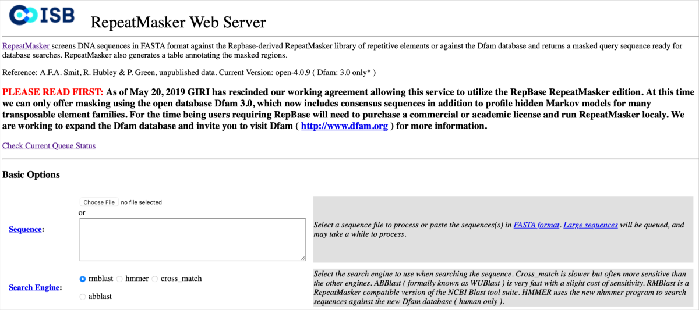
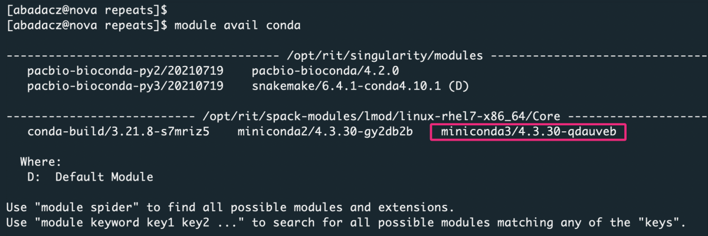
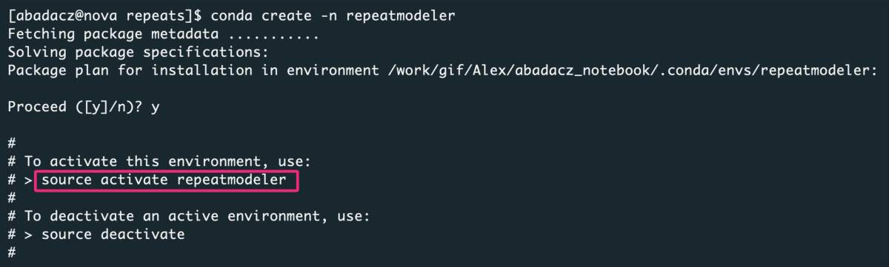
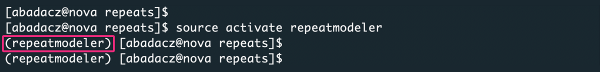
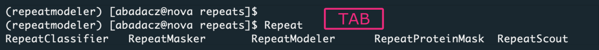
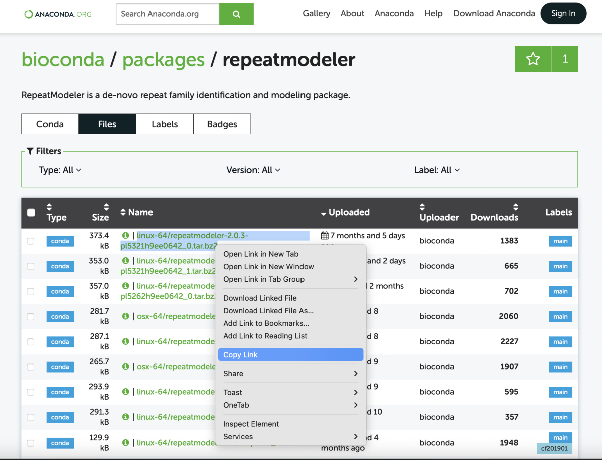
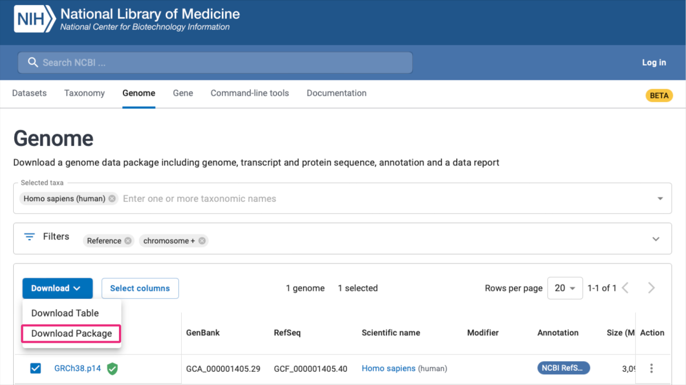
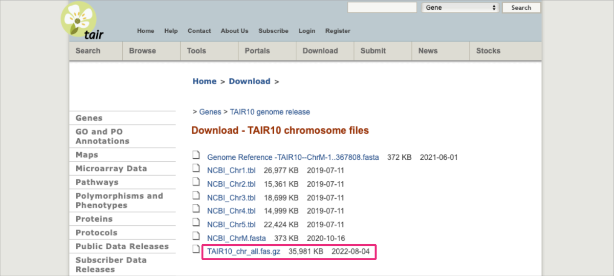



# Software overview

<b><u>RepeatModeler</u> is a repeat-identifying software that can provide a list of repeat family sequences to mask repeats in a genome with <u>RepeatMasker</u>.</b>

Things to consider with this software is that it can take a long time with large genomes (>1GB requires 96hrs on a 16 CPU node). You also need to set the correct parameters in `RepeatModeler` so that you get repeats that are not only grouped by family but are also annotated (*learn more in the section [Repeats identification](#repeats-identification)*).


Consider browsing the software resources to get the most up-to-date news. You can use the links provided anytime to explore in-depth documentation or get guidance for results interpretation.

* **Project Page** [*services, software, docs, community*]: <a href="http://www.repeatmasker.org/" target="_blank">http://www.repeatmasker.org/  ⤴</a>
* RepeatModeler [*download, installation, example run*]: <a href="http://www.repeatmasker.org/RepeatModeler/" target="_blank">http://www.repeatmasker.org/RepeatModeler/  ⤴</a>
* RepeatMasker [*download, installation*]: <a href="http://www.repeatmasker.org/RepeatMasker/" target="_blank">http://www.repeatmasker.org/RepeatMasker/  ⤴</a>
  * <a href="http://www.repeatmasker.org/webrepeatmaskerhelp.html" target="_blank">Documentation  ⤴</a>
  * <a href="http://www.repeatmasker.org/webrepeatmaskerhelp.html#reading" target="_blank">Interpreting Results  ⤴</a>
  * <a href="http://www.repeatmasker.org/webrepeatmaskerhelp.html#uses" target="_blank">Example Uses  ⤴</a>
  * <a href="http://www.repeatmasker.org/webrepeatmaskerhelp.html#sensitivity" target="_blank">Sensitivity  ⤴</a>
  * <a href="http://www.repeatmasker.org/webrepeatmaskerhelp.html#selectivity" target="_blank">Selectivity  ⤴</a>

<br><br>

# Single Use - online service

There is a <a href="http://www.repeatmasker.org/cgi-bin/WEBRepeatMasker" target="_blank">RepeatMasker Web Server  ⤴</a> available online. Just go there, paste your query DNA sequence (or load it from a file), and set up the analysis variant using options widgets. The web server combines functions of both RepeatModeler and RepeatMasker.



|**PROS:**|**CONS:**|
|---------|---------|
|• installation NOT required                            |• queue system with limited resources |
|• straightforward interface and usage                  |• only Dfam database available as the reference |
|• easily accessible option description with usage tips |• limited possibility of multiple tasks automation |
|• two separate sections for basic and advanced options |• manual submission of every task |
|• on request e-mail notification or HTML report        |

<br><br>

# Regular Use - get it locally

If you suppose more regular analyses that require repetition detection or the subject of your research are large genomes, you should consider installing the **Repeat-*** packages locally, especially on the HPC (*High-Performance Computing*) infrastructure.

There are several ways to get the **RepeatModeler** and **RepeatMasker** installed on your computing machine:

* install both with **Conda** (*it also installs all prerequisites*):
  * `conda install -c bioconda repeatmodeler` (*installs version=1.0.8 in 2022*)
  * `conda install -c "bioconda/label/main" repeatmodeler=2` (*installs version=2.0.3 in 2022*)
  * browse other versions at <a href="https://anaconda.org/bioconda/repeatmodeler/files" target="_blank">https://anaconda.org/bioconda/repeatmodeler/files  ⤴</a>
<br><br>
* run using **containers** (<i>see detailed <a href="https://github.com/Dfam-consortium/TETools#using-the-container" target="_blank">instructions  ⤴</a></i>):
  * docker: `docker run -it --rm dfam/tetools:latest`
  * singularity: `singularity pull dfam-tetools-latest.sif docker://dfam/tetools:latest` <br>and then `singularity run dfam-tetools-latest.sif`
  * wrapper: `curl -sSLO https://github.com/Dfam-consortium/TETools/raw/master/dfam-tetools.sh` <br>and then `. ./dfam-tetools.sh`
<br><br>
* download **source** distribution:
  * <a href="http://www.repeatmasker.org/RepeatModeler/RepeatModeler-2.0.3.tar.gz" target="_blank">RepeatModeler-2.0.3.tar.gz  ⤴</a> (*latest release in 2022*) <br> `wget http://www.repeatmasker.org/RepeatModeler/RepeatModeler-2.0.3.tar.gz`
  * browse other versions at <a href="http://www.repeatmasker.org/RepeatModeler/#source-distribution-installation" target="_blank">http://www.repeatmasker.org/RepeatModeler/#source-distribution-installation  ⤴</a>
  * <a href="http://www.repeatmasker.org/RepeatMasker/RepeatMasker-4.1.4.tar.gz" target="_blank">RepeatMasker-4.1.4.tar.gz  ⤴</a> (*latest release in 2022*) <br> `wget http://www.repeatmasker.org/RepeatMasker/RepeatMasker-4.1.4.tar.gz`
  * browse other versions at <a href="http://www.repeatmasker.org/RepeatMasker/" target="_blank">http://www.repeatmasker.org/RepeatMasker/  ⤴</a>
<br><br>
* download the **GitHub development** source code from <a href="https://github.com/Dfam-consortium" target="_blank">https://github.com/Dfam-consortium  ⤴</a>:


Among those, the **installation within the Conda** environment seems the most straightforward, hassle-free, and robust. This one is also universally good, regardless of using a local machine or remote HPC infrastructure.

## Install with Conda (once)

<a href="https://docs.conda.io/en/latest/" target="_blank">Conda  ⤴</a> is an environment management system that runs on all: Windows, macOS, and Linux. Using simple `conda`-based commands you can create a virtual environment and within it install all required dependencies for a specific pipeline or analytic workflow.

<div style="background: #cff4fc; padding: 15px;">
<span style="font-weight:800;">PRO TIP:</span>
<br><span style="font-style:italic;">
If you are not already using Conda, go to the <a href="https://datascience.101workbook.org/03-SetUpComputingMachine/02C-basic-developer-libraries" target="_blank">Basic Developer Libraries  ⤴</a> tutorial (in <a href="https://datascience.101workbook.org" target="_blank">Data Science Workbook  ⤴</a>) for a step-by-step guide on how to set up the environment manager on your target computing machine.
<br><br>
If you have a Mac with a dual processor (Arm64 and Intel’s x86-64) you can find dedicated setup instructions in section <a href="https://datascience.101workbook.org/03-SetUpComputingMachine/03A-tutorial-installations-on-mac#install-developer-libraries" target="_blank">Install Basic Developer Tools  ⤴</a> of the <a href="https://datascience.101workbook.org/03-SetUpComputingMachine/03A-tutorial-installations-on-mac" target="_blank">Installations on MacBook Pro  ⤴</a> tutorial.
<br><br>
Typically on <u>HPC infrastructure</u>, Conda is pre-installed and available for loading as a module.
</span>
</div><br>

At this step, we assume that you have Conda installed on your computing machine/HPC infrastructure.

**A. Check Conda version on your local machine**

```
conda --version
```

*example output: conda 4.14.0*


**B. Check available Conda modules on HPC**

```
module avail conda
```



Select `conda` or `miniconda` version (from available on your HPC infrastructure) and load it as a module:

```
module load miniconda3/4.3.30-qdauveb
```

### *Create new environment*

(only once)

If you are following this tutorial for the first time (on a given computing machine), create a new Conda environment in which you install software to identify repeats in the genome.

```
conda create -n repeatmodeler
```



Activate a newly created virtual environment:

```
source activate repeatmodeler
```



Go to [https://anaconda.org/bioconda/repeatmodeler](https://anaconda.org/bioconda/repeatmodeler) to find the most recent instructions for installing `repeatmodeler` with conda:

```
conda install -c bioconda repeatmodeler
```

<div style="background: mistyrose; padding: 15px; margin-bottom: 20px;">
<span style="font-weight:800;">WARNING:</span>
<br><span style="font-style:italic;">
This step may take several minutes because not only the is <code>RepeatModeler</code> being installed but also all its dependencies. Once the installation is complete, you can use the <code>conda list</code> command to display all installed libraries and the details of their version and source.
</span>
</div>


<details><summary>Expand list of installed libraries...</summary>

<pre style="padding: 1em; font-size: 0.7em; background-color: #f1f2f3;">
  packages in environment at ~/.conda/envs/repeatmodeler:

  _libgcc_mutex        0.1                        main
  _openmp_mutex        5.1                       1_gnu
  blas                 1.0                         mkl
  blast                2.5.0                hc0b0e79_3    bioconda
  boost                1.57.0                        4
  bzip2                1.0.8                h7b6447c_0
  ca-certificates      2022.10.11           h06a4308_0
  certifi              2022.9.24                  pip
  certifi              2022.9.24       py310h06a4308_0
  h5py                 3.7.0                      pip
  h5py                 3.7.0           py310he06866b_0
  hdf5                 1.10.6               h3ffc7dd_1
  hmmer                3.3.2                h87f3376_2    bioconda
  icu                  68.1                 h2531618_0
  intel-openmp         2021.4.0          h06a4308_3561
  ld_impl_linux-64     2.38                 h1181459_1
  libffi               3.3                  he6710b0_2
  libgcc-ng            11.2.0               h1234567_1
  libgfortran-ng       11.2.0               h00389a5_1
  libgfortran5         11.2.0               h1234567_1
  libgomp              11.2.0               h1234567_1
  libnsl               2.0.0                h5eee18b_0
  libstdcxx-ng         11.2.0               h1234567_1
  libuuid              1.0.3                h7f8727e_2
  mkl                  2021.4.0           h06a4308_640
  mkl-fft              1.3.1                      pip
  mkl-random           1.2.2                      pip
  mkl-service          2.4.0                      pip
  mkl-service          2.4.0           py310h7f8727e_0
  mkl_fft              1.3.1           py310hd6ae3a3_0
  mkl_random           1.2.2           py310h00e6091_0
  ncurses              6.3                  h5eee18b_3
  numpy                1.23.3                     pip
  numpy                1.23.3          py310hd5efca6_1
  numpy-base           1.23.3          py310h8e6c178_1
  openssl              1.1.1s               h7f8727e_0
  perl                 5.32.1         0_h5eee18b_perl5
  perl-threaded        5.32.1               hdfd78af_1    bioconda
  pip                  22.2.2                     pip
  pip                  22.2.2          py310h06a4308_0
  python               3.10.6               haa1d7c7_1
  readline             8.2                  h5eee18b_0
  recon                1.08                 hec16e2b_4    bioconda
  repeatmasker         4.1.2.p1       pl5321hdfd78af_1    bioconda
  repeatmodeler        1.0.8                         0    bioconda
  repeatscout          1.0.5                h516909a_2    bioconda
  rmblast              2.2.28               h21aa3a5_4    bioconda
  setuptools           65.5.0          py310h06a4308_0
  setuptools           65.5.0                     pip
  six                  1.16.0             pyhd3eb1b0_1
  sqlite               3.39.3               h5082296_0
  tk                   8.6.12               h1ccaba5_0
  trf                  4.09.1               hec16e2b_2    bioconda
  tzdata               2022f                h04d1e81_0
  wheel                0.37.1             pyhd3eb1b0_0
  xz                   5.2.6                h5eee18b_0
  zlib                 1.2.13               h5eee18b_0
</pre>
</details>


<br>
Type `Repeat` and press `tab` to display available programs:



There is also: `BuildDatabase` available.

Call any program by its name: <br>
`BuildDatabase`, `RepeatModeler`, `RepeatMasker`, <br>`RepeatClassifier`, `RepeatProteinMask`, `RepeatScout` <br>

followed by the `-h` flag to display the help message or the `-version` flag to return the current version in use.

```
RepeatModeler -version
```
**OUTPUT:** *RepeatModeler version 1.0.8*

If you have realized already that there is a **newer release available** and wonder how to get it from the command line, follow the instructions in the next section, [Upgrade RepeatModeler](#upgrade-repeatmodeler).


## Upgrade **RepeatModeler** (optional)

In my case, the default `conda install -c bioconda repeatmodeler` installation recipe resulted in getting the **RepeatModeler** in version 1.0.8 instead of the latest release 2.0.3, which provides many more options, such as LTR structural discovery pipeline (*-LTRStruct*). Thus, let's upgrade it following scenario A or B!

**A. Select from Conda labels**

Add the conda-forge channel first to increase the chance of finding all the required dependencies:

```
conda config --add channels conda-forge
```

Then try to install using the selected **label** (here: *main*) and software **version** (here: *2*).

```
conda install -c "bioconda/label/main" repeatmodeler=2
```

Now, let's confirm we have upgraded the version of RepeatModeler already:
```
RepeatModeler -version
```
**OUTPUT:** *RepeatModeler version 2.0.3*

<div style="background: #cff4fc; padding: 15px;">
<span style="font-weight:800;">PRO TIP:</span>
<br><span style="font-style:italic;">
This approach is more robust compared to provided below <b><i>B. Select from Conda files</i></b> because all dependencies required by the upgraded RepeatModeler are found and installed automatically.
</span>
</div><br>

**B. Select from Conda files**

<div style="background: mistyrose; padding: 15px; margin-bottom: 20px;">
<span style="font-weight:800;">WARNING:</span>
<br><span style="font-style:italic;">
Note that upgrading the software using a downloaded file may disrupt the other dependencies in your Conda environment. Then you will need to manually find and fix them (e.g., install the required version). However, it is useful when you need a very specific release (e.g., to repeat the analysis with the same settings).
</span>
</div>

Go to the **Files** tab at [https://anaconda.org/bioconda/repeatmodeler/files](https://anaconda.org/bioconda/repeatmodeler/files) (in a web browser) and select desired downloadable file, here `repeatmodeler-2.0.3` variant. Using right-mouse, click `Copy Link` and return to your terminal window.



In the command line, use `wget` followed by a pasted link to download the file.

```
wget https://anaconda.org/bioconda/repeatmodeler/2.0.3/download/linux-64/repeatmodeler-2.0.3-pl5321h9ee0642_0.tar.bz2
```

<div style="background: #cff4fc; padding: 15px;">
<span style="font-weight:800;">PRO TIP:</span>
<br><span style="font-style:italic;"> You can download this file to any location in the file system on the desired computing machine (including remote HPC infrastructure). It is a <b>temporary</b> file used for the installation step only. So, feel free to download it to the TMP folder, which you clean regularly. Otherwise, if you prefer to keep the installation file for future reference, first create the SOURCE_FILES directory on your /work/user path and (eventually) symlink it to your home. In the future, download all the installation source files to this location to keep a neat organization. </span>
</div><br>

The downloaded file should look something like that: <br>
`repeatmodeler-2.0.3-pl5321h9ee0642_0.tar.bz2`


Further, you can use it as a source file for the `conda install` command:
```
conda install repeatmodeler-2.0.3-pl5321h9ee0642_0.tar.bz2
```

<div style="background: mistyrose; padding: 15px; margin-bottom: 20px;">
<span style="font-weight:800;">WARNING:</span>
<br><span style="font-style:italic;"> Note that it is a good practice to provide the full path to your source file, in particular, if you use it from an external location in the file system: <br>
<code> conda install /absolute/path/to/source_file</code><br><br>
Also, to install new dependencies within the Conda environment, you first need to <code>load module {conda_variant}</code> and <code>source activate {conda_env}</code>. <br>
You can display all the available Conda environments using the <code>conda info -e</code> command.
 </span>
</div>


## Upgrade **blast+** (optional)

The newer *BuildDatabase* coming with *RepeatMasker-2.0.3* uses the `-blastdb_version version` option of the `makeblastdb` program in the **blast+** package. This option was introduced with the 2.10.0 release. So, to prevent the *Unknown argument: "blastdb_version"* error, first check your installed version of blast using the `conda list` command or `makeblastdb -version` or display available options with `makeblastdb -h`. If you do not see the `-blastdb_version` among the options, or the version is older than 2.10, or you simply want to use the latest release, upgrade the blast+ package to 2.10 or newer (check availability at <a href="https://anaconda.org/bioconda/blast" target="_blank">https://anaconda.org/bioconda/blast  ⤴</a>):

```
conda install -c bioconda blast=2.12
```

Now, let's confirm we have upgraded the version of blast+ already:
```
makeblastdb -version
```
**OUTPUT:** *makeblastdb: 2.12.0+*

<br><br>

# Repeats identification pipeline

## 0. Get your genome ready

The only input required to start the repeats identification is a genome, i.e., the set of DNA sequences provided in one-letter notation (A,T,C,G) compliant with the FASTA format (<i>learn more in the <a href="https://bioinformaticsworkbook.org/introduction/fileFormats.html#gsc.tab=0" target="_blank">Bioinformatics File Formats  ⤴</a></i> tutorial). The most common (and acceptable by a program) file extensions include: *.fa, .fasta, .fast, .FA, .FASTA, .FAST, .dna,* and *.DNA*.

*The excerpt from an `example.fasta` file:*
```
>sequence_1
ATGACAACGTCAAATCCTATATTTGTTTAATGAAACAGGTTTAAAGCAATCAGAACTTTACGATCATTATTAAAAAAAAT
ACAGCATGTTTATATATGTGTGTCACCCTCTCACGTCAAATATATAAATGTATAAAAATGTTTTAATATAGTTAAAATTG
...
>sequence_2
GAATTCACTGCTTTATGGGAAACAAAATCTGTCAATTTAGCTATTTTGAATTTAGTCCATATGTACATCCTAGGTTCTTA
AGAATTAATTCATGTTTTAAGATATGTATGAAGTATTAAATAGTTAAATAGATGTTCTTAATAATTGAATACCTTTCCAT
...
```

## *Resources of genome data*

**A. Custom genome data**

If you have your preferred genome data to detect repeats within, note that <i>"RepeatModeler is designed to run on assemblies rather than genome reads"</i> and <i>"should be run on a single machine per-assembly"</i>. Please also familiarize yourself with other caveats listed by developers at <a href="http://www.repeatmasker.org/RepeatModeler/#caveats" target="_blank">http://www.repeatmasker.org/RepeatModeler/#caveats  ⤴</a>.

**B. Genome from public repository**

If you do **NOT** have any genome data, there are several publicly available resources to explore:

* NCBI: <a href="https://www.ncbi.nlm.nih.gov/data-hub/genome/" target="_blank">Browse Genome Information by Organism  ⤴</a>


* EMBL-EBI: <a href="https://www.ebi.ac.uk/ena/browser/search" target="_blank">Searching ENA  ⤴</a>



* various organism-dedicated web platforms, such as <a href="https://www.arabidopsis.org/" target="_blank">Arabidopsis Information Resource (TAIR)   ⤴</a> for the model higher plant <i><a href="https://www.arabidopsis.org/portals/education/aboutarabidopsis.jsp" target="_blank">Arabidopsis thaliana  ⤴</a></i>.




Let's use the Arabidopsis thaliana genome from the TAIR10 release as an example of DNA data in which the RepeatModeler will detect various families of repeats.


```
wget https://www.arabidopsis.org/download_files/Genes/TAIR10_genome_release/TAIR10_chromosome_files/TAIR10_chr_all.fas.gz
```

<div style="background: mistyrose; padding: 15px; margin-bottom: 20px;">
<span style="font-weight:800;">WARNING:</span>
<br><span style="font-style:italic;">
In case the link provided is obsolete, please follow the instructions provided below to find the correct file in the downloadable resource: <br>
1. Go to <a href="https://www.arabidopsis.org/download/" target="_blank">https://www.arabidopsis.org/download/ ⤴</a> <br>
2. Click on the <b>Genes</b> link. <br>
3. Among folders, find & click the <b>TAIR10 genome release</b>. <br>
4. Among folders, find and click the <b>AIR10 chromosome files</b>. <br>
5. Once you see the page from the screenshot above, apply right-mouse-click on the <b>TAIR10_chr_all.fas.gz</b> file and select <b>Copy Link</b> from the pop-up menu. <br>
6. Go to the terminal and use the <code>wget</code> command followed by a copy-pasted link.
</span>
</div>

Note that the downloaded file is compressed (*.gz*) and the `BuildDatabase` program is unable to process such files. You can extract the file using the `gunzip` command with the `-d` flag:

```
gunzip -d TAIR10_chr_all.fas.gz
```


### 1. Build Database

>
> This is basically a wrapper around AB-Blast's and NCBI Blast's DB formatting programs.  It assists in aggregating files for processing into a single database.
>

<i><span style="margin: 0; float: right; color: lightgray;"> source: program's help message </span></i><br>

**The BuildDatabase step is quick (several seconds at most).**

Usage syntax:
```
BuildDatabase -name {database_name} {genome_file-in_fasta_format}

e.g.,
BuildDatabase -name arabidopsis TAIR10_chr_all.fas
```

<details> <summary>Preview options using <code>BuildDatabase -h</code></summary>

<pre style="padding: 1em; font-size: 0.7em; background-color: #f1f2f3;">
BuildDatabase [-options] -name "mydb.fasta"

-name {database name}
    The name of the database to create.

-engine {engine name}
    The name of the search engine we are using. I.e abblast/wublast or
    ncbi (rmblast version).

-dir {directory}
    The name of a directory containing fasta files to be processed. The
    files are recognized by their suffix. Only *.fa and *.fasta files
    are processed.

-batch {file}
    The name of a file which contains the names of fasta files to
    process. The files names are listed one per line and should be fully
    qualified.
</pre>
</details>


### 2. Repeat Modeler

>
> RepeatModeler is a de novo transposable element (TE) family identification and modeling package.
>

<i><span style="margin: 0; float: right; color: lightgray;"> source: program's documentation </span></i><br>

**The RepeatModeler step can take longer than 96 hours on one node with 16 threads if the genome is larger than 1GB.**

Usage syntax:
```
RepeatModeler -database {database_name} -pa {number of cores} -LTRStruct > out.log

e.g.,
RepeatModeler -database arabidopsis -pa 36 -LTRStruct > out.log
```


<details> <summary>Preview options using <code>RepeatModeler -h</code></summary>

<pre style="padding: 1em; font-size: 0.7em; background-color: #f1f2f3;">
RepeatModeler [-options] -database {XDF Database}

-database
    The prefix name of a XDF formatted sequence database containing the
    genomic sequence to use when building repeat models. The database
    may be created with the WUBlast "xdformat" utility or with the
    RepeatModeler wrapper script "BuildXDFDatabase".

-engine {abblast|wublast|ncbi}
    The name of the search engine we are using. I.e abblast/wublast or
    ncbi (rmblast version).

-pa #
    Specify the number of shared-memory processors available to this
    program. RepeatModeler will use the processors to run BLAST searches
    in parallel. i.e on a machine with 10 cores one might use 1 core for
    the script and 9 cores for the BLAST searches by running with "-pa
    9".

-recoverDir {Previous Output Directory}
    If a run fails in the middle of processing, it may be possible
    recover some results and continue where the previous run left off.
    Simply supply the output directory where the results of the failed
    run were saved and the program will attempt to recover and continue
    the run.
</pre>
</details>


### 3. Repeat Masker

>
> RepeatMasker screens DNA sequences for interspersed repeats and low complexity DNA sequences.
> All recognized transposons are masked. In the masked areas, each base is replaced with an N,
> so that the returned sequence is of the same length as the original.
> Default settings are for masking all type of repeats in a primate sequence.
>

<i><span style="margin: 0; float: right; color: lightgray;"> source: program's documentation </span></i><br>

**The RepeatMasker step can take about 24-48 hours to finish on a genome over 1GB.**

Usage syntax:
```
RepeatMasker -pa 36 -gff -lib {consensi_classified} -dir {dir_name} {genome_in_fasta}

e.g.,
RepeatMasker -pa 36 -gff -lib consensi.fa.classified -dir MaskerOutput TAIR10_chr_all.fas
```

Use the `RepeatMasker -h` command to display a full list of options.


## Create SLURM script

The complete analysis for the 1GB genome may exceed a hundred hours on one node with 16 threads. That is today's upper limit of laptop capacity. Thus, having access to the HPC infrastructure can definitely increase the efficiency of your analysis. That requires preparing a script that informs the queuing system of the requirements for a given computational task.

<div style="background: #cff4fc; padding: 15px;">
<span style="font-weight:800;">PRO TIP:</span>
<br><span style="font-style:italic;">
If you are not familiar with the Job Scheduling and types of Workload Managers, please start with tutorials present in <a href="https://datascience.101workbook.org/" target="_blank">Data Science Workbook  ⤴</a>: <br><br>
 - <a href="https://datascience.101workbook.org/06-IntroToHPC/05-JOB-QUEUE/01-SLURM/01-slurm-introduction" target="_blank">Introduction to SLURM: Simple Linux Utility for Resource Management  ⤴</a> <br>
 - <a href="https://datascience.101workbook.org/06-IntroToHPC/05-JOB-QUEUE/01-SLURM/03-slurm-1-tutorial-job-submission" target="_blank">Creating SLURM Job Submission Scripts  ⤴</a> <br>
 - <a href="https://datascience.101workbook.org/06-IntroToHPC/05-JOB-QUEUE/01-SLURM/04-slurm-2-tutorial-submitting-dependency-jobs" target="_blank">Tutorial: Submitting Dependency Jobs using SLURM  ⤴</a>

</span>
</div><br>


Create an empty script file, e.g., `touch repeats_detection.sh`, and edit it in the favorite text editor. Then copy-paste the template script provided below. Remember to update the filenames of your inputs and adjust the options of the programs (*if needed*).

```
#!/bin/bash

#SBATCH --nodes=1
#SBATCH --ntasks-per-node=36
#SBATCH --time=100:00:00
#SBATCH --output=slurm-%j.out


###-LOAD PRE-INSTALLED MODULES
module load miniconda3/4.3.30-qdauveb

###-LOAD SELECTED CONDA ENVIRONMENT                     # custom, requires prior creation by a user
source activate repeatmodeler

###-UPDATE YOUR INPUTS
INPUT=TAIR10_chr_all.fas                                # provide filename of the genome in FASTA format
DB=Arabidopsis                                          # make up a customized name for your database

###-SETUP DETECTION OF REPEATS
#echo "Build database ..."
#time BuildDatabase -name $DB $INPUT

echo "Run RepeatModeler ..."
time RepeatModeler -database $DB -pa 36

ln -s RM_*/consensi.fa.classified ./

echo "Run RepeatMasker ..."
time RepeatMasker -pa 36 -gff -lib consensi.fa.classified $INPUT
```

Submit the script in the queueing system:

```
sbatch repeats_detection.sh
```

Check status of your job in the queue:

```
squeue -u {your_username}
```

Once the calculations start, the ` slurm-{JOBID}.out` file will be created in your working directory. You can look into the file to browse the standard output and check if any errors were thrown.

<div style="background: mistyrose; padding: 15px; margin-bottom: 20px;">
<span style="font-weight:800;">WARNING:</span>
<br><span style="font-style:italic;">
Use the tips provided below in case your analysis crashes with errors. <br><br>
<b>ERROR 1</b><br>
<b>Can't locate File/Which.pm</b> in @INC (you may need to install the File::Which module) (@INC contains: ... ) <b>at</b> /work/gif/Alex/abadacz_notebook/.conda/envs/repeat3/bin/<b>filter-stage-1.prl line 14.</b><br><br>


<details><summary> Try solutions:</summary>

<pre style="font-size: 0.8em;">
The error results from the <b>perl5</b> package.
You can follow one of the two solutions: <br>
<b>Solution 1:</b> <br>
open the file indicated after "at":
<code style="background-color: #f1f2f3;"> nano /work/gif/Alex/abadacz_notebook/.conda/envs/repeat3/bin/filter-stage-1.prl</code><br>
and comment with <b>#</b> character the line shown:
<code style="background-color: #f1f2f3;"><i>14</i> <b>#</b>use File::Which qw(which where);</code>  <br>
<b>Solution 2:</b> <br>
install/upgrade the missing dependency of perl package:
<code  style="background-color: #f1f2f3;">conda install perl-File-Which</code>
</pre>
</details>

</span>
</div>


### *Processing times*

The table contains the processing times for each step of the repeats identification pipeline for two genomes that differ by order of magnitude in size (~100 MB vs. 1 GB). The calculations were performed on a single node with <u>36 cores</u> (<a href="https://www.hpc.iastate.edu/guides/nova" target="_blank">Nova cluster @ISU HPC  ⤴</a>). As you can see, for the 1 GB genome, the complete pipeline requires about 25 hours in the clock when employing 36 cores (*real-time*). The time summed over the cores used reaches 300 hours (over 12 days). So that's roughly how much computation would take if only one thread is available.

You can use the data from the table to estimate the resources needed for your analysis. If you have fewer cores available, request a longer wall time. Always add a 10-20% time reserve.


|genome| genome size | bp number | time [real/user]  | time [real/user] | time [real/user] | cores |
|------|-------------|-----------|-------------------|------------------|------------------|-------|
|      |             |           | **BuildDatabase** | **RepeatModeler**| **RepeatMasker** |       |
|Arabidopsis| 116 MB | 120 M     | 8s / 1s           | 4h23m / 67h      | 5m / 1h21m       | 36    |
|           |        |           |                   | *9h30m* / -      | *14m* / -        | *(16)*|
|Abalone    | 1.1 GB | 1130 M    | 22s / 9s          | 20h27m / 258h    | 2.5h / 30h       | 36    |
|           |        |           |                   | ~*96h* / -       | *24-48h* / -     | *(16)*|


<br><br>

# Results interpretation

## Outputs overview

*^assuming the database name is `Arabidopsis`*

| **BuildDatabase**          | **RepeatModeler**        | **RepeatMasker**      |
|----------------------------|--------------------------|-----------------------|
| Arabidopsis.DB.nhr         | **RM_{ID}.{date_stamp}** | Arabidopsis.tbl       |
| Arabidopsis.DB.nin         | - **round-{N}**          | Arabidopsis.masked    |
| Arabidopsis.DB.nnd         | - consesi.fa             | Arabidopsis.out       |
| Arabidopsis.DB.nni         | - consesi.fa.classified  | Arabidopsis.out.gff   |
| Arabidopsis.DB.nog         | - families.stk           | |
| Arabidopsis.DB.nsq         | - families-classified.stk| |
| Arabidopsis.DB.translation | - rmod.log               | |

<br>
**1. BuildDatabase** produces the database files.

**2. RepeatModeler** returns the `consesi.fa.classified` required by the **RepeatMasker** step. The file is located within the automatically created directory with the name starting in **"RM_"**.  <br>
*Make sure you softlink the classified file to the RepeatMasker workdir, otherwise you will not get a table of classified elements after the run.*

**3. RepeatMasker** generates the final outputs:
* **.tbl** - a text file containing the summary table of the detected repeats
* **.gff** - a General Feature Format file containing information about repeats' annotations
* **.masked** - the genome FASTA file with bases of the detected repeats masked by the "*N*" letter

You can use the data from these files depending on the purpose of your further analysis. <br>
**Let's look into the results obtained for the Arabidopsis...**

### *A. Repeats summary table*

The file contains a brief of the detected repeats, providing details of the classified families and some statistics.

`Arabidopsis.tbl`
```
==================================================
file name: TAIR10_chr_all.fas       
sequences:             7
total length:  119668634 bp  (119483030 bp excl N/X-runs)
GC level:         36.06 %
bases masked:   19074485 bp ( 15.94 %)
==================================================
               number of      length   percentage
               elements*    occupied  of sequence
--------------------------------------------------
SINEs:                0            0 bp    0.00 %
      ALUs            0            0 bp    0.00 %
      MIRs            0            0 bp    0.00 %

LINEs:             2556      1369351 bp    1.14 %
      LINE1        2556      1369351 bp    1.14 %
      LINE2           0            0 bp    0.00 %
      L3/CR1          0            0 bp    0.00 %

LTR elements:      5178      5977887 bp    5.00 %
      ERVL            0            0 bp    0.00 %
      ERVL-MaLRs      0            0 bp    0.00 %
      ERV_classI      0            0 bp    0.00 %
      ERV_classII     0            0 bp    0.00 %

DNA elements:      2921      1940376 bp    1.62 %
     hAT-Charlie      0            0 bp    0.00 %
     TcMar-Tigger     0            0 bp    0.00 %

Unclassified:     24344      7754373 bp    6.48 %

Total interspersed repeats: 17041987 bp   14.24 %


Small RNA:            0            0 bp    0.00 %

Satellites:           0            0 bp    0.00 %
Simple repeats:   35185      1555134 bp    1.30 %
Low complexity:    9206       507160 bp    0.42 %
==================================================

* most repeats fragmented by insertions or deletions
  have been counted as one element


The query species was assumed to be homo          
RepeatMasker version open-4.0.6 , default mode

run with rmblastn version 2.11.0+
The query was compared to classified sequences in "consensi.fa.classified"
RepBase Update 20110419-min, RM database version 20110419-min

```

### *B. Repeats' annotations in the GFF file*

Now, there is also a GFF that can be used for many other genomic comparisons, e.g., you can use start-end positions of the detected motif to display repeats on the ideogram (see tutorial in the <a href="https://bioinformaticsworkbook.org/Appendix/dataVisualization_index" target="_blank">Data Visualization  ⤴</a> section: <a href="https://bioinformaticsworkbook.org/dataVisualization/Plotly/01-ideogram-chromosome-bands.html" target="_blank">Visulaize Chromosome Bands using Ideogram  ⤴</a>).

Encoding the columns:
* 1 - chromosome id
* 4 - **start** position of the detected repeat
* 5 - **end** position of the detected repeat
* 6 - score of the detected repeat (confidence for feature)
* 7 - strand (+,-, .)
* 9 - name/attributes of the detected repeat

`Arabidopsis.gff`
```
##gff-version 2
##date 2022-11-17
##sequence-region TAIR10_chr_all.fas
Chr1    RepeatMasker    similarity      1       115     13.1    +       .       Target "Motif:A-rich" 1 107
Chr1    RepeatMasker    similarity      1066    1097    10.0    +       .       Target "Motif:(C)n" 1 32
Chr1    RepeatMasker    similarity      1155    1187    17.1    +       .       Target "Motif:(TTTCTT)n" 1 33
Chr1    RepeatMasker    similarity      3775    3920    25.8    -       .       Target "Motif:rnd-4_family-633" 434 573
Chr1    RepeatMasker    similarity      4291    4328     8.4    +       .       Target "Motif:(AT)n" 1 38
Chr1    RepeatMasker    similarity      5680    5702     9.3    +       .       Target "Motif:(T)n" 1 23
Chr1    RepeatMasker    similarity      8669    8699     0.0    +       .       Target "Motif:(CT)n" 1 31
Chr1    RepeatMasker    similarity      9961    10030   20.7    +       .       Target "Motif:(AT)n" 1 70
Chr1    RepeatMasker    similarity      10814   10885   28.7    +       .       Target "Motif:(AT)n" 1 71
Chr1    RepeatMasker    similarity      11889   11960   12.9    +       .       Target "Motif:rnd-1_family-191" 48 131
...
```
*^ truncated file for visualization; the complete gff file contains 83285 hits*

### *C. Genome with masked repeats in FASTA file*

By default, the RepeatMasker also generates the FASTA file of the input genome, in which all bases of the detected repeats are replaced (masked) with the "*N*" letter.

`Arabidopsis.masked`
```
>Chr1 CHROMOSOME dumped from ADB: Feb/3/09 16:9; last updated: 2009-02-02
NNNNNNNNNNNNNNNNNNNNNNNNNNNNNNNNNNNNNNNNNNNNNNNNNN
NNNNNNNNNNNNNNNNNNNNNNNNNNNNNNNNNNNNNNNNNNNNNNNNNN
NNNNNNNNNNNNNNNGGTTTCTCTGGTTGAAAATCATTGTGTATATAATG
ATAATTTTATCGTTTTTATGTAATTGCTTATTGTTGTGTGTAGATTTTTT
...
CAGAAAGTGGCAACANNNNNNNNNNNNNNNNNNNNNNNNNNNNNNNNAAA
TTGAGAAGTCAATTTTATATAATTTAATCAAATAAATAAGTTTATGGTTA
AGAGNNNNNNNNNNNNNNNNNNNNNNNNNNNNNNNNNGAGACATACTGAA
...
TCTTATTCTTAATTAGTTACCATGTCTTGANNNNNNNNNNNNNNNNNNNN
NNNNNNNNNNNNNNNNNNNNN
>Chr2 CHROMOSOME dumped from ADB: Feb/3/09 16:10; last updated: 2009-02-02
NNNNNNNNNNNNNNNNNNNNNNNNNNNNNNNNNNNNNNNNNNNNNNNNNN
NNNNNNNNNNNNNNNNNNNNNNNNNNNNNNNNNNNNNNNNNNNNNNNNNN
...
```
*^ truncated file for visualization;*

---
[Table of contents](Repeats_index.md)
