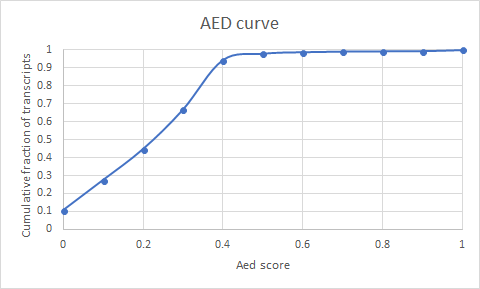

# Tutorial of how to run Maker2 gene annotation pipeline

I have outlined how to perform a gene annotation of the soybean cyst nematode (*Heterodera glycines*) genome using Maker2.

This is the original MAKER publication, which details more about the general MAKER algorithm, when MAKER lacked all other gene predictors besides SNAP.
[MAKER Publication](https://genome.cshlp.org/content/18/1/188.short)

This is the original publication for the MAKER2 gene prediction pipeline.  This version of maker includes the addition of multiple gene *ab-initio* prediction tools as well as AED score support for gene models.
[MAKER2 Publication](https://bmcbioinformatics.biomedcentral.com/track/pdf/10.1186/1471-2105-12-491)

The "Genome Annotation and Curation Using MAKER and MAKER-P" publication has a list of example protocols that may be helpful and may add some detail to my choices below.
[Genome Annotation with MAKER and MAKER-P](https://currentprotocols.onlinelibrary.wiley.com/doi/abs/10.1002/0471250953.bi0411s48)

There are a number of nice Maker tutorials that can found online.
[Utah MAKER Tutorial](http://weatherby.genetics.utah.edu/MAKER/wiki/index.php/MAKER_Tutorial_for_WGS_Assembly_and_Annotation_Winter_School_2018#Ab_Initio_Gene_Prediction)

Here is a Maker tutorial that gave me the idea to use BUSCO to train Augustus.
[Darren Card Tutorial](https://gist.github.com/darencard/bb1001ac1532dd4225b030cf0cd61ce2)

``Is there a specific order to run different predictors in Maker?``
While there are multiple ways to run Maker, all tips and tutorials that I have run across have always done the maker annotation first, and then incorporated the other ab-initio predictors subsequently. This leads us to the first step of finding all transcriptional and protein resources for the initial MAKER prediction.


### Download all transcriptional resources for the clade in which your species resides

For the soybean cyst nematode, that includes all publicly available resources for the Tylenchida.  This includes the predicted transcripts and proteins from all genome assemblies in this clade.

* B_xylophilus
* D_destructor
* G_pallida
* G_rostochiensis
* M_floridensis
* M_hapla
* M_incognita
* P_trichosuri
* Rhabditophanes_KR3021
* Strongyloides_papillosus
* Strongyloides_ratti
* Strongyloides_stercoralis

```
#Download all data here
#/work/GIF/remkv6/Baum/01_SCNDovetailScaffolding/09_Maker/
```
Download transcripts and proteins associated with the assembled genomes for species in your clade.  I downloaded mine on 4/20/18 from:
https://parasite.wormbase.org/ftp.html


Download all EST and protein sequences associated with your species and related species. Downloaded from NCBI 04/19/18

NCBI_ESTs
NCBI_Proteins

Separate *H.glycines* and non-*H. glycines* EST datasets
```
#/work/GIF/remkv6/Baum/01_SCNDovetailScaffolding/09_Maker/NCBI_ESTs
module load cdbfasta
#indexing the sequences with cdbfasta
cdbfasta TylenchidaESTs.fasta

#separate the H. glycines EST's and non-H. glycines EST's
grep "glycines" TylenchidaESTs.fasta |sed 's/>//g'| cdbyank TylenchidaESTs.fasta.cidx >H.glycinesEST.fasta
grep -v "glycines" TylenchidaESTs.fasta |sed 's/>//g'| cdbyank TylenchidaESTs.fasta.cidx >NotH.glycinesEST.fasta
```
Concatenate *H. glycines* proteins with genome predicted proteins, as well as the two categories of transcripts (*H. glycines* and alternative species in the clade)
```
#/work/GIF/remkv6/Baum/01_SCNDovetailScaffolding/09_Maker
# These will go in the "altest_pass" category  
cat */*transcripts.fa NCBI_ESTs/NotH.glycinesEST.fasta >TylenchidaESTNotH.glycines.fasta

#These will go in the "est_pass" category
ln -s NCBI_ESTs/H.glycinesEST.fasta

These will go in the "protein_pass" category
cat  */*protein.fa  */*.aa >TylenchidaProteins
```

Gather all of your private data also.  For *H. glycines*, we had a previously generated gene annotation using Braker
MAKE SURE THERE ARE NO SPECIAL CHARACTERS IN YOUR SCAFFOLD NAMES!
```
#Get a properly formatted gff3 from H. glycines gene annotation by removing special characters from the scaffold names
less ../../05_brakerMaskedGeneModels/braker/nematode_sp._22Aug2017_DZkUC.fasta/augustus.gff3 UnmaskedBraker.gff3 |sed 's/;/\t/1' |awk '{print $1,$3,$4,$5,$6,$7,$8,$9,$10}' |tr " " "\t" >RenamedUnmaskedBraker.gff3
```
Now that all the files have been corrected for running maker, create a new folder and softlink all needed data.
MAKE SURE THERE ARE NO SPECIAL CHARACTERS IN YOUR SCAFFOLD NAMES!

```
# /work/GIF/remkv6/Baum/01_SCNDovetailScaffolding/09_Maker/01_maker/

#remove special characters from scaffold names of your genome, here the genome of H. glycines
less /work/GIF/remkv6/Baum/01_SCNDovetailScaffolding/01_DovetailOutput/download/serial_chicago_hic/nematode_sp._22Aug2017_DZkUC.fasta |sed 's/;/\t/1'|awk '{print $1}' >Renamednematode_sp._22Aug2017_DZkUC.fasta

#RepeatModeler/RepeatMasker classified elements from RepeatModeler.  
ln -s ../../03_RepeatModelerMasker/RM_9173.TueNov281539072017/consensi.fa.classified
```

### Gather maker ctrl files and modify to suit your specific system.
Set up and modify the Maker control files for the first round of gene prediction
```
#Copy the 3 maker control files, which are essentially config files needed to run maker
for f in /work/GIF/remkv6/Purcell/Abalone/29_MakerP/02_MakerRun2/maker_* ;do cp $f . ;done
#Of course you can use maker to copy these files for you
maker -CTL

#Here are the three files you need
################################################################################
maker_exe.ctl-- This file points to the executable programs that we will be using.
maker_bopts.ctl -- This one controls the parameters of each program if you want to change the default settings.
maker_opts.ctl -- This is the key control file that will be subject to change for each round of maker.
###############################################################################
```
I will only use blastn, blastx, tblastx, repeatmasker, exonerate, snap, gmhmme3(GeneMark), and augustus.  FGENESH costs, so skipped that one.


To ensure proper parsing of the files, make sure that there are no spaces between the equal sign and the path to the files.  See my examples below

maker_as_exe.ctl
```
##################################################################################################################################
#-----Location of Executables Used by MAKER/EVALUATOR
makeblastdb=/work/GIF/software/programs/rmblast/2.2.28/bin/makeblastdb #location of NCBI+ makeblastdb executable
blastn=/work/GIF/software/programs/ncbi-blast/2.2.28+/bin/blastn #location of NCBI+ blastn executable
blastx=/work/GIF/software/programs/rmblast/2.2.28/bin/blastx #location of NCBI+ blastx executable
tblastx=/work/GIF/software/programs/ncbi-blast/2.2.28+/bin/tblastx #location of NCBI+ tblastx executable
formatdb= #location of NCBI formatdb executable
blastall= #location of NCBI blastall executable
xdformat= #location of WUBLAST xdformat executable
blasta= #location of WUBLAST blasta executable
RepeatMasker=/work/GIF/software/programs/repeatmasker/4.0.6/RepeatMasker #location of RepeatMasker executable
exonerate=/work/GIF/software/programs/exonerate/2.2.0/bin/exonerate #location of exonerate executable

#-----Ab-initio Gene Prediction Algorithms
snap=/work/GIF/software/programs/snap/2006-07-28/snap #location of snap executable
gmhmme3=/work/GIF/software/programs/GeneMark-ES/4.32/gmes_petap/gmhmme3 #location of eukaryotic genemark executable
gmhmmp= #location of prokaryotic genemark executable
augustus=/work/GIF/software/programs/augustus/3.2.1/bin/augustus #location of augustus executable
fgenesh=/work/GIF/software/programs/fgenesh/20150830/fgenesh #location of fgenesh executable
tRNAscan-SE=/work/GIF/software/programs/tRNAscanSE/1.23/bin/tRNAscan-SE #location of trnascan executable
snoscan=/work/GIF/software/programs/snoscan/0.9b/bin/snoscan #location of snoscan executable

#-----Other Algorithms
probuild=/work/GIF/software/programs/GeneMark-ES/4.32/gmes_petap/probuild #location of probuild executable (required for genemark)
##################################################################################################################################
```

This file is essentially a way to modify the default settings of each program. I left all of these to their default setting.

maker_bopts.ctl
```
##################################################################################################################################
#-----BLAST and Exonerate Statistics Thresholds
blast_type=ncbi+ #set to 'ncbi+', 'ncbi' or 'wublast'

pcov_blastn=0.8 #Blastn Percent Coverage Threhold EST-Genome Alignments
pid_blastn=0.85 #Blastn Percent Identity Threshold EST-Genome Aligments
eval_blastn=1e-10 #Blastn eval cutoff
bit_blastn=40 #Blastn bit cutoff
depth_blastn=0 #Blastn depth cutoff (0 to disable cutoff)

pcov_blastx=0.5 #Blastx Percent Coverage Threhold Protein-Genome Alignments
pid_blastx=0.4 #Blastx Percent Identity Threshold Protein-Genome Aligments
eval_blastx=1e-06 #Blastx eval cutoff
bit_blastx=30 #Blastx bit cutoff
depth_blastx=0 #Blastx depth cutoff (0 to disable cutoff)

pcov_tblastx=0.8 #tBlastx Percent Coverage Threhold alt-EST-Genome Alignments
pid_tblastx=0.85 #tBlastx Percent Identity Threshold alt-EST-Genome Aligments
eval_tblastx=1e-10 #tBlastx eval cutoff
bit_tblastx=40 #tBlastx bit cutoff
depth_tblastx=0 #tBlastx depth cutoff (0 to disable cutoff)

pcov_rm_blastx=0.5 #Blastx Percent Coverage Threhold For Transposable Element Masking
pid_rm_blastx=0.4 #Blastx Percent Identity Threshold For Transposbale Element Masking
eval_rm_blastx=1e-06 #Blastx eval cutoff for transposable element masking
bit_rm_blastx=30 #Blastx bit cutoff for transposable element masking

ep_score_limit=20 #Exonerate protein percent of maximal score threshold
en_score_limit=20 #Exonerate nucleotide percent of maximal score threshold
##################################################################################################################################
```

``Set options for the first round of MAKER``

This is the maker control file that will be modified for each round of maker. For the first round we will do a gene prediction using Maker's internal algorithm with the transcripts and proteins, as well as a repeatmasking of the genome using the predicted repeat sequences from RepeatModeler.

Note there are only a few options that I have changed.  Particularly:
*  genome=  "point directly to your genome"
*  organism_type= "eukaryotic mode"
*  est_pass= "on"
*  altest_pass= "on"
*  protein_pass= "on"
*  rm_pass= "on"
*  model_pass= "on"
*  pred_pass= "on"
*  other_pass= "on"
*  est= "point directly to your transcript files specific to your species"
*  altest= "point directly to your transcript files for related species"
*  est_gff= "point directly to your gff file"
*  protein= "point directly to your protein fasta file"
*  rmlib= "point directly to your repeat library fasta"
*  softmask= "on"
*  est2genome= "on"
*  protein2genome= "on"
*  alt_splice= "on"


``Why softmask?``  
Here is an exerpt from the original maker publication. "Soft masking excludes these regions (low complexity repeats) from nucleating BLAST alignments (Korf et al. 2003) but leaves them available for inclusion in annotations, as many protein-coding  genes  contain  runs  of  low  complexity  sequence."


maker_opts.ctl
```
##################################################################################################################################
#-----Genome (these are always required)
genome=/work/GIF/remkv6/Baum/01_SCNDovetailScaffolding/09_Maker/01_maker/Renamednematode_sp._22Aug2017_DZkUC.fasta #(fasta file or fasta embeded in GFF3 file)
organism_type=eukaryotic #eukaryotic or prokaryotic. Default is eukaryotic

#-----Re-annotation Using MAKER Derived GFF3
maker_gff= #MAKER derived GFF3 file
est_pass=1 #use ESTs in maker_gff: 1 = yes, 0 = no
altest_pass=1 #use alternate organism ESTs in maker_gff: 1 = yes, 0 = no
protein_pass=1 #use protein alignments in maker_gff: 1 = yes, 0 = no
rm_pass=1 #use repeats in maker_gff: 1 = yes, 0 = no
model_pass=1 #use gene models in maker_gff: 1 = yes, 0 = no
pred_pass=1 #use ab-initio predictions in maker_gff: 1 = yes, 0 = no
other_pass=1 #passthrough anyything else in maker_gff: 1 = yes, 0 = no

#-----EST Evidence (for best results provide a file for at least one)
est=/work/GIF/remkv6/Baum/01_SCNDovetailScaffolding/09_Maker/01_maker/H.glycinesEST.fasta
altest=/work/GIF/remkv6/Baum/01_SCNDovetailScaffolding/09_Maker/01_maker/TylenchidaESTNotH.glycines.fasta
est_gff=/work/GIF/remkv6/Baum/01_SCNDovetailScaffolding/09_Maker/01_maker/RenamedUnmaskedBraker.gff3
altest_gff= #aligned ESTs from a closly relate species in GFF3 format

#-----Protein Homology Evidence (for best results provide a file for at least one)
protein= /work/GIF/remkv6/Baum/01_SCNDovetailScaffolding/09_Maker/01_maker/TylenchidaProteins.fasta
protein_gff=  #aligned protein homology evidence from an external GFF3 file

#-----Repeat Masking (leave values blank to skip repeat masking)
model_org= #select a model organism for RepBase masking in RepeatMasker
rmlib=/work/GIF/remkv6/Baum/01_SCNDovetailScaffolding/09_Maker/01_maker/consensi.fa.classified
repeat_protein= #provide a fasta file of transposable element proteins for RepeatRunner
rm_gff=
#####FOR SOME REASON MAKER HATES THE GFF GENERATED BY REPEATMASKER. CANNOT USE IT
prok_rm=0 #forces MAKER to repeatmask prokaryotes (no reason to change this), 1 = yes, 0 = no
softmask=1 #use soft-masking rather than hard-masking in BLAST (i.e. seg and dust filtering)

#-----Gene Prediction
snaphmm= #SNAP HMM file
gmhmm=  #GeneMark HMM file
augustus_species=  #Augustus gene prediction species model
fgenesh_par_file= #FGENESH parameter file
pred_gff= #ab-initio predictions from an external GFF3 file
model_gff= #annotated gene models from an external GFF3 file (annotation pass-through)
est2genome=1 #infer gene predictions directly from ESTs, 1 = yes, 0 = no
protein2genome=1 #infer predictions from protein homology, 1 = yes, 0 = no
trna=0 #find tRNAs with tRNAscan, 1 = yes, 0 = no
snoscan_rrna= #rRNA file to have Snoscan find snoRNAs
unmask=0 #also run ab-initio prediction programs on unmasked sequence, 1 = yes, 0 = no

#-----Other Annotation Feature Types (features MAKER doesn't recognize)
other_gff= #extra features to pass-through to final MAKER generated GFF3 file

#-----External Application Behavior Options
alt_peptide=C #amino acid used to replace non-standard amino acids in BLAST databases
cpus=1 #max number of cpus to use in BLAST and RepeatMasker (not for MPI, leave 1 when using MPI)

#-----MAKER Behavior Options
max_dna_len=100000 #length for dividing up contigs into chunks (increases/decreases memory usage)
min_contig=10000 #skip genome contigs below this length (under 10kb are often useless)

pred_flank=200 #flank for extending evidence clusters sent to gene predictors
pred_stats=0 #report AED and QI statistics for all predictions as well as models
AED_threshold=1 #Maximum Annotation Edit Distance allowed (bound by 0 and 1)
min_protein=0 #require at least this many amino acids in predicted proteins
alt_splice=1 #Take extra steps to try and find alternative splicing, 1 = yes, 0 = no
always_complete=0 #extra steps to force start and stop codons, 1 = yes, 0 = no
map_forward=0 #map names and attributes forward from old GFF3 genes, 1 = yes, 0 = no
keep_preds=0 #Concordance threshold to add unsupported gene prediction (bound by 0 and 1)

split_hit=10000 #length for the splitting of hits (expected max intron size for evidence alignments)
single_exon=0 #consider single exon EST evidence when generating annotations, 1 = yes, 0 = no
single_length=250 #min length required for single exon ESTs if 'single_exon is enabled'
correct_est_fusion=0 #limits use of ESTs in annotation to avoid fusion genes

tries=2 #number of times to try a contig if there is a failure for some reason
clean_try=0 #remove all data from previous run before retrying, 1 = yes, 0 = no
clean_up=0 #removes theVoid directory with individual analysis files, 1 = yes, 0 = no
TMP= #specify a directory other than the system default temporary directory for temporary files
##################################################################################################################################
```
### Submit your first round of maker -- took 7hrs with 129MB genome

I ran this first maker run on 8 nodes, the output of which is subjected to gff_merge and fasta_merge scripts.  These essentially give an initial annotation gff and fasta.
```
#!/bin/bash
#SBATCH -J SCNMaker
#SBATCH -A its-hpc-condo-las-free
#SBATCH -N 8
#SBATCH -p freecompute
#SBATCH --ntasks-per-node=12
#SBATCH -t 96:00:00
#SBATCH -o maker.o%j
#SBATCH -e maker.e%j
#SBATCH --mail-user=remkv6@gmail.com
#SBATCH --mail-type=begin
#SBATCH --mail-type=end
cd $SLURM_SUBMIT_DIR
ulimit -s unlimited
module unuse /shared/software/GIF/modules
module purge
module load GIF/maker
module rm perl/5.22.1
MAKERDIR="DovetailSCNMaker1"

/work/GIF/software/programs/mpich2/3.2/bin/mpiexec  -n 96 /work/GIF/software/programs/maker/2.31.9/bin/maker -base ${MAKERDIR} -fix_nucleotides
#rm ${MAKERDIR}.maker.output/${MAKERDIR}_master_datastore_index.log
maker -base ${MAKERDIR} -fix_nucleotides -dsindex
gff3_merge  -d ${MAKERDIR}.maker.output/${MAKERDIR}_master_datastore_index.log
fasta_merge -d ${MAKERDIR}.maker.output/${MAKERDIR}_master_datastore_index.log
```
Maker can be finicky. I always receive a perl warning that can be ignored
```
Argument "2.56_01" isn't numeric in numeric ge (>=) at /work/GIF/software/programs/perl/5.24.1/lib/site_perl/5.24.1/x86_64-linux-thread-multi/forks.pm line 1570.

If Maker finished without error, the last line of the MAKER.error file will read MAKER is now finished!!!, and the datastore index log will have an entry for when MAKER started each entry in the genome FASTA file and when it finished or failed that entry.
It is also good to check the "[YourName]_master_datastore_index.log" file for errors.  Mine was "DovetailSCNMaker4_master_datastore_index.log"
```
### Round 1 maker results
```
Compare primary transcript lengths and quantity from first maker run
less DovetailSCNMaker1.all.gff |awk '$3=="mRNA"' |grep "mRNA-1" |awk '{print $5-$4}' |summary.sh
Total:  56,467,884
Count:  22,237
Mean:   2,539
Median: 1,665
Min:    5
Max:    65,204

Compare primary transcript lengths and quantity from earlier braker run.
less UnmaskedBraker.gff3 |awk '$3=="mRNA"' |grep "\.t1" |awk '{print $5-$4}' |summary.sh
Total:  42,868,159
Count:  20,085
Mean:   2,134
Median: 1,540
Min:    200
Max:    40,213
```

### Round 2 maker took 2-3 hours
``Train SNAP gene prediction software``
```
#/work/GIF/remkv6/Baum/01_SCNDovetailScaffolding/09_Maker/01_maker/01_snap
cp ../DovetailSCNMaker1.all.gff .
module load GIF/maker
#essentially copy and paste your round one maker gff here and run.
maker2zff DovetailSCNMaker1.all.gff
fathom -categorize 1000 genome.ann genome.dna
 fathom -export 1000 -plus uni.ann uni.dna
 forge export.ann export.dna
 hmm-assembler.pl pyu . > pyu.hmm
```
``Change options in maker_opts.ctl``

Major changes are to remove the repeat, est, and protein fasta seqs.
Add the new gff that was created from round 1
Add the newly made snap Evidence.

``How did I get Augustus evidence?``

I already had a trained augustus from running braker on this genome, so adding the species in the augustus program folder was fairly simple.  Another tutorial will be created to show how to run braker, which depending on your genome size and amount of data, can take a day to a couple weeks to finish.  However, another option is to use the trained augustus from running BUSCO (Benchmarking Universal Single Copy Orthologs) with the --long parameter on your genome. Using a BUSCO training may not be optimal, but it is definitely faster and can be improved upon in subsequent rounds of maker.  This tutorial below provides instruction on how to use BUSCO for augustus training.

[BUSCO as Augustus training for MAKER](https://gist.github.com/darencard/bb1001ac1532dd4225b030cf0cd61ce2)

[Straight-up Augustus trainging: tutorial](http://avrilomics.blogspot.com/2013/04/training-augustus-gene-finding-software.html)

Add the augustus species, which needs to be in the species directory of the augustus you are running.  For me it is found here "augustus/3.2.1/config/species/"
```
#-----Genome (these are always required)
genome=/work/GIF/remkv6/Baum/01_SCNDovetailScaffolding/09_Maker/01_maker/Renamednematode_sp._22Aug2017_DZkUC.fasta #(fasta file or fasta embeded in GFF3 file)
organism_type=eukaryotic #eukaryotic or prokaryotic. Default is eukaryotic

#-----Re-annotation Using MAKER Derived GFF3
maker_gff= /work/GIF/remkv6/Baum/01_SCNDovetailScaffolding/09_Maker/01_maker/DovetailSCNMaker1.all.gff #MAKER derived GFF3 file
est_pass=1 #use ESTs in maker_gff: 1 = yes, 0 = no
altest_pass=1 #use alternate organism ESTs in maker_gff: 1 = yes, 0 = no
protein_pass=1 #use protein alignments in maker_gff: 1 = yes, 0 = no
rm_pass=1 #use repeats in maker_gff: 1 = yes, 0 = no
model_pass=1 #use gene models in maker_gff: 1 = yes, 0 = no
pred_pass=1 #use ab-initio predictions in maker_gff: 1 = yes, 0 = no
other_pass=1 #passthrough anyything else in maker_gff: 1 = yes, 0 = no

#-----EST Evidence (for best results provide a file for at least one)
est=
altest=
est_gff=
altest_gff= #aligned ESTs from a closely relate species in GFF3 format

#-----Protein Homology Evidence (for best results provide a file for at least one)
protein=
protein_gff=  #aligned protein homology evidence from an external GFF3 file

#-----Repeat Masking (leave values blank to skip repeat masking)
model_org= #select a model organism for RepBase masking in RepeatMasker
rmlib=
repeat_protein= #provide a fasta file of transposable element proteins for RepeatRunner
rm_gff=
prok_rm=0 #forces MAKER to repeat-mask prokaryotes (no reason to change this), 1 = yes, 0 = no
softmask=1 #use soft-masking rather than hard-masking in BLAST (i.e. seg and dust filtering)

#-----Gene Prediction
snaphmm= 01_snap/pyu.hmm #SNAP HMM file
gmhmm=  #GeneMark HMM file
augustus_species= nematode_sp._22Aug2017_DZkUC  #Augustus gene prediction species model
fgenesh_par_file= #FGENESH parameter file
pred_gff= #ab-initio predictions from an external GFF3 file
model_gff= #annotated gene models from an external GFF3 file (annotation pass-through)
est2genome=0 #infer gene predictions directly from ESTs, 1 = yes, 0 = no
protein2genome=0 #infer predictions from protein homology, 1 = yes, 0 = no
trna=0 #find tRNAs with tRNAscan, 1 = yes, 0 = no
snoscan_rrna= #rRNA file to have Snoscan find snoRNAs
unmask=0 #also run ab-initio prediction programs on unmasked sequence, 1 = yes, 0 = no

#-----Other Annotation Feature Types (features MAKER doesn't recognize)
other_gff= #extra features to pass-through to final MAKER generated GFF3 file

#-----External Application Behavior Options
alt_peptide=C #amino acid used to replace non-standard amino acids in BLAST databases
cpus=1 #max number of cpus to use in BLAST and RepeatMasker (not for MPI, leave 1 when using MPI)

#-----MAKER Behavior Options
max_dna_len=100000 #length for dividing up contigs into chunks (increases/decreases memory usage)
min_contig=10000 #skip genome contigs below this length (under 10kb are often useless)

pred_flank=200 #flank for extending evidence clusters sent to gene predictors
pred_stats=0 #report AED and QI statistics for all predictions as well as models
AED_threshold=1 #Maximum Annotation Edit Distance allowed (bound by 0 and 1)
min_protein=0 #require at least this many amino acids in predicted proteins
alt_splice=1 #Take extra steps to try and find alternative splicing, 1 = yes, 0 = no
always_complete=0 #extra steps to force start and stop codons, 1 = yes, 0 = no
map_forward=0 #map names and attributes forward from old GFF3 genes, 1 = yes, 0 = no
keep_preds=0 #Concordance threshold to add unsupported gene prediction (bound by 0 and 1)

split_hit=10000 #length for the splitting of hits (expected max intron size for evidence alignments)
single_exon=0 #consider single exon EST evidence when generating annotations, 1 = yes, 0 = no
single_length=250 #min length required for single exon ESTs if 'single_exon is enabled'
correct_est_fusion=0 #limits use of ESTs in annotation to avoid fusion genes

tries=2 #number of times to try a contig if there is a failure for some reason
clean_try=0 #remove all data from previous run before retrying, 1 = yes, 0 = no
clean_up=0 #removes theVoid directory with individual analysis files, 1 = yes, 0 = no
TMP= #specify a directory other than the system default temporary directory for temporary files
```
Gene models after two rounds of maker
```
less DovetailSCNMaker2.all.gff |awk '$3=="mRNA"' |grep "mRNA-1" |awk '{print $5-$4}' |summary.sh
Total:  71,225,049
Count:  28,115
Mean:   2,533
Median: 1,499
Min:    5
Max:    65,204

Compare primary transcript lengths and quantity from earlier braker run.
less UnmaskedBraker.gff3 |awk '$3=="mRNA"' |grep "\.t1" |awk '{print $5-$4}' |summary.sh
Total:  42,868,159
Count:  20,085
Mean:   2,134
Median: 1,540
Min:    200
Max:    40,213
```


### Round 3 maker  #took like 2 hours
``Train GeneMark``
```
#/work/GIF/remkv6/Baum/01_SCNDovetailScaffolding/09_Maker/01_maker/02_GeneMark
#You have to get the product key into your home directory, and name it appropriately or genemark will not run.
cd ~/
wget http://topaz.gatech.edu/GeneMark/tmp/GMtool_EVsJK/gm_key_64.gz
gunzip gm_key_64.gz
mv gm_key_64 .gm_key
cd -

#run genemark
echo "module load genemark" >>genemark.sh
echo "/opt/rit/app/genemark/4.32/bin/gmes_petap.pl --ES --min_contig 20000 --cores 16 --sequence Renamednematode_sp._22Aug2017_DZkUC.fasta" >>genemark.sh
```
Maker_opts.ctl
```
#-----Genome (these are always required)
genome=/work/GIF/remkv6/Baum/01_SCNDovetailScaffolding/09_Maker/01_maker/Renamednematode_sp._22Aug2017_DZkUC.fasta #(fasta file or fasta embeded in GFF3 file)
organism_type=eukaryotic #eukaryotic or prokaryotic. Default is eukaryotic

#-----Re-annotation Using MAKER Derived GFF3
maker_gff= /work/GIF/remkv6/Baum/01_SCNDovetailScaffolding/09_Maker/01_maker/DovetailSCNMaker1.all.gff #MAKER derived GFF3 file
est_pass=1 #use ESTs in maker_gff: 1 = yes, 0 = no
altest_pass=1 #use alternate organism ESTs in maker_gff: 1 = yes, 0 = no
protein_pass=1 #use protein alignments in maker_gff: 1 = yes, 0 = no
rm_pass=1 #use repeats in maker_gff: 1 = yes, 0 = no
model_pass=1 #use gene models in maker_gff: 1 = yes, 0 = no
pred_pass=1 #use ab-initio predictions in maker_gff: 1 = yes, 0 = no
other_pass=1 #passthrough anyything else in maker_gff: 1 = yes, 0 = no

#-----EST Evidence (for best results provide a file for at least one)
est=
altest=
est_gff=
altest_gff= #aligned ESTs from a closly relate species in GFF3 format

#-----Protein Homology Evidence (for best results provide a file for at least one)
protein=
protein_gff=  #aligned protein homology evidence from an external GFF3 file

#-----Repeat Masking (leave values blank to skip repeat masking)
model_org= #select a model organism for RepBase masking in RepeatMasker
rmlib=
repeat_protein= #provide a fasta file of transposable element proteins for RepeatRunner
rm_gff=
prok_rm=0 #forces MAKER to repeatmask prokaryotes (no reason to change this), 1 = yes, 0 = no
softmask=1 #use soft-masking rather than hard-masking in BLAST (i.e. seg and dust filtering)

#-----Gene Prediction
snaphmm=  #SNAP HMM file
gmhmm=  /work/GIF/remkv6/Baum/01_SCNDovetailScaffolding/09_Maker/01_maker/02_GeneMark/output/gmhmm.mod#GeneMark HMM file
augustus_species=  #Augustus gene prediction species model
fgenesh_par_file= #FGENESH parameter file
pred_gff= #ab-initio predictions from an external GFF3 file
model_gff= #annotated gene models from an external GFF3 file (annotation pass-through)
est2genome=0 #infer gene predictions directly from ESTs, 1 = yes, 0 = no
protein2genome=0 #infer predictions from protein homology, 1 = yes, 0 = no
trna=0 #find tRNAs with tRNAscan, 1 = yes, 0 = no
snoscan_rrna= #rRNA file to have Snoscan find snoRNAs
unmask=0 #also run ab-initio prediction programs on unmasked sequence, 1 = yes, 0 = no

#-----Other Annotation Feature Types (features MAKER doesn't recognize)
other_gff= #extra features to pass-through to final MAKER generated GFF3 file

#-----External Application Behavior Options
alt_peptide=C #amino acid used to replace non-standard amino acids in BLAST databases
cpus=1 #max number of cpus to use in BLAST and RepeatMasker (not for MPI, leave 1 when using MPI)

#-----MAKER Behavior Options
max_dna_len=100000 #length for dividing up contigs into chunks (increases/decreases memory usage)
min_contig=10000 #skip genome contigs below this length (under 10kb are often useless)

pred_flank=200 #flank for extending evidence clusters sent to gene predictors
pred_stats=0 #report AED and QI statistics for all predictions as well as models
AED_threshold=1 #Maximum Annotation Edit Distance allowed (bound by 0 and 1)
min_protein=0 #require at least this many amino acids in predicted proteins
alt_splice=1 #Take extra steps to try and find alternative splicing, 1 = yes, 0 = no
always_complete=0 #extra steps to force start and stop codons, 1 = yes, 0 = no
map_forward=0 #map names and attributes forward from old GFF3 genes, 1 = yes, 0 = no
keep_preds=0 #Concordance threshold to add unsupported gene prediction (bound by 0 and 1)

split_hit=10000 #length for the splitting of hits (expected max intron size for evidence alignments)
single_exon=0 #consider single exon EST evidence when generating annotations, 1 = yes, 0 = no
single_length=250 #min length required for single exon ESTs if 'single_exon is enabled'
correct_est_fusion=0 #limits use of ESTs in annotation to avoid fusion genes

tries=2 #number of times to try a contig if there is a failure for some reason
clean_try=0 #remove all data from previous run before retrying, 1 = yes, 0 = no
clean_up=0 #removes theVoid directory with individual analysis files, 1 = yes, 0 = no
TMP= #specify a directory other than the system default temporary directory for temporary files
```
Gene models after Round3 maker
```
less DovetailSCNMaker3.all.gff |awk '$3=="mRNA"' |grep "mRNA-1" |awk '{print $5-$4}' |summary.sh
Total:  70,680,837
Count:  30,005
Mean:   2,355
Median: 1,441
Min:    5
Max:    65,204

Compare primary transcript lengths and quantity from earlier braker run.
less UnmaskedBraker.gff3 |awk '$3=="mRNA"' |grep "\.t1" |awk '{print $5-$4}' |summary.sh
Total:  42,868,159
Count:  20,085
Mean:   2,134
Median: 1,540
Min:    200
Max:    40,213
```

### Ran snap and augustus for a fourth round of maker.

```
#-----Genome (these are always required)
genome=/work/GIF/remkv6/Baum/01_SCNDovetailScaffolding/09_Maker/01_maker/Renamednematode_sp._22Aug2017_DZkUC.fasta #(fasta file or fasta embeded in GFF3 file)
organism_type=eukaryotic #eukaryotic or prokaryotic. Default is eukaryotic

#-----Re-annotation Using MAKER Derived GFF3
maker_gff= /work/GIF/remkv6/Baum/01_SCNDovetailScaffolding/09_Maker/01_maker/DovetailSCNMaker3.all.gff #MAKER derived GFF3 file
est_pass=1 #use ESTs in maker_gff: 1 = yes, 0 = no
altest_pass=1 #use alternate organism ESTs in maker_gff: 1 = yes, 0 = no
protein_pass=1 #use protein alignments in maker_gff: 1 = yes, 0 = no
rm_pass=1 #use repeats in maker_gff: 1 = yes, 0 = no
model_pass=1 #use gene models in maker_gff: 1 = yes, 0 = no
pred_pass=1 #use ab-initio predictions in maker_gff: 1 = yes, 0 = no
other_pass=1 #passthrough anyything else in maker_gff: 1 = yes, 0 = no

#-----EST Evidence (for best results provide a file for at least one)
est=
altest=
est_gff=
altest_gff= #aligned ESTs from a closly relate species in GFF3 format

#-----Protein Homology Evidence (for best results provide a file for at least one)
protein=
protein_gff=  #aligned protein homology evidence from an external GFF3 file

#-----Repeat Masking (leave values blank to skip repeat masking)
model_org= #select a model organism for RepBase masking in RepeatMasker
rmlib=
repeat_protein= #provide a fasta file of transposable element proteins for RepeatRunner
rm_gff=
prok_rm=0 #forces MAKER to repeatmask prokaryotes (no reason to change this), 1 = yes, 0 = no
softmask=1 #use soft-masking rather than hard-masking in BLAST (i.e. seg and dust filtering)

#-----Gene Prediction
snaphmm= 01_snap/pyu.hmm #SNAP HMM file
gmhmm=  #GeneMark HMM file
augustus_species= nematode_sp._22Aug2017_DZkUC  #Augustus gene prediction species model
fgenesh_par_file= #FGENESH parameter file
pred_gff= #ab-initio predictions from an external GFF3 file
model_gff= #annotated gene models from an external GFF3 file (annotation pass-through)
est2genome=0 #infer gene predictions directly from ESTs, 1 = yes, 0 = no
protein2genome=0 #infer predictions from protein homology, 1 = yes, 0 = no
trna=0 #find tRNAs with tRNAscan, 1 = yes, 0 = no
snoscan_rrna= #rRNA file to have Snoscan find snoRNAs
unmask=0 #also run ab-initio prediction programs on unmasked sequence, 1 = yes, 0 = no

#-----Other Annotation Feature Types (features MAKER doesn't recognize)
other_gff= #extra features to pass-through to final MAKER generated GFF3 file

#-----External Application Behavior Options
alt_peptide=C #amino acid used to replace non-standard amino acids in BLAST databases
cpus=1 #max number of cpus to use in BLAST and RepeatMasker (not for MPI, leave 1 when using MPI)

#-----MAKER Behavior Options
max_dna_len=100000 #length for dividing up contigs into chunks (increases/decreases memory usage)
min_contig=10000 #skip genome contigs below this length (under 10kb are often useless)

pred_flank=200 #flank for extending evidence clusters sent to gene predictors
pred_stats=0 #report AED and QI statistics for all predictions as well as models
AED_threshold=1 #Maximum Annotation Edit Distance allowed (bound by 0 and 1)
min_protein=0 #require at least this many amino acids in predicted proteins
alt_splice=1 #Take extra steps to try and find alternative splicing, 1 = yes, 0 = no
always_complete=0 #extra steps to force start and stop codons, 1 = yes, 0 = no
map_forward=0 #map names and attributes forward from old GFF3 genes, 1 = yes, 0 = no
keep_preds=0 #Concordance threshold to add unsupported gene prediction (bound by 0 and 1)

split_hit=10000 #length for the splitting of hits (expected max intron size for evidence alignments)
single_exon=0 #consider single exon EST evidence when generating annotations, 1 = yes, 0 = no
single_length=250 #min length required for single exon ESTs if 'single_exon is enabled'
correct_est_fusion=0 #limits use of ESTs in annotation to avoid fusion genes

tries=2 #number of times to try a contig if there is a failure for some reason
clean_try=0 #remove all data from previous run before retrying, 1 = yes, 0 = no
clean_up=0 #removes theVoid directory with individual analysis files, 1 = yes, 0 = no
TMP= #specify a directory other than the system default temporary directory for temporary files
```
Gene model characteristics after fourth round of maker
```
less DovetailSCNMaker4.all.gff |awk '$3=="mRNA"' |grep "mRNA-1" |awk '{print $5-$4}' |summary.sh
Total:  71,203,444
Count:  27,001
Mean:   2,637
Median: 1,564
Min:    5
Max:    65,204


Compare primary transcript lengths and quantity from earlier braker run.
less UnmaskedBraker.gff3 |awk '$3=="mRNA"' |grep "\.t1" |awk '{print $5-$4}' |summary.sh
Total:  42,868,159
Count:  20,085
Mean:   2,134
Median: 1,540
Min:    200
Max:    40,213
```

### Evaluating the quality of your gene predictions
Maker generates two different types of quality metrics for the predicted gene models.  
1. MAKER mRNA Quality Index (QI)
2. Annnotation Edit Distance scores (AED)

The maker quality index has nine columns to define the quality of a predicted gene.
```
QI:0|0.77|0.68|1|0.77|0.78|19|462|824
```


The AED scores denote something different.  AED scores are numbers between 0 and 1, with zero scores representing perfect concordance of the available evidence, and a value of one indicating a complete lack of support with the available evidence
```
sed 's/AED:/AED:\t/g' DovetailSCNMaker4.all.maker.model_gff%3Amaker.transcripts.fasta |grep ">" |awk '{print $5*10}' |sed 's/\./\t/g' |cut -f 1 |sort|uniq -c |sort -k2,2 |less


These genes need further investigation to keep.
sed 's/AED:/AED:\t/g' DovetailSCNMaker4.all.maker.model_gff%3Amaker.transcripts.fasta |grep ">" |awk '$5>.99' |wc
   435    3480   49658

```




### Rename the complicated MAKER gene and transcript names to something more easier to parse for publication
```
get rid of the fasta sequences in the gff
awk 'substr($1,1,1)==">" {print NR}' DovetailSCNMaker4.all.gff
5969609
awk 'NR<5969608' DovetailSCNMaker4.all.gff >DovetailSCNMaker4.all.NOFASTA.gff
maker_map_ids --prefix HetGly. --justify 5   DovetailSCNMaker4.all.NOFASTA.gff> DovetailSCNMaker4.all.name.map
map_gff_ids DovetailSCNMaker4.all.name.map DovetailSCNMaker4.all.NOFASTA.gff
map_fasta_ids DovetailSCNMaker4.all.name.map DovetailSCNMaker4.all.maker.model_gff%3Amaker.proteins.fasta
map_fasta_ids DovetailSCNMaker4.all.name.map  DovetailSCNMaker4.all.maker.model_gff%3Amaker.transcripts.fasta
map_fasta_ids DovetailSCNMaker4.all.name.map DovetailSCNMaker4.all.maker.transcripts.fasta
map_fasta_ids DovetailSCNMaker4.all.name.map DovetailSCNMaker4.all.maker.proteins.fasta
```


### post investigation of genes compared to Braker
```
bedtools intersect -wo -v -b DovetailSCNMaker4.all.NOFASTA.gff -a RenamedUnmaskedBraker.gff3  |awk '$3=="gene"' |less

Only 3 genes from the unmasked braker were not called as part of the maker genes
Scaffold_46     AUGUSTUS        gene    1255    3337    0.09    -       .       ID=g7868;
Scaffold_86     AUGUSTUS        gene    1       579     0.52    -       .       ID=g15467;
Scaffold_95     AUGUSTUS        gene    991     4533    0.77    +       .       ID=g15681;
```
---
[Back to the Assembly and Annotation Index page](annotation_and_assembly_index.md)
