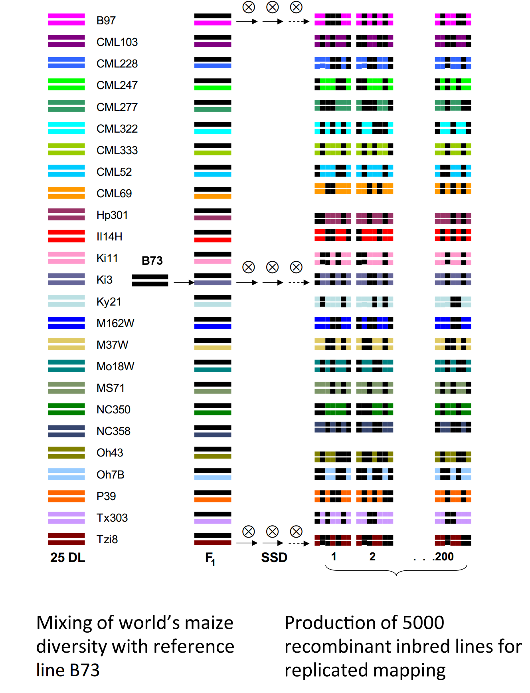
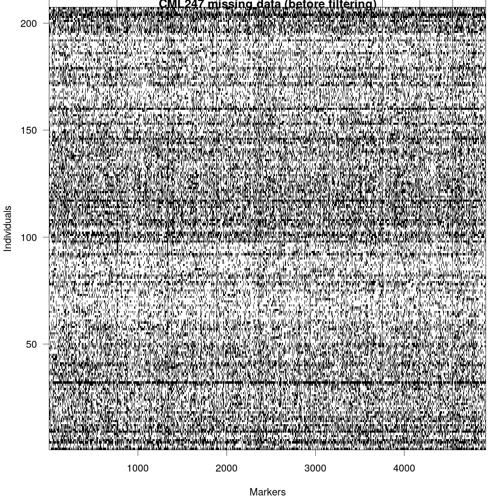
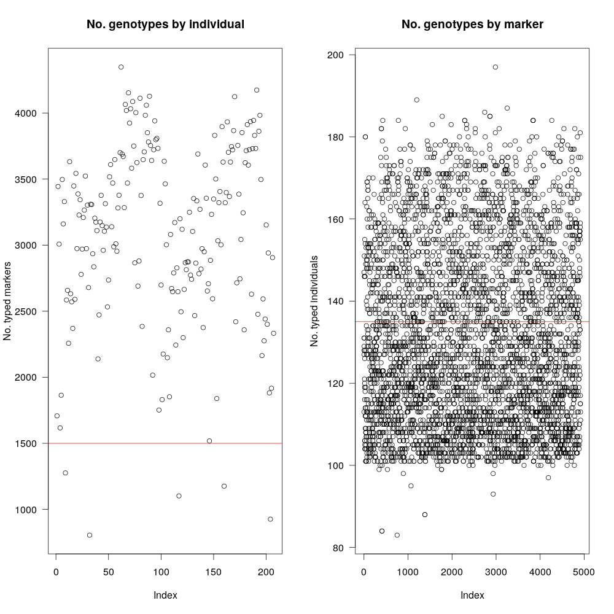
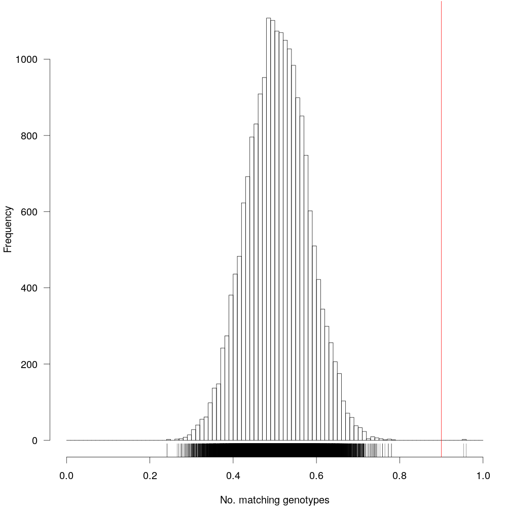
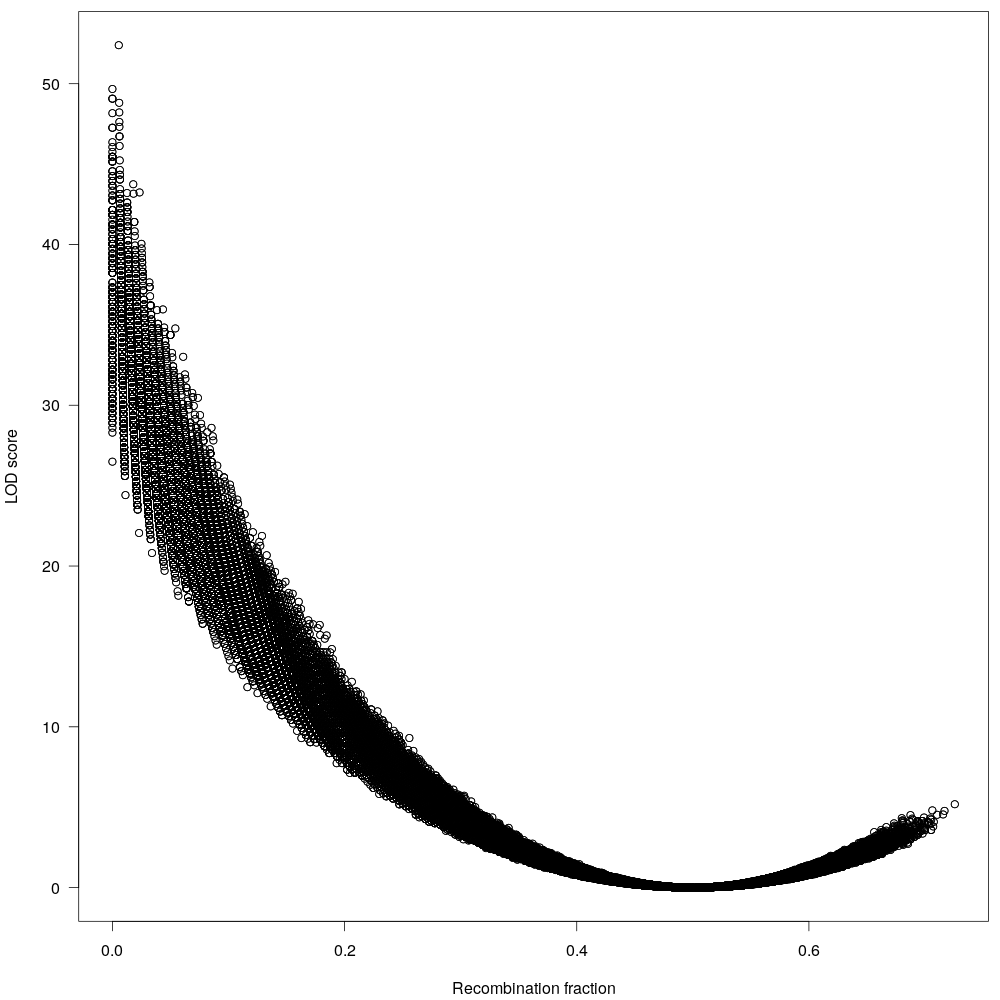
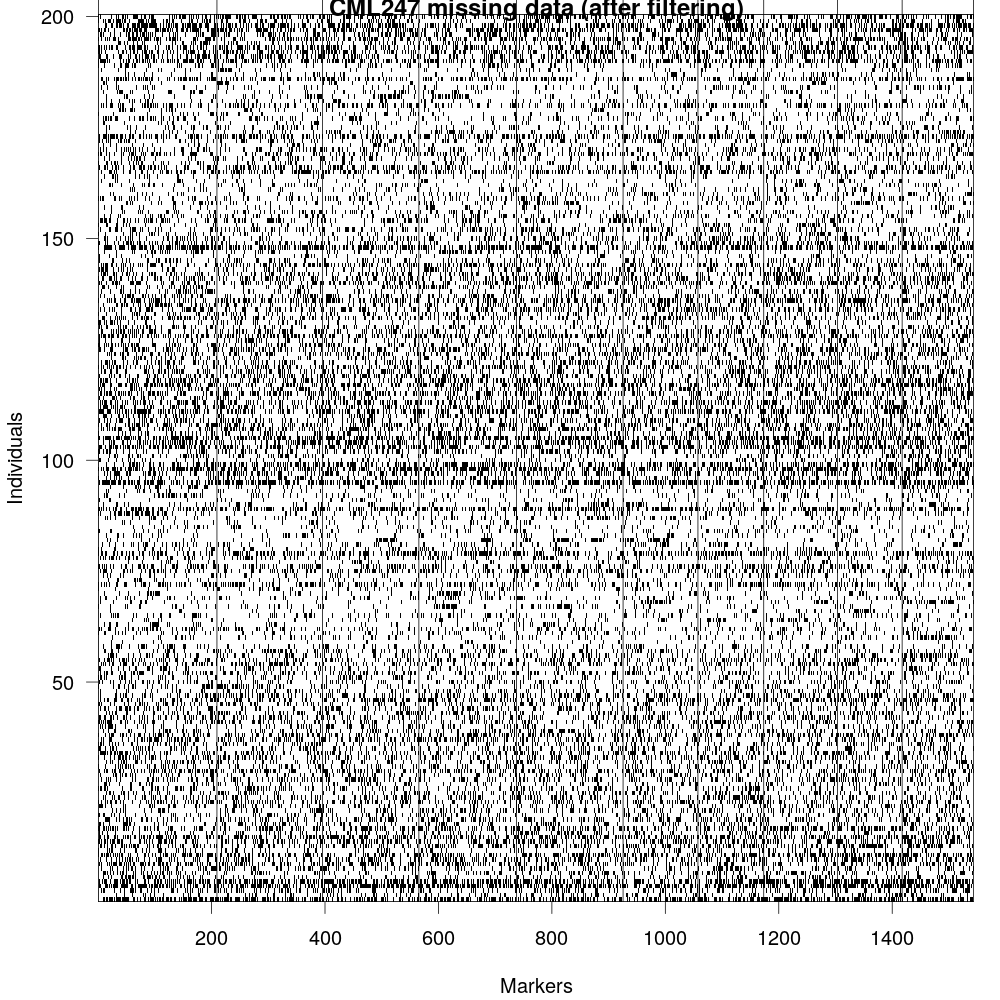
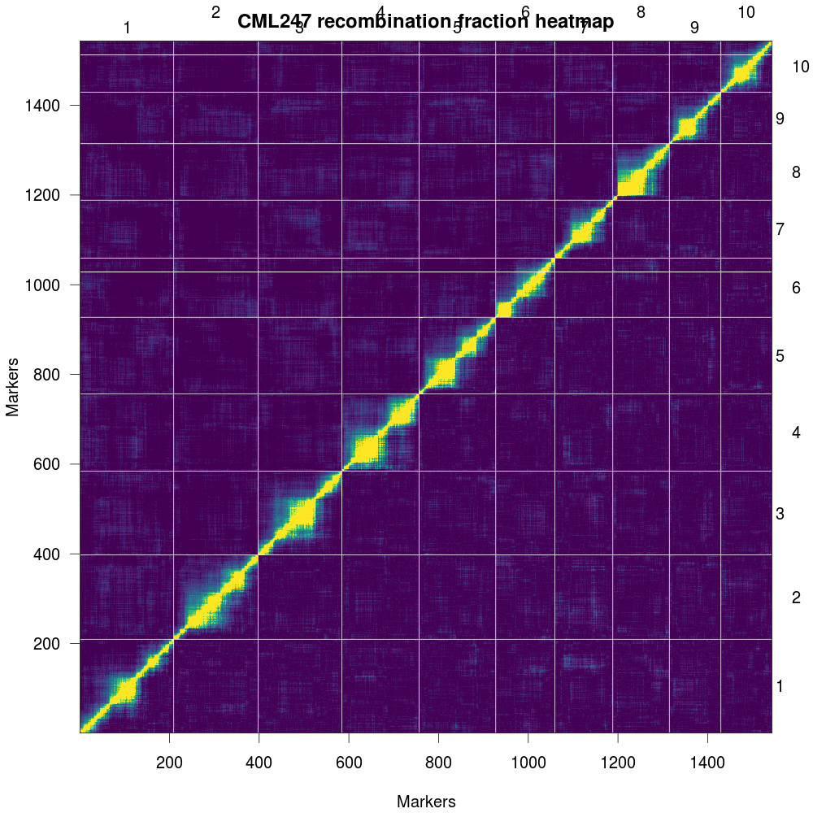
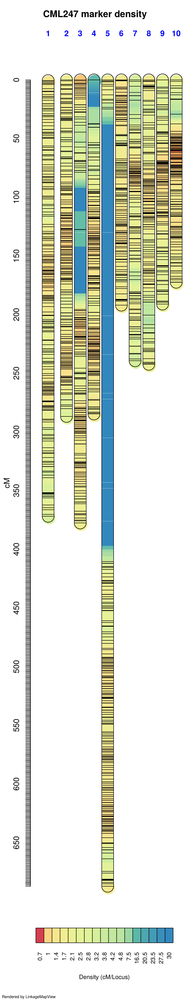

# Genetic Maps

Genetic map, as the name suggest is simply knowing the relative positions of specific sequences across the genome. There are various methods to generate them, but most popular method is to use a cross between the know parents and examining their progenies. These kinds of crosses to create specific group of individuals of known ancestry is called as mapping population. Many types of mapping population exist. Here we will use the data collected from a Recombinant Inbred Line (RIL) (through selfing) to create a genetic map.

## Dataset

[_McMullen et. al._](http://science.sciencemag.org/content/325/5941/737), to provide a genetic resource for quantitative trait analysis in maize, created the nested association mapping (NAM) population, by crossing 25 diverse inbred maize lines to the B73 reference line.


*Figure 1: Maize NAM population*

Since each cross here is RIL population, we can use any single cross as an example to construct genetic map, provided we have information about how traits are segregating. Although, you can collect the traits information by phenotyping these individuals, it is tedious and time consuming. But fortunately, if you can overcome this by using the sequences information. GBS (Genotype By Sequencing), can be used for this purpose.

Buckler group ([_Wallace et. al._](https://journals.plos.org/plosgenetics/article?id=10.1371/journal.pgen.1004845)) used these NAM lines for GWAS studies and generating SNPs for all these progenies (usig GBS), including parents. These genotypes form all the mapping population can provide information about how these are segregating in the population.  The data in this publication is available on CyVerse [link](https://data.iplantcollaborative.org/dav/iplant/commons/community_released/panzea/genotypes/GBS/v27/)

```
/iplant/home/shared/panzea/genotypes/GBS/v27
```

From that source, we obtained the metadata for all the individuals and the SNPs file (VCF format) for constructing new genetic maps. The files are:

```
ZeaGBSv27_publicSamples_raw_AGPv4-181023.vcf.gz
AllZeaGBSv2.7_publicSamples_metadata20140411.xlsx
```
You do not need a CyVerse account for downloading this data, you can just use the iRods commands to get them directly to your working environment.

```bash
module load irods
icd /iplant/home/shared/panzea/genotypes/GBS/v27
iget ZeaGBSv27_publicSamples_raw_AGPv4-181023.vcf.gz
iget AllZeaGBSv2.7_publicSamples_metadata20140411.xlsx
```


## Data cleanup

From the excel sheet, all the individuals related to NAM population were filtered using the Excel `Filter` function on `Project` column and the names were separated to different files using  the `Population` column using bash scripting (see below). The individuals marked as F1 in `Pedigree` column, Blank in the `DNASample` column were excluded.  The parents were identified using the `Population` column, containing `282 maize association mapping panel`.  Since there were 25 replicates for B73, all but one was retained (`B73(PI550473):250027745`). After filtering, `subset.txt` with just `FullName` and `Population` columns was retained and processed as follows:

```bash
for namcross in $(cut -f 2 subset.txt |sort |uniq ); do
grep -wE "$namcross$" subset.txt >> ${namcross}.subset.txt;
done
mv Population.subset.txt header.txt
# verify if all data has been split successfully
wc -l subset.txt
wc -l *.subset.txt
# the sum of split files matches exactly to the lines of subset.txt
# parents are in different file and needs to be separated
less 282_maize_association_mapping_panel.subset.txt
for parent in $(cut -f 1 -d "(" 282_maize_association_mapping_panel.subset.txt | sort | uniq); do
grep -E "^$parent" 282_maize_association_mapping_panel.subset.txt >> ${parent}.parents.txt;
done
# also to match the names in the excel file to the vcf file, we had to trim the names a little bit
# from B73(PI550473):62P7LAAXX:4:250027872 in excel to B73(PI550473):250027872 in vcf file
for namcross in *.subset.txt; do
  cut -f 1 $namcross | cut -f 1,4- -d ":" > ${namcross%%.*}.newsubset.txt;
done
# and for parents:
for parents in *.parents.txt; do
  cut -f 1 $parents |cut -f 1,4- -d ":"  >> ${f%%.*}.newparents.txt;
done
# merge files
for nam in *.newsubset.txt; do
  parent=$(echo $nam |sed 's/B73x//g' |sed 's/.newsubset.txt/.newparents.txt/g');
  cat B73.newparents.txt $parent $nam >> ${nam}.full.txt;
done
rename .newsubset.txt.full.txt _full.txt *.newsubset.txt.full.txt
# since we no longer need the second column in these files, we will remove them
for nam in *_full.txt; do
  cut -f 1 $nam > $nam.1;
  mv $nam.1 $nam
done
# names.txt file is the individual names grabbed from the vcf file):
grep "^#CHROM" ZeaGBSv27_publicSamples_raw_AGPv4-181023.vcf |cut -f 10- > names.txt
# sanity check
for namcross in *.newsubset.txt; do
  vcfnames=$(grep -wF -f $namcross ../name_filtering/names.txt |wc -l);
  excelnames=$(cat $namcross |wc -l);
  echo -e "$namcross\t$vcfnames\t$excelnames";
done
```

Splitting the VCF file for each NAM cross

```
for namcross in *_full.txt; do
bcftools view \
   --threads 12 \
   --output-type z \
   --output-file ${namcross%.*}.vcf.gz \
   --samples-file $namcross ../ZeaGBSv27_publicSamples_raw_AGPv4-181023.vcf.gz;
done
```

Next, we need to convert this vcf file to ABH format that is required for the R/QTL program. Tassel allows you to do this. But before that, becuase these are GBS SNPs, some cleanup has to be done to (A) reduce the missingness of data, (B) make processing files faster by reducning noise. We will use BCFTools for this purpose. The steps are as follows:

```bash
# retain bi-alleic only SNPs and remove any SNPs that are missing in >50% individuals
module load bcftools
for vcf in *.vcf.gz; do
  vcftools \
     --gzvcf $vcf \
     --min-alleles 2 \
     --max-alleles 2 \
     --max-missing 0.5 \
     --recode --recode-INFO-all \
     --out ${vcf%%.*}_biallelic_only_maxmissing_0.5
  vcftools \
     --vcf ${vcf%%.*}_biallelic_only_maxmissing_0.5.recode.vcf \
     --missing-indv \
     --out ${vcf%%.*}_biallelic_only_maxmissing_0.5
done
```
Clean-up names for the individuals as they have parenthesis and hyphens that are problematic in R

```bash
#!/bin/bash
vcf="$1"
grep -v "^#" $vcf > temp.3
grep "^##" $vcf > temp.1
grep "^#CHROM" $vcf |\
   tr "\t" "\n" |\
   sed 's/:/_/g' |\
   sed 's/(/\t/g' |\
   cut -f 1 |tr "\n" "\t" |\
   sed 's/\t$/\n/g' > temp.2
cat temp.1 temp.2 temp.3 >> ${vcf%.*}-renamed.vcf
rm temp.1 temp.2 temp.3
rename _biallelic_only_maxmissing_0.5.recode-renamed.vcf _cleaned.vcf ${vcf%.*}-renamed.vcf
```
Run it as
```bash
for vcf in *.vcf; do
  ./nameCleaner.sh $vcf;
done
```
To process this in Tassel (converting vcf to ABH format), we will need files with parent names (two text files for each cross, each with single line, listing the parent used in the cross)

```bash
for vcf in *_cleaned.vcf; do
  A=$(grep "^#CHROM" $f |cut -f 10);
  B=$(grep "^#CHROM" $f |cut -f 11);
  echo $A > $A.txt;
  echo $B > $B.txt;
done
```
convert
```bash
for vcf in *.vcf; do
  nam=$(echo $vcf |sed 's/_cleaned.vcf//g' | sed 's/B73x//g' );
  run_pipeline.pl \
     -vcf $vcf \
     -GenosToABHPlugin \
     -o ${vcf%.*}.csv \
     -parentA B73.txt \
     -parentB $nam.txt \
     -outputFormat c \
     -endPlugin;
done
```
Although, this converts the format, the files are not yet compatible with R/QTL as they have `NA` instead of `-` which the R/QTL expects. To be cautious that we are replacing `NA` and not NA that are nested within names, we will convert to tabular format and replace the NAs.

```bash
for file in *.csv; do
  sed 's/,/\t/g' $file |\
  sed 's/\bNA\b/-/g' |\
  sed 's/\t/,/g' |\
  sed 's/^-,/,/1' > ${file%.*}_new.csv;
done
```

Now the files are ready to be used with R/Qtl program!

## Genetic Maps

This is different for each NAM cross as these datasets are unique and problem ridden. So genetic map and pseudomolecule generation are included together for each NAM line separately. For this excercise, we will just use one such cross (B73xCML247) and follow through entire step of genetic map creation and then subsequently using it for scaffolding.


The filtered files for CML247 cross form the above steps can be found in this repo:

```
B73xCML247_cleaned.csv
B73xCML247_cleaned.vcf
```


### Filtering data with R/QTL package

The ABH format generated from the tassel, after modifications, was used.

```r
# load library
library(qtl)
# read data
mapthis <- read.cross("csv", "./", "B73xCML247_cleaned.csv", estimate.map=FALSE, crosstype = "riself")
# print summary stats for the data
summary(mapthis)
# plot missing-ness before fitlering
png("Fig-1a_missingness.png", w=1000, h=1000, pointsize=20)
par(mar=c(4.1,4.1,0.6,1.1))
plotMissing(mapthis, main="CML247 missing data (before filtering)")
dev.off()
```

Fig 2: GBS data, although easy to generate, it is very noisy as they are error prone (due to methods used for calling SNPs) as well as it misses large number of loci (due to non-uniform coverage of reads across genome).

```r
# plot markers vs. individulas before
png("Fig-2_markers_and_individuals.png", w=1000, h=1000, pointsize=20)
par(mfrow=c(1,2), las=1, cex=0.8)
plot(ntyped(mapthis), ylab="No. typed markers", main="No. genotypes by individual")
abline(h= 1000, col="red")
plot(ntyped(mapthis, "mar"), ylab="No. typed individuals", main="No. genotypes by marker")
abline(h= 135, col="red")
dev.off()
```

Fig 3: As mentioned before, RIL cross between B73xCML247 consists of nearly 300 individuals, however, data for all 300 are not uniform and many were left out. The graph in the left shows number of genotyped markers per individual (~220 available). Since our goal is to have at least 1500 markers total, we will use that as filter (red-line). Plot in the right shows the same information, but for markers (i.e, how many individuals have a particular marker) Our dataset has ~5100 markers and not all of them are present in all individuals.

```r
# filtering markers and individuals (note that the numbers are different for each NAM line)
# by testing various numbers, 1000 was chosen to obtain desired number of markers
mapthis <- subset(mapthis, ind=(ntyped(mapthis)>1000))
nt.bymar <- ntyped(mapthis, "mar")
# by testing various numbers, 135 was choosen to obtain desired number of markers
todrop <- names(nt.bymar[nt.bymar < 135])
mapthis <- drop.markers(mapthis, todrop)
# plot duplicated records before
png("Fig-3_matching-genotypes.png", w=1000, h=1000, pointsize=20)
cg <- comparegeno(mapthis)
par(mar=c(4.1,4.1,0.1,0.6),las=1)
hist(cg[lower.tri(cg)], breaks=seq(0, 1, len=101), xlab="No. matching genotypes", main="")
abline(v=0.9, col="red")
rug(cg[lower.tri(cg)])
dev.off()
```



Fig 4: Markers having identical information is not very useful, so we will have to remove them from our dataset. The vertical red-line  denotes 90% similarity. Markers having >90% identity will be discarded.

```r
# drop duplicate markers
wh <- which(cg > 0.9, arr=TRUE)
wh <- wh[wh[,1] < wh[,2],]
mapthis <- subset(mapthis, ind=-wh[,2])
print(dup <- findDupMarkers(mapthis, exact.only=FALSE))
drop.markers(mapthis, unlist(dup))
mapthis <- drop.markers(mapthis, unlist(dup))
gt <- geno.table(mapthis)
# filter genotypes not seggregating at 1:1
gt[gt$P.value < 0.05/totmar(mapthis),]
todrop <- rownames(gt[gt$P.value < 1e-10,])
mapthis <- drop.markers(mapthis, todrop)
g <- pull.geno(mapthis)
gfreq <- apply(g, 1, function(a) table(factor(a, levels=1:2)))
gfreq <- t(t(gfreq) / colSums(gfreq))
# filter duplicated records
png("Fig-4_seggregation-ratio.png", w=1000, h=1000, pointsize=20)
par(mfrow=c(1,2), las=1)
for(i in 1:2)
plot(gfreq[i,], ylab="Genotype frequency", main=c("AA", "BB")[i], ylim=c(0,1))
dev.off()
```


Fig 5: Since in this RIL population, you are selfing the individuals, you are expecting 1:1 ratio of AA and BB (parental genotypes). Here, we plot the ratios, to make that sure that it is the case and exclude any markers that aren't within that ratio (as informated by Chi-square test).

```r
# recombination fraction
mapthis <- est.rf(mapthis)
checkAlleles(mapthis, threshold=5)
rf <- pull.rf(mapthis)
lod <- pull.rf(mapthis, what="lod")
# plot recombination fration
png("Fig-5_recombination-vs-LOD.png", w=1000, h=1000, pointsize=20)
par(mar=c(4.1,4.1,0.6,0.6), las=1, cex=0.8)
plot(as.numeric(rf), as.numeric(lod), xlab="Recombination fraction", ylab="LOD score")
dev.off()
```


Fig 6: The maximum recombination fraction (allele inherited by each parent) is 0.5, anything beyond that is probably sequencing artifact. We will remove them too.

```r
# plot missingness after
png("Fig-1b_missingness.png", w=1000, h=1000, pointsize=20)
par(mar=c(4.1,4.1,0.6,1.1))
plotMissing(mapthis, main="CML247 missing data (after filtering)")
dev.off()
```



Fig 7: now that we have fitlered the marker file, we can visualize the missingness in the data again. Althoguh, this data isn't perfect, we can still use it for making genetic map.

Next, we need to select a good LOD score, this is a trial and error process and we repeat until we get desired number of markers and desired number of linkage groups.

```r
# selected lod
lg <- formLinkageGroups(mapthis, max.rf=0.35, min.lod= 8)
print(table(lg[,2]))
# Finalize
mapthis <- formLinkageGroups(mapthis, max.rf=0.35, min.lod= 8, reorgMarkers=TRUE)
# plot heatmap for RF
png("Fig-6a_recombination-fraction-combined.png", w=1000, h=1000, pointsize=20)
par(mar=c(4.1,4.1,2.1,2.1), las=1)
plotRF(mapthis, main="CML247 recombination fraction heatmap", alternate.chrid=TRUE)
dev.off()
# plot individually
pdf("Fig-6b_recombination-fraction.pdf")
plotRF(mapthis, chr=1)
plotRF(mapthis, chr=2)
plotRF(mapthis, chr=3)
plotRF(mapthis, chr=4)
plotRF(mapthis, chr=5)
plotRF(mapthis, chr=6)
plotRF(mapthis, chr=7)
plotRF(mapthis, chr=8)
plotRF(mapthis, chr=9)
plotRF(mapthis, chr=10)
dev.off()
```


Fig 8: Plot of estimated recombination fractions (upper-left triangle) and LOD scores (lowerright triangle) for all pairs of markers. Red indicates linked (large LOD score or small recombination fraction) and blue indicates not linked (small LOD score or large recombination fraction).


Then OneMap was used for map generation:

```r
#!/usr/bin/env Rscript
# load library
library(onemap)
# read data
mmaker <- read_mapmaker(dir="./", file= args[1] )
# test segregation
ril_test <- test_segregation(mmaker)
print(ril_test)
# test
Bonferroni_alpha(ril_test)
pdf("ril-test.pdf", w=1000, h=1000, pointsize=20)
plot(ril_test)
dev.off()
select_segreg(ril_test)
select_segreg(ril_test, distorted = TRUE)
no_dist <- select_segreg(ril_test, distorted = FALSE, numbers = TRUE)
dist <- select_segreg(ril_test, distorted = TRUE, numbers = TRUE)
twopts <- rf_2pts(mmaker)
(LOD_sug <- suggest_lod(mmaker))
class(twopts)
print(twopts)
mark_all <- make_seq(twopts, "all")
LGs <- group(mark_all)
# using different LOD since suggested LOD is too high
(LGs <- group(mark_all, LOD = LOD_sug, max.rf = 0.35))
# set kosambi function
set_map_fun(type = "kosambi")
# make maps
LG1 <- make_seq(LGs, 1)
LG2 <- make_seq(LGs, 2)
LG3 <- make_seq(LGs, 3)
LG4 <- make_seq(LGs, 4)
LG5 <- make_seq(LGs, 5)
LG6 <- make_seq(LGs, 6)
LG7 <- make_seq(LGs, 7)
LG8 <- make_seq(LGs, 8)
LG9 <- make_seq(LGs, 9)
LG10 <- make_seq(LGs, 10)
# order markers
LG1_ord <- order_seq(input.seq = LG1, n.init = 5, subset.search = "twopt", twopt.alg = "rcd", THRES = 3)
LG2_ord <- order_seq(input.seq = LG2, n.init = 5, subset.search = "twopt", twopt.alg = "rcd", THRES = 3)
LG3_ord <- order_seq(input.seq = LG3, n.init = 5, subset.search = "twopt", twopt.alg = "rcd", THRES = 3)
LG4_ord <- order_seq(input.seq = LG4, n.init = 5, subset.search = "twopt", twopt.alg = "rcd", THRES = 3)
LG5_ord <- order_seq(input.seq = LG5, n.init = 5, subset.search = "twopt", twopt.alg = "rcd", THRES = 3)
LG6_ord <- order_seq(input.seq = LG6, n.init = 5, subset.search = "twopt", twopt.alg = "rcd", THRES = 3)
LG7_ord <- order_seq(input.seq = LG7, n.init = 5, subset.search = "twopt", twopt.alg = "rcd", THRES = 3)
LG8_ord <- order_seq(input.seq = LG8, n.init = 5, subset.search = "twopt", twopt.alg = "rcd", THRES = 3)
LG9_ord <- order_seq(input.seq = LG9, n.init = 5, subset.search = "twopt", twopt.alg = "rcd", THRES = 3)
LG10_ord <- order_seq(input.seq = LG10, n.init = 5, subset.search = "twopt", twopt.alg = "rcd", THRES = 3)
# safe order
LG1_safe <- make_seq(LG1_ord, "safe")
LG2_safe <- make_seq(LG2_ord, "safe")
LG3_safe <- make_seq(LG3_ord, "safe")
LG4_safe <- make_seq(LG4_ord, "safe")
LG5_safe <- make_seq(LG5_ord, "safe")
LG6_safe <- make_seq(LG6_ord, "safe")
LG7_safe <- make_seq(LG7_ord, "safe")
LG8_safe <- make_seq(LG8_ord, "safe")
LG9_safe <- make_seq(LG9_ord, "safe")
LG10_safe <- make_seq(LG10_ord, "safe")
# force other markers
(LG1_all <- make_seq(LG1_ord, "force"))
(LG2_all <- make_seq(LG2_ord, "force"))
(LG3_all <- make_seq(LG3_ord, "force"))
(LG4_all <- make_seq(LG4_ord, "force"))
(LG5_all <- make_seq(LG5_ord, "force"))
(LG6_all <- make_seq(LG6_ord, "force"))
(LG7_all <- make_seq(LG7_ord, "force"))
(LG8_all <- make_seq(LG8_ord, "force"))
(LG9_all <- make_seq(LG9_ord, "force"))
(LG10_all <- make_seq(LG10_ord, "force"))
# combined
LG1_ord <- order_seq(input.seq = LG1, n.init = 5, subset.search = "twopt", twopt.alg = "rcd", THRES = 3, touchdown = TRUE)
LG2_ord <- order_seq(input.seq = LG2, n.init = 5, subset.search = "twopt", twopt.alg = "rcd", THRES = 3, touchdown = TRUE)
LG3_ord <- order_seq(input.seq = LG3, n.init = 5, subset.search = "twopt", twopt.alg = "rcd", THRES = 3, touchdown = TRUE)
LG4_ord <- order_seq(input.seq = LG4, n.init = 5, subset.search = "twopt", twopt.alg = "rcd", THRES = 3, touchdown = TRUE)
LG5_ord <- order_seq(input.seq = LG5, n.init = 5, subset.search = "twopt", twopt.alg = "rcd", THRES = 3, touchdown = TRUE)
LG6_ord <- order_seq(input.seq = LG6, n.init = 5, subset.search = "twopt", twopt.alg = "rcd", THRES = 3, touchdown = TRUE)
LG7_ord <- order_seq(input.seq = LG7, n.init = 5, subset.search = "twopt", twopt.alg = "rcd", THRES = 3, touchdown = TRUE)
LG8_ord <- order_seq(input.seq = LG8, n.init = 5, subset.search = "twopt", twopt.alg = "rcd", THRES = 3, touchdown = TRUE)
LG9_ord <- order_seq(input.seq = LG9, n.init = 5, subset.search = "twopt", twopt.alg = "rcd", THRES = 3, touchdown = TRUE)
LG10_ord <- order_seq(input.seq = LG10, n.init = 5, subset.search = "twopt", twopt.alg = "rcd", THRES = 3, touchdown = TRUE)
# final
(LG1_final <- make_seq(LG1_ord, "force"))
(LG2_final <- make_seq(LG2_ord, "force"))
(LG3_final <- make_seq(LG3_ord, "force"))
(LG4_final <- make_seq(LG4_ord, "force"))
(LG5_final <- make_seq(LG5_ord, "force"))
(LG6_final <- make_seq(LG6_ord, "force"))
(LG7_final <- make_seq(LG7_ord, "force"))
(LG8_final <- make_seq(LG8_ord, "force"))
(LG9_final <- make_seq(LG9_ord, "force"))
(LG10_final <- make_seq(LG10_ord, "force"))
# test alternative orders
ripple_seq(LG1_final, ws = 5, LOD = 3)
ripple_seq(LG2_final, ws = 5, LOD = 3)
ripple_seq(LG3_final, ws = 5, LOD = 3)
ripple_seq(LG4_final, ws = 5, LOD = 3)
ripple_seq(LG5_final, ws = 5, LOD = 3)
ripple_seq(LG6_final, ws = 5, LOD = 3)
ripple_seq(LG7_final, ws = 5, LOD = 3)
ripple_seq(LG8_final, ws = 5, LOD = 3)
ripple_seq(LG9_final, ws = 5, LOD = 3)
ripple_seq(LG10_final, ws = 5, LOD = 3)
# save maps
pdf("individual_chr_map.pdf")
draw_map(LG1_final, names = FALSE, grid = TRUE, cex.mrk = 0.7)
draw_map(LG2_final, names = FALSE, grid = TRUE, cex.mrk = 0.7)
draw_map(LG3_final, names = FALSE, grid = TRUE, cex.mrk = 0.7)
draw_map(LG4_final, names = FALSE, grid = TRUE, cex.mrk = 0.7)
draw_map(LG5_final, names = FALSE, grid = TRUE, cex.mrk = 0.7)
draw_map(LG6_final, names = FALSE, grid = TRUE, cex.mrk = 0.7)
draw_map(LG7_final, names = FALSE, grid = TRUE, cex.mrk = 0.7)
draw_map(LG8_final, names = FALSE, grid = TRUE, cex.mrk = 0.7)
draw_map(LG9_final, names = FALSE, grid = TRUE, cex.mrk = 0.7)
draw_map(LG10_final, names = FALSE, grid = TRUE, cex.mrk = 0.7)
dev.off()
# save maps
pdf("combined_map.pdf", w=1000, h=1000, pointsize=20)
map_list_all <- list(LG1_final, LG2_final, LG3_final, LG4_final, LG5_final, LG6_final, LG7_final, LG8_final, LG9_final, LG10_final)
draw_map(map_list_all, names = FALSE, grid = FALSE, cex.mrk = 0.8)
dev.off()
# write results
write_map(map_list_all, "results_onemap.txt")
```

The results are also available [here](assets/results_onemap.txt).

The genetic map generated from GBS data using OneMap is listed below. The large gaps in the maps are due to using the GBS data as input for the genetic map.
GBS data is prone to genotyping errors including heterozygosity, excessive single cross events, unexpected double recombinants, segregation distortion and allele switching etc, as a result
it will lead to distortion of the linkage maps, especially by expanding the map distance due to overestimation of recombination frequencies [ref](https://www.nature.com/articles/s41598-017-16006-z).

```r
library("LinkageMapView")
carrot <- read.csv("results_onemap.txt", sep=",", stringsAsFactors=TRUE, header=TRUE)
maxpos <- "687.023775181122"
at.axis <- seq(0, maxpos)
axlab <- vector()
for (lab in 0:maxpos) {
if (!lab %% 50) {
axlab <- c(axlab, lab)
}
else {
axlab <- c(axlab, NA)
}
}
outfile = file.path(".", "CML247_density-map.pdf")
lmv.linkage.plot(carrot, outfile, denmap=TRUE, cex.axis = 1, at.axis = at.axis, labels.axis = axlab, col.lgtitle = "blue",cex.lgtitle=1, main="CML247 marker density")
```





# References


---

* [Back to the Assembly and Annotation Index page](../../GenomeAnnotation/annotation_and_assembly_index.md)
