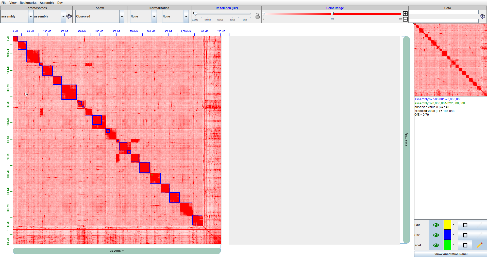
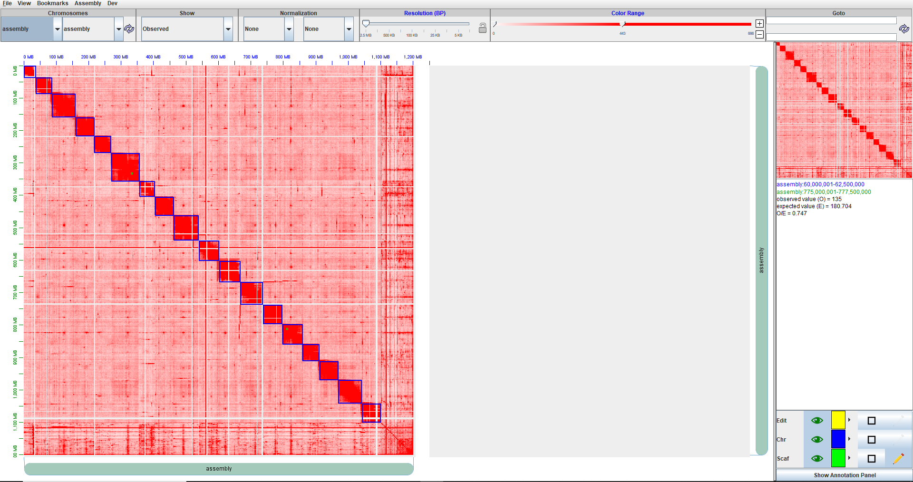

# Genome scaffolding with the Juicer, JuiceBox, 3D-DNA pipeline

Here at the ISUGIF, we have used multiple different contig assemblers and had success with this pipeline.  Typically we assemble the genome with long reads and polish (long or illumina reads) prior to running the pipeline.  I do not know if this is something that affects the downstream product, but it is an important consideration, considering that long read assemblies are typically error prone.   

Another thing to consider is the type of HiC you are getting, we've used both endonuclease and restriction enzyme generated HiC with success. If you plan to use the HiC for anything further than HiC, you will want to specify this. The steps are a bit different, as with an endonuclease you can just say "-s none". With restriction enzyme generated HiC, you will have to create a restriction_sites/ folder and run your genome  you will have to creat the proposed restriction enzyme cut sites for your genome.

## Gather the necessary files, setup the juicer file structure, and run juicer


#### Resources
It is not always clear where to find the information you need to run the pipeline, so I will lay out the many resources that I accessed while learning to run this pipeline.

There is lots of information to be had here at the juicer github site.
* https://github.com/aidenlab/juicer/wiki

If you have problems with installation and/or need help with understanding a result. The aiden lab forum is an invaluable resource.
* https://www.aidenlab.org/forum.html


#### Software Dependencies
```
BWA -- burrows-Wheeler Aligner
GNU core utils
Java >1.7
python
bioawk

```

#### Folder structure

This is the folder structure that we are trying to achieve with a few modifications. Juicer was already installed as a module, so the initial setup of recommended for juicer did not apply here.  You are going to a folder with four subfolders containing: HiC reads, bwa index of your genome, predicted restriction enzyme cuts for your genome (if needed), and your fastq files split into appropriate sizes.     
```
├── 01_JuicerSetup
│   ├── chrom.sizes
│   ├── fastq
│   │   ├── hic_R1.fastq
│   │   └── hic_R2.fastq
│   ├── references
│   │   ├── Big.MysteryGenomePilon3.PILON.fasta
│   │   ├── Big.MysteryGenomePilon3.PILON.fasta.amb
│   │   ├── Big.MysteryGenomePilon3.PILON.fasta.ann
│   │   ├── Big.MysteryGenomePilon3.PILON.fasta.bwt
│   │   ├── Big.MysteryGenomePilon3.PILON.fasta.pac
│   │   └── Big.MysteryGenomePilon3.PILON.fasta.sa
│   ├── restriction_sites
│   |   └── Big.MysteryGenomePilon3.PILON.fasta_DpnII.txt
|   └── splits/
|   |   ├── x000_R1.fastq
|   |   ├── x000_R2.fastq
|   |   ├── x001_R1.fastq
|   |   ├── x001_R2.fastq
|   |   ├── x002_R1.fastq
|   |   ├── x002_R2.fastq
|   |   ├── x003_R1.fastq
|   |   ├── x003_R2.fastq
|   |   ├── x004_R1.fastq
|   |   ├── x004_R2.fastq
|   |   ├── x005_R1.fastq
|   |   ├── x005_R2.fastq
|   |   ├── x006_R1.fastq
|   |   ├── x006_R2.fastq
|   |   ├── x007_R1.fastq
|   |   ├── x007_R2.fastq
|   |   ├── x008_R1.fastq
|   |   ├── x008_R2.fastq
|   |   ├── x009_R1.fastq
|   |   ├── x009_R2.fastq
|   |   ├── x010_R1.fastq
|   |   ├── x010_R2.fastq
|   |   ├── x011_R1.fastq
|   |   ├── x011_R2.fastq
|   |   ├── x012_R1.fastq
|   |   ├── x012_R2.fastq
|   |   ├── x013_R1.fastq
|   |   ├── x013_R2.fastq
|   |   ├── x014_R1.fastq
|   |   └── x014_R2.fastq

```

#### softlink and index the genome sequence in the references/ folder
```
#index the references in this explicitly named folder.
mkdir references; cd references
ln -s /work/gif/archiveResults/JustJammin/WhiteMysteryGenome/Big.MysteryGenomePilon3.PILON.fasta
module load bwa/0.7.17-zhcbtza
bwa index Big.MysteryGenomePilon3.PILON.fasta
```


#### Create restriction enzyme proposed cutting sites
I did not do this for this genome assembly, as my HiC was generated with an endonuclease.
```
mkdir restriction_sites; cd restriction_sites
python ../../juicer/misc/generate_site_positions.py DpnII Big.MysteryGenomePilon3.PILON.fasta ../references/Big.MysteryGenomePilon3.PILON.fasta
cd ../
```

#### Get your HiC reads ready
While juicer does support splitting gzipped files, we had problems getting juicer to split the reads.  Thus I worked around this to make juicer assume the fastq files are already split.
* fastq files should look like filename_R1.fastq and filename_R2.fastq

```
mkdir fastq;cd fastq
ln -s /work/gif/archiveNova/JustJammin/Mystery/whiteMystery/HiC/JustJammin/White_S1_L001_R1_001.fastq hic_R1.fastq
ln -s /work/gif/archiveNova/JustJammin/Mystery/whiteMystery/HiC/JustJammin/White_S1_L001_R2_001.fastq hic_R2.fastq
cd ../
mkdir splits
cd splits/
split -a 3 -l 90000000 -d --additional-suffix=_R2.fastq ../fastq/hic_R2.fastq &
split -a 3 -l 90000000 -d --additional-suffix=_R1.fastq ../fastq/hic_R1.fastq &
cd ../
```

#### Create a chromosome sizes file in the format "name\tsequence_length"

```
module load bioawk
bioawk -c fastx '{print $name"\t"length($seq)}' references/Big.MysteryGenomePilon3.PILON.fasta >chrom.sizes

```

#### Submit a juicer run
Move to the submission directory and submit
The trick here is setting juicer's short, medium, and long queue times, as they will not likely be default for your system.  
```
cd ../
#/02_WhiteMysteryPseudomolecule/01_JuicerSetup
ml jdk/10.0.2_13-fr57jru; ml juicer; juicer.sh -d 01_JuicerSetup -p chrom_sizes -s none -z 01_JuicerSetup/references/Big.MysteryGenomePilon3.PILON.fasta  -q short -Q 2:00:00 -l medium -L 12:00:00 -t 36
```


#### Troubleshooting a juicer run

Your stdout and stderr will tell you almost nothing about your run.  If at the end of your run, you are seeing large merged_sort.txt and a merged_nodups.txt files, then you likely succeeded.  Note that these files are usually hundreds of MB.

If you do not have a merged_sort.txt, the first thing to check is if your split fastq files (in splits/) each aligned and created a sam file.  If you want to know why they failed, then you'll have to investigate the debug folder.   

If you have a merged_sort.txt file, but lack the merged_nodups.txt, then the read deduplication step failed.  In most cases this will be a memory issue that can be fixed by creating a greater number of splits of your fastq files.

You will need to go into the debug folder, which will be /02_WhiteMysteryPseudomolecule/01_JuicerSetup/debug for me.  

If juicer does not complete, you can restart from the last completed stage using -S with one of the following options "chimeric", "merge", "dedup", "final", "postproc", or "early".


##  Set up and run 3D-DNA assembly

### Install 3d-dna
When I install I usually use singularity containers or conda evironments to address my lack of sudo privileges. LastZ installation is not necessary, as it is only useful for highly heterozygous genomes.


#### Create conda environment for installation
```
#/02_WhiteMysteryPseudomolecule/03_3D-DNA

#create a conda environment, as I am using a remote hpc.
module load  miniconda3/4.3.30-qdauveb
conda create -n 3d-dna
source activate 3d-dna
```

#### Install lastz inside the 3d-dna environment
```
git clone https://github.com/lastz/lastz.git
cd lastz/
cd src/
make
make install
make test
```

#### Install Python packages
```
# these python packages are needed.
pip install numpy --user
pip install scipy --user
pip install matplotlib --user
```

#### Clone and set path to 3d-dna
```
#/02_WhiteMysteryPseudomolecule/03_3D-DNA
git clone https://github.com/theaidenlab/3d-dna.git
PATH=$PATH:/02_WhiteMysteryPseudomolecule/03_3D-DNA/lastz
PATH=$PATH:/02_WhiteMysteryPseudomolecule/03_3D-DNA/3d-dna
```


#### 3d-dna assembly that deals with uneven repeat coverage in the genome
```


module load miniconda3/4.3.30-qdauveb;source activate 3d-dna;module load jdk;module load parallel;cd /02_WhiteMysteryPseudomolecule/03_3D-DNA/3d-dna;bash run-asm-pipeline.sh --editor-repeat-coverage 20 /02_WhiteMysteryPseudomolecule/01_JuicerSetup/references/Big.MysteryGenomePilon3.PILON.fasta /02_WhiteMysteryPseudomolecule/01_JuicerSetup/aligned/merged_nodups.txt
```

#### 3d-dna assembly with different ways to modify coverage
```
module load miniconda3/4.3.30-qdauveb;source activate 3d-dna;module load jdk;module load parallel;cd /02_WhiteMysteryPseudomolecule/03_3D-DNA/3d-dna;bash run-asm-pipeline.sh --editor-saturation-centile 5  /02_WhiteMysteryPseudomolecule/01_JuicerSetup/references/Big.MysteryGenomePilon3.PILON.fasta /02_WhiteMysteryPseudomolecule/01_JuicerSetup/aligned/merged_nodups.txt
```


#### 3d-dna assembly for an assembly considered highly heterozygous
```
 module load miniconda3/4.3.30-qdauveb;source activate 3d-dna;module load jdk;module load parallel;cd /02_WhiteMysteryPseudomolecule/03_3D-DNA/3d-dna;bash run-asm-pipeline.sh -m diploid  /02_WhiteMysteryPseudomolecule/01_JuicerSetup/references/Big.MysteryGenomePilon3.PILON.fasta /02_WhiteMysteryPseudomolecule/01_JuicerSetup/aligned/merged_nodups.txt
```
#### 3d-dna assembly with poor quality HiC

This is the option you should try if your HiC coverage is low or suboptimal in some way.  
```
If you see an error that is something like this, "Unknown resolution: BP_100000", then you need to modify the resolution that 3d-dna uses for this step or modify the normalization methods, which are described in the Aiden forum.  "One way to see the overcorrection of vanilla coverage is to look at supplemental figure S1b.  Places where coverage was high in the original map are "overcompensated" and become depleted.  With square root, this effect is dampened, but the best remains KR.  At high resolution, we suggest VC as the alternative to KR if KR doesn't work for some reason; at low resolution, square root VC better approximates KR"

modify the normalization for your HiC reads at this line. Change to NONE, VC, or sqrtVC
"norm="KR"  

vi /02_WhiteMysteryPseudomolecule/04_3ddnaRepCov20/3d-dna/split/run-asm-splitter.sh
```

If changing normalization doesn't work, then the "ADDITIONAL OPTIONS" in  need to be modified until there is enough coverage for 3d-dna to operate. These are in run-asm-pipeline.sh
```

-q|--mapq mapq                                  Mapq threshold for scaffolding and visualization (default is 1).

**misjoin detector**
--editor-coarse-resolution editor_coarse_resolution
                        Misjoin editor coarse matrix resolution, should be one of the following: 2500000, 1000000, 500000, 250000, 100000, 50000, 25000, 10000, 5000, 1000 (default is 25000).
--editor-coarse-region editor_coarse_region
                        Misjoin editor triangular motif region size (default is 125000).
--editor-coarse-stringency editor_coarse_stringency
                        Misjoin editor stringency parameter (default is 55).
--editor-saturation-centile editor_saturation_centile
                        Misjoin editor saturation parameter (default is 5).
--editor-fine-resolution editor_fine_resiolution
                        Misjoin editor fine matrix resolution, should be one of the following: 2500000, 1000000, 500000, 250000, 100000, 50000, 25000, 10000, 5000, 1000 (default is 1000).
--editor-repeat-coverage editor_repeat_coverage
                        Misjoin editor threshold repeat coverage (default is 2).

```

## Juicebox

#### File requirements

For juicebox, you'll need two files from 3d-dna, your final .hic file and your final .assembly file.
```
Big.MysteryGenomePilon3.PILON.final.hic
Big.MysteryGenomePilon3.PILON.final.assembly
```
Download juicebox for your system (1.11.08 currently)

 - https://github.com/aidenlab/Juicebox/wiki/Download

While I did want to include a video of edits, the aiden lab does a pretty good job of documenting how to use juicebox, once it is loaded.  
Check out these videos to discover how to read the HiC maps, spot inversions, and get a general feel for juicebox.   
- https://www.youtube.com/watch?v=Nj7RhQZHM18
- https://www.youtube.com/watch?v=IMmVp8FodmY

Juicebox can be a resource hog and crashes occasionally, so be sure to frequently save your modifications by exporting the assembly. Also note, that if juicebox crashes and you need to reload your .hic and .assembly files, be sure to always load .hic, then load the original .assembly file, then load your modified .assembly file.

**Before editing with Juicebox**


**After editing with Juicebox**

## 3d-dna finalize

Since the assembly files will be overwritten if we run files will be overwritten in the 3d-dna assembly, I copied the old 3ddna folder and removed all data that was not script related for the final assembly process of 3d-dna.

```
/03_White_Mystery/06_3ddna_finalize/3d-dna

# I use the additional options of -i 500 to force 3d-dna to try to incorporate smaller contigs.
module load miniconda3/4.3.30-qdauveb;source activate 3d-dna;module load jdk;module load parallel;bash run-asm-pipeline-post-review.sh --sort-output -s seal -i 500 -r Big.MysteryGenomePilon3.PILON.donefinal.review.assembly.assembly /02_WhiteMysteryPseudomolecule/01_JuicerSetup/references/Big.MysteryGenomePilon3.PILON.fasta /02_WhiteMysteryPseudomolecule/01_JuicerSetup/aligned/merged_nodups.txt
```

#### Assembly results

**Before juicer, juicebox, and 3d-dna**
```
Number of scaffolds      23058
Total size of scaffolds 1204812274
Longest scaffold    4090936
Shortest scaffold         92
Number of scaffolds > 1K nt      18200  78.9%
Number of scaffolds > 10K nt       7623  33.1%
Number of scaffolds > 100K nt       2445  10.6%
Number of scaffolds > 1M nt        166   0.7%
Number of scaffolds > 10M nt          0   0.0%
Mean scaffold size      52251
Median scaffold size       3118
N50 scaffold length     444717
L50 scaffold count        721
```

**After juicer, juicebox, and 3d-dna**
```
Number of scaffolds      19758
Total size of scaffolds 1207942174
Longest scaffold   87406776
Shortest scaffold         92
Number of scaffolds > 1K nt      14801  74.9%
Number of scaffolds > 10K nt       2796  14.2%
Number of scaffolds > 100K nt         26   0.1%
Number of scaffolds > 1M nt         18   0.1%
Number of scaffolds > 10M nt         18   0.1%
Mean scaffold size      61137
Median scaffold size       2160
N50 scaffold length   60392520
L50 scaffold count          9
```
---

* [Back to the Assembly and Annotation Index page](../../GenomeAnnotation/annotation_and_assembly_index.md)
