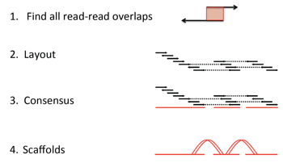
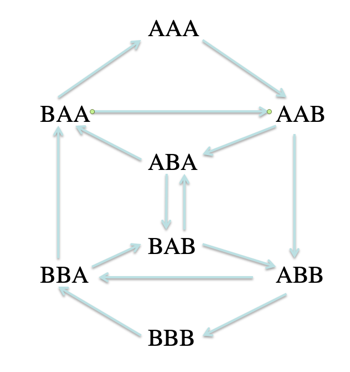

# Learning Objectives

Upon completion of this section on Genome Assembly you will understand the following:

* What is Whole Genome Sequence Assembly.
* Why is it a Genome assembly a hard problem

# What is Whole Genome Sequence Assembly?

Like any scientific endeavor, genome assembly starts with experimental design and its success depends on the following.
  * nature of the genome being sequenced
  * the quality of the sample taken for sequencing
  * the limits of the sequencing technology used to generate the data to be assembled
    * length, quality and error
  * the software used to assemble the genomic pieces

# Why is it a Genome assembly a hard problem?

* ## Polymorphism
  -  diploid (having pairs of chromosomes)
    -  Reads from regions on homologous chromosomes may differ
  - Chimera
    - one organism with multiple genomes in the same sample
  - Multiple individuals
    - some species are so small that to obtain enough DNA requires more than a single individual

*  ## Repeats
  - SINEs = Short INterspersed Elements
    - Usually ~500 b in length
    - About 1.5M in the human genome
  - LINEs = Long INterspersed Elements
    - Usually ~1 Kb in length
    - About 0.5M in the human genome
  - Large repeats, segmental duplications...
    - 40 Kb and more!
  - Polyploidy
    - Whole genome duplications
    - multiple copies of chromosomes
  - Paleopolyploidy
    - polyploidy that happened millions of years ago and where the organism has re-diploidized
    - many genomic regions will be duplicated
  - Example of how Repeats can fool an assembler
    - Consider two reads S and T with a region in orange that is a stretch of 20 Adenine nucleotides (A)
    - It is unclear from a read to read alignment if S and T really overlap or if they from two copies of the same repeat

    

*  ## Sequencing Error

  - Different sequences technologies have different types of errors
  - Base accuracy varies - Phred scores
  - Logarithmically linked to probability of error
    - Q10: P[wrong base call] = 1 in 10
    - Q20: P[wrong base call] = 1 in 100
    - Q30: P[wrong base call] = 1 in 1,000
    - Q40: P[wrong base call] = 1 in 10,000
    - Q50: P[wrong base call] = 1 in 100,000
    - Q50 is considered very good
  - There are thousands of errors assembled genomes!

*  ## Sample contamination

  -  

*  ## Experimental Design

# Genome Assembly Algorithms

## Overlap Layout Consensus

* Overlap layout consensus is the t

  

## De Bruijn Graph (DBG) or k-mer approach

* Chop the reads into k-mers
* Construct DBG from k-mers
* Representing a sequence in terms of its k-mer components
* Find Eulerian path in the graph
* Derive the genome sequence from the graph

|Explanation | Graph |
|:-|-|
|Suppose we are given a set of symbols,(say A and B) and we are given a length (say 3), then a de Brujin graph  is constructed by generating all possible sequences of length k=3 (eg. AAA, AAB, ABA, ABB… , BBB). These “3-mers”  then become nodes in the graph. Directed edges are drawn between nodes (say X and Y) that differ by one symbol   with Y being a left-shifted version of X. |  |

From the example above, it is easy to see how short k-mers can result in many paths resulting in many possible assemblies.

Material for this tutorial was taken with permission from the [BroadE Workshop on Genome Informatics from 2013](https://docs.google.com/file/d/0B2dK2q40HDWeVFhFR3dBLXBDSUk/edit) written by Sante Gnerre, Aaron Berlin and Sean Sykes.

Further Reading

* [BroadE Workshop on Genome Informatics from 2013](https://docs.google.com/file/d/0B2dK2q40HDWeVFhFR3dBLXBDSUk/edit)
