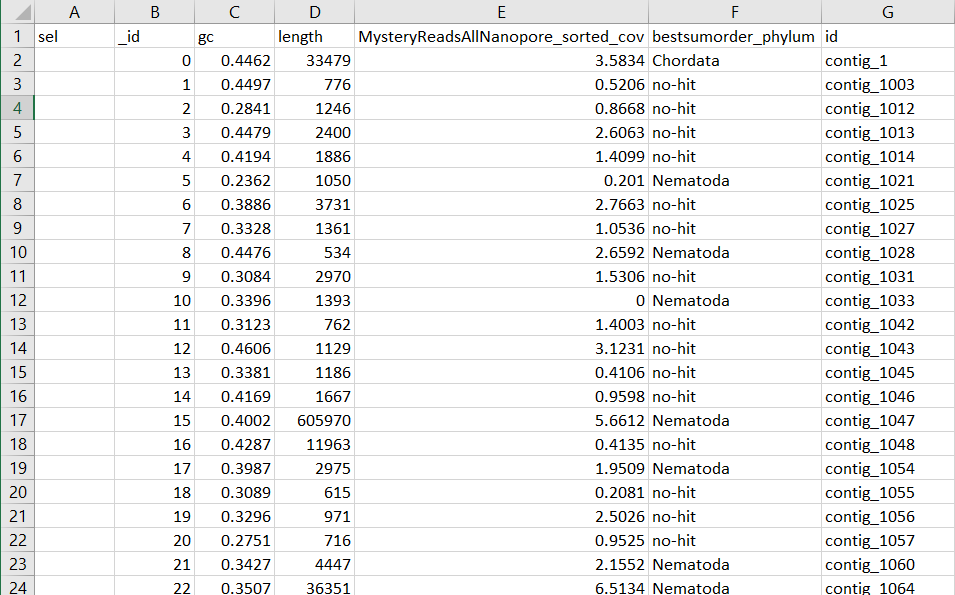

Have you ever wanted to figure out which reads are the most useful for creating a more contiguous assembly? Here I assemble a nematode genome, assess contamination using Blobtools2, extract non-contaminant reads, and reassemble.

### Dependencies

*  FLYE -- assembler
*  BLAST-plus -- for blasting to NCBI nt for blobtools
*  Minimap2 -- read mapping for blobtools
*  Samtools -- extracting the reads
*  Bioawk -- creating bed files to extract reads
*  Cdbfasta -- used to extract non-contaminant contigs
*  new_Assemblathon.pl -- to assess assembly quality -- https://github.com/ISUgenomics/common_scripts/blob/master/new_Assemblathon.pl

### First assembly
```
/work/gif/remkv6/USDA/11_Experiment/03_MysteryFlye
ln -s ../MysteryReadsAllNanopore.fastq.gz

ml miniconda3; source activate flye;flye  --nano-raw MysteryReadsAllNanopore.fastq.gz -g 140m -o /work/gif/remkv6/USDA/11_Experiment/03_MysteryFlye -t 36
```
Check initial assembly quality
```
~/common_scripts/new_Assemblathon.pl assembly.fasta

---------------- Information for assembly 'assembly.fasta' ---------------
                                      Number of scaffolds   5222
                                     Total size of scaffolds  204772733
                                            Longest scaffold     751399
                                           Shortest scaffold         68
                                 Number of scaffolds > 1K nt       4700  90.0%
                                Number of scaffolds > 10K nt       3134  60.0%
                               Number of scaffolds > 100K nt        499   9.6%
                                 Number of scaffolds > 1M nt          0   0.0%
                                Number of scaffolds > 10M nt          0   0.0%
                                          Mean scaffold size      39213
                                        Median scaffold size      17620
                                         N50 scaffold length      90687
                                          L50 scaffold count        584
                                         n90 scaffold length      23396
                                          L90 scaffold count       2277
                                                 scaffold %A      29.54
                                                 scaffold %C      20.45
                                                 scaffold %G      20.45
                                                 scaffold %T      29.55
                                                 scaffold %N       0.00
                                         scaffold %non-ACGTN       0.00
                             Number of scaffold non-ACGTN nt          0
```

# Identify contamination in this initial assembly with Blobtools2

### map nanopore reads to assembly
This can be done with any reads, though mapping long reads with minimap2 is ridiculously fast.
```
/work/gif/remkv6/USDA/11_Experiment/06_BlobtoolsDrafts/01_Mystery/01_nanoporeMapping

ln -s ../../../03_MysteryFlye/MysteryReadsAllNanopore.fastq.gz
ln -s ../../../03_MysteryFlye/assembly.fasta

# USAGE sh runMinimap.sh query.fasta target.fasta
#############################################################################################
#!/bin/bash
query=$1
target=$2
outname="${query%.*}_${target%.*}_minimap2.bam"
module load minimap2
minimap2 -x map-ont -k15 -a -t 36 $target $query > ${outname}
mkdir ${query%.*}dir; ml samtools
samtools view --threads 24 -b -o ${outname%.*}.bam ${outname}
samtools sort -o ${outname%.*}_sorted.bam -T ${query%.*}dir --threads 24 ${outname%.*}.bam
#############################################################################################

sh runMinimap.sh MysteryReadsAllNanopore.fastq.gz assembly.fasta
```
Checking my mapping percentages to see if they are reasonable
```
ml samtools; samtools flagstat

2129548 + 0 in total (QC-passed reads + QC-failed reads)
656411 + 0 secondary
337474 + 0 supplementary
0 + 0 duplicates
1612546 + 0 mapped (75.72% : N/A)
0 + 0 paired in sequencing
0 + 0 read1
0 + 0 read2
0 + 0 properly paired (N/A : N/A)
0 + 0 with itself and mate mapped
0 + 0 singletons (N/A : N/A)
0 + 0 with mate mapped to a different chr
0 + 0 with mate mapped to a different chr (mapQ>=5)
```


### Run a megablast on your assembly
Note, if you do not have -task megablast set, the blast will take much longer.  Also note the -outfmt, it must be in this format to attribute taxonomy info for blobtools
```
/work/gif/remkv6/USDA/11_Experiment/06_BlobtoolsDrafts/01_Mystery/02_megablast

#softlink genome
ln -s ../../../05_juicer/01_Mystery/references/MysteryGenome.fasta

#run the script below
sh runMegablast.sh MysteryGenome.fasta


#!/bin/bash
#runMegablast.sh
#Created by Rick Masonbrink 08/11/21

#usage
#sh runMegablast.sh genome.fasta
################################################################################
wget ftp://ftp.ncbi.nlm.nih.gov/blast/db/taxdb.tar.gz
tar -zxvf taxdb.tar.gz

ml gcc/10.2.0-zuvaafu; ml blast-plus/2.11.0-py3-4pqzweg
FASTA="$1"
blastn \
-query ${FASTA} \
-task megablast \
-db /work/gif/databases/Blast/NT-DB/nt \
-outfmt '6 qseqid staxids bitscore std sscinames sskingdoms stitle' \
-culling_limit 10 \
-num_threads 36 \
-evalue 1e-3 \
-out ${FASTA%.**}.vs.nt.cul5.1e3.megablast.out
################################################################################
```


### Run blobtools2

Set up file structure for blobtools
```
/work/gif/remkv6/USDA/11_Experiment/06_BlobtoolsDrafts/01_Mystery/03_blobtools
ln -s ../01_nanoporeMapping/MysteryReadsAllNanopore_sorted.bam
ln -s ../02_megablast/MysteryGenome.vs.nt.cul5.1e3.megablast.out
```
Get the taxon info and move it into a folder
```
wget https://ftp.ncbi.nlm.nih.gov/pub/taxonomy/new_taxdump/new_taxdump.tar.gz
tar -zxvf new_taxdump.tar.gz
mkdir taxdump
mv *.dmp taxdump/.
```

Execute Blobtools 2  -- must be on a cpu node that can connect to the internet
```
ml singularity; ml blobtools2
singularity shell /opt/rit/singularity/images/blobtools2/2.2.0/blobtools2.simg
blobtools create --fasta assembly.fasta  --cov MysteryReadsAllNanopore_sorted.bam --hits MysteryGenome.vs.nt.cul5.1e3.megablast.out --replace --taxdump taxdump Mystery
```
Once done, connect to novaDTN (internet capable node) through your personal computers terminal
```
ssh -L 8001:127.0.0.1:8001 -L 8000:127.0.0.1:8000  remkv6@novadtn.its.iastate.edu

#Navigate the directory of your blobtools run
/work/gif/remkv6/USDA/11_Experiment/06_BlobtoolsDrafts/01_Mystery/03_blobtools

ml singularity; ml blobtools2
singularity shell /opt/rit/singularity/images/blobtools2/2.2.0/blobtools2.simg

#this freqently fails, but must go through channel 8001 to work. Must get out of singularity and back in to reset it.  
blobtools view --interactive Mystery

#then paste the link into your personal computer's browser
```
##### BlobPlotCircle

##### BLOBTABLE.CSV


Yay, you now can filter contigs that are contaminants. The only file needed is the blobtools.csv output, though I grab the circle blob plot also.  With my nematode assembly, I frequently get contigs attributed to arthropoda, as they more highly represented sequences in NT.

### Filter the assembly using blobtools output
I have lots of real contaminants in my assembly, so I am hard-filtering. Contigs/scaffolds had to be attributed to Nematoda, Arthropoda, or no-hit, and no-hit must have coverage.
```
less MysteryBlobTable.csv |sed 's/,/\t/g' |sed 's/"//g' |cut -f 2- |awk '$5=="Nematoda" || $5=="no-hit" || $5=="Arthropoda"'  |awk '{if($5=="no-hit" && $4==0) {next} else {print $0}} ' |awk '$3>1999 {print $6}' |cdbyank assembly.fasta.cidx >FilteredMysteryGenome.fasta
```

Make sure you arent missing contigs that were mislabeled as other taxa by blobtools, by searching for your most closely related species in your blast output. I did not have any mislabeled contigs, so nothing was added here.
```
less MysteryBlobTable.csv |sed 's/,/\t/g' |sed 's/"//g' |cut -f 2- |awk '$5!="Nematoda" && $5!="no-hit" && $5!="Arthropoda"' |awk '$3>10000 {print $6}' |grep -w -f - MysteryGenome.vs.nt.cul5.1e3.megablast.out |grep "Heterodera glycines" - |awk '{print $1}' |sort|uniq|cdbyank MysteryGenome.fasta.cidx >>FilteredMysteryGenome.fasta
```

```
~/common_scripts/new_Assemblathon.pl FilteredMysteryGenome.fasta
---------------- Information for assembly 'FilteredMysteryGenome.fasta' ----------------


                                          Number of scaffolds       3865
                                      Total size of scaffolds  192263859
                                             Longest scaffold     751399
                                            Shortest scaffold       2001
                                  Number of scaffolds > 1K nt       3865 100.0%
                                 Number of scaffolds > 10K nt       2871  74.3%
                                Number of scaffolds > 100K nt        489  12.7%
                                  Number of scaffolds > 1M nt          0   0.0%
                                 Number of scaffolds > 10M nt          0   0.0%
                                           Mean scaffold size      49745
                                         Median scaffold size      27137
                                          N50 scaffold length      95784
                                           L50 scaffold count        520
                                          n90 scaffold length      24803
                                           L90 scaffold count       2027
                                                  scaffold %A      29.81
                                                  scaffold %C      20.18
                                                  scaffold %G      20.19
                                                  scaffold %T      29.82
                                                  scaffold %N       0.00
                                          scaffold %non-ACGTN       0.00
                              Number of scaffold non-ACGTN nt          0
```


## Extract only reads that do not map to contaminant contigs

The read name and orientation of the contaminant reads, are extracted with the fastq if you do not do this step.
```
bioawk -c fastx '{print $name,"1",length($seq)}' FilteredMysteryGenome.fasta|tr " " "\t" >KeeperContigs.bed
```
Extract the reads mapping to the contigs you want to keep, and convert to fastq
```
samtools view -b -L KeeperContigs.bed -o CleanedSCNReads.bam  ../01_nanoporeMapping/MysteryReadsAllNanopore.bam
samtools fastq CleanedSCNReads.bam >CleanedSCNReads.fastq
```
Filter fastq by length of at least 2kb
```
bioawk -cfastx 'length($seq)>=1999{print "@"$name"\n"$seq"\n+\n"$qual}' CleanedSCNReads.fastq >Long2kCleanedSCNReads.fastq
```

### Assembly 2 without any contaminating reads or reads shorter than 2kb
```
ln -s ../06_BlobtoolsDrafts/01_Mystery/03_blobtools/Long5kCleanedSCNReads.fastq

ml miniconda3; source activate flye;flye  --nano-raw Long2kCleanedSCNReads.fastq -g 140m -o /work/gif/remkv6/USDA/11_Experiment/03_MysteryFlye -t 36
```
Check assembly quality and gaze in awe at the improve contiguity
```
~/common_scripts/new_Assemblathon.pl

Number of scaffolds       2201
Total size of scaffolds  155445271
   Longest scaffold    1053850
  Shortest scaffold        431
Number of scaffolds > 1K nt       2138  97.1%
Number of scaffolds > 10K nt       1753  79.6%
Number of scaffolds > 100K nt        468  21.3%
Number of scaffolds > 1M nt          1   0.0%
Number of scaffolds > 10M nt          0   0.0%
 Mean scaffold size      70625
Median scaffold size      43946
N50 scaffold length     131176
 L50 scaffold count        321
n90 scaffold length      40032
 L90 scaffold count       1179
        scaffold %A      30.17
        scaffold %C      19.80
        scaffold %G      19.80
        scaffold %T      30.23
        scaffold %N       0.00
scaffold %non-ACGTN       0.00
Number of scaffold non-ACGTN nt          0
```
[Back to the Assembly and Annotation Index page](../GenomeAnnotation/annotation_and_assembly_index.md)
