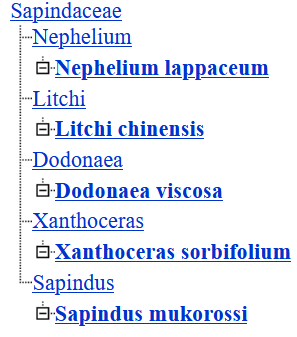

In this tutorial, we'll walk through extracting and assembling the mitochondrial genome of *Dodonaea viscosa* using Oxford Nanopore reads.
Measures are always taken to remove organelles prior to sequencing, though there are usually enough long reads to create single-contig, complete assemblies. To avoid confounding our assemblies, we will be first employ strategies to remove NUMTs (nuclear mitochondrial DNA segments) and NUPTs (nuclear plastid DNA segments) from our reads.
What are NUMTs and NUPTs?

* NUMTs (Nuclear Mitochondrial DNA) are segments of mitochondrial DNA that have been inserted into the nuclear genome and can vary greatly across species. These can be present in multiple copies with varying degrees of sequence divergence from the functional mitochondrial genome.
* NUPTs (Nuclear Plastid DNA) are the plastid equivalent.

Then I will show you how to install and assemble these reads with five different assemblers.
- **Unicycler** – Works best with hybrid data, but in long-read-only mode may struggle with noisy reads and NUMTs when assembling small organellar genomes.
- **Miniasm** – Assembles quickly but without error correction, so mitochondrial contigs may be fragmented or inaccurate without correction.
- **Flye** – Probably the best at recovering circular mitochondrial genomes from whole-genome reads, even in the presence of NUMTs, due to good repeat handling and built-in polishing.
- **Canu** – Accurate but much slower; assembles mitochondrial genomes well if coverage is high, can struggle with NUMTs.
- **Raven** – Fast and memory-efficient; often produces clean mitochondrial contigs even from mixed read sets, though may miss complex repeats or low coverage regions.

# Setup: Organize your workspace

Where are your nuclear-targeted or other long reads? <br>
I have a set of reads I have already been trimmed for adapters, sequence quality, and a minimum of 5kb in length. Keeping your input files at the top of your repo is good practice. 
```
/work/gif3/sharu/viscosa/03_Porechop/trimmed_5kplus.fq
```
Where is your nuclear genome?
```
MitoRemovedpolished_3.fasta
```
Where on the HPC are you storing these files for future reference?
```
/work/gif3/masonbrink/USDA/04_MitochondrialIsolationAndAssembly
```

# Find related species with an assembled mitochondrial genome

To aid in assembly and annotation, find mitochondrial genomes from related species.If not from the same genus, then the same family, etc. My reads are from *Dodonaea viscosa*, a plant species in the sapindaceae.

  1. Search the NCBI Nucleotide database for "Sapindaceae mitochondrion genome."

  2. Filter for plants and mitochondria.

  3. Download sequences for related species. Some examples in my case:

* *Xanthoceras sorbifolium*
* *Nephelium lappaceum*
* *Litchi chinensis*
* *Sapindus mukorossi* 
  
Once you find a few assemblies of related species, you can visualize how they are related by plotting 'genus species' names into the NCBI Taxonomy Browser tool: Common Tree

https://www.ncbi.nlm.nih.gov/Taxonomy/CommonTree/wwwcmt.cgi 



# Identifying organellar genomic reads from nuclear-targeted reads

##### Install Minimap2

<details>
<summary>Click to Expand</summary>

Creates environment named minimap2, and calls bioconda to install minimap2. Activate your environment to access minimap.

<pre><code>
micromamba create -n minimap2 -c bioconda minimap2
micromamba activate minimap2
</code></pre>

</details>

### Map reads to related species' mitochondrial genome

```bash
sh runMinimap.sh trimmed_5kplus.fq RelatedNCBIMitochondrialGenomeSequences.fasta
```
runMinimap.sh

<details>
<summary>Click to Expand</summary>
<pre><code>
##############################################################################
#!/bin/bash
query=$1
target=$2
outname="${query%.*}_${target%.*}_minimap2.paf"
module load minimap2
minimap2 -x map-ont -t 36 $target $query > ${outname}
##############################################################################

</code></pre>

</details>

##### Install Seqtk

<details>
<summary>Click to Expand</summary>

We will be using Seqtk to extract fastq sequences. This code creates an environment named seqtk, and calls bioconda to install seqtk. Activate environment to access seqtk.
<pre><code>
micromamba create -n seqtk -c bioconda seqtk
micromamba activate seqtk
</code></pre>

</details>

### 1. Extract reads from related mitochondrial genome mapping with at least 2kb alignment length to the using Seqtk

The length of the alignment filter is to get rid of any nuclear integrated mitochondrial genomic fragments. If your genome assembly has very few or small NUMTs or NUMPs then, this is likely the easiest way to obtain an organelle-targeted set of reads from a nuclear-targeted set of reads.

```bash
less trimmed_5kplus.fq_RelatedNCBIMitochondrialGenomeSequences_minimap2.paf |awk -F"\t" '($4-$3)>2000 {print $1}' |sort|uniq |seqtk subseq trimmed_5kplus.fq.gz - >MitoNanopore2k.fastq
```

### 2. Or we can map the reads to the nuclear genome and extract only those that did not map. 
The thought here is that if there is not too much contamination in the reads, we will be able to eliminate all reads that are nuclear and keep only low-quality reads, organelle reads, and contamination reads to use for organelle genome assembly.


Softlink genome, reads and mapping script
```bash
ln -s ../../03_DononeaViscosaDeposition/MitoRemovedpolished_3.fasta
ln -s ../trimmed_5kplus.fq
ln -s ../runMinimap.sh
```
Map reads to nuclear genome
```bash
echo "sh runMinimap.sh trimmed_5kplus.fq MitoRemovedpolished_3.fasta" >Map2Nucleus.sh
```
Get names of all reads in the dataset
```bash
awk 'NR % 4 == 1' trimmed_5kplus.fq |sed 's/^@//g'  |awk '{print $1}' >AllTrimmedReadNamesFormatted.list
```
Get the names of the reads that are not mapping to the nuclear genome 
```bash
cat AllTrimmedReadNamesFormatted.list <(awk -F"\t" '$12==60 && $10>500' {print $1}' trimmed_5kplus_MitoRemovedpolished_3_minimap2.paf|uniq ) |sort |uniq -c |awk '$1==1 {print $2}' >OrganelleReads.list
```
Extract those reads that did not map
```bash
seqtk subseq trimmed_5kplus.fq OrganelleReads.list >OrganelleReads.fastq
```

### 3. Or we can identify reads that have mitochondrial genes using miniprot and assemble those reads.
Here we will use the predicted proteins from the *Sapindus mukorossi* mitchondrial genome to identify mitochondrial reads among D. viscosa's nuclear-targeted fastq file. <br>
Note that in my case this generated a small number of reads that were not of sufficient depth to split, so I ran assemblies on this subset of reads without splitting the fastq files.<br>

Convert fastq to fasta
```bash
micromamba activate seqtk; seqtk seq -a trimmed_5kplus.fq >trimmed_5kplus.fasta
```
Map proteins to the reads
```bash
echo "ml micromamba; micromamba activate miniprot;miniprot -t 64 -S trimmed_5kplus.fasta NamedSmukorossiProteins.fasta >SmukrossiProteins2OrganelleReads.paf " >miniprotToTrimmed5kplus.sh
```
Grab all read names that have a mitochondrial protein alignment
```bash
less SmukrossiProteins2OrganelleReads.paf |cut -f 6 |sort |uniq >MiniprotOrganelleReads.list
```
Extract the reads with seqtk
```bash
seqtk subseq trimmed_5kplus.fq MiniprotOrganelleReads.list >MiniprotOrganelleReads.fastq
```
### Create subsets of reads from different positions in the fastq file using Trycycler


**Install Trycycler**

<details>
<summary>Click to Expand</summary>

Trycycler provides positional splitting of a fastq file, leading to a higher-quality assembly consensus. <br>
<pre><code>
micromamba create -c bioconda -c conda-forge -n trycycler trycycler
micromamba activate trycycler
</code></pre>

</details>

Here trycycler will generate 12 fastq files in the read_subsetNuclearClean and read_subsets folders, that are close to equal in size. If depth is sufficient, then you will get split files without any redundant read overlap. <br>
```bash
trycycler subsample --reads OrganelleReads.fastq --out_dir read_subsetNuclearClean  -t 36
trycycler subsample --reads MitoNanopore2k.fastq --out_dir read_subsets -t 36
```
Alternatively generate random subsets with Seqtk by changing the seed number (-s) and proportion.
```bash
# By modifying '-s' and your output filename, you can generate different subsets of 10% of the reads.   
seqtk sample -s100 MitoNanopore2k.fastq 0.1 > subset_00.fastq
seqtk sample -s101 MitoNanopore2k.fastq 0.1 > subset_01.fastq
etc...
```

# Installing software for creating assemblies from read subsets

After choosing your method to split the fastq files, we will use these to generate multiple independent assemblies. Here I will be using Unicycler, Miniasm, Raven, CANU, and FLYE to generate different assemblies. One or a few assemblers may be fine for your purposes.

**Install Unicycler assembler** <br>

<details>
<summary>Click to Expand</summary>

<pre><code>
git clone https://github.com/rrwick/Unicycler.git

#create environment
python -m venv Unicycler
# activate the environment
source Unicycler/bin/activate
# install Unicycler
python3 setup.py install --prefix=/work/gif3/masonbrink/USDA/04_MitochondrialIsolationAndAssembly
</code></pre>

</details>

**Install Flye assembler** <br>

<details>
<summary>Click to Expand</summary>

<pre><code>
micromamba -n flye -c bioconda::flye
micromamba activate flye
</code></pre>

</details>

**Install Miniasm assembler** <br>

<details>
<summary>Click to Expand</summary>

<pre><code>
 micromamba -n miniasm -c bioconda::miniasm
 micromamba activate miniasm
</code></pre>

</details>

**Install Raven assembler** <br>

<details>
<summary>Click to Expand</summary>

<pre><code>

micromamba create -n raven -c bioconda -c conda-forge raven-assembler
micromamba activate raven
</code></pre>

</details>

**Install CANU assembler** <br>

<details>
<summary>Click to Expand</summary>

<pre><code>
micromamba create -n canu-env -c bioconda -c conda-forge canu
micromamba activate canu-env
</code></pre>

</details>

**Install Circlator**

Circlator will rotate circular assemblies so that the genome starts at a standard gene (*dnaA* usually ) for better comparisons to published assemblies. <br>

<details>
<summary>Click to Expand</summary>

<pre><code>
micromamba create -n circlator-env python=3.7 -y
micromamba activate circlator-env
micromamba install -c bioconda -c conda-forge circlator
</code></pre>

</details>

# Use multiple assemblers to generate genome assemblies of each read subset

To prepare this tutorial I created >100 assemblies, though you may achieve good results with just one run of it. Sometimes the filtered fastq file is too small to split, and was thus used as a whole. You also do not need to install all of these assemblers, one or a few may be fine. 

**Generate Flye Assemblies**
```bash
for f in *fastq; do echo "ml micromamba; micromamba activate flye; flye --nano-raw $f --threads 36 --out-dir ${f%.*}FlyeOut --genome-size 800000 --meta --scaffold" -m 2000 ; done >flye.sh
```

**Generate Miniasm Assemblies** 
```bash
for f in *fastq; do echo "sh AssembleMitoMiniasm.sh "$f" "${f%.*}"_MiniasmOut";done >miniasmAssemblies.sh


**AssembleMitoMiniasm.sh**

<details> 
<summary>Click to Expand</summary>


<pre><code>

    #!/bin/bash

    #Ensure script stops on errors
    set -e

    #Check if correct number of arguments are provided
    if [[ $# -ne 2 ]]; then
        echo "Usage: sh assemble_mito.sh <reads.fastq> <output_prefix>"
        exit 1
    fi

    #Assign command-line arguments to variables
    READS="$1"
    PREFIX="$2"

    #Create an output directory
    OUTDIR="${PREFIX}_output"
    mkdir -p "$OUTDIR"

    #Check if input file exists
    if [[ ! -f "$READS" ]]; then
        echo "Error: File '$READS' not found!"
        exit 1
    fi

    #Convert FASTQ to FASTA and save in the output directory
    echo "Converting FASTQ to FASTA..."
    awk 'NR%4==1 {print ">" substr($0,2)} NR%4==2 {print}' "$READS" > "$OUTDIR/${PREFIX}_reads.fasta"

    #Run minimap2 for read overlap
    echo "Running minimap2..."
    ml micromamba;micromamba activate minimap2;minimap2 -x ava-ont -t 36 -k 19 -w5  "$OUTDIR/${PREFIX}_reads.fasta" "$OUTDIR/${PREFIX}_reads.fasta" > "$OUTDIR/${PREFIX}.paf"

    #Run miniasm
    echo "Running miniasm..."
    ml micromamba; micromamba activate miniasm;miniasm;miniasm -f "$OUTDIR/${PREFIX}_reads.fasta" "$OUTDIR/${PREFIX}.paf" -s 500 > "$OUTDIR/${PREFIX}.gfa"

    #Convert GFA to FASTA
    echo "Converting GFA to FASTA..."
    awk '/^S/{print ">"$2"\n"$3}' "$OUTDIR/${PREFIX}.gfa" > "$OUTDIR/${PREFIX}.final.fasta"

    echo "Assembly complete! Output files are in $OUTDIR"

</code></pre>

</details>


**Generate CANU 2.2 assemblies** 

Note here that you will have to estimate your mitochondrial genome's size. Mine is too large, as I expected to get reads for the chloroplast genome as well.

```bash
for f in sample*fastq; do echo "ml micromamba; micromamba activate canu-env; canu -p mito -d "${f%.*}"CanuOut genomeSize=550k -nanopore-raw "$f ;done >canu.sh
```

**Generate Raven assemblies**
```bash
 for f in sample*fastq; do echo "ml micromamba; micromamba activate raven;mkdir "${f%.*}"Raven ; cd "${f%.*}"Raven ; ln -s ../"$f"; raven "$f" >"${f%.*}"Assembly.fasta" ;done  >raven.sh   
```

**Generate Unicycler Assemblies**
```bash
# current location
/work/gif3/masonbrink/USDA/04_MitochondrialIsolationAndAssembly/Unicycler/
source bin/activate

# create assembly commands for each split
for f in *fastq; do echo "unicycler -l "$f" -t 36 --mode bold -o "${f%.*}"Unicycler --threads 36 --racon_path /work/gif3/masonbrink/Heuther/09_Unicycler/Unicycler/racon/build/bin/racon" ;done >UnicyclerRuns.sh
```

# Evaluation of Assemblies 

### Acquire sapindaceae mitochondrial genes
Downloaded protein sequences from annotated Sapindus mukorossi mitochondrion <br>
```bash
vi SmukorossiProteins.fasta
grep -c ">" SmukorossiProteins.fasta
41

#Rename proteins by protein name, not accession
awk '{if(NF>1) {print ">"$2} else {print $0}}' SmukorossiProteins.fasta >NamedSmukorossiProteins.fasta
```

### Create a folder of uniquely named genome assemblies
Get all of the genomes into one folder with unique file names so that we can rerun the same scripts to evaluate them. This is not an essential step, but just makes the evaluation easier when you have so many different attempts. Here I use the "/" as a string separator to rename the files in a softlink. Note that I had three different read subsets, so I had to make sure the names were unique or the softlink would fail.

```bash
#grabs all the unicycler assemblies and renames them by folder name, essentially by using the "/" as a separator to change the name. 
for f in ../sample*Unicycler/assembly.fasta; do echo "ln -s "$f ; echo $f |sed 's|/|\t|g' |cut -f 2| awk '{print $1".fasta"}' ;done |tr "\n" " " |sed 's/ln -s/\nln -s/g' >SoftlinkUnicycler.sh
sh SoftlinkUnicycler.sh

#grabs all flye assemblies and renames by folder name
for f in ../read_subsets/sample*FlyeOut/assembly.fasta; do echo "ln -s "$f ; echo $f |sed 's|/|\t|g' |cut -f 3| awk -F"\t" '{print $0".fasta"}' ;done |tr "\n" " " |sed 's/ln -s/\nln -s/g' >SoftlinkFlye.sh

#softlinks all the miniasm assemblies which already have unique names
for f in ../read_subsets/*MiniasmOut_output/*final.fasta ; do ln -s $f;done

#softlinks and renames all canu assemblies 
for f in ../read_subsets/*CanuOut/mito.contigs.fasta; do echo "ln -s "$f ; echo $f |sed 's|/|\t|g' |cut -f 3| awk -F"\t" '{print $0".fasta"}' ;done |tr "\n" " " |sed 's/ln -s/\nln -s/g' >CanuSoftlink.sh

#softlinks and renames all Raven assemblies, which already have unique names
for f in ../read_subsets/*Raven/*Assembly.fasta ;do ln -s $f;done

#grabs all the unicycler assemblies and renames them by folder name
for f in ../read_subsetNuclearClean/*Unicycler/assembly.fasta; do echo "ln -s "$f ; echo $f |sed 's|/|\t|g' |cut -f 3| awk '{print $1"NuclearClean.fasta"}' ;done |tr "\n" " " |sed 's/ln -s/\nln -s/g' >SoftlinkUnicycler2.sh
sh SoftlinkUnicycler2.sh

#grabs all flye assemblies and renames by folder name
for f in ../read_subsetNuclearClean/*FlyeOut/assembly.fasta; do echo "ln -s "$f ; echo $f |sed 's|/|\t|g' |cut -f 3| awk -F"\t" '{print $0"NuclearClean.fasta"}' ;done |tr "\n" " " |sed 's/ln -s/\nln -s/g' >SoftlinkFlye2.sh

#softlinks all the miniasm assemblies which do not have unique names, and needed renamed this time
for f in ../read_subsetNuclearClean/*MiniasmOut_output/*final.fasta; do echo "ln -s "$f ; echo $f |sed 's|/|\t|g' |cut -f 3| awk -F"\t" '{print $0"NuclearClean.fasta"}' ;done |tr "\n" " " |sed 's/ln -s/\nln -s/g' >SoftlinkMiniasm2.sh

#softlinks and renames all canu assemblies # all of these failed due to memory exhaustion
for f in ../read_subsetsNuclearClean/*CanuOut/mito.contigs.fasta; do echo "ln -s "$f ; echo $f |sed 's|/|\t|g' |cut -f 3| awk -F"\t" '{print $0"NuclearClean.fasta"}' ;done |tr "\n" " " |sed 's/ln -s/\nln -s/g' >CanuSoftlink2.sh

#softlinks and renames all Raven assemblies so they do not overwrite the ones above
for f in ../read_subsets/*Raven/*Assembly.fasta ;do ln -s $f ${f%.*}NuclearClean.fasta;done 
```

### Align mitochondrial proteins to assemblies

Align proteins to the genomes.
```bash
for f in *.fasta; do miniprot $f NamedSmukorossiProteins.fasta >${f%.*}.genes; done
```
How many of these 109 assemblies (all assemblies are not shown) had most of the genes on how many contigs and how large was the longest contig with mapping genes? Note I only printed assemblies with at least 35 unique mitochondrial gene alignments
```bash
for f in *genes; do paste <(ls -1 $f) <(cut -f 1 $f |sort|uniq|wc -l) <(cut -f 6 $f|sort|uniq|wc -l)  <(cut -f 7 $f |sort -k1,1nr |awk '{print $1}' ) ;done |awk '$2>35' |less                                     
```

| Assembly Name                                  | Gene Count | Contig Count | Largest Contig |
|------------------------------------------------|-----------|----------------|------------|
| 1kClean60qualAssembly.genes                    | 38        | 3              | 339819     |
| 2kRawAssembly.genes                            | 38        | 1              | 536045     |
| 3kRawAssembly.genes                            | 38        | 1              | 536052     |
| 5kCleanAssembly.genes                          | 38        | 2              | 463238     |
| assembly.genes                                 | 38        | 1              | 535684     |
| CleanReads3kAssembly.genes                     | 38        | 1              | 535684     |
| CleanReads5kAssembly.genes                     | 38        | 2              | 462995     |
| Flye5kRawAssembly.genes                        | 38        | 4              | 251593     |
| FlyeMiniprotAssembly.genes                     | 38        | 4              | 275765     |
| RawReads5kAssembly.genes                       | 37        | 2              | 372648     |
| sample_01FlyeOut.genes                         | 36        | 2              | 347764     |
| sample_02Assembly.genes                        | 39        | 4              | 470606     |
| sample_02FlyeOut.genes                         | 38        | 4              | 180048     |
| sample_03Assembly.genes                        | 39        | 3              | 463133     |
| sample_04Assembly.genes                        | 39        | 4              | 449804     |
| sample_04FlyeOut.genes                         | 38        | 5              | 257488     |
| sample_05Assembly.genes                        | 39        | 5              | 412423     |
| sample_05FlyeOut.genes                         | 37        | 4              | 205704     |
| sample_06Assembly.genes                        | 39        | 4              | 412399     |
| sample_06FlyeOut.genes                         | 37        | 3              | 225437     |
| sample_07Assembly.genes                        | 39        | 3              | 528267     |
| sample_07FlyeOut.genes                         | 38        | 2              | 381058     |
| sample_08Assembly.genes                        | 40        | 6              | 316564     |
| sample_08FlyeOut.genes                         | 38        | 5              | 123612     |
| sample_09Assembly.genes                        | 39        | 4              | 522057     |
| sample_09FlyeOut.genes                         | 38        | 5              | 229821     |
| sample_10Assembly.genes                        | 39        | 5              | 463042     |
| sample_10FlyeOut.genes                         | 36        | 4              | 128482     |
| sample_11Assembly.genes                        | 39        | 6              | 277342     |
| sample_11FlyeOut.genes                         | 38        | 6              | 163011     |
| sample_12Assembly.genes                        | 40        | 6              | 412414     |
| sample_12FlyeOut.genes                         | 36        | 5              | 252031     |
| UCManualInterventionRemoveNUMTReads.genes      | 38        | 2              | 462795     |

So it looks like I commonly find 38-39 genes in these assemblies, but only two had the expected 40 genes. I ran a few assemblies with varying levels of filtering using all of the reads too, so those are included and some happen to be really good assemblies. The fewest contigs with the most genes seems to occur with assembly.fasta, which is an assembly using all trimmed reads that were able to get a 3kb alignment to the related Smukorossi mitochondrial genome. However, there are a couple assemblies that have all 40 genes, which we may use to incorporate into the singular contig at a later step. 

### Refining the best mitochondrial assembly

```bash
/work/gif3/masonbrink/USDA/04_MitochondrialIsolationAndAssembly/Unicycler/assemblies
#rename the assembly so I do not lose it
cp ../MitoNanopore3kRawUnicycler/assembly.fasta MitoNanopore3kRawUnicyclerassembly.fasta
```

This is a standard blast of my mitochondrial genome to itself.
```bash
makeblastdb -in MitoNanopore3kRawUnicyclerassembly.fasta -dbtype nucl
blastn -query MitoNanopore3kRawUnicyclerassembly.fasta -db MitoNanopore3kRawUnicyclerassembly.fasta -outfmt 6 -num_threads 36 -out MitoNanopore3kRawUnicyclerassembly.blastout
```

**Blast Results: truncated to show the regions that are large and identical** <br>

| qseqid | sseqid | pident  | length | mismatch | gapopen | qstart | qend   | sstart | send   | evalue | bitscore |
|--------|--------|---------|--------|----------|---------|--------|--------|--------|--------|--------|----------|
| 1      | 1      | 100.000 | 535684 | 0        | 0       | 1      | 535684 | 1      | 535684 | 0.0    | 9.892e+05 |
| 1      | 1      | 99.851  | 43743  | 25       | 21      | 298590 | 342311 | 46555  | 2832   | 0.0    | 80382     |
| 1      | 1      | 99.851  | 43743  | 25       | 21      | 2832   | 46555  | 342311 | 298590 | 0.0    | 80382     |
| 1      | 1      | 99.969  | 31916  | 0        | 5       | 503771 | 535683 | 427604 | 459512 | 0.0    | 58874     |
| 1      | 1      | 99.969  | 31916  | 0        | 5       | 427604 | 459512 | 503771 | 535683 | 0.0    | 58874     |
| 1      | 1      | 99.984  | 6318   | 0        | 1       | 450654 | 456971 | 170106 | 163790 | 0.0    | 11660     |
| 1      | 1      | 99.984  | 6318   | 0        | 1       | 163790 | 170106 | 456971 | 450654 | 0.0    | 11660     |
| 1      | 1      | 99.968  | 6318   | 0        | 2       | 526823 | 533139 | 170106 | 163790 | 0.0    | 11655     |
| 1      | 1      | 99.968  | 6318   | 0        | 2       | 163790 | 170106 | 533139 | 526823 | 0.0    | 11655     |
| 1      | 1      | 99.640  | 2502   | 3        | 5       | 343015 | 345511 | 2501   | 1      | 0.0    | 4566      |
| 1      | 1      | 99.640  | 2502   | 3        | 5       | 1      | 2501   | 345511 | 343015 | 0.0    | 4566      |

<br>
So there are three duplicate regions that can be condensed to two regions. Since two are very close, I will just merge them
 1-2501, 2832-46555, 503771-535683


**Trim regions from the end of the assembly that are duplicated** <br>
Samtools is a pretty commonly used tool, so I will assume you have it available. <br>
Indexes the fasta file
```bash
ml samtools;samtools faidx MitoNanopore3kRawUnicyclerassembly.fasta
```
These coordinates were used to extract the fasta from a blast to self identifying duplicated regions of the genome
```bash
echo "1:46555-503771" |samtools faidx MitoNanopore3kRawUnicyclerassembly.fasta -r - >TrimmedCleanMito.fasta
```

**Check for the presence of all mitochondrial genes in the trimmed assembly** <br>
Map the proteins to your trimmed mitochondria
```bash
miniprot -S -j 0 TrimmedCleanMito.fasta NamedSmukorossiProteins.fasta >GenesInTrimmedCleanMito.paf
```
How many miniprot gene aligments are in this assembly out of the 38 it started with?
```bash
awk '{print $1}' GenesInTrimmedCleanMito.paf |sort|uniq|wc
     38      38     205
```

**Can we add the missing two genes that were found in other assemblies?**
This concatenates the names of the genes in my trimmed assembly with genes from a assembly with 40 miniprot gene alignments, finds the protein names that are only in one assembly, and extracts scaffolds with those protein alignments.
```bash
cat <(less ../assemblies/GenesInTrimmedCleanMito.paf |cut -f 1|sort|uniq ) <(cut -f 1 sample_08Assembly.genes |cut -f 1|sort|uniq) |sort|uniq -c |awk '$1==1{print $2}' |grep -w -f - sample_08Assembly.genes |cut -f 6 |cdbyank sample_08Assembly.fasta.cidx >MissingMitoScaffolds.fasta
```
Create a BLASTn database and run a standard self BLASTn
```bash
makeblastdb -in TrimmedCleanMito.fasta -dbtype nucl
blastn -db TrimmedCleanMito.fasta -query ../Assemblies/MissingMitoScaffolds.fasta -outfmt 6 -num_threads 8 -out MissingMitoScaffolds2TrimmedCleanMito.blastout                                                    
```
So there are two genes that were recognized as missing from my trimmed mitochondrial assembly <br>
* *orf119* 
* *rps1*
<br>
My first approach is to see if these contigs can align to my mitochondrial genome, if not then I evaluate the contigs with BLASTn to NCBI nucleotide database to see if they are more likely to be nuclear. <br>
However, these genes map to two different 90kb scaffolds in both of the assemblies that were able to align these genes. Aligning these 90kb scaffolds to the TrimmedCleanMito.fasta assembly and the Sapindus mukrossi mitochondrial genome did not provide any hits, suggesting that these two genes may be NUMT genes integrated into the nuclear genome and can safely be ignored. If you suspect that you may have NUMTs in your assembly, then the best way to check this is to align your long reads to your mitochonrial genome (contaminated with NUMTs), and check to find large coverage gaps. Because mitochondrial reads should be at a much higher depth than nuclear NUMT reads, low coverage regions are likely to be NUMTs. This will allow you to find the NUMT regions in your assembly, and thus the NUMT reads, which you can remove with seqtk as above. 

**Circularize with circlator** <br>
This rotates the circular genome assembly so that it starts at a standard gene (*dnaA*), ensuring consistent start coordinates across species.
```
micromamba activate circlator
circlator fixstart TrimmedCleanMito.fasta ReOriented
```

# Polish the mitochondrial genome

**Align reads to this circularized mitochondrial assembly** <br>
Softlink the run script to run minimap pipeline to create a sorted bam. *see below for script*
```
ln -s ../../runMinimapNbamSort.sh
```
Use minimap to align reads to the genome to produce a sorted bam file.
```
sh runMinimapNbamSort.sh MitoNanopore3kRaw.fastq ReOriented.fasta
```
**runMinimapNbamSort.sh**

<details>
<summary>Click to Expand</summary>

<pre><code>

##############################################################################
#!/bin/bash
query=$1
target=$2
outname="${query%.*}_${target%.*}_minimap2.sam"
module load minimap2
minimap2 -x asm5 -a -t 36 $target $query > ${outname}

ml samtools;samtools view --threads 36 -b -o ${outname%.*}.bam ${outname}
samtools sort  -o ${outname%.*}_sorted.bam -T TEMP --threads 36 ${outname%.*}.bam
samtools index ${outname%.*}_sorted.bam
##############################################################################
</code></pre>

</details>

**Install Pilon**<br>

<details>
<summary>Click to Expand</summary>

<pre><code>

micromamba create -y -n pilon-env pilon=1.24 openjdk=8 -c bioconda -c conda-forge
micromamba activate pilon-env
</code></pre>

</details>

**Polish the mitochondria with Pilon to improve assembly quality**
```
echo "ml pilon ; java -Xmx190g -Djava.io.tmpdir=TEMP -jar  /opt/rit/el9/20230413/app/linux-rhel9-x86_64_v3/gcc-11.2.1/pilon-1.22-iojt4j5x62smcab6j4mjn77ejfqimebo/bin/pilon-1.22.jar --genome ReOriented.fasta --unpaired MitoNanopore3kRaw_ReOriented_minimap2_sorted.bam --outdir /work/gif3/masonbrink/USDA/04_MitochondrialIsolationAndAssembly/Unicycler/assemblies/  --changes --fix all --threads 36   ">pilon.sh 
```

**Results of assembly and polishing**

The new_Assemblathon.pl script is freely available here: https://github.com/ISUgenomics/common_scripts/blob/master/new_Assemblathon.pl <br>
```bash
new_Assemblathon.pl pilon.fasta
```
Results
```
                                         Number of scaffolds          1
                                     Total size of scaffolds     457217
                                            Longest scaffold     457217
                                           Shortest scaffold     457217
                                 Number of scaffolds > 1K nt          1 100.0%
                                Number of scaffolds > 10K nt          1 100.0%
                               Number of scaffolds > 100K nt          1 100.0%
                                 Number of scaffolds > 1M nt          0   0.0%
                                Number of scaffolds > 10M nt          0   0.0%
                                          Mean scaffold size     457217
                                        Median scaffold size     457217
                                         N50 scaffold length     457217
                                          L50 scaffold count          1
                                         n90 scaffold length     457217
                                          L90 scaffold count          1
                                                 scaffold %A      27.60
                                                 scaffold %C      22.62
                                                 scaffold %G      22.30
                                                 scaffold %T      27.48
                                                 scaffold %N       0.00
                                         scaffold %non-ACGTN       0.00
                             Number of scaffold non-ACGTN nt          0
```

# Find the chloroplast genome within our assembled sequences

With all of the assemblies you we've made trying to assemble the mitochondria, we most likely assembled a chloroplast genome too, as they are much simpler than plant mitochondria. Let's align the previously published chloroplast genome to the assemblies to see if we have some assembled. Note if you do not have a published version of your chloroplast assembly, you can use the same approach as what we did for the mitochondrial genome. 

### Find the chloroplast assembly

Download the chloroplast genome <br>
```bash
NC_036099.1 Dodonaea viscosa chloroplast, complete genome -- 159,375bp
```
Map the published chloroplast assembly to our assemblies <br>
```bash
for f in *fasta; do sh runMinimap.sh DviscosaChloroplast.fasta $f;done
```
Here we can see which contigs were of the appropriate size and complete via how much genome they aligned to <br>
```bash
cat *minimap2.paf |awk '$7>150000 && $7<200000'|less
``` 
There were way too many, so filtered for even better assemblies. This will grab only those minimap alignments that are in the same orientation as the published assembly. <br>
```bash
cat *minimap2.paf |awk '$4>157000 && $3<20'|less 
```
In my case, I had 46 likely complete chloroplast assemblies, but only four were in the same orientation and started near the same base.

| Query Name   | Query Length | Query Start | Query End | Strand | Target Name  | Target Length | Target Start | Target End | Residue Matches | Alignment Block Length | Mapping Quality | tp     | cm        | s1         | s2         | dv        | rl    |
|--------------|--------------|-------------|-----------|--------|---------------|----------------|---------------|-------------|------------------|--------------------------|------------------|--------|-----------|------------|------------|-----------|--------|
| NC_036099.1  | 159375       | 5           | 159366    | -      | tig00000001   | 194930         | 8636          | 167738      | 139848           | 159617                   | 60               | tp:A:P | cm:i:25896 | s1:i:139710 | s2:i:80342  | dv:f:0.0081 | rl:i:0 |
| NC_036099.1  | 159375       | 5           | 158489    | +      | Utg177960     | 268827         | 56996         | 215246      | 138870           | 158751                   | 60               | tp:A:P | cm:i:25672 | s1:i:138733 | s2:i:108725 | dv:f:0.0090 | rl:i:962 |
| NC_036099.1  | 159375       | 5           | 159366    | +      | tig00000001   | 190469         | 30999         | 190097      | 139817           | 159615                   | 60               | tp:A:P | cm:i:25895 | s1:i:139681 | s2:i:72177  | dv:f:0.0081 | rl:i:0 |
| NC_036099.1  | 159375       | 5           | 159366    | -      | Utg177424     | 252033         | 5114          | 147499      | 140664           | 159651                   | 60               | tp:A:P | cm:i:25994 | s1:i:138502 | s2:i:71811  | dv:f:0.0086 | rl:i:960 |

Column 7 tells us the length of the contig that the chloroplast genome aligned to, and it appears that either this genome is much larger than the published version or it contains a false amount of duplication. The easiest way to identify if the contig is too big then perform a self-blastn on the contig. <br>

**BLASTn of Utg177960 to Utg177960** <br>
Index and extract the chloroplast contig for BLAST <br> 
```bash
cdbfasta sample_06Assembly.fasta
echo "Utg177960" |cdbyank sample_06Assembly.fasta.cidx >MyChloroplast.fasta
```
Create the blast database <br>
```bash
makeblastdb -in MyChloroplast.fasta -dbtype nucl
```
Run the self blast <br>
```bash
blastn -db MyChloroplast.fasta -query MyChloroplast.fasta -outfmt 6 -out Mychloroplast2mychloroplast.blastout
```
How much of the assembly is identical? The top line will always be the whole assembly, but the next best hits which are reciprocal best hits that will tell us the positions of duplication. <br>

| qseqid     | sseqid     | pident  | length | mismatch | gapopen | qstart  | qend    | sstart  | send    | evalue | bitscore  |
|------------|------------|---------|--------|----------|---------|---------|---------|---------|---------|--------|-----------|
| Utg177960  | Utg177960  | 100.000 | 268827 | 0        | 0       | 1       | 268827  | 1       | 268827  | 0.0    | 4.964e+05 |
| Utg177960  | Utg177960  | 99.980  | 56113  | 0        | 7       | 159146  | 215251  | 1       | 56109   | 0.0    | 1.036e+05 |
| Utg177960  | Utg177960  | 99.980  | 56113  | 0        | 7       | 1       | 56109   | 159146  | 215251  | 0.0    | 1.036e+05 |
| Utg177960  | Utg177960  | 99.983  | 52625  | 1        | 7       | 215252  | 267872  | 144613  | 197233  | 0.0    | 97123     |
| Utg177960  | Utg177960  | 99.983  | 52625  | 1        | 7       | 144613  | 197233  | 215252  | 267872  | 0.0    | 97123     |
<br>

So there are two duplicate regions from 1-56109 and 215252-267872, lets extract the remaining sequence. <br> 
```bash
echo "Utg177960 56109 215252" |cdbyank sample_06Assembly.fasta.cidx -R |bioawk -c fastx '{print $name,length($seq)}' >UnpolishedMyChloroplastDeduplicated.fasta
```
**Circularize with circlator** <br>
This rotates the circular genome assembly so that it starts at a standard gene (*dnaA*), ensuring consistent start coordinates across species. <br>
```
ml micromamba; micromamba activate circlator
circlator fixstart UnpolishedMyChloroplastDeduplicated.fasta MyReOrientedChloroplastGenome
```
**Polish chloroplast assembly** <br>
Softlink the Minimap to sorted bam script *see above* <br>
```bash
ln -s ../runMinimapNbamSort.sh
```
Align the reads, sort and index <br>
```bash
sh runMinimapNbamSort.sh MitoNanopore3kRaw.fastq ReOrientedChloroplastGenome.fasta
```
Polish the chloroplast genome<br>
```
echo " ml pilon ; java -Xmx190g -Djava.io.tmpdir=TEMP -jar  /opt/rit/el9/20230413/app/linux-rhel9-x86_64_v3/gcc-11.2.1/pilon-1.22-iojt4j5x62smcab6j4mjn77ejfqimebo/bin/pilon-1.22.jar --genome MyReOrientedChloroplastGenome.fasta --unpaired MitoNanopore3kRaw_ReOrientedChloro_minimap2_sorted.bam --outdir /work/gif3/masonbrink/USDA/04_MitochondrialIsolationAndAssembly/Unicycler/  --changes --fix all --threads 36  ">pilonAllChloro.sh
```

**Results of assembly and polishing** <br>

The new_Assemblathon.pl script is freely available here: https://github.com/ISUgenomics/common_scripts/blob/master/new_Assemblathon.pl <br>

```bash
new_Assemblathon.pl MyReOrientedChloroplastGenomePilon.fasta
```
Results
```
---------------- Information for assembly 'MyReOrientedChloroplastGenome.fasta' ----------------


                                         Number of scaffolds          1
                                     Total size of scaffolds     159144
                                            Longest scaffold     159144
                                           Shortest scaffold     159144
                                 Number of scaffolds > 1K nt          1 100.0%
                                Number of scaffolds > 10K nt          1 100.0%
                               Number of scaffolds > 100K nt          1 100.0%
                                 Number of scaffolds > 1M nt          0   0.0%
                                Number of scaffolds > 10M nt          0   0.0%
                                          Mean scaffold size     159144
                                        Median scaffold size     159144
                                         N50 scaffold length     159144
                                          L50 scaffold count          1
                                         n90 scaffold length     159144
                                          L90 scaffold count          1
                                                 scaffold %A      30.65
                                                 scaffold %C      19.17
                                                 scaffold %G      18.73
                                                 scaffold %T      31.45
                                                 scaffold %N       0.00
                                         scaffold %non-ACGTN       0.00
                             Number of scaffold non-ACGTN nt          0
```

# Conclusion

This tutorial has outlined a comprehensive workflow for assembling mitochondrial and chloroplast genomes with nuclear-targeted sequencing reads. Researchers can now effectively isolate, assemble, and refine organellar genomes even if they were not the focus of the original research. Key steps include the selection of appropriate assemblers based on read types, deduplication of circular assemblies, circularization of the genome, and polishing to correct errors and improve accuracy. This tutorial facilitates the generation of high-quality mitochondrial genome assemblies, enabling better downstream comparative genomics analyses.

### Software Citations and Resources

| Tool       | Citation                                                                                                                                  | GitHub Repository                                                    |
|------------|-------------------------------------------------------------------------------------------------------------------------------------------|----------------------------------------------------------------------|
| Unicycler  | Wick RR, Judd LM, Gorrie CL, Holt KE. *Unicycler: Resolving bacterial genome assemblies from short and long sequencing reads*. PLoS Comput Biol. 2017;13(6):e1005595. doi:[10.1371/journal.pcbi.1005595](https://doi.org/10.1371/journal.pcbi.1005595) | [Unicycler GitHub](https://github.com/rrwick/Unicycler) |
| Miniasm    | Li H. *Minimap and miniasm: fast mapping and de novo assembly for noisy long sequences*. Bioinformatics. 2016;32(14):2103–2110. doi:[10.1093/bioinformatics/btw152](https://doi.org/10.1093/bioinformatics/btw152) | [Miniasm GitHub](https://github.com/lh3/miniasm) |
| Flye       | Kolmogorov M, Yuan J, Lin Y, Pevzner PA. *Assembly of long, error-prone reads using repeat graphs*. Nat Biotechnol. 2019;37(5):540–546. doi:[10.1038/s41587-019-0072-8](https://doi.org/10.1038/s41587-019-0072-8) | [Flye GitHub](https://github.com/mikolmogorov/Flye) |
| Canu       | Koren S, Walenz BP, Berlin K, Miller JR, Phillippy AM. *Canu: scalable and accurate long-read assembly via adaptive k-mer weighting and repeat separation*. Genome Res. 2017;27(5):722–736. doi:[10.1101/gr.215087.116](https://doi.org/10.1101/gr.215087.116) | [Canu GitHub](https://github.com/marbl/canu) |
| Raven      | Vaser R, Šikić M. *Raven: a de novo genome assembler for long reads*. bioRxiv. 2020. doi:[10.1101/2020.08.07.242461](https://doi.org/10.1101/2020.08.07.242461) | [Raven GitHub](https://github.com/lbcb-sci/raven) |
| Circlator  | Hunt M, Silva ND, Otto TD, Parkhill J, Keane JA, Harris SR. *Circlator: automated circularization of genome assemblies using long sequencing reads*. Genome Biol. 2015;16:294. doi:[10.1186/s13059-015-0849-0](https://doi.org/10.1186/s13059-015-0849-0) | [Circlator GitHub](https://github.com/sanger-pathogens/circlator) |
| Pilon      | Walker BJ, Abeel T, Shea T, et al. *Pilon: an integrated tool for comprehensive microbial variant detection and genome assembly improvement*. PLoS One. 2014;9(11):e112963. doi:[10.1371/journal.pone.0112963](https://doi.org/10.1371/journal.pone.0112963) | [Pilon GitHub](https://github.com/broadinstitute/pilon) |


### Additional Resources

I purposefully made this tutorial with generic assemblers so that specific software is not needed for organelle assembly. However, there are tools specifically designed for mitochondrial genome assembly.

* **MitoZ**: [https://github.com/linzhi2013/MitoZ](https://github.com/linzhi2013/MitoZ)
* **GetOrganelle**: [https://github.com/Kinggerm/GetOrganelle](https://github.com/Kinggerm/GetOrganelle)
* **NOVOPlasty**: [https://github.com/ndierckx/NOVOPlasty](https://github.com/ndierckx/NOVOPlasty)


[Back to the Assembly and Annotation Index page](../GenomeAnnotation/annotation_and_assembly_index.md)
