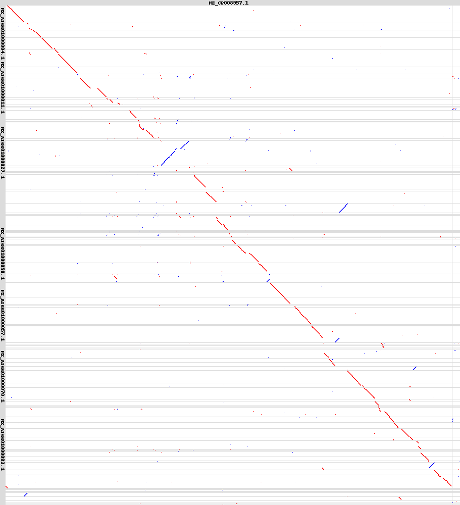

# Pyscaf is a genome scaffolding program that can scaffold assemblies based on synteny, long reads, and short reads.

Dependencies: Python 2.7,python FastaIndex, py-pillow, LAST assembler

### Load the dependencies and needed files
```bash
#Things needed to run pyscaf
git clone https://github.com/lpryszcz/pyScaf.git

module load python
module load py-fastaindex/0.11rc7-py2-sj3lhkk
module load last
module load py-pillow/3.2.0-py2-ods24od

#Need to be able to see what was done to each assembly also, so we need this.  
This perl script will give us quick access to pertinent assembly stats.
git clone https://github.com/ucdavis-bioinformatics/assemblathon2-analysis.git


#get the two genomes you want to scaffold.
## I am just using a couple of E. coli genomes, because they will be small and quick to demonstrate the process.
wget ftp://ftp.ncbi.nlm.nih.gov/genomes/all/GCF/000/249/815/GCF_000249815.1_ASM24981v2/GCF_000249815.1_ASM24981v2_genomic.fna.gz

wget ftp://ftp.ncbi.nlm.nih.gov/genomes/all/GCF/000/732/965/GCF_000732965.1_ASM73296v1/GCF_000732965.1_ASM73296v1_genomic.fna.gz

gunzip GCF_000249815.1_ASM24981v2_genomic.fna.gz
gunzip GCF_000732965.1_ASM73296v1_genomic.fna.gz

#pyscaf will throw errors with a fna extension, so change those to .fa
mv GCF_000249815.1_ASM24981v2_genomic.fna GCF_000249815.1_ASM24981v2_genomic.fa
mv GCF_000732965.1_ASM73296v1_genomic.fna GCF_000732965.1_ASM73296v1_genomic.fa
```

### Run pyscaf on the two E. coli genomes
```bash
module load python
module load py-fastaindex/0.11rc7-py2-sj3lhkk
module load last
module load py-pillow/3.2.0-py2-ods24od

 python pyScaf.py -f ../GCF_000249815.1_ASM24981v2_genomic.fa -t 16 --log ../E.coliPyscaf.output -r ../GCF_000732965.1_ASM73296v1_genomic.fa

#this analysis took 5 seconds!
```

### What are the changes in the genome stats?

```bash
cd /work/GIF/remkv6/USDA/16_pyscaf/assemblathon2-analysis
perl assemblathon_stats.pl ../GCF_000249815.1_ASM24981v2_genomic.fa
##############################################################################
---------------- Information for assembly '../GCF_000249815.1_ASM24981v2_genomic.fa' ----------------


                                         Number of scaffolds        100
                                     Total size of scaffolds    5371046
                                            Longest scaffold     306092
                                           Shortest scaffold        301
                                 Number of scaffolds > 1K nt         90  90.0%
                                Number of scaffolds > 10K nt         62  62.0%
                               Number of scaffolds > 100K nt         22  22.0%
                                 Number of scaffolds > 1M nt          0   0.0%
                                Number of scaffolds > 10M nt          0   0.0%
                                          Mean scaffold size      53710
                                        Median scaffold size      18594
                                         N50 scaffold length     133903
                                          L50 scaffold count         15
                                                 scaffold %A      24.72
                                                 scaffold %C      25.29
                                                 scaffold %G      25.33
                                                 scaffold %T      24.65
                                                 scaffold %N       0.00
                                         scaffold %non-ACGTN       0.00
                             Number of scaffold non-ACGTN nt          0

                Percentage of assembly in scaffolded contigs       0.0%
              Percentage of assembly in unscaffolded contigs     100.0%
                      Average number of contigs per scaffold        1.0
Average length of break (>25 Ns) between contigs in scaffold          0

                                           Number of contigs        100
                              Number of contigs in scaffolds          0
                          Number of contigs not in scaffolds        100
                                       Total size of contigs    5371046
                                              Longest contig     306092
                                             Shortest contig        301
                                   Number of contigs > 1K nt         90  90.0%
                                  Number of contigs > 10K nt         62  62.0%
                                 Number of contigs > 100K nt         22  22.0%
                                   Number of contigs > 1M nt          0   0.0%
                                  Number of contigs > 10M nt          0   0.0%
                                            Mean contig size      53710
                                          Median contig size      18594
                                           N50 contig length     133903
                                            L50 contig count         15
                                                   contig %A      24.72
                                                   contig %C      25.29
                                                   contig %G      25.33
                                                   contig %T      24.65
                                                   contig %N       0.00
                                           contig %non-ACGTN       0.00
                               Number of contig non-ACGTN nt          0
###############################################################################


 perl assemblathon_stats.pl ../scaffolds.fa
###############################################################################
---------------- Information for assembly '../scaffolds.fa' ----------------


                                         Number of scaffolds         61
                                     Total size of scaffolds    5545685
                                            Longest scaffold     707086
                                           Shortest scaffold        301
                                 Number of scaffolds > 1K nt         57  93.4%
                                Number of scaffolds > 10K nt         35  57.4%
                               Number of scaffolds > 100K nt         17  27.9%
                                 Number of scaffolds > 1M nt          0   0.0%
                                Number of scaffolds > 10M nt          0   0.0%
                                          Mean scaffold size      90913
                                        Median scaffold size      16148
                                         N50 scaffold length     256789
                                          L50 scaffold count          6
                                                 scaffold %A      23.81
                                                 scaffold %C      24.43
                                                 scaffold %G      24.38
                                                 scaffold %T      23.78
                                                 scaffold %N       3.61
                                         scaffold %non-ACGTN       0.00
                             Number of scaffold non-ACGTN nt          0

                Percentage of assembly in scaffolded contigs      63.5%
              Percentage of assembly in unscaffolded contigs      36.5%
                      Average number of contigs per scaffold        1.5
Average length of break (>25 Ns) between contigs in scaffold       6450

                                           Number of contigs         92
                              Number of contigs in scaffolds         40
                          Number of contigs not in scaffolds         52
                                       Total size of contigs    5345715
                                              Longest contig     428031
                                             Shortest contig        301
                                   Number of contigs > 1K nt         82  89.1%
                                  Number of contigs > 10K nt         55  59.8%
                                 Number of contigs > 100K nt         22  23.9%
                                   Number of contigs > 1M nt          0   0.0%
                                  Number of contigs > 10M nt          0   0.0%
                                            Mean contig size      58106
                                          Median contig size      17067
                                           N50 contig length     144532
                                            L50 contig count         12
                                                   contig %A      24.70
                                                   contig %C      25.34
                                                   contig %G      25.29
                                                   contig %T      24.67
                                                   contig %N       0.00
                                           contig %non-ACGTN       0.00
                               Number of contig non-ACGTN nt          0
##############################################################################

Pyscaf also provides a standard output log of what was scaffolded in a tsv file (scaffolds.fa.tsv).  Here is just what changed, not the entire output.
##############################################################################
# name  size    no. of contigs  ordered contigs contig orientations (0-forward; 1-reverse)      gap sizes (negative gap size = adjacent contigs are overlapping)
scaffold00001   256789  3       NZ_AIGG01000001.1 NZ_AIGG01000095.1 NZ_AIGG01000002.1   0 1 0   4665 51 0
scaffold00002   521794  4       NZ_AIGG01000004.1 NZ_AIGG01000005.1 NZ_AIGG01000006.1 NZ_AIGG01000008.1 0 0 0 0 8114 1201 2221 0
scaffold00003   16148   2       NZ_AIGG01000014.1 NZ_AIGG01000015.1     0 0     -3019 0
scaffold00004   562870  4       NZ_AIGG01000018.1 NZ_AIGG01000025.1 NZ_AIGG01000027.1 NZ_AIGG01000010.1 0 0 1 1 8969 -14857 8327 0
scaffold00005   69957   4       NZ_AIGG01000092.1 NZ_AIGG01000094.1 NZ_AIGG01000100.1 NZ_AIGG01000039.1 0 0 0 0 150 502 14358 0
scaffold00006   707086  5       NZ_AIGG01000045.1 NZ_AIGG01000050.1 NZ_AIGG01000051.1 NZ_AIGG01000053.1 NZ_AIGG01000054.1       0 0 0 0 0       29777 -15 37697 5 0
scaffold00007   227254  4       NZ_AIGG01000056.1 NZ_AIGG01000057.1 NZ_AIGG01000058.1 NZ_AIGG01000059.1 0 0 0 0 162 264 386 0
scaffold00008   76958   2       NZ_AIGG01000067.1 NZ_AIGG01000068.1     0 0     -5134 0
scaffold00009   577718  11      NZ_AIGG01000035.1 NZ_AIGG01000070.1 NZ_AIGG01000072.1 NZ_AIGG01000073.1 NZ_AIGG01000075.1 NZ_AIGG01000076.1 NZ_AIGG01000077.1 NZ_AIGG01000062.1 NZ_AIGG01000063.1 NZ_AIGG01000064.1 NZ_AIGG01000065.1   1 0 0 0 0 0 0 0 0 0 0   19075 1819 660 2012 146 182 43604 273 73 182 0
scaffold00010   355331  7       NZ_AIGG01000079.1 NZ_AIGG01000080.1 NZ_AIGG01000096.1 NZ_AIGG01000081.1 NZ_AIGG01000074.1 NZ_AIGG01000082.1 NZ_AIGG01000069.1   0 0 0 0 0 0 1   322 28 110 -348 -2 5278 0
scaffold00011   242324  4       NZ_AIGG01000086.1 NZ_AIGG01000087.1 NZ_AIGG01000089.1 NZ_AIGG01000090.1 0 0 1 0 28 9334 -1961 0

##############################################################################
```
There is also a nice dotplot output if there aren't too many scaffolds.


##  PyScaf also works on larger genomes rather quickly
Though genomes at the size of 1Gbp the scaffolding decreases in speed significantly. Here I'll scaffold a fragmented Arabidopsis genome assembly with a chromosome level Arabidopsis genome assembly.
### Get genomes
```
#here is  chromosome level assembly of arabidosis thaliana
wget ftp://ftp.ncbi.nlm.nih.gov/genomes/all/GCF/000/001/735/GCF_000001735.4_TAIR10.1/GCF_000001735.4_TAIR10.1_genomic.fna.gz

Here is an arabidopsis thaliana assembly that is in the thousands of scaffolds
wget ftp://ftp.ncbi.nlm.nih.gov/genomes/all/GCA/001/742/845/GCA_001742845.1_AthNd1_v1.0/GCA_001742845.1_AthNd1_v1.0_genomic.fna.gz

gunzip GCF_000001735.4_TAIR10.1_genomic.fna.gz
gunzip GCA_001742845.1_AthNd1_v1.0_genomic.fna.gz

#  fix the file extensions so they are fa, not fna

mv GCA_001742845.1_AthNd1_v1.0_genomic.fna GCA_001742845.1_AthNd1_v1.0_genomic.fa
mv GCF_000001735.4_TAIR10.1_genomic.fna GCF_000001735.4_TAIR10.1_genomic.fa

```
### Run pyscaf on arabidopsis genomes
```
#this took 21 minutes to finish using 16 processors.
python pyScaf.py -f ../01_Arabidopsis/GCA_001742845.1_AthNd1_v1.0_genomic.fa -t 16 --log ../01_Arabidopsis/ArabidopsisPyscaf.output -r ../01_Arabidopsis/GCF_000001735.4_TAIR10.1_genomic
.fa
```

### Output of pyscaf

```
#Assembly prior to scaffolding
perl assemblathon_stats.pl ../01_Arabidopsis/GCA_001742845.1_AthNd1_v1.0_genomic.fa

##############################################################################
---------------- Information for assembly '../01_Arabidopsis/GCA_001742845.1_AthNd1_v1.0_genomic.fa' ----------------


                                         Number of scaffolds       5197
                                     Total size of scaffolds  116846015
                                            Longest scaffold    2967516
                                           Shortest scaffold        500
                                 Number of scaffolds > 1K nt       2220  42.7%
                                Number of scaffolds > 10K nt        630  12.1%
                               Number of scaffolds > 100K nt        205   3.9%
                                 Number of scaffolds > 1M nt         26   0.5%
                                Number of scaffolds > 10M nt          0   0.0%
                                          Mean scaffold size      22483
                                        Median scaffold size        836
                                         N50 scaffold length     589639
                                          L50 scaffold count         49
                                                 scaffold %A      31.71
                                                 scaffold %C      17.79
                                                 scaffold %G      17.78
                                                 scaffold %T      31.67
                                                 scaffold %N       1.04
                                         scaffold %non-ACGTN       0.00
                             Number of scaffold non-ACGTN nt          0

                Percentage of assembly in scaffolded contigs      77.2%
              Percentage of assembly in unscaffolded contigs      22.8%
                      Average number of contigs per scaffold        1.2
Average length of break (>25 Ns) between contigs in scaffold       1468

                                           Number of contigs       6021
                              Number of contigs in scaffolds       1232
                          Number of contigs not in scaffolds       4789
                                       Total size of contigs  115635978
                                              Longest contig    2204473
                                             Shortest contig        285
                                   Number of contigs > 1K nt       2987  49.6%
                                  Number of contigs > 10K nt        853  14.2%
                                 Number of contigs > 100K nt        278   4.6%
                                   Number of contigs > 1M nt          8   0.1%
                                  Number of contigs > 10M nt          0   0.0%
                                            Mean contig size      19205
                                          Median contig size        985
                                           N50 contig length     263174
                                            L50 contig count        110
                                                   contig %A      32.04
                                                   contig %C      17.98
                                                   contig %G      17.97
                                                   contig %T      32.00
                                                   contig %N       0.01
                                           contig %non-ACGTN       0.00
                               Number of contig non-ACGTN nt          0

##############################################################################

perl assemblathon_stats.pl ../pyScaf/scaffolds.fa
##############################################################################
---------------- Information for assembly '../pyScaf/scaffolds.fa' ----------------


                                         Number of scaffolds       4863
                                     Total size of scaffolds  119654142
                                            Longest scaffold   22790922
                                           Shortest scaffold        500
                                 Number of scaffolds > 1K nt       1974  40.6%
                                Number of scaffolds > 10K nt        481   9.9%
                               Number of scaffolds > 100K nt        100   2.1%
                                 Number of scaffolds > 1M nt          6   0.1%
                                Number of scaffolds > 10M nt          5   0.1%
                                          Mean scaffold size      24605
                                        Median scaffold size        804
                                         N50 scaffold length   12441124
                                          L50 scaffold count          4
                                                 scaffold %A      29.87
                                                 scaffold %C      16.77
                                                 scaffold %G      16.75
                                                 scaffold %T      29.84
                                                 scaffold %N       6.77
                                         scaffold %non-ACGTN       0.00
                             Number of scaffold non-ACGTN nt          0

                Percentage of assembly in scaffolded contigs      88.3%
              Percentage of assembly in unscaffolded contigs      11.7%
                      Average number of contigs per scaffold        1.2
Average length of break (>25 Ns) between contigs in scaffold       7983

                                           Number of contigs       5876
                              Number of contigs in scaffolds       1329
                          Number of contigs not in scaffolds       4547
                                       Total size of contigs  111566809
                                              Longest contig    2394530
                                             Shortest contig        285
                                   Number of contigs > 1K nt       2884  49.1%
                                  Number of contigs > 10K nt        799  13.6%
                                 Number of contigs > 100K nt        257   4.4%
                                   Number of contigs > 1M nt         10   0.2%
                                  Number of contigs > 10M nt          0   0.0%
                                            Mean contig size      18987
                                          Median contig size        967
                                           N50 contig length     284383
                                            L50 contig count         96
                                                   contig %A      32.04
                                                   contig %C      17.98
                                                   contig %G      17.97
                                                   contig %T      32.00
                                                   contig %N       0.01
                                           contig %non-ACGTN       0.00
                               Number of contig non-ACGTN nt          0
##############################################################################

This time pyscaf was able to scaffold near ~350 scaffolds.  This may not sound incredible, but when using a chromosome level assembly for scaffolding, this can be tremendousl

##############################################################################
# name  size    no. of contigs  ordered contigs contig orientations (0-forward; 1-reverse)      gap sizes (negative gap size = adjacent contigs are overlapping)
scaffold00001   22790922        108     KV766200.1 KV766201.1 LXSY01000010.1 LXSY01000011.1 LXSY01000012.1 LXSY01000013.1 KV766202.1 LXSY01000021.1 LXSY01000022.1 LXSY01000023.1 LXSY01000027.1 LXSY01000028.1 KV766203.1 LXSY01000037.1 LXSY01000038.1 LXSY01000039.1 LXSY01000040.1 LXSY01000041.1 KV766205.1 KV766206.1 LXSY01000052.1 LXSY01000053.1 KV766207.1 LXSY01000066.1 LXSY01000067.1 LXSY01000068.1 KV766208.1 KV766209.1 LXSY01000080.1 LXSY01000081.1 LXSY01000082.1 LXSY01000083.1 KV766210.1 LXSY01000089.1 KV766211.1 KV766212.1 KV766213.1 LXSY01000103.1 LXSY01000104.1 LXSY01000105.1 LXSY01000106.1 KV766214.1 KV766215.1 KV766217.1 LXSY01000134.1 LXSY01000135.1 KV766218.1 LXSY01000141.1 LXSY01000142.1 LXSY01000143.1 LXSY01000144.1 LXSY01000145.1 LXSY01000146.1 KV766219.1 LXSY01000154.1 KV766220.1 LXSY01000165.1 LXSY01000166.1 LXSY01000167.1 LXSY01000168.1 LXSY01000170.1 LXSY01000171.1 LXSY01000172.1 KV766240.1 KV766256.1 LXSY01001087.1 KV766281.1 LXSY01001187.1 KV766282.1 KV766286.1 LXSY01001256.1 LXSY01001257.1 LXSY01001258.1 LXSY01001259.1 LXSY01001270.1 LXSY01001272.1 LXSY01001273.1 KV766289.1 KV766290.1 KV766291.1 LXSY01001312.1 LXSY01001313.1 KV766292.1 LXSY01001318.1 LXSY01001319.1 LXSY01001326.1 KV766295.1 KV766296.1 LXSY01001356.1 KV766298.1 LXSY01001372.1 LXSY01001374.1 KV766299.1 LXSY01001384.1 LXSY01001385.1 LXSY01001386.1 KV766300.1 KV766301.1 LXSY01001418.1 LXSY01001419.1 LXSY01001420.1 LXSY01001421.1 LXSY01001422.1 KV766302.1 LXSY01001435.1 LXSY01001436.1 LXSY01001437.1 KV766303.1     0 0 0 0 0 0 0 0 0 0 0 0 0 0 0 0 0 0 0 0 0 0 0 0 0 0 0 0 0 0 0 0 0 0 0 0 0 0 0 0 0 0 0 0 0 0 0 0 0 0 0 0 0 0 0 0 0 0 0 0 0 0 0 0 0 0 0 0 0 0 0 0 0 0 0 0 0 0 0 0 0 0 0 0 0 0 0 0 0 0 0 0 0 0 0 0 0 0 0 0 0 0 0 0 0 0 0 0 -5 116 240 4 3 11337 3 208 -3569 -1356 4 -18 -73 -15 -12 283 -12 2213 1 509 315 716 -533 4 5 -11 -12 -104 66 4980 211 -39 -16 1879 -4 20 123 51 -2 1753 -4 3894 -30446 20493 694 98 -5 -9 16 63 -27 -372 49 468 379 2100 -425 436 -703 2733 5 879 734063 -1699 24576 298 644 7423 -5356 -49450 -5 11048 109 6 5 47 -221 -124168 -519806 -23 -8 48 632 6 39965 201635 21 1130 -380 -4688 -1899 571 2124 -16 -104 -337916 -7495 2502 -17 30 2455 803 375 -3 637 340 1189 0
scaffold00002   16660361        81      KV766583.1 LXSY01004999.1 LXSY01005000.1 KV766584.1 LXSY01005006.1 LXSY01005007.1 KV766585.1 LXSY01005019.1 KV766586.1 KV766587.1 KV766589.1 KV766592.1 KV766593.1 LXSY01005104.1 LXSY01005110.1 LXSY01005111.1 LXSY01005113.1 LXSY01005115.1 LXSY01005401.1 LXSY01005402.1 LXSY01005404.1 LXSY01005407.1 LXSY01005408.1 LXSY01005412.1 LXSY01005414.1 LXSY01005415.1 LXSY01005419.1 LXSY01005423.1 KV766625.1 LXSY01005431.1 LXSY01005432.1 LXSY01005437.1 LXSY01005462.1 LXSY01005441.1 KV766624.1 LXSY01005485.1 LXSY01005491.1 LXSY01005492.1 LXSY01005494.1 LXSY01003304.1 LXSY01004332.1 LXSY01005516.1 LXSY01005518.1 LXSY01005538.1 LXSY01003103.1 LXSY01005457.1 LXSY01005546.1 LXSY01005547.1 LXSY01005549.1 KV766631.1 LXSY01005600.1 LXSY01005602.1 LXSY01005612.1 LXSY01005613.1 KV766633.1 LXSY01005614.1 LXSY01005615.1 LXSY01005616.1 LXSY01005617.1 LXSY01005620.1 LXSY01005623.1 LXSY01005626.1 LXSY01005627.1 LXSY01005660.1 KV766636.1 LXSY01005761.1 KV766672.1 LXSY01006146.1 KV766686.1 KV766687.1 LXSY01006159.1 LXSY01006160.1 KV766688.1 LXSY01006178.1 LXSY01006179.1 LXSY01006180.1 KV766689.1 KV766691.1 KV766693.1 KV766694.1 KV766695.1  0 0 0 0 0 0 0 0 0 0 0 0 0 0 0 0 0 0 0 0 0 0 0 0 0 0 0 0 0 0 0 0 0 0 0 0 0 0 0 0 1 0 0 0 0 1 0 0 0 0 0 0 0 0 0 0 0 0 0 0 0 0 0 0 0 0 0 0 0 0 0 0 0 0 0 0 0 0 0 0 0       656 18 1926 420 217 37 73 296 -906204 -49418 75872 169 65282 16130 252 34425 4912 404287 956 3669 19 1 7247 1470 89 15425 175 -413 -456 -467 -362 -331 1393 272 -93 -257 -380 1417 -727 -836 -182 1937 761 -103 -318 1970 3077 8389 913 6936 6371 38416 2 1132 1152 -360 425 -1031 142 566 1228 -17 -231 2058 405485 -277297 904536 -6 78 74 78 310 -17 3077 -17 260 -469413 -409 1559 700 0
scaffold00003   15040960        43      KV766389.1 KV766390.1 KV766391.1 KV766392.1 LXSY01002537.1 LXSY01002538.1 LXSY01002539.1 KV766393.1 KV766394.1 KV766395.1 KV766396.1 KV766397.1 LXSY01002587.1 LXSY01002588.1 KV766398.1 LXSY01002597.1 KV766399.1 KV766400.1 LXSY01002623.1 KV766462.1 LXSY01003591.1 LXSY01003592.1 KV766472.1 LXSY01003597.1 LXSY01003598.1 LXSY01003599.1 LXSY01003600.1 LXSY01003601.1 KV766475.1 LXSY01003643.1 KV766480.1 KV766483.1 KV766485.1 LXSY01003682.1 LXSY01003683.1 LXSY01003684.1 LXSY01003685.1 LXSY01003686.1 KV766486.1 KV766488.1 KV766489.1 KV766490.1 KV766491.1        0 0 0 0 0 0 0 0 0 0 0 0 0 0 0 0 0 0 0 0 0 0 0 0 0 0 0 0 0 0 0 0 0 0 0 0 0 0 0 0 0 0 0   -2341 100 1595 600 191 135 69 -5541 -67354 26 -639 1412 5076 298 1819 12346 1662 5098 1118312 109538 37782 11 151713 95 59802 3544 55494 70480 88913 7 -106105 -519006 -11 1345 289 329 432 1462 40591 -10 285 0 0
scaffold00004   12441124        45      LXSY01001453.1 LXSY01001454.1 LXSY01001455.1 LXSY01001456.1 LXSY01001621.1 LXSY01001462.1 LXSY01001466.1 KV766304.1 LXSY01001471.1 LXSY01001472.1 LXSY01001473.1 LXSY01001474.1 KV766305.1 LXSY01001480.1 KV766306.1 KV766312.1 LXSY01002297.1 LXSY01002311.1 LXSY01002312.1 LXSY01002313.1 KV766374.1 LXSY01002317.1 KV766375.1 KV766378.1 KV766381.1 KV766382.1 LXSY01002408.1 LXSY01002409.1 LXSY01002410.1 LXSY01002411.1 LXSY01002412.1 KV766383.1 LXSY01002420.1 KV766384.1 LXSY01002425.1 KV766385.1 LXSY01002431.1 LXSY01002432.1 KV766386.1 KV766387.1 LXSY01002468.1 LXSY01002469.1 LXSY01002470.1 LXSY01002471.1 KV766388.1  0 0 0 0 0 0 0 0 0 0 0 0 0 0 0 0 0 0 0 0 0 0 0 0 0 0 0 0 0 0 0 0 0 0 0 0 0 0 0 0 0 0 0 0 0       1983 1935 -17 942 12633 7088 2984 136 288 458 353 279 251 148 -9798 153219 467493 5131 -9 1339 -16 77 -318956 285834 -296801 -185 201 606 441 -15 -17 4066 1046 202 1274 170 170 318 545 185 1281 1367 309 309 0
scaffold00005   12054261        62      KV766492.1 KV766494.1 LXSY01004106.1 LXSY01004111.1 LXSY01004113.1 LXSY01004114.1 KV766638.1 LXSY01004116.1 LXSY01004117.1 LXSY01004118.1 LXSY01004121.1 LXSY01004129.1 KV766517.1 LXSY01004132.1 LXSY01004133.1 LXSY01004134.1 LXSY01004135.1 KV766518.1 KV766543.1 LXSY01004733.1 LXSY01004798.1 LXSY01004799.1 LXSY01004800.1 LXSY01004801.1 LXSY01004802.1 LXSY01004803.1 KV766559.1 KV766562.1 LXSY01004845.1 KV766563.1 LXSY01004854.1 KV766565.1 KV766566.1 KV766567.1 KV766568.1 KV766570.1 LXSY01004893.1 KV766571.1 KV766572.1 LXSY01004905.1 LXSY01004906.1 LXSY01004908.1 KV766573.1 KV766574.1 LXSY01004919.1 LXSY01004920.1 KV766575.1 LXSY01004925.1 KV766576.1 LXSY01004928.1 KV766577.1 LXSY01004933.1 LXSY01004934.1 LXSY01004935.1 LXSY01004937.1 LXSY01004939.1 KV766578.1 LXSY01004947.1 KV766579.1 LXSY01004964.1 KV766582.1 LXSY01004990.1       0 0 0 0 0 0 1 0 0 0 0 0 0 0 0 0 0 0 0 0 0 0 0 0 0 0 0 0 0 0 0 0 0 0 0 0 0 0 0 0 0 0 0 0 0 0 0 0 0 0 0 0 0 0 0 0 0 0 0 0 0 0     546842 -2099 4955 233 -171 -402 -411 -588 171 340 23250 3763 715 -170 4185 1059 2304 -16066 776 202411 3243 537 237 3491 -1 204133 -61959 1017 -7 19467 161 40 3 665 -170610 366 1062 1741 -34 585 105 917 -32640 -335 5442 -3 -61 -35 -13 194 -980 2203 41 470 2969 4568 19 -8 372 666 862 0
###############################################################################

So 108 scaffolds put into chromosome 1, 81 into chromosome 2, 43 into chromosome 3, 45 into chromosome 4, 62 into chromosome 5.

#unfortunately too many scaffolds to show in the dotplot, but a figure can be drawn by removing some of the small un-scaffoldable scaffolds from the assembly prior to running pyscaf.
```


---

* [Back to the Assembly and Annotation Index page](../GenomeAnnotation/annotation_and_assembly_index.md)
