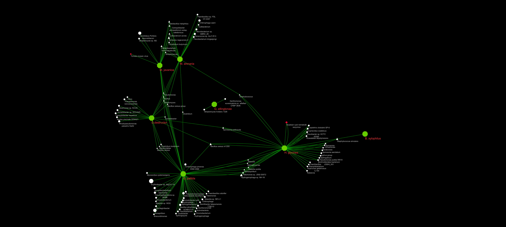

#  Here I will try to see what kind of bacteria and viruses lie within the Tylenchida nematode RNAseq using kraken2.


## Build appropriate kraken2 database
```
#/work/GIF/remkv6/USDA/21_kraken

#softlink the fastq
mkdir fastq
for f in ../../../Baum/05_738NewAnalyses/04_NewRNAseqOnlineAlignment4Jbrowse/01_trim/*fastq.gz; do ln -s $f;done


#download taxonomy data from ncbi
module load GIF/kraken2
#kraken2-build --download-taxonomy --db PlantViral
#This should have worked, but NCBI removed a couple files from their ftp site (est and gss)
Had to modify the download_taxonomy.sh script to skip downloading these files.


vi download_taxonomy.sh
########
Changed from
TAXONOMY_DIR="$KRAKEN2_DB_NAME/taxonomy"
if [ -z "$KRAKEN2_PROTEIN_DB" ]

To
for subsection in gb wgs
if [ -z "Viral" ]
########
sh download_taxonomy.sh
```

#### To add your genomes to the kraken database, you will have to look up the taxonomy ID and add this to each fasta header. i.e. (>sequence"|kraken:taxid|390850)
```
I found the taxids here: https://www.ncbi.nlm.nih.gov/Taxonomy/Browser/wwwtax.cgi
bioawk -c fastx '{print ">"$name"|kraken:taxid|6326\n"$seq}' B.xylophilus.fa >B.xylophilusTax.fa
bioawk -c fastx '{print ">"$name"|kraken:taxid|166010\n"$seq}' D.destructor.fa >D.destructorTax.fa
bioawk -c fastx '{print ">"$name"|kraken:taxid|166011\n"$seq}' D.dipsaci.fa >D.dipsaciTax.fa
bioawk -c fastx '{print ">"$name"|kraken:taxid|1517492\n"$seq}' G.ellingtonae.fa >G.ellingtonaeTax.fa
bioawk -c fastx '{print ">"$name"|kraken:taxid|36090\n"$seq}' G.pallida.fa >G.pallidaTax.fa
bioawk -c fastx '{print ">"$name"|kraken:taxid|31243\n"$seq}' G.rostochiensis.fa >G.rostochiensisTax.fa
bioawk -c fastx '{print ">"$name"|kraken:taxid|6304\n"$seq}' M.arenaria.fa >M.arenariaTax.fa
bioawk -c fastx '{print ">"$name"|kraken:taxid|390850\n"$seq}' M.enterolobii.fa >M.enterolobiiTax.fa
bioawk -c fastx '{print ">"$name"|kraken:taxid|298850\n"$seq}' M.floridensis.fa >M.floridensisTax.fa
bioawk -c fastx '{print ">"$name"|kraken:taxid|189291\n"$seq}' M.graminicola.fa >M.graminicolaTax.fa
bioawk -c fastx '{print ">"$name"|kraken:taxid|6305\n"$seq}' M.hapla.fa >M.haplaTax.fa
bioawk -c fastx '{print ">"$name"|kraken:taxid|6306\n"$seq}' M.incognita.fa >M.incognitaTax.fa
bioawk -c fastx '{print ">"$name"|kraken:taxid|6303\n"$seq}' M.javanica.fa >M.javanicaTax.fa
bioawk -c fastx '{print ">"$name"kraken:taxid|51029\n"$seq}' H.glycines.fa >H.glycinesTax.fa

```

### We are now ready to set the database to download and build
```
module use /work/GIF/software/modules
module load GIF/kraken2
module load blast-plus
kraken2-build --download-library viral --db NematodeViral
kraken2-build --download-library bacteria --db NematodeViral
kraken2-build --add-to-library B.xylophilusTax.fa -db NematodeViral
kraken2-build --add-to-library D.destructorTax.fa -db NematodeViral
kraken2-build --add-to-library D.dipsaciTax.fa -db NematodeViral
kraken2-build --add-to-library G.ellingtonaeTax.fa -db NematodeViral
kraken2-build --add-to-library G.pallidaTax.fa -db NematodeViral
kraken2-build --add-to-library G.rostochiensisTax.fa -db NematodeViral
kraken2-build --add-to-library H.glycinesTax.fa -db NematodeViral
kraken2-build --add-to-library M.arenariaTax.fa -db NematodeViral
kraken2-build --add-to-library M.enterolobiiTax.fa -db NematodeViral
kraken2-build --add-to-library M.floridensisTax.fa -db NematodeViral
kraken2-build --add-to-library M.graminicolaTax.fa -db NematodeViral
kraken2-build --add-to-library M.haplaTax.fa -db NematodeViral
kraken2-build --add-to-library M.incognitaTax.fa -db NematodeViral
kraken2-build --add-to-library M.javanicaTax.fa -db NematodeViral
kraken2-build --build --db NematodeViral --threads 16

#this took 5:26:32 on an hpc with 16 threads and 128GB ram.  
```

## Download RNASEQ samples
```
module load sra-toolkit
fastq-dump --outdir 04_DownloadedRNAseq/ --gzip --split-files SRR3162514 #Globodera ellingtonae
fastq-dump --outdir 04_DownloadedRNAseq/ --gzip --split-files SRR7775195 #Globodera pallida
fastq-dump --outdir 04_DownloadedRNAseq/ --gzip --split-files ERR202492 #Globodera pallida
fastq-dump --outdir 04_DownloadedRNAseq/ --gzip --split-files ERR202487 #Globodera rostochiensis
fastq-dump --outdir 04_DownloadedRNAseq/ --gzip --split-files SRR7943144 #Ditylenchus destructor
fastq-dump --outdir 04_DownloadedRNAseq/ --gzip --split-files DRR141214 #Bursaphelenchus xylophilus
fastq-dump --outdir 04_DownloadedRNAseq/ --gzip --split-files ERR790020 # Meloidogyne javanica
fastq-dump --outdir 04_DownloadedRNAseq/ --gzip --split-files SRR8691582 #Meloidogyne incognita
fastq-dump --outdir 04_DownloadedRNAseq/ --gzip --split-files SRR2389452 #Meloidogyne graminicola
fastq-dump --outdir 04_DownloadedRNAseq/ --gzip --split-files ERR790021 #Meloidogyne arenaria
fastq-dump --outdir 04_DownloadedRNAseq/ --gzip --split-files SRR6269845 #Heterodera glycines
fastq-dump --outdir 04_DownloadedRNAseq/ --gzip --split-files SRR6269844 & #Heterodera glycines
```

### Create Kraken scripts
```
paste <(ls -1 05_MattsReads/*_1*gz) <(ls -1 05_MattsReads/*_1*gz) |while read line; do echo "kraken2 -db NematodeViral --threads 16 --report "$line".report --gzip-compressed  --unclassified-out "${line%.*}"unclassified#.fq --classified-out "${line%.*}"classified#.fq --paired "$line" > "${line%.*} ;done |awk '{print $1,$2,$3,$4,$5,$6,$8,$9,$10,$12,$13,$15,$16,$17,$18,$19,$21".Kraken.out"}' >kraken.sh


#kraken.sh
##############################################################################################################################################################################
kraken2 -db NematodeViral --threads 16 --report 04_DownloadedRNAseq/DRR141214_2.fastq.gz.report --gzip-compressed --unclassified-out 04_DownloadedRNAseq/DRR141214_2.fastqunclassified#.fq --classified-out 04_DownloadedRNAseq/DRR141214_2.fastqclassified#.fq --paired 04_DownloadedRNAseq/DRR141214_1.fastq.gz 04_DownloadedRNAseq/DRR141214_2.fastq.gz > 04_DownloadedRNAseq/DRR141214_2.fastq.Kraken.out
kraken2 -db NematodeViral --threads 16 --report 04_DownloadedRNAseq/ERR202487_2.fastq.gz.report --gzip-compressed --unclassified-out 04_DownloadedRNAseq/ERR202487_2.fastqunclassified#.fq --classified-out 04_DownloadedRNAseq/ERR202487_2.fastqclassified#.fq --paired 04_DownloadedRNAseq/ERR202487_1.fastq.gz 04_DownloadedRNAseq/ERR202487_2.fastq.gz > 04_DownloadedRNAseq/ERR202487_2.fastq.Kraken.out
kraken2 -db NematodeViral --threads 16 --report 04_DownloadedRNAseq/ERR202492_2.fastq.gz.report --gzip-compressed --unclassified-out 04_DownloadedRNAseq/ERR202492_2.fastqunclassified#.fq --classified-out 04_DownloadedRNAseq/ERR202492_2.fastqclassified#.fq --paired 04_DownloadedRNAseq/ERR202492_1.fastq.gz 04_DownloadedRNAseq/ERR202492_2.fastq.gz > 04_DownloadedRNAseq/ERR202492_2.fastq.Kraken.out
kraken2 -db NematodeViral --threads 16 --report 04_DownloadedRNAseq/ERR790020_2.fastq.gz.report --gzip-compressed --unclassified-out 04_DownloadedRNAseq/ERR790020_2.fastqunclassified#.fq --classified-out 04_DownloadedRNAseq/ERR790020_2.fastqclassified#.fq --paired 04_DownloadedRNAseq/ERR790020_1.fastq.gz 04_DownloadedRNAseq/ERR790020_2.fastq.gz > 04_DownloadedRNAseq/ERR790020_2.fastq.Kraken.out
kraken2 -db NematodeViral --threads 16 --report 04_DownloadedRNAseq/SRR3162514_2.fastq.gz.report --gzip-compressed --unclassified-out 04_DownloadedRNAseq/SRR3162514_2.fastqunclassified#.fq --classified-out 04_DownloadedRNAseq/SRR3162514_2.fastqclassified#.fq --paired 04_DownloadedRNAseq/SRR3162514_1.fastq.gz 04_DownloadedRNAseq/SRR3162514_2.fastq.gz > 04_DownloadedRNAseq/SRR3162514_2.fastq.Kraken.out
kraken2 -db NematodeViral --threads 16 --report 04_DownloadedRNAseq/SRR7775195_2.fastq.gz.report --gzip-compressed --unclassified-out 04_DownloadedRNAseq/SRR7775195_2.fastqunclassified#.fq --classified-out 04_DownloadedRNAseq/SRR7775195_2.fastqclassified#.fq --paired 04_DownloadedRNAseq/SRR7775195_1.fastq.gz 04_DownloadedRNAseq/SRR7775195_2.fastq.gz > 04_DownloadedRNAseq/SRR7775195_2.fastq.Kraken.out
kraken2 -db NematodeViral --threads 16 --report 04_DownloadedRNAseq/SRR7943144_2.fastq.gz.report --gzip-compressed --unclassified-out 04_DownloadedRNAseq/SRR7943144_2.fastqunclassified#.fq --classified-out 04_DownloadedRNAseq/SRR7943144_2.fastqclassified#.fq --paired 04_DownloadedRNAseq/SRR7943144_1.fastq.gz 04_DownloadedRNAseq/SRR7943144_2.fastq.gz > 04_DownloadedRNAseq/SRR7943144_2.fastq.Kraken.out
kraken2 -db NematodeViral --threads 16 --report 04_DownloadedRNAseq/SRR7943144_2_val_2.fq.gz.report --gzip-compressed --unclassified-out 04_DownloadedRNAseq/SRR7943144_2_val_2.fqunclassified#.fq --classified-out 04_DownloadedRNAseq/SRR7943144_2_val_2.fqclassified#.fq --paired 04_DownloadedRNAseq/SRR7943144_1_val_1.fq.gz 04_DownloadedRNAseq/SRR7943144_2_val_2.fq.gz > 04_DownloadedRNAseq/SRR7943144_2_val_2.fq.Kraken.out
kraken2 -db NematodeViral --threads 16 --report 04_DownloadedRNAseq/DRR141214_2.fastq.gz.report --gzip-compressed --unclassified-out 04_DownloadedRNAseq/DRR141214_2.fastqunclassified#.fq --classified-out 04_DownloadedRNAseq/DRR141214_2.fastqclassified#.fq --paired 04_DownloadedRNAseq/DRR141214_1.fastq.gz 04_DownloadedRNAseq/DRR141214_2.fastq.gz > 04_DownloadedRNAseq/DRR141214_2.fastq.Kraken.out
kraken2 -db NematodeViral --threads 16 --report 04_DownloadedRNAseq/ERR202487_2.fastq.gz.report --gzip-compressed --unclassified-out 04_DownloadedRNAseq/ERR202487_2.fastqunclassified#.fq --classified-out 04_DownloadedRNAseq/ERR202487_2.fastqclassified#.fq --paired 04_DownloadedRNAseq/ERR202487_1.fastq.gz 04_DownloadedRNAseq/ERR202487_2.fastq.gz > 04_DownloadedRNAseq/ERR202487_2.fastq.Kraken.out
kraken2 -db NematodeViral --threads 16 --report 04_DownloadedRNAseq/ERR202492_2.fastq.gz.report --gzip-compressed --unclassified-out 04_DownloadedRNAseq/ERR202492_2.fastqunclassified#.fq --classified-out 04_DownloadedRNAseq/ERR202492_2.fastqclassified#.fq --paired 04_DownloadedRNAseq/ERR202492_1.fastq.gz 04_DownloadedRNAseq/ERR202492_2.fastq.gz > 04_DownloadedRNAseq/ERR202492_2.fastq.Kraken.out
kraken2 -db NematodeViral --threads 16 --report 04_DownloadedRNAseq/ERR790020_2.fastq.gz.report --gzip-compressed --unclassified-out 04_DownloadedRNAseq/ERR790020_2.fastqunclassified#.fq --classified-out 04_DownloadedRNAseq/ERR790020_2.fastqclassified#.fq --paired 04_DownloadedRNAseq/ERR790020_1.fastq.gz 04_DownloadedRNAseq/ERR790020_2.fastq.gz > 04_DownloadedRNAseq/ERR790020_2.fastq.Kraken.out
kraken2 -db NematodeViral --threads 16 --report 04_DownloadedRNAseq/SRR3162514_2.fastq.gz.report --gzip-compressed --unclassified-out 04_DownloadedRNAseq/SRR3162514_2.fastqunclassified#.fq --classified-out 04_DownloadedRNAseq/SRR3162514_2.fastqclassified#.fq --paired 04_DownloadedRNAseq/SRR3162514_1.fastq.gz 04_DownloadedRNAseq/SRR3162514_2.fastq.gz > 04_DownloadedRNAseq/SRR3162514_2.fastq.Kraken.out
kraken2 -db NematodeViral --threads 16 --report 04_DownloadedRNAseq/SRR7775195_2.fastq.gz.report --gzip-compressed --unclassified-out 04_DownloadedRNAseq/SRR7775195_2.fastqunclassified#.fq --classified-out 04_DownloadedRNAseq/SRR7775195_2.fastqclassified#.fq --paired 04_DownloadedRNAseq/SRR7775195_1.fastq.gz 04_DownloadedRNAseq/SRR7775195_2.fastq.gz > 04_DownloadedRNAseq/SRR7775195_2.fastq.Kraken.out
kraken2 -db NematodeViral --threads 16 --report 04_DownloadedRNAseq/SRR7943144_2.fastq.gz.report --gzip-compressed --unclassified-out 04_DownloadedRNAseq/SRR7943144_2.fastqunclassified#.fq --classified-out 04_DownloadedRNAseq/SRR7943144_2.fastqclassified#.fq --paired 04_DownloadedRNAseq/SRR7943144_1.fastq.gz 04_DownloadedRNAseq/SRR7943144_2.fastq.gz > 04_DownloadedRNAseq/SRR7943144_2.fastq.Kraken.out
etc...
################################################################################################################################################################################add the correct modules and submit to hpc node

module use /work/GIF/software/modules
module load GIF/kraken2
module load perl
```

### Summarize kraken data output
```
#generates list of only those with .01% of reads and removed nematodes from the report

for f in *report; do echo "awk '\$1>0 && \$3>10' "$f" |uniq|sort -k1,1nr |grep -v \"Meloidogyne\" |grep -v \"Heterodera\" |grep -v \"Globodera\" |grep -v \"Bursaphelenchus\" |grep -v \"Ditylenchus\" >"$f".summary" ;done >summarizer.sh
sh summarizer.sh


I took these files, added the species name to the fifth column, removed those entries that had fewer than 100 reads allocated, kept only genera, species, and subspecies, and then concatenated all files for a network in cytoscape.
```
### Summarized output from all samples
| Proportion of reads | Reads rooted to taxon clade | taxon-specific reads | rank code | Taxid   | Taxon                                            | Source Species | SRA        |
|---------------------|-----------------------------|----------------------|-----------|---------|--------------------------------------------------|----------------|------------|
| 99.18               | 23932404                    | 831                  | O2        | 33283   | Tylenchomorpha                                   | B. xylophilus  | DRR1414214 |
| 0.69                | 166444                      | 166444               | U         | 0       | unclassified                                     | B. xylophilus  | DRR1414214 |
| 0.13                | 30825                       | 357                  | D         | 2       | Bacteria                                         | B. xylophilus  | DRR1414214 |
| 0.08                | 18597                       | 235                  | D1        | 1783272 | Terrabacteria group                              | B. xylophilus  | DRR1414214 |
| 0.07                | 16925                       | 16925                | S         | 1286    | Staphylococcus simulans                          | B. xylophilus  | DRR1414214 |
| 0.07                | 16992                       | 30                   | G         | 1279    | Staphylococcus                                   | B. xylophilus  | DRR1414214 |
| 0.05                | 11743                       | 519                  | P         | 1224    | Proteobacteria                                   | B. xylophilus  | DRR1414214 |
| 0.04                | 9035                        | 446                  | C         | 1236    | Gammaproteobacteria                              | B. xylophilus  | DRR1414214 |
| 0.03                | 7195                        | 7195                 | S2        | 1365647 | Xanthomonas euvesicatoria pv. alfalfae CFBP 3836 | B. xylophilus  | DRR1414214 |

| Proportion of reads | Reads rooted to taxon clade | taxon-specific reads | rank code | Taxid   | Taxon               | Source Species   | SRA       |
|---------------------|-----------------------------|----------------------|-----------|---------|---------------------|------------------|-----------|
| 98.46               | 28153971                    | 832                  | O2        | 33283   | Tylenchomorpha      | G. rostochiensis | ERR202487 |
| 98.45               | 28151761                    | 5340                 | O3        | 33284   | Tylenchoidea        | G. rostochiensis | ERR202487 |
| 98.41               | 28139651                    | 173770               | F1        | 33286   | Heteroderinae       | G. rostochiensis | ERR202487 |
| 1.5                 | 429425                      | 429425               | U         | 0       | unclassified        | G. rostochiensis | ERR202487 |
| 0.03                | 9513                        | 516                  | D         | 2       | Bacteria            | G. rostochiensis | ERR202487 |
| 0.01                | 1748                        | 38                   | C         | 1236    | Gammaproteobacteria | G. rostochiensis | ERR202487 |
| 0.01                | 3266                        | 12                   | D1        | 1783272 | Terrabacteria group | G. rostochiensis | ERR202487 |
| 0.01                | 4116                        | 151                  | P         | 1224    | Proteobacteria      | G. rostochiensis | ERR202487 |

| Proportion of reads | Reads rooted to taxon clade | taxon-specific reads | rank code | Taxid | Taxon               | Source Species | SRA       |
|---------------------|-----------------------------|----------------------|-----------|-------|---------------------|----------------|-----------|
| 99.22               | 30582562                    | 2151                 | O3        | 33284 | Tylenchoidea        | G. pallida     | ERR202492 |
| 99.22               | 30583755                    | 507                  | O2        | 33283 | Tylenchomorpha      | G. pallida     | ERR202492 |
| 99.21               | 30578964                    | 71917                | F1        | 33286 | Heteroderinae       | G. pallida     | ERR202492 |
| 0.74                | 228813                      | 228813               | U         | 0     | unclassified        | G. pallida     | ERR202492 |
| 0.03                | 9354                        | 252                  | D         | 2     | Bacteria            | G. pallida     | ERR202492 |
| 0.02                | 5572                        | 282                  | P         | 1224  | Proteobacteria      | G. pallida     | ERR202492 |
| 0.01                | 1836                        | 402                  | F         | 75682 | Oxalobacteraceae    | G. pallida     | ERR202492 |
| 0.01                | 1942                        | 115                  | C         | 1236  | Gammaproteobacteria | G. pallida     | ERR202492 |
| 0.01                | 2323                        | 155                  | O         | 80840 | Burkholderiales     | G. pallida     | ERR202492 |
| 0.01                | 2458                        | 86                   | C         | 28216 | Betaproteobacteria  | G. pallida     | ERR202492 |

| Proportion of reads | Reads rooted to taxon clade | taxon-specific reads | rank code | Taxid   | Taxon                                          | Source Species | SRA       |
|---------------------|-----------------------------|----------------------|-----------|---------|------------------------------------------------|----------------|-----------|
| 85.23               | 26295871                    | 631                  | O2        | 33283   | Tylenchomorpha                                 | M. javanica    | ERR790020 |
| 85.18               | 26278729                    | 985                  | O3        | 33284   | Tylenchoidea                                   | M. javanica    | ERR790020 |
| 14.28               | 4404990                     | 4404990              | U         | 0       | unclassified                                   | M. javanica    | ERR790020 |
| 0.45                | 138563                      | 1002                 | D         | 2       | Bacteria                                       | M. javanica    | ERR790020 |
| 0.26                | 78919                       | 125                  | D1        | 1783272 | Terrabacteria group                            | M. javanica    | ERR790020 |
| 0.21                | 63936                       | 55                   | P         | 1239    | Firmicutes                                     | M. javanica    | ERR790020 |
| 0.14                | 43539                       | 34                   | F         | 186817  | Bacillaceae                                    | M. javanica    | ERR790020 |
| 0.13                | 39433                       | 488                  | P         | 1224    | Proteobacteria                                 | M. javanica    | ERR790020 |
| 0.12                | 36797                       | 35836                | G1        | 86661   | Bacillus cereus group                          | M. javanica    | ERR790020 |
| 0.12                | 37775                       | 142                  | G         | 1386    | Bacillus                                       | M. javanica    | ERR790020 |
| 0.09                | 27321                       | 122                  | C         | 1236    | Gammaproteobacteria                            | M. javanica    | ERR790020 |
| 0.04                | 10990                       | 83                   | C         | 1760    | Actinobacteria                                 | M. javanica    | ERR790020 |
| 0.04                | 11634                       | 11634                | S         | 91844   | Candidatus Portiera aleyrodidarum              | M. javanica    | ERR790020 |
| 0.03                | 8041                        | 65                   | F1        | 33286   | Heteroderinae                                  | M. javanica    | ERR790020 |
| 0.02                | 4727                        | 24                   | O         | 91347   | Enterobacterales                               | M. javanica    | ERR790020 |
| 0.02                | 5469                        | 5469                 | S         | 1570    | Halobacillus halophilus                        | M. javanica    | ERR790020 |
| 0.02                | 5554                        | 22                   | F         | 49546   | Flavobacteriaceae                              | M. javanica    | ERR790020 |
| 0.02                | 5763                        | 5763                 | S         | 51515   | Dehalobacterium formicoaceticum                | M. javanica    | ERR790020 |
| 0.02                | 6065                        | 67                   | G         | 1485    | Clostridium                                    | M. javanica    | ERR790020 |
| 0.02                | 7553                        | 7553                 | S1        | 331113  | Simkania negevensis Z                          | M. javanica    | ERR790020 |
| 0.01                | 1851                        | 22                   | G         | 237     | Flavobacterium                                 | M. javanica    | ERR790020 |
| 0.01                | 1903                        | 22                   | F         | 85023   | Microbacteriaceae                              | M. javanica    | ERR790020 |
| 0.01                | 1994                        | 16                   | P         | 1117    | Cyanobacteria                                  | M. javanica    | ERR790020 |
| 0.01                | 2120                        | 218                  | G         | 286     | Pseudomonas                                    | M. javanica    | ERR790020 |
| 0.01                | 2191                        | 2171                 | S         | 1747    | Cutibacterium acnes                            | M. javanica    | ERR790020 |
| 0.01                | 2198                        | 2198                 | S         | 12253   | Tomato mosaic virus                            | M. javanica    | ERR790020 |
| 0.01                | 2278                        | 24                   | G         | 1912216 | Cutibacterium                                  | M. javanica    | ERR790020 |
| 0.01                | 2348                        | 26                   | F         | 31957   | Propionibacteriaceae                           | M. javanica    | ERR790020 |
| 0.01                | 2405                        | 2405                 | S1        | 1874362 | Campylobacter pinnipediorum subsp. caledonicus | M. javanica    | ERR790020 |
| 0.01                | 2487                        | 2487                 | S         | 646637  | Streptomyces sp. M2                            | M. javanica    | ERR790020 |
| 0.01                | 2543                        | 173                  | G         | 469     | Acinetobacter                                  | M. javanica    | ERR790020 |
| 0.01                | 2550                        | 397                  | G         | 1301    | Streptococcus                                  | M. javanica    | ERR790020 |
| 0.01                | 2692                        | 11                   | G         | 194     | Campylobacter                                  | M. javanica    | ERR790020 |
| 0.01                | 2692                        | 2692                 | S         | 1492    | Clostridium butyricum                          | M. javanica    | ERR790020 |
| 0.01                | 2840                        | 11                   | O         | 80840   | Burkholderiales                                | M. javanica    | ERR790020 |
| 0.01                | 2901                        | 15                   | C         | 28211   | Alphaproteobacteria                            | M. javanica    | ERR790020 |
| 0.01                | 3450                        | 634                  | F         | 543     | Enterobacteriaceae                             | M. javanica    | ERR790020 |
| 0.01                | 3859                        | 11                   | O         | 186826  | Lactobacillales                                | M. javanica    | ERR790020 |
| 0.01                | 4358                        | 179                  | G         | 1883    | Streptomyces                                   | M. javanica    | ERR790020 |

| Proportion of reads | Reads rooted to taxon clade | taxon-specific reads | rank code | Taxid   | Taxon                                          | Source Species | SRA       |
|---------------------|-----------------------------|----------------------|-----------|---------|------------------------------------------------|----------------|-----------|
| 83.62               | 30208155                    | 623                  | O2        | 33283   | Tylenchomorpha                                 | M. arenaria    | ERR790021 |
| 83.59               | 30200098                    | 1194                 | O3        | 33284   | Tylenchoidea                                   | M. arenaria    | ERR790021 |
| 15.86               | 5729345                     | 5729345              | U         | 0       | unclassified                                   | M. arenaria    | ERR790021 |
| 0.49                | 175784                      | 796                  | D         | 2       | Bacteria                                       | M. arenaria    | ERR790021 |
| 0.31                | 111238                      | 154                  | D1        | 1783272 | Terrabacteria group                            | M. arenaria    | ERR790021 |
| 0.22                | 78559                       | 50                   | P         | 1239    | Firmicutes                                     | M. arenaria    | ERR790021 |
| 0.18                | 65256                       | 13                   | C         | 91061   | Bacilli                                        | M. arenaria    | ERR790021 |
| 0.17                | 60002                       | 11                   | O         | 1385    | Bacillales                                     | M. arenaria    | ERR790021 |
| 0.15                | 53041                       | 88                   | F         | 186817  | Bacillaceae                                    | M. arenaria    | ERR790021 |
| 0.14                | 49114                       | 187                  | G         | 1386    | Bacillus                                       | M. arenaria    | ERR790021 |
| 0.13                | 47856                       | 45296                | G1        | 86661   | Bacillus cereus group                          | M. arenaria    | ERR790021 |
| 0.1                 | 35545                       | 892                  | P         | 1224    | Proteobacteria                                 | M. arenaria    | ERR790021 |
| 0.08                | 28005                       | 91                   | C         | 1760    | Actinobacteria                                 | M. arenaria    | ERR790021 |
| 0.05                | 16321                       | 118                  | F         | 31957   | Propionibacteriaceae                           | M. arenaria    | ERR790021 |
| 0.04                | 14709                       | 141                  | C         | 1236    | Gammaproteobacteria                            | M. arenaria    | ERR790021 |
| 0.04                | 15264                       | 14533                | S         | 1747    | Cutibacterium acnes                            | M. arenaria    | ERR790021 |
| 0.04                | 16033                       | 104                  | G         | 1912216 | Cutibacterium                                  | M. arenaria    | ERR790021 |
| 0.03                | 11344                       | 74                   | F1        | 33286   | Heteroderinae                                  | M. arenaria    | ERR790021 |
| 0.02                | 5597                        | 5597                 | S         | 2029983 | Chitinophaga caeni                             | M. arenaria    | ERR790021 |
| 0.02                | 5865                        | 5865                 | S1        | 331113  | Simkania negevensis Z                          | M. arenaria    | ERR790021 |
| 0.02                | 7082                        | 283                  | G         | 1485    | Clostridium                                    | M. arenaria    | ERR790021 |
| 0.02                | 7943                        | 18                   | F         | 49546   | Flavobacteriaceae                              | M. arenaria    | ERR790021 |
| 0.02                | 8846                        | 39                   | C         | 28211   | Alphaproteobacteria                            | M. arenaria    | ERR790021 |
| 0.01                | 1916                        | 1916                 | S         | 1536774 | Paenibacillus sp. FSL H7-0357                  | M. arenaria    | ERR790021 |
| 0.01                | 1935                        | 184                  | G         | 286     | Pseudomonas                                    | M. arenaria    | ERR790021 |
| 0.01                | 1963                        | 16                   | O         | 85007   | Corynebacteriales                              | M. arenaria    | ERR790021 |
| 0.01                | 2029                        | 18                   | O         | 135622  | Alteromonadales                                | M. arenaria    | ERR790021 |
| 0.01                | 2069                        | 2069                 | S         | 1678728 | Flavobacterium kingsejongi                     | M. arenaria    | ERR790021 |
| 0.01                | 2280                        | 15                   | O         | 80840   | Burkholderiales                                | M. arenaria    | ERR790021 |
| 0.01                | 2349                        | 19                   | G         | 44249   | Paenibacillus                                  | M. arenaria    | ERR790021 |
| 0.01                | 2568                        | 2568                 | S         | 1492    | Clostridium butyricum                          | M. arenaria    | ERR790021 |
| 0.01                | 2618                        | 51                   | G         | 237     | Flavobacterium                                 | M. arenaria    | ERR790021 |
| 0.01                | 2973                        | 2973                 | S         | 51515   | Dehalobacterium formicoaceticum                | M. arenaria    | ERR790021 |
| 0.01                | 3041                        | 455                  | F         | 543     | Enterobacteriaceae                             | M. arenaria    | ERR790021 |
| 0.01                | 3132                        | 104                  | G         | 1279    | Staphylococcus                                 | M. arenaria    | ERR790021 |
| 0.01                | 3340                        | 3340                 | S         | 1570    | Halobacillus halophilus                        | M. arenaria    | ERR790021 |
| 0.01                | 3458                        | 598                  | G         | 1301    | Streptococcus                                  | M. arenaria    | ERR790021 |
| 0.01                | 3538                        | 3538                 | S         | 2268461 | Microbacterium sp. ABRD_28                     | M. arenaria    | ERR790021 |
| 0.01                | 3692                        | 26                   | G         | 33882   | Microbacterium                                 | M. arenaria    | ERR790021 |
| 0.01                | 3920                        | 177                  | G         | 1883    | Streptomyces                                   | M. arenaria    | ERR790021 |
| 0.01                | 4424                        | 4424                 | S         | 2500532 | Paracoccus sp. Arc7-R13                        | M. arenaria    | ERR790021 |
| 0.01                | 4699                        | 4699                 | S1        | 1874362 | Campylobacter pinnipediorum subsp. caledonicus | M. arenaria    | ERR790021 |
| 0.01                | 4746                        | 29                   | G         | 265     | Paracoccus                                     | M. arenaria    | ERR790021 |
| 0.01                | 5058                        | 35                   | O         | 91347   | Enterobacterales                               | M. arenaria    | ERR790021 |
| 0.01                | 5197                        | 29                   | F         | 31989   | Rhodobacteraceae                               | M. arenaria    | ERR790021 |
| 0.01                | 5360                        | 19                   | G         | 194     | Campylobacter                                  | M. arenaria    | ERR790021 |

| Proportion of reads | Reads rooted to taxon clade | taxon-specific reads | rank code | Taxid   | Taxon                                         | Source Species | SRA        |
|---------------------|-----------------------------|----------------------|-----------|---------|-----------------------------------------------|----------------|------------|
| 70.18               | 38275890                    | 323730               | O2        | 33283   | Tylenchomorpha                                | G. pallida     | SRR2389452 |
| 69.28               | 37787560                    | 542522               | O3        | 33284   | Tylenchoidea                                  | G. pallida     | SRR2389452 |
| 28.39               | 15481907                    | 15481907             | U         | 0       | unclassified                                  | G. pallida     | SRR2389452 |
| 1.42                | 774660                      | 19941                | F1        | 33286   | Heteroderinae                                 | G. pallida     | SRR2389452 |
| 1.17                | 636686                      | 27777                | D         | 2       | Bacteria                                      | G. pallida     | SRR2389452 |
| 0.79                | 428302                      | 20022                | P         | 1224    | Proteobacteria                                | G. pallida     | SRR2389452 |
| 0.4                 | 220524                      | 34307                | C         | 28216   | Betaproteobacteria                            | G. pallida     | SRR2389452 |
| 0.27                | 146239                      | 22120                | O         | 80840   | Burkholderiales                               | G. pallida     | SRR2389452 |
| 0.18                | 97552                       | 8903                 | C         | 28211   | Alphaproteobacteria                           | G. pallida     | SRR2389452 |
| 0.16                | 87901                       | 1832                 | D1        | 1783272 | Terrabacteria group                           | G. pallida     | SRR2389452 |
| 0.15                | 80414                       | 5058                 | P         | 976     | Bacteroidetes                                 | G. pallida     | SRR2389452 |
| 0.15                | 81131                       | 165                  | D2        | 68336   | Bacteroidetes/Chlorobi group                  | G. pallida     | SRR2389452 |
| 0.15                | 81358                       | 12                   | D1        | 1783270 | FCB group                                     | G. pallida     | SRR2389452 |
| 0.15                | 81832                       | 7179                 | C         | 1236    | Gammaproteobacteria                           | G. pallida     | SRR2389452 |
| 0.1                 | 54704                       | 20943                | F         | 75682   | Oxalobacteraceae                              | G. pallida     | SRR2389452 |
| 0.09                | 48210                       | 652                  | P         | 1239    | Firmicutes                                    | G. pallida     | SRR2389452 |
| 0.05                | 25469                       | 987                  | O         | 204457  | Sphingomonadales                              | G. pallida     | SRR2389452 |
| 0.05                | 25978                       | 2756                 | F         | 41295   | Rhodospirillaceae                             | G. pallida     | SRR2389452 |
| 0.05                | 28012                       | 439                  | C         | 91061   | Bacilli                                       | G. pallida     | SRR2389452 |
| 0.05                | 28082                       | 279                  | O         | 72274   | Pseudomonadales                               | G. pallida     | SRR2389452 |
| 0.05                | 28199                       | 827                  | O         | 204441  | Rhodospirillales                              | G. pallida     | SRR2389452 |
| 0.05                | 29673                       | 10207                | F         | 80864   | Comamonadaceae                                | G. pallida     | SRR2389452 |
| 0.04                | 20115                       | 20115                | S         | 1922225 | Erythrobacter sp. Alg231-14                   | G. pallida     | SRR2389452 |
| 0.04                | 20368                       | 54                   | G         | 1041    | Erythrobacter                                 | G. pallida     | SRR2389452 |
| 0.04                | 20590                       | 570                  | O         | 1385    | Bacillales                                    | G. pallida     | SRR2389452 |
| 0.04                | 20893                       | 5580                 | F         | 119060  | Burkholderiaceae                              | G. pallida     | SRR2389452 |
| 0.04                | 20936                       | 187                  | F         | 335929  | Erythrobacteraceae                            | G. pallida     | SRR2389452 |
| 0.04                | 21140                       | 4897                 | F         | 49546   | Flavobacteriaceae                             | G. pallida     | SRR2389452 |
| 0.04                | 22234                       | 456                  | O         | 200644  | Flavobacteriales                              | G. pallida     | SRR2389452 |
| 0.04                | 22653                       | 3727                 | O         | 206351  | Neisseriales                                  | G. pallida     | SRR2389452 |
| 0.04                | 23270                       | 1926                 | C         | 1760    | Actinobacteria                                | G. pallida     | SRR2389452 |
| 0.04                | 24528                       | 204                  | P         | 201174  | Actinobacteria                                | G. pallida     | SRR2389452 |
| 0.03                | 13690                       | 2029                 | F         | 76892   | Caulobacteraceae                              | G. pallida     | SRR2389452 |
| 0.03                | 13981                       | 215                  | F         | 186817  | Bacillaceae                                   | G. pallida     | SRR2389452 |
| 0.03                | 14763                       | 2006                 | O         | 356     | Rhizobiales                                   | G. pallida     | SRR2389452 |
| 0.03                | 15303                       | 1910                 | O         | 768507  | Cytophagales                                  | G. pallida     | SRR2389452 |
| 0.03                | 15341                       | 8994                 | G         | 469     | Acinetobacter                                 | G. pallida     | SRR2389452 |
| 0.03                | 16420                       | 3898                 | F         | 563835  | Chitinophagaceae                              | G. pallida     | SRR2389452 |
| 0.03                | 16735                       | 188                  | O         | 186802  | Clostridiales                                 | G. pallida     | SRR2389452 |
| 0.03                | 16854                       | 5100                 | F         | 1499392 | Chromobacteriaceae                            | G. pallida     | SRR2389452 |
| 0.03                | 16899                       | 2661                 | F         | 84566   | Sphingobacteriaceae                           | G. pallida     | SRR2389452 |
| 0.03                | 17540                       | 77                   | C         | 186801  | Clostridia                                    | G. pallida     | SRR2389452 |
| 0.03                | 17545                       | 1221                 | F         | 468     | Moraxellaceae                                 | G. pallida     | SRR2389452 |
| 0.03                | 18205                       | 13606                | G         | 191     | Azospirillum                                  | G. pallida     | SRR2389452 |
| 0.03                | 18569                       | 8142                 | G         | 149698  | Massilia                                      | G. pallida     | SRR2389452 |
| 0.02                | 10258                       | 574                  | F         | 135621  | Pseudomonadaceae                              | G. pallida     | SRR2389452 |
| 0.02                | 10859                       | 1220                 | O         | 206389  | Rhodocyclales                                 | G. pallida     | SRR2389452 |
| 0.02                | 11013                       | 5039                 | O2        | 224471  | Burkholderiales Genera incertae sedis         | G. pallida     | SRR2389452 |
| 0.02                | 11580                       | 1633                 | G         | 1386    | Bacillus                                      | G. pallida     | SRR2389452 |
| 0.02                | 11637                       | 7961                 | G         | 963     | Herbaspirillum                                | G. pallida     | SRR2389452 |
| 0.02                | 13397                       | 1273                 | O         | 91347   | Enterobacterales                              | G. pallida     | SRR2389452 |
| 0.02                | 13575                       | 1982                 | O1        | 119065  | unclassified Burkholderiales                  | G. pallida     | SRR2389452 |
| 0.02                | 8205                        | 2436                 | G         | 79328   | Chitinophaga                                  | G. pallida     | SRR2389452 |
| 0.02                | 8275                        | 2424                 | F         | 543     | Enterobacteriaceae                            | G. pallida     | SRR2389452 |
| 0.02                | 8344                        | 247                  | G         | 47420   | Hydrogenophaga                                | G. pallida     | SRR2389452 |
| 0.02                | 8960                        | 292                  | F         | 89373   | Cytophagaceae                                 | G. pallida     | SRR2389452 |
| 0.02                | 9593                        | 2478                 | G         | 286     | Pseudomonas                                   | G. pallida     | SRR2389452 |
| 0.01                | 2739                        | 2739                 | S         | 29442   | Pseudomonas tolaasii                          | G. pallida     | SRR2389452 |
| 0.01                | 2860                        | 1306                 | G         | 535     | Chromobacterium                               | G. pallida     | SRR2389452 |
| 0.01                | 2927                        | 2414                 | G         | 75      | Caulobacter                                   | G. pallida     | SRR2389452 |
| 0.01                | 3144                        | 11                   | O         | 213849  | Campylobacterales                             | G. pallida     | SRR2389452 |
| 0.01                | 3159                        | 578                  | F         | 31989   | Rhodobacteraceae                              | G. pallida     | SRR2389452 |
| 0.01                | 3177                        | 3153                 | S         | 48296   | Acinetobacter pittii                          | G. pallida     | SRR2389452 |
| 0.01                | 3191                        | 11                   | C         | 29547   | Epsilonproteobacteria                         | G. pallida     | SRR2389452 |
| 0.01                | 3210                        | 3210                 | S         | 1678028 | Massilia sp. NR 4-1                           | G. pallida     | SRR2389452 |
| 0.01                | 3282                        | 48                   | G1        | 136843  | Pseudomonas fluorescens group                 | G. pallida     | SRR2389452 |
| 0.01                | 3315                        | 292                  | O         | 171549  | Bacteroidales                                 | G. pallida     | SRR2389452 |
| 0.01                | 3324                        | 773                  | F1        | 227290  | Rhizobium/Agrobacterium group                 | G. pallida     | SRR2389452 |
| 0.01                | 3336                        | 830                  | F         | 85023   | Microbacteriaceae                             | G. pallida     | SRR2389452 |
| 0.01                | 3496                        | 13                   | O         | 204455  | Rhodobacterales                               | G. pallida     | SRR2389452 |
| 0.01                | 3546                        | 676                  | F         | 41297   | Sphingomonadaceae                             | G. pallida     | SRR2389452 |
| 0.01                | 3857                        | 29                   | G1        | 909768  | Acinetobacter calcoaceticus/baumannii complex | G. pallida     | SRR2389452 |
| 0.01                | 3858                        | 54                   | C         | 31969   | Mollicutes                                    | G. pallida     | SRR2389452 |
| 0.01                | 3916                        | 22                   | C         | 200643  | Bacteroidia                                   | G. pallida     | SRR2389452 |
| 0.01                | 3973                        | 2523                 | S         | 1491    | Clostridium botulinum                         | G. pallida     | SRR2389452 |
| 0.01                | 4050                        | 859                  | G         | 1883    | Streptomyces                                  | G. pallida     | SRR2389452 |
| 0.01                | 4127                        | 198                  | O         | 85007   | Corynebacteriales                             | G. pallida     | SRR2389452 |
| 0.01                | 4207                        | 205                  | C         | 28221   | Deltaproteobacteria                           | G. pallida     | SRR2389452 |
| 0.01                | 4317                        | 89                   | F         | 2062    | Streptomycetaceae                             | G. pallida     | SRR2389452 |
| 0.01                | 4447                        | 88                   | O         | 135622  | Alteromonadales                               | G. pallida     | SRR2389452 |
| 0.01                | 4482                        | 468                  | F         | 32033   | Xanthomonadaceae                              | G. pallida     | SRR2389452 |
| 0.01                | 4513                        | 491                  | F         | 82115   | Rhizobiaceae                                  | G. pallida     | SRR2389452 |
| 0.01                | 4549                        | 1675                 | G         | 237     | Flavobacterium                                | G. pallida     | SRR2389452 |
| 0.01                | 4708                        | 4708                 | S1        | 485918  | Chitinophaga pinensis DSM 2588                | G. pallida     | SRR2389452 |
| 0.01                | 4908                        | 615                  | F         | 506     | Alcaligenaceae                                | G. pallida     | SRR2389452 |
| 0.01                | 5028                        | 3677                 | G         | 28453   | Sphingobacterium                              | G. pallida     | SRR2389452 |
| 0.01                | 5058                        | 5058                 | S1        | 526973  | Bacillus cereus m1293                         | G. pallida     | SRR2389452 |
| 0.01                | 5225                        | 245                  | O         | 32003   | Nitrosomonadales                              | G. pallida     | SRR2389452 |
| 0.01                | 5504                        | 5504                 | S         | 2306583 | Halomonas sp. JS92-SW72                       | G. pallida     | SRR2389452 |
| 0.01                | 5559                        | 5559                 | S         | 1677857 | Hungateiclostridium saccincola                | G. pallida     | SRR2389452 |
| 0.01                | 5705                        | 3302                 | G         | 59732   | Chryseobacterium                              | G. pallida     | SRR2389452 |
| 0.01                | 5826                        | 5826                 | S         | 748280  | Pseudogulbenkiania sp. NH8B                   | G. pallida     | SRR2389452 |
| 0.01                | 5860                        | 269                  | O         | 135614  | Xanthomonadales                               | G. pallida     | SRR2389452 |
| 0.01                | 6030                        | 3679                 | G         | 73029   | Dechloromonas                                 | G. pallida     | SRR2389452 |
| 0.01                | 6163                        | 349                  | S         | 1396    | Bacillus cereus                               | G. pallida     | SRR2389452 |
| 0.01                | 6184                        | 2141                 | G         | 32008   | Burkholderia                                  | G. pallida     | SRR2389452 |
| 0.01                | 6481                        | 715                  | G         | 2745    | Halomonas                                     | G. pallida     | SRR2389452 |
| 0.01                | 6785                        | 40                   | F         | 28256   | Halomonadaceae                                | G. pallida     | SRR2389452 |
| 0.01                | 6983                        | 510                  | O         | 186826  | Lactobacillales                               | G. pallida     | SRR2389452 |
| 0.01                | 7050                        | 305                  | G1        | 86661   | Bacillus cereus group                         | G. pallida     | SRR2389452 |
| 0.01                | 7260                        | 1093                 | P         | 1117    | Cyanobacteria                                 | G. pallida     | SRR2389452 |
| 0.01                | 7272                        | 1510                 | O         | 85006   | Micrococcales                                 | G. pallida     | SRR2389452 |
| 0.01                | 7285                        | 2691                 | G         | 423349  | Mucilaginibacter                              | G. pallida     | SRR2389452 |
| 0.01                | 7572                        | 66                   | O         | 135619  | Oceanospirillales                             | G. pallida     | SRR2389452 |
| 0.01                | 7650                        | 7512                 | S         | 78587   | Asticcacaulis excentricus                     | G. pallida     | SRR2389452 |
| 0.01                | 7772                        | 7772                 | S         | 2184519 | Hydrogenophaga sp. NH-16                      | G. pallida     | SRR2389452 |
| 0.01                | 7823                        | 678                  | G         | 1485    | Clostridium                                   | G. pallida     | SRR2389452 |
| 0.01                | 8050                        | 25                   | F         | 31979   | Clostridiaceae                                | G. pallida     | SRR2389452 |

| Proportion of reads | Reads rooted to taxon clade | taxon-specific reads | rank code | Taxid   | Taxon                                            | Source Species | SRA        |
|---------------------|-----------------------------|----------------------|-----------|---------|--------------------------------------------------|----------------|------------|
| 93.97               | 28073787                    | 1899                 | O2        | 33283   | Tylenchomorpha                                   | G. ellingtonae | SRR3162514 |
| 93.95               | 28070030                    | 7449                 | O3        | 33284   | Tylenchoidea                                     | G. ellingtonae | SRR3162514 |
| 93.91               | 28057567                    | 40650                | F1        | 33286   | Heteroderinae                                    | G. ellingtonae | SRR3162514 |
| 4.99                | 1491074                     | 1491074              | U         | 0       | unclassified                                     | G. ellingtonae | SRR3162514 |
| 0.13                | 39802                       | 1626                 | D         | 2       | Bacteria                                         | G. ellingtonae | SRR3162514 |
| 0.1                 | 28497                       | 20210                | P         | 1224    | Proteobacteria                                   | G. ellingtonae | SRR3162514 |
| 0.03                | 7472                        | 30                   | D1        | 1783272 | Terrabacteria group                              | G. ellingtonae | SRR3162514 |
| 0.02                | 4515                        | 103                  | C         | 1236    | Gammaproteobacteria                              | G. ellingtonae | SRR3162514 |
| 0.01                | 1708                        | 30                   | P         | 976     | Bacteroidetes                                    | G. ellingtonae | SRR3162514 |
| 0.01                | 1825                        | 1825                 | S2        | 1365647 | Xanthomonas euvesicatoria pv. alfalfae CFBP 3836 | G. ellingtonae | SRR3162514 |
| 0.01                | 1915                        | 22                   | O         | 1385    | Bacillales                                       | G. ellingtonae | SRR3162514 |
| 0.01                | 1954                        | 1954                 | S1        | 1200984 | Streptomyces lividans 1326                       | G. ellingtonae | SRR3162514 |
| 0.01                | 1989                        | 60                   | C         | 28211   | Alphaproteobacteria                              | G. ellingtonae | SRR3162514 |
| 0.01                | 2194                        | 72                   | G         | 1883    | Streptomyces                                     | G. ellingtonae | SRR3162514 |
| 0.01                | 2338                        | 11                   | C         | 91061   | Bacilli                                          | G. ellingtonae | SRR3162514 |
| 0.01                | 3255                        | 18                   | P         | 1239    | Firmicutes                                       | G. ellingtonae | SRR3162514 |
| 0.01                | 3462                        | 90                   | C         | 1760    | Actinobacteria                                   | G. ellingtonae | SRR3162514 |

| Proportion of reads | Reads rooted to taxon clade | taxon-specific reads | rank code | Taxid   | Taxon                                 | Source Species | SRA        |
|---------------------|-----------------------------|----------------------|-----------|---------|---------------------------------------|----------------|------------|
| 93.3                | 10730672                    | 79467                | O2        | 33283   | Tylenchomorpha                        | H. glycines    | SRR6269844 |
| 92.54               | 10642968                    | 66339                | O3        | 33284   | Tylenchoidea                          | H. glycines    | SRR6269844 |
| 90.73               | 10434857                    | 1014172              | F1        | 33286   | Heteroderinae                         | H. glycines    | SRR6269844 |
| 5.26                | 605129                      | 341864               | D         | 2       | Bacteria                              | H. glycines    | SRR6269844 |
| 1.28                | 147037                      | 147037               | U         | 0       | unclassified                          | H. glycines    | SRR6269844 |
| 1.15                | 131998                      | 64497                | P         | 1224    | Proteobacteria                        | H. glycines    | SRR6269844 |
| 1.09                | 125245                      | 67                   | D1        | 1783272 | Terrabacteria group                   | H. glycines    | SRR6269844 |
| 1.08                | 123897                      | 41                   | P         | 1239    | Firmicutes                            | H. glycines    | SRR6269844 |
| 1.07                | 122930                      | 17                   | O         | 1385    | Bacillales                            | H. glycines    | SRR6269844 |
| 1.07                | 123180                      | 11                   | C         | 91061   | Bacilli                               | H. glycines    | SRR6269844 |
| 0.81                | 93587                       | 2453                 | G         | 1279    | Staphylococcus                        | H. glycines    | SRR6269844 |
| 0.79                | 90934                       | 90934                | S         | 1286    | Staphylococcus simulans               | H. glycines    | SRR6269844 |
| 0.35                | 40388                       | 779                  | C         | 28216   | Betaproteobacteria                    | H. glycines    | SRR6269844 |
| 0.34                | 39339                       | 1612                 | O         | 80840   | Burkholderiales                       | H. glycines    | SRR6269844 |
| 0.24                | 27634                       | 27634                | S1        | 526973  | Bacillus cereus m1293                 | H. glycines    | SRR6269844 |
| 0.24                | 27679                       | 36                   | S         | 1396    | Bacillus cereus                       | H. glycines    | SRR6269844 |
| 0.24                | 27741                       | 29                   | G1        | 86661   | Bacillus cereus group                 | H. glycines    | SRR6269844 |
| 0.24                | 27987                       | 34                   | G         | 1386    | Bacillus                              | H. glycines    | SRR6269844 |
| 0.16                | 18542                       | 80                   | C         | 1236    | Gammaproteobacteria                   | H. glycines    | SRR6269844 |
| 0.16                | 18658                       | 1587                 | F         | 80864   | Comamonadaceae                        | H. glycines    | SRR6269844 |
| 0.14                | 15602                       | 15602                | S         | 2306583 | Halomonas sp. JS92-SW72               | H. glycines    | SRR6269844 |
| 0.12                | 14279                       | 14279                | S         | 2184519 | Hydrogenophaga sp. NH-16              | H. glycines    | SRR6269844 |
| 0.1                 | 11137                       | 859                  | O1        | 119065  | unclassified Burkholderiales          | H. glycines    | SRR6269844 |
| 0.08                | 9457                        | 3902                 | O2        | 224471  | Burkholderiales Genera incertae sedis | H. glycines    | SRR6269844 |
| 0.07                | 8145                        | 182                  | C         | 28211   | Alphaproteobacteria                   | H. glycines    | SRR6269844 |
| 0.05                | 5199                        | 27                   | P         | 976     | Bacteroidetes                         | H. glycines    | SRR6269844 |
| 0.05                | 5207                        | 836                  | F         | 119060  | Burkholderiaceae                      | H. glycines    | SRR6269844 |
| 0.05                | 6321                        | 6321                 | S         | 1034377 | Soybean cyst nematode socyvirus       | H. glycines    | SRR6269844 |
| 0.03                | 3516                        | 183                  | G         | 107     | Spirosoma                             | H. glycines    | SRR6269844 |
| 0.03                | 3678                        | 17                   | O         | 768507  | Cytophagales                          | H. glycines    | SRR6269844 |
| 0.02                | 1853                        | 1846                 | G1        | 114292  | typhus group                          | H. glycines    | SRR6269844 |
| 0.02                | 1897                        | 12                   | G         | 780     | Rickettsia                            | H. glycines    | SRR6269844 |
| 0.02                | 2124                        | 2124                 | S         | 2057025 | Spirosoma pollinicola                 | H. glycines    | SRR6269844 |
| 0.02                | 2281                        | 2281                 | S1        | 395495  | Leptothrix cholodnii SP-6             | H. glycines    | SRR6269844 |
| 0.02                | 2408                        | 2408                 | S         | 96344   | Cupriavidus oxalaticus                | H. glycines    | SRR6269844 |
| 0.02                | 2586                        | 312                  | F         | 41297   | Sphingomonadaceae                     | H. glycines    | SRR6269844 |
| 0.02                | 2592                        | 641                  | F         | 75682   | Oxalobacteraceae                      | H. glycines    | SRR6269844 |
| 0.02                | 2873                        | 226                  | O         | 204457  | Sphingomonadales                      | H. glycines    | SRR6269844 |
| 0.01                | 1002                        | 262                  | G         | 44249   | Paenibacillus                         | H. glycines    | SRR6269844 |
| 0.01                | 1051                        | 179                  | G         | 149698  | Massilia                              | H. glycines    | SRR6269844 |
| 0.01                | 1076                        | 86                   | F         | 76892   | Caulobacteraceae                      | H. glycines    | SRR6269844 |
| 0.01                | 1191                        | 80                   | F         | 186822  | Paenibacillaceae                      | H. glycines    | SRR6269844 |
| 0.01                | 1199                        | 622                  | G         | 13687   | Sphingomonas                          | H. glycines    | SRR6269844 |
| 0.01                | 1255                        | 95                   | O         | 356     | Rhizobiales                           | H. glycines    | SRR6269844 |
| 0.01                | 1332                        | 53                   | G         | 286     | Pseudomonas                           | H. glycines    | SRR6269844 |
| 0.01                | 1631                        | 1250                 | G         | 48736   | Ralstonia                             | H. glycines    | SRR6269844 |
| 0.01                | 1690                        | 1690                 | S         | 1768242 | Paucibacter sp. KCTC 42545            | H. glycines    | SRR6269844 |
| 0.01                | 587                         | 557                  | G         | 165695  | Sphingobium                           | H. glycines    | SRR6269844 |
| 0.01                | 669                         | 122                  | G         | 20      | Phenylobacterium                      | H. glycines    | SRR6269844 |
| 0.01                | 684                         | 684                  | S         | 1211326 | Spirosoma aerolatum                   | H. glycines    | SRR6269844 |
| 0.01                | 766                         | 503                  | G         | 963     | Herbaspirillum                        | H. glycines    | SRR6269844 |
| 0.01                | 800                         | 800                  | S         | 864051  | Burkholderiales bacterium JOSHI_001   | H. glycines    | SRR6269844 |
| 0.01                | 857                         | 111                  | G         | 283     | Comamonas                             | H. glycines    | SRR6269844 |
| 0.01                | 881                         | 881                  | S1        | 390235  | Pseudomonas putida W619               | H. glycines    | SRR6269844 |


| Proportion of reads | Reads rooted to taxon clade | taxon-specific reads | rank code | Taxid   | Taxon                                 | Source Species | SRA        |
|---------------------|-----------------------------|----------------------|-----------|---------|---------------------------------------|----------------|------------|
| 92.88               | 11978072                    | 122706               | O2        | 33283   | Tylenchomorpha                        | H. glycines    | SRR6269845 |
| 91.8                | 11838666                    | 96582                | O3        | 33284   | Tylenchoidea                          | H. glycines    | SRR6269845 |
| 90.32               | 11648223                    | 1223381              | F1        | 33286   | Heteroderinae                         | H. glycines    | SRR6269845 |
| 6.04                | 778844                      | 4308                 | D         | 2       | Bacteria                              | H. glycines    | SRR6269845 |
| 5.84                | 753772                      | 6723                 | P         | 1224    | Proteobacteria                        | H. glycines    | SRR6269845 |
| 5.66                | 730524                      | 1453                 | C         | 28216   | Betaproteobacteria                    | H. glycines    | SRR6269845 |
| 5.65                | 728391                      | 1552                 | O         | 80840   | Burkholderiales                       | H. glycines    | SRR6269845 |
| 5.26                | 678448                      | 267                  | F         | 119060  | Burkholderiaceae                      | H. glycines    | SRR6269845 |
| 5.25                | 677415                      | 677415               | S         | 96344   | Cupriavidus oxalaticus                | H. glycines    | SRR6269845 |
| 5.25                | 677466                      | 16                   | G         | 106589  | Cupriavidus                           | H. glycines    | SRR6269845 |
| 0.97                | 124856                      | 124856               | U         | 0       | unclassified                          | H. glycines    | SRR6269845 |
| 0.21                | 26534                       | 1789                 | F         | 80864   | Comamonadaceae                        | H. glycines    | SRR6269845 |
| 0.17                | 22023                       | 22023                | S         | 2184519 | Hydrogenophaga sp. NH-16              | H. glycines    | SRR6269845 |
| 0.15                | 18854                       | 2275                 | O1        | 119065  | unclassified Burkholderiales          | H. glycines    | SRR6269845 |
| 0.13                | 16283                       | 37                   | D1        | 1783272 | Terrabacteria group                   | H. glycines    | SRR6269845 |
| 0.12                | 15206                       | 14                   | P         | 1239    | Firmicutes                            | H. glycines    | SRR6269845 |
| 0.12                | 15729                       | 6855                 | O2        | 224471  | Burkholderiales Genera incertae sedis | H. glycines    | SRR6269845 |
| 0.11                | 14431                       | 11                   | O         | 1385    | Bacillales                            | H. glycines    | SRR6269845 |
| 0.1                 | 13146                       | 40                   | C         | 1236    | Gammaproteobacteria                   | H. glycines    | SRR6269845 |
| 0.09                | 10992                       | 10992                | S         | 2306583 | Halomonas sp. JS92-SW72               | H. glycines    | SRR6269845 |
| 0.07                | 8400                        | 14                   | G1        | 86661   | Bacillus cereus group                 | H. glycines    | SRR6269845 |
| 0.07                | 8529                        | 8529                 | S         | 1034377 | Soybean cyst nematode socyvirus       | H. glycines    | SRR6269845 |
| 0.07                | 8537                        | 22                   | G         | 1386    | Bacillus                              | H. glycines    | SRR6269845 |
| 0.06                | 8344                        | 8344                 | S1        | 526973  | Bacillus cereus m1293                 | H. glycines    | SRR6269845 |
| 0.06                | 8375                        | 27                   | S         | 1396    | Bacillus cereus                       | H. glycines    | SRR6269845 |
| 0.04                | 5426                        | 5426                 | S         | 1286    | Staphylococcus simulans               | H. glycines    | SRR6269845 |
| 0.04                | 5601                        | 128                  | G         | 1279    | Staphylococcus                        | H. glycines    | SRR6269845 |
| 0.02                | 2203                        | 656                  | G         | 149698  | Massilia                              | H. glycines    | SRR6269845 |
| 0.02                | 2341                        | 2341                 | S         | 2057025 | Spirosoma pollinicola                 | H. glycines    | SRR6269845 |
| 0.02                | 2742                        | 65                   | G         | 107     | Spirosoma                             | H. glycines    | SRR6269845 |
| 0.02                | 2787                        | 2787                 | S1        | 395495  | Leptothrix cholodnii SP-6             | H. glycines    | SRR6269845 |
| 0.02                | 2825                        | 231                  | C         | 28211   | Alphaproteobacteria                   | H. glycines    | SRR6269845 |
| 0.02                | 2836                        | 271                  | F         | 75682   | Oxalobacteraceae                      | H. glycines    | SRR6269845 |
| 0.01                | 1742                        | 1742                 | S         | 76731   | Roseateles depolymerans               | H. glycines    | SRR6269845 |
| 0.01                | 1905                        | 1905                 | S         | 1768242 | Paucibacter sp. KCTC 42545            | H. glycines    | SRR6269845 |
| 0.01                | 685                         | 23                   | F         | 563835  | Chitinophagaceae                      | H. glycines    | SRR6269845 |
| 0.01                | 711                         | 14                   | O         | 135614  | Xanthomonadales                       | H. glycines    | SRR6269845 |
| 0.01                | 764                         | 764                  | S         | 1141883 | Massilia putida                       | H. glycines    | SRR6269845 |
| 0.01                | 776                         | 308                  | G         | 12916   | Acidovorax                            | H. glycines    | SRR6269845 |
| 0.01                | 821                         | 821                  | S         | 864051  | Burkholderiales bacterium JOSHI_001   | H. glycines    | SRR6269845 |
| 0.01                | 845                         | 845                  | S1        | 983917  | Rubrivivax gelatinosus IL144          | H. glycines    | SRR6269845 |
| 0.01                | 865                         | 88                   | O         | 356     | Rhizobiales                           | H. glycines    | SRR6269845 |
| 0.01                | 869                         | 23                   | C         | 1760    | Actinobacteria                        | H. glycines    | SRR6269845 |
| 0.01                | 933                         | 128                  | G         | 283     | Comamonas                             | H. glycines    | SRR6269845 |

| Proportion of reads | Reads rooted to taxon clade | taxon-specific reads | rank code | Taxid   | Taxon                            | Source Species | SRA        |
|---------------------|-----------------------------|----------------------|-----------|---------|----------------------------------|----------------|------------|
| 95.93               | 5053142                     | 5435                 | O3        | 33284   | Tylenchoidea                     | G. pallida     | SRR7775195 |
| 95.93               | 5053190                     | 28                   | O2        | 33283   | Tylenchomorpha                   | G. pallida     | SRR7775195 |
| 95.81               | 5047167                     | 24809                | F1        | 33286   | Heteroderinae                    | G. pallida     | SRR7775195 |
| 1.82                | 95964                       | 4043                 | D         | 2       | Bacteria                         | G. pallida     | SRR7775195 |
| 1.6                 | 84529                       | 9226                 | P         | 1224    | Proteobacteria                   | G. pallida     | SRR7775195 |
| 1.28                | 67199                       | 7378                 | C         | 28216   | Betaproteobacteria               | G. pallida     | SRR7775195 |
| 1.13                | 59594                       | 18847                | O         | 80840   | Burkholderiales                  | G. pallida     | SRR7775195 |
| 0.52                | 27242                       | 11208                | G         | 149698  | Massilia                         | G. pallida     | SRR7775195 |
| 0.52                | 27637                       | 377                  | F         | 75682   | Oxalobacteraceae                 | G. pallida     | SRR7775195 |
| 0.29                | 15476                       | 15476                | S         | 1141883 | Massilia putida                  | G. pallida     | SRR7775195 |
| 0.23                | 11998                       | 9765                 | F         | 119060  | Burkholderiaceae                 | G. pallida     | SRR7775195 |
| 0.14                | 7198                        | 32                   | D1        | 1783272 | Terrabacteria group              | G. pallida     | SRR7775195 |
| 0.13                | 7033                        | 119                  | P         | 1239    | Firmicutes                       | G. pallida     | SRR7775195 |
| 0.12                | 6531                        | 6531                 | U         | 0       | unclassified                     | G. pallida     | SRR7775195 |
| 0.1                 | 5066                        | 234                  | C         | 1236    | Gammaproteobacteria              | G. pallida     | SRR7775195 |
| 0.1                 | 5300                        | 5300                 | S1        | 1239783 | Bacillus atrophaeus UCMB-5137    | G. pallida     | SRR7775195 |
| 0.05                | 2746                        | 2746                 | S         | 2306583 | Halomonas sp. JS92-SW72          | G. pallida     | SRR7775195 |
| 0.05                | 2892                        | 48                   | C         | 28211   | Alphaproteobacteria              | G. pallida     | SRR7775195 |
| 0.04                | 1927                        | 1927                 | S         | 1553431 | Mycoavidus cysteinexigens        | G. pallida     | SRR7775195 |
| 0.03                | 1497                        | 1443                 | F         | 135621  | Pseudomonadaceae                 | G. pallida     | SRR7775195 |
| 0.03                | 1538                        | 1538                 | S         | 189426  | Paenibacillus odorifer           | G. pallida     | SRR7775195 |
| 0.03                | 1753                        | 365                  | F         | 41297   | Sphingomonadaceae                | G. pallida     | SRR7775195 |
| 0.02                | 1009                        | 1008                 | G         | 165697  | Sphingopyxis                     | G. pallida     | SRR7775195 |
| 0.02                | 819                         | 271                  | F         | 80864   | Comamonadaceae                   | G. pallida     | SRR7775195 |
| 0.01                | 270                         | 267                  | F         | 942     | Anaplasmataceae                  | G. pallida     | SRR7775195 |
| 0.01                | 375                         | 375                  | G         | 13687   | Sphingomonas                     | G. pallida     | SRR7775195 |
| 0.01                | 375                         | 375                  | G         | 41275   | Brevundimonas                    | G. pallida     | SRR7775195 |
| 0.01                | 498                         | 498                  | S1        | 365046  | Ramlibacter tataouinensis TTB310 | G. pallida     | SRR7775195 |
| 0.01                | 527                         | 527                  | S         | 1707785 | Massilia sp. WG5                 | G. pallida     | SRR7775195 |

| Proportion of reads | Reads rooted to taxon clade | taxon-specific reads | rank code | Taxid   | Taxon                           | Source Species | SRA        |
|---------------------|-----------------------------|----------------------|-----------|---------|---------------------------------|----------------|------------|
| 74.57               | 38244277                    | 20662                | O2        | 33283   | Tylenchomorpha                  | D.destructor   | SRR7943144 |
| 24.67               | 12650916                    | 12650916             | U         | 0       | unclassified                    | D.destructor   | SRR7943144 |
| 0.74                | 377285                      | 24363                | D         | 2       | Bacteria                        | D.destructor   | SRR7943144 |
| 0.43                | 222510                      | 1353                 | D1        | 1783272 | Terrabacteria group             | D.destructor   | SRR7943144 |
| 0.38                | 195024                      | 169                  | P         | 1239    | Firmicutes                      | D.destructor   | SRR7943144 |
| 0.36                | 186199                      | 118                  | C         | 91061   | Bacilli                         | D.destructor   | SRR7943144 |
| 0.35                | 178437                      | 200                  | O         | 1385    | Bacillales                      | D.destructor   | SRR7943144 |
| 0.34                | 173238                      | 124                  | G         | 1386    | Bacillus                        | D.destructor   | SRR7943144 |
| 0.34                | 174009                      | 11                   | F         | 186817  | Bacillaceae                     | D.destructor   | SRR7943144 |
| 0.33                | 170904                      | 170904               | S1        | 526973  | Bacillus cereus m1293           | D.destructor   | SRR7943144 |
| 0.33                | 171059                      | 126                  | S         | 1396    | Bacillus cereus                 | D.destructor   | SRR7943144 |
| 0.33                | 171332                      | 106                  | G1        | 86661   | Bacillus cereus group           | D.destructor   | SRR7943144 |
| 0.26                | 131538                      | 13212                | O3        | 33284   | Tylenchoidea                    | D.destructor   | SRR7943144 |
| 0.16                | 79642                       | 3521                 | P         | 1224    | Proteobacteria                  | D.destructor   | SRR7943144 |
| 0.11                | 54016                       | 14890                | F1        | 33286   | Heteroderinae                   | D.destructor   | SRR7943144 |
| 0.09                | 44143                       | 19                   | D2        | 68336   | Bacteroidetes/Chlorobi group    | D.destructor   | SRR7943144 |
| 0.08                | 42879                       | 562                  | P         | 976     | Bacteroidetes                   | D.destructor   | SRR7943144 |
| 0.07                | 36733                       | 2516                 | C         | 1236    | Gammaproteobacteria             | D.destructor   | SRR7943144 |
| 0.05                | 24443                       | 24443                | S         | 2057025 | Spirosoma pollinicola           | D.destructor   | SRR7943144 |
| 0.05                | 25159                       | 382                  | F         | 89373   | Cytophagaceae                   | D.destructor   | SRR7943144 |
| 0.04                | 21330                       | 1063                 | C         | 28211   | Alphaproteobacteria             | D.destructor   | SRR7943144 |
| 0.03                | 14857                       | 480                  | C         | 1760    | Actinobacteria                  | D.destructor   | SRR7943144 |
| 0.02                | 10869                       | 64                   | O         | 356     | Rhizobiales                     | D.destructor   | SRR7943144 |
| 0.02                | 8008                        | 226                  | P         | 1117    | Cyanobacteria                   | D.destructor   | SRR7943144 |
| 0.02                | 8378                        | 298                  | F         | 49546   | Flavobacteriaceae               | D.destructor   | SRR7943144 |
| 0.02                | 8457                        | 16                   | O         | 200644  | Flavobacteriales                | D.destructor   | SRR7943144 |
| 0.02                | 9563                        | 323                  | C         | 28216   | Betaproteobacteria              | D.destructor   | SRR7943144 |
| 0.01                | 2627                        | 2627                 | S1        | 224013  | Nostoc piscinale CENA21         | D.destructor   | SRR7943144 |
| 0.01                | 2749                        | 2749                 | S         | 95300   | Pseudomonas vancouverensis      | D.destructor   | SRR7943144 |
| 0.01                | 2820                        | 2820                 | S         | 2004644 | Acinetobacter sp. WCHA45        | D.destructor   | SRR7943144 |
| 0.01                | 2847                        | 2847                 | S         | 1813019 | Campylobacter hepaticus         | D.destructor   | SRR7943144 |
| 0.01                | 2866                        | 29                   | G         | 1177    | Nostoc                          | D.destructor   | SRR7943144 |
| 0.01                | 2937                        | 845                  | G         | 1883    | Streptomyces                    | D.destructor   | SRR7943144 |
| 0.01                | 3020                        | 3020                 | S         | 2014542 | Alcanivorax sp. N3-2A           | D.destructor   | SRR7943144 |
| 0.01                | 3057                        | 17                   | G         | 59753   | Alcanivorax                     | D.destructor   | SRR7943144 |
| 0.01                | 3103                        | 1014                 | G         | 662     | Vibrio                          | D.destructor   | SRR7943144 |
| 0.01                | 3415                        | 224                  | F         | 641     | Vibrionaceae                    | D.destructor   | SRR7943144 |
| 0.01                | 3667                        | 14                   | F         | 171552  | Prevotellaceae                  | D.destructor   | SRR7943144 |
| 0.01                | 3716                        | 57                   | O         | 1161    | Nostocales                      | D.destructor   | SRR7943144 |
| 0.01                | 3804                        | 3792                 | S         | 1491    | Clostridium botulinum           | D.destructor   | SRR7943144 |
| 0.01                | 4261                        | 17                   | O         | 171549  | Bacteroidales                   | D.destructor   | SRR7943144 |
| 0.01                | 4373                        | 84                   | G         | 194     | Campylobacter                   | D.destructor   | SRR7943144 |
| 0.01                | 4496                        | 142                  | G         | 469     | Acinetobacter                   | D.destructor   | SRR7943144 |
| 0.01                | 4761                        | 29                   | G         | 1485    | Clostridium                     | D.destructor   | SRR7943144 |
| 0.01                | 4800                        | 14                   | F         | 31979   | Clostridiaceae                  | D.destructor   | SRR7943144 |
| 0.01                | 4813                        | 909                  | F         | 119060  | Burkholderiaceae                | D.destructor   | SRR7943144 |
| 0.01                | 4880                        | 18                   | F         | 2062    | Streptomycetaceae               | D.destructor   | SRR7943144 |
| 0.01                | 5080                        | 5080                 | S1        | 316058  | Rhodopseudomonas palustris HaA2 | D.destructor   | SRR7943144 |
| 0.01                | 5879                        | 746                  | G         | 286     | Pseudomonas                     | D.destructor   | SRR7943144 |
| 0.01                | 6121                        | 36                   | F         | 135621  | Pseudomonadaceae                | D.destructor   | SRR7943144 |
| 0.01                | 6586                        | 59                   | O         | 80840   | Burkholderiales                 | D.destructor   | SRR7943144 |
| 0.01                | 6918                        | 571                  | O         | 91347   | Enterobacterales                | D.destructor   | SRR7943144 |
| 0.01                | 6952                        | 22                   | O         | 186802  | Clostridiales                   | D.destructor   | SRR7943144 |
| 0.01                | 7644                        | 149                  | O         | 186826  | Lactobacillales                 | D.destructor   | SRR7943144 |



Large green hexagons are the source species RNASEQ, red diamonds are viruses, and triangles are bacteria present in two or more species.  

### Sources

```
The best source to get more information on kraken2

https://github.com/DerrickWood/kraken2/blob/master/docs/MANUAL.markdown
```

---
[Table of contents](compGenomics_index.md)
