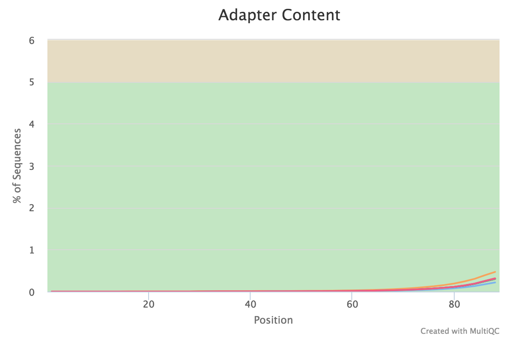
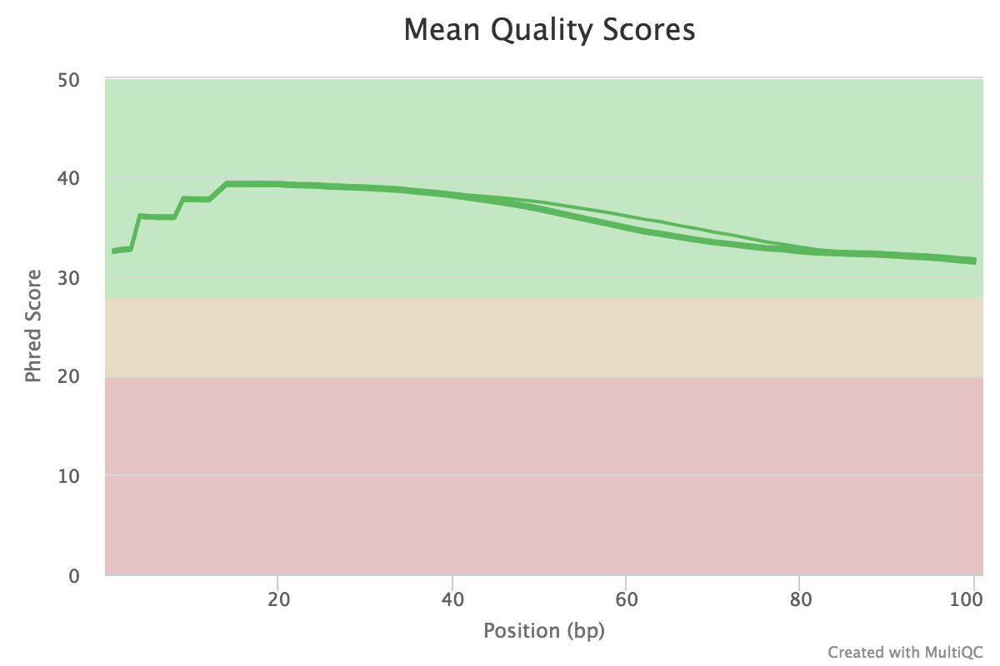

# RNA-Seq data Analysis

RNA-seq experiments are performed with an aim to comprehend transcriptomic changes in organisms in response to a certain treatment. They are also designed to understand the cause and/or effect of a mutation by measuring the resulting gene expression changes. Thanks to some robust algorithms specifically designed to map short stretches of nucleotide sequences to a genome while being aware of the process of RNA splicing has led to many advances in RNAseq analysis. The overview of RNA-seq analysis is summarized in Fig1.


### Overview ###


This document will guide you through basic RNAseq analysis, beginning at quality checking of the RNAseq `reads` through to getting the differential gene expression results. We have downloaded an *Arabidopsis* dataset from NCBI for this purpose. Check the [BioProject](https://www.ncbi.nlm.nih.gov/bioproject/PRJNA348194) page for more information.


# Experimental design #

This experiment compares WT and *atrx-1* mutant to analyze how loss of function  of ATRX chaperone results in changes in gene expression. The ATRX chaperone is a histone chaperone known to be an important player in regulation of gene expression. RNA was isolated from three WT replicates and three mutant replicates using Trizol. Transcriptome was enriched/isolated using the plant RiboMinus kit for obtaining total RNA. RNA-seq was carried out in Illumina Hiseq 2500. The sequencing reads were generated as paired-end data, hence we have 2 files per replicate.


| Condition | replicate 1 | replicate 2 | replicate 3 |
| --- | --- | --- | --- |
| WT | SRR4420293_1.fastq.gz <br> SRR4420293_2.fastq.gz | SRR4420294_1.fastq.gz <br> SRR4420294_2.fastq.gz | SRR4420295_1.fastq.gz <br> SRR4420295_2.fastq.gz |
| atrx-1 | SRR4420296_1.fastq.gz <br> SRR4420296_2.fastq.gz| SRR4420297_1.fastq.gz <br> SRR4420297_2.fastq.gz| SRR4420298_1.fastq.gz <br> SRR4420298_2.fastq.gz |

# 1. Download the data from public databases #

## A) NCBI
Generally if the data is hosted at your local sequencing center you could download through a web interface or using `wget` or `curl` commands. In this case, however, we first download the SRA files from the public archives in NCBI in bulk using aspera high speed file transfer. The following code expects that you have sra-toolkit, GNU parallel and aspera installed on your computing cluster. On Ceres, in order to use an installed software, we load the relevant module.

```
module load <path/to/sra-toolkit>
module load <path/to/edirect>
module load <path/to/parallel>
esearch -db sra -query PRJNA348194 | efetch --format runinfo |cut -d "," -f 1 | awk 'NF>0' | grep -v "Run" > srr_numbers.txt
while read line; do echo "prefetch --max-size 100G --transport ascp --ascp-path \"/path/to/aspera/.../ascp|/path.../etc/asperaweb_id_dsa.openssh\" $line"; done<srr_numbers.txt > prefetch.cmds
parallel <prefetch.cmds
```
After downloading the SRA files, we convert it to fastq format. We can use the fast-dump command as follows: (this step is slow and if possible run these commands using [gnu parallel](https://www.gnu.org/software/parallel/)). We assume that all SRA files are in a specific folder.
```
module load parallel
parallel "fastq-dump --split-files --origfmt --gzip" ::: /path/to/SRA/*.sra
```
*Note: fastq-dump runs very slow*
## B) EBI
Another option is to go through EBI, which directly hosts the fastq files  on their server (e.g. check [EBI](https://www.ebi.ac.uk/ena/data/view/PRJNA348194)) we can download them directly using `wget` by supplying the links to each file; for example in this case:

```
wget ftp://ftp.sra.ebi.ac.uk/vol1/fastq/SRR442/003/SRR4420293/SRR4420293_1.fastq.gz
wget <link to file2>
wget <link to file3>
...
....
```


We also need the genome file and associated GTF/GFF file for for *Arabidopsis*. These are downloaded directly from [NCBI](https://www.ncbi.nlm.nih.gov/genome?term=NC_001284&cmd=DetailsSearch), or [plants Ensembl website](http://plants.ensembl.org/info/website/ftp/index.html) or the [Phytozome website](https://phytozome.jgi.doe.gov/pz/portal.html#!bulk?org=Org_Gmax "Glycine max") (phytozome needs logging in and selecting the files) .

For this tutorial, we downloaded the following files from [NCBI](https://www.ncbi.nlm.nih.gov/genome/?term=Arabidopsis+thaliana).
```
Genome Fasta File: GCF_000001735.3_TAIR10_genomic.fna
Annotation file: GCF_000001735.3_TAIR10_genomic.gff

```

# 2. Quality Check #

We use `fastqc`, which is a tool that provides a simple way to do quality control checks on raw sequence data coming from high throughput sequencing pipelines ([link](http://www.bioinformatics.babraham.ac.uk/projects/fastqc/)). It provides various metrics to give a indication of how your data is. A high quality illumina RNAseq file should look something like [this](http://www.bioinformatics.babraham.ac.uk/projects/fastqc/good_sequence_short_fastqc.html). Since there are 6 set of files (12 files total), and we need to run `fastqc` on each one of them. It is convenient to run it in `parallel`.

```
module load fastqc
module load parallel
parallel "fastqc {} -o <fq_out_directory>" ::: *.fastq.gz
```
Because we have a total of 6 quality outputs, we will have 6 html files and 6 zip files. We can use [`multiqc`](http://multiqc.info/) to aggregate the outputs and get a single html file detailing the quality of all the libraries.

```
cd fq_out_directory
module load python_3
multiqc .
[INFO   ]         multiqc : This is MultiQC v0.8
[INFO   ]         multiqc : Template    : default
[INFO   ]         multiqc : Searching '.'
[INFO   ]          fastqc : Found 6 reports
[INFO   ]         multiqc : Report      : multiqc_report.html
[INFO   ]         multiqc : Data        : multiqc_data
[INFO   ]         multiqc : MultiQC complete


```
This will give you a combined html file and a folder named multiqc_data with containing three files describing the various statistics:
```
ls  
multiqc_data (Folder)
multiqc_report.html

cd multiqc_data
ls

multiqc_fastqc.txt  
multiqc_general_stats.txt  
multiqc_sources.txt
..........
```


You can peruse the complete report or download the plots and view them for example: 




If satisfied with the results, proceed with the mapping. If not, then perform quality trimming. E.g. see [here](http://hannonlab.cshl.edu/fastx_toolkit/). If the quality is very bad it might make more sense to exclude that sample from the analysis.

# 3. Mapping reads to the genome #

There are several mapping programs available for aligning RNAseq reads to the genome. Generic aligners such as BWA, bowtie2, BBMap etc., are not suitable for mapping RNAseq reads because they are not splice aware. RNAseq reads are mRNA reads that only contain exonic regions, hence mapping them back to the genome requires splitting the individual reads that span an intron. This is only done by splice aware mappers. In this tutorial, we will use [`HISAT2`](https://ccb.jhu.edu/software/hisat2/index.shtml). HISAT2 is a successor of Tophat2.


### HiSat2 for mapping ###

#### Hisat2 Index ####

For HiSat2 mapping, you need to first index the genome and then use the read pairs to map the indexed genome (one set at a time). For indexing the genome, we use the `hisat2-build` command as follows in a slurm script:

```
#!/bin/bash
#set -o xtrace
#SBATCH -N 1
#SBATCH --ntasks-per-node=16
#SBATCH -t 24:00:00
#SBATCH -J HI_build
#SBATCH -o HI_build.o%j
#SBATCH -e HI_build.e%j
#SBATCH --mail-user=<user_email_address>
#SBATCH --mail-type=begin
#SBATCH --mail-type=end
cd $SLURM_SUBMIT_DIR
scontrol show job $SLURM_JOB_ID
ulimit -s unlimited

module load hisat2

GENOME="/path/to/refrence/GCF_000001735.3_TAIR10_genomic.fna"
hisat2-build $GENOME ${GENOME%.*}

```

Once complete, you should see a number of files with `.ht2` extension.  These are the index files.
```
 GCF_000001735.3_TAIR10_genomic.1.ht2
 GCF_000001735.3_TAIR10_genomic.2.ht2
 GCF_000001735.3_TAIR10_genomic.3.ht2
 GCF_000001735.3_TAIR10_genomic.4.ht2
 GCF_000001735.3_TAIR10_genomic.5.ht2
 GCF_000001735.3_TAIR10_genomic.6.ht2
 GCF_000001735.3_TAIR10_genomic.7.ht2
 GCF_000001735.3_TAIR10_genomic.8.ht2
```
 At the mapping step we simply refer to the index using `GCF_000001735.3_TAIR10_genomic` as described in the next step.


#### Hisat2 Mapping ####

For mapping, each set of reads (forward and reverse or R1 and R2), we first set up a `run_hisat2.sh` script as follows:
```
#!/bin/bash
set -o xtrace
# set the reference index:
GENOME="/path/to/refrence/GCF_000001735.3_TAIR10_genomic"
# make an output directory to store the output aligned files
mkdir -p /path/to/out_dir
# set that as the output directory
ODIR="/path/to/out_dir"


p=8 # use 8 threads
R1_FQ="$1" # first argument
R2_FQ="$2" # second argument

# purge and load relevant modules.
module purge

module load hisat2
module load samtools

OUTPUT=$(basename ${R1_FQ} |cut -f 1 -d "_");

hisat2 \
  -p ${p} \
  -x ${GENOME} \
  -1 ${R1_FQ} \
  -2 ${R2_FQ} \
  -S $ODIR\/${OUTPUT}.sam &> ${OUTPUT}.log
samtools view --threads 8 -bS -o $ODIR\/${OUTPUT}.bam $ODIR\/${OUTPUT}.sam

rm $ODIR\/${OUTPUT}.sam

```

For setting it up to run with each set of file, we can set a SLURM script (`loop_hisat2.sh`) that loops over each fastq file. Note that this script calls the run_hisat2.sh script for each pair of fastq file supplied as its argument.
```
#!/bin/bash
set -o xtrace
#SBATCH -N 1
#SBATCH --ntasks-per-node=16
#SBATCH -t 24:00:00
#SBATCH -J Hisat2
#SBATCH -o Hisat2.o%j
#SBATCH -e Hisat2.e%j
#SBATCH --mail-user=<user_email_address>
#SBATCH --mail-type=begin
#SBATCH --mail-type=end
cd $SLURM_SUBMIT_DIR
ulimit -s unlimited
scontrol show job $SLURM_JOB_ID

for fq1 in *1.*gz;
do
fq2=$(echo $fq1 | sed 's/1/2/g');
/path/to/run_hisat.sh ${fq1} ${fq2};
done >& hisat2_1.log

```
Now submit this job as follows:
```
sbatch loop_hisat2.sh
```

This should create, following files as output:
```
SRR4420298.bam
SRR4420297.bam
SRR4420296.bam
SRR4420295.bam
SRR4420294.bam
SRR4420293.bam
```
# 4. Abundance estimation #

For quantifying transcript abundance from RNA-seq data, there are many programs available. Two most popular tools include, `featureCounts` and `HTSeq`. We will need a file with aligned sequencing reads (SAM/BAM files generated in previous step) and a list of genomic features (from the GFF file). `featureCounts` is a highly efficient general-purpose read summarization program that counts mapped reads for genomic features such as genes, exons, promoter, gene bodies, genomic bins and chromosomal locations. It also outputs stat info for the overall summarization results, including number of successfully assigned reads and number of reads that failed to be assigned due to various reasons. We can run featureCounts on all SAM/BAM files at the same time or individually.

#### featureCounts ####
You will need [`subread`](http://subread.sourceforge.net/) and `parallel` modules loaded.
```
ANNOT="/path/to/GCF_000001735.3_TAIR10_genomic.gff"
mkdir -p path/to/counts
ODIR="path/to/counts"


module purge

module load subread
module load parallel

parallel -j 4 "featureCounts -T 4 -s 2 -p -t gene -g ID -a $ANNOT -o $ODIR/{.}.gene.txt {}" ::: *.bam

```
This creates the following set of files in the specified output folder:
Count Files:
```
SRR4420298.gene.txt
SRR4420293.gene.txt
SRR4420297.gene.txt
SRR4420296.gene.txt
SRR4420295.gene.txt
SRR4420294.gene.txt
```
Each file has a commented line staring with a # which gives the command used to create the count table and the relevant seven columns as follows, for example:

`head SRR4420298.gene.txt`
```
# Program:featureCounts v1.5.2; Command:"featureCounts" "-T" "4" "-s" "2" "-p" "-t" "gene" "-g" "ID" "-a" "/path/to/GCF_000001735.3_TAIR10_genomic.gff" "-o" "/path/to/counts/SRR4420298.gene.txt" "SRR4420298.bam"

Geneid  Chr     Start   End     Strand  Length  SRR4420298.bam
gene0   NC_003070.9     3631    5899    +       2269    13
gene1   NC_003070.9     6788    9130    -       2343    17
gene2   NC_003070.9     11101   11372   +       272     0
gene3   NC_003070.9     11649   13714   -       2066    13
gene4   NC_003070.9     23121   31227   +       8107    32
gene5   NC_003070.9     23312   24099   -       788     0
gene6   NC_003070.9     28500   28706   +       207     0
gene7   NC_003070.9     31170   33171   -       2002    45

```
Additionally Summary Files are produced. These give the summary of reads that were either ambiguous, multimapped, mapped to no features or unmapped among other statistics. We can refer to these to further tweak our analyses etc.

```
SRR4420298.gene.txt.summary
SRR4420293.gene.txt.summary
SRR4420295.gene.txt.summary
SRR4420296.gene.txt.summary
SRR4420294.gene.txt.summary
SRR4420297.gene.txt.summary

```
Using the following command (a combination of paste and awk), we can produce a single count table. This count table could be loaded into R for differential expression analysis.

```
paste <(awk 'BEGIN {OFS="\t"} {print $1,$7}' SRR4420293.gene.txt) <(awk 'BEGIN {OFS="\t"} {print $7}' SRR4420294.gene.txt) <(awk 'BEGIN {OFS="\t"} {print $7}' SRR4420295.gene.txt) <(awk 'BEGIN {OFS="\t"} {print $7}' SRR4420296.gene.txt) <(awk 'BEGIN {OFS="\t"} {print $7}' SRR4420297.gene.txt) <(awk 'BEGIN {OFS="\t"} {print $7}' SRR4420298.gene.txt) | grep -v '^\#' > At_count.txt
```
You could also edit out the names of the samples to something succinct, for example, S293 instead of SRR4420293.bam.

head At_count.txt
```
Geneid  S293    S294    S295    S296    S297    S298
gene0   11      1       10      28      11      13
gene1   37      3       26      88      22      17
gene2   0       0       0       0       0       0
gene3   6       2       12      40      13      13
gene4   35      6       22      170     53      32
gene5   0       0       0       0       0       0
gene6   0       0       0       0       0       0
gene7   49      15      67      258     83      45
gene8   0       0       0       0       0       0
```

Now we are ready for performing DGE analysis!

---
[Table of contents](RNAseq-intro.md)
