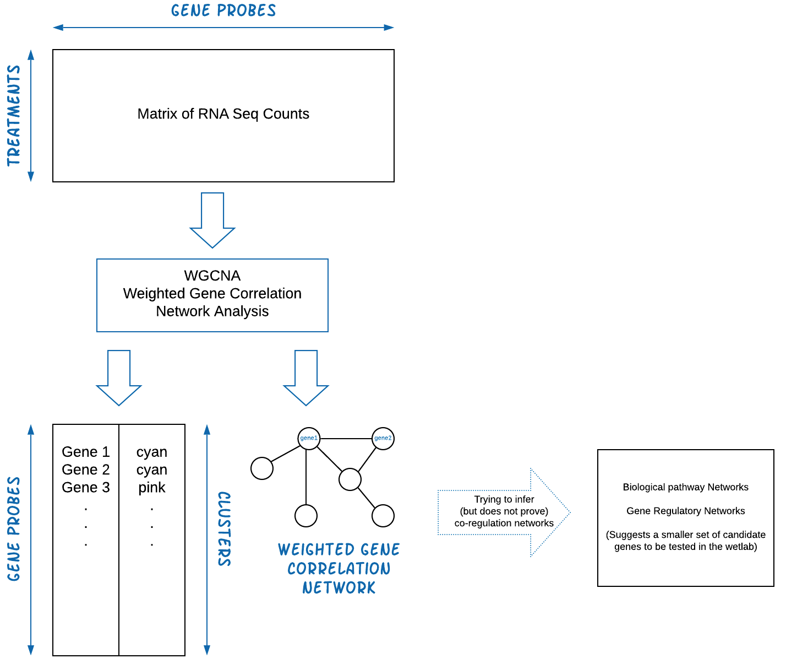

<!--
# The hypothesis

So you have completed an experiment, collecting RNA-seq data across several biological treatments. You may have perfermed differential gene expression analysis (with DESeq2 or similar software) to identify the up and down expressed genes. But how can you relate these up and down expressed genes into a biological story, or gene regulation model?

Assuming that genes that are positively regulating each other will be co-expressed, we can build a hypothesis of a gene-regulation network from a gene correlation network. Warning, the correlation network does not prove co-regulation. Further biological (such as loss-of-function) experiments are required. However, identifying the possible gene-regulation network can indicate which genes to test for co-regulation. 
-->

**Last Update**: 2020/12/14 <!--<br/>
**R Markdown**: [WGCNA.Rmd](WGCNA.Rmd)-->

# Network analysis with WGCNA

<!--
While there are multiple ways to build a co-expression network, we will focus on WGCNA to provide the motivation and framework.--> The **WGCNA R package** builds “weighted gene correlation networks for
analysis” from expression data. It was originally published in 2008 and cited as the following:

  * Langfelder, P. and Horvath, S., 2008. [WGCNA: an R package for
    weighted correlation network
    analysis](https://bmcbioinformatics.biomedcentral.com/articles/10.1186/1471-2105-9-559).
    BMC bioinformatics, 9(1), p.559.
  * Zhang, B. and Horvath, S., 2005. [A general framework for weighted
    gene co-expression network
    analysis](https://pubmed.ncbi.nlm.nih.gov/16646834/). Statistical
    applications in genetics and molecular biology, 4(1).

<!--
WGCNA continues to be used for many recent papers. Example papers include analyzing gray leaf disease response ([Yu
et
al, 2018](https://bmcgenomics.biomedcentral.com/articles/10.1186/s12864-018-5072-4#Sec2))
and development/nutrient/metabolism/stress response ([Ma et
al, 2017](https://pubmed.ncbi.nlm.nih.gov/28764653/)). 
-->

**More information**

  * [Recent PubMed Papers](https://pubmed.ncbi.nlm.nih.gov/?term=wgcna&sort=date)
  * [Original WGCNA
    tutorials - Last updated 2016](https://horvath.genetics.ucla.edu/html/CoexpressionNetwork/Rpackages/WGCNA/Tutorials/)
  * [Video: ISCB Workshop 2016 - Co-expression network analysis using RNA-Seq data (Keith Hughitt)](https://youtu.be/OdqDE5EJSlA)
  * [](https://youtu.be/OdqDE5EJSlA)

## Installing WGCNA

We will assume you have a working R environment. If not, please see the following tutorial:

* [Seting up an R and RStudio Environment](../../../dataWrangling/R/r-setup.md)

Since WGCNA is an R package, we will need to start an R environemnt and install from R's package manager, CRAN.

``` r
# WGCNA is available on CRAN
install.packages("WGCNA")
library(WGCNA)
```

## Overview ##

The **WGCNA** pipeline is expecting an input matrix of RNA Sequence counts. Usually we need to rotate (transpose) the input data so `rows` = `treatments` and `columns` = `gene probes`.



The output of **WGCNA** is a list of clustered genes, and weighted gene correlation network files.

## Dataset

We'll start with the dataset from the official WGCNA tutorial.

> The data are gene expression measurements from livers of female mouse of a specific F2 intercross. For a detailed description of the data and the biological implications we refer the reader to Ghazalpour et al (2006), Integrating Genetics and Network Analysis to Characterize Genes Related to Mouse Weight. We note that the data set contains 3600 measured expression profiles. These were filtered from the original over 20,000 profiles by keeping only the most variant and most connected probes. In addition to the expression data, several physiological quantitative traits were measured for the mice.

* [FemaleLiver-Data.zip](FemaleLiver-Data.zip)

From command line, you can also use `wget` or `curl`:

``` bash
wget https://horvath.genetics.ucla.edu/html/CoexpressionNetwork/Rpackages/WGCNA/Tutorials/FemaleLiver-Data.zip
unzip FemaleLiver-Data.zip
```

## Load and clean dataset

## Run WGCNA

## Export Clusters

## Export Network

