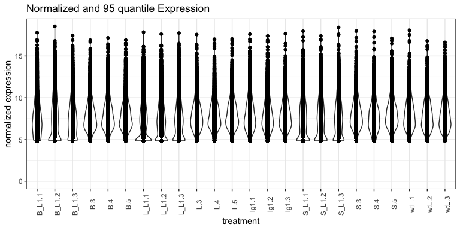
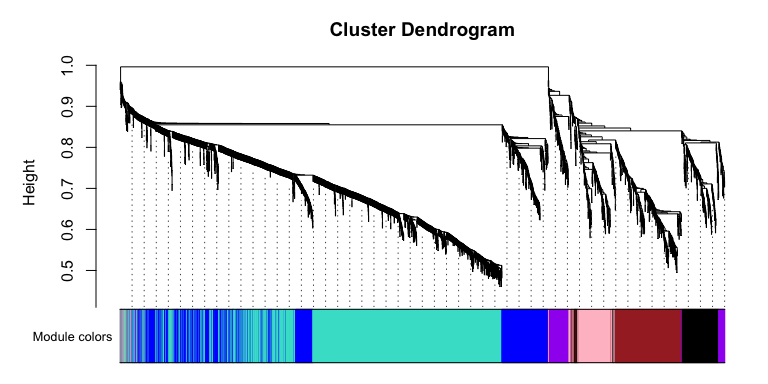
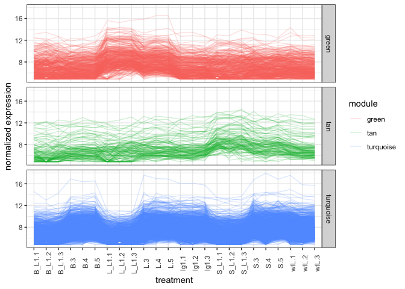

**Last Update**: 4 Jan 2021 <br/> **R Markdown**:
[WGCNA.Rmd](https://bioinformaticsworkbook.org/tutorials/WGCNA.Rmd)

# Network analysis with WGCNA

There are many gene correlation network builders but we shall provide an
example of the WGCNA R Package.

The **WGCNA R package** builds “weighted gene correlation networks for
analysis” from expression data. It was originally published in 2008 and
cited as the following:

-   Langfelder, P. and Horvath, S., 2008. [WGCNA: an R package for
    weighted correlation network
    analysis](https://bmcbioinformatics.biomedcentral.com/articles/10.1186/1471-2105-9-559).
    BMC bioinformatics, 9(1), p.559.
-   Zhang, B. and Horvath, S., 2005. [A general framework for weighted
    gene co-expression network
    analysis](https://pubmed.ncbi.nlm.nih.gov/16646834/). Statistical
    applications in genetics and molecular biology, 4(1).

**More information**

-   [Recent PubMed
    Papers](https://pubmed.ncbi.nlm.nih.gov/?term=wgcna&sort=date)
-   [Original WGCNA tutorials - Last updated
    2016](https://horvath.genetics.ucla.edu/html/CoexpressionNetwork/Rpackages/WGCNA/Tutorials/)
-   [Video: ISCB Workshop 2016 - Co-expression network analysis using
    RNA-Seq data (Keith Hughitt)](https://youtu.be/OdqDE5EJSlA)

## Installing WGCNA

We will assume you have a working R environment. If not, please see the
following tutorial:

-   [Seting up an R and RStudio
    Environment](https://bioinformaticsworkbook.org/dataWrangling/R/r-setup.html)

Since WGCNA is an R package, we will need to start an R environment and
install from R’s package manager, CRAN.

``` r
install.packages("WGCNA")   # WGCNA is available on CRAN
library(WGCNA)
```

## Overview

The **WGCNA** pipeline is expecting an input matrix of RNA Sequence
counts. Usually we need to rotate (transpose) the input data so `rows` =
`treatments` and `columns` = `gene probes`.


The output of **WGCNA** is a list of clustered genes, and weighted gene
correlation network files.

# Example Dataset

We shall start with an example dataset about Maize and Ligule
Development. \[Add description of data and maybe link to paper here\]
For more information, please see the following paper:

-   Johnston, R., Wang, M., Sun, Q., Sylvester, A.W., Hake, S. and
    Scanlon, M.J., 2014. [Transcriptomic analyses indicate that maize
    ligule development recapitulates gene expression patterns that occur
    during lateral organ
    initiation](https://pubmed.ncbi.nlm.nih.gov/25516601/). The Plant
    Cell, 26(12), pp.4718-4732.

The dataset can be downloaded from the NCBI entry or using `wget` from
the bash commandline.

<!--While the wt and lg1 were from the area marked in purple in plants that exhibited either wt or no ligule (liguleless phenotype)… so this encompasses the entire pre-ligule, pre-blade and pre-sheath area.-->

-   [Download Dataset from NCBI
    entry](https://www.ncbi.nlm.nih.gov/geo/query/acc.cgi?acc=GSE61333)

``` bash
wget ftp://ftp.ncbi.nlm.nih.gov/geo/series/GSE61nnn/GSE61333/suppl/GSE61333_ligule_count.txt.gz
gunzip GSE61333_ligule_count.txt.gz

ls -ltr *.txt
#> -rw-r--r--  1 username  staff   7.5M Jan  4 09:48 GSE61333_ligule_count.txt
```

## Load R Libraries

This analysis requires the following R libraries. You might need to
install the library if it’s not already on your system.

We’re going to conform to the [tidyverse]() ecosystem. For a discussion
on its benefits see [“Welcome to the Tidyverse” (Wickham et al,
2019)](https://tidyverse.tidyverse.org/articles/paper.html). This allows
us to organize the pipeline in the following framework ([Fig. from “R
for Data Science” (Wickham and Grolemund,
2017)](https://r4ds.had.co.nz/)):


``` r
# Uncomment and modify the following to install any missing packages
# install.packages(c("tidyverse", "magrittr", "WGCNA))
library(tidyverse)     # tidyverse will pull in ggplot2, readr, other useful libraries
library(magrittr)      # provides the %>% operator
library(WGCNA)        
```

## Tidy the Dataset, and using exploratory graphics

Load and look at the data

``` r
# ==== Load and clean data
data <- readr::read_delim("data/GSE61333_ligule_count.txt",     # <= path to the data file
                          delim = "\t")
#>
#> ── Column specification ────────────────────────────────────────────────────────
#> cols(
#>   .default = col_double(),
#>   Count = col_character()
#> )
#> ℹ Use `spec()` for the full column specifications.

data[1:5,1:10]        # Look at first 5 rows and 10 columns
#> # A tibble: 5 x 10
#>   Count            `B-3` `B-4` `B-5` `L-3` `L-4` `L-5` `S-3` `S-4` `S-5`
#>   <chr>            <dbl> <dbl> <dbl> <dbl> <dbl> <dbl> <dbl> <dbl> <dbl>
#> 1 AC147602.5_FG004     0     0     0     0     0     0     0     0     0
#> 2 AC148152.3_FG001     0     0     0     0     0     0     0     0     0
#> 3 AC148152.3_FG002     0     0     0     0     0     0     0     0     0
#> 4 AC148152.3_FG005     0     0     0     0     0     0     0     0     0
#> 5 AC148152.3_FG006     0     0     0     0     0     0     0     0     0

# str(data)           # str = structure of data, useful for debugging data type mismatch errors

names(data)[1] = "GeneId"
names(data)           # Look at the column names
#>  [1] "GeneId" "B-3"    "B-4"    "B-5"    "L-3"    "L-4"    "L-5"    "S-3"   
#>  [9] "S-4"    "S-5"    "B_L1.1" "B_L1.2" "B_L1.3" "L_L1.1" "L_L1.2" "L_L1.3"
#> [17] "S_L1.1" "S_L1.2" "S_L1.3" "wtL-1"  "wtL-2"  "wtL-3"  "lg1-1"  "lg1-2"
#> [25] "lg1-3"
```

If you are in RStudio, you can also click on the `data` object in the
Environment tab to see an Excel-like view of the data.


From looking at the data, we can come to the following insights:

-   We see that `rows` = `gene probes` which probably means `columns` =
    `treatments` which is the opposite of what’s needed in WGCNA (`rows`
    = `treatment`, `columns` = `gene probes`). This dataset will need to
    be rotated (transposed) before sending to WGCNA.

-   This is also wide data, we will convert this to tidy data before
    visualization. For [Hadley Wickham](http://hadley.nz/)’s tutorial on
    the what and why to convert to tidy data, see
    <https://r4ds.had.co.nz/tidy-data.html>.

-   The column names are prefixed with the treatment group (e.g. `B-3`,
    `B-4`, and `B-5` are three replicates of the treatment “B”).

-   **TODO:** Markdown table describing treatments here mean here.
    `e.g. B=?, S=?, L=?`

The following R commands clean and tidy the dataset for exploratory
graphics.

``` r
col_sel = names(data)[-1]     # Get all but first column name
mdata <- data %>%
  tidyr::pivot_longer(
    .,                        # The dot is the the input data, magrittr tutorial
    col = all_of(col_sel)
    ) %>%  
  mutate(
    group = gsub("-.*","", name) %>% gsub("[.].*","", .)   # Get the shorter treatment names
  )

# Optional step ---  order the groups in the plot.
# mdata$group = factor(mdata$group,
#                     levels = c("B", "B_L1", ....))  #<= fill the rest of this in
```

Think through what kinds of plots may tell you something about the
dataset. Below, we have provided an example plot to identify any obvious
outliers. This may take a while to plot.

``` r
# ==== Plot groups (Sample Groups vs RNA Seq Counts) to identify outliers
(
 p <- mdata %>%
    ggplot(., aes(x = name, y = value)) +             # x = treatment, y = RNA Seq count
    geom_violin() +                                   # violin plot, show distribution
    geom_point(alpha = 0.2) +                         # scatter plot
    theme_bw() +
    theme(
      axis.text.x = element_text(angle = 90)          # Rotate treatment text
    ) +
    labs(x = "Treatment Groups", y = "RNA Seq Counts") +
    facet_grid(cols = vars(group), drop = TRUE, scales = "free_x")      # Facet by hour
)
```

<!-- -->

<!--
> From here, we can see there's something strange in some of the hour 24 samples. One has very high RNASeq values `24II_S15_L006` with maybe a wide range, while another has very low range of RNASeq values `24_S15_L007`. We should follow up with the wet lab folks on an explanation of those samples, but for now, we'll remove the 24 hour group and maybe the 48 hour group.
>
>
> ```r
> #keep_cols = names(data) %>% grep("24", .,  invert = T, value = T) %>% grep("48I+_", ., invert=T, value=T)
> #cdata = data %>% select(all_of(keep_cols))
>
> #temp <- data[rowSums(data[,-1]) > 0.1, ]      # Remove genes with all 0 values
> #row_var <- apply(temp[,-1], 1, var)           # Remove genes with variance below 100
> #cdata <- temp[row_var > 1, ]
> #cdata[1:5, 1:10]
> ```
>
> You can look at the `cdata` object (click on item in `environment` or use `names(cdata)`) to convince yourself that the "24 hour" group is gone. The original dataset had 46,430 genes (too many to explore), subsetting by variance and other strange artifacts reduced it down to 25,088 genes. Let's continue and determine the correlation networks for these 25,088 genes.
-->

## Normalize Counts with DESeq

We’ll use DESeq to normalize the counts before sending to WGCNA.
Optionally you could subset to only genes that are differentially
expressed between groups. (The smaller the number of genes, the faster
WGCNA will run. Although there is some online discussion if this breaks
the scale-free network assumption.)

``` r
library(DESeq2)
```

Prepare DESeq input, which is expecting a matrix of integers.

``` r
de_input = as.matrix(data[,-1])
row.names(de_input) = data$GeneId
de_input[1:5,1:10]
#>                  B-3 B-4 B-5 L-3 L-4 L-5 S-3 S-4 S-5 B_L1.1
#> AC147602.5_FG004   0   0   0   0   0   0   0   0   0      0
#> AC148152.3_FG001   0   0   0   0   0   0   0   0   0      0
#> AC148152.3_FG002   0   0   0   0   0   0   0   0   0      0
#> AC148152.3_FG005   0   0   0   0   0   0   0   0   0      0
#> AC148152.3_FG006   0   0   0   0   0   0   0   0   0      0
#str(de_input)

meta_df <- data.frame( Sample = names(data[-1])) %>%
  mutate(
    Type = gsub("-.*","", Sample) %>% gsub("[.].*","", .)
  )

dds <- DESeqDataSetFromMatrix(round(de_input),
                              meta_df,
                              design = ~Type)
#> converting counts to integer mode
#> Warning in DESeqDataSet(se, design = design, ignoreRank): some variables in
#> design formula are characters, converting to factors

dds <- DESeq(dds)
#> estimating size factors
#> estimating dispersions
#> gene-wise dispersion estimates
#> mean-dispersion relationship
#> final dispersion estimates
#> fitting model and testing
vsd <- varianceStabilizingTransformation(dds)
library(genefilter)      # <= why is this here?
#>
#> Attaching package: 'genefilter'
#> The following objects are masked from 'package:matrixStats':
#>
#>     rowSds, rowVars
#> The following object is masked from 'package:readr':
#>
#>     spec
wpn_vsd <- getVarianceStabilizedData(dds)
rv_wpn <- rowVars(wpn_vsd)
summary(rv_wpn)
#>     Min.  1st Qu.   Median     Mean  3rd Qu.     Max.
#>  0.00000  0.00000  0.00000  0.08044  0.03322 11.14529

q75_wpn <- quantile( rowVars(wpn_vsd), .75)  # <= original
q95_wpn <- quantile( rowVars(wpn_vsd), .95)  # <= changed to 95 quantile to reduce dataset
expr_normalized <- wpn_vsd[ rv_wpn > q95_wpn, ]

expr_normalized[1:5,1:10]
#>                       B-3      B-4      B-5      L-3      L-4      L-5      S-3
#> AC149818.2_FG001 7.600901 7.077399 7.803434 7.220840 7.410408 8.028223 7.160846
#> AC149829.2_FG003 8.782014 8.179876 7.900062 8.299778 7.529891 8.631731 8.055118
#> AC182617.3_FG001 8.047244 7.120668 6.885533 7.501391 7.279413 7.809565 7.184253
#> AC186512.3_FG001 6.901539 7.389644 6.975945 6.859593 7.370816 6.633722 7.798843
#> AC186512.3_FG007 7.919688 7.754506 7.670946 7.417760 7.988427 7.904850 7.484542
#>                       S-4      S-5   B_L1.1
#> AC149818.2_FG001 7.401382 7.345322 6.524435
#> AC149829.2_FG003 8.744502 8.142909 8.240407
#> AC182617.3_FG001 8.140134 6.972400 7.777347
#> AC186512.3_FG001 6.949501 6.952659 6.059033
#> AC186512.3_FG007 8.375664 7.762799 6.335663
dim(expr_normalized)
#> [1] 5486   24

expr_normalized_df <- data.frame(expr_normalized) %>%
  mutate(
    Gene_id = row.names(expr_normalized)
  ) %>%
  pivot_longer(-Gene_id)

expr_normalized_df %>% ggplot(., aes(x = name, y = value)) +
  geom_violin() +
  geom_point() +
  theme_bw() +
  theme(
    axis.text.x = element_text( angle = 90)
  ) +
  ylim(0, NA) +
  labs(
    title = "Normalized and 95 quantile Expression",
    x = "treatment",
    y = "normalized expression"
  )
```

<!-- -->

## WGCNA

Now let’s transpose the data and prepare the dataset for WGCNA.

``` r
input_mat = t(expr_normalized)

input_mat[1:5,1:10]           # Look at first 5 rows and 10 columns
#>     AC149818.2_FG001 AC149829.2_FG003 AC182617.3_FG001 AC186512.3_FG001
#> B-3         7.600901         8.782014         8.047244         6.901539
#> B-4         7.077399         8.179876         7.120668         7.389644
#> B-5         7.803434         7.900062         6.885533         6.975945
#> L-3         7.220840         8.299778         7.501391         6.859593
#> L-4         7.410408         7.529891         7.279413         7.370816
#>     AC186512.3_FG007 AC189795.3_FG001 AC190609.3_FG002 AC190623.3_FG001
#> B-3         7.919688         8.149041         12.64301         6.575155
#> B-4         7.754506         8.077571         11.99816         7.170788
#> B-5         7.670946         7.524430         12.12500         7.438024
#> L-3         7.417760         8.420552         12.36979         8.223261
#> L-4         7.988427         7.105196         11.64515         8.008850
#>     AC192451.3_FG001 AC195340.3_FG001
#> B-3         6.700385         9.104258
#> B-4         7.325447         9.135480
#> B-5         7.819142         9.023856
#> L-3         8.052019         8.908933
#> L-4         8.528875         8.583982
```

We can see now that the `rows` = `treatments` and `columns` =
`gene probes`. We’re ready to start WGCNA. A correlation network will be
a complete network (all genes are connected to all other genes). Ergo we
will need to pick a threshhold value (if correlation is below threshold,
remove the edge). We assume the true biological network follows a
scale-free structure (see papers by [Albert
Barabasi](https://en.wikipedia.org/wiki/Barab%C3%A1si%E2%80%93Albert_model)).

To do that, WGCNA will try a range of soft thresholds and create a
diagnostic plot. This step will take several minutes so feel free to run
and get coffee.

``` r
#library(WGCNA)
allowWGCNAThreads()          # allow multi-threading (optional)
#> Allowing multi-threading with up to 4 threads.

# Choose a set of soft-thresholding powers
powers = c(c(1:10), seq(from = 12, to = 20, by = 2))

# Call the network topology analysis function
sft = pickSoftThreshold(
  input_mat,             # <= Input data
  #blockSize = 30,
  powerVector = powers,
  verbose = 5
  )
#> pickSoftThreshold: will use block size 5486.
#>  pickSoftThreshold: calculating connectivity for given powers...
#>    ..working on genes 1 through 5486 of 5486
#>    Power SFT.R.sq  slope truncated.R.sq mean.k. median.k. max.k.
#> 1      1   0.5350  2.500          0.960  1940.0    1950.0   2840
#> 2      2   0.0642  0.331          0.897   964.0     927.0   1860
#> 3      3   0.1680 -0.444          0.859   560.0     505.0   1340
#> 4      4   0.5050 -0.822          0.906   358.0     300.0   1030
#> 5      5   0.6800 -1.070          0.935   243.0     189.0    819
#> 6      6   0.7770 -1.230          0.954   173.0     125.0    673
#> 7      7   0.8330 -1.310          0.972   127.0      85.3    564
#> 8      8   0.8660 -1.390          0.980    96.4      60.2    484
#> 9      9   0.8810 -1.450          0.981    74.8      43.2    422
#> 10    10   0.8940 -1.490          0.984    59.1      31.7    371
#> 11    12   0.9070 -1.540          0.988    38.7      17.6    295
#> 12    14   0.9150 -1.580          0.988    26.7      10.3    240
#> 13    16   0.9220 -1.570          0.985    19.1       6.3    200
#> 14    18   0.9200 -1.570          0.979    14.1       4.0    169
#> 15    20   0.9240 -1.570          0.982    10.7       2.6    145

par(mfrow = c(1,2));
cex1 = 0.9;

plot(sft$fitIndices[, 1],
     -sign(sft$fitIndices[, 3]) * sft$fitIndices[, 2],
     xlab = "Soft Threshold (power)",
     ylab = "Scale Free Topology Model Fit, signed R^2",
     main = paste("Scale independence")
)
text(sft$fitIndices[, 1],
     -sign(sft$fitIndices[, 3]) * sft$fitIndices[, 2],
     labels = powers, cex = cex1, col = "red"
)
abline(h = 0.90, col = "red")
plot(sft$fitIndices[, 1],
     sft$fitIndices[, 5],
     xlab = "Soft Threshold (power)",
     ylab = "Mean Connectivity",
     type = "n",
     main = paste("Mean connectivity")
)
text(sft$fitIndices[, 1],
     sft$fitIndices[, 5],
     labels = powers,
     cex = cex1, col = "red")
```

<!-- -->

Pick a soft threshold power near the curve of the plot, so here we could
pick 7, 8 or 9. We’ll pick 9 but feel free to experiment with other
powers to see how it affects your results. Now we can create the network
using the `blockwiseModules` command. The `blockwiseModule` may take a
while to run, since it is constructing the TOM (topological overlap
matrix) and several other steps. While it runs, take a look at the
`blockwiseModule` documentation (link to
[vignette](https://www.rdocumentation.org/packages/WGCNA/versions/1.69/topics/blockwiseModules))
for more information on the parameters. How might you change the
parameters to get more or less modules?

``` r
picked_power = 9
temp_cor <- cor       
cor <- WGCNA::cor         # Force it to use WGCNA cor function (fix a namespace conflict issue)
netwk <- blockwiseModules(input_mat,                # <= input here

                          # == Adjacency Function ==
                          power = picked_power,                # <= power here
                          networkType = "signed",

                          # == Tree and Block Options ==
                          deepSplit = 2,
                          pamRespectsDendro = F,
                          # detectCutHeight = 0.75,
                          minModuleSize = 30,
                          maxBlockSize = 4000,

                          # == Module Adjustments ==
                          reassignThreshold = 0,
                          mergeCutHeight = 0.25,

                          # == TOM == Archive the run results in TOM file (saves time)
                          saveTOMs = T,
                          saveTOMFileBase = "ER",

                          # == Output Options
                          numericLabels = T,
                          verbose = 3)
#>  Calculating module eigengenes block-wise from all genes
#>    Flagging genes and samples with too many missing values...
#>     ..step 1
#>  ....pre-clustering genes to determine blocks..
#>    Projective K-means:
#>    ..k-means clustering..
#>    ..merging smaller clusters...
#> Block sizes:
#> gBlocks
#>    1    2
#> 3489 1997
#>  ..Working on block 1 .
#>     TOM calculation: adjacency..
#>     ..will use 4 parallel threads.
#>      Fraction of slow calculations: 0.000000
#>     ..connectivity..
#>     ..matrix multiplication (system BLAS)..
#>     ..normalization..
#>     ..done.
#>    ..saving TOM for block 1 into file ER-block.1.RData
#>  ....clustering..
#>  ....detecting modules..
#>  ....calculating module eigengenes..
#>  ....checking kME in modules..
#>      ..removing 31 genes from module 1 because their KME is too low.
#>      ..removing 27 genes from module 2 because their KME is too low.
#>      ..removing 1 genes from module 3 because their KME is too low.
#>      ..removing 1 genes from module 5 because their KME is too low.
#>      ..removing 1 genes from module 6 because their KME is too low.
#>      ..removing 1 genes from module 9 because their KME is too low.
#>  ..Working on block 2 .
#>     TOM calculation: adjacency..
#>     ..will use 4 parallel threads.
#>      Fraction of slow calculations: 0.000000
#>     ..connectivity..
#>     ..matrix multiplication (system BLAS)..
#>     ..normalization..
#>     ..done.
#>    ..saving TOM for block 2 into file ER-block.2.RData
#>  ....clustering..
#>  ....detecting modules..
#>  ....calculating module eigengenes..
#>  ....checking kME in modules..
#>      ..removing 25 genes from module 1 because their KME is too low.
#>      ..removing 5 genes from module 2 because their KME is too low.
#>      ..removing 3 genes from module 3 because their KME is too low.
#>      ..removing 2 genes from module 4 because their KME is too low.
#>      ..removing 3 genes from module 5 because their KME is too low.
#>      ..removing 1 genes from module 8 because their KME is too low.
#>  ..merging modules that are too close..
#>      mergeCloseModules: Merging modules whose distance is less than 0.25
#>        Calculating new MEs...

cor <- temp_cor     # Return cor function to original namespace
```

Let’s take a look at the modules, there

``` r
# Convert labels to colors for plotting
mergedColors = labels2colors(netwk$colors)
# Plot the dendrogram and the module colors underneath
plotDendroAndColors(
  netwk$dendrograms[[1]],
  mergedColors[netwk$blockGenes[[1]]],
  "Module colors",
  dendroLabels = FALSE,
  hang = 0.03,
  addGuide = TRUE,
  guideHang = 0.05 )
```

<!-- -->

``` r
# netwk$colors[netwk$blockGenes[[1]]]
# table(netwk$colors)
```

# Relate Module (cluster) Assignments to Treatment Groups

We can pull out the list of modules

``` r
module_df <- data.frame(
  gene_id = names(netwk$colors),
  colors = labels2colors(netwk$colors)
)

module_df[1:5,]
#>            gene_id    colors
#> 1 AC149818.2_FG001      blue
#> 2 AC149829.2_FG003      blue
#> 3 AC182617.3_FG001      blue
#> 4 AC186512.3_FG001 turquoise
#> 5 AC186512.3_FG007 turquoise

write_delim(module_df,
            file = "gene_modules.txt",
            delim = "\t")
```

We have written out a tab delimited file listing the genes and their
modules. However, we need to figure out which modules are associated
with each trait/treatment group. WGCNA will calcuate an Eigangene
(hypothetical central gene) for each module, so it easier to determine
if modules are associated with different treatments.

``` r
# Get Module Eigengenes per cluster
MEs0 <- moduleEigengenes(input_mat, mergedColors)$eigengenes

# Reorder modules so similar modules are next to each other
MEs0 <- orderMEs(MEs0)
module_order = names(MEs0) %>% gsub("ME","", .)

# Add treatment names
MEs0$treatment = row.names(MEs0)

# tidy & plot data
mME = MEs0 %>%
  pivot_longer(-treatment) %>%
  mutate(
    name = gsub("ME", "", name),
    name = factor(name, levels = module_order)
  )

mME %>% ggplot(., aes(x=treatment, y=name, fill=value)) +
  geom_tile() +
  theme_bw() +
  scale_fill_gradient2(
    low = "blue",
    high = "red",
    mid = "white",
    midpoint = 0,
    limit = c(-1,1)) +
  theme(axis.text.x = element_text(angle=90)) +
  labs(title = "Module-trait Relationships", y = "Modules", fill="corr")
```

<!-- -->

Looking at the heatmap, the `green` seems positively associated (red
shading) with the `L` groups, `turquoise` module is positive for the `L`
but negative (blue shading) for the `L_L1` groups, and `tan` module is
positive in the `S` groups but negative elsewhere. There are other
patterns, think about what the patterns mean. For this tutorial we will
focus on the `green`, `turquoise`, and `tan` module genes.

# Examine Expression Profiles

We’ll pick out a few modules of interest, and plot their expression
profiles

``` r
# pick out a few modules of interest here
modules_of_interest = c("green", "turquoise", "tan")

# Pull out list of genes in that module
submod = module_df %>%
  subset(colors %in% modules_of_interest)

row.names(module_df) = module_df$gene_id

# Get normalized expression for those genes
expr_normalized[1:5,1:10]
#>                       B-3      B-4      B-5      L-3      L-4      L-5      S-3
#> AC149818.2_FG001 7.600901 7.077399 7.803434 7.220840 7.410408 8.028223 7.160846
#> AC149829.2_FG003 8.782014 8.179876 7.900062 8.299778 7.529891 8.631731 8.055118
#> AC182617.3_FG001 8.047244 7.120668 6.885533 7.501391 7.279413 7.809565 7.184253
#> AC186512.3_FG001 6.901539 7.389644 6.975945 6.859593 7.370816 6.633722 7.798843
#> AC186512.3_FG007 7.919688 7.754506 7.670946 7.417760 7.988427 7.904850 7.484542
#>                       S-4      S-5   B_L1.1
#> AC149818.2_FG001 7.401382 7.345322 6.524435
#> AC149829.2_FG003 8.744502 8.142909 8.240407
#> AC182617.3_FG001 8.140134 6.972400 7.777347
#> AC186512.3_FG001 6.949501 6.952659 6.059033
#> AC186512.3_FG007 8.375664 7.762799 6.335663
subexpr = expr_normalized[submod$gene_id,]

submod_df = data.frame(subexpr) %>%
  mutate(
    gene_id = row.names(.)
  ) %>%
  pivot_longer(-gene_id) %>%
  mutate(
    module = module_df[gene_id,]$colors
  )

submod_df %>% ggplot(., aes(x=name, y=value, group=gene_id)) +
  geom_line(aes(color = module),
            alpha = 0.2) +
  theme_bw() +
  theme(
    axis.text.x = element_text(angle = 90)
  ) +
  facet_grid(rows = vars(module)) +
  labs(x = "treatment",
       y = "normalized expression")
```

<!-- -->

It is possible to plot the modules in green, tan, and turquoise colors
but for now we’ll use the auto colors generated by `ggplot2`. From the
expression line graph, the line graph matches the correlation graph
where `Green` module genes are higher in the `L` groups. `Tan` genes
seem higher in the `S` groups, and `Turquoise` genes are low at `L_L1`
and `S_L1` and maybe `B_L1` groups.

# Generate and Export Networks

The network file can be generated for Cytoscape or as an edge/vertices
file.

``` r
genes_of_interest = module_df %>%
  subset(colors %in% modules_of_interest)

expr_of_interest = expr_normalized[genes_of_interest$gene_id,]
expr_of_interest[1:5,1:5]
#>                       B-3      B-4      B-5      L-3      L-4
#> AC186512.3_FG001 6.901539 7.389644 6.975945 6.859593 7.370816
#> AC186512.3_FG007 7.919688 7.754506 7.670946 7.417760 7.988427
#> AC190623.3_FG001 6.575155 7.170788 7.438024 8.223261 8.008850
#> AC196475.3_FG004 6.054319 6.439899 6.424540 5.815344 6.565299
#> AC196475.3_FG005 6.194406 5.872273 6.207174 6.499828 6.314952

# Only recalculate TOM for modules of interest (faster, altho there's some online discussion if this will be slightly off)
TOM = TOMsimilarityFromExpr(t(expr_of_interest),
                            power = picked_power)
#> TOM calculation: adjacency..
#> ..will use 4 parallel threads.
#>  Fraction of slow calculations: 0.000000
#> ..connectivity..
#> ..matrix multiplication (system BLAS)..
#> ..normalization..
#> ..done.

# Add gene names to row and columns
row.names(TOM) = row.names(expr_of_interest)
colnames(TOM) = row.names(expr_of_interest)

edge_list = data.frame(TOM) %>%
  mutate(
    gene1 = row.names(.)
  ) %>%
  pivot_longer(-gene1) %>%
  dplyr::rename(gene2 = name, correlation = value) %>%
  unique() %>%
  subset(!(gene1==gene2)) %>%
  mutate(
    module1 = module_df[gene1,]$colors,
    module2 = module_df[gene2,]$colors
  )

head(edge_list)
#> # A tibble: 6 x 5
#>   gene1            gene2            correlation module1   module2  
#>   <chr>            <chr>                  <dbl> <chr>     <chr>    
#> 1 AC186512.3_FG001 AC186512.3_FG007      0.0238 turquoise turquoise
#> 2 AC186512.3_FG001 AC190623.3_FG001      0.0719 turquoise turquoise
#> 3 AC186512.3_FG001 AC196475.3_FG004      0.143  turquoise turquoise
#> 4 AC186512.3_FG001 AC196475.3_FG005      0.0117 turquoise turquoise
#> 5 AC186512.3_FG001 AC196489.3_FG002      0.0181 turquoise turquoise
#> 6 AC186512.3_FG001 AC198481.3_FG004      0.0240 turquoise turquoise

# Export Network file to be read into Cytoscape, VisANT, etc
write_delim(edge_list,
            file = "edgelist.tsv",
            delim = "\t")
```

The `edgelist.txt` exported is the complete correlation network for
modules `green`, `tan`, and `turquoise`. The network still needs to be
subsetted down (by weight or minimal spanning) to identify hub genes.
Steps forward include identifying hub genes and gene ontology
enrichment. The edgelist can be loaded into igraph (R package) or
Cytoscape (standalone Java Application) for further network analysis.

# In Summary

We have taken in RNASeq count information, identified the top (95%
quantile) differentially expressed genes, sent it to WGCNA to identify
modules and create the gene correlation network for those modules.

**Input:**

-   `GSE61333_ligule_count.txt` - RNASeq counts

**Output:**

-   `gene_modules.txt` - Lists genes and their WGCNA modules
-   `edge_list.tsv` - Gene correlation network for modules of interest
