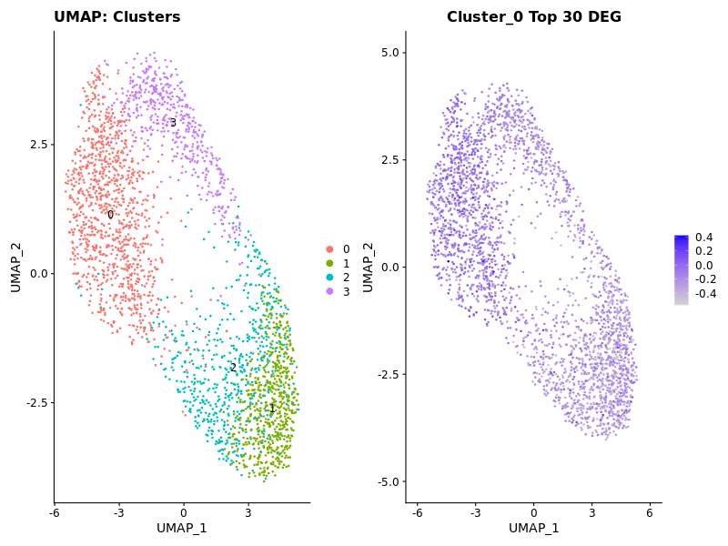

# Introduction

Single-cell RNA sequencing (scRNA-seq) has enhanced our ability to study cellular heterogeneity during development and differentiation. One prominent use case is examining how human embryonic stem cells (hESCs) differentiate into specific neuronal subtypes, such as midbrain floorplate progenitors. 

In this tutorial, we will walk through a practical PiPseq pipeline using a real-world scRNA-seq dataset derived from differentiated hESCs. PiPseq (Pronuclei in Profile sequencing) is a general-purpose pipeline for processing single-nuclei or single-cell RNA-seq data. Specifically, we will focus on how to:

* Pre-process scRNA-seq data
* Perform quality control and filtering
* Cluster cells and visualize them with UMAP
* Highlight expression of developmental marker genes, such as SHH

We will use a publicly available dataset from Tiklova et al. (2019), which characterized midbrain differentiation in hESCs using high-throughput single-cell RNA sequencing. We will analyze sample ERR14876813, which represents day 25 of hESC differentiation into midbrain floorplate progenitors. By day 25, hESCs have undergone substantial differentiation and begin to express key ventral midbrain markers, including SHH, FOXA2, and LMX1A.

This sample is derived from the study:

    Tiklova, K. et al. (2019). Single-cell transcriptomics reveals correct developmental dynamics and high-quality midbrain cell types by improved hESC differentiation. Nature Communications. DOI: 10.1038/s41467-019-12666-z

| Attribute               | Description                                                                  |
| ----------------------- | ---------------------------------------------------------------------------- |
| **Sample Accession**    | ERR14876813                                                                  |
| **Study**               | PRJEB32642 / GSE130212                                                       |
| **Organism**            | *Homo sapiens*                                                               |
| **Cell Type**           | hESC-derived midbrain floorplate progenitors                                 |
| **Differentiation Day** | Day 25                                                                       |
| **Technology**          | 10x Genomics Chromium single-cell RNA sequencing                             |
| **Expected Markers**    | High expression of **SHH**, **FOXA2**, **LMX1A**; moderate **OTX2**, **EN1** |
| **Sequencing Layout**   | Paired-end (R1: barcodes/UMI; R2: transcript reads)                          |
| **Chemistry**           | 10x Genomics v2 (CB=16bp, UMI=10bp)                                          |


# File Setup 

### Download and extract single cell RNAseq data
```bash
/work/gif3/masonbrink/USDA/05_PipseqTutorial

module load sratoolkit/3.0.0-6ikpzzj
fasterq-dump --split-files ERR14876813
``` 

### Generate Genomic index
**Option 1**
Download and extract the cell ranger precomputed human reference if you have the matching version of STAR.
```bash
#Ensembl GRCh38 release-95 including 10x Genomics GRCh38-2020-A prebuilt reference
wget -c https://cf.10xgenomics.com/supp/cell-exp/refdata-gex-GRCh38-2020-A.tar.gz
tar -xzvf refdata-gex-GRCh38-2020-A.tar.gz 
```

**Option 2**
We do not have the same star version as the precomputed reference, so we are creating a STAR index from the above downloaded files "genome.fa" and "genes.gtf". 
```bash
ml micromamba; micromamba activate star_env
#Generate genome index with STAR (including introns for snRNA-seq) and adjust --sjdbOverhang to (read length - 1). My reads were 151bp.
STAR --runThreadN 36 --genomeSAindexNbases 14 --runMode genomeGenerate --genomeDir STAR_index --genomeFastaFiles fasta/genome.fa --sjdbGTFfile genes/genes.gtf --sjdbOverhang 150
```


# Alignment and Cell Allocation

### Align reads to genome and assign reads to individual cells

Use the sample metadata to find out which read and the length of UMI and cell barcode sequences. These are typical settings with the transcript-containing paired read listed first (R2 in this case). I set '--soloBarcodeReadLength 0' to avoid the automatic check of read length for R1, as my reads were 151bp for both R1 and R2.The white list is something better described in detail below. 

The whitelist is the set of barcodes attributed to your cells, which can differ based on the technology you used to produce your single cell RNA-seq. With 10x kits there are a set of designated barcodes and STARsolo will automatically recogize these with '--soloType CB_UMI_Simple --soloCBwhitelist 10x_v3', etc. For PiPseq, the cell barcodes are custom and thus so is the whitelist. You can align without using a whitelist '--soloCBwhitelist None', but you will lose a percent of reads that have almost-perfect cell barcodes due to sequencding error. So you should always try to supply a whitelist if possible.

**10x_v2 settings**
```bash
STAR --genomeDir STAR_index_human \
  --runThreadN 36 \
  --readFilesIn ERR14876813_2.fastq.gz ERR14876813_1.fastq.gz \
  --soloBarcodeReadLength 0 \
  --readFilesCommand zcat \
  --soloType CB_UMI_Simple \
  --soloCBstart 1 --soloCBlen 16 \
  --soloUMIstart 17 --soloUMIlen 12 \
  --soloFeatures Gene \
  --soloOutFileNames ERR14876813_out/ \
  --soloCBwhitelist 10x_v2
```

**PiPseq settings**
This will assign read counts to every cell barcode present in the R1 read, as long as its second pair (transcript read) aligns to a gene in the genome. Due to sequencing error you will get many cells with very few counts, and these reads will be lost (Unless we use the umi_tools below). 
```bash
#Note that R2 is has the cell barcode + UMI (unique molecular identifier).
STAR --genomeDir STAR_index_human \
  --runThreadN 36 \
  --readFilesIn ERR14876813_2.fastq.gz ERR14876813_1.fastq.gz \
  --soloBarcodeReadLength 0 \
  --readFilesCommand zcat \
  --soloType CB_UMI_Simple \
  --soloCBstart 1 --soloCBlen 16 \
  --soloUMIstart 17 --soloUMIlen 12 \
  --soloFeatures Gene \
  --soloOutFileNames ERR14876813_out/ \
  --soloCBwhitelist None
```


**Alignment results in Log.final.out using PiPseq settings**
```
                          Number of input reads |       157039478
                      Average input read length |       151
                                    UNIQUE READS:
                   Uniquely mapped reads number |       60420433
                        Uniquely mapped reads % |       38.47%
                          Average mapped length |       136.48
                       Number of splices: Total |       18465855
            Number of splices: Annotated (sjdb) |       17744515
                       Number of splices: GT/AG |       17921301
                       Number of splices: GC/AG |       36104
                       Number of splices: AT/AC |       4937
               Number of splices: Non-canonical |       503513
                      Mismatch rate per base, % |       0.96%
                         Deletion rate per base |       0.01%
                        Deletion average length |       1.45
                        Insertion rate per base |       0.02%
                       Insertion average length |       1.21
                             MULTI-MAPPING READS:
        Number of reads mapped to multiple loci |       5419489
             % of reads mapped to multiple loci |       3.45%
        Number of reads mapped to too many loci |       39235
             % of reads mapped to too many loci |       0.02%
                                  UNMAPPED READS:
  Number of reads unmapped: too many mismatches |       0
       % of reads unmapped: too many mismatches |       0.00%
            Number of reads unmapped: too short |       91110551
                 % of reads unmapped: too short |       58.02%
                Number of reads unmapped: other |       49770
                     % of reads unmapped: other |       0.03%
                                  CHIMERIC READS:
                       Number of chimeric reads |       0
                            % of chimeric reads |       0.00%
```

We a got a decent proportion of the reads to align uniquely, which will likely give us enough reads/cell to cluster. A much higher unique alignment would be ideal. <brk>
<brk>
A key output to assess is the ERR14876813_out/Gene/Summary.csv

| Metric                                              | Value       | Description                                                                 |
|-----------------------------------------------------|-------------|-----------------------------------------------------------------------------|
| **Number of Reads**                                 | 157,039,478 | Total number of sequenced read pairs.                                       |
| **Reads With Valid Barcodes**                       | 1           | Number of reads with valid cell barcodes. (Likely placeholder or parsing error) |
| **Sequencing Saturation**                           | 0.682587    | Fraction of redundant reads; higher = more deeply sequenced.                |
| **Q30 Bases in CB+UMI**                             | -nan        | Fraction of barcode/UMI bases with Q ≥ 30; `-nan` indicates missing data.   |
| **Q30 Bases in RNA read**                           | 0.747132    | Fraction of RNA bases with Q ≥ 30, indicating base call accuracy.           |
| **Reads Mapped to Genome: Unique+Multiple**         | 0.419257    | Fraction of reads mapped (unique + multi-mapped).                           |
| **Reads Mapped to Genome: Unique**                  | 0.384747    | Fraction of reads that mapped uniquely to the genome.                       |
| **Reads Mapped to Gene: Unique+Multiple Gene**      | —           | Not reported (header only).                                                 |
| **Reads Mapped to Gene: Unique Gene**               | 0.285561    | Fraction of reads uniquely mapped to a gene.                                |
| **Estimated Number of Cells**                       | 2,787       | STARsolo's estimate of the number of real cells detected.                   |
| **Unique Reads in Cells Mapped to Gene**            | 38,905,923  | Total gene-mapped reads from valid cells, ignoring duplicates.              |
| **Fraction of Unique Reads in Cells**               | 0.867576    | Proportion of unique gene-mapped reads within valid cells.                  |
| **Mean Reads per Cell**                             | 13,959      | Average total reads per cell barcode.                                       |
| **Median Reads per Cell**                           | 9,899       | Median number of reads across all valid cells.                              |
| **UMIs in Cells**                                   | 10,731,984  | Total unique molecular identifiers (UMIs) in valid cells.                   |
| **Mean UMI per Cell**                               | 3,850       | Average number of UMIs per cell.                                            |
| **Median UMI per Cell**                             | 2,856       | Median UMIs per cell.                                                       |
| **Mean Gene per Cell**                              | 2,215       | Average number of genes detected per cell.                                  |
| **Median Gene per Cell**                            | 1,967       | Median number of genes detected per cell.                                   |
| **Total Gene Detected**                             | 20,481      | Total number of genes detected across all cells.                            |

### Filter and fix the reads for improved alignment


```bash
umi_tools whitelist  --stdin=ERR14876813_1.fastq --bc-pattern=CCCCCCCCCCCCNNNNNNNN  --log2stderr > whitelist.txt
2025-07-23 16:26:29,101 INFO Top 79 cell barcodes passed the selected threshold
2025-07-23 16:26:29,101 INFO Writing out whitelist
2025-07-23 16:26:29,103 INFO Parsed 90386148 reads
2025-07-23 16:26:29,103 INFO 90386148 reads matched the barcode pattern
2025-07-23 16:26:29,103 INFO Found 74469 unique cell barcodes
2025-07-23 16:26:29,103 INFO Found 68095047 total reads matching the selected cell barcodes
2025-07-23 16:26:29,103 INFO Found 5124646 total reads which can be error corrected to the selected cell barcodes
```

## Filter out reads without a cell barcode, fix seq errors in barcodes, and add barcodes to header.
```bash
umi_tools extract --stdin=ERR14876813_1.fastq  --bc-pattern=CCCCCCCCCCCCNNNNNNNN --whitelist=whitelist.txt  --stdout=ERR14876813_1_extracted.fastq.gz --read2-in=ERR14876813_2.fastq --read2-out=ERR14876813_2_extracted.fastq.gz


2025-07-23 19:30:01,662 INFO Input Reads: 157039478
2025-07-23 19:30:01,662 INFO Reads output: 116071096
2025-07-23 19:30:01,662 INFO Filtered cell barcode: 40968382
```

### Align Filtered Reads


```bash
/work/gif3/masonbrink/USDA/05_PipseqTutorial
cut -f1 whitelist.txt > whitelist_clean.txt

STAR --genomeDir refdata-gex-GRCh38-2020-A/STAR_index \
  --runThreadN 36 \
  --readFilesIn  ERR14876813_2_extracted.fastq.gz ERR14876813_1_extracted.fastq.gz \
  --readFilesCommand zcat \
  --soloType CB_UMI_Simple \
  --soloFeatures Gene \
  --soloOutFileNames ERR14876813_extracted_out/ \
  --soloCBwhitelist whitelist_clean.txt \
  --soloBarcodeReadLength 0 \
  --soloCBstart 1 --soloCBlen 12 \
  --soloUMIstart 13 --soloUMIlen 8
```

### Alignment rates 

You see that my number of uniquely aligned reads has decreased, which gives a false impression of what umi_tools has done. We know that umi_tools has removed all R1 reads and their mates (R2) that do not have any similarity to a cell barcode, thereby removing all ambient RNA not assigned to a cell. 

#  Here there appears to be an issue with assignment that was not present above. 
```

                                 Started job on |       Jul 24 15:49:22
                             Started mapping on |       Jul 24 15:50:01
                                    Finished on |       Jul 24 15:59:08
       Mapping speed, Million of reads per hour |       763.90

                          Number of input reads |       116071096
                      Average input read length |       151
                                    UNIQUE READS:
                   Uniquely mapped reads number |       44372994
                        Uniquely mapped reads % |       38.23%
                          Average mapped length |       136.45
                       Number of splices: Total |       13522778
            Number of splices: Annotated (sjdb) |       12992675
                       Number of splices: GT/AG |       13122165
                       Number of splices: GC/AG |       26428
                       Number of splices: AT/AC |       3562
               Number of splices: Non-canonical |       370623
                      Mismatch rate per base, % |       0.96%
                         Deletion rate per base |       0.01%
                        Deletion average length |       1.44
                        Insertion rate per base |       0.02%
                       Insertion average length |       1.21
                             MULTI-MAPPING READS:
        Number of reads mapped to multiple loci |       3976850
             % of reads mapped to multiple loci |       3.43%
        Number of reads mapped to too many loci |       28755
             % of reads mapped to too many loci |       0.02%
                                  UNMAPPED READS:
  Number of reads unmapped: too many mismatches |       0
       % of reads unmapped: too many mismatches |       0.00%
            Number of reads unmapped: too short |       67661868
                 % of reads unmapped: too short |       58.29%
                Number of reads unmapped: other |       30629
                     % of reads unmapped: other |       0.03%
                                  CHIMERIC READS:
                       Number of chimeric reads |       0
                            % of chimeric reads |       0.00%
```


### Seurat Clustering and assessement of Hedgehog associated genes
```bash
ml  seurat/develop20210621
run_seurat_env
```
```R
# Load libraries
library(Seurat)
library(Matrix)
library(dplyr)
library(ggplot2)
library(patchwork)

# Set data directory (change if needed)
data_dir <- "/work/gif3/masonbrink/USDA/05_PipseqTutorial/ERR14876813_out/Gene/filtered/"

# Load 10x Genomics matrix
counts <- Read10X(data.dir = data_dir)
if (is.list(counts)) counts <- counts[[1]]

# Create Seurat object
seurat_obj <- CreateSeuratObject(counts = counts, project = "hesc_SHH")

# Basic QC (optional but recommended)
seurat_obj[["percent.mt"]] <- PercentageFeatureSet(seurat_obj, pattern = "^MT-")
VlnPlot(seurat_obj, features = c("nFeature_RNA", "nCount_RNA", "percent.mt"))

# Standard preprocessing
seurat_obj <- NormalizeData(seurat_obj)
seurat_obj <- FindVariableFeatures(seurat_obj)
seurat_obj <- ScaleData(seurat_obj)
seurat_obj <- RunPCA(seurat_obj, npcs = 30)
ElbowPlot(seurat_obj)  # Optional: to determine optimal dims

# Dimensional reduction and clustering
seurat_obj <- RunUMAP(seurat_obj, dims = 1:20)
seurat_obj <- FindNeighbors(seurat_obj, dims = 1:20)
seurat_obj <- FindClusters(seurat_obj, resolution = 1.5)

# Optional: Hedgehog-specific analysis
# If you have a list of hedgehog signaling genes (e.g., SHH, GLI1, PTCH1)
hedgehog_genes <- c("SHH", "GLI1", "PTCH1", "SMO", "HHIP")
seurat_obj <- AddModuleScore(seurat_obj, features = list(hedgehog_genes), name = "HedgehogScore")

# Plot clusters and expression of hedgehog genes
p1 <- DimPlot(seurat_obj, label = TRUE) + ggtitle("UMAP: Clusters")
p2 <- FeaturePlot(seurat_obj, features = "HedgehogScore1") + ggtitle("Hedgehog Pathway Score")

# Display side-by-side
print(p1 + p2)

# Save plots to file
png("UMAP_Clusters.png", width = 800, height = 600)
print(p1)
dev.off()

png("UMAP_HedgehogScore.png", width = 800, height = 600)
print(p2)
dev.off()

saveRDS(seurat_obj, "/work/gif3/masonbrink/USDA/05_PipseqTutorial/ERR14876813_out/Gene/filtered/03_Clustered.rds")
```


The clusters were not highly distinct in the first attempt, so increased resolution to reflect what was done in their publication. <brk>
<Brk>
Find better marker genes <brk>
* Floor plate module based on FOXA2, FOXA1, ARX, and TFF3 -- cells with a score greater than 0.25 were considered floor plate cells
* dorsal forebrain progenitors on PAX6, OTX2, EMX2
* ventral tuberal hypothalamic prgenitors on NKX2-1, RAX, SIX6

### Create a dotplot of pub-suggested marker genes
```R
library(Seurat)
library(ggplot2)
library(patchwork)

set.seed(123)

# Load new Seurat object
seu <- readRDS(file = "/work/gif3/masonbrink/USDA/05_PipseqTutorial/ERR14876813_out/Gene/filtered/03_Clustered.rds")

# Check clusters
cat("Cluster sizes:\n")
print(table(seu$seurat_clusters))

# Remove trailing "-1" from gene names if present
cleaner <- function(x) sub("-1$", "", x)

counts <- GetAssayData(seu, assay = "RNA", layer = "counts")
data <- GetAssayData(seu, assay = "RNA", layer = "data")
rownames(counts) <- cleaner(rownames(counts))
rownames(data) <- cleaner(rownames(data))

# Make cleaned assay
assay_clean <- CreateAssayObject(counts = counts)
assay_clean <- SetAssayData(assay_clean, layer = "data", new.data = data)
seu[["RNA_clean"]] <- assay_clean
DefaultAssay(seu) <- "RNA_clean"

# Marker genes
markers <- c(
  'FOXA2', 'FOXA1', 'ARX', 'TFF3',      # Floor plate cells
  'PAX6', 'OTX2', 'EMX2',               # B cells (or possibly neural)
  'NKX2-1-AS1', 'RAX', 'SIX6'               # CD8 T cells (check context)
)

# Match against dataset
seu_genes <- rownames(GetAssayData(seu, assay = "RNA_clean"))
matched <- intersect(markers, seu_genes)
missing <- setdiff(markers, seu_genes)

cat("✅ Found marker genes:\n")
print(matched)
cat("❌ Missing marker genes:\n")
print(missing)

# DotPlot
DotPlot(seu, features = matched) +
  ggtitle("Marker Expression by Cluster") & RotatedAxis()

# Optional recluster (commented out unless needed)
# seu <- FindClusters(seu, resolution = 1)
# DotPlot(seu, features = matched) + ggtitle("Marker Expression (res=1)") & RotatedAxis()

# Save updated object
saveRDS(seu, "/work/gif3/masonbrink/USDA/05_PipseqTutorial/ERR14876813_out/Gene/filtered/03_Clustered_cleaned.rds")
```
<brk>
These markers were not distinct among the different clusters, so we needed to make a different approach to identify the different types of cells in the different clusters. <brk>

<brk>

### Identify top 30 genes differentially expressed among the clusters
```R
library(Seurat)
library(dplyr)
set.seed(123)

# Load data
seu <- readRDS(file ="/work/gif3/masonbrink/USDA/05_PipseqTutorial/ERR14876813_out/Gene/filtered/03_Clustered.rds")
table(seu$seurat_clusters)
## continuing with res 1 

# Find markers
de_genes <- FindAllMarkers(seu,
                           min.pct = 0.25, 
                           logfc.threshold = 0.25)

sig_markers <- de_genes %>%
  filter(p_val_adj < 0.05) %>%
  arrange(desc(avg_log2FC))
unique_genes <- unique(sig_markers$gene)
length(unique_genes)

# Get top markers per cluster based on avg_log2FC
top_markers_per_cluster <- sig_markers %>%
  filter(avg_log2FC > 0) %>%  
  group_by(cluster) %>%
  slice_max(order_by = avg_log2FC, n = 30) %>%
  ungroup()

# build the gene × cluster count matrix
mat <- table(sig_markers$gene, sig_markers$cluster)

df_wide <- as.data.frame.matrix(mat)
head(df_wide)

## Save files
write.csv(sig_markers, "/work/gif3/masonbrink/USDA/05_PipseqTutorial/ERR14876813_out/Gene/filtered/Significant_markers.csv", row.names = FALSE)
write.csv(df_wide, "/work/gif3/masonbrink/USDA/05_PipseqTutorial/ERR14876813_out/Gene/filtered/Marker_presence_matrix.csv", row.names = TRUE)
write.csv(top_markers_per_cluster, "/work/gif3/masonbrink/USDA/05_PipseqTutorial/ERR14876813_out/Gene/filtered/Top30_markers_per_cluster.csv", row.names = FALSE)

```
<brk>
These were informative, though there were only ~5 genes for cluster 3 and 0 for cluster 2.  Going to rerun the framework with these top 30 genes. 


|Adjusted P value|Cluster | Gene |
|----------------|--------|------|
| 8.57608955772113e-17	| 0 |	FUNDC1    |
| 3.9005065420351e-17	  | 0 |	FAM71D |
| 6.93791486146789e-17	| 0 |	PMPCA |
| 8.18478413137096e-19	| 0 |	DCAF7 |
| 4.26263193913731e-16	| 0 |	SKP2 |
| 1.05083504411023e-19	| 0 |	SFT2D1 |
| 8.02207384641925e-18	| 0 |	GPR19 |
| 6.88098317829902e-22	| 0 |	RPL26L1 |
| 2.54509437268097e-16	| 0 |	ADK |
| 3.26949281361046e-22	| 0 |	GANAB |
|1.97144178975535e-200	| 1 |	RPL35A |
|4.46639715924085e-205	| 1 |	RPS17 |
|2.58131811268766e-203	| 1 |	RPS4X |
|4.60614229184367e-198	| 1 |	RPL31 |
|4.96350956258184e-196	| 1 |	RPS18 |
|2.02820222796243e-198	| 1 |	RPS6 |
|1.25012770813508e-198	| 1 |	RPL41 |
|4.31012976148348e-202	| 1 |	RPS14 |
|1.31393523012029e-182	| 1 |	RPL23 |
|5.68364220904455e-188	| 1 |	RPL8 |
|4.59597239276741e-06	  | 2 |	DCAF7 |
|2.7547688511436e-07	  | 2 |	FAM104B |
|5.76505764746112e-07	  | 2 |	WDYHV1 |
|1.12550825024702e-08	  | 2 |	DUSP6 |
|2.39645541234559e-09	  | 2 |	SPC24 |
|1.05382469300279e-06	  | 2 |	YEATS4 |
|1.92923018698408e-07	  | 2 |	MYH9 |
|1.71575660154685e-10	  | 2 |	LMNB1 |
|9.49329175273712e-09	  | 2 |	WBP11 |
|1.56061397079898e-09	  | 2 |	CDCA8 |
|1.2943813041741e-09	  | 2 |	CPSF3 |
|2.10333896368509e-08	  | 2 |	COMMD1 |
|2.78368486676784e-19	  | 3 |	NCL |
|8.41139937914575e-30	  | 3 |	MALAT1 |
|2.46050422193597e-16	  | 3 |	ANP32E |
|1.8645555634698e-07	  | 3 |	TAF15 |
|3.93674111668568e-30	  | 3 |	SMC1A |


# Rerun the above framework with these top 30 genes in use. 
```bash
ml  seurat/develop20210621
run_seurat_env
```
### Create a dotplot of gene expression across clusters
```R
library(Seurat)
library(ggplot2)
library(patchwork)

set.seed(123)

# Load new Seurat object
seu <- readRDS(file = "/work/gif3/masonbrink/USDA/05_PipseqTutorial/ERR14876813_out/Gene/filtered/03_Clustered.rds")

# Check clusters
cat("Cluster sizes:\n")
print(table(seu$seurat_clusters))

# Remove trailing "-1" from gene names if present
cleaner <- function(x) sub("-1$", "", x)

counts <- GetAssayData(seu, assay = "RNA", layer = "counts")
data <- GetAssayData(seu, assay = "RNA", layer = "data")
rownames(counts) <- cleaner(rownames(counts))
rownames(data) <- cleaner(rownames(data))

# Make cleaned assay
assay_clean <- CreateAssayObject(counts = counts)
assay_clean <- SetAssayData(assay_clean, layer = "data", new.data = data)
seu[["RNA_clean"]] <- assay_clean
DefaultAssay(seu) <- "RNA_clean"

# Marker genes
markers <- c(
  'FUNDC1', 'FAM71D', 'PMPCA', 'DCAF7', 'SKP2', 'SFT2D1', 'GPR19', 'RPL26L1', 'ADK', 'GANAB',  # Cluster_0
  'RPL35A', 'RPS17', 'RPS4X', 'RPL31', 'RPS18', 'RPS6', 'RPL41', 'RPS14', 'RPL23', 'RPL8',   # Cluster_1
  'NCL', 'MALAT1', 'ANP32E', 'TAF15', 'SMC1A'              # Cluster_3
)

# Match against dataset
seu_genes <- rownames(GetAssayData(seu, assay = "RNA_clean"))
matched <- intersect(markers, seu_genes)
missing <- setdiff(markers, seu_genes)

cat("✅ Found marker genes:\n")
print(matched)
cat("❌ Missing marker genes:\n")
print(missing)

# DotPlot
DotPlot(seu, features = matched) +
  ggtitle("Marker Expression by Cluster") & RotatedAxis()
```


### Display Expression of Cluster 0
```R
# Load libraries
library(Seurat)
library(Matrix)
library(dplyr)
library(ggplot2)
library(patchwork)

# Set data directory (change if needed)
data_dir <- "/work/gif3/masonbrink/USDA/05_PipseqTutorial/ERR14876813_out/Gene/filtered/"

# Load 10x Genomics matrix
counts <- Read10X(data.dir = data_dir)
if (is.list(counts)) counts <- counts[[1]]

# Create Seurat object
seurat_obj <- CreateSeuratObject(counts = counts, project = "hesc_SHH")

# Basic QC (optional but recommended)
#seurat_obj[["percent.mt"]] <- PercentageFeatureSet(seurat_obj, pattern = "^MT-")
#VlnPlot(seurat_obj, features = c("nFeature_RNA", "nCount_RNA", "percent.mt"))

# Standard preprocessing
seurat_obj <- NormalizeData(seurat_obj)
seurat_obj <- FindVariableFeatures(seurat_obj)
seurat_obj <- ScaleData(seurat_obj)
seurat_obj <- RunPCA(seurat_obj, npcs = 30)
#ElbowPlot(seurat_obj)  # Optional: to determine optimal dims

# Dimensional reduction and clustering
seurat_obj <- RunUMAP(seurat_obj, dims = 1:20)
seurat_obj <- FindNeighbors(seurat_obj, dims = 1:20)
seurat_obj <- FindClusters(seurat_obj, resolution = 0.5)

# Optional: Hedgehog-specific analysis
# If you have a list of hedgehog signaling genes (e.g., SHH, GLI1, PTCH1)
cluster0_genes <- c('FUNDC1', 'FAM71D', 'PMPCA', 'DCAF7', 'SKP2', 'SFT2D1', 'GPR19', 'RPL26L1', 'ADK', 'GANAB', 'PSMC6', 'AK6', 'CSE1L', 'KTN1', 'PTTG1IP', 'PIGT', 'FH', 'AAGAB', 'EXOSC1', 'CHCHD3', 'NARS', 'DENR', 'TAF6', 'GET1', 'PYCR1', 'CHCHD6', 'TMEM128', 'CLK3', 'DDX41', 'UBAC2')
seurat_obj <- AddModuleScore(seurat_obj, features = list(cluster0_genes), name = "Cluster0Score")

# Plot clusters and expression of hedgehog genes
p1 <- DimPlot(seurat_obj, label = TRUE) + ggtitle("UMAP: Clusters")
p2 <- FeaturePlot(seurat_obj, features = "Cluster0Score1") + ggtitle("Cluster_0 Top 30 DEG")

#  side-by-side
png("Combine_Cluster0_Expression_Scores.png", width = 800, height = 600)
print(p1 + p2)
dev.off()
```


### Display Expression of Cluster 1
```R
# Load libraries
library(Seurat)
library(Matrix)
library(dplyr)
library(ggplot2)
library(patchwork)

# Set data directory (change if needed)
data_dir <- "/work/gif3/masonbrink/USDA/05_PipseqTutorial/ERR14876813_out/Gene/filtered/"

# Load 10x Genomics matrix
counts <- Read10X(data.dir = data_dir)
if (is.list(counts)) counts <- counts[[1]]

# Create Seurat object
seurat_obj <- CreateSeuratObject(counts = counts, project = "hesc_SHH")

# Basic QC (optional but recommended)
#eurat_obj[["percent.mt"]] <- PercentageFeatureSet(seurat_obj, pattern = "^MT-")
#VlnPlot(seurat_obj, features = c("nFeature_RNA", "nCount_RNA", "percent.mt"))

# Standard preprocessing
seurat_obj <- NormalizeData(seurat_obj)
seurat_obj <- FindVariableFeatures(seurat_obj)
seurat_obj <- ScaleData(seurat_obj)
seurat_obj <- RunPCA(seurat_obj, npcs = 30)
#ElbowPlot(seurat_obj)  # Optional: to determine optimal dims

# Dimensional reduction and clustering
seurat_obj <- RunUMAP(seurat_obj, dims = 1:20)
seurat_obj <- FindNeighbors(seurat_obj, dims = 1:20)
seurat_obj <- FindClusters(seurat_obj, resolution = 0.5)

# Optional: Hedgehog-specific analysis
# If you have a list of hedgehog signaling genes (e.g., SHH, GLI1, PTCH1)
cluster1_genes <- c('RPL35A', 'RPS17', 'RPS4X', 'RPL31', 'RPS18', 'RPS6', 'RPL41', 'RPS14', 'RPL23', 'RPL8', 'RPLP0', 'RPL13', 'RPL11', 'RPS3', 'RPL18', 'RPS19', 'RPL35', 'RPL34', 'RPL37A', 'RPS16', 'RPS21', 'RPLP1', 'RPS29', 'RPL36', 'FTH1', 'RPL17', 'RPS8', 'RPS27', 'RPL32', 'DLK1')
seurat_obj <- AddModuleScore(seurat_obj, features = list(cluster1_genes), name = "Cluster1Score")

# Plot clusters and expression of hedgehog genes
p1 <- DimPlot(seurat_obj, label = TRUE) + ggtitle("UMAP: Clusters")
p2 <- FeaturePlot(seurat_obj, features = "Cluster1Score1") + ggtitle("Cluster_1 Top 30 DEG")

#  side-by-side
png("Combine_Cluster1_Expression_Scores.png", width = 800, height = 600)
print(p1 + p2)
dev.off()
```


### Display Expression of Cluster 3
```R
# Load libraries
library(Seurat)
library(Matrix)
library(dplyr)
library(ggplot2)
library(patchwork)

# Set data directory (change if needed)
data_dir <- "/work/gif3/masonbrink/USDA/05_PipseqTutorial/ERR14876813_out/Gene/filtered/"

# Load 10x Genomics matrix
counts <- Read10X(data.dir = data_dir)
if (is.list(counts)) counts <- counts[[1]]

# Create Seurat object
seurat_obj <- CreateSeuratObject(counts = counts, project = "hesc_SHH")

# Basic QC (optional but recommended)
#eurat_obj[["percent.mt"]] <- PercentageFeatureSet(seurat_obj, pattern = "^MT-")
#VlnPlot(seurat_obj, features = c("nFeature_RNA", "nCount_RNA", "percent.mt"))

# Standard preprocessing
seurat_obj <- NormalizeData(seurat_obj)
seurat_obj <- FindVariableFeatures(seurat_obj)
seurat_obj <- ScaleData(seurat_obj)
seurat_obj <- RunPCA(seurat_obj, npcs = 30)
#ElbowPlot(seurat_obj)  # Optional: to determine optimal dims

# Dimensional reduction and clustering
seurat_obj <- RunUMAP(seurat_obj, dims = 1:20)
seurat_obj <- FindNeighbors(seurat_obj, dims = 1:20)
seurat_obj <- FindClusters(seurat_obj, resolution = 0.5)

# Optional: Hedgehog-specific analysis
# If you have a list of hedgehog signaling genes (e.g., SHH, GLI1, PTCH1)
cluster3_genes <- c('NCL', 'MALAT1', 'ANP32E', 'TAF15', 'SMC1A')
seurat_obj <- AddModuleScore(seurat_obj, features = list(cluster3_genes), name = "Cluster3Score")

# Plot clusters and expression of hedgehog genes
p1 <- DimPlot(seurat_obj, label = TRUE) + ggtitle("UMAP: Clusters")
p2 <- FeaturePlot(seurat_obj, features = "Cluster3Score1") + ggtitle("Cluster_3 Top 5 DEG")

#  side-by-side
png("Combine_Cluster3_Expression_Scores.png", width = 800, height = 600)
print(p1 + p2)
dev.off()
```


### Use existing human single cell dataset 
``` 
https://www.ebi.ac.uk/biostudies/arrayexpress/studies/E-MTAB-3929

I used ebi's arrayExpress to find a counts matrix for "Single-cell RNA-seq reveal lineage formation and X-chromosome dosage compensation in human preimplantation embryos". 
```

### Apply reference labels to my dataset
```R
library(Seurat)
library(dplyr)
ref_counts <- read.delim("counts.txt", row.names = 1, check.names = FALSE)
ref_seurat <- CreateSeuratObject(counts = ref_counts, project = "GSE76381")
metadata <- read.delim("E-MTAB-3929.sdrf.txt", check.names = FALSE)
metadata <- metadata %>%
  select(`Source Name`, `Characteristics[inferred lineage]`) %>%
  rename(cell_id = `Source Name`, cell_type = `Characteristics[inferred lineage]`) %>%
  filter(cell_id %in% colnames(ref_seurat)) %>%
  distinct(cell_id, .keep_all = TRUE)
metadata <- metadata[match(colnames(ref_seurat), metadata$cell_id), ]
ref_seurat <- AddMetaData(ref_seurat, metadata = metadata$cell_type, col.name = "cell_type")
ref_seurat$cell_type <- factor(ref_seurat$cell_type)
ref_seurat <- NormalizeData(ref_seurat)
ref_seurat <- FindVariableFeatures(ref_seurat)
ref_seurat <- ScaleData(ref_seurat)
ref_seurat <- RunPCA(ref_seurat)
ref_seurat <- RunUMAP(ref_seurat, dims = 1:20)
query <- readRDS("/work/gif3/masonbrink/USDA/05_PipseqTutorial/ERR14876813_out/Gene/filtered/03_Clustered.rds")
query <- NormalizeData(query)
query <- FindVariableFeatures(query)
query <- ScaleData(query)
query <- RunPCA(query)
anchors <- FindTransferAnchors(reference = ref_seurat, query = query, dims = 1:20)
predictions <- TransferData(
  anchorset = anchors,
  refdata = ref_seurat$cell_type,
  dims = 1:20
)
query[["predicted.id"]] <- predictions$predicted.id
query[["prediction.score.max"]] <- predictions$prediction.score.max
Idents(query) <- as.character(query$predicted.id)
p1 <- DimPlot(query, label = TRUE, repel = TRUE, group.by = "predicted.id") +
  ggplot2::ggtitle("Cell Type Predictions")
p2 <- VlnPlot(query) +
  ggplot2::ggtitle("Prediction Confidence Scores")
png("AtlasLabelsHescUmap.png", width = 800, height = 600)
print(p1)
dev.off()
png("ViolinPredictionScores.png", width = 800, height = 600)
print(p2)
dev.off()
print(table(query$predicted.id))
```


### Add reference labels to umap plot using the correct reference dataset

Download the reference data 
```bash
/work/gif3/masonbrink/USDA/05_PipseqTutorial/ERR14876813_out/Gene/filtered

https://www.ebi.ac.uk/biostudies/ArrayExpress/studies/E-MTAB-15075?query=%20E-MTAB-15075

unzip E-MTAB-15075.zip
```


run seurat with new reference data
```R
library(Seurat)
library(dplyr)

# Load preprocessed Seurat object as reference
ref_seurat <- readRDS("2025.01.13_CH_synNotch_seurat_object.RDS")

# Confirm what metadata column holds cell type labels
# Uncomment to explore:
# head(ref_seurat@meta.data)

# Replace "cell_type_column" with the correct column name for cell types
# Common column names might be: "cell_type", "CellType", "labels", or "predicted.id"
# For now, assuming it's "cell_type"
ref_seurat$cell_type <- factor(ref_seurat$base_annotation)

# Optional: normalize/scale again only if not already done
# If the reference object is already normalized and embedded (check with `ref_seurat@reductions`),
# you may skip these steps:
ref_seurat <- NormalizeData(ref_seurat)
ref_seurat <- FindVariableFeatures(ref_seurat)
ref_seurat <- ScaleData(ref_seurat)
ref_seurat <- RunPCA(ref_seurat)
ref_seurat <- RunUMAP(ref_seurat, dims = 1:20)

# Load query object (your sample)
query <- readRDS("/work/gif3/masonbrink/USDA/05_PipseqTutorial/ERR14876813_out/Gene/filtered/03_Clustered.rds")

# Preprocess the query object
query <- NormalizeData(query)
query <- FindVariableFeatures(query)
query <- ScaleData(query)
query <- RunPCA(query)

# Find anchors and transfer labels
anchors <- FindTransferAnchors(reference = ref_seurat, query = query, dims = 1:20)
predictions <- TransferData(
  anchorset = anchors,
  refdata = ref_seurat$cell_type,
  dims = 1:20
)

# Add predictions to query object
query[["predicted.id"]] <- predictions$predicted.id
query[["prediction.score.max"]] <- predictions$prediction.score.max
Idents(query) <- as.character(query$predicted.id)

# Plot results
p1 <- DimPlot(query, label = TRUE, repel = TRUE, group.by = "predicted.id") +
  ggplot2::ggtitle("Cell Type Predictions")
p2 <- VlnPlot(query, features = "prediction.score.max") +
  ggplot2::ggtitle("Prediction Confidence Scores")

# Save plots
png("AtlasLabelsHescUmap.png", width = 800, height = 600)
print(p1)
dev.off()

png("ViolinPredictionScores.png", width = 800, height = 600)
print(p2)
dev.off()

# Summary
print(table(query$predicted.id))

```


This worked, but the labels were not of very high confidence for the ventral tuberal hypothalamic progenitors.
