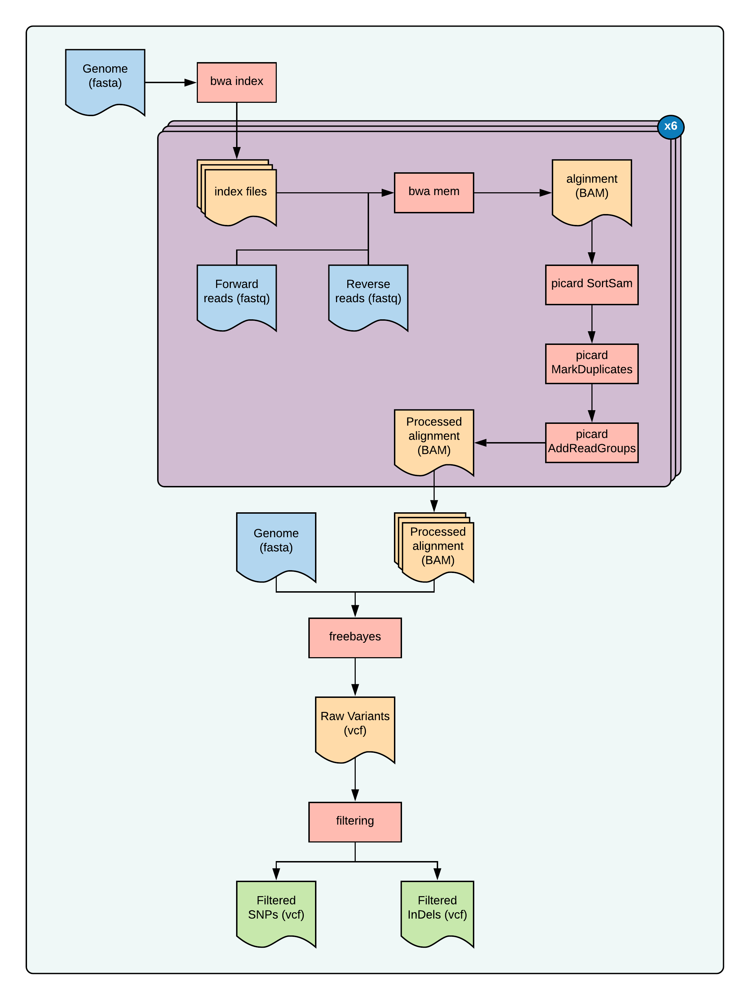
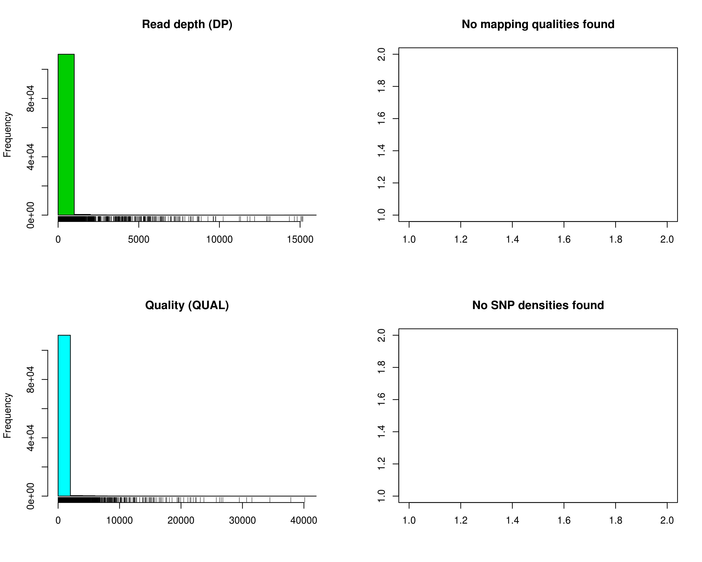
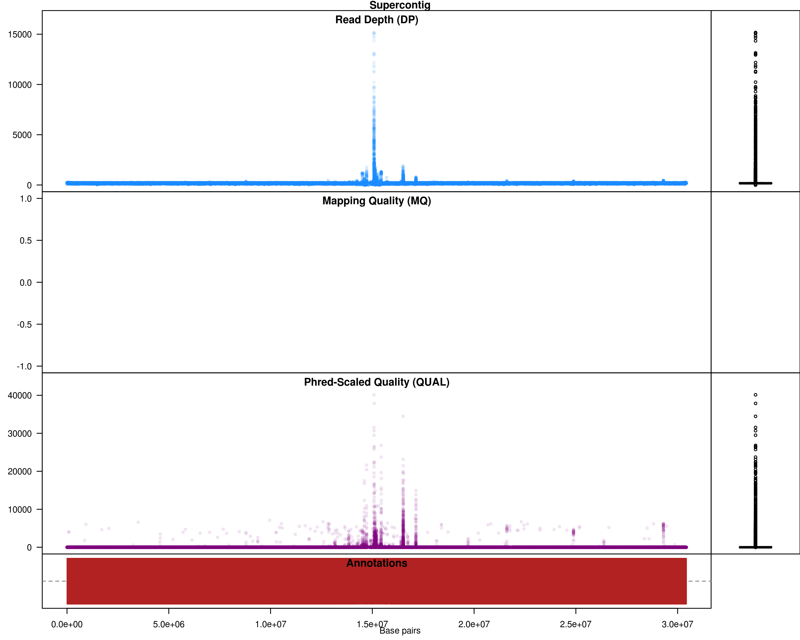
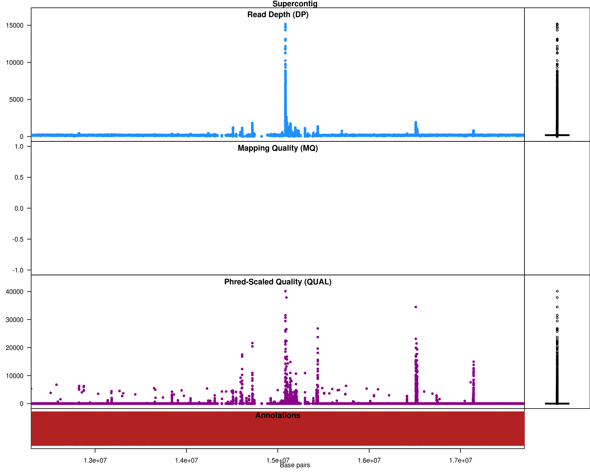

# FreeBayes variant calling workflow for DNA-Seq

## Introduction

`freebayes` is a Bayesian genetic variant detector designed to find small polymorphisms, specifically SNPs (single-nucleotide polymorphisms), indels (insertions and deletions), MNPs (multi-nucleotide polymorphisms), and complex events (composite insertion and substitution events) smaller than the length of a short-read sequencing alignment [Garrison and Marth, 2012](https://arxiv.org/abs/1207.3907)).

## Dataset

For this tutorial we will use the dataset from BioProject [PRJNA283785](https://www.ncbi.nlm.nih.gov/bioproject/PRJNA283785). This dataset has Illumina short reads for six different ecotypes of _Arabidopsis thaliana_ (`002185_Limeport-CC8070`, `002186_Limeport-CC28464`, `002187_Santa-Clara-CC8069`, `002188_Santa-Clara-CC28722`, `002189_Berkley-CC8068`, `002190_Berkley-CC28067`) and was originally used for re-evaluation of reported metal tolerance of _Arabidopsis thaliana_ accessions. These reads were sequenced on Illumina HiSeq 2000, with genomic DNA (WGS), random selection, paired layout, library strategy,


**Table 1: Dataset used for freebayes SNP calling.**

| Run        | SampleName                 | ReadPairs  | TotalBases    | ReadLength |
|:-----------|:---------------------------|------------|--------------:|-----------:|
| SRR2032874 | 002185_Limeport-CC8070     | 17,116,111 | 4,922,884,384 | 287        |
| SRR2032873 | 002186_Limeport-CC28464    | 23,125,667 | 6,639,673,875 | 287        |
| SRR2032879 | 002187_Santa-Clara-CC8069  | 16,919,754 | 4,859,908,587 | 287        |
| SRR2032877 | 002188_Santa-Clara-CC28722 | 20,847,502 | 5,994,626,199 | 287        |
| SRR2032876 | 002189_Berkley-CC8068      | 18,613,942 | 5,348,144,580 | 287        |
| SRR2032875 | 002190_Berkley-CC28067     | 17,702,502 | 5,089,062,686 | 287        |

We will download the files as follows:

`srr.ids`
```
SRR2032874
SRR2032873
SRR2032879
SRR2032877
SRR2032876
SRR2032875

```
```bash
module load sra-toolkit
module load parallel
parallel -a srr.ids prefetch --max-size 50GB
parallel -a srr.ids fastq-dump --split-files --origfmt --gzip
```

Since reference genome of _Arabidopsis_ is [available](http://plants.ensembl.org/Arabidopsis_thaliana/Info/Index) here, we will use it as reference for mapping. We will have to download the genome from the database

```bash
wget ftp://ftp.ensemblgenomes.org/pub/plants/release-44/fasta/arabidopsis_thaliana/dna/Arabidopsis_thaliana.TAIR10.dna.toplevel.fa.gz
gunzip Arabidopsis_thaliana.TAIR10.dna.toplevel.fa.gz
# for qc you will need GFF file:
wget ftp://ftp.ensemblgenomes.org/pub/plants/release-44/gff3/arabidopsis_thaliana/Arabidopsis_thaliana.TAIR10.44.gff3.gz
gunzip Arabidopsis_thaliana.TAIR10.44.gff3.gz
```

These datasets are all we need to get started. Although, the SRA download through `prefetch` is faster, it takes long time for converting `sra` file to `fastq` using `fastq-dump`. Alternatively, you can obtain and download `fastq` files directly form [European Nucleotide Archive (ENA)](https://www.ebi.ac.uk/ena/data/view/PRJEB18647). The links are saved [here](assets/ena-links.txt) if you want to use them instead (note the IDs are different, but they are from the same study and the results will be identical regardless of what data you use)

## Organization

The files and folders will be organized as follows:

```
freebayes
├── 0_index
│   └── Arabidopsis_thaliana.TAIR10.dna.toplevel.fa
├── 1_data
│   ├── SRR2032873_1.fastq.gz
│   ├── SRR2032873_2.fastq.gz
│   ├── SRR2032874_1.fastq.gz
│   ├── SRR2032874_2.fastq.gz
│   ├── SRR2032875_1.fastq.gz
│   ├── SRR2032875_2.fastq.gz
│   ├── SRR2032876_1.fastq.gz
│   ├── SRR2032876_2.fastq.gz
│   ├── SRR2032877_1.fastq.gz
│   ├── SRR2032877_2.fastq.gz
│   ├── SRR2032879_1.fastq.gz
│   ├── SRR2032879_2.fastq.gz
│   └── srr.ids
├── 2_fastqc
├── 3_mapping
├── 4_processing
├── 5_freebayes
└── 6_filtering
```

## Overview


**Fig 1: overview of this tutorial**


### Step 0: Quality check the files

Soft link the fastq files and run FASTQC on them:

```bash
cd 2_fastqc
for fq in ../1_data/*.fastq.gz; do
  ln -s $fastq
done
module load parallel
module load fastqc
parallel "fastqc {}"" ::: *.fastq
```

you can examine the results by opening each html page or you can merge them to a single report using multiqc. The data seems [satisfactory](assets/fastqc-freebayes), so we will proceed to next step.

### Step 1: Map the raw reads to the genome

```bash
cd 3_mapping
for fq in ../1_data/*.fastq.gz; do
  ln -s $fq
done
```
Make a run script for alignment:

```bash
#!/bin/bash
genome=$1
read1=$2
read2=$3
out=$(echo $2 |sed 's/_1.fastq.gz/.bam/g')
module load bwa
module load samtools
bwa mem -M -t 16 $genome $read1 $read2 | samtools view -buS - > ${out}
```
Create commands:

```bash
for r1 in *_1.fastq.gz; do
  r2=$(echo $r1 |sed 's/_1.fastq.gz/_2.fastq.gz/g')
  genome="../0_index/Arabidopsis_thaliana.TAIR10.dna.toplevel.fa"
  echo "./runBWA.sh $genome $r1 $r2" ;
done > bwa.cmds
```
make SLURM scripts and submit

```bash
makeSLURMs.py 1 bwa.cmds
for sub in *.sub; do
  sbatch $sub;
done
```

### Step 2: Process BAM files

In this step, we will sort the BAM files from previous step, add readgroups and mark duplicates in them.

Soft-link the files

```bash
cd 4_processing
for bam in ../3_mapping/*.bam; do
  ln -s $bam;
done
```

Make a run script for processing bam files

```bash
#!/bin/bash
bam=$1
name=$2
module load picard
module load samtools

picard SortSam \
      I=${bam} \
      O=${bam%.*}-sorted.bam \
      SORT_ORDER=coordinate

picard MarkDuplicates \
      I=${bam%.*}-sorted.bam \
      O=${bam%.*}-sorted-md.bam \
      M=${bam%.*}-md-metrics.txt

picard AddOrReplaceReadGroups \
      I=${bam%.*}-sorted-md.bam \
      O=${bam%.*}-sorted-md-rg.bam \
      RGID=${bam%.*} \
      RGLB=${name} \
      RGPL=illumina \
      RGPU=unit1 \
      RGSM=${name}

samtools index ${bam%.*}-sorted-md-rg.bam
```
you need a `names.txt` file with:

```
SRR2032874	Limeport-CC8070
SRR2032873	Limeport-CC28464
SRR2032879	Santa-Clara-CC8069
SRR2032877	Santa-Clara-CC28722
SRR2032876	Berkley-CC8068
SRR2032875	Berkley-CC28067
```
Now create commands:

```bash
while read a b; do
  echo "./runProcessing.sh ${a}.bam ${b}"
done > process.cmds
```

make SLURM scripts and submit

```bash
makeSLURMs.py 1 process.cmds
for sub in *.sub; do
  sbatch $sub;
done
```

Now we are ready to call SNPs on these bam files!

### Step 3a: Run freebayes (single processor mode)

Next is to run the actual variant calling program, whcih is the `freebayes`. We run this on all your processed bam files (alignment data) simultaneously. This will generate a single VCF file. The default settings should work for most use cases, but if your samples are not diploid, then you need to set the `--ploidy` and adjust the `--min-alternate-fraction` accordingly.

```bash
cd 5_freebayes
for bam in ../4_processing/*-md-rg.bam*; do
  ln -s $bam;
done
```

Make a run script for freebayes (`runFreeBayes.sh`):

```bash
#!/bin/bash
ref="../0_index/Arabidopsis_thaliana.TAIR10.dna.toplevel.fa"
module load freebayes
ls *-md-rg.bam > bam.fofn
freebayes \
  --fasta-reference ${ref} \
  --bam-list bam.fofn \
  --vcf output.vcf \
```

make SLURM scripts and submit

```bash
echo "./runFreeBayes.sh" > freebayes.cmds
makeSLURMs.py 1 freebayes.cmds
sbatch freebayes_0.sub
```

When this completes, you will have the `output.vcf` file. This is your unfiltered raw variants file.

For the files above, it took > 5hrs to complete. Because of the design, the program runs only on a single processor.

```
real    320m1.051s
user    314m49.526s
sys     0m50.473s
```
Another alternative is to run them in small chunks, a stretch of genome, at a time. Although the program does not have `threads` option, it can be trivially parallelizable.

### Step 3b: Run freebayes (processing small chunks of genome, in parallel)

Just like before, her run the freebayes but process the small chunks of genome at a time. Since freebayes can't utilize multiple processors, you can run this processing step, many at a time, finishing the analyses faster. Fortunately, the included script does all this for you!


```bash
cd 6_freebayes-parallel
for bam in ../4_processing/*-md-rg.bam*; do
  ln -s $bam;
done
```
Make a run script for freebayes (`runFreeBayesP.sh`):

```bash
#!/bin/bash
ref="../0_index/Arabidopsis_thaliana.TAIR10.dna.toplevel.fa"
module load freebayes
ls *-md-rg.bam > bam.fofn
freebayes-parallel \
   <(fasta_generate_regions.py ${ref}.fai 100000) 16 \
   --fasta-reference ${ref} \
   --bam-list bam.fofn  > output.vcf
```
make SLURM scripts and submit

```bash
echo "./runFreeBayesP.sh" > freebayes.cmds
makeSLURMs.py 1 freebayes.cmds
sbatch freebayes_0.sub
```
Time take for this step:

```
real    66m29.306s
user    467m33.650s
sys     12m4.956s
```
As you can see, this takes a fraction of time as compared to the non-parallel approach. If you have a large genome and access to large clusters, this is clearly should be the way to go!

### Step 4: filter the VCF file

In this final step, we will separate SNPs from InDels and do some plots to see how these variants are distributed. We will also do some filtering.

```bash
cd 7_filtering
ln -s ../6_freebayes-parallel/output.vcf
vcf=output.vcf
# generate stats
rtg vcfstats output.vcf > rtg_results-full.out
```


Table 1: RTG stats for the output VCF file:

| Sample_Name                   | Santa-Clara-CC8069 | Berkley-CC8068    | Santa-Clara-CC28722 | Limeport-CC28464  | Berkley-CC28067   | Limeport-CC8070   |
|:------------------------------|-------------------:|------------------:|--------------------:|------------------:|------------------:|------------------:|
| SNPs                          | 15,481             | 14,597            | 14,173              | 14,269            | 14,623            | 14899             |
| MNPs                          | 2,320              | 2,349             | 2,262               | 2,318             | 2,303             | 2347              |
| Insertions                    | 2,207              | 2,123             | 2,086               | 2,152             | 2,190             | 2208              |
| Deletions                     | 3,686              | 3,636             | 3,579               | 3,470             | 3,825             | 3619              |
| Indels                        | 481                | 484               | 451                 | 479               | 492               | 480               |
| Same_as_reference             | 462,491            | 463,551           | 464,239             | 464,105           | 463,336           | 463167            |
| Missing_Genotype              | 313                | 239               | 189                 | 186               | 210               | 259               |
| SNP_Transitions/Transversions | 1.05 (8677/8242)   | 1.07 (8278/7723)  | 1.07 (8060/7556)    | 1.07 (8086/7587)  | 1.08 (8314/7721)  | 1.06 (8373/7934 ) |
| Total_Het/Hom_ratio           | 5.66 (20547/3628)  | 5.41 (19571/3618) | 5.22 (18924/3627)   | 5.31 (19091/3597) | 5.48 (19818/3615) | 5.56 (19961/3592) |
| SNP_Het/Hom_ratio             | 9.96 (14068/1413)  | 9.55 (13214/1383) | 8.97 (12751/1422)   | 9.33 (12888/1381) | 9.51 (13232/1391) | 9.73 (13510/1389) |
| MNP_Het/Hom_ratio             | 9.69 (2103/217)    | 10.4 (2143/206)   | 9.98 (2056/206)     | 9.17 (2090/228)   | 10.13 (2096/207)  | 10.28 (2139/208)  |
| Insertion_Het/Hom_ratio       | 0.86 (1022/1185)   | 0.76 (919/1204)   | 0.77 (908/1178)     | 0.81 (964/1188)   | 0.84 (1003/1187)  | 0.86 (1024/1184)  |
| Deletion_Het/Hom_ratio        | 4.34 (2996/690)    | 4.16 (2932/704)   | 4.09 (2876/703)     | 4.15 (2796/674)   | 4.42 (3119/706)   | 4.24 (2929/690)   |
| Indel_Het/Hom_ratio           | 2.91 (358/123)     | 3.00 (363/121)    | 2.82 (333/118)      | 2.8 (353/126)     | 2.97 (368/124)    | 2.97 (359/121)    |
| Insertion/Deletion_ratio      | 0.60 (2207/3686)   | 0.58 (2123/3636)  | 0.58 (2086/3579)    | 0.62 (2152/3470)  | 0.57 (2190/3825)  | 0.61 (2208/3619)  |
| Indel/SNP+MNP_ratio           | 0.36 (6374/17801)  | 0.37 (6243/16946) | 0.37 (6116/16435)   | 0.37 (6101/16587) | 0.38 (6507/16926) | 0.37 (6307/17246) |

Next, we will perform some filtering. But first, more QC

```bash
# separate indels
vcftools --vcf $vcf --keep-only-indels --recode --recode-INFO-all --out output_indels-only.vcf
# separate SNPs
vcftools --vcf $vcf --remove-indels --recode --recode-INFO-all --out output_snps-only.vcf
```

QC plots:

```bash
ln -s ../0_index/Arabidopsis_thaliana.TAIR10.44.gff3
ln -s ../0_index/Arabidopsis_thaliana.TAIR10.dna.toplevel.fa
```

```r
library(vcfR)
vcf <- read.vcfR( "output_snps-only.vcf.recode.vcf", verbose = FALSE )
dna <- ape::read.dna("Arabidopsis_thaliana.TAIR10.dna.toplevel.fa", format = "fasta")
gff <- read.table("Arabidopsis_thaliana.TAIR10.44.gff3", sep="\t", quote="")
chrom <- create.chromR(name='Supercontig', vcf=vcf, seq=dna, ann=gff)
png("quality.png", width = 10, height = 8, units = 'in', res = 300)
plot(chrom)
dev.off()
png("dotplots1.png", width = 10, height = 8, units = 'in', res = 300)
chromoqc(chrom, dp.alpha=20)
dev.off()
png("dotplot2.png", width = 10, height = 8, units = 'in', res = 300)
chromoqc(chrom, xlim=c(1.25e+07, 1.75e+07))
dev.off()
```

The plots:



**Fig 2: SNP quality distribution**


**Fig 3: SNPs across the genome, with DP and quality values**


**Fig 3: SNPs across the genome, with DP and quality values (zoomed in)**


Based on the plots, the lines compared here are very similar to reference and they only differ in a small section of genome. The number of SNPs is very less as a result. No filtering is necessary, but if you wish to do some filtering:


```bash
module load vcftools
vcf=output_snps-only.vcf.recode.vcf
vcftools --vcf $vcf \
   --max-missing 1 \
   --mac 3 \
   --minQ 30 \
   --recode \
   --recode-INFO-all \
   --out output_snps-only_max_missing_1_mac_3_minq_30
```
stdout
```
VCFtools - 0.1.14
(C) Adam Auton and Anthony Marcketta 2009

Parameters as interpreted:
        --vcf output_snps-only.vcf.recode.vcf
        --recode-INFO-all
        --mac 3
        --minQ 30
        --max-missing 1
        --out output_snps-only_max_missing_1_mac_3_minq_30
        --recode

After filtering, kept 6 out of 6 Individuals
Outputting VCF file...
After filtering, kept 7871 out of a possible 449822 Sites
Run Time = 4.00 seconds
```

After filtering, you have 7871 SNPs that are present in all individuals and are non-monomorphic.
