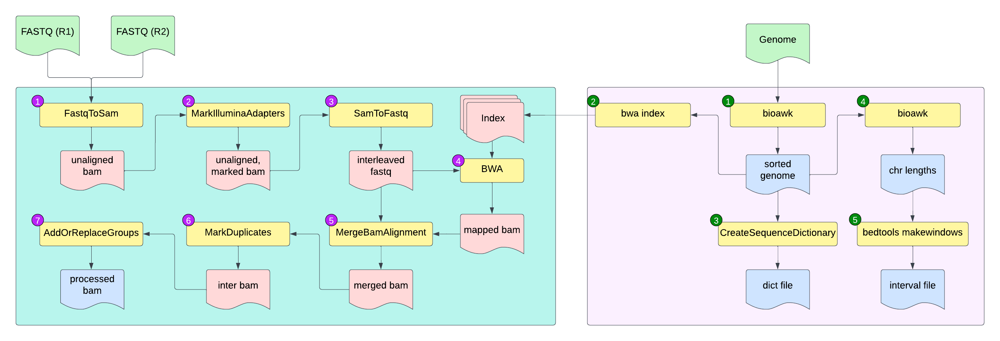

# GATK Best Practices Workflow for DNA-Seq

## Introduction

Link Andrew's GATK introduction here or borrow his text.

## Dataset

For this tutorial we will use the dataset from BioProject [PRJEB18647](https://www.ncbi.nlm.nih.gov/bioproject/PRJEB18647). This dataset has Illumina short reads for four different populations of _Arabidopsis halleri_ subsp. _halleri_ (Aha18, AhaN1, AhaN3, AhaN4) and was originally used for estimating genomic diversity and population differentiation for these 4 populations ([Fischer _et. al_.,](https://bmcgenomics.biomedcentral.com/articles/10.1186/s12864-016-3459-7)).

**Table 1: Dataset used for GATK SNP calling.**

| Name  | ReadLength | InsertSize | MBases | SRR-id      | Genotype               |
|-------|------------|------------|--------|------------|-------------------------|
| Aha18 | 202        | 250        | 21,368 | ERR1760144 | _A. halleri_ pop. Aha18 |
| AhaN1 | 200        | 150        | 30,136 | ERR1760145 | _A. halleri_ pop. AhaN1 |
| AhaN3 | 200        | 150        | 29,631 | ERR1760146 | _A. halleri_ pop. AhaN3 |
| AhaN4 | 200        | 150        | 31,242 | ERR1760147 | _A. halleri_ pop. AhaN4 |

We will download the files as follows:

`srr.ids`
```
ERS1475237
ERS1475238
ERS1475240
ERS1475241
```
```bash
module load sra-toolkit
module load parallel
parallel -a srr.ids prefetch --max-size 50GB
parallel -a srr.ids fastq-dump --split-files --origfmt --gzip
```

Since reference genome for this species of _Arabidopsis_ is [available](https://www.ncbi.nlm.nih.gov/pubmed/27671113), we will use it as reference. We will have to download the genome from the database

```bash
wget ftp://ftp.ensemblgenomes.org/pub/plants/release-43/fasta/arabidopsis_halleri/dna/Arabidopsis_halleri.Ahal2.2.dna.toplevel.fa.gz
gunzip Arabidopsis_halleri.Ahal2.2.dna.toplevel.fa.gz
```

These datasets are all we need to get started. Although, the SRA download through `prefetch` is faster, it takes long time for converting `sra` file to `fastq` using `fastq-dump`. Alternatively, you can obtain and download `fastq` files directly form [European Nucleotide Archive (ENA)](https://www.ebi.ac.uk/ena/data/view/PRJEB18647). The links are saved [here](assets/ena-links.txt) if you want to use them instead (note the IDs are different, but they are from the same study and the results will be identical regardless of what data you use)

## Organization

The files and folders will be organized as follows:

```
├── 0_index
│   └── Arabidopsis_halleri.Ahal2.2.dna.toplevel.fa
├── 1_data
│   ├── ERR1760144_1.fastq
│   ├── ERR1760144_2.fastq
│   ├── ERR1760145_1.fastq
│   ├── ERR1760145_2.fastq
│   ├── ERR1760146_1.fastq
│   ├── ERR1760146_2.fastq
│   ├── ERR1760147_1.fastq
│   ├── ERR1760147_2.fastq
│   └── srr.ids
├── 2_fastqc
├── 3_pre-processing
├── 4_gatk-round-1
├── 5_recalibration
├── 6_gatk_round-2
└── 7_filtering
```

## Workflow



Fig 1: Overview of this tutorial

### Step 0: Quality check the files

Soft link the fastq files and run FASTQC on them:

```bash
cd 2_fastqc
for fq in ../1_data/*.fastq; do
  ln -s $fastq
done
module load parallel
parallel "fastqc {}"" ::: *.fastq
```
you can examine the results by opening each html page or you can merge them to a single report using multiqc. The data seems [satisfactory](assets/fastqc), so we will proceed to next step.

### Step 1: Getting the files ready for GATK

We will need the `bwa` index files and windows for processing small chunks of the genome in parallel.

`gatk0_index.sh`

```bash
#!/bin/bash
# script to prepare reference genome for GATK snp calling
# indexes for BWA mapping porgram
# generates windows
# Arun Seetharam
# 5/16/2019

if [ $# -ne 2 ] ; then
   echo -e "usage: $(basename "$0") <genome.fasta> <name>"
   echo ""
   echo -e "\tgenome.fasta:\tFASTA formatted reference genome"
   echo -e "\tname:\tsmall name for easy reference management, any argument will suffice, must be one word"
   echo ""
   exit 0
fi

module load samtools
module load picard
module load bwa
module load bedtools2
module load bioawk
ref="$1"
name="$2"
window=10000000
bioawk -c fastx '{print}' $ref | sort -k1,1V | awk '{print ">"$1;print $2}' | fold > ${name}.fasta
picard CreateSequenceDictionary REFERENCE=${name}.fasta OUTPUT=${name}.dict
bwa index -a bwtsw ${name}.fasta
bioawk -c fastx '{print $name"\t"length($seq)}' ${name}.fasta > ${name}.length
bedtools makewindows -w $window -g ${name}.length |\
   awk '{print $1"\t"$2+1"\t"$3}' |\
   sed 's/\t/:/1' |\
   sed 's/\t/-/1' > ${name}_coords.bed
```

run this as:

```bash
gatk0_index.sh Arabidopsis_halleri.Ahal2.2.dna.toplevel.fa ahalleri
```

<details>
  <summary>stdout for index step</summary>

  ```
  13:18:02.958 INFO  NativeLibraryLoader - Loading libgkl_compression.so from jar:file:/opt/rit/spack-app/linux-rhel7-x86_64/gcc-4.8.5/picard-2.17.0-ft5qztzntoymuxiqt3b6yi6uqcmgzmds/bin/picard.jar!/com/intel/gkl/native/libgkl_compression.so
  [Thu May 16 13:18:03 CDT 2019] CreateSequenceDictionary OUTPUT=ahalleri.dict REFERENCE=ahalleri.fasta    TRUNCATE_NAMES_AT_WHITESPACE=true NUM_SEQUENCES=2147483647 VERBOSITY=INFO QUIET=false VALIDATION_STRINGENCY=STRICT COMPRESSION_LEVEL=5 MAX_RECORDS_IN_RAM=500000 CREATE_INDEX=false CREATE_MD5_FILE=false GA4GH_CLIENT_SECRETS=client_secrets.json USE_JDK_DEFLATER=false USE_JDK_INFLATER=false
  [Thu May 16 13:18:03 CDT 2019] Executing as arnstrm@novadtn.its.iastate.edu on Linux 3.10.0-957.1.3.el7.x86_64 amd64; Java HotSpot(TM) 64-Bit Server VM 1.8.0_141-b15; Deflater: Intel; Inflater: Intel; Picard version: 2.17.0-SNAPSHOT
  [Thu May 16 13:18:05 CDT 2019] picard.sam.CreateSequenceDictionary done. Elapsed time: 0.05 minutes.
  Runtime.totalMemory()=2058354688
  [bwa_index] Pack FASTA... 1.56 sec
  [bwa_index] Construct BWT for the packed sequence...
  [BWTIncCreate] textLength=392486396, availableWord=39616672
  [BWTIncConstructFromPacked] 10 iterations done. 65350012 characters processed.
  [BWTIncConstructFromPacked] 20 iterations done. 120730156 characters processed.
  [BWTIncConstructFromPacked] 30 iterations done. 169948156 characters processed.
  [BWTIncConstructFromPacked] 40 iterations done. 213689196 characters processed.
  [BWTIncConstructFromPacked] 50 iterations done. 252562300 characters processed.
  [BWTIncConstructFromPacked] 60 iterations done. 287108828 characters processed.
  [BWTIncConstructFromPacked] 70 iterations done. 317809836 characters processed.
  [BWTIncConstructFromPacked] 80 iterations done. 345092924 characters processed.
  [BWTIncConstructFromPacked] 90 iterations done. 369338156 characters processed.
  [BWTIncConstructFromPacked] 100 iterations done. 390883356 characters processed.
  [bwt_gen] Finished constructing BWT in 101 iterations.
  [bwa_index] 111.44 seconds elapse.
  [bwa_index] Update BWT... 1.14 sec
  [bwa_index] Pack forward-only FASTA... 0.99 sec
  [bwa_index] Construct SA from BWT and Occ... 53.53 sec
  [main] Version: 0.7.17-r1188
  [main] CMD: bwa index -a bwtsw ahalleri.fasta
  [main] Real time: 169.534 sec; CPU: 168.677 sec
  ```
</details>


### Step 2: Preprocessing the fastq files

For handling purpose, we will rename the files to their respective population name and run it through the processing step that process the fastq files, algins and gets them read for variant calling.

`id-names.txt`
```
Aha18	ERR1760144
AhaN1	ERR1760145
AhaN3	ERR1760146
AhaN4	ERR1760147
```

```bash
While read a b; do
  ln -s $(pwd)/1_data/${b}_1.fastq 3_pre-processing/${a}_R1.fastq
  ln -s $(pwd)/1_data/${b}_1.fastq 3_pre-processing/${a}_R1.fastq
done<id-names.txt
```
generate commands and run the `gatk2_preprocess.sh` script

```bash
cd 3_pre-processing
for fq in *_R1.fastq; do
  echo "./gatk2_preprocess.sh /work/LAS/mhufford-lab/arnstrm/ler/0_index/ahalleri.fasta $fq $(echo $fq |sed 's/_R1/_R2/g')"
done > process.cmds
makeSLURMs.py 1 process.cmds
for sub in *.sub; do
  sbatch $sub;
done
```

the script:
`gatk2_preprocess.sh`
```bash
#!/bin/bash
# script to prepare fastq files for GATK snp calling
# Arun Seetharam
# 5/16/2019
if [ $# -ne 3 ] ; then
   echo -e "usage: $(basename "$0") <reference> <read R1> <read R2>"
   echo ""
   echo -e "\treference:\tindexed reference genome (full path)-short name in indexing script is fine"
   echo -e "\tR1:\t forward read"
   echo -e "\tR2:\t reverse read"
   echo ""
   exit 0
fi
module load picard
module load bwa
module load samtools
ulimit -c unlimited
REF=$1
R1=$2
R2=$3
# adjust this to suit your input file name
OUT=$(echo $R1 |cut -f 1-3 -d "_")
PICARD_HOME=$(dirname $(which picard))
PICARD_CMD="java -Xmx100g -Djava.io.tmpdir=$TMPDIR -jar ${PICARD_HOME}/picard.jar"

# platform id from fastq file
if [ ${R1: -3} == ".gz" ]; then
   PLT=$(zcat $R1 |head -n 1 |cut -f 3 -d ":")
   RGPU=$(zcat $R1 |head -n 1 |cut -f 3-5 -d ":")
else
   PLT=$(cat $R1 |head -n 1 |cut -f 3 -d ":")
   RGPU=$(cat $R1 |head -n 1 |cut -f 3-5 -d ":")
fi

# time stamp as string of numbers
TDATE=$(date '+%Y-%m-%d %H:%M:%S' |sed 's/ /T/g')
# read group identifier, should be unique, usually genotype name
RGID=$(echo $R1 |cut -f 1-3 -d "_")
#  library identifier
RGLB="$RGID"
# platform name choose either ILLUMINA, SOLID, LS454, HELICOS and PACBIO
RGPL="ILLUMINA"
# genotype name, this will appear in VCF file header
RGSM="$RGID"
# convert fastq to sam and add readgroups
$PICARD_CMD FastqToSam \
   FASTQ=${R1} \
   FASTQ2=${R2} \
   OUTPUT=${OUT}_fastqtosam.bam \
   READ_GROUP_NAME=${OUT} \
   SAMPLE_NAME=${OUT}_name \
   LIBRARY_NAME=${OUT}_lib \
   PLATFORM_UNIT=${PLT} \
   PLATFORM=illumina \
   SEQUENCING_CENTER=ISU \
   RUN_DATE=${TDATE}  || {
echo >&2 ERROR: FastqToSam failed for $OUT
exit 1
}
# marking adapters
$PICARD_CMD MarkIlluminaAdapters \
   I=${OUT}_fastqtosam.bam \
   O=${OUT}_markilluminaadapters.bam \
   M=${OUT}_markilluminaadapters_metrics.txt \
   TMP_DIR=${TMPDIR}  || {
echo >&2 ERROR: MarkIlluminaAdapters failed for $OUT
exit 1
}
# convert bam back to fastq for mapping
$PICARD_CMD SamToFastq \
   I=${OUT}_markilluminaadapters.bam \
   FASTQ=${OUT}_samtofastq_interleaved.fq \
   CLIPPING_ATTRIBUTE=XT \
   CLIPPING_ACTION=2 \
   INTERLEAVE=true NON_PF=true TMP_DIR=${TMPDIR} || {
echo >&2 ERROR: SamToFastq failed for $OUT
exit 1
}
# mapping reads to indexed genome
bwa mem \
   -M \
   -t 15 \
   -p $REF \
   ${OUT}_samtofastq_interleaved.fq |\
  samtools view -buS - > ${OUT}_bwa_mem.bam || {
echo >&2 ERROR: BWA failed for $OUT
exit 1
}
# merging alignments
$PICARD_CMD MergeBamAlignment \
   R=$REF \
   UNMAPPED_BAM=${OUT}_fastqtosam.bam \
   ALIGNED_BAM=${OUT}_bwa_mem.bam \
   O=${OUT}_snippet_mergebamalignment.bam \
   CREATE_INDEX=true \
   ADD_MATE_CIGAR=true CLIP_ADAPTERS=false \
   CLIP_OVERLAPPING_READS=true \
   INCLUDE_SECONDARY_ALIGNMENTS=true \
   MAX_INSERTIONS_OR_DELETIONS=-1 \
   PRIMARY_ALIGNMENT_STRATEGY=MostDistant \
   ATTRIBUTES_TO_RETAIN=XS \
   TMP_DIR="${TMPDIR}" || {
echo >&2 ERROR: MergeBamAlignment failed for $OUT
exit 1
}
# mark duplicates
$PICARD_CMD MarkDuplicates \
  INPUT=${OUT}_snippet_mergebamalignment.bam \
  OUTPUT=${OUT}_prefinal.bam \
  METRICS_FILE=${OUT}_mergebamalignment_markduplicates_metrics.txt \
  OPTICAL_DUPLICATE_PIXEL_DISTANCE=2500 \
  CREATE_INDEX=true \
  TMP_DIR=$TMPDIR || {
echo >&2 ERROR: MarkDuplicates failed for $OUT
exit 1
}
# add read groups
$PICARD_CMD AddOrReplaceReadGroups \
  INPUT=${OUT}_prefinal.bam \
  OUTPUT=${OUT}_final.bam \
  RGID=${RGID} \
  RGLB=${RGLB} \
  RGPL=${RGPL} \
  RGPU=${RGPU} \
  RGSM=${RGSM} \
  CREATE_INDEX=true \
  TMP_DIR=$TMPDIR || {
echo >&2 ERROR: Adding read groups failed for $OUT
exit 1
}
echo >&2 "ALL DONE!"
# cleanup
rm ${OUT}_fastqtosam.bam
rm ${OUT}_markilluminaadapters.bam
rm ${OUT}_samtofastq_interleaved.fq
rm ${OUT}_bwa_mem.bam
rm ${OUT}_snippet_mergebamalignment.bam
rm ${OUT}_snippet_mergebamalignment.bai
```

At the end of this step, you will have the following files as output:

```
Aha18_final.bam
AhaN1_final.bam
AhaN4_final.bam
AhaN3_final.bam
```

### Step 3: GATK round 1 variant calling

At this step, you will need the indexed genome and interval list (`coords.bed`)  from the `Step 0`. Running the script will generate the commands that you will need to submit as slurm script as before.

Before starting, setup the files/folders as follows:
```bash
cd 4_gatk-round-1
for finalbam in ../3_pre-processing/*_final.ba?; do
  ln -s $finalbam
done
```
The `gatk3_cmdsgen.sh` is as follows:

```bash
#!/bin/bash
# script to generate GATK commands for snp calling
# gatk haplotype caller
# for each windows specified
# Arun Seetharam
# 5/16/2019

if [ $# -lt 3 ] ; then
   echo -e "usage: $(basename "$0") <windows bed file> <genome fasta file> <regex for bam files>"
   echo ""
   echo -e "\twindows.bed:\tBED formatted reference intervals to call SNPs"
   echo -e "\tgenome.fasta:\tFASTA formatted reference genome"
   echo -e "\tfinal.bam files:\tBAM formatted final files from processing step"
   echo ""
   exit 0
fi

unset -v bamfiles
list="$1"
bamfiles=(*"${3}")
REF="$3"

for bam in ${bamfiles[@]}; do
echo -en "-I ${bam} ";
done > CombinedBAM_temp


while read line; do
if ! [[ $line == @* ]]; then
g2=$(echo $line | awk '{print $1":"$2"-"$3}'); \
g1=$(echo $line | awk '{print $1"_"$2"_"$3}'); \
CWD=$(pwd)
echo "gatk --java-options \"-Xmx80g -XX:+UseParallelGC\" HaplotypeCaller -R ${REF} $(cat CombinedBAM_temp) -L "${g2}" --output "${g1}".vcf;";
fi
done<${list}
```

Run this script as:

```bash
gatk3_cmdsgen.sh ../0_index/ahalleri_coords.bed ../0_index/ahalleri.fasta *final.bam > gatk.cmds
```
This will generate `2239` commands (one gatk command per interval). Since the GATK 4 cannot use multiple threads, you can run one job per thread and thus fit multiple jobs in a single node. Using multiple nodes, you can run these commands much faster than running a single command on a bigger interval or a whole genome.

Before, you ran `makeSLURMs.py` script. This job runs the commands serially. Another script `makeSLURMp.py` also does the same thing, but instead it runs the command in parallel. We will use that and specify how many jobs we want to run. To split them

```bash
makeSLURMp.py 220 gatk.cmds
# some fixing is needed to make sure that it runs the right number of jobs
# and then submit
for sub in *.sub; do
  sed -i 's/parallel -j 1 --joblog/parallel -j 18 --joblog/g' $sub;
  sbatch $sub;
done
```
This will run 18 jobs at time and 220 jobs total, per node. Upon completion, you will see many VCF file (2239 total) and its associated index files (idx)

Next step is to merge and perform filtering on these variants to use them to re-calibrate the bam files. The re-calibrated bam files will be then used for calling variants in the similar fashion.

Run the `gatk4_filter.sh` for merging, filtering and cleaning-up files

```bash
#!/bin/bash
# script to filter snps
# gatk tutorial
# Arun Seetharam
# 5/16/2019

merged=merged
#change name as you wish
ref=$1
if [ $# -lt 1 ] ; then
   echo -e "usage: $(basename "$0")  <genome fasta file>"
   echo ""
   echo -e "\tgenome.fasta:\tFASTA formatted reference genome"
   echo ""
   exit 0
fi
module load vcftools
module load GIF/datamash
module load gatk
module load bcftools
mkdir -p vcffiles idxfiles
# merge vcf files
mv *.vcf ./vcffiles
mv *.idx ./idxfiles
cd vcffiles
vcf=(*.vcf)
module load parallel
parallel "grep -v '^#' {}" ::: *.vcf >> ../${merged}.body
grep "^#" ${vcf[1]} > ../${merged}.head
cd ..
cat ${merged}.head ${merged}.body >> ${merged}.vcf
cat ${merged}.vcf | vcf-sort -t $TMPDIR -p 36 -c > ${merged}_sorted.vcf
# calculate stats
bcftools stats ${merged}_sorted.vcf > ${merged}_sorted.vchk
plot-vcfstats ${merged}_sorted.vchk -p plots/
maxdepth=$(grep -oh ";DP=.*;" ${merged}_sorted.vcf | cut -d ";" -f 2 | cut -d "="  -f 2 | datamash mean 1 sstdev 1 | awk '{print $1+$2*5}')
# separate SNPs and INDELs
vcftools --vcf ${merged}_sorted.vcf --keep-only-indels --recode --recode-INFO-all --out ${merged}_sorted-indels.vcf
vcftools --vcf ${merged}_sorted.vcf --remove-indels --recode --recode-INFO-all --out ${merged}_sorted-snps.vcf
gatk --java-options \"-Xmx80g -XX:+UseParallelGC\" VariantFiltration \
    --reference $ref \
    --variant ${merged}_sorted-snps.vcf \
    --filter-expression "QD < 2.0 || FS > 60.0 || MQ < 45.0 || MQRankSum < -12.5 || ReadPosRankSum < -8.0 || DP > ${maxdepth}" \
    --filter-name "FAIL" \
    --output ${merged}_filtered-snps.vcf
gatk --java-options \"-Xmx80g -XX:+UseParallelGC\" VariantFiltration \
    --reference $ref \
    --variant ${merged}_sorted-indels.vcf \
    --filter-expression "QD < 2.0 || FS > 200.0 || ReadPosRankSum < -20.0" \
    --filter-name "FAIL" \
    --output ${merged}_filtered-indels.vcf
```

Run this script as:

```bash
cd 4_gatk-round-1
gatk4_filter.sh ../0_index/ahalleri.fasta
```

After completion, you will have the first round results for SNP calling. Technically, this can be used as results, the best practices recommend that you run another round of SNP calling using this results to calibrate the original BAM files.

The main results from this script are:

```
merged_filtered-snps.vcf
merged_filtered-indels.vcf
```

### Step 4: Variant Recalibration

As mentioned before, we will run the recalibration of each BAM file with the script `gatk5_bsqr.sh` in `5_recalibration` folder.

```bash
#!/bin/bash
# script to bsqr for SNP calling
# gatk SNP calling tutorial
# Arun Seetharam
# 5/16/2019
if [ $# -lt 3 ] ; then
   echo -e "usage: $(basename "$0") <genome file> <VCF file> <bam file>"
   echo ""
   echo -e "\tgenome.fasta:\tFASTA formatted reference genome"
   echo -e "\tvcffile:\tVCF format first round filtered SNPs, you can also use known SNPs from other sources as well"
   echo -e "\tfinal.bam files:\tBAM formatted final files from processing step"
   echo ""
   exit 0
fi
module load gatk
module load r-geneplotter
REF="$1"
FRVCF="$2"
IBAM="$3"
OBAM=$(basename ${IBAM} | sed 's/_final.bam//g')

gatk BaseRecalibrator \
   --reference $REF \
   --input $IBAM \
   --known-sites ${FRVCF} \
   --output ${OBAM}_bef-R1.table

gatk ApplyBQSR \
   --reference $REF \
   --input $IBAM \
   --output ${OBAM}_recal.bam \
   --bqsr-recal-file ${OBAM}_bef-R1.table

gatk BaseRecalibrator \
   --reference $REF \
   --input ${OBAM}_recal.bam \
   --known-sites ${FRVCF} \
   --output ${OBAM}_aft-R1.table

gatk AnalyzeCovariates \
   -before ${OBAM}_bef-R1.table \
   -after ${OBAM}_aft-R1.table \
   -plots ${OBAM}-AnalyzeCovariates.pdf
```

Now, create commands and slurm submission script to run them on each BAM file

```bash
cd 5_recalibration
for bam in ../3_pre-processing/*final.bam; do
  ln -s $bam
done
for bam in *_final.bam; do
  echo "./GATK_06_BSQR.sh $bam"
done > bsqr.cmds
makeSLURMs.py 1 bsqr.cmds
for sub in bsqr_?.sub; do
  sbatch $sub;
done
```

upon completion, you will have BAM files with `_recal.bam` suffix. You will need to rerun the entire process of `step 3` using these files.


### Step 5: GATK round 2 variant calling

We will now move to folder `6_gatk_round-2` and re-run the GATK SNPcalling. You can easily reuse all the SLURM scripts that you generated in the step3

Organize:

```bash
cd 6_gatk_round-2
for recalbam in ../5_recalibration/*_recal.ba?; do
  ln -s $recalbam
done
```
Next, run the commands generator script:

```bash
gatk3_cmdsgen.sh ../0_index/ahalleri_coords.bed ../0_index/ahalleri.fasta *recal.bam > gatk.cmds
```
This will generate `2239` commands (one gatk command per interval).

```bash
makeSLURMp.py 220 gatk.cmds
# some fixing is needed to make sure that it runs the right number of jobs
# and then submit
for sub in *.sub; do
  sed -i 's/parallel -j 1 --joblog/parallel -j 18 --joblog/g' $sub;
  sbatch $sub;
done
```
Once all the jobs complete, run filtering script:

```bash
cd 6_gatk_round-2
gatk4_filter.sh ../0_index/ahalleri.fasta
```

The will create final results for SNP calling:

```
merged_filtered-snps.vcf
merged_filtered-indels.vcf
```
