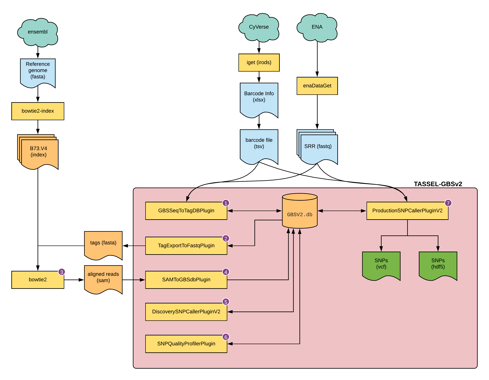

# SNP calling for GBS data using Tassel pipeline

## Introduction
Genotyping-by-sequencing (GBS) is a technique that allows to rapidly detect nucleotide variation  across the whole genome. This allows to genotype large number of individuals, simultaneously, at a very low cost as this is a reduced representation of the genome. It can work with or without a reference genome, and easily generates large number of useful information for these individuals at population level.

## Dataset
In this tutorial, we will use NAM population GBS data generated by _[Rodgers-Melnick et al.](http://dx.doi.org/10.1073/pnas.1413864112)_. This GBS data is collected from 5000 RIL individuals belonging to NAM population (25 diverse maize lines crossed to B73). Originally, SNPs were called using B73 V3 genome and the results were used for various purposes. Since there is more latest version of the genome, we can replicate the same analyses, using Tassel. Note that there is also a tutorial for the same dataset using Stacks instead, accessible here. We will only be usign command-line version of the Tassel for this exercise.

The dataset for this GBS is available on NCBI [SRP009896](https://www.ncbi.nlm.nih.gov/sra/?term=SRP009896) and there are 91 SRRs associated with it. [The metadata for these SRRs](http://cbsusrv04.tc.cornell.edu/users/panzea/download.aspx?filegroupid=4) are available on CyVerse Data Commons, at this location:
```
/iplant/home/shared/panzea/genotypes/GBS/v27/
```
Specifically, you will need `AllZeaGBSv2.7_publicSamples_metadata20140411.xlsx` file present in that directory. This file is essential not only to demultiplex the SRR data you download, but also, if you are interested in doing downstream analyses it will tell the sample pedigree information.

## Organization

```
tassel/
├── 0_genome
├── 1_data
└── 2_rundir
```
 The organization is simple in this case as we will run all the steps in single directory.

 ## Programs required

 1. Tassel
 2. NCBI-edirect
 3. enaBrowserTools
 4. BWA
 5. samtools
 6. Picard
 7. VCFTools

 ## Overview

 
 **Fig 1: overview of this tutorial**


 ### Fastq

 First, download the 91 SRR datasets from the SRA database. For this you can use the `NCBI-edirect` package to obtain the list of SRRs and then `enaBrowserTools` to download them.

 ```bash
 cd tassel/1_data
 esearch -db sra -query SRP009896  |\
   efetch --format runinfo |\
   cut -d , -f 1 |\
   awk 'NF>0' |\
   grep -v Run > srr.ids
 while read line; do
   enaDataGet -f fastq -a $line;
 done<srr.ids
 ```
 This will generate 91 folders with single fastq (compressed) file each.

 ### Barcodes

 From the [spreadsheet](http://cbsusrv04.tc.cornell.edu/users/panzea/download.aspx?filegroupid=4) downloaded, you will need to extract the required information (`flowcell`, `lane`, `barcode`, and `samplename`) and generate a simple text file.  You can use the SRR id for the flowcell to make the analyses simpler. If you have the same `samplename` Since there will be samples with same `samplename` in multiple SRR files, we need to process them separately. The combined, extracted, and cleaned barcode file is provided here in its [final form](assets/barcodes-gbs-data.tsv) for reference. If you have your own data, it is essential that you create the barcode file in similar format. This file is placed in `2_rundir` directory and it will be split into multiple files based on SRR ids.

 Before proceeding, we need to make sure that the data input has the right name and extension for Tassel to recognize it as a valid input. Instead of changing the names for the files we downloaded or instead of making a copy of all the files, we will simply softlink them with the right name and provide that as input instead.   

```bash
cd 2_rundir
cut -f 1,2 barcodes-gbs-data.tsv | sort | uniq  > uniq-names.txt
while read a b; do
  ln -s ../../a_data/${a}.fastq.gz ${a}_${b}_fastq.txt.gz;
done<uniq-names.txt
```

The file `barcodes-gbs-data.tsv` needs to have header to be correctly read by the Tassel, so we will add that next:

```bash
echo -e "Flowcell\tLane\tBarcode\tFullSampleName" > header
cat header barcodes-gbs-data.tsv >> barcode-for-tassel.tsv
```

### Genome

B73 version 4 from Gramene, download and BWA index:

```bash
cd tassel/0_genome
wget ftp://ftp.gramene.org/pub/gramene/CURRENT_RELEASE/fasta/zea_mays/dna/Zea_mays.B73_RefGen_v4.dna.toplevel.fa.gz
gunzip Zea_mays.B73_RefGen_v4.dna.toplevel.fa.gz
ml bowtie2
bowtie2-build Zea_mays.B73_RefGen_v4.dna.toplevel.fa B73.v4
```
## Tassel

### 1. GBSSeqToTagDBPlugin

GBSSeqToTagDBPlugin takes fastQ files as input, identifies tags and the taxa in which they appear, and stores this data to a local database. It keeps only good reads having a barcode and a cut site and no N’s in the useful part of the sequence. It trims off the barcodes and truncates sequences that (1) have a second cut site, or (2) read into the common adapter.

script `runTassel_0.sh`
```bash
ml tassel
cwd=$(pwd)
barcodes=${cwd}/barcode-for-tassel.tsv
db=${cwd}/GBSV2.db
run_pipeline.pl -Xms100G -Xmx180G -fork1 -GBSSeqToTagDBPlugin \
   -e ApeKI \
   -i ${cwd} \
   -db ${db} \
   -k ${barcodes}  \
   -kmerLength 33 \
   -minKmerL 11 \
   -mnQS 20 \
   -mxKmerNum 1000000000 \
   -endPlugin \
   -runfork1
```
Create job and submit:

```bash
echo "./runTassel_0.sh" > tassel_0.cmds
makeSLURMs.py 1 tassel_0.cmds
sbatch tassel_0_0.sub
```

The output for this step is `GBSV2.db` database file.

### 2. TagExportToFastqPlugin

TagExportToFastqPlugin retrieves distinct tags stored in the database and reformats them to a FASTQ file that can be read by the Bowtie2 or BWA aligner program.

script `runTassel_1.sh`
```bash
ml tassel
cwd=$(pwd)
barcodes=${cwd}/barcode-for-tassel.tsv
db=${cwd}/GBSV2.db
run_pipeline.pl -Xms100G -Xmx180G -fork1 -TagExportToFastqPlugin \
 -db ${db} \
 -o ${cwd}/tagsForAlign.fa.gz \
 -c 1 \
 -endPlugin \
 -runfork1
```
Create job and submit:

```bash
echo "./runTassel_1.sh" > tassel_1.cmds
makeSLURMs.py 1 tassel_1.cmds
sbatch tassel_1_0.sub
```

The output form this step is `tagsForAlign.fa.gz` file (compressed fasta file).

### 3. Alignment

Any alignment method can be used. Here we use BowTie2

script `runBowtie2.sh`

```bash
ml bowtie2
cwd=$(pwd)
barcodes=${cwd}/barcode-for-tassel.tsv
db=${cwd}/GBSV2.db
btindex="/work/LAS/mhufford-lab/arnstrm/tassel/0_genome/B73.v4"
bowtie2 -p 36 --very-sensitive -x ${btindex} -U ${cwd}/tagsForAlign.fa.gz -S tagsForAlignFullvs.sam
SAM="tagsForAlignFullvs.sam"
samtools view --threads 36 -b -o ${SAM%.*}.bam ${SAM}
samtools sort -o ${SAM%.*}_sorted.bam -T ${SAM%.*}_temp --threads 36 ${SAM%.*}.bam
```

Create job and submit:

```bash
echo "./runBowtie2.sh" > tassel_2.cmds
makeSLURMs.py 1 tassel_2.cmds
sbatch tassel_2_0.sub
```

The result for this step is `tagsForAlignFullvs.sam`, but the same file in bam format as well as sorted bam is also generated.


### 4. SAMToGBSdbPlugin

SAMToGBSdbPlugin reads a SAM file to determine the potential positions of Tags against the reference genome. The plugin updates the current database with information on tag cut positions. It will throw an error if there are tags found in the SAM file that can not be matched to tags in the database.

script `runTassel_3.sh`

```bash
ml tassel
cwd=$(pwd)
barcodes=${cwd}/barcode-for-tassel.tsv
db=${cwd}/GBSV2.db
run_pipeline.pl -Xms100G -Xmx180G -fork1 -SAMToGBSdbPlugin \
  -i ${cwd}/tagsForAlignFullvs.sam \
  -db ${db} \
  -aProp 0.0 \
  -aLen 0 \
  -endPlugin \
  -runfork1
```

Create job and submit:

```bash
echo "./runTassel_3.sh" > tassel_3.cmds
makeSLURMs.py 1 tassel_3.cmds
sbatch tassel_3_0.sub
```

This step will not generate any output, but you will notice the database (`GBSV2.db`) has been modified.

### 5. DiscoverySNPCallerPluginV2

DiscoverySNPCallerPluginV2 takes a GBSv2 database file as input and identifies SNPs from the aligned tags. Tags positioned at the same physical location are aligned against one another, SNPs are called from the aligned tags, and the SNP position and allele data are written to the database.


script `runTassel_4.sh`

```bash
ml tassel
cwd=$(pwd)
barcodes=${cwd}/barcode-for-tassel.tsv
db=${cwd}/GBSV2.db
run_pipeline.pl -fork1 -DiscoverySNPCallerPluginV2 \
  -db ${db} \
  -sC 9 \
  -eC 10 \
  -mnLCov 0.1 \
  -mnMAF 0.01 \
  -deleteOldData true \
  -endPlugin \
  -runfork1
```

Create job and submit:

```bash
echo "./runTassel_4.sh" > tassel_4.cmds
makeSLURMs.py 1 tassel_4.cmds
sbatch tassel_4_0.sub
```

### 6. SNPQualityProfilerPlugin

This plugin scores all discovered SNPs for various coverage, depth and genotypic statistics for a given set of taxa. If no taxa are specified, the plugin will score all taxa currently stored in the data base. If no taxa file is specified, the plugin uses the taxa stored in the database.
