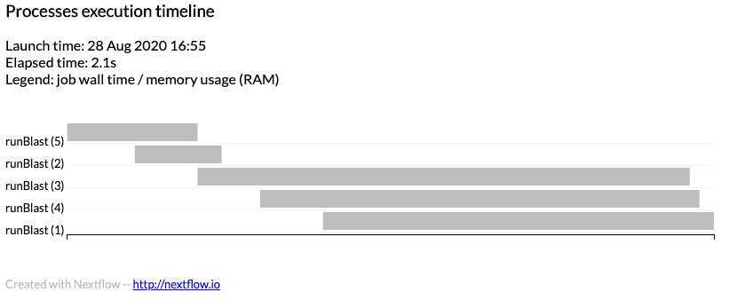

## Learning Objectives

1. Introduction
2. nextflow setup
3. nextflow params
4. nextflow config file
5. nextflow process
6. nextflow channels


## Introduction

Presumably, you are here because you want to take your bash scripts and put them into a functioning workflow and have all the execution taken care of for you.  You have come to the right place.  Nextflow is great but if you are a biologist turned informatician, the groovy language might trip you up a little in many of the great documentation materials that can be found here:

* [Nextflow getting started](https://www.nextflow.io/docs/latest/getstarted.html)

This is a great resource, but it assumes you have had some experience with object oriented programming or even some background in groovy/Java. You will run across methods that aren't part of nextflow but part of the groovy language like [`.trim, .flatten, and the word "it"`].  At first this was hard to separate out when we just wanted to know how to do X.  While they do have examples in their [nextflow patterns section](https://github.com/nextflow-io/patterns), it isn't quite sufficient yet to quickly learn to create a nextflow workflow.  This tutorial is aimed to bridge this gap.


## A practical example

The goal of this tutorial is to introduce you to the concepts of nextflow by building a practical example.  We will journey through the process of making a simple blast workflow that can take in a fasta file as a query and run blast on it. We will then keep extending this example to showcase different features in nextflow that are useful in building a dynamic workflow.

## Prerequisites

This tutorial assumes that you are familiar with bash scripting and [how to run blast locally](https://bioinformaticsworkbook.org/dataAnalysis/blast/blastExample.html#gsc.tab=0).


## Nextflow setup


### Create a github repo

Let's start by setting up our folder.  I usually do this by first creating a github repo and then cloning it so that I can use version control.  I am going to create this in the `isugifNF` organization that I am apart of and name it `tutorial`. You should make a repo on your own account.


Then pull it to my local machine. Do not pull this repo as it will download the entire finished tutorial.

```
git clone git@github.com:isugifNF/tutorial.git
```

### Files

Every nextflow workflow requires two main files.

* main.nf
  * The main.nf file contains the main nextflow script that calls the processes.
  * It doesn't have to be named main.nf but that is standard practice.
* nextflow.config
  * The config file contains default parameters to use in the nextflow pipeline

```
touch main.nf nextflow.config
```

Your folder should now contain the following

```
ls
README.md       main.nf         nextflow.config
```

## Lesson 1: Nextflow params and variables

Let's create a simple program that has a parameter to set our query input file that we will use for the BLAST program.
  ```
  #! /usr/bin/env nextflow

  blastdb="myBlastDatabase"
  params.query="file.fasta"

  println "I will BLAST $params.query against $blastdb"
  ```

#### Let's dissect it line by line.

The first line is required for all nextflow programs  

  ```
  #! /usr/bin/env nextflow
  ```

  The second line of code sets a variable inside the nextflow script.

  ```
  blastdb="myBlastDatabase"
  ```

  The third line of code sets a pipeline parameter that can be set at the command line, which I will show you in just a minute. If you want to make a variable a pipeline parameter just prepend the variable with `params.`

  ```
  params.query="file.fasta"
  ```

  The last line is a simple print statement that uses both a nextflow variable and a pipeline parameter.

  ```
  println "I will BLAST $params.query against $blastdb"
  ```

  Go ahead and run it.

  ```
  nextflow run main.nf
  ```

  Output should look like this

  ```
  N E X T F L O W  ~  version 20.07.1
  Launching `main.nf` [confident_williams] - revision: f407a6b0e1
  I will BLAST file.fasta against myBlastDatabase
  ```

  You will also have the default `work/` folder that will appear but will be empty as we didn't do anything but print something to standard out.

#### Exercises for comprehension

1. Pipeline parameters can be set on the command line.

  ```
  nextflow run main.nf --query "newQuery.fasta"
  ```

  Output:

  ```
  N E X T F L O W  ~  version 20.07.1
  Launching `main.nf` [extravagant_pasteur] - revision: f407a6b0e1
  I will BLAST newQuery.fasta against myBlastDatabase
  ```
2. Nextflow script variables cannot be set at the command line

  ```
  nextflow run main.nf --blastdb "NewBlastDB"
  ```

  Output:
  ```
  N E X T F L O W  ~  version 20.07.1
  Launching `main.nf` [loving_borg] - revision: f407a6b0e1
  I will BLAST file.fasta against myBlastDatabase
  ```
3. Try other --param.query inputs on your own.

  ```
  nextflow run main.nf --params.query "changethistext"
  ```

#### Github saving and ignoring

```
git add main.nf nextflow.config
git commit -c "started a new nextflow project!"
git push origin master
```

Add the following to your .gitignore file

```
.nextflow*
work
out_dir
```

Then save it to your repo

```
git add .gitignore
git commit -c "added .gitignore"
git push origin master
```

## Lesson 2: Nextflow Config file

The nextflow config file is `nextflow.config`.  In here, we can set default global parameters for pipeline parameters (params), process, manifest, executor, profiles, docker, singularity, timeline, report and more.

For now, we are going to just add additional pipeline parameters and move the `params.query` out of the `main.nf` file and into the `nextflow.config` file.


Inside the `nextflow.config` file add the following parameters.

**nextflow.config**

  ```
  params.query = "myquery.fasta"
  params.dbDir = "/path/to/my/blastDB/"
  params.dbName = "myBlastDB"
  params.threads = 16
  params.outdir = "out_dir"
  ```

Remove these lines from `main.nf`

```
blastdb="myBlastDatabase"
params.query="file.fasta"
```

and let's modify the last print statement to include all the parameters.

```
println "I want to BLAST $params.query to $params.dbDir/$params.dbName using $params.threads CPUs and output it to $params.outdir"
```

Your `main.nf` file should look like this.

```
/usr/bin/env nextflow

println "I want to BLAST $params.query to $params.dbDir/$params.dbName using $params.threads CPUs and output it to $params.outdir"

```

**output:**

  ```
  nextflow run main.nf
  N E X T F L O W  ~  version 20.07.1
  Launching `main.nf` [fervent_swanson] - revision: 418bbdfbef
  I want to BLAST myquery.fasta to /path/to/my/blastDB//myBlastDB using 16 CPUs and output it to out_dir
  ```

  Let's add a `\n` to the beginning and end of the print statement so it reports a little more cleanly

  ```
  /usr/bin/env nextflow

  println "\nI want to BLAST $params.query to $params.dbDir/$params.dbName using $params.threads CPUs and output it to $params.outdir\n"

  ```

**output: This looks better:**

  ```
  nextflow run main.nf
  N E X T F L O W  ~  version 20.07.1
  Launching `main.nf` [modest_crick] - revision: 87c6232474

  I want to BLAST myquery.fasta to /path/to/my/blastDB//myBlastDB using 16 CPUs and output it to out_dir

  ```

#### Alternate params config

We can also write the pipeline parameters in a different format that is more similar to what we will be using for the rest of the config definitions.

Instead of

```
params.query = "myquery.fasta"
params.dbDir = "/path/to/my/blastDB/"
params.dbName = "myBlastDB"
params.threads = 16
params.outdir = "out_dir"
```

We can write it as follows.  Go ahead and change the nextflow.config file to look like this and rerun it to verify to yourself that it works identically.

```
params {
  query = "myquery.fasta"
  dbDir = "/path/to/my/blastDB/"
  dbName = "myBlastDB"
  threads = 16
  outdir = "out_dir"
}
```
You will still need to refer to these parameters as `params.X`.

```
nextflow run main.nf
```

## Lesson 3: Nextflow process

Process definitions are what nextflow uses to define a script to run, the input to the script and the output of a script.  Ultimately workflows are comprised of nextflow processes.  In this example, we want to run BLAST.

#### Setup and input files

We will need a fasta file and a database.  We are going to use a toy example with only five fasta reads and use that input to generate the blast database and then align it to itself.

Copy and paste the following fasta reads into a file named `input.fasta`

<details><summary>input.fasta</summary>

<pre>
>Scaffold_1_1..100
CAGGCAAAATGTGGCACAAAAACAACAAATTGTTTAGTAGATACAGGGGCATCCATTTGTTGTATTTCGTCTGCTTTTCTGAGCACAGCTTTTGAAAACC
>Scaffold_1_101..200
TTACTCTTGGAAACTCACCCTTTCCACAGGTAAAAGGTGTTGGCGGCGAATTGCATAAAGTGTTAGGTTCAGTTGTGTTAGATTTTGTCATTGAGGATCA
>Scaffold_1_201..300
GGAATTTTCTCAAAGATTCTATGTACTGCCTACACTGCCGAAGGCAGTGATACTAGGTGAGAACTTCCTTAATGACAATGATGCAGTCTTAGATTATAGC
>Scaffold_1_301..400
TGTCATTCCTTGATACTCAACAACAGCACCTCAGATAGGCAATATATCAATTTCATAGCCAATTCAGTGCATGAGATTAGTGGATTAGCAAAAACACTAG
>Scaffold_1_401..500
ATCAGATTTACATCCCCCCTCAGAGTGAAATTCATTTCAAGGTCAGACTATCAGAGACCAAAGAGGATTCCCTCATCCTCATTGAACCCATTGCTTCCCT

</pre>

</details>

**Create the BLASTDB**

You will need to have BLAST-plus installed on your computer. We will use the `makeblastdb` command to create a nucleotide database of the `input.fasta` file and then move the output to a folder named `DB`

```
makeblastdb -in input.fasta -dbtype 'nucl' -out blastDB
makeblastdb -in input.fasta -dbtype 'prot' -out blastDB
mkdir DB
mv blastDB.n* DB
```

**Test that BLAST works**

This is the command we want to get into a process in a nextflow script.

```
blastn  -num_threads 2 -db $PWD/DB/blastDB -query $PWD/input.fasta -outfmt 6 -out input.blastout
```

#### nextflow runBlast process

To write this as a nextflow process, we would write it in the following way. The command you want to run should be placed between the `"""`

```
process runBlast {

  script:
  """
  blastn  -num_threads 2 -db $PWD/DB/blastDB -query $PWD/input.fasta -outfmt 6 -out input.blastout
  """

}
```

Note: it is critical that the input files use the **full path**.  This is why we have the `$PWD` (path of working directory Unix variable)


**output:**

```
nextflow run main.nf
N E X T F L O W  ~  version 20.07.1
Launching `main.nf` [special_sinoussi] - revision: 24972a3b60

I want to BLAST myquery.fasta to /path/to/my/blastDB//myBlastDB using 16 CPUs and output it to out_dir

executor >  local (1)
[e0/ac0a8e] process > runBlast [100%] 1 of 1 ✔

```

the **input.blastout** will be found in the work folder.

```
tree work/
work/
`-- e0
    `-- ac0a8e23e6db0eb4b4e81b7d1656f5
        `-- input.blastout
```

The folders inside the work directory are named based on a hash that allows nextflow to `-resume` from wherever it failed or was stopped.

## Lesson 4: Integrating params with process

Now that we have a working nextflow script, lets replace all that we can in the BLAST script with pipeline parameters we can set from the command line.

The BLAST script inside **main.nf** currently looks like this.

  ```
    script:
    """
    blastn  -num_threads 2 -db $PWD/DB/blastDB -query $PWD/input.fasta -outfmt 6 -out input.blastout
    """
  ```

As you recall and can look up in **nextflow.config** these are the current pipeline default parameters we have defined.

  ```
  params {
    query = "myquery.fasta"
    dbDir = "/path/to/my/blastDB/"
    dbName = "myBlastDB"
    threads = 16
    outdir = "out_dir"
  }
  ```

So we can change the BLAST script as follows

  ```
    script:
    """
    blastn  -num_threads $params.threads -db $params.dbDir/$params.dbName -query $params.query -outfmt 6 -out input.blastout
    """
  ```

We should also adjust the defaults in **nextflow.config** to real files.

  ```
  params {
    query = "$PWD/input.fasta"
    dbDir = "$PWD/DB/"
    dbName = "blastDB"
    threads = 2
    outdir = "out_dir"
  }
  ```

### Exercise

  1. Make the changes described above to the **main.nf** and the **nextflow.config** scripts and show that it still works with `nextflow run main.nf`
  2. Test out the pipeline parameters `--query` `--threads`

  ```
  nextflow run main.nf --query "$PWD/input.fasta" --threads 6
  ```

## Lesson 5: Adding more params

We can add more functionality to this script

```
  script:
  """
  blastn  -num_threads $params.threads -db $params.dbDir/$params.dbName -query $params.query -outfmt 6 -out input.blastout
  """
```

We can add the following:

|parameter| description|
| -- | -- |
|--outfmt | To change the out format of blast|
|--outFileName| to change the outfile name|
|--options | to add additional options like evalue |

This is what the new script will look like.

```
  script:
  """
  blastn  -num_threads $params.threads -db $params.dbDir/$params.dbName -query $params.query -outfmt $params.outfmt $params.options -out $params.outFileName
  """
```

Of course if we do that we also need to add it to the nextflow.config file.

```
params {
  query = "$PWD/input.fasta"
  dbDir = "$PWD/DB/"
  dbName = "blastDB"
  threads = 2
  outdir = "out_dir"
  outFileName = "input.blastout"
  options = "-evalue 1e-3"
  outfmt = "'6'"
}
```

1. Make the changes described above to the **main.nf** and the **nextflow.config** scripts and show that it still works with `nextflow run main.nf`
2. Test out the pipeline parameters `--outFileName` `--options` and `--outfmt`

**example**

```
nextflow run main.nf --outFileName "myBlast" --options "-evalue 1e-10" --outfmt "'6 qseqid sseqid pident length mismatch gapopen qstart qend sstart send evalue bitscore qlen slen frames salltitles qcovs'"
```

## Lesson 6: How far can we take params?

* adding an app param.

Turns out we can even add a parameter for the BLAST app we want to run.  Right now it only runs blastn but what about blastp,tblastn and blastx?  We could use a series of if statements or we can add a `params.app` that is replaced in the script itself like this.

```
  script:
  """
  $params.app  -num_threads $params.threads -db $params.dbDir/$params.dbName -query $params.query -outfmt $params.outfmt $params.options -out $params.outFileName
  """
```

Be sure to add the --app in the `nextflow.config` file.

```
params {
  query = "$PWD/input.fasta"
  dbDir = "$PWD/DB/"
  dbName = "blastDB"
  threads = 2
  outdir = "out_dir"
  outFileName = "input.blastout"
  options = "-evalue 1e-3"
  outfmt = "'6'"
  app = "blastn"
}
```

**test it**

```
nextflow run main.nf --outFileName "myBlast" --options "-evalue 1e-10" --outfmt "'6 qseqid sseqid pident length mismatch gapopen qstart qend sstart send evalue bitscore qlen slen frames salltitles qcovs'" --app tblastx
```

#### How do you know if it worked as you expected?  

In the work folder in each of the leaf directories you will find a bunch of `.command.X` files.

```
-rw-r--r--  1 severin  staff     0B Aug 28 09:25 work/78/1c37092ffb6cd83a4973e8f64bc398/.command.begin
-rw-r--r--  1 severin  staff     0B Aug 28 09:25 work/78/1c37092ffb6cd83a4973e8f64bc398/.command.err
-rw-r--r--  1 severin  staff     0B Aug 28 09:25 work/78/1c37092ffb6cd83a4973e8f64bc398/.command.log
-rw-r--r--  1 severin  staff     0B Aug 28 09:25 work/78/1c37092ffb6cd83a4973e8f64bc398/.command.out
-rw-r--r--  1 severin  staff   2.5K Aug 28 09:25 work/78/1c37092ffb6cd83a4973e8f64bc398/.command.run
-rw-r--r--  1 severin  staff   328B Aug 28 09:25 work/78/1c37092ffb6cd83a4973e8f64bc398/.command.sh
-rw-r--r--  1 severin  staff     1B Aug 28 09:25 work/78/1c37092ffb6cd83a4973e8f64bc398/.exitcode
```

* The `.command.begin` is the begin script if you have one (we don't in this one)
* The `.command.err` is useful when it crashes.
* The `.command.run` is the full nextflow pipeline that was run, this is helpful when trouble shooting a nextflow error rather than the script error.
* The `.command.sh` shows what was run.
* The `.exitcode` will have the exit code in it.


The `.command.sh` command will have the command that was actually run. As you can see `params.app` was successfully replaced with tblastx.

```
cat  work/78/1c37092ffb6cd83a4973e8f64bc398/.command.sh
#!/bin/bash -ue
tblastx -num_threads 2 -db /Users/severin/nextflow/workbook/blast/tutorial/DB//blastDB -query /Users/severin/nextflow/workbook/blast/tutorial/input.fasta -outfmt '6 qseqid sseqid pident length mismatch gapopen qstart qend sstart send evalue bitscore qlen slen frames salltitles qcovs' -evalue 1e-10 -out myBlast

```

## Lesson 7: Adding a help param

With all these pipeline parameters it is getting hard to remember what we can use. So let's make a handy help function and `--help` parameter.

#### Define a function

To define a function in nextflow we use this type of syntax.


```
def helpMessage() {

}
```

We are going to add a help message. The `log.info` command is not well documented but can be used to print a multiline information using groovy's [logger fuctionality](https://github.com/nextflow-io/nextflow/blob/553c3119cc81012c3c4667ba280f174b0a7c7f8b/modules/nextflow/src/main/java/com/esotericsoftware/minlog/Log.java#L205).  In simple terms put what you want to print out for the help message between the `log.info """` and `"""`

```
def helpMessage() {
  log.info """
        Usage:
        The typical command for running the pipeline is as follows:
        nextflow run main.nf --query QUERY.fasta --dbDir "blastDatabaseDirectory" --dbName "blastPrefixName"

        Mandatory arguments:
         --query                        Query fasta file of sequences you wish to BLAST
         --dbDir                        BLAST database directory (full path required)
         --dbName                       Prefix name of the BLAST database

       Optional arguments:
        --outdir                       Output directory to place final BLAST output
        --outfmt                       Output format ['6']
        --options                      Additional options for BLAST command [-evalue 1e-3]
        --outFileName                  Prefix name for BLAST output [input.blastout]
        --threads                      Number of CPUs to use during blast job [16]
        --chunkSize                    Number of fasta records to use when splitting the query fasta file
        --app                          BLAST program to use [blastn;blastp,tblastn,blastx]
        --help                         This usage statement.
        """
}

```

#### Run a the function
Now that the definition has been defined above, we need code that executes it if the params.help parameter is set.

Comments are specified in groovy with `//`

```
// Show help message
if (params.help) {
    helpMessage()
    exit 0
}
```


* Paste the above helpMessage() function and if statement in the `main.nf` file above `process runBlast`.

  <details><summary>main.nf</summary>

  <pre>
  #! /usr/bin/env nextflow

  println "\nI want to BLAST $params.query to $params.dbDir/$params.dbName using $params.threads CPUs and output it to $params.outdir\n"

  def helpMessage() {
    log.info """
          Usage:
          The typical command for running the pipeline is as follows:
          nextflow run main.nf --query QUERY.fasta --dbDir "blastDatabaseDirectory" --dbName "blastPrefixName"

          Mandatory arguments:
           --query                        Query fasta file of sequences you wish to BLAST
           --dbDir                        BLAST database directory (full path required)
           --dbName                       Prefix name of the BLAST database

         Optional arguments:
          --outdir                       Output directory to place final BLAST output
          --outfmt                       Output format ['6']
          --options                      Additional options for BLAST command [-evalue 1e-3]
          --outFileName                  Prefix name for BLAST output [input.blastout]
          --threads                      Number of CPUs to use during blast job [16]
          --chunkSize                    Number of fasta records to use when splitting the query fasta file
          --app                          BLAST program to use [blastn;blastp,tblastn,blastx]
          --help                         This usage statement.
          """
  }

  // Show help message
  if (params.help) {
      helpMessage()
      exit 0
  }

  process runBlast {

    script:
    """
    $params.app -num_threads $params.threads -db $params.dbDir/$params.dbName -query $params.query -outfmt $params.outfmt $params.options -out $params.outFileName
    """

  }
  </pre>

  </details>


* then add the pipeline parameter `help = false` to your params code block in `nextflow.config`.

  <details><summary>nextflow.config</summary>

  <pre>
  params {
    query = "$PWD/input.fasta"
    dbDir = "$PWD/DB/"
    dbName = "blastDB"
    threads = 2
    outdir = "out_dir"
    outFileName = "input.blastout"
    options = "-evalue 1e-3"
    outfmt = "'6'"
    app = "blastn"
    help = false
  }
  </pre>

  </details>

#### Exercise

1. Try it out and make sure it works.

```
nextflow run main.nf --help
```

## Lesson 8: Nextflow process input and output

So far we have written a nextflow script and replaced as much of it as we could with pipeline parameters and learned how to write a function in nextflow to display a usage message.  Now we are going to extend the process to include input and output sections.

#### Current runBlast process
```
   process runBlast {
    script:
    """
    $params.app -num_threads $params.threads -db $params.dbDir/$params.dbName -query $params.query -outfmt $params.outfmt $params.options -out $params.outFileName
    """
  }
```

#### Adding nextflow output and publishDir sections

Here we have added a nextflow function called `publishDir` which tells nextflow where to place a symlink of the output files.  Those outputfiles are defined by the `output:` section of the process.

**Note:** the `params.outdir` in the `publishDir` command has a `$` in front of it because it is inside a quotation whereas the `params.outFileName` does not have a `$` because it is not inside a script or a set of quotes.  This is a common source of errors when first scripting in nextflow.  

You can have more than one line in the `output:` section.

```
   process runBlast {

    publishDir "${params.outdir}/blastout"

    output:
    path(params.outFileName)

    script:
    """
    $params.app -num_threads $params.threads -db $params.dbDir/$params.dbName -query $params.query -outfmt $params.outfmt $params.options -out $params.outFileName
    """
  }
```
**output**

You should now see an `out_dir` directory with a `blastout` subdirectory and the `input.blastout` in side that folder.


## Lesson 9: Nextflow channels and process inputs.

  Turns out nextflow inputs are intrinsically linked to nextflow channels. So I can't talk about inputs without speaking about channels.  Process inputs are taken from a nextflow channel.

  Channels can act as either a [queue or value](https://www.nextflow.io/docs/latest/channel.html#queue-channel).
  * queue channels are consumable.  A channel is loaded with a file and a process will use the file and empty the channel of that file.
  * value channels are not consumed.  A channel is loaded with a value and a process or several processes can use that channel value over and over again.

  With Channels, we will start to see more [nextflow operators](https://www.nextflow.io/docs/latest/operator.html) for channels.  In this case, we are going to add the following code above the `runBlast` process which states create a channel from a file path and set the channel name into queryFile_ch.  

  **Note:**  Operators may take the method syntax `()` or the closure syntax `{ }`.  We see both in this example.  This is a common source of errors when writing nextflow scripts.

  ```
  Channel
      .fromPath(params.query)
      .into { queryFile_ch }
  ```

We can now add an `input:` section to the process like this

```
input:
path(queryFile) from queryFile_ch
```

And we can swap out `$params.query` with `$queryFile`.  Some of the readers may be wondering why we would do this if it does the exactly the same thing?  The answer is that with processes that can accept a channel as input we have greater control to parallelize the execution of the process on the data as we will see in the next lesson.

<details><summary>main.nf</summary>

<pre>
process runBlast {

  publishDir "${params.outdir}/blastout"

  input:
  path queryFile from queryFile_ch

  output:
  path(params.outFileName)

  script:
  """
  $params.app -num_threads $params.threads -db $params.dbDir/$params.dbName -query $queryFile -outfmt $params.outfmt $params.options -out $params.outFileName
  """

}

</pre>
</details>

### Run it and verify it works

  ```
  nextflow run main.nf
  ```


## Lesson 10: Nextflow split fasta

One of the more powerful channel operators is called `.splitFasta`.  This operator can be used to split a fasta file into chunks by a specified chunk size and then we can pass it to the queue and the process will run these chunks in parallel.

To do this, we modify the `queryFile_ch`  Channel.  This code says to create a channel from path `params.query` and splitFasta by chunks of size 1 fasta record and make a file for these chunks in the work process folder and put this into a channel named `queryFile_ch`.  I chose a chunk size of 1 because our example fasta only has 5 fasta records


```
Channel
    .fromPath(params.query)
    .splitFasta(by: 1, file:true)
    .into { queryFile_ch }
```

When you run this you will now see a different output

```
nextflow run main.nf
N E X T F L O W  ~  version 20.07.1
Launching `main.nf` [suspicious_kare] - revision: df99b16d40

WARN: The `into` operator should be used to connect two or more target channels -- consider to replace it with `.set { queryFile_ch }`
executor >  local (5)
[e1/5baaab] process > runBlast (4) [100%] 5 of 5 ✔
```

The important part of this is that there are now 5 local jobs and 5 runBlast processes that have been performed.  You will also see more folders in your work folder.

#### PublishDir broke

Something that you may have noticed is that the `input.blastout` now only contains a single blast line.  What has happened is that every time the runBlast process runs it replaces the BLAST output of the fasta chunk in publishDir.  To fix this we need to send the output of all these chunks to a new channel and then use a different parameter to collect them before publishing.

So change the `runBlast` process output line to look like this.

```
output:
  path(params.outFileName) into blast_output_ch
```

Notice that you will see the `into` method again and then the name of the channel you are creating.

After the `runBlast` process add the following lines.

```
blast_output_ch
  .collectFile(name: 'blast_output_combined.txt', storeDir: params.outdir)
```

This takes the blast_output_ch that has the blast output from the fasta chunks and collects them (cat) into a new file named `blast_output_combined.txt` in the folder named `params.outdir`.

**Output**

The out_dir now contains the `blast_output_combined.txt` file with all the blast output.

```
out_dir/
blast_output_combined.txt blastout
```

If you messed up or need help, this is what your main.nf script should now look like

<details><summary>main.nf</summary><p>

  <pre>
  #! /usr/bin/env nextflow

  println "\nI want to BLAST $params.query to $params.dbDir/$params.dbName using $params.threads CPUs and output it to $params.outdir\n"

  def helpMessage() {
    log.info """
          Usage:
          The typical command for running the pipeline is as follows:
          nextflow run main.nf --query QUERY.fasta --dbDir "blastDatabaseDirectory" --dbName "blastPrefixName"

          Mandatory arguments:
           --query                        Query fasta file of sequences you wish to BLAST
           --dbDir                        BLAST database directory (full path required)
           --dbName                       Prefix name of the BLAST database

         Optional arguments:
          --outdir                       Output directory to place final BLAST output
          --outfmt                       Output format ['6']
          --options                      Additional options for BLAST command [-evalue 1e-3]
          --outFileName                  Prefix name for BLAST output [input.blastout]
          --threads                      Number of CPUs to use during blast job [16]
          --chunkSize                    Number of fasta records to use when splitting the query fasta file
          --app                          BLAST program to use [blastn;blastp,tblastn,blastx]
          --help                         This usage statement.
          """
  }

  // Show help message
  if (params.help) {
      helpMessage()
      exit 0
  }

  Channel
      .fromPath(params.query)
      .splitFasta(by: 1, file:true)
      .into { queryFile_ch }

  process runBlast {

    publishDir "${params.outdir}/blastout"

    input:
    path queryFile from queryFile_ch

    output:
    path(params.outFileName) into blast_output_ch

    script:
    """
    $params.app -num_threads $params.threads -db $params.dbDir/$params.dbName -query $queryFile -outfmt $params.outfmt $params.options -out $params.outFileName
    """

  }


  blast_output_ch
    .collectFile(name: 'blast_output_combined.txt', storeDir: params.outdir)

  </pre>

</p>
</details>

#### Summary

Up to this point you know have a working runBlast workflow that will take in a fasta file split it into chunks of size 1 fasta record and run those blasts in parallel and then collect all the outputs and write it to a single file in the out_dir.

#### Exercise

1. Add a chunkSize parameter that you can set so that you can specify the chunksize.  Be sure to add it to the appropriate places in nextflow.config and main.nf

<details><summary>Hints</summary>

<pre>
1. params has an s at the end of it
2. It is not contained inside `"` so don't use the `$`

</pre>

</details>


## Lesson 11: Advanced Nextflow config  

There is quite a bit to learn about the nextflow config file that adds significant functionality and modularity to nextflow. Here are some highlights.

#### timeline

If the following code is added to your nextflow.config file, nextflow will output a detailed timeline report.

* nextflow.config

  ```
  timeline {
    enabled = true
    file = "$params.outdir/timeline.html"
  }
  ```

  

#### report

If the following code is added to your `nextflow.config` file, nextflow will output a detailed execution report.

* nextflow.config

  ```
  report {
    enabled = true
    file = "$params.outdir/report.html"
  }
  ```

  The report has technical detail about cpu and memory usage for each process but this toy example is too small to show anything interesting.

#### [executors](https://www.nextflow.io/docs/latest/config.html)

The executor code block in the `nextflow.config` file can be used to set default executor parameters. In this case, we are setting the queueSize to be no more than 100 jobs and a submission rate of no more than 10 per second.

These parameters are only active if we choose a non-local executor like slurm or torque.

* nextflow.config

  ```
  executor {
    queueSize = 100
    submitRateLimit = '10 sec'
  }
  ```

#### [profiles](https://www.nextflow.io/docs/latest/config.html?highlight=profiles)

  We can also add profiles into the nextflow.config file that will load different settings depending on the profile.  This is similar to an include statement in other languages.  

* nextflow.config

  ```
  profiles {
    slurm { includeConfig './configs/slurm.config' }
  }
  ```

* ./configs/slurm.config

  Make a file named slurm.config in a folder named configs and add the following text.

  ```
  process {
    executor = 'slurm'
    clusterOptions =  '-N 1 -n 16 -t 24:00:00'
  }
  ```

With a profile added you can now execute the specific parameters in a profile by using the `-profile` nextflow parameters (again this is a nextflow parameter and not a pipeline parameter so it only has a single `-` just like `-resume`)

```
nextflow run main.nf -profile slurm
```

**Note:** this will fail unless you are on a machine that has sbatch.


#### [Manifest](https://www.nextflow.io/docs/latest/config.html?highlight=profiles#scope-manifest)

* nextflow.config

  ```
  manifest {
  name = 'isugifNF/tutorial'
  author = 'Andrew Severin'
  homePage = 'www.bioinformaticsworkbook.org'
  description = 'nextflow bash'
  mainScript = 'main.nf'
  version = '1.0.0'
  }
  ```

You don't actually need this to run from a github repo but you can use it to specify the mainScript.  Default is `main.nf`.

To execute from a repository you can refer to it as follows.

```
nextflow run isugifNF/tutorial --help
```

Note: `isugifNF/tutorial` is my organization/githubRepo, that I have been pushing this tutorial to.  It will be different for you.  

#### [labels](https://www.nextflow.io/docs/latest/config.html#config-process-selectors)

It is possible to add a label to a process between the process name and the `input:`.

```
label 'blast'
```

The label can define in the `nextflow.config` in your process directive or in our case in the `Configs/slurm.config`.  It can be used like a reusable variable to include additional parameters.

```
process {
  executor = 'slurm'
  clusterOptions =  '-N 1 -n 16 -t 02:00:00'
  withLabel: blast { module = 'blast-plus' }
}

```

In the above example we have provided code that will load the appropriate module.  It would be possible to create several profiles to load the correct modules depending on the super computer you were using, for example.  Depending on your super computer you may need to change the name of the module you want to load.

#### [modules](https://www.nextflow.io/docs/latest/process.html?highlight=module%20load#module)

If you want to just load the module directly in the process you can just add the module command like directly where you put the label which is anywhere before the `input:`


```
process runBlast {

  module = 'blast-plus'
  publishDir "${params.outdir}/blastout"

  input:
  path queryFile from queryFile_ch
  .
  .
  . // these three dots mean I didn't paste the whole process.
```


## Lesson 12: nextflow containers

#### [Singularity](https://www.nextflow.io/docs/latest/singularity.html#singularity-containers) and [Docker](https://www.nextflow.io/docs/latest/docker.html?highlight=docker#docker-containers)

There are default profiles for singularity `-profile singularity` and docker `-profile docker`.  


To set a container you can do so by adding the following line to the process with the container name as it appears in [docker hub](https://hub.docker.com/search?q=blast&type=image)

Docker is the default so you can use this short version.
```
container = 'ncbi/blast'
```

Or you can specify a container using its full path from other locations such as [Red Hat Quay.io](https://quay.io/search?q=blast)
```
container = `quay.io/biocontainers/blast/2.2.31--pl526he19e7b1_5`
```

You can place this line anywhere before the `input:` in the process.

```
process runBlast {

  container = 'ncbi/blast'
  publishDir "${params.outdir}/blastout"

  input:
  path queryFile from queryFile_ch
  .
  .
  .  // these three dots mean I didn't paste the whole process.
```

**example**


## Lesson 13: makeBlastDB process

* if else statement

## Resource list

* [nextflow operators](https://www.nextflow.io/docs/latest/operator.html)
