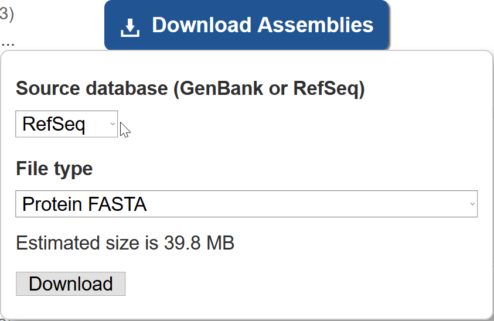
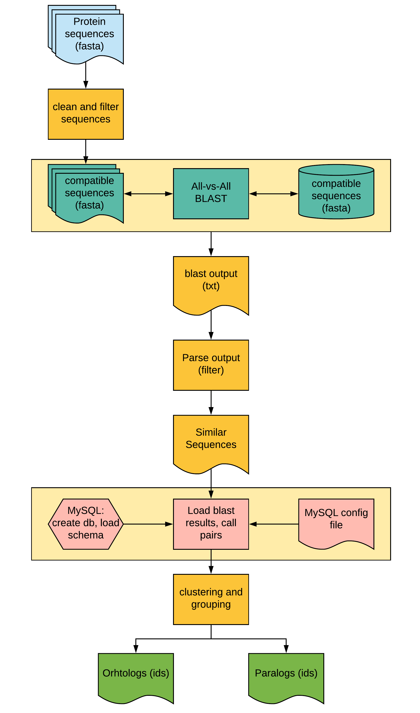

# Finding orthologs using OrthoMCL program

This is the first section of Phylogenomics chapter, where we predict orthologs from the genes of whole genomes. Although, there are several methods to predict orthologs, we will primarily use OrthoMCL program. Since orthoMCL depends on MySQL, we will use Singularity containers for running the MySQL server (and OrthoMCL). We will use many different species of _Plasmodium_ as an example dataset for this exercise.

Following is the outline for this chapter:

1. Obtaining the data
2. Cleaning and formating sequences
3. Running orthoMCL program
4. Formatting and processing results (for downstream analysis)


## 1. Downloading data

At the time of writing this tutorial, there were 13 RefSeq assemblies available for _Plasmodium_ spp. on [NCBI](https://www.ncbi.nlm.nih.gov/assembly/?term=txid5820%5BOrganism%3Aexp%5D) (with chromosomal level assembly). We will use them all for finding orthologs. We will only need the protein sequences for this section. This step may vary if you want to use another dataset or custom dataset so you may have to change the below commands accordingly.



Download it and extract the archive using `tar` command, and explore the contents.

```
tar xf genome_assemblies.tar
cd
grep -c ">" *.faa
```

Following is the summary:

| Filename                                               | Species                         | Sequences |
|:-------------------------------------------------------|---------------------------------|---------:|
| GCF_000002415.2_ASM241v2_protein.faa                   | *Plasmodium vivax* Sal-1        | 5,392    |
| GCF_000002765.4_ASM276v2_protein.faa                   | *Plasmodium falciparum* 3D7     | 5,392    |
| GCF_000006355.1_ASM635v1_protein.faa                   | *Plasmodium knowlesi* strain H  | 5,101    |
| GCF_000321355.1_PcynB_1.0_protein.faa                  | *Plasmodium cynomolgi* strain B | 5,716    |
| GCF_000524495.1_Plas_inui_San_Antonio_1_V1_protein.faa | *Plasmodium inui* San Antonio 1 | 5,832    |
| GCF_000709005.1_Plas_vinc_vinckei_V1_protein.faa       | *Plasmodium vinckei vinckei*    | 4,954    |
| GCF_000956335.1_Plas_frag_nilgiri_V1_protein.faa       | *Plasmodium fragile*            | 5,672    |
| GCF_001601855.1_ASM160185v1_protein.faa                | *Plasmodium reichenowi*         | 5,279    |
| GCF_001602025.1_ASM160202v1_protein.faa                | *Plasmodium gaboni*             | 5,354    |
| GCF_001680005.1_ASM168000v1_protein.faa                | *Plasmodium coatneyi*           | 5,516    |
| GCF_900002335.2_PCHAS01_protein.faa                    | *Plasmodium chabaudi chabaudi*  | 5,158    |
| GCF_900002375.1_PBANKA01_protein.faa                   | *Plasmodium berghei* ANKA       | 4,896    |
| GCF_900002385.1_PY17X01_protein.faa                    | *Plasmodium yoelii*             | 5,926    |

## 2. Cleaning and formatting the data to desired specifications

Next step is to clean up this data so that it is easier to handle for both program and for the user. Since these files are identified by accessing id, we will rename them to some easily readable name. We will use the first 4 letters of genus name and first 4 letters of spp name (eg: `plaviva` for *Plasmodium vivax* Sal-1).

#### Files before:
```
$ ls -1
GCF_000002415.2_ASM241v2_protein.faa
GCF_000002765.4_ASM276v2_protein.faa
GCF_000006355.1_ASM635v1_protein.faa
GCF_000321355.1_PcynB_1.0_protein.faa
GCF_000524495.1_Plas_inui_San_Antonio_1_V1_protein.faa
GCF_000709005.1_Plas_vinc_vinckei_V1_protein.faa
GCF_000956335.1_Plas_frag_nilgiri_V1_protein.faa
GCF_001601855.1_ASM160185v1_protein.faa
GCF_001602025.1_ASM160202v1_protein.faa
GCF_001680005.1_ASM168000v1_protein.faa
GCF_900002335.2_PCHAS01_protein.faa
GCF_900002375.1_PBANKA01_protein.faa
GCF_900002385.1_PY17X01_protein.faa
```
#### script to rename files

```
for faa in *.faa; do
new=$(head -n 1 ${faa} |grep -wEo "Plasmodium .*\b" |cut -f 1-2 -d " "| sed 's/\(\w\w\w\w\)\w*\( \|$\)/\1/g');
mv ${faa} ${new}.fasta;
done
```
#### Files after:

```
Plasberg.fasta
Plaschab.fasta
Plascoat.fasta
Plascyno.fasta
Plasfalc.fasta
Plasfrag.fasta
Plasgabo.fasta
Plasinui.fasta
Plasknow.fasta
Plasreic.fasta
Plasvinc.fasta
Plasviva.fasta
Plasyoel.fasta
```

Next, we will clean the sequence headers. Although this is not absolutely required for these files, when using custom files it is necessary to keep consistency among all the files being used for the analysis. Here our file fasta header looks like this (all 13 are from NCBI and they are consistent)

#### Headers before:

```
$ head -n 1 *.fasta |grep "^>"
>XP_022711843.1 BIR protein, partial [Plasmodium berghei ANKA]
>XP_016652856.1 CIR protein [Plasmodium chabaudi chabaudi]
>XP_019912384.1 Dual specificity phosphatase [Plasmodium coatneyi]
>XP_004220499.1 hypothetical protein PCYB_021010, partial [Plasmodium cynomolgi strain B]
>XP_001347288.1 erythrocyte membrane protein 1, PfEMP1 [Plasmodium falciparum 3D7]
>XP_012333075.1 hypothetical protein AK88_00001, partial [Plasmodium fragile]
>XP_018638642.1 putative EMP1-like protein, partial [Plasmodium gaboni]
>XP_008813840.1 hypothetical protein C922_00001 [Plasmodium inui San Antonio 1]
>XP_002257498.1 SICA antigen (fragment), partial [Plasmodium knowlesi strain H]
>XP_012760262.2 rifin [Plasmodium reichenowi]
>XP_008621913.1 hypothetical protein YYE_00001, partial [Plasmodium vinckei vinckei]
>XP_001608309.1 hypothetical protein [Plasmodium vivax Sal-1]
>XP_022810663.1 YIR protein [Plasmodium yoelii]
```
#### Script to modify headers:

```
for fasta in *.fasta; do
cut -f 1 -d " " $fasta > ${fasta%.*}.temp;
mv ${fasta%.*}.temp $fasta
done
```

#### Headers after:

```
$ head -n 1 *.fasta |grep "^>"
>XP_022711843.1
>XP_016652856.1
>XP_019912384.1
>XP_004220499.1
>XP_001347288.1
>XP_012333075.1
>XP_018638642.1
>XP_008813840.1
>XP_002257498.1
>XP_012760262.2
>XP_008621913.1
>XP_001608309.1
```

## 3. Running OrthoMCL program

Since we don't want to manually install the orthoMCL program and run, We will use the singularity container (made by ISU-HPC) .

```
module load singularity
singularity pull --name orthomcl.simg shub://ISU-HPC/orthomcl
```

This will create `simg` file (containers) for the orthoMCL program
```
orthomcl.simg
```




**Fig 2:**  Overview of OrthoMCL pipeline. Here, all orange boxes will per performed using the `orthomcl.simg` singularity container and pink boxes in `mysql.simg`. The BLAST analysis (yellow box) will be done outside the container to speed up the process.

### A. Clean and filter sequences

For this, we will create a directory where we store the formatted and filtered sequences. We will use `orthomclAdjustFasta` and `orthomclFilterFasta` for these steps.

```
mkdir -p original complaintFasta
mv *.fasta original/
singularity shell orthomcl.simg
cd complaintFasta
for fasta in ../orginal/*.fasta; do
orthomclAdjustFasta $(basename ${fasta%.*}) ${fasta} 1
done
```

The arguments supplied here are the 8 letter prefix for each file, input file and the field in the fasta file that should be used as identifier (in our case it was the first number so it is  `1`).

For filtering, we will create another directory and save files there:

```
cd ..
orthomclFilterFasta complaintFasta 10 20
```

Here, `10` is the minimum length for protein to keep and `20` is the maximum allowed stop codons in the sequences. This command will generate 2 files: `goodProteins.fasta`, containing all proteins that passed the filtering and `poorProteins.fasta`, containing all rejects.

We can now exit the singularity image shell and run the next step on a cluster.

```
exit
```

### B. Find similar sequences using BLAST

Depending the size of sequences, you can either split the `goodProteins.fasta` file to smaller bits and run the `blast` step in parallel or run it as single query file against single database (much slower). Here we will just split them to 4 pieces and run them all in a single slurm job.

Load the module and create blast database

```
module load ncbi-blast
makeblastdb -in goodProteins.fasta -dbtype prot -parse_seqids -out goodProteins.fasta
```
Split the fasta file to 4 parts
```
fasta-splitter.pl --n-parts 4 goodProteins.fasta
```

Generate commands for blast
```
for split in goodProteins.part-?.fasta; do
echo "blastp -db goodProteins.fasta -query ${split} -outfmt 6 -out ${split}.tsv -num_threads 4";
done > blastp.cmds
```
Create SLURM submission script and submit the jobs
```
makeSLURMp.py 4 blastp.cmds
for sub in *.sub; do
sbatch $sub;
done
```

Once these jobs complete, you can merge the results to a single file

```
cat goodProteins.part-?.fasta.tsv >> blastresults.tsv
```

The scripts mentioned here are available on our GitHub repo `common_scripts`

We will now convert the blast results to format that is needed for uploading to MySQL database

```
orthomclBlastParser blastresults.tsv ./complaintFasta/ >> similarSequences.txt
```
This will generate `similarSequences.txt` file that we will load to MySQL db.


### C. Finding Orthologs:


In this section, we will:

i. Set up the MySQL config file so that orthoMCL knows how to access the database for storing/retrieving information
ii. Start the MySQL server on the container
iii. Setup database/tables for orthoMCL
iv. Load the BLAST results and call pairs
v. Dump the results (pairs) from the MySQL db as a text file
vi. Stop the server
vii. Run clustering program (MCL)

#### i. Setting up config file

This is a simple text file, which provides information for OrthoMCL program about, the database and table name to which you're loading the blast results, username and password for the MySQL server and some settings (that you can change)

You can create one as follows:
```
cat > orthomcl.config <<END
dbVendor=mysql
dbConnectString=dbi:mysql:orthomcl:mysql_local_infile=1:localhost:3306
dbLogin=root
dbPassword=my-secret-pw
similarSequencesTable=SimilarSequences
orthologTable=Ortholog
inParalogTable=InParalog
coOrthologTable=CoOrtholog
interTaxonMatchView=InterTaxonMatch
percentMatchCutoff=50
evalueExponentCutoff=-5
oracleIndexTblSpc=NONE
END
```

or download the one from [here](https://raw.githubusercontent.com/ISU-HPC/orthomcl/master/orthomcl.config):
```
curl \
https://raw.githubusercontent.com/ISU-HPC/orthomcl/master/orthomcl.config > orthomcl.config
```
#### ii. Start MySQL server

We use a singularity instance (new feature in version 2.4) to run the MySQL server service.

```
module load singularity
singularity pull --name mysql.simg shub://ISU-HPC/mysql
```

Create local directories for MySQL. These will be bind-mounted into the container and allow other
containers to connect to the database via a local socket as well as for the database to be stored on the
host filesystem and thus persist between container instances.

```
mkdir -p ${PWD}/mysql/var/lib/mysql ${PWD}/mysql/run/mysqld
```

Start the singularity instance for the MySQL server
```
singularity instance.start --bind ${HOME} \
--bind ${PWD}/mysql/var/lib/mysql/:/var/lib/mysql \
--bind ${PWD}/mysql/run/mysqld:/run/mysqld \
./mysql.simg mysql
```

Run the container startscript to initialize and start the MySQL server. Note that initialization is only done the first time and the script will automatically skip initialization if it is not needed. This command must be run each time the MySQL server is needed (e.g., each time the container is spun-up to provide the MySQL server).
```
singularity run instance://mysql
```


#### iii. Setup database and tables (schema) for running orthoMCL


create a database named `orhtomcl`

```
singularity exec instance://mysql mysqladmin create orthomcl
```


Since we already have the singularity image for the orthoMCL, we will use the scripts in there to install schema for the database and create all the necessary tables for running next steps.

```
singularity shell --bind $PWD \
  --bind ${PWD}/mysql/run/mysqld:/run/mysqld \
  ./orthomcl.simg
```
 install schema
 ```
 orthomclInstallSchema orthomcl.config
 ```


#### iv. Load BLAST results and call pairs

Next, load the parsed blast results:

```
orthomclLoadBlast orthomcl.config similarSequences.txt
```

Call pairs:

```
orthomclPairs orthomcl.config pairs.log cleanup=no
```

#### v. Get the results

```
orthomclDumpPairsFiles orthomcl.config
```

The output will be a directory (called `pairs`) and a file (called `mclinput`). The pairs directory, will
contain three files: `orthologs.txt`, `coorthologs.txt`, `inparalogs.txt`. Each of these files describes
pair-wise relationships between proteins. They have three columns: `Protein 1`, `Protein 2` and
normalized similarity score between them. The `mclinput` file contains the identical information as
the three files in pairs directory but merged as a single file and in a format accepted by the mcl program.


#### vi. Stop the MySQL server

Stopping server:

```
singularity instance.stop mysql
```

#### vii. Run the clustering program

MCL program (Dongen 2000) will be used to cluster the pairs extracted in the previous steps to determine
ortholog groups.
```
mcl mclInput --abc -I 1.5 -o groups_1.5.txt
```
Here, `--abc` refers to the input format (tab delimited, 3 fields format), `-I` refers to inflation value and `-o` refers to output file name. Inflation value will determine how tight the clusters will be. It can range from 1 to 6, but most publications use values between 1.2 -1.5 for detecting orthologous groups.
The final step is to name the groups called by mcl program.

```
orthomclMclToGroups OG1.5_ 1000 < groups_1.5.txt > named_groups_1.5.txt
```
Here, `OG1.5_` is the prefix we use to name the ortholog group, `1000` is the starting number for the
ortholog group and last 2 fields are input and output file name respectively.


If you want to test this for other inflation values (ranges from 1.5-6.0), you can create a loop and run this with different `I` values.

For running it on all possible `I` values from 1.5-6 wiht increments of 0.5:
```
for i in $(seq 1.5 0.5 6); do
mcl mclInput --abc -I ${i} -o groups_${i}.txt;
orthomclMclToGroups OG${i}_ 1000 < groups_${i}.txt > named_groups_${i}.txt;
done
```

## 4. Formatting and processing results

Next, we will filter the results to select only 1:1 orthologs. For this, we will need a frequency table constructed form the `named_groups_1.5.txt` file. We can create a simple bash script that counts the number of time each species occurs in each line and create frequency table. Script is available [here](https://github.com/ISUgenomics/common_scripts/blob/master/CopyNumberGen.sh)

```
CopyNumberGen.sh named_groups_2.5.txt > named_groups_2.5_freq.txt
```

Since our downstream analysis requires single copy orthologs (SCOs), we will now select the orhtolog groups that have exactly one gene per organism and present in all of them.


```
ExtractSCOs.sh named_groups_2.5_freq.txt > scos_list_2.5.txt
```

If you used all possible inflation values, you can run it in a loop:

```
for i in $(seq 1.5 0.5 6); do
CopyNumberGen.sh named_groups_${i}.txt > named_groups_$[i}_freq.txt;
ExtractSCOs.sh named_groups_${i}_freq.txt > scos_list_${i}.txt;
done
```

By counting the number of lines in `scos_list_${i}.txt` file, you can count how many single copy orthologs were predicted for various inflation values.

```
wc -l scos_list_*.txt
```

in our case, we see that `1.5` value gave us higest number of SCOs
```
scos_list_1.5.txt	3329
scos_list_2.0.txt	3272
scos_list_2.5.txt	3240
scos_list_3.0.txt	3213
scos_list_3.5.txt	3176
scos_list_4.0.txt	3150
scos_list_4.5.txt	3114
scos_list_5.0.txt	3079
scos_list_5.5.txt	3057
scos_list_6.0.txt	3042
```

This makes sense, as lower the inflation value, tighter the clusters created by `mcl` program. We will use the `1.5` value file for the next step.

For each of these SCO ortholog group, we will extract the fasta sequence, and write them to separate file. Eg., `OG1297` has 1 gene per oragnism. We will create a file `OG1297.fa` with 13 sequences each belonging differnt spp. We will create 3,329 such files, required for next step of alignment and tree reconstruction.

Create a list of orthogroups that have SCOs using the file created from the last step

```
cut -f 1 scos_list_1.5.txt| grep -v "OG_name" | sed 's/$/:/' > scos.ids
grep -Fw -f scos.ids named_groups_1.5.txt > named_groups_1.5_scos.txt
```

Extract the sequences:
```
ExtractSeq.sh -o orhtogroups named_groups_1.5_scos.txt  goodProteins.fasta
```

This will create a folder named `orhtogroups`, with 3,329 files each containing 13 sequences. This will be the results from this chapter that we will use in the next excercise of tree reconstruction.
