

# Overview

An Ideogram, available in the <a href="https://mail.google.com/mail/u/0/?zx=r2gbow53bckx#inbox" target="_blank">dash-bio</a> set of visualization approaches, is a **diagram composed of multiple bars** displayed vertically or horizontally. The range of positions/indexes for a measured feature determine the relative length of the bar. A set of discrete **colors defines the type or intensity of a feature** along the graph.

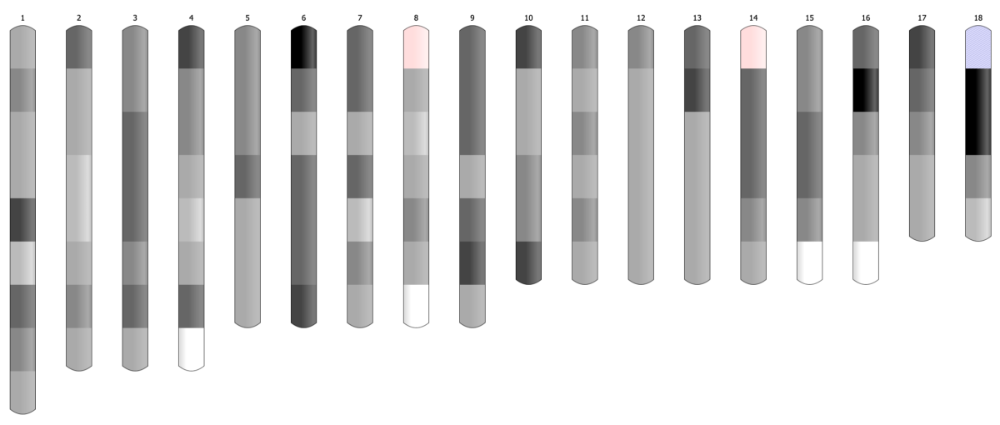

# Applications

In ***Bioinformatics*** ideogram graph is used to **visualize the positions of genes** or microRNA along the chromosome. Easily distinguishable regions are called cytogenetic bands. The **pattern of bands** makes each chromosome unique. The ideogram shows the set of chromosomes of varying lengths, every split into two arms divided by a centromere.

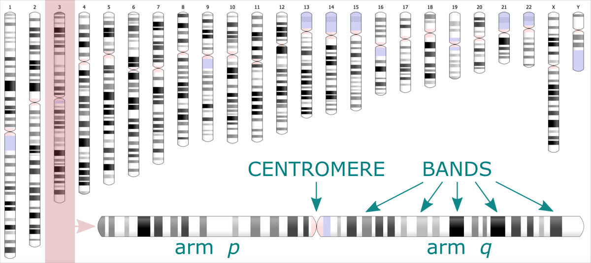

Using an ideogram, you can also ***visualize the results of electrophoresis***. It is an experimental technique where the biomolecules (peptides, proteins, nucleic acids) are segregated **based on their size and electrical charge**. Depending on these properties, the **molecules migrate** through the matrix under electric current at different rates, **leaving the characteristic pattern**. Analyzing the **location and size of bands** allows for identifying the type and number of molecules.

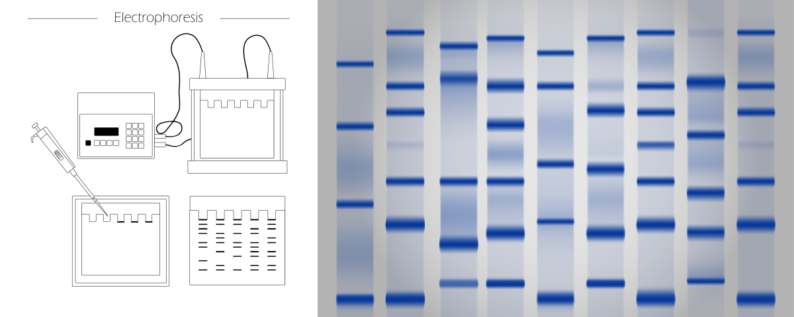

Although the mentioned are the most common applications of the ideogram, you can also use this chart type to **visualize other data**. Typically, it is a good choice for visualizing **irregular ranges along an ordered direction**.
The **direction** can be an observation index, position, time, or any unitary variable. The difference between the highest and smallest value will **determine the length of the bar**.
Ranges or **bands** along the bar **visualize the pattern** of the analyzed feature. Different **colors** may correspond to labels, categories, or **feature types**. *For example, they can depict the species of grains crop that has given the highest yields over the decades in the last century.* But also, different **colors** can refer to the **intensity of a feature**. *For example, they can show how the amount of corn produced has changed over the decades in the last century.*

# Case study

Let's assume the corn yield **data at daily frequency was collected** (*^365 times a year at most*) for a hundred years with continuing indexing of days. Now, we are interested in **identifying general periods of shortages**. A change in the data structure is required before visualization to get an informative output. To begin with, we need to **aggregate the data to make a more coarse-grained unit of time**.

***How will we aggregate the data?*** <br>
Most simply by summing or averaging the data from the selected period.

***How to optimize the length of the period?*** <br> Ideally, the way to highlight the significant level of feature variability.

1) In the general scenario, we could aggregate the data over every 365 input rows, slicing it into 100 annual periods. <br>
2) In another variant, we could ask for ten periods only and estimate the number of rows merged into the data slice.

**However, let's suppose that data from some random days over the years are missing**. <br>
In this case, dividing the data into **chunks based on a fixed number of rows or slices will lose the reference to time**. (*In the first scenario, the last period will be much smaller, while in the second scenario, all periods will be equal but still smaller than 365 days, and some days can drop into the wrong year*). <br>
So, to solve this issue, we should **create data slices based on the increment** of the day counter, where days from the first year to the 100th year were indexed continually, including days of missing data. <br>
Thus, we will take all rows whose indexes match the increment range for every slice. The value increment should be 365 to create annual periods. (So, 1-365 are days indexes for the first year, 366 - 730 for the second year, etc.). <br>
**Note that in the slices where missing yields occurred, the count of the rows is smaller but known.** Thus, since the number of observations in periods varies, **data aggregation by averaging** over the data slice seems a more robust solution.


# Hands-on tutorial

In this practical tutorial we will use the bioinformatic data representing genetic features of species X detected in the chromosomes of newly discovered organism Y.

## Raw data

The data collected is a matrix indexed by a chromosome ID (*first column*) and positions along it (*second column*). The following numerical columns correspond to several traits. They contain a detection score given per position in the chromosome.

*Preview of `raw_data.txt`* file
```
HiC_scaffold_1  982     0       0       0       0       0       1       0       0
HiC_scaffold_1  983     0       0       0       0       0       1       0       0
HiC_scaffold_1  984     0       0       0       0       0       1       0       0
HiC_scaffold_1  985     0       0       0       0       0       1       0       0
HiC_scaffold_1  986     0       0       0       0       0       1       0       0
...

```

Ten chromosomes are of interest to us in total, each of the lengths (*number of positions*) specified in the second column.

*Preview of `scaffold_list`* file
```
HiC_scaffold_1 85794387
HiC_scaffold_2 78354714
HiC_scaffold_3 73667959
HiC_scaffold_4 72347313
HiC_scaffold_5 68914408
HiC_scaffold_6 68448654
HiC_scaffold_7 68188873
HiC_scaffold_9 62184626
HiC_scaffold_8 62148448
HiC_scaffold_10 59711964
```

Assuming the raw file comes contaminated with results for other scaffolds, we will keep only the rows that match the chromosome list for the Y organism.
```
for i in `cat scaffold_list | awk '{print $1}'`; do grep $i"\t" < raw_data.txt >> input_data.txt; done
```

The resulting file `input_data.txt` will be used as a direct input for the data aggregation step.

## Bin Data app

To process the `input_data.txt` file we use a ready-made Python application <b><a href="https://github.com/ISUgenomics/data_wrangling/bin_data" target="_blank">bin_data ⤴</a></b>, available in the <a href="https://github.com/ISUgenomics/" target="_blank"> ISUgenomics </a>/<a href="https://github.com/ISUgenomics/data_wrangling" target="_blank">data_wranglig ⤴</a> repository.

You can learn more about the <a href="https://github.com/ISUgenomics/data_wrangling/tree/main/bin_data" target="_blank">bin_data.py ⤴</a> app from the comprehensive tutorial <a href="https://datascience.101workbook.org/07-DataParsing/03-DATA-WRANGLING-APPS/02-slice-or-bin-data-py" target="_blank">Aggregate data over slicing variations ⤴</a> published in the <a href="https://datascience.101workbook" target="_blank">Data Science Workbook ⤴</a>. You will find there:
* the application <a href="https://datascience.101workbook.org/07-DataParsing/03-DATA-WRANGLING-APPS/02-slice-or-bin-data-py#app-overview" target="_blank">Overview ⤴</a>
* description of the <a href="https://datascience.101workbook.org/07-DataParsing/03-DATA-WRANGLING-APPS/02-slice-or-bin-data-py#algorithm/" target="_blank">Algorithm ⤴</a>
* documentation, including <a href="https://datascience.101workbook.org/07-DataParsing/03-DATA-WRANGLING-APPS/02-slice-or-bin-data-py#requirements" target="_blank">Requirements ⤴</a> and <a href="https://datascience.101workbook.org/07-DataParsing/03-DATA-WRANGLING-APPS/02-slice-or-bin-data-py#options" target="_blank">Options ⤴</a>
* examples of generic <a href="https://datascience.101workbook.org/07-DataParsing/03-DATA-WRANGLING-APPS/02-slice-or-bin-data-py#usage-generic" target="_blank">Usage ⤴</a>
* <a href="https://datascience.101workbook.org/07-DataParsing/03-DATA-WRANGLING-APPS/02-slice-or-bin-data-py#hands-on-tutorial" target="_blank">Hands-on tutorial ⤴</a>, including 6 detailed case studies

### Approach

Before we aggregate data over data slices, first, we need to split it into **chromosome-based data chunks**. To do so, we can use the column with chromosome IDs, referred further to as `label-col`. Then, each data chunk will split into **custom-size slices using the increment** of values of the column storing positions, referred further to as `ranges-col`. Finally, numerical `data-cols` (columns of different traits) will aggregate for every slice by calculating the `sum` or `mean`.

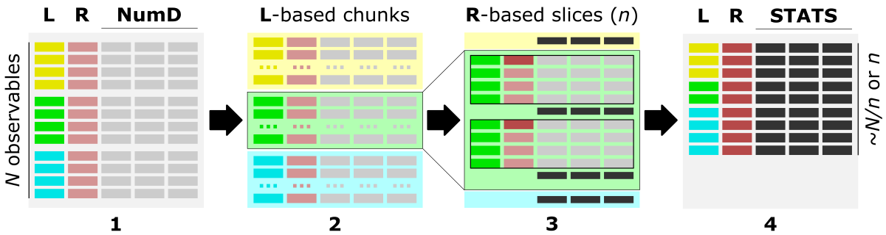 <br>
<i>The figure shows the main steps of the <code>bin_data</code> algorithm.</i><br>

The optimal data structure requires:<br>
<b>L</b> - <code>label-col</code>, a column of labels, <b>HERE:</b> chromosome IDs<br>
<b>R</b> - <code>ranges-col</code>, numerical [int, float] column of ordered data characteristic, <b>HERE:</b> positions along the chromosome<br>
<b>numD</b> - <code>data-cols</code>, any number of numerical columns that will be aggregated, <b>HERE:</b> traits 1-8.<br>

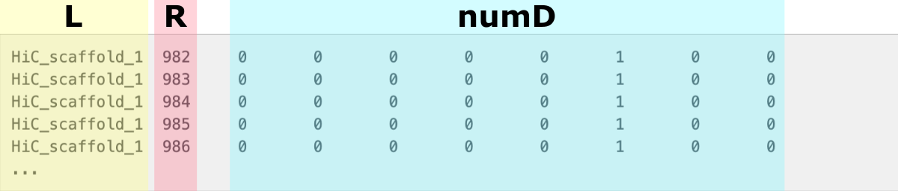 <br>
<i>The figure shows the data structure of `input_data.txt`. The <b>L</b> column stores chromosomes IDs and is used to create label-based data chunks. The <b>R</b> column stores positions along the chromosome and is used to create slicing ranges. The <b>numD</b> columns are numerical data that will be aggreagted over slices.</i>

<span style="color: #ff3870;font-weight: 500;">This step is implemented in the <b>bin_data.py</b> Python app.</span>

### *Aggregate observations over value increment*

When you look closely at the data, you notice that **some positions** along the chromosomes **are missing** in the matrix.

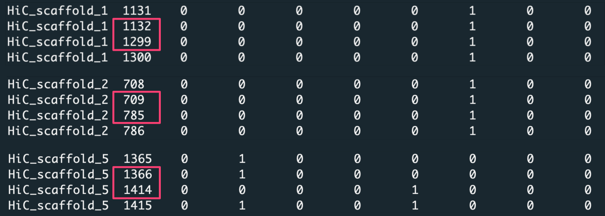

Because of that, aggregating data over <u>a constant number of rows</u> `[-t 'step']` or splitting data into <u>a fixed number of slices</u> `[-t 'bin']` will lose the reference to exact positions along the chromosome. Thus for such a dataset, we **aggregate observations over value increment** `[-t 'value']`, where the value is the positions column. <br>
In this case, we request to aggregate data with increment X `[-n X]` of position values. *For example, with increment X=1000, the first data slice is created from position 1 to 1000, the second from position 1001 to 2000, etc.* To detect the most **optimal slicing increment**, we should consider a few variants of X. Note the average length of the chromosomes in the input file is several tens of millions, so a good choice is setting X to 10k, 100k, 1M, and 10M. <br>
Considering data for some indexes are missing, the number of input rows **(counts) may vary among slices**. Since the lack of data is random, we can not be sure if these positions would be significant in detecting the trait. Therefore, it makes more sense to **average data over slices** `[-c 'ave']` instead of summing it `[-c 'sum']`. To make sure numerical results round to a meaningful number, let us keep three decimal places `[-d 3]`.

***Run `bin_data.py` app in the command line:***

```
python3 bin_data.py -i input_data.txt -l 0 -r 1 -t 'value' -n 10000 -c 'ave' -d 3 -o 'output-value_ave_10k'
```

In addition to the aggregated data output (*output-value_ave_10k.csv*), the application will generate a `CHUNKS` directory where it writes **chromosome-based chunks of raw data**. You can use these files as input in the repetitions of the analysis, such as in the X-increment optimization. That will definitely speed up the processing of Big Data inputs.

```
for X in 100000 1000000 10000000
do
    python3 bin_data.py -i ./CHUNKS -l 0 -r 1 -t 'value' -n X -c 'ave' -d 3 -o 'output-value_ave_$X'
done
```

*Preview of the `output-value_ave_10k` with data aggregated over slices cut with X=10k units in the 'position' column. The trait's values were averaged for rows in every data slice, and the number of rows is given in the 'counts' column.*

```
         label,   position,val-2,val-3,val-4,val-5,val-6,val-7,val-8,val-9,count
HiC_scaffold_1,  982-10982,0.591,0.567,0.048,0.000,0.380,0.822,0.074,0.359,1373
HiC_scaffold_1,10982-20982,0.803,0.642,0.238,0.326,0.895,1.057,0.000,0.456,2025
HiC_scaffold_1,20982-30982,0.107,0.000,0.000,0.052,0.507,0.378,0.000,0.085,672
HiC_scaffold_1,30982-40982,0.471,0.000,0.417,0.000,0.206,0.007,0.000,0.000,427
HiC_scaffold_1,40982-50982,0.865,0.697,0.152,0.228,0.410,1.276,0.151,1.030,1279
HiC_scaffold_1,50982-60982,0.313,0.217,0.332,0.082,0.362,0.497,0.034,0.033,2042
HiC_scaffold_1,60982-70982,1.580,1.008,0.204,0.288,0.776,1.593,0.455,0.195,1768
```


## Visualize using ideogram

Once the data is aggregated to different coarseness, it is time to **adjust the format for visualization on the ideogram.** <br>
An ideogram is a diagram in which we have only one dimension for a numerical variable. This is the index or position along the bar. <br>
***So how can you display aggregated data for individual traits?*** <br>
We need to convert the numerical values into colors used for regions bounded by the position ranges (referred further as **bands**). <br>
***How to do it?*** <br>
First you need to choose a scale composed of discrete colors. Then, each color needs to be assigned a range of values that correspond to it. <br>
***How can you map values to colors?*** <br>
First, you need to find the minimum, maximum, mean, and standard deviation values for the trait's aggregated data. Assign values around the mean for the color corresponding to the center of the scale. Then, gradually adjust values between minimum and mean for the lower part of the color scale and values between mean and maximum for the upper part of the color scale. The number of value ranges should correspond to the number of colors used. You can also depend on the standard deviation for the length of the value range for a given color.

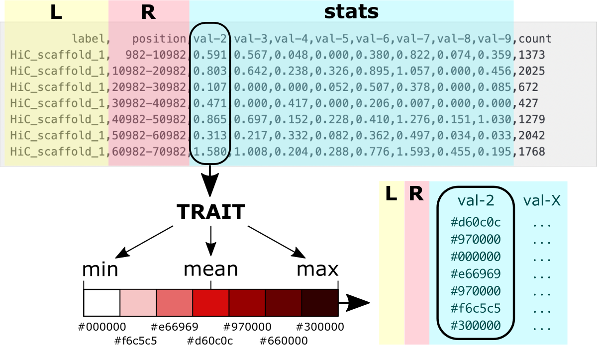 <br>
*The figure shows the values to colors mapping.*

**Luckily, you do NOT have to implement the algorithm that will do it yourself.** <br>
<span style="color: #ff3870;font-weight: 500;">Use a ready-made <a href="https://raw.githubusercontent.com/ISUgenomics/data_wrangling/main/bin_data/convert_for_ideogram.py" target="_blank">convert_for_ideogram.py ⤴</a> application in Python</span>, moving to subsection: <br>
<b>A.</b> (<i>dash-bio ideogram</i>) or <br>
<b>B.</b> (<i>customizable plotly ideogram</i>) <br>
to follow detailed instructions for converting data for visualization on an ideogram.

### A. Use dash-bio variant (JS)

An <a href="https://dash.plotly.com/dash-bio/ideogram" target="_blank">Ideogram ⤴</a> visualization is available among components in the <a href="https://dash.plotly.com/dash-bio" target="_blank">Dash Bio ⤴</a> module of the <a href="https://dash.plotly.com/introduction" target="_blank">Dash ⤴</a> framework. The <a href="https://github.com/eweitz/ideogram" target="_blank">Ideogram ⤴</a> was originally developed in JavaScript by <a href="https://github.com/eweitz" target="_blank">Eric Weitz ⤴</a> to provide chromosome visualization for the web. Further, it was encapsulated into the Dash framework for easy use by importing from the dash-bio library.

An ideogram imported from the dash-bio library makes it easy to visualize the pattern of bands on chromosomes. The application allows **visualizing chromosomes for standard organisms** available in an online <a href="https://unpkg.com/browse/ideogram@1.37.0/dist/data/" target="_blank">UNPKG database ⤴</a>. For these organisms, you can use your own annotation file. However, the approach is browser-based, and both bands and annotations **data are loaded exclusively through the URL**. That is a <u>huge limitation</u> for individual users who would like <u>to load input directly from the file system</u> on the local machine. To visualize your own data for a customized organism, you need to create an online database (*using GitHub Pages as the simplest solution*) or add files to the existing one to load data from it via URL. Another complication is the **strictly defined format** of the bands and annotations data files. Also, there are very **limited options for coloring bands**, which provides only 7 built-in gray shades (including white and black) and 2 additional colors (pink, and purple). Still, this variant of the ideogram allows for a nice interactive transition between **horizontal or vertical orientation** and **adjusting the dimensions** of the bars.

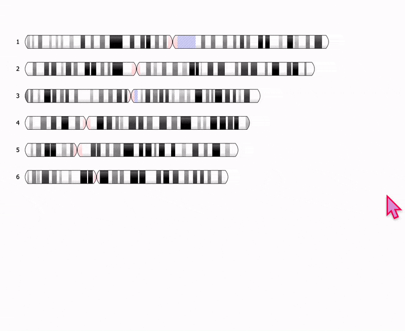

To facilitate visualizations using the JavaScript variant of the Ideogram, I built a web application using the Dash-Bio ideogram component and Dash framework. The app runs within Jupyter Notebook, and a single click opens the Ideogram interface in the separate browser tab. Then, you can select inputs and adjust visualization options using Dash widgets without the necessity of any changes in the source code. <br>
Following the steps in this section, you will learn how to: <br>
(1) convert inputs into the required format <br>
(2) upload data into the online database <br>
(3) run the app in the JupyterLab <br>
(4) adjust visualization using the Ideogram

<span style="color: #ff3870;font-weight: 500;">If you want to load customized files directly from the local file system, go to section B. <a href="https://" >Customizable Plotly-based Ideogram</a>.</span>

### *Convert data structure*

**Chromosome bands data**

The required input format for chromosome bands data is a JSON string composed of a dictionary with a `"chrBands"` keyword for which the value is a list of bands for all chromosomes.

```
{"chrBands" : []}
```
Every band is defined as a string of 8 fields separated by a single space. Subsequent strings for bands are separated by a comma.

```
 1 2    3   4        5   6        7      8
------------------------------------------
"1 p p1-0 982 10000982 982 10000982 gpos33",
"1 q q1-0 235 10000235 235 10000235 gpos50"
```

**1)** The first column is a chromosome ID, typically a number or letter (*e.g., for a human 1-22, X, Y*). <br>
**2)** The second column is a chromosome arm, `p` or `q` for shorter and longer arm, respectively. <br>
**3)** The third field is a custom name for a band, typically a gene name. <br>
**4-7)** The fourth and fifth columns contains `from` and `to` range of chromosome positions. Usually the same range is repeated in the sixth and seventh columns. <br>
**8)** The last field contains alias for the color of the band.

**Convert bands data for ideogram**

Use <a href="https://" target="_blank">convert_for_ideogram.py ⤴</a> Python mini app to assign colors for value ranges. Implemented options make the application flexible to user needs. You can learn more from the documentation available in the <a href="https://github.com/ISUgenomics/data_wrangling" target="_blank">data_wrangling</a>/<a href="https://" target="_blank">assign_colors</a> repo and the <a href="https://" target="_blank">X</a> tutorial in the <a href="https://" target="_blank">Data Science</a> workbook.

*available options of `convert_for_ideogram.py`:*

```
  -h,       --help                       show this help message and exit
  -i input, --data-source input [string] input multi-col file
  -l label, --labels-col label     [int] index of column with labels
  -r range, --ranges-col range     [int] index of column with ranges
  -a arm,   --arms-col arm         [int] index of column with chromosome arms annotation
  -b band,  --bands-col band       [int] index of column with bands annotation (names)
  -v vals,  --values-col vals      [int] list of indices of numerical columns to have color assigned
```

The `-i`, `-l`, and `-r` options are required, so you have to specify the input file, the index of a column with chromosome labels, and the index of a column with the band's position ranges. *Note numbering in Python starts from 0.* If you do NOT specify the `arm` column, the 'p' value will be assigned for all bands, and so all chromosomes will consist of a single arm. If you do NOT specify the `band` column, names of bands will be created automatically following the syntax `arm+chromosomeID-{next_int}`. If you do NOT provide the 'vals' list with indexes of traits columns, then by default, all numerical columns will be mapped to colors.

In our dataset, we do NOT have the information about arms and bands names. We also want to make value-to-color mapping for all traits. So, let it all be default for the purpose of data format requirements. We only specify the `label-col` as 0 and `ranges-col` as 1.

```
python3 convert_for_ideogram.py -i output-value_ave_10k.csv -l 0 -r 1
```

By default, the algorithm uses the `mean` value of a given trait to specify the ranges matching the built-in colors. So, the gpos50 corresponds to the mean, and gpos100 corresponds to the 2x mean. Pink and purple highlight bands with the highest intensity of a trait. <i>To learn more about other variants of value-to-color mapping, see the <a href="https://" target="_blank">assign_color.py ⤴</a> documentation.</i>

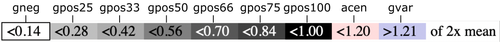

As the output, you will get separate JSON files for all traits (*8 in this example*).

*Preview of the resulting `data-val2-10M.json` file:*

```
{"chrBands":
  [
    "1 p p1-0 982 10000982 982 10000982 gpos33",
    "1 p p1-1 10000982 20000982 10000982 20000982 gpos50",
    "1 p p1-2 20000982 30000982 20000982 30000982 gpos33",
    ...
    "2 p p2-9 285 10000285 285 10000285 gpos66",
    "2 p p2-10 10000285 20000285 10000285 20000285 gpos33",
    "2 p p2-11 20000285 30000285 20000285 30000285 gpos25"
    ...
  ]
}
```

### *Upload data into the database*

The next step is to upload JSON files into the online database, to access them via URL. You can add files to any website/server that provides online visibility. For individual users, the simplest solution is to create <a href="https://docs.github.com/en/pages/getting-started-with-github-pages/about-github-pages" target="_blank">GitHub Pages  ⤴</a> from your personal account and create indexed file struture, that will display content online.

Once you have personal <a href="https://docs.github.com/en/get-started/signing-up-for-github/signing-up-for-a-new-github-account" target="_blank">account on GitHub ⤴</a>, please follow the instructions in the <a href="https://docs.github.com/en/pages/getting-started-with-github-pages/creating-a-github-pages-site" target="_blank">Creating a GitHub Pages site ⤴</a> tutorial, to host a website with your database.

<div style="background: mistyrose; padding: 15px; margin-bottom: 20px;">
<span style="font-weight:800;">WARNING:</span>
<br><span style="font-style:italic;">
<i><b>Note the website will be public, so the content (including your files) will be visible to anyone.</b> If you want to visualize data directly from your file system using local server (incognito), go to section B. <a href="https://" >Customizable Plotly-based Ideogram</a>.</i>
</span>
</div><br>

Once your website is hosted online, `git clone` the X repository on your local machine, copy the ideogram folder into yor **user.github.io** repository, and `git push` it back on the GitHub server. Follow instructions below, to do that step-by-step.

0) If you haven't already done so, clone **your** `user.github.io` repository.

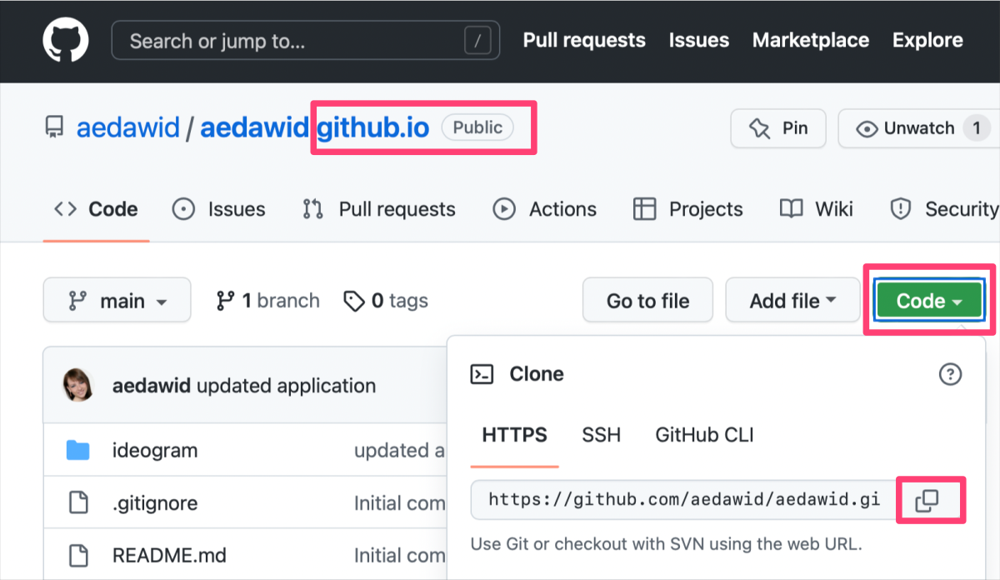 <br>
*The Figure shows how to copy the URL link of a selected GitHub repository.*

In the terminal window at selected location in the file system on your local machine, type:
```
git clone {copied URL}
```

1) Clone ideogram_db repository on your local machine.

```
git clone https://github.com/ISUgenomics/ideogram_db.git
```

The `ls` command should display both new repositories on your current path.

2) Enter the `ideogram_db` repo, remove `.git` folder, and move the remaining content into your personal repository

```
cd ideogram_db
rm -r .git
cp -r * /path/to_your_personal_repo.github.io
cd ../
rm ideogram_db
```

3) Navigate to your `.github.io` folder and make `git push`

```
cd path/{your}.github.io
git status
git add *
git commit -m 'added basic data structure of ideogram database'
git push
```

Visit your GitHub Pages online at `https://{account}.github.io` and refresh the website. Compare the appearance of the page with the expected result.

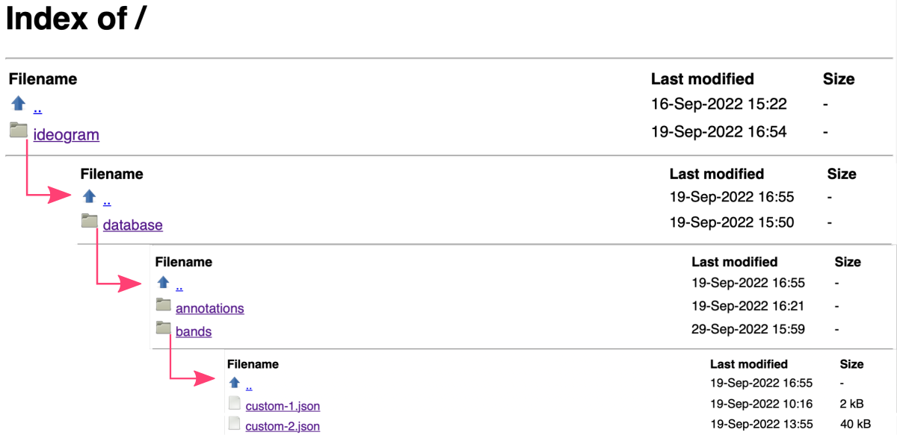

**Copy custom data into the database**

In the terminal window, copy your customized JSON data on the `ideogram/database/bands` path in your `{user}.github.io`:

```
cp path/to/JSON/data/*.json {user}.github.io/ideogram/database/bands/
```

Then, navigate to `{user}.github.io/ideogram/` and execute `run_me_before_commit.sh` bash script. This step will automatically update the index of files in the database and rename them to follow the syntax `custom-{int}` required by Ideogram JS module. *Don't worry, you will see the original names of your files in the application interface. The list of matching pairs is in the `list` file on the `.../ideogram/database/bands` path in your `{user}.github.io`.*

```
cd {user}.github.io/ideogram/
. ./run_me_before_commit.sh
```

The final step is to commit the updated database:

```
git status
git add {copy list of added and modified files}
git push
```

You can review the list of files hosted in your database online at `https://{account}.github.io/ideogram/database/bands/`.

### *Open ideogram in JupyterLab*

### B. Use plotly variant (PY)

### *Convert data structure*

### *Open ideogram in JupyterLab*
