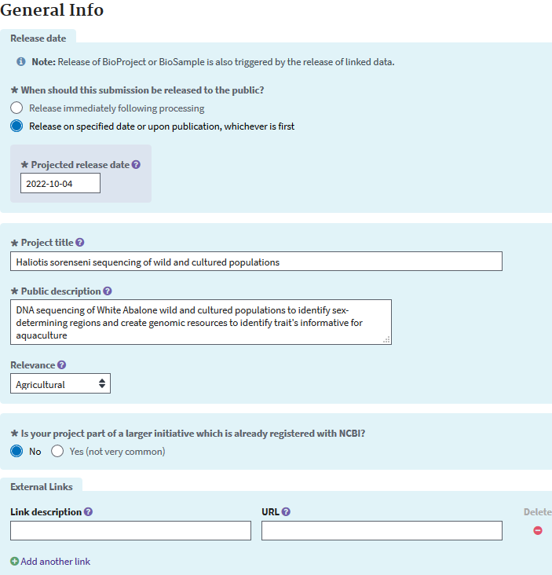
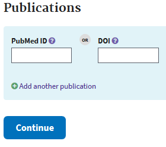
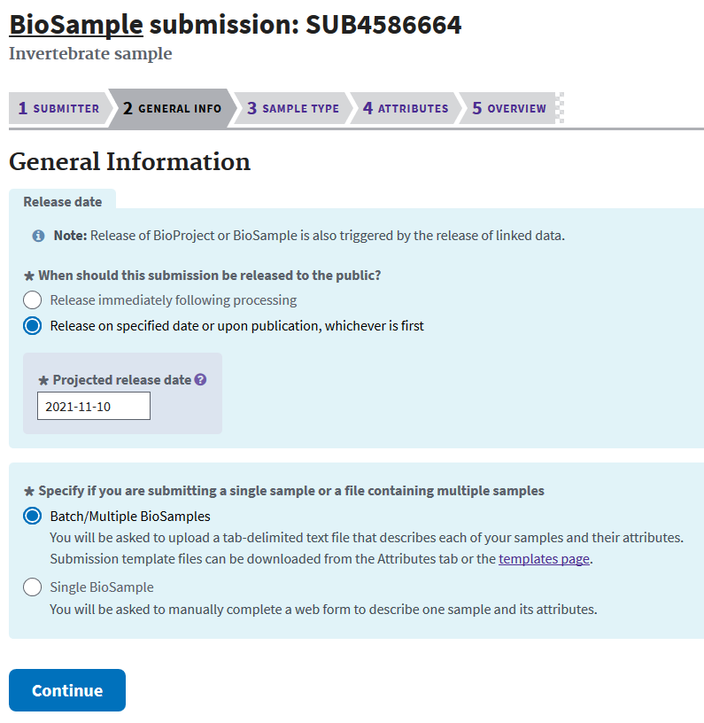
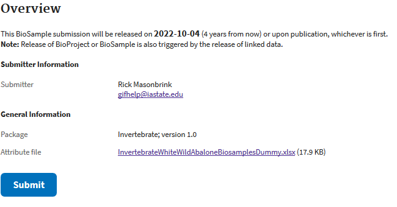
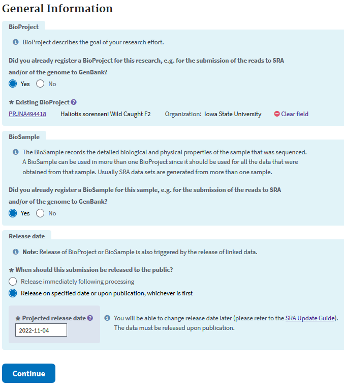
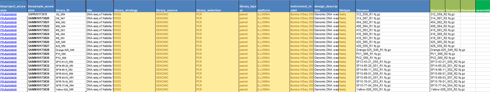
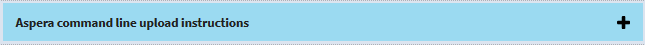
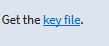
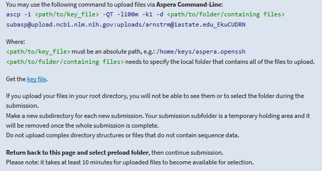
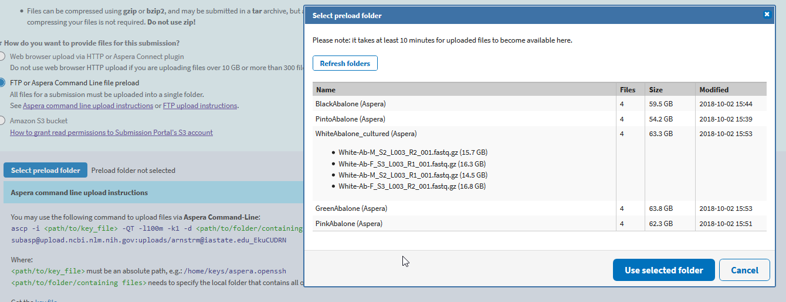

Submitting sequencing data is a requirement for nearly every journal, and thus getting it in order as soon as your sequencing is received  will make this process go much faster.  This is mostly because the details of your sequencing will be fresh in your mind, and with the variability in BioSample/metadata submissions by type, you may not record sufficient enough detail to submit at a later date.  

First you'll have to create an account on ncbi before submission.  Here is a current link --10/04/2018

[A link to create an NCBI account](https://www.ncbi.nlm.nih.gov/account/register/?back_url=https%3A%2F%2Fwww.ncbi.nlm.nih.gov%2F&partners-uri=cms:/account/partners)

Now the next step is finding the submission link, which I always have trouble with.  You can find a link at the bottom left of the ncbi homepage (https://www.ncbi.nlm.nih.gov/) that says "Submit Data".

If you are not sure about what type of data you have, then you can use the submission wizard in the bottom right of the page.  Otherwise the giant blue picture is a hyperlink to get started on a submission.


Here is the page that you need to decide which type of submission you want to proceed with.  In the top left corner of this page you are given the options below.


For simplicity I will perform an example submission of some short read sequencing. When submitting a single sample there is always the need for three different submissions: a BioProject, a BioSample, and a submission specific to your type of data. Here I will demonstrate a typical sequence read archive submission.

Because having a definition for each required submission type may facilitate an easier submission, here are the two submission types that will always  be required.
1. The BioProject is an submission to gather details about your research project and acts as an umbrella to contain all of your other data types.
2. BioSamples describe each biological sample in your research project, for which you have data to deposit.  The BioSample can also act as an umbrella for many different data types with the same specimen.

As for doing a short read sequencing deposition, I will perform both a BioProject and BioSample submission, followed by a sequence read archive submission.

# BioProject submission

After clicking BioProject, you'll be asked to add your personal or organizations information. Click continue.


The next page asks for the data types that you will be depositing.


The next form's purpose is to add details about the organism of the study.


Then you'll be taken to a page to add information about your project, data release date (up to 4 years holding time), the project's grants pertinent to the data, links to your data, etc. Your data is only released at the date you set, or at first publication that cites the accessions in the submission.



The next page will give you the option to enter your BioSamples. I will do this in a separate step to avoid a confusion of the BioProject and BioSample.  


Usually journals do not publish without prior data deposition, but if your work is already published include it at this step.



Then submit your Bioproject to be done with the first required submission.


# BioSample submission

If you click "My submissions" on the top of the screen, you'll be redirected to your submission screen.  Here you can choose Biosample.


The first step is the same as for the BioProject, which is the chance to update the information of the submitter.

The next screen asks for general information on the samples and desired release date for the data.  Remember, your data is only released at the date you set, or at first publication that cites the accessions in your submission.



Your selection on the next screen will determine which types of data are required for your submission.
For this example I am submitting DNA-seq from an invertebrate.


Now the real work starts, which is highly dependent on the collections of your organisms attributes.


When many samples are to be deposited, the easiest method is to download and fill in the excel template. As is explained in the text at the top of the Biosample excel sheet: green columns are required, yellow are optional, and blue colors need info in at least one field. If you run your cursor over each colored header then you can get more information on what is acceptable.

Here I added a "sample name" that was unique to each specimen, a "sample title", the "bioproject accession" that we created previously, the organism (*Genus species*), the isolate/breed, the host/isolation source, collection date, the geographic location in a specific format (Country:city state) and the tissue source. Save your excel file and attach to the attribute screen.


Once NCBI agrees that you've entered all the information in correctly, you can move to the submit screen.




# Short read archive submission

If you click "My submissions" on the top of the screen, you'll be redirected to your submission screen.  Because I am uploading sequencing data, I will click "Sequence Read Archive".


The first step is the same as for the Bioproject and Biosample, which is the chance to update the information of the submitter.

Then you are taken to the next screen that asks for your bioproject ID (found in "My submissions" shortly after submission), if you registered Biosamples, and when the data should be released.  



The next step is very much like the attributes step of the Biosample, except everything in the second sheet of the Excel sheet is required.  Descriptions for many of the data types can be had in sheets 1 and 3.


In the Excel sheet you'll have to fill in your BioProject and BioSample accessions (found in "My submissions" shortly after submission).  Then you'll need to fill out each column.  You'll need to have a unique library ID, a title for each data sample, the library strategy (WGS), a library source (Genomic), the type of library selection (PCR), the library layout (single or paired), the sequencing platform (Illumina), the Illumina instrument (Hiseq 3000), a brief description of methods, the sequencing file type (fastq), and then the names of your sequencing files. If you are unsure of the data type you have, more information can be had in Excel sheets 1 and 3.



The next step is to upload your data to NCBI.  The easiest and quickest method for this lies with using Aspera.  You simply have to click the plus here.



This will give you the command to use at your terminal.

1.  Create a new folder for your sequence uploads.
2.  Softlink all of your data files to this folder.
3.  Copy the "key file" to the directory above your newly created folder.  



4.  Input the aspera command you are given to the appropriate directories.



Here are my commands to do just as I specify above
```
#This is my starting directory
#/work/GIF/archive1/Purcell/abalone/

#create folder
mkdir AbaloneWhiteWildUpload
#move to said folder
cd AbaloneWhiteWildUpload
#softlink all of my fastq.gz files to this folder
for f in ../WhiteAbalone_wild/*gz; do ln -s $f; done

#copy and paste aspera key to  file
vi aspera.openssh

module load aspera/3.7.7
#transfer my data to ncbi with aspera
ascp -i /work/GIF/archive1/Purcell/abalone/aspera.openssh -QT -l100m -k1 -d /work/GIF/archive1/Purcell/abalone/AbaloneWhiteWildUpload/ subasp@upload.ncbi.nlm.nih.gov:uploads/arnstrm@iastate.edu_EkuCUDRN
```

Once done transferring, which can take awhile, you click "Select preload folder".  It will pop up a window that shows all of your loaded files/folders.



Select your folder, and if your files match your metadata and have completely uploaded, click "Use selected folder" and "Continue" to the final overview and submit page.  You are done!


It takes about 2-4 weeks for NCBI to process your data and assign accession numbers. If there are problems with your submission that the online form did not catch, you'll likely receive an email from NCBI staff for clarification.
