Depositing a genome and its gene annotation into NCBI ensures that it is accessible to the scientific community, is properly archived, and links the relative metadata. Submission typically involves preparing the sequence data, genome, gene annotation, and assembled organelle genomes. This tutorial combines multiple genomes, Biosamples, and Bioprojects from different species to illustrate a variety of steps.  Not every dataset will require all of these steps, but they are included here to provide a comprehensive guide. 

- [Bioproject submission](#bioproject-submission)
    - [Bioproject - SUBMITTER](#bioproject---submitter)
    - [Bioproject - PROJECT TYPE](#bioproject---project-type)
    - [Bioproject - TARGET](#bioproject---target)
    - [Bioproject - GENERAL INFO](#bioproject---general-info)
    - [Bioproject - BIOSAMPLE](#bioproject---biosample)
    - [Bioproject - PUBLICATIONS](#bioproject---publications)
    - [Bioproject - REVIEW \& SUBMIT](#bioproject---review--submit)
- [Biosample](#biosample)
    - [Biosample - SUBMITTER](#biosample---submitter)
    - [Biosample - GENERAL INFO](#biosample---general-info)
    - [Biosample - SAMPLE TYPE](#biosample---sample-type)
    - [Biosample - ATTRIBUTES](#biosample---attributes)
    - [Biosample - REVIEW \& SUBMIT](#biosample---review--submit)
- [Sequence read archive (SRA)](#sequence-read-archive-sra)
    - [SRA - SUBMITTER](#sra---submitter)
    - [SRA - GENERAL INFORMATION](#sra---general-information)
    - [SRA - SRA METADATA](#sra---sra-metadata)
    - [SRA - FILES](#sra---files)
    - [SRA - REVIEW \& SUBMIT](#sra---review--submit)
- [Genome Only](#genome-only)
    - [Genome Only - SUBMITTER](#genome-only---submitter)
    - [Genome Only - GENERAL INFO](#genome-only---general-info)
    - [Genome Only - GENOME INFO](#genome-only---genome-info)
    - [Genome-only - FILES](#genome-only---files)
    - [Genome-only - GAPS](#genome-only---gaps)
    - [Genome-only - ASSIGNMENT](#genome-only---assignment)
    - [Genome-only - REFERENCES](#genome-only---references)
    - [Genome-only - SUBMIT \& REVIEW](#genome-only---submit--review)
- [Genome and Annotation](#genome-and-annotation)
    - [Genome and Annotation - SUBMITTER](#genome-and-annotation---submitter)
    - [Genome and Annotation - GENERAL INFO](#genome-and-annotation---general-info)
    - [Genome and Annotation - FILES](#genome-and-annotation---files)
    - [Genome and Annotation - GAPS](#genome-and-annotation---gaps)
    - [Genome and Annotation - ASSIGNMENT](#genome-and-annotation---assignment)
    - [Genome and Annotation - REFERENCES](#genome-and-annotation---references)
    - [Genome and Annotation - SUBMIT \& REVIEW](#genome-and-annotation---submit--review)
- [Additional Resources](#additional-resources)
  

### Prerequisites

Before initiating the submission process, ensure you have:

- A valid NCBI account.
- Prepared your sequence data, genome assembly, and annotation files.
- Collected detailed metadata about your project and samples.

### The most efficient order for submitting a genome and annotation to NCBI

1. Create a Bioproject - This serves as an umbrella for your study, linking multiple datasets together.
2. Create Biosamples - This describes each of the biological samples that were acquired for assembling or annotating your genome.
3. Submit sequencing to SRA - Each independent sequencing sample that is not a technical replicate will need to be deposited as a separate file. 
4. Submit genome and annotation - Once the information for the previous submissions is complete, you should have all of the information you need to deposit your genome, annotation,assembled organellar genomes, and plasmids (if any).

### Outline of NCBI submissions described here

1. Bioproject creation
2. Biosample creation 
3. Sequence Read Archive (SRA) submission
3. Genome-only submission (without a gene annotation)
4. Genome and gene annotation submission

# Bioproject submission

If you do not have an account with NCBI yet, you will need to create one for the submission. Once that is accomplished you can go to "My submissions" and click on Bioproject at the top left of the window.


Then click the 'New submission' at the top left.

### Bioproject - SUBMITTER

The first tab to fill out is the 'SUBMITTER' tab

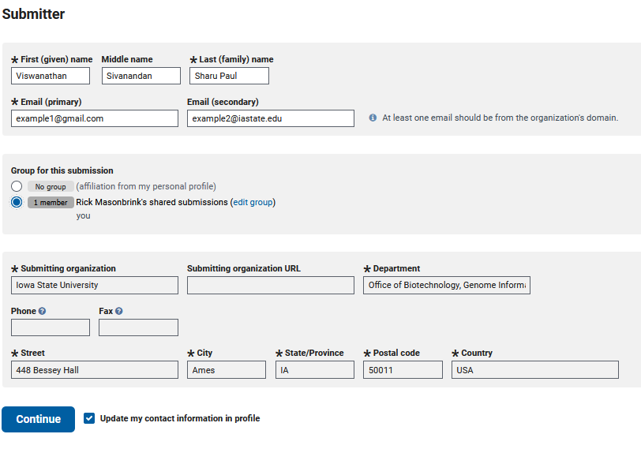

Since I created this genome and am submitting it, my submitter information is simple. This will become more complex when submitting for a group, which I will not show here. 

### Bioproject - PROJECT TYPE

Then you will need to choose the type of data you will be submitting. Here we assembled a genome, so checking 'Genome sequencing and assembly' will give us the required options needed for later genome submission steps. Then you need to choose the scope of your sample, which for genome submissions is often a monoisolate. We will also be needing locus tag prefixes to submit our annotation in a later step, so check this box.

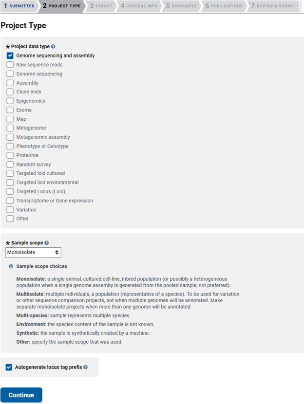

### Bioproject - TARGET

This takes you to the 'TARGET' tab, where you will list the scientific name of your organism and fill out one of the five options in the second line of boxes. The description is optional, but including as much information as possible will help future users utilize your data in subsequent analyses. 

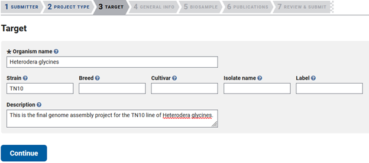

### Bioproject - GENERAL INFO

Then you will be taken to the 'GENERAL INFO' tab, where you will specify the release date of your data, add a public description, and select the relevance of your genome. You'll have to answer a few questions about external links to your data, the grants that funded your genome assembly/annotation, consortium associations, and if you are using a data provider. 

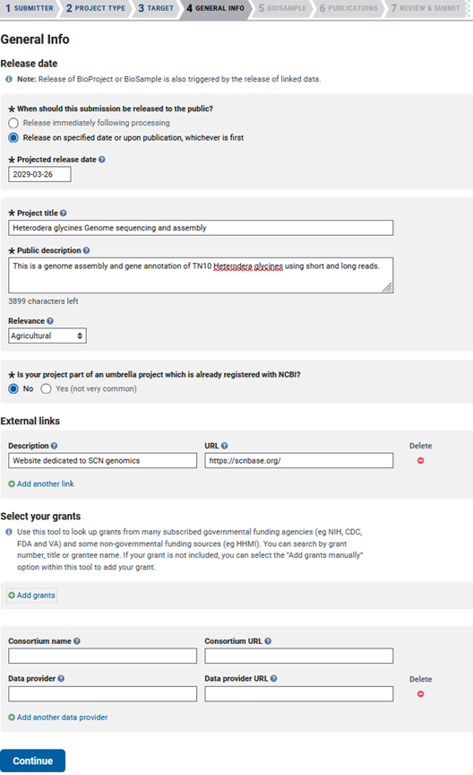

### Bioproject - BIOSAMPLE

The next tab is 'BIOSAMPLE', where you will list the previously created Biosample accessions that are associated with the sequencing data used to assemble the genome. In this case, I have not created my Biosample yet, so I leave the area blank. If you do have previously submitted Biosamples, then you can add them here. 

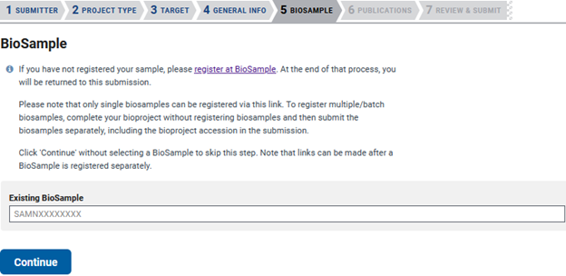

### Bioproject - PUBLICATIONS

The next tab is PUBLICATIONS, where you would list any published composition associated with this genome or annotation.

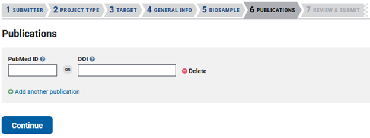

### Bioproject - REVIEW & SUBMIT

The last tab is 'REVIEW & SUBMIT'. This is your last opportunity to change the information in your submission, as after it is accepted you will have to email NCBI to make changes. 

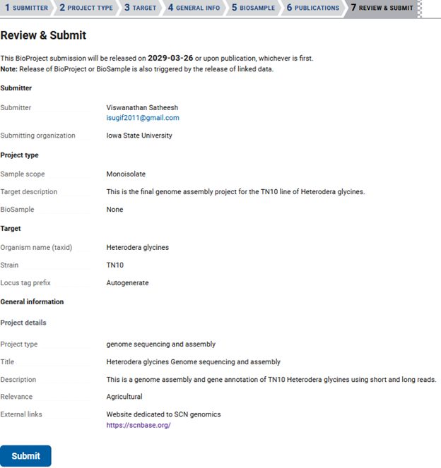

For detailed guidelines, refer to the [NCBI BioProject Submission Guide](https://www.ncbi.nlm.nih.gov/sra/docs/submitbio/#bioproject-submissions-guideline)

# Biosample

Creating a Biosample is the standard next step, essentially to describe the organism/organisms that were sequenced. The Biosample exists to link this sample description with your unique Bioproject, sequence read archive(SRA), genome, etc.

Starting at 'My submissions' you should click Biosample in the top left box. 


Then select 'New submission' at the top left. 

### Biosample - SUBMITTER

Once there you will have to fill out the 'SUBMITTER' information if it is different from your Bioproject submission. 


### Biosample - GENERAL INFO

Then, in the 'GENERAL INFO' tab, you will need to choose a release date and whether you want to submit a single Biosample or multiple.

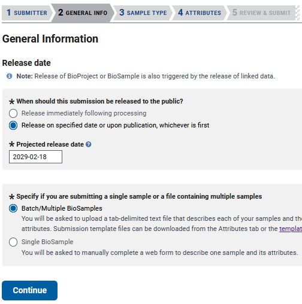

### Biosample - SAMPLE TYPE

Then you get to the 'SAMPLE TYPE' tab, which gives you lots of options for packages to submit your genome. Choosing a package that best represents your sample will require reading about each package, but here I will be using the Invertebrate package as an example. 

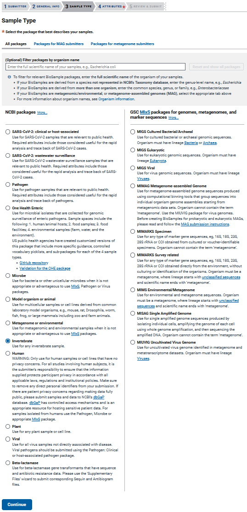

### Biosample - ATTRIBUTES

Pressing continue will move you to the 'ATTRIBUTES' tab, where you will be given the option to either use a built-in editor to enter your data one at a time, or download a TSV or Excel file to edit multiple samples simultaneously. 

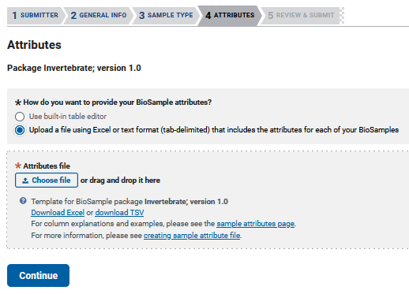

As is explained in the text at the top of the Biosample Excel sheet: green columns are required, yellow are optional, and blue colors need info in at least one field. If you run your cursor over each colored header then you can get more information on what is acceptable. I submitted multiple Biosamples for this project using the Excel file download.I filled out as much information as possible to enable future users to better utilize my data.

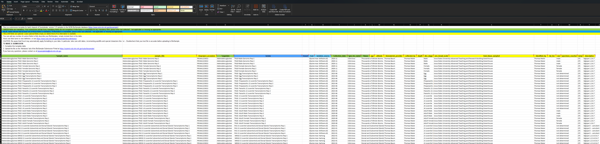

### Biosample - REVIEW & SUBMIT

Then you will be given one final time to review the Biosample related information before it cannot be changed, short of an email to NCBI. In my experience, if the input file fits the expected format, your submission should be accepted in a few minutes. 

For more information, visit the [NCBI BioSample Submission Guide](https://www.ncbi.nlm.nih.gov/sra/docs/submitbio/#biosample-submissions-guidelines)


# Sequence read archive (SRA)

If you click "My submissions" on the top of the screen, you'll be redirected to your submission screen.  Because I am uploading sequencing data, I will click "Sequence Read Archive".


### SRA - SUBMITTER

The first step is the same as for the Bioproject and Biosample, which is the chance to update the information of the submitter.


### SRA - GENERAL INFORMATION

At the next screen, the 'GENERAL INFO' tab, it asks for your previously created Bioproject and Biosample IDs.  


### SRA - SRA METADATA

The next step is very much like the attributes step of the Biosample, except everything in the second sheet of the Excel file is required for submission. 


### SRA - FILES 

In the Excel sheet you'll have to fill in your BioProject and BioSample accessions (found in "My submissions" shortly after submission). Then you'll need to fill out each column. You'll need to have a unique library ID, a title for each data sample, the library strategy (WGS), a library source (Genomic), the type of library selection (PCR), the library layout (single or paired), the sequencing platform (Illumina), the Illumina instrument (Hiseq 3000), a brief description of methods, the sequencing file type (fastq), and then the names of your sequencing files. If you are unsure of the data type you have, more information can be had in Excel sheets 1 and 3.


The next step is to upload your data to NCBI. The easiest and quickest method for this lies with using Aspera. You simply have to click the plus here.


This will give you the command to use at your terminal.

1.  Create a new folder for your sequence uploads.
2.  Softlink all of your data files to this folder.
3.  Copy the "key file" to the directory above your newly created folder.  


4.  Input the aspera command you are given to the appropriate directories.


Here are my commands to do just as I specify above. Note that many HPC's have data transfer nodes for this purpose and at Iowa State University this is the only node that has aspera installed.   

```bash
#create an empty folder
mkdir AbaloneWhiteWildUpload
#move to into this folder
cd AbaloneWhiteWildUpload
#softlink all of my fastq.gz files to this folder
for f in ../WhiteAbalone_wild/*gz; do ln -s $f; done
#copy and paste aspera key to a file I named keyfile
vi keyfile 
#If you need to see if aspera is installed, run 
which ascp 
#transfer my data to ncbi with aspera
ascp -i keyfile -QT -l100m -k1 -d /work/GIF/archive1/Purcell/abalone/AbaloneWhiteWildUpload/ subasp@upload.ncbi.nlm.nih.gov:uploads/arnstrm@iastate.edu_EkuCUDRN
```

Once done transferring and you've waited ten minutes, you should click "Select preload folder". It will pop up a window that shows all of your loaded files/folders.


Select your folder, and if your files match your metadata and have completely uploaded, click "Use selected folder" and "Continue" to the 'REVIEW & SUBMIT' tab.  

### SRA - REVIEW & SUBMIT

It can take a few days to a few weeks for NCBI to process your SRA data and assign accession numbers. If there are problems with your submission that the online form did not catch, you'll likely receive an email from NCBI staff for clarification.


For comprehensive guidance, refer to the [NCBI SRA Submission Guide](https://www.ncbi.nlm.nih.gov/sra/docs/submitportal/)

# Genome Only

A genome-only submission is commonly used when a gene annotation is not yet available or is to remain private. Uploading your genome-only sequence is easier than uploading a genome and gene annotation. The benefits of a genome-only submission is that if your assembly is in pseudomolecules/chromosomes then NCBI will annotate your assembly, with chromosome-level assemblies being prioritized.  

To deposit a genome you will need to go back to 'My Submissions' and then click Genome in the box at the top left corner. 


After that, you will see a blue 'New Submission' that allow you to start your Genome submission.   

### Genome Only - SUBMITTER

You start with the familiar 'SUBMITTER' tab that you've seen previously. 


### Genome Only - GENERAL INFO

Next is the 'GENERAL INFO' tab, where you will be asked a lot of information about your assembly and how it associates with your Bioproject and Biosamples. Since we have already submitted our Bioproject and Biosample, we can move forward by adding these accessions.

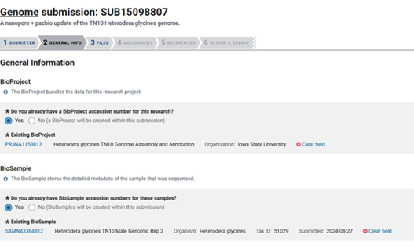

PRJNA1153013 is the assigned Bioproject accession and SAMN43384812 is the assigned Biosample accession in this case.

Next you have to choose the release date, which I always put as the furthest out I can (four years). This way my data will stay private long enough for me publish the research it is used in. Once the Bioproject is published in a paper, all of the associated data is released.

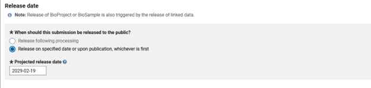

### Genome Only - GENOME INFO

Then you move to the 'GENOME INFO' tab, where you will need to input the various details of your data and assembly methods. This includes the assembly date, software titles and versions, and a name for the assembly if there are multiple versions. I named my genome assembly, as this is the third update to this genome. Then you will need to compute the read coverage of your genome. I used nanopore and pacbio reads to assemble the genome, so I will need to calculate the total sequence length of the reads used for assembly.

**Compute genome coverage**
One of the first questions is to estimate the coverage of your reads to your genome assembly. This can be calculated by summing the total length of your input sequence reads and dividing by total genome size.

```bash
#I ran this multiple times, as I had multiple read sets

zcat *.fastq.gz | seqtk seq -A - | awk '{if(NR%2==0) total+=length($0)} END {print total}'

5,754,629,444 bp is the total length of my nanopore reads.
18,212,104,559 bp is the total length of my pacbio RSII reads

23,966,734,003 bp is the total length of all reads used in assembly

My genome size is 114,996,807, so reads/genome size = 208.4
```

I then fill out the sequencing technology of the reads used for assembly of the genome, which are GridION Nanopore and RSII Pacbio. Because I used PacBio RSII reads for assembly, I was asked if I wanted to submit the motif_summary.csv. In this case it does not apply, since these reads are already deposited and released (SRX2692203-SRX2692222).

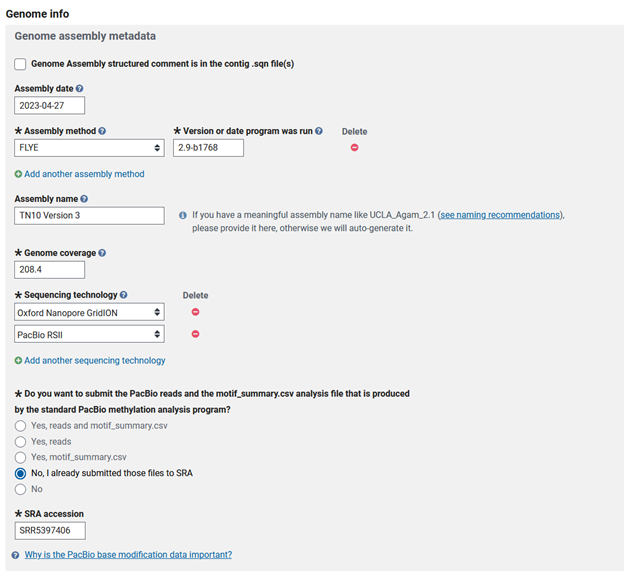

There are now some follow-up questions that apply to a select number of genomes:

* Did you attempt to include the entire genome in your submission? Or is it only partial coverage of the genome?
* Is this the final version of your genome? So, will you be updating this genome any time in the near future? I will be updating this genome again, so I selected "no" here.
* Is it a de novo assembly? Did you assemble the genome from reads, or were these reference guided assemblies, etc? 
* Is this genome submission an update of an existing genome submission? There are older versions of this genome that this genome will replace, so I selected yes here. 

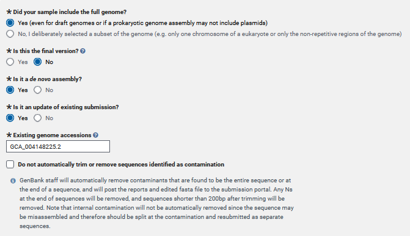

Then you will need to answer whether you assembled the genome or if you are someone depositing the genome for someone else. If you assembled the genome, you would select original. 

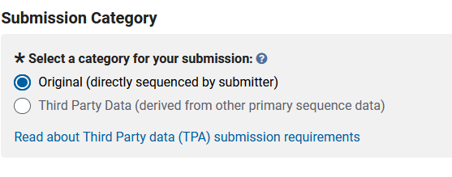

The next step is to create a title for your submission and to write up any details that may be pertinent to the NCBI curators. With this submission, I am planning on submitting a further improved genome from the same line.

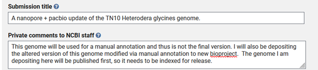

### Genome-only - FILES

The next step is filling out the 'FILES' tab. In this case I was lucky that my genome was assembled into 9 complete chromosomal scaffolds without extraneous contigs. If your genome does not have all contigs integrated into pseudomolecule scaffolds then you will need to choose the second option below.

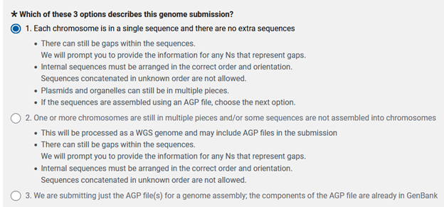

Now you will need to decide how you want to upload the files for your genome submission. I typically use Aspera over FTP when uploading due to speed, reliability, security, efficiency, and scalability. All we need now is to find our correct genome to upload and set up the folder structure that aspera requests. 

```bash
#This is my existing folder that holds my data 
/work/gif3/masonbrink/Baum/01_ReannotateAllSCNGenomes/14_SCNBase/01_GenomesAndAnnotations/01_TN10Deposit
#copy the contents from the key_file link and paste into a new file on my server. 
vi key.file
#Create a new folder with just my genome
/work/gif3/masonbrink/Baum/01_ReannotateAllSCNGenomes/14_SCNBase/01_GenomesAndAnnotations/01_TN10Deposit/DepositFolder/
#Go to that folder
cd DepositFolder
#softlink my genome to this new folder
ln -s ../TN10Genome.fasta
#go back to the folder with the key
cd ../
#Then modify the command that they give us. 
ascp -i key.file -QT -l100m -k1 -d  /work/gif3/masonbrink/Baum/01_ReannotateAllSCNGenomes/14_SCNBase/01_GenomesAndAnnotations/01_TN10Deposit/DepositFolder subasp@upload.ncbi.nlm.nih.gov:uploads/arnstrm_iastate.edu_jCiP2Yhq
```

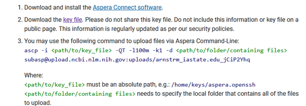

Depending on file size, the genome should upload in minutes, though the folder will not appear in the "Select preload folder' window for approximately ten minutes. 


Once the folder appears, then select "Use selected folder" and continue to the bottom of the page. 

### Genome-only - GAPS

The next step is the 'GAPS' tab, where you will be propositioned to define the gaps in your genome.
* First you are prompted with "Did you randomly merge sequences together into scaffolds?"
Since it is never appropriate to merge contigs together randomly, you should select "no".

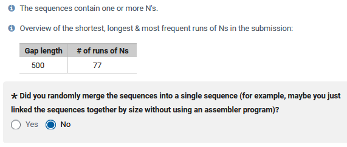

* Describe your gaps: are they an estimated size or are they all the same length, representing an unknown size?
In my case all of my gaps were 500bp. 

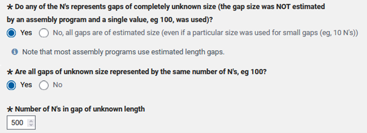

If they are not an estimated size then put no and proceed. If your assembly was an all-in-one software from reads to pseudomolecule, then you will likely have estimated gap sizes. Note that if your gaps are many different sizes, then you likely have estimated gap sizes.

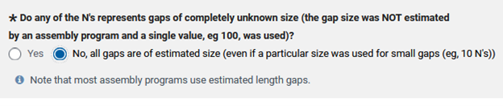

If scaffolding was performed, what kind of technology was used to scaffold your genome assembly? I selected proximity-ligation, as I used HiC to scaffold my assembly. 

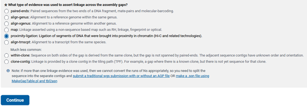

### Genome-only - ASSIGNMENT

The next step is the ASSIGNMENT tab, where you will name the scaffolds that represent the pseudomolecules/chromosomes, organellar genomes, and/or plasmids in your assembly. 
* Do you have any sequences in your genome that represent mitochondria or chloroplast genomes? If so, you get to fill in information about your organellar scaffolds and whether they are complete and circular.

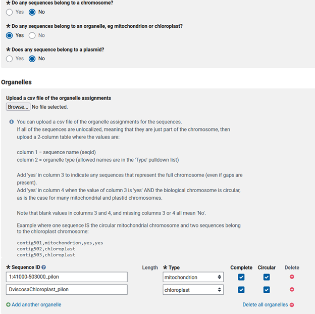

Do you have any scaffolds in your genome that are representations of a plasmid? If so, you need the names of the scaffolds that are plasmids and if they are complete and circular.

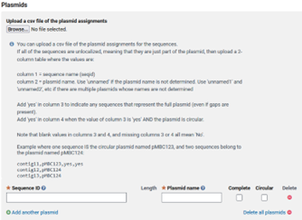

My submission is simpler than most, only needing the nine chromosomes to be labeled. Others may find the csv more efficient.

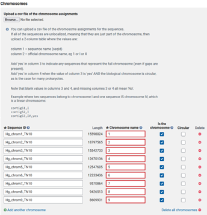

### Genome-only - REFERENCES

For REFERENCES you will need to list the authors of the assemebly and those that contributed to this genomic development. Below this there is the opportunity to link publications associated with this genome, though most times during submission a publication is not ready.

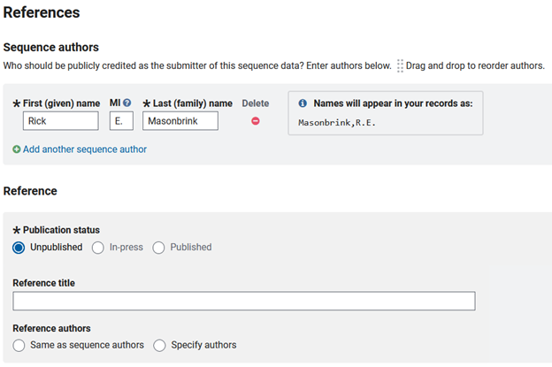

### Genome-only - SUBMIT & REVIEW

You should have one last step to review the information before you submit. If the genome lacks errors then your submission should say processing. Depending on genome size, NCBI can take a few hours to check if contamination exists in your assembly. If NCBI finds contamination in your assembly, modifications will be needed to remove the contamination.  

For comprehensive guidance, refer to the [NCBI Genome Submission Guide](https://www.ncbi.nlm.nih.gov/genbank/genomesubmit/)

# Genome and Annotation

To deposit an annotation with a genome the process is more complex and requires modification of your genome fasta file and genome gff3 file. 

There is software specifically designed to convert your genome and gff3 into the file format NCBI requires for submitting an annotation. The next step is converting your gff3 annotation and genome into the desired format (.sqn), which involves using the NCBI software table2asn. Table2asn is an executable file that you can download from NCBI. There is some explanation on how it works and the download link is on this page:  https://www.ncbi.nlm.nih.gov/genbank/table2asn/?utm_source=ncbi_insights&utm_medium=referral&utm_campaign=table2asn-updated-20230706

In order to use this software you will need to make a template with the metadata for your genome here:  https://submit.ncbi.nlm.nih.gov/genbank/template/submission/


The hidden text here shows how to create a 5 column feature table for your annotation. NCBI no longer wants this table file, but here is a reference if you've already used this tutorial 05/06/2025

<details>
<summary>Click to Expand</summary>

<pre><code>
    The next step is to create a 5 column feature table for your annotation. Here I use gffread to convert to gtf and then use my own script to convert the .gtf file into a .tbl file.

    ml micromamba; micromamba activate cufflinks
    gffread SortedTN10FinalManualAnnotation.gff3 -T -o SortedTN10FinalManualAnnotation.gtf

    #modify the text at the bottom to modify the input and output file names. Currently it expects a braker.gtf, but you can modify to any other name.
    vi gtf_to_tbl.py
    python gtf_to_tbl.py
    
    gtf_to_tbl.py 
    ########################################################################################################
    import re

    def gtf_to_tbl(gtf_file, tbl_file):
        with open(gtf_file, 'r') as gtf, open(tbl_file, 'w') as tbl:
            for line in gtf:
                if line.startswith('#'):
                    continue
                fields = line.strip().split('\t')
                if len(fields) < 9:
                    continue
                seqname, source, feature, start, end, score, strand, frame, attributes = fields
                attributes_dict = {k: v.strip('"') for k, v in re.findall(r'(\S+)\s+"([^"]+)"', attributes)}
                gene_id = attributes_dict.get('gene_id', '.')
                gene_name = attributes_dict.get('gene_name', '.')
                tbl.write(f"{start}\t{end}\t{feature}\t{gene_id}\t{gene_name}\n")
    
    gtf_to_tbl('braker.gtf', 'output.tbl')
    ######################################################################################################## 
</code></pre>

</details>


The hidden text below here is how to create an .agp file (a golden path). As of March 1, 2025, this file should no longer be used to submit a genome annotation.

<details>
<summary>Click to Expand</summary>


There is a script in Juicebox software that can create this .agp file, though it does not make it perfectly. The Juicebox script uses 0 based numbering, while NCBI expects 1 based numbering. <br>

<pre><code>

    #download juicebox script
    https://github.com/phasegenomics/juicebox_scripts/blob/master/juicebox_scripts/makeAgpFromFasta.py
    
    #create .agp file from genome
    python makeAgpFromFasta.py TN10GenomeSNPFixedFinal.fasta SCNGenome.agp
    
    #Fix column 2 so it is 1 based, not zero based coordinates
    awk -F"\t" '$2=="0" {print $1,"1",$2,$3,$4,$5,$6,$7,$8,$9} SCNGenome.agp >FixedSCNGenome.agp

</code></pre>

<br>
For my 9 chromosomes, this is an example of a complete .agp file with the expected input for the 9 scaffolds. Note that it is tab delimited <br>

<pre><code>

    Hg_chrom1_TN10  1       0       18797431        1       W       Hg_chrom1_TN10  1       18797431        +
    Hg_chrom2_TN10  1       0       15597796        1       W       Hg_chrom2_TN10  1       15597796        +
    Hg_chrom3_TN10  1       0       15542751        1       W       Hg_chrom3_TN10  1       15542751        +
    Hg_chrom4_TN10  1       0       12669965        1       W       Hg_chrom4_TN10  1       12669965        +
    Hg_chrom5_TN10  1       0       12547523        1       W       Hg_chrom5_TN10  1       12547523        +
    Hg_chrom6_TN10  1       0       12233239        1       W       Hg_chrom6_TN10  1       12233239        +
    Hg_chrom7_TN10  1       0       9570593 1       W       Hg_chrom7_TN10  1       9570593 +
    Hg_chrom8_TN10  1       0       9426334 1       W       Hg_chrom8_TN10  1       9426334 +
    Hg_chrom9_TN10  1       0       8609792 1       W       Hg_chrom9_TN10  1       8609792 +

</code></pre>

</details>

Once you've made your template and the received the locus tag from your Bioproject, you can start using the table2asn script to create your .sqn files (ASN.1 format). 

The download and more detailed inforamtion on table2asn is here: https://www.ncbi.nlm.nih.gov/genbank/table2asn/

```bash
./table2asn -t template.sbt -i TN10GenomeSNPFixedFinal.fasta -f SortedTN10FinalManualAnnotation.gff3 -gaps-unknown 500 -M n -o annotation.sqn -locus-tag-prefix ACNJWR -Z -usemt many -N 51029 -y "This is a consensus annotation using long and short RNA sequence reads"
```
-t is the template file you made online earlier
-i is the genome
-f is the gff3 annotation
-gaps-unknown is to designate that my gaps are not estimated sizes and not the usual 100bp gap space that NCBI expects.
-M is to designate your submission as a genome (n) or a transcriptome (t).
-o is the name of the .sqn output
-locus-tag-prefix is the assigned Bioproject locus tag from creating a Bioproject
-Z add a discrepancy report to the output, annotating errors in the conversion
-usemt tells the computer to use one or many threads
-N is the taxonID for your species' genome
-y is a comment to add more detail to your submission

This script will produce four files. 
* annotation.stats -- overview of errors in annotation
* annotation.dr -- discrepancy report has more specific error information
* annotation.val -- Different types of specific error information
* annotation.sqn -- the .sqn output you need to upload to NCBI to get your annotation deposited. 

This information is enough to deposit an annotation and genome to NCBI, however if you'd like your genes to have functional information associated with them, you will need to add "product=" and "Dbxref=" to column 9 of the mRNA and CDS features in the gff3.
The column 9 format should end up similar to below, though there are other ontology terms that can be added to DBXREF for a more thorough functional description. 

Much more detailed information can be had here: https://www.ncbi.nlm.nih.gov/genbank/genomes_gff/

This is an example of one of my annotated genes with a functional description on mRNA and CDS
```text
Hg_chrom1_TN10  .       gene    103500  115395  .       +       .       ID=Hg_chrom1_TN10gene_4;Note=NRBLAST_KAI1716751.1 nuclear migration and anchoring protein unc-84 [Ditylenchus destructor]#SPBLAST_Q20745.2 Nuclear migration and anchoring protein unc-84 [Caenorhabditis elegans]
Hg_chrom1_TN10  .       mRNA    103500  115395  .       +       .       ID=Hg_chrom1_TN10mRNA_4;Parent=Hg_chrom1_TN10gene_4;product=nuclear migration and anchoring protein unc-84;Dbxref=Genbank:CAK5048742.1,UniProtKB/Swiss-Prot:Q20745
Hg_chrom1_TN10  .       exon    103500  103656  .       +       .       Parent=Hg_chrom1_TN10mRNA_4;
Hg_chrom1_TN10  .       CDS     103500  103656  .       +       0       Parent=Hg_chrom1_TN10mRNA_4;product=nuclear migration and anchoring protein unc-84;
Hg_chrom1_TN10  .       CDS     103823  104068  .       +       2       Parent=Hg_chrom1_TN10mRNA_4;product=nuclear migration and anchoring protein unc-84;
Hg_chrom1_TN10  .       exon    103823  104068  .       +       .       Parent=Hg_chrom1_TN10mRNA_4;
Hg_chrom1_TN10  .       CDS     104490  104588  .       +       2       Parent=Hg_chrom1_TN10mRNA_4;product=nuclear migration and anchoring protein unc-84;
Hg_chrom1_TN10  .       exon    104490  104588  .       +       .       Parent=Hg_chrom1_TN10mRNA_4;
Hg_chrom1_TN10  .       exon    105153  105270  .       +       .       Parent=Hg_chrom1_TN10mRNA_4;
Hg_chrom1_TN10  .       CDS     105153  105270  .       +       2       Parent=Hg_chrom1_TN10mRNA_4;product=nuclear migration and anchoring protein unc-84;
Hg_chrom1_TN10  .       CDS     105819  105894  .       +       1       Parent=Hg_chrom1_TN10mRNA_4;product=nuclear migration and anchoring protein unc-84;
Hg_chrom1_TN10  .       exon    105819  105894  .       +       .       Parent=Hg_chrom1_TN10mRNA_4;
Hg_chrom1_TN10  .       CDS     105942  106037  .       +       0       Parent=Hg_chrom1_TN10mRNA_4;product=nuclear migration and anchoring protein unc-84;
Hg_chrom1_TN10  .       exon    105942  106037  .       +       .       Parent=Hg_chrom1_TN10mRNA_4;
Hg_chrom1_TN10  .       CDS     113759  113902  .       +       0       Parent=Hg_chrom1_TN10mRNA_4;product=nuclear migration and anchoring protein unc-84;
Hg_chrom1_TN10  .       exon    113759  113902  .       +       .       Parent=Hg_chrom1_TN10mRNA_4;
Hg_chrom1_TN10  .       exon    114360  114503  .       +       .       Parent=Hg_chrom1_TN10mRNA_4;
Hg_chrom1_TN10  .       CDS     114360  114503  .       +       0       Parent=Hg_chrom1_TN10mRNA_4;product=nuclear migration and anchoring protein unc-84;
Hg_chrom1_TN10  .       exon    114782  114911  .       +       .       Parent=Hg_chrom1_TN10mRNA_4;
Hg_chrom1_TN10  .       CDS     114782  114911  .       +       0       Parent=Hg_chrom1_TN10mRNA_4;product=nuclear migration and anchoring protein unc-84;
Hg_chrom1_TN10  .       exon    115128  115395  .       +       .       Parent=Hg_chrom1_TN10mRNA_4;
Hg_chrom1_TN10  .       CDS     115128  115198  .       +       2       Parent=Hg_chrom1_TN10mRNA_4;product=nuclear migration and anchoring protein unc-84;
```
Once you've made a .sqn file for your annotation, you will need to create one for your genome as well. In this case if you have assembled organelles or plasmids, they need to be combined with the nuclear genome first. Once combined you can run the table2asn software to create your desired .sqn files (ASN.1 format). 

```bash
cat NuclearGenome.fasta ChloroplastGenome.fasta MitochondrialGenome.fasta >NuclearMitoChloroGenomes.fasta
#create .sqn file for nuclear, mitochondrial, and chloroplast genomes

./table2asn -t template.sbt -i TN10GenomeSNPFixedFinal.fasta -j "[organism=Heterodera_glycines]" -M n -o genome.sqn -locus-tag-prefix ACNJWR -Z -usemt many -N 51029 -y "This is a consensus genome assembly assembled with both Pacbio RSII and GridION nanopore reads, followed by polishing with long reads using Pilon."
```

Once you've created the .tbl, the .agp, and the two .sqn files, you are ready to begin the submission. It is very important to select the correct options here or NCBI will not give you the opportunity to upload an annotation. 

To deposit these files you will need to go back to 'My Submissions' and then click 'Genome' in the top left corner. 


After that, you will see a blue 'New Submission' that allow you to start your submission.   

First, you will need to decide if you are submitting a single or multiple genomes. 
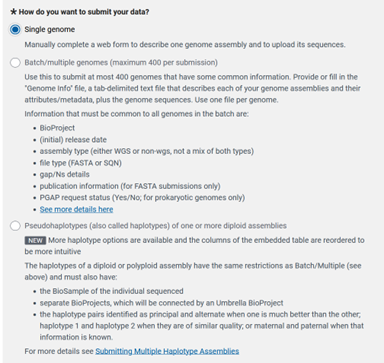

### Genome and Annotation - SUBMITTER

Then you will start with the familiar 'SUBMITTER' tab that you've previously seen. 


### Genome and Annotation - GENERAL INFO

Then you will be forwarded into the 'GENERAL INFO' tab where you can list your previously submitted Bioproject and Biosample accessions to be associated with your genome. 

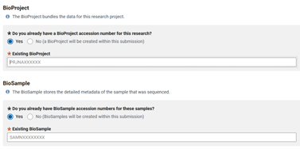

Then you will have to set the genome and annotation release date, which can be pushed back as far as four years. Setting four years is likely the best option for most people, as the presence of the Bioproject accession number in a publication will auto-release all associated data soon after publication. 

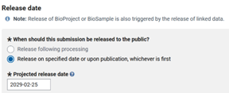

The next part works in two possible ways. You can try to get all of this metadata into your .sqn file and check the box at the top, or fill it out here. In my opinion, filling out the form is the easier option, so leave the box at the top unchecked and fill out the respective information.

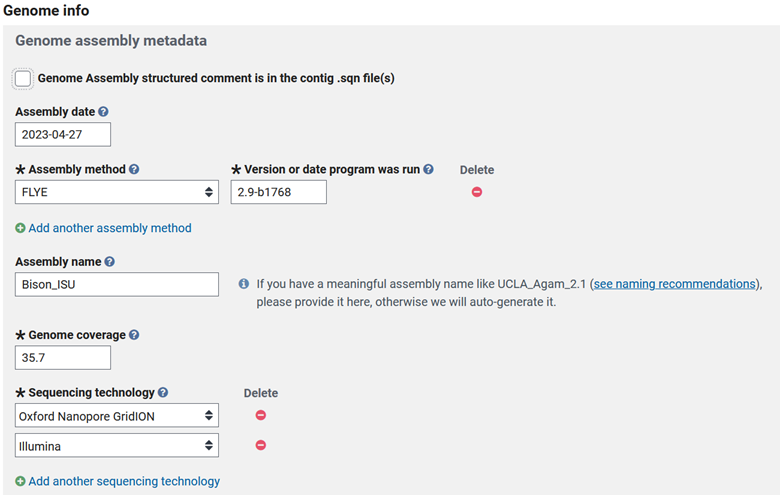

Then some more basic questions that I will elaborate on.
* Did you assemble the whole genome? Or was it a partial?
* Are you planning to reassemble this data when you obtain more, or is this the final version of the genome?
* Did you assemble the genome using assembly software with reads (de-novo) or was it a reference-guided assembly?
* Is this an update of existing submission? If so, then you can list the existing genome accession. 

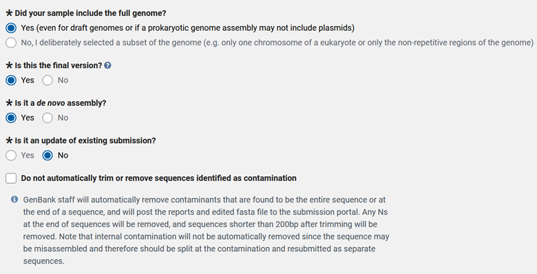

Then check Original if you are the person that assembled the genome. The next important step is to fill out a descriptive title and add any extra information that may be important for NCBI curators in Private 'comments'.

### Genome and Annotation - FILES

The next step is the tricky part, at the 'FILES tab' you can miss your opportunity to deposit your annotation if you select the wrong options. Even if your chromosomes are in a single sequence and there are no extra sequences, to be able to deposit an annotation you need to choose number 2 here. 

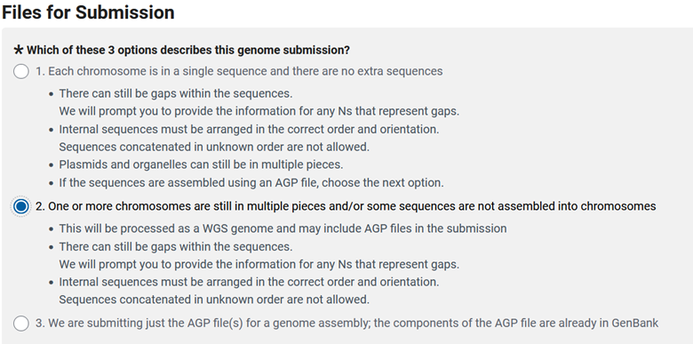

Then you get to choose how you want to upload your data and, at least currently, you need to answer yes to the bottom question. 

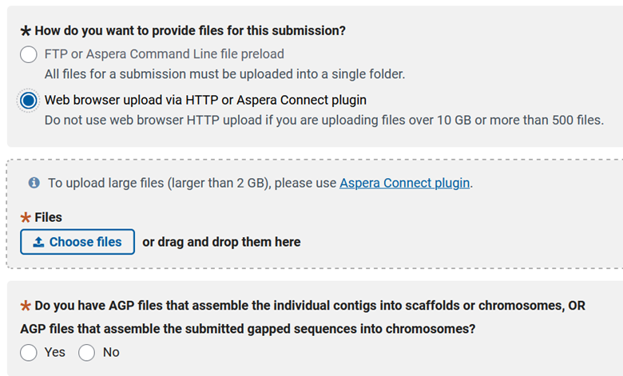

Then you can answer if you have unplaced scaffolds (scaffolds not attributed to a chromosome, organelle, or plasmid). We produced the .agp file earlier and we can deposit that file here. The following question is related, and asks if you have unplaced scaffolds, but you know their chromosomal assignment (just not order). The third question gives you the option to deposit an annotation with your genome, so select 'yes'. Then there is an odd question at the bottom that I am not entirely sure of the meaning, but you need to select yes to this question as well, so you can deposit the .sqn and .tbl files.

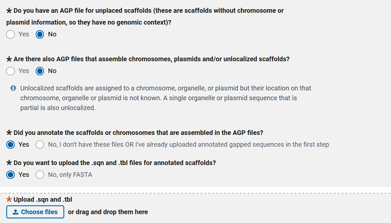

The next step is filling out the 'FILES' tab. In this case I was lucky that my genome was assembled into 9 complete chromosomal scaffolds without extraneous contigs. Even if your genome has all contigs integrated into pseudomolecule scaffolds, you will need to choose the second option to be able to deposit an annotation.


Now you will need to decide how you want to upload the files for your genome submission. I typically use Aspera over FTP when uploading due to speed, reliability, security, efficiency, and scalability. All we need now is to find our correct genome to upload and set up the folder structure that aspera requests. 

```bash
#This is my existing folder that holds my data 
/work/gif3/masonbrink/Baum/01_ReannotateAllSCNGenomes/14_SCNBase/01_GenomesAndAnnotations/01_TN10Deposit
#copy the contents from the key_file link and paste into a new file on my server. 
vi key.file
#Create a new folder with just my genome
/work/gif3/masonbrink/Baum/01_ReannotateAllSCNGenomes/14_SCNBase/01_GenomesAndAnnotations/01_TN10Deposit/DepositFolder/
#Go to that folder
cd DepositFolder
#softlink my genome to this new folder
ln -s ../TN10Genome.sqn
#go back to the folder with the key
cd ../
#Then modify the command that they give us. 
ascp -i key.file -QT -l100m -k1 -d  /work/gif3/masonbrink/Baum/01_ReannotateAllSCNGenomes/14_SCNBase/01_GenomesAndAnnotations/01_TN10Deposit/DepositFolder subasp@upload.ncbi.nlm.nih.gov:uploads/arnstrm_iastate.edu_jCiP2Yhq
```


Depending on file size the genome.sqn should upload in minutes, though the folder will not appear in the "Select preload folder' window for approximately ten minutes. 


Once the folder appears, then select "Use selected folder" and continue to the bottom of the page. 

### Genome and Annotation - GAPS

The next step is the 'GAPS' tab, where you will be propositioned to define the gaps in your genome.
* First you are prompted with "Did you randomly merge sequences together into scaffolds?"
Since it is never appropriate to merge contigs together randomly, you should select "no".


* Describe your gaps: are they an estimated size or are they all the same length, representing an unknown size?
In my case all of my gaps were 500bp, not an estimated size. 


If they are not an estimated size then put no and proceed. If your assembly was an all-in-one software from reads to pseudomolecule, then you will likely have estimated gap sizes. 


If scaffolding was performed, what kind of technology was used to scaffold your genome assembly? I selected proximity-ligation, as I used Hi-C to scaffold my assembly. 


### Genome and Annotation - ASSIGNMENT

The next step is the 'ASSIGNMENT' tab, where you will name the scaffolds that represent the pseudomolecules/chromosomes, organellar genomes, and/or plasmids in your assembly. 
* Do you have any sequences in your genome that represent mitochondria or chloroplast genomes and if they are complete and circular? If so, you get to fill in information about your organellar scaffolds.


Do you have any scaffolds in your genome that are representations of a plasmid? If so, you need the names of the scaffolds that are plasmids and if they are complete and circular.


My submission is simpler than most, only needing the nine chromosomes to be labeled. Others may find the csv more efficient when many chromosomes are present.


### Genome and Annotation - REFERENCES

For 'REFERENCES' you will need to list the authors of the assemebly and those that contributed to this genomic development. Below this there is the opportunity to link publications associated with this genome, though most times during submission a publication is not ready.


### Genome and Annotation - SUBMIT & REVIEW

You should have one last step to review the information before you submit. If the genome lacks errors then your submission should say processing. Depending on genome size, NCBI can take a few hours to check if contamination exists in your assembly. If NCBI finds contamination in your assembly, modifications will be needed to remove the contamination. The processing of the annotation takes much longer than the genome and may not finish for weeks. 

For comprehensive guidance, refer to the [NCBI Eukaryotic Annotated Genome Submission Guide](https://www.ncbi.nlm.nih.gov/genbank/eukaryotic_genome_submission/)

# Additional Resources

- [NCBI Submission Portal](https://submit.ncbi.nlm.nih.gov/)
- [NCBI Help Desk](https://support.nlm.nih.gov/)

- [Bioproject submission](#bioproject-submission)
    - [Bioproject - SUBMITTER](#bioproject---submitter)
    - [Bioproject - PROJECT TYPE](#bioproject---project-type)
    - [Bioproject - TARGET](#bioproject---target)
    - [Bioproject - GENERAL INFO](#bioproject---general-info)
    - [Bioproject - BIOSAMPLE](#bioproject---biosample)
    - [Bioproject - PUBLICATIONS](#bioproject---publications)
    - [Bioproject - REVIEW \& SUBMIT](#bioproject---review--submit)
- [Biosample](#biosample)
    - [Biosample - SUBMITTER](#biosample---submitter)
    - [Biosample - GENERAL INFO](#biosample---general-info)
    - [Biosample - SAMPLE TYPE](#biosample---sample-type)
    - [Biosample - ATTRIBUTES](#biosample---attributes)
    - [Biosample - REVIEW \& SUBMIT](#biosample---review--submit)
- [Sequence read archive (SRA)](#sequence-read-archive-sra)
    - [SRA - SUBMITTER](#sra---submitter)
    - [SRA - GENERAL INFORMATION](#sra---general-information)
    - [SRA - SRA METADATA](#sra---sra-metadata)
    - [SRA - FILES](#sra---files)
    - [SRA - REVIEW \& SUBMIT](#sra---review--submit)
- [Genome Only](#genome-only)
    - [Genome Only - SUBMITTER](#genome-only---submitter)
    - [Genome Only - GENERAL INFO](#genome-only---general-info)
    - [Genome Only - GENOME INFO](#genome-only---genome-info)
    - [Genome-only - FILES](#genome-only---files)
    - [Genome-only - GAPS](#genome-only---gaps)
    - [Genome-only - ASSIGNMENT](#genome-only---assignment)
    - [Genome-only - REFERENCES](#genome-only---references)
    - [Genome-only - SUBMIT \& REVIEW](#genome-only---submit--review)
- [Genome and Annotation](#genome-and-annotation)
    - [Genome and Annotation - SUBMITTER](#genome-and-annotation---submitter)
    - [Genome and Annotation - GENERAL INFO](#genome-and-annotation---general-info)
    - [Genome and Annotation - FILES](#genome-and-annotation---files)
    - [Genome and Annotation - GAPS](#genome-and-annotation---gaps)
    - [Genome and Annotation - ASSIGNMENT](#genome-and-annotation---assignment)
    - [Genome and Annotation - REFERENCES](#genome-and-annotation---references)
    - [Genome and Annotation - SUBMIT \& REVIEW](#genome-and-annotation---submit--review)
- [Additional Resources](#additional-resources)

[Table of contents](compGenomics_index.md)
