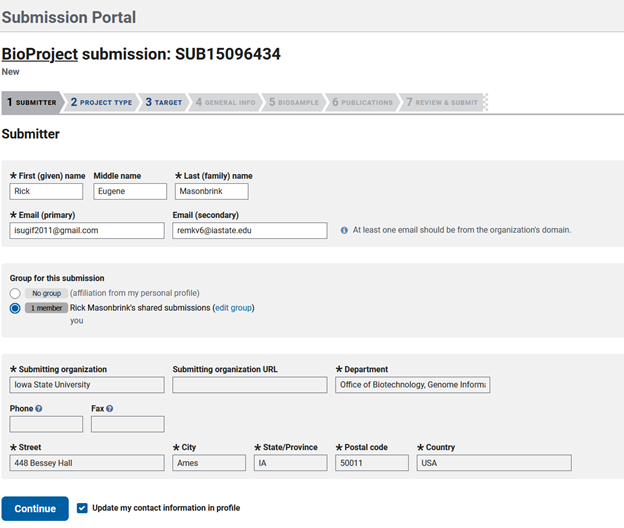

Depositing a genome and its gene annotation into NCBI ensures that it is accessible to the scientific community, is properly archived, and links the relative metadata. Submission typically involves preparing the sequence data, genome, gene annotation, and assembled organelle genomes.

# The most efficient order for submitting a genome to NCBI
1. Create a Bioproject - This serves as an umbrella for your study, linking multiple datasets together.
2. Create Biosamples - This describes each of the biological samples that were acquired for assembling or annotating your genome.
3. Submit sequencing to SRA - Each independent sequencing sample that is not a technical replicate will need to be deposited as a separate file. 
4. Submit genome and annotation - Once the information for the previous submissions is complete, you should have all of the information you need to deposit your genome, annotation,assembled organellar genomes, and plasmids (if any).

# Bioproject submission

If you do not have one yet, you will need to create an account with NCBI for the submission.  Once that is accomplished you can go to "My submissions" and click on Bioproject at the top left of the window. 

The first tab to fill out is the "Submitter tab"

Since I created this genome and am submitting it, my submitter information is simple. This may become more complex if submitting for a group. 

Then you will need to choose the type of data you will be submitting. Here we assembled a genome, so checking this box will give us the required options needed for later genome submission steps later. Then the scope of your sample, which often times for genome submissions the option checked is Monoisolate. We will also be needing locus tag prefixes to submit our annotation in a later step, so check this box.

This takes you to the Target tab, where you will list the genus species of your organism and fill out one of the five options in the second line of boxes. The description is entirely optional, but including as much information as possible will help future users utilize your data in subsequent analyses. 

Then you will be taken to the General Info tab, where you will specify the release date of your data, add a public description, and the relevance of your genome. You'll have to answer a few questions about external links to your data, grants that funded your genome assembly/annotation, consortium associations and if you are using a data provider. 

The next tab is BIOSAMPLE, which is where you will list the previously created biosample accessions that are associated with your sequencing data used to assemble the genome. In this case, I have not created my Biosample yet, so I leave the area blank. 

The next tab is PUBLICATIONS, where you would list any composition associated with this genome and annotation.

The last tab is REVIEW & SUBMIT. This is your last opportunity to change any of the information in your submission, as after it is accepted you will have to email NCBI to make changes. 

