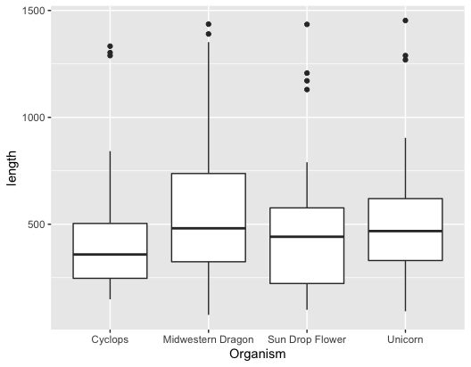
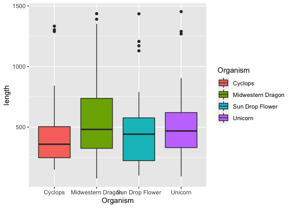
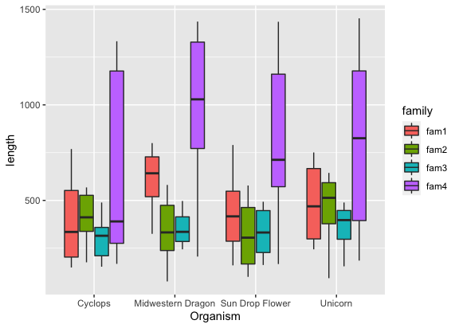
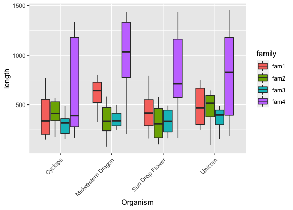
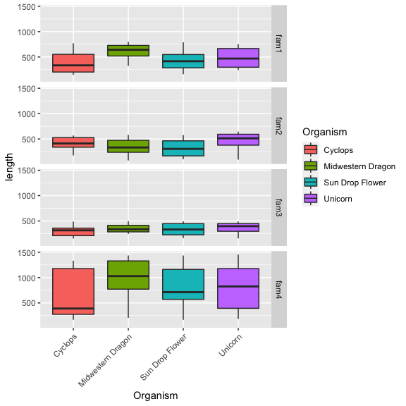
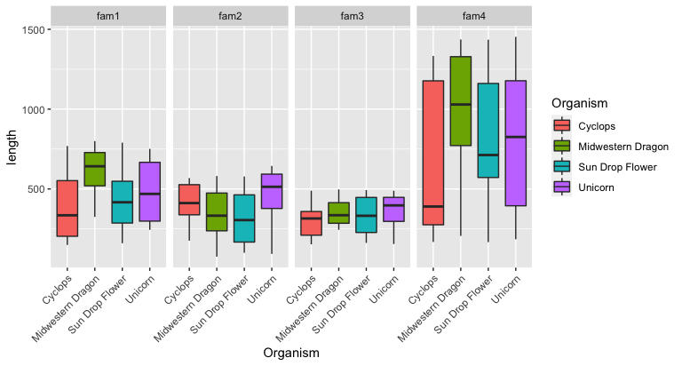
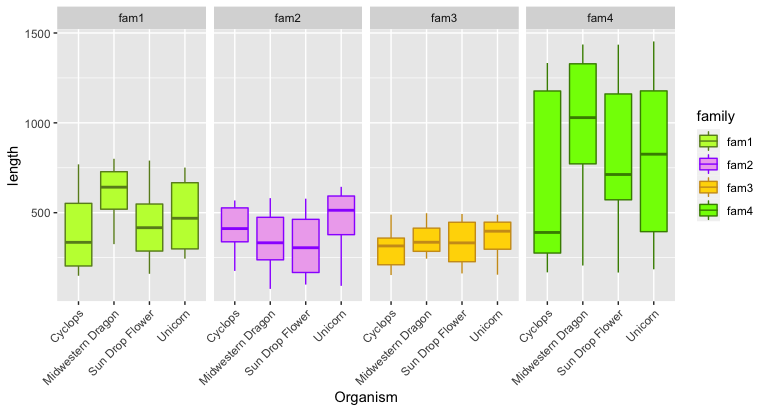
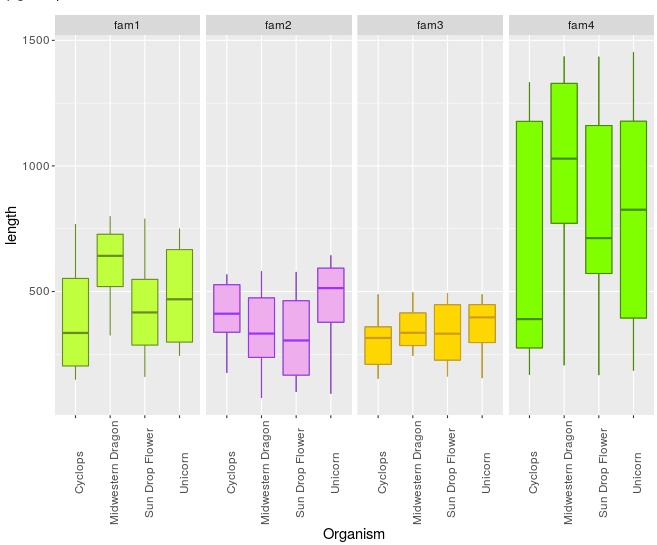

**Last Update**: 7 Dec 2018 <br/> **RMarkdown**:
[generate-boxplots.Rmd](https://bioinformaticsworkbook.org/tutorials/generate-boxplots.Rmd)

## Using R to create boxplots

For datasets that have many observations per sample and you want to
visualize their distribution, boxplots are good choice. Here, the
example dataset has average values of multiple observations for each
sample.

-   [mythical\_creatures.txt](https://bioinformaticsworkbook.org/data/mythical_creatures.txt)

<!-- -->

    wget https://bioinformaticsworkbook.org/tutorials/data/mythical_creatures.txt

It is organized in this way:

Table 1: Gene length for 4 different gene families and for 3 different
organism.

| Organism          | gene\_family\_1 | gene\_family\_2 | gene\_family\_3 | gene\_family\_4 |
|:------------------|----------------:|----------------:|----------------:|----------------:|
| Unicorn           |             263 |             407 |             460 |             519 |
| Unicorn           |             269 |             644 |             409 |             904 |
| Unicorn           |             705 |             592 |             489 |             831 |
| Unicorn           |             501 |             368 |             245 |            1269 |
| Unicorn           |             244 |             520 |             403 |             227 |
| Unicorn           |             387 |             275 |             280 |             185 |
| Unicorn           |             437 |              93 |             391 |             353 |
| Unicorn           |             552 |             612 |             476 |            1289 |
| Unicorn           |             745 |             593 |             347 |            1453 |
| Unicorn           |             751 |             507 |             155 |             820 |
| Cyclops           |             583 |             463 |             153 |            1303 |
| Cyclops           |             769 |             329 |             211 |             274 |
| Cyclops           |             459 |             452 |             283 |            1289 |
| Cyclops           |             149 |             568 |             210 |             280 |
| Cyclops           |             181 |             314 |             412 |            1333 |
| Cyclops           |             693 |             176 |             359 |             361 |
| Cyclops           |             208 |             561 |             161 |             842 |
| Cyclops           |             202 |             365 |             489 |             259 |
| Cyclops           |             336 |             371 |             347 |             168 |
| Cyclops           |             334 |             548 |             358 |             419 |
| Midwestern Dragon |             404 |              76 |             434 |            1188 |
| Midwestern Dragon |             325 |             466 |             259 |            1436 |
| Midwestern Dragon |             713 |             218 |             277 |             837 |
| Midwestern Dragon |             485 |             297 |             346 |            1258 |
| Midwestern Dragon |             652 |             527 |             325 |             750 |
| Midwestern Dragon |             632 |             342 |             309 |            1352 |
| Midwestern Dragon |             800 |             581 |             497 |             870 |
| Midwestern Dragon |             623 |             323 |             354 |             206 |
| Midwestern Dragon |             733 |             123 |             244 |             646 |
| Midwestern Dragon |             751 |             477 |             474 |            1390 |
| Sun Drop Flower   |             743 |             100 |             473 |             625 |
| Sun Drop Flower   |             160 |             230 |             164 |            1207 |
| Sun Drop Flower   |             260 |             569 |             493 |             650 |
| Sun Drop Flower   |             443 |             156 |             340 |             775 |
| Sun Drop Flower   |             366 |             380 |             312 |             167 |
| Sun Drop Flower   |             465 |             201 |             162 |            1435 |
| Sun Drop Flower   |             576 |             488 |             440 |            1130 |
| Sun Drop Flower   |             390 |             388 |             199 |            1171 |
| Sun Drop Flower   |             164 |             115 |             324 |             554 |
| Sun Drop Flower   |             790 |             578 |             449 |             530 |

If this table is in excel, we would want to export it as tab-delimited
file in order to further manipulate using UNIX commands and then import
it in R. For exporting: `File` &gt; `Save As` &gt; choose format
`Text (Tab delimited)(*.txt)` and `Save`. Manipulating with UNIX
commands: open the Lixnux sub-system (Windows) or Termina (Mac/Linux)
and navigate to the directory the file is saved. If you are in Windows,
you will need to run `dos2unix` to convert the line endings correctly.
To format the above table to just 3 columns i.e,:

    Organism  family  length

<!-- bash version

following commands were used:

```bash
awk 'BEGIN{OFS=FS="\t"}{print $1,"fam1",$2}' test.txt | grep -v "Organism" > formatted.txt
awk 'BEGIN{OFS=FS="\t"}{print $1,"fam2",$3}' test.txt | grep -v "Organism">> formatted.txt
awk 'BEGIN{OFS=FS="\t"}{print $1,"fam3",$4}' test.txt | grep -v "Organism" >> formatted.txt
awk 'BEGIN{OFS=FS="\t"}{print $1,"fam4",$5}' test.txt | grep -v "Organism" >> formatted.txt
```
-->

Now we are ready to manipulate in R!

First, open the R prompt by typing `R` in the terminal, navigate the
working directory, where the <!--`formatted.txt`-->
`mythical_creatures.txt` file is saved.

``` bash
R
#then
setwd("path/to/your/directory")
```

Import data and examine contents, format it if necessary:

``` r
file <- "data/mythical_creatures.txt"                      # Path to input file or "formatted.txt"
input <- read.csv(file, 
                  sep = "\t", 
                  quote = '',
                  stringsAsFactors = TRUE,
                  header = TRUE)
#examine
head(input)
#>   Organism gene_family_1 gene_family_2 gene_family_3 gene_family_4
#> 1  Unicorn           263           407           460           519
#> 2  Unicorn           269           644           409           904
#> 3  Unicorn           705           592           489           831
#> 4  Unicorn           501           368           245          1269
#> 5  Unicorn           244           520           403           227
#> 6  Unicorn           387           275           280           185

# Check the header and rename the headers to something shorter
names(input)
#> [1] "Organism"      "gene_family_1" "gene_family_2" "gene_family_3"
#> [5] "gene_family_4"
names(input) <- c("Organism","fam1","fam2", "fam3", "fam4")
head(input)
#>   Organism fam1 fam2 fam3 fam4
#> 1  Unicorn  263  407  460  519
#> 2  Unicorn  269  644  409  904
#> 3  Unicorn  705  592  489  831
#> 4  Unicorn  501  368  245 1269
#> 5  Unicorn  244  520  403  227
#> 6  Unicorn  387  275  280  185
```

We will convert the data to tidy data:

``` r
# install.packages("tidyr")          # <= in case you need to install tidyr library first
input <- tidyr::pivot_longer(
   input,
   cols = -Organism,
   names_to = "family",
   values_to = "length"
)
head(input)
#> # A tibble: 6 x 3
#>   Organism family length
#>   <fct>    <chr>   <int>
#> 1 Unicorn  fam1      263
#> 2 Unicorn  fam2      407
#> 3 Unicorn  fam3      460
#> 4 Unicorn  fam4      519
#> 5 Unicorn  fam1      269
#> 6 Unicorn  fam2      644
```

If your data looks like this below, you’re all set:

``` r
> head(input)
  Organism family length
1  Unicorn   fam1    263
2  Unicorn   fam1    269
3  Unicorn   fam1    705
4  Unicorn   fam1    501
5  Unicorn   fam1    244
6  Unicorn   fam1    387
>
```

First, lets load all the required packages. We will need the `ggplot2`
for plotting, `grid` package for making grids of plots/faceting.

``` r
library(ggplot2)
library(grid)
```

For getting a simple boxplot, you can use the following command:

``` r
ggplot(input, aes(x = Organism, y = length)) + geom_boxplot()
```

<!-- -->

<!---->

if you want to color the plots,

``` r
ggplot(input, aes(x = Organism, y = length, fill = Organism)) + geom_boxplot()
```

<!-- -->
<!---->

but wait, where are the gene families?

``` r
ggplot(input, aes(x = Organism, y = length, fill = family)) + geom_boxplot()
```

<!-- -->

<!---->

That names are all overlapping though?

``` r
ggplot(input, aes(x = Organism, y = length, fill = family)) + 
   geom_boxplot() + 
   theme(axis.text.x = element_text(angle = 45, hjust=1))
```

<!-- -->
<!---->

Well, it seems like it is difficult to compare as all gene families are
together, can we spread them out in to separate plots?

Yes, but first we need to make different subsets that we want to plot

``` r
fam1 <- input[which(input$family == "fam1"),]
fam2 <- input[which(input$family == "fam2"),]
fam3 <- input[which(input$family == "fam3"),]
fam4 <- input[which(input$family == "fam4"),]
```

Let’s also make colors to fill in for each family

``` r
fill1 <- "olivedrab1"
lines1 <- "olivedrab4"
fill2 <- "plum2"
lines2 <- "purple1"
fill3 <- "gold"
lines3 <- "goldenrod3"
fill4 <- "chartreuse"
lines4 <- "chartreuse4"
```

plots for each family can be generated using dataframes for respective
families:

``` r
ggplot(fam1, aes(x=Organism,y=length)) + geom_boxplot(colour = lines1, fill = fill1)
ggplot(fam2, aes(x=Organism,y=length)) + geom_boxplot(colour = lines2, fill = fill2)
ggplot(fam3, aes(x=Organism,y=length)) + geom_boxplot(colour = lines3, fill = fill3)
ggplot(fam4, aes(x=Organism,y=length)) + geom_boxplot(colour = lines4, fill = fill4)
```

Instead of generating individual plots, we can create a combined plots,
arranged based on families using `facet_grid`:

Vertically

<!--

```r
ggplot(input, aes(x = Organism, y = length)) + 
   geom_boxplot() +
   facet_grid( family ~ .)

#colored
ggplot(input, aes(x=Organism,y=length, fill=Organism)) +
   geom_boxplot() +
   facet_grid( family ~ .)

# accommodate long names
ggplot(input, aes(x=Organism,y=length, fill=Organism)) +
  geom_boxplot() +  
  facet_grid( family ~ .) +
  theme(axis.text.x = element_text(angle = 90))
```
-->

``` r
ggplot(input, aes(x = Organism, y = length, fill = Organism)) + 
   geom_boxplot() + 
   theme(axis.text.x = element_text(angle = 45, hjust=1)) +
   facet_grid( family ~.)          # <= facet allows plots to be split by group
```

<!-- -->

<!---->

Horizontally

``` r
ggplot(input, aes(x = Organism, y = length, fill = Organism)) + 
   geom_boxplot() + 
   theme(axis.text.x = element_text(angle = 45, hjust=1)) +
   facet_grid( . ~ family)          # <= swap the dot and family to arrange horizontally
```

<!-- -->

<!--
```python
ggplot(input, aes(x=Organism,y=length)) + geom_boxplot() +  facet_grid( . ~ family)
#since names are long ..
ggplot(input, aes(x=Organism,y=length)) +
   geom_boxplot() +
   facet_grid( .~ family) +
   theme(axis.text.x = element_text(angle = 90))
# colored
ggplot(input, aes(x=Organism,y=length)) +
   geom_boxplot(colour = lines1, fill = fill1) +
   facet_grid( .~ family) +
   theme(axis.text.x = element_text(angle = 90))
```

-->

To color these gene families, create a color palette:

``` r
# Fill Color
fam_palette = c(fam1 = "olivedrab1",
                fam2 = "plum2",
                fam3 = "gold",
                fam4 = "chartreuse")

# Line Color
fam_palette2 = c(fam1 = "olivedrab4",
                fam2 = "purple1",
                fam3 = "goldenrod3",
                fam4 = "chartreuse4")

ggplot(input, aes(x = Organism, y = length, fill = family, color = family)) + 
   geom_boxplot() + 
   theme(axis.text.x = element_text(angle = 45, hjust=1)) +
   facet_grid( . ~ family) +
   scale_fill_manual(values = fam_palette) +        # <= Add custom color palette here
   scale_color_manual(values = fam_palette2)
```

<!-- -->

<!--

```r
p1 <- ggplot(input, aes(x=Organism,y=length)) +
+    geom_boxplot(colour = lines1, fill = fill1) +
+    facet_grid( .~ family) +
+    theme(axis.text.x = element_text(angle = 90))
p2 <- p1 + facet_wrap(~family)
p2 <- p1 + geom_boxplot(data = fam2, colour = lines2, fill = fill2)
p3 <- p2 + geom_boxplot(data = fam3, colour = lines3, fill = fill3)
p4 <- p3 + geom_boxplot(data = fam4, colour = lines4, fill = fill4)
```


-->
