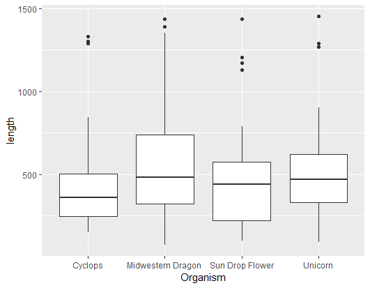
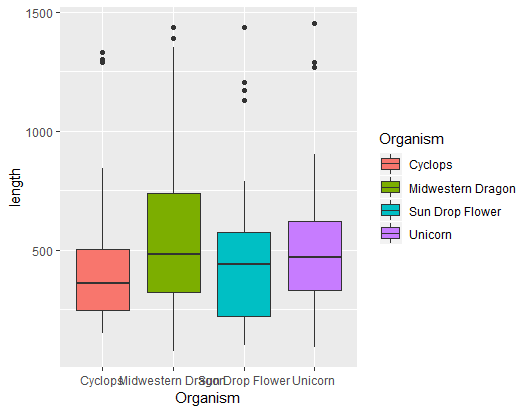
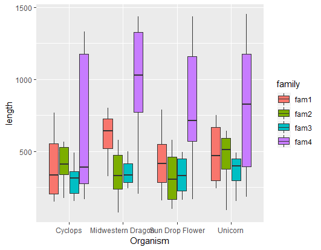
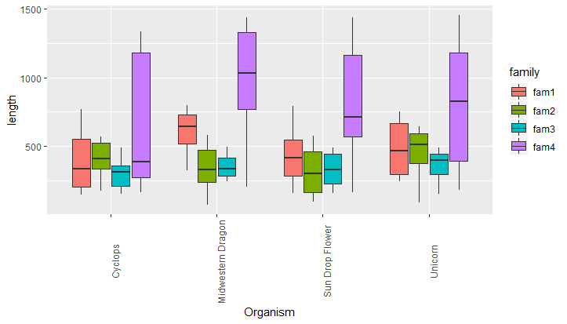
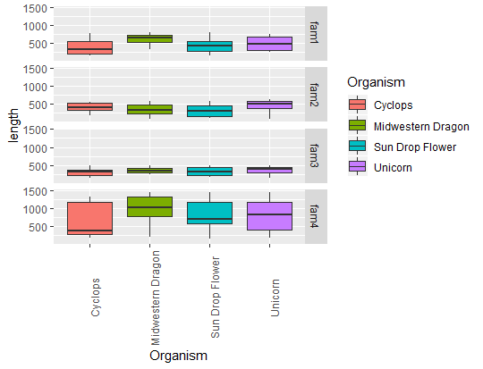
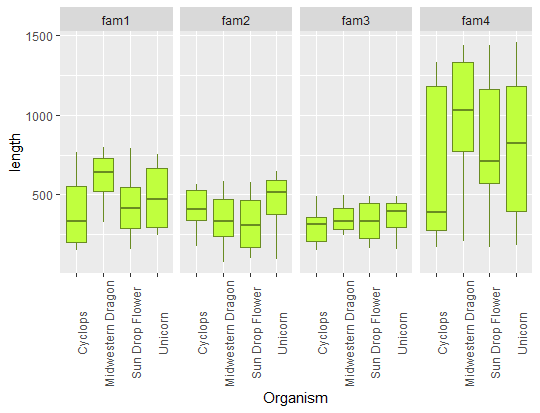

## Using R to create boxplots

For datasets that have many observations per sample and you want to visualize their distribution, boxplots are good choice. Here, the example dataset has average values of multiple observations for each sample. It is organized in this way:

Table 1: Gene length for 4 different gene families and for 3 different organism.


| Organism          | gene family 1 | gene family 2 | gene family 3 | gene family 4 |
|-------------------|---------------|---------------|---------------|---------------|
| Unicorn           | 263           | 407           | 460           | 519           |
| Unicorn           | 269           | 644           | 409           | 904           |
| Unicorn           | 705           | 592           | 489           | 831           |
| Unicorn           | 501           | 368           | 245           | 1269          |
| Unicorn           | 244           | 520           | 403           | 227           |
| Unicorn           | 387           | 275           | 280           | 185           |
| Unicorn           | 437           | 93            | 391           | 353           |
| Unicorn           | 552           | 612           | 476           | 1289          |
| Unicorn           | 745           | 593           | 347           | 1453          |
| Unicorn           | 751           | 507           | 155           | 820           |
| Cyclops           | 583           | 463           | 153           | 1303          |
| Cyclops           | 769           | 329           | 211           | 274           |
| Cyclops           | 459           | 452           | 283           | 1289          |
| Cyclops           | 149           | 568           | 210           | 280           |
| Cyclops           | 181           | 314           | 412           | 1333          |
| Cyclops           | 693           | 176           | 359           | 361           |
| Cyclops           | 208           | 561           | 161           | 842           |
| Cyclops           | 202           | 365           | 489           | 259           |
| Cyclops           | 336           | 371           | 347           | 168           |
| Cyclops           | 334           | 548           | 358           | 419           |
| Midwestern Dragon | 404           | 76            | 434           | 1188          |
| Midwestern Dragon | 325           | 466           | 259           | 1436          |
| Midwestern Dragon | 713           | 218           | 277           | 837           |
| Midwestern Dragon | 485           | 297           | 346           | 1258          |
| Midwestern Dragon | 652           | 527           | 325           | 750           |
| Midwestern Dragon | 632           | 342           | 309           | 1352          |
| Midwestern Dragon | 800           | 581           | 497           | 870           |
| Midwestern Dragon | 623           | 323           | 354           | 206           |
| Midwestern Dragon | 733           | 123           | 244           | 646           |
| Midwestern Dragon | 751           | 477           | 474           | 1390          |


 If this table is in excel, we would want to export it as tab-delimited file in order to further manipulate using UNIX commands and then import it in R. For exporting: `File` > `Save As` > choose format `Text (Tab delimited)(*.txt)` and `Save`.
 Manipulating with UNIX commands: open the Lixnux sub-system (Windows) or Termina (Mac/Linux) and navigate to the directory the file is saved. If you are in Windows, you will need to run `dos2unix` to convert the line endings correctly. To format the above table to just 3 columns i.e,:


 ```
Organism  family  length
```

following commands were used:

```bash
awk 'BEGIN{OFS=FS="\t"}{print $1,"fam1",$2}' test.txt | grep -v "Organism" > formatted.txt
awk 'BEGIN{OFS=FS="\t"}{print $1,"fam2",$3}' test.txt | grep -v "Organism">> formatted.txt
awk 'BEGIN{OFS=FS="\t"}{print $1,"fam3",$4}' test.txt | grep -v "Organism" >> formatted.txt
awk 'BEGIN{OFS=FS="\t"}{print $1,"fam4",$5}' test.txt | grep -v "Organism" >> formatted.txt
```

Now we are ready to manipulate in R!

First, open the R prompt by typing `R` in the terminal, navigate the working directory, where the `formatted.txt` file is saved.
```python
R
#then
setwd("path/to/your/directory")
```

Import data and examine contents, format it if necessary:

```python  
file <- "formatted.txt"
input <- read.csv(file, sep="\t", quote='', stringsAsFactors=TRUE,header=FALSE)
#examine
head(input)
# since no header, we will add it now
names(input)
names(input) <- c("organism","family","length")
head(input)
```

If your data looks like this below, you're all set:

```
> head(input)
  Organism family length
1  Unicorn   fam1    263
2  Unicorn   fam1    269
3  Unicorn   fam1    705
4  Unicorn   fam1    501
5  Unicorn   fam1    244
6  Unicorn   fam1    387
>
```

First, lets load all the required packages. We will need the `ggplot2` for plotting, `grid` package for making grids of plots/faceting.

```python
library(ggplot2)
library(grid)
```

For getting a simple boxplot, you can use the following command:

```python
ggplot(input, aes(x=Organism,y=length)) + geom_boxplot()
```



if you want to color the plots,

```python
ggplot(input, aes(x=Organism,y=length, fill=Organism)) + geom_boxplot()
```


but wait, where are the gene families?

```python
ggplot(input, aes(x=Organism,y=length, fill=family)) + geom_boxplot()
```



That names are all overlapping though?

```python
ggplot(input, aes(x=Organism,y=length, fill=family)) + geom_boxplot() + theme(axis.text.x = element_text(angle = 90))
```


Well, it seems like it is diffucult to compare as all gene families are together, can we spread them out in to separate plots?

Yes, but first we need to make different subsets that we want to plot

```python
fam1 <- input[which(input$family == "fam1"),]
fam2 <- input[which(input$family == "fam2"),]
fam3 <- input[which(input$family == "fam3"),]
fam4 <- input[which(input$family == "fam4"),]
```
Let's also make colors to fill in for each family
```python
fill1 <- "olivedrab1"
lines1 <- "olivedrab4"
fill2 <- "plum2"
lines2 <- "purple1"
fill3 <- "gold"
lines3 <- "goldenrod3"
fill4 <- "chartreuse"
lines4 <- "chartreuse4"
 ```

plots for each family can be generated using dataframes for respective families:

```python
ggplot(fam1, aes(x=Organism,y=length)) + geom_boxplot(colour = lines1, fill = fill1)
ggplot(fam2, aes(x=Organism,y=length)) + geom_boxplot(colour = lines2, fill = fill2)
ggplot(fam3, aes(x=Organism,y=length)) + geom_boxplot(colour = lines3, fill = fill3)
ggplot(fam4, aes(x=Organism,y=length)) + geom_boxplot(colour = lines4, fill = fill4)
```

For a combined plots, arranged based on families:

Vertically
```python
ggplot(input, aes(x=Organism,y=length)) + geom_boxplot() +
   facet_grid( family ~ .)
#colored
ggplot(input, aes(x=Organism,y=length, fill=Organism)) +
   geom_boxplot() +  facet_grid( family ~ .)
# accommodate long names
ggplot(input, aes(x=Organism,y=length, fill=Organism)) +
  geom_boxplot() +  facet_grid( family ~ .)   +
  theme(axis.text.x = element_text(angle = 90))

```


Horizontally

```python
ggplot(input, aes(x=Organism,y=length)) + geom_boxplot() +  facet_grid( . ~ family)
#since names are long ..
ggplot(input, aes(x=Organism,y=length)) +
   geom_boxplot() +
   facet_grid( .~ family) +
   theme(axis.text.x = element_text(angle = 90))
# colored
ggplot(input, aes(x=Organism,y=length)) +
   geom_boxplot(colour = lines1, fill = fill1) +
   facet_grid( .~ family) +
   theme(axis.text.x = element_text(angle = 90))
```

