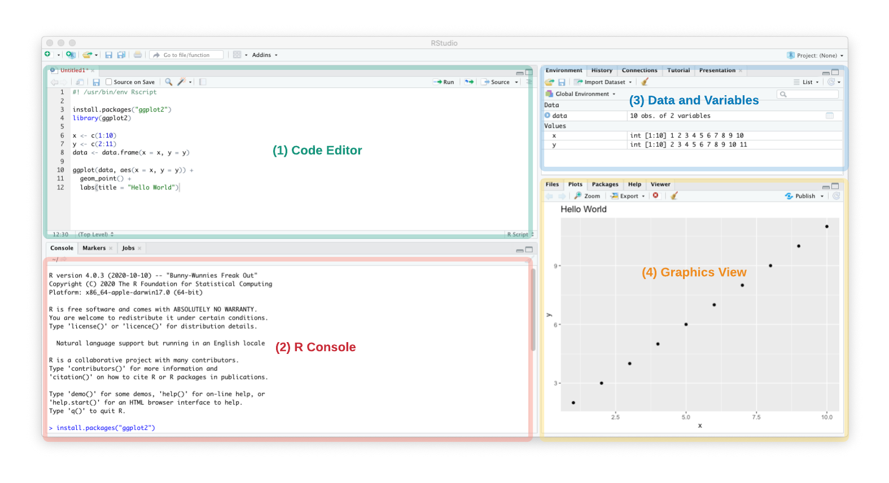
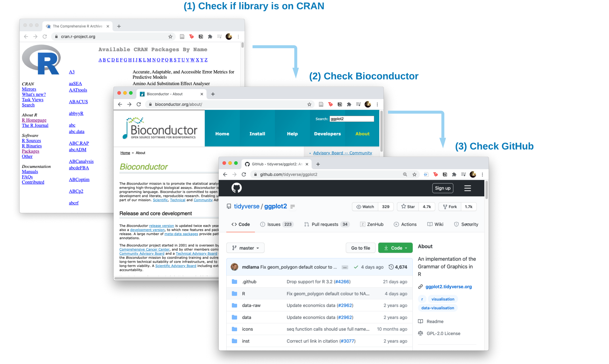
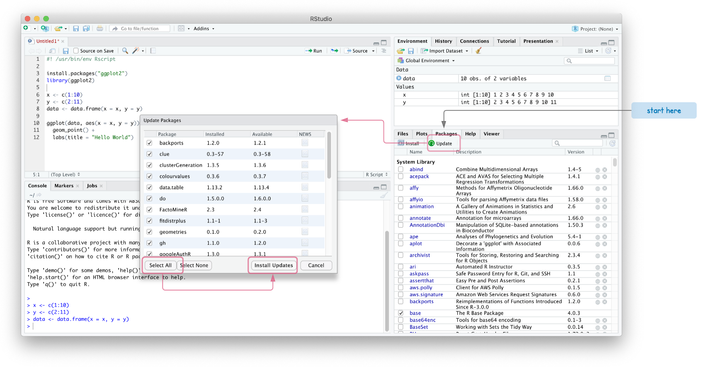

# Introduction

R is an interactive scripting language originally designed to teach statistics and released in 1993. It was inspired by the S language developed at Bell Labs and later became more widely used for data analysis.

* [Wikipedia - R (programming language)](https://en.wikipedia.org/wiki/R_(programming_language))
* [List of R projects on GitHub](https://github.com/topics/r)
* [YouTube: R in 2 hours Full Course](https://youtu.be/_V8eKsto3Ug)

# Getting Started in R

First you will need to install R or have access to an R environment. It is highly recommended to try to get R installed on your local computing environment by using the installer from CRAN. R environments may also be available on a shared HPC .

## Setup R Locally

1. Install the latest version of R from CRAN - [https://www.r-project.org/](https://www.r-project.org/)
2. Install the free version of RStudio IDE - [https://rstudio.com/products/rstudio/download/](https://rstudio.com/products/rstudio/download/)



When you first open RStudio, you'll notice several panes. Note: To see the Code Editor, you may need to go to Rstudio's  `File/New File/R Script`.

1. **Code Editor** - The top left pane is where you will be editing an R or R markdown script. You can run commands line by line by placing the cursor on a line and hitting `Ctrl+Enter` or `Cmd+Return`. Usually scripts are designed (and debugged) in RStudio but then run from the command line when you are processing multiple files.
2. **R Console** - R code is run in the bottom left pane. This will display any messages, warnings and error messages. This is useful for copying and pasting the error/warning into a search engine to debug a pipeline.
3. **Data and Variables** - This top right pane lists any loaded datasets and functions. If you double-click on `data | 10 obs. of 2 variables`, an excel-like view of the data is shown. Check this pane to make sure data is loaded and processed correctly. If items have `0 obs` (0 observations or rows), then the dataset has been completely filtered out.
4. **Graphics View** - Any plots will show up on the bottom right corner in the Plots pane.

Together these panes allow you to interactively design an R pipeline.

### Hands-On Exercise - using RStudio

Copy the following into the **Code Editor**, run it line by line, and see if you can recreate the graph in the **Graphics View**.  If you can, try modifying and running the script. Experiment to see what changes break the script.

```R
#! /usr/bin/env Rscript

install.packages("ggplot2")
library(ggplot2)

x <- c(1:10)
y <- c(2:11)
data <- data.frame(x = x, y = y)

ggplot(data, aes(x = x, y = y)) +
  geom_point() +
  labs(title = "Hello World")
```

## Installing R Libraries

R functions are made available as libraries (also referred to as packages) which need to be installed from somewhere. R libraries can be indexed on CRAN, bioconductor and GitHub. What's the difference between installing from these locations?

* **CRAN** R libraries have undergone a stringent quality control process. [CRAN Website](https://cran.r-project.org/)

  ```R
  cran_pkgs = c("ggplot2", "devtools")    # List one or multiple libraries
  install.packages(cran_pkgs)
  library(ggplot2)                        # Load the library
  ```

* **Bioconductor** libraries are focused on bioinformatic analysis and may or may not be available on CRAN but can be the latest version of a tools. [Bioconductor Website](https://www.bioconductor.org/install/)

  ```R
  install.packages("BiocManager")
  biocond_pkgs = c ("wgcna", "deseq2")    # List one or multiple libraries
  BiocManager::install(biocond_pkgs)
  ```

* **GitHub R libraries** tend to be the most recently developed libraries and may not have been submitted to Bioconductor or CRAN yet.

  ```R
  install.packages("devtools")
  devtools::install_github("username/reponame")      # Github R Library name
  ```

In order of preference, first attempt to install from CRAN. If the library is not available on CRAN, check Bioconductor, then the GitHub repo.



**Warning:** Have a regular schedule (maybe once every 6 months) to keep your R libraries up to date. Some libraries depend on other libraries and will not install until you have the latest version.

### Hands-On Exercise - installing an R library in three ways

Write an R script to install one package each from CRAN, bioconductor, and GitHub. Use a search engine (like Google) to find a library. If one library doesn't install, copy the error message and paste into the search engine and try to figure out why. Don't get hung up on getting it to install, this is practice.

```R
install.packages()
biocManager::install()
devtools::install_github()

remove.packages()      # <= uninstalls an R package, will need to provide package name
```

### Updating R libraries in RStudio

To get the latest version of R libraries, RStudio has a "Packages" pane in the bottom right. Some libraries depend on other libraries and will not install until you have the latest version.



This may take several minutes since we are updating multiple packages. If the "Install Updates" hangs or errors out, install the packages one by one.

## Using R on SCINet

On the SCINet HPC resources (Ceres and Atlas), R should be available as a module.

```bash
module load R
R --version
```

However since this will load base R without the R libraries, you may need to install your own R libraries which are installed to home directory by default.

Since the home directory may have restricted space, see the SCINet documentation on linking libraries on the HPC.

* SCINet Package Install - [https://scinet.usda.gov/guide/packageinstall/](https://scinet.usda.gov/guide/packageinstall/)

## Using RStudio Server on SCINet

Recently, Ceres HPC was configured to run RStudio Server. This allows you to run an RStudio like interface to the Ceres HPC. See full instructions on the SCINet website: [https://scinet.usda.gov/guide/rstudio/](https://scinet.usda.gov/guide/rstudio/)

<!--
## Testing Equations
https://www.cross-validated.com/How-to-render-math-on-Minimal-Mistakes/

Inline Equations

```
\\(x = y \times z)
```

Block Equations

```
\\[f(a) = \frac{1}{10 \times 11}\\]
```
-->
