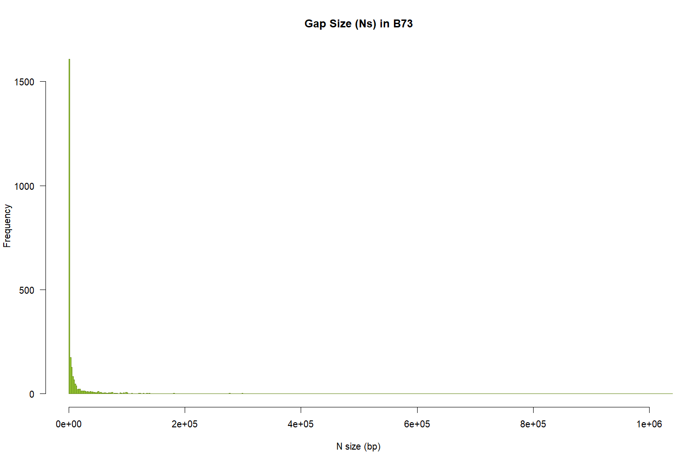
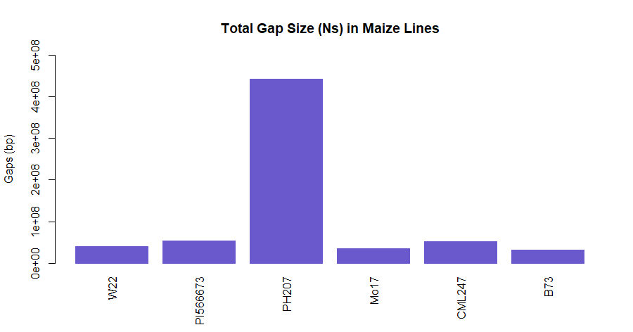
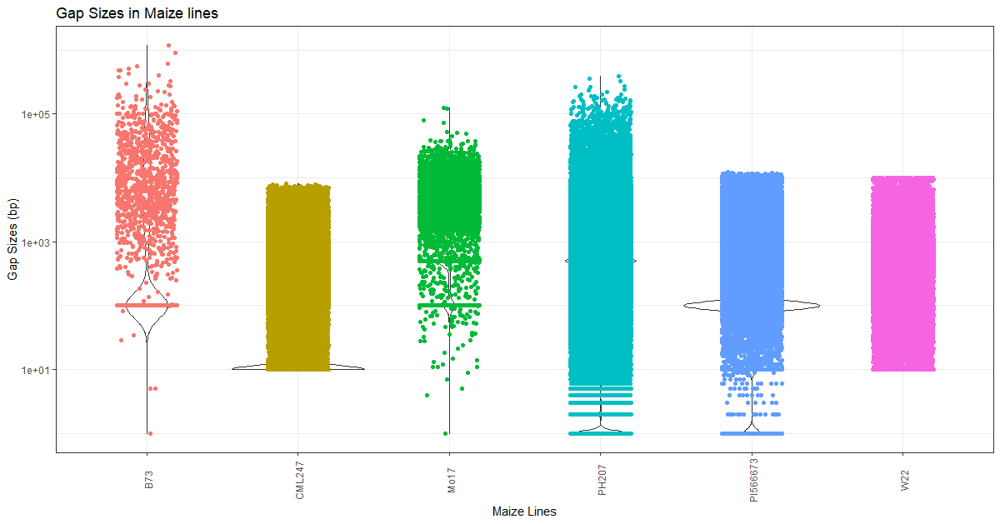

# Visualize Gaps in Assemblies

The scaffold-level assemblies usually contain gaps and it is very important know how big and widespread these gaps are in order to evaluate the quality of an assembly. Here, in this tutorial, we will examine few publicly available maize genomes and plot the gaps in them.


## Dataset

[MaizeGDB](https://www.maizegdb.org/genome) has many different genomes available for download. For this tutorial, we will use the following 6 genomes.


1. [W22](https://www.maizegdb.org/genome/genome_assembly/Zm-W22-REFERENCE-NRGENE-2.0) cultivar of _Zea mays_ subspp _mays_
2. [PI566673](https://www.maizegdb.org/genome/genome_assembly/Zx-PI566673-REFERENCE-YAN-1.0) cultivar of _Zea mays_ subspp _mexicana_
3. [PH207](https://www.maizegdb.org/genome/genome_assembly/Zm-PH207-REFERENCE_NS-UIUC_UMN-1.0) cultivar of _Zea mays_ subspp _mays_
4. [Mo17](https://www.maizegdb.org/genome/genome_assembly/Zm-Mo17-REFERENCE-CAU-1.0) cultivar of _Zea mays_ subspp _mays_
5. [CML247](https://www.maizegdb.org/genome/genome_assembly/Zm-CML247-REFERENCE-PANZEA-1.1) cultivar of _Zea mays_ subspp _mays_
6. [B73](https://www.maizegdb.org/genome/genome_assembly/Zm-B73-REFERENCE-GRAMENE-4.0) cultivar of _Zea mays_ subspp _mays_

## Download

Download the files using the `wget` command and extract them using `gunzip`

```bash
wget https://ftp.maizegdb.org/MaizeGDB/FTP/Zm-B73-REFERENCE-GRAMENE-4.0/Zm-B73-REFERENCE-GRAMENE-4.0.fa.gz
wget https://ftp.maizegdb.org/MaizeGDB/FTP/Zm-CML247-REFERENCE-PANZEA-1.1/Zm-CML247-REFERENCE-PANZEA-1.1.fa.gz
wget https://ftp.maizegdb.org/MaizeGDB/FTP/Zm-Mo17-REFERENCE-CAU-1.0/Zm-Mo17-REFERENCE-CAU-1.0.fa.gz
wget https://ftp.maizegdb.org/MaizeGDB/FTP/Zm-PH207-REFERENCE_NS-UIUC_UMN-1.0/Zm-PH207-REFERENCE_NS-UIUC_UMN-1.0.fasta.gz
wget https://ftp.maizegdb.org/MaizeGDB/FTP/Zm-W22-REFERENCE-NRGENE-2.0/Zm-W22-REFERENCE-NRGENE-2.0.fasta.gz
wget https://ftp.maizegdb.org/MaizeGDB/FTP/Zx-PI566673-REFERENCE-YAN-1.0/Zx-PI566673-REFERENCE-YAN-1.0.fa.gz
module load parallel
parallel "gunzip {}" ::: *.gz
```

## Gap Size calculations

Gaps are usually coded as `N` in the scaffolds. Normally, a fixed (constant) size denotes that there was a fusion of contigs/scaffolds based on some kind of evidence (genetic map or optical map). Though there is no standards set for various types of maps,  BioNano uses 13 N gap, and most genetic map programs use 100 N gap.

To calculate the gaps, we will set up a script as follows:

`get-N-sizes.sh`

```bash
#!/bin/bash
genome="$1"
out=$(basename ${genome%.*})
module load bioawk
tr "ATGCatgc" "xxxxxxxx" < $genome |\
bioawk -c fastx '{print $seq}' | \
sed -e 's/xN/\nN/g' -e 's/Nx/N\n/g' | \
sed 's/x//g' | \
awk '{print length($1)}' |\
grep -vw "^0$" > ${out}_Nsizes.txt
```

Run it as:

```bash
for fasta in *.fasta; do
  ./get-N-sizes.sh $fasta;
done
```

You will get text files as output, we will process them to create data files to plot them in `R`.

```bash
# files with gaps for each line
for gaps in *.txt; do
  name=$(echo $gaps |cut -f 2 -d "-");
  awk -v x=$name  '{print x"\t"$0}' $gaps > ${names}-size.txt;
done
# combined file for gaps
cat *-size.txt > lines_info.txt
# add headers
for size in *-size.txt; do
  sed -i '1 i Line\tNsize' $size;
done
# total gap size per genome file
datamash groupby 1 sum 2 <lines_info.txt > total_gaps_bases.txt
# add headers
sed -i '1 i Line\tGapSize' lines_info.txt;
sed -i '1 i Lines\tTotalGapSize' lines_info.txt;
```

Now that we have all the files, we will plot them in R.

## Plots

### Gaps per maize line

Distribution of gaps per line to visualize how big and how frequent gaps are in the assemblies. Now the files are created, in the R terminal, run these commands.

```r
size=read.table("B73-size.txt", header=TRUE)
png("b73.png", 1500, 1000, pointsize=20)
hist(size$Nsize, main="Gap Size (Ns) in B73",
     xlab="N size (bp)", ylab="Frequency",
     border="olivedrab",
     col="olivedrab3",
     xlim=c(100,1000000),
     las=1,
     breaks=500)
dev.off()
```



**Figure 1**: Gap size in B73

### Total gaps in each maize line

Again, open the R terminal or R-Studio and enter these commands.

```r
library(ggplot2)
theme_set(theme_bw())
gaps <- read.csv("lines_info.txt", sep="\t", stringsAsFactors=TRUE, header=TRUE)
ggplot(gaps, aes(Line, GapSize)) +
  geom_violin() +
  geom_jitter(aes(colour = Lines), shape=16, position=position_jitter(0.2)) +
  scale_y_continuous(trans='log10') +
  theme(axis.text.x = element_text(angle=90, vjust=0.6), legend.position="none") +
  labs(title="Gap Sizes in Maize genomes", x="Maize lines", y="Gap Sizes (bp)")
tgaps <- read.csv("total_gaps_bases.txt", sep="\t", stringsAsFactors=TRUE, header=TRUE)
barplot(tgaps$TotalGapSize, main="Total Gap Size (Ns) in Maize lines",
        names.arg=tgaps$Lines,
        ylab="Gaps (bp)",
        border="slateblue", col="slateblue3",
        las=3,
        ylim = range (0:500000000))
```



**Figure 2**: Total N (gap content) in Maize lines. Gaps for each maize line were summed together and is plotted as bar-graph.

Gap sizes in each maize line




**Figure 3**: Gap size and distribution in each Maize line. Each dot represents a gap for that NAM line (x-axis) with the size identified in y-axis (bp). Note that the y axis labels are in log scale and is not linear (for making distributions even).
