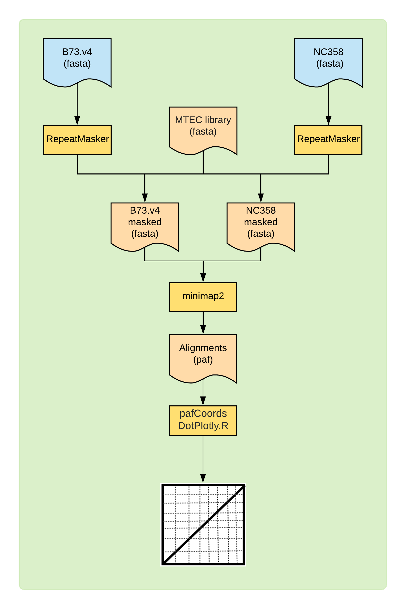

# DotPlots for comparing genomes

One of the primary comparative analyses that can be done once you have the genome is by visualizing the synteny with closely related species. Many characteristics for the genome can be easily highlighted with a good dotplot. Structural variations like inversion, deletion, duplication and insertions can be identified from these dotplots.

You will need two genomes for generating dotplots. A higher quality, preferably at chromosome level "reference" genome (also referred as target genome) and your genome (scaffold or contigs are okay, but chromosomes would be ideal), which is referred as query genome. We will run this tutorial using maize genomes, but can be easily applied on any other genome as well.


## Data

Download the data from [Grameme](http://ensembl.gramene.org/Zea_mays/Info/Index) and [MaizeGDB](https://www.maizegdb.org)

```bash
# B73 version 4.0 (Target)
wget ftp://ftp.gramene.org/pub/gramene/release-61/fasta/zea_mays/dna/Zea_mays.B73_RefGen_v4.dna.toplevel.fa.gz
# Genome of interest (Query)
wget https://ftp.maizegdb.org/MaizeGDB/FTP/Zm-CML247-REFERENCE-PANZEA-1.1/Zm-CML247-REFERENCE-PANZEA-1.1.fa.gz
# maize custom TE libraries
wget https://de.cyverse.org/dl/d/66ACA7F8-A367-4C48-9D63-828788F4F559/maizeTE10102014.RMname.nogene
gunzip *.gz
```

## Overview



Figure 1: Overview of the DotPlot construction method


## Organization

```
SyntenyTutorial
├── 1_data
│   ├── Zea_mays.B73_RefGen_v4.dna.toplevel.fa
│   └── Zm-CML247-REFERENCE-PANZEA-1.1.fa
├── 2_repeatmasking
│   ├── runRepeatMasker.sh
│   └── maizeTE10102014.RMname.nogene
├── 3_minimap
│   └── runMinimap.sh
└── 4_paf-processing
    └── pafCoordsDotPlotly.R
```

## Programs needed

Following programs are needed for this tutorial. Most of them can be installed via Conda environment, but some of them can be directly cloned from GitHub:

1. [RepeatMasker](http://www.repeatmasker.org)
2. [MiniMap2](https://github.com/lh3/minimap2)
3. [BioAWK](https://github.com/lh3/bioawk)
4. [dotPlotly](https://github.com/tpoorten/dotPlotly)

### 1. Repeatmask the genomes

For masking the maize genomes, it is essential to have an accurate, custom TE library. Using a generic repeat database will mask the genic regions and other potentially non-repetitive portions of the genome, leading to inaccurate downstream analyses.

[Ou Shujun](https://github.com/oushujun), from [Hufford Lab](https://mhufford.public.iastate.edu/HuffordLab/home.html), here at ISU created a new maize repeat library, using _[The Extensive de novo TE Annotator (EDTA)](https://github.com/oushujun/EDTA)_. This is the Maize TE Consortium (MTEC) curated TE library created in 2014/10/10. The original sequence names were converted to fit the naming scheme of RepeatMasker, so that TEs could be parsed into class, super-families, and families. A TE-free whole-genome CDS dataset derived from the B73v4 annotation was used to clean any potential genic sequences in this MTEC library. TE sequences containing more than 1000 bp or 30% of genic sequences were discarded entirely, otherwise genic sequences were removed and the remaining sequences were joined. Cleaned TE sequences shorter than 80 bp were also discarded. As terminal structure of TEs is the key for their identification, any TE sequences with the beginning or ending 20 bp masked by CDS sequences were determined false positives and removed. Overall, a total of 1,359 sequences were remained from the original 1,546 sequences.


Setup
```bash
cd 2_repeatmasking
ln -s ../1_data/Zea_mays.B73_RefGen_v4.dna.toplevel.fa
ln -s ../1_data/Zm-CML247-REFERENCE-PANZEA-1.1.fa
```

Script `runRepeatMasker.sh`
```bash
#!/bin/bash
conda activate repeatmasker
lib="maizeTE10102014.RMname.nogene"
genome=$1
RepeatMasker \
  -e ncbi \
  -pa 36 \
  -q \
  -lib ${lib} \
  -nocut \
  -gff \
  ${genome}
```
Generate commands and submit:

```bash
for fasta in *.fa; do
  echo "./runRepeatMasker.sh $fasta"
done > repmask.cmds
makeSLURMs.py 1 repmask.cmds
for sub in repmask_*sub; do
  sbatch $sub;
done
```

Once complete, you will have following output files:

For B73.V4:
```
Zea_mays.B73_RefGen_v4.dna.toplevel.fa.out
Zea_mays.B73_RefGen_v4.dna.toplevel.fa.masked
Zea_mays.B73_RefGen_v4.dna.toplevel.fa.tbl
Zea_mays.B73_RefGen_v4.dna.toplevel.fa.ori.out
Zea_mays.B73_RefGen_v4.dna.toplevel.fa.cat.gz
Zea_mays.B73_RefGen_v4.dna.toplevel.fa.gff
```

Here, the `<name>.fa.gff` provides a GFF file for masked regions, that can be visualized in [IGV](https://software.broadinstitute.org/software/igv/) and the `<name>.fa.masked` provides you a masked genome that is needed for our subsequent steps.


### 2. MiniMap2 to align genomes

Although there are many programs to align the genomes, MiniMap2 does the job really well at lightning speed. The repeatmasked genomes can be aligned in less than 10 minutes, running on a cluster with 16 CPUs, 128Gb RAM. Moreover, the preset options eliminates a guess work of what options that might or might not work for your specific condition. The aligner is also versatile and can use many different data inputs as well.

Setup:

```bash
cd 3_minimap
ln -s ../2_repeatmasking/Zea_mays.B73_RefGen_v4.dna.toplevel.fa.masked B73.v4-masked.fa
ln -s ../2_repeatmasking/Zm-CML247-REFERENCE-PANZEA-1.1.fa.masked CML247-masked.fa
```

Script `runMinimap.sh`

```bash
#!/bin/bash
query=$1
target="B73.v4-masked.fa"
outname="${query%.*}_${target%.*}_minimap2.paf"
module load minimap2
minimap2 -x asm5 -t 36 $target $query > ${outname}
```
Generate commands and submit:

```bash
echo "./runMinimap.sh CML247-masked.fa" > minimap.cmds
makeSLURMs.py 1 minimap.cmds
sbatch minimap_0.sub
```

The resulting file will be
```
CML247-masked_B73.v4-masked_minimap2.paf
```
Which is now ready to plot.
