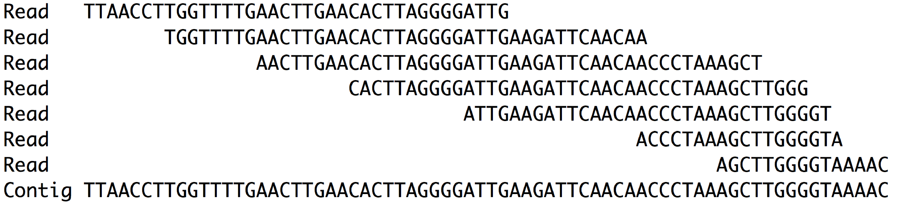

# Data Terminology

## Learning Objective
Upon completion of this section the learner will know the definitions for the following terms.

* base/nucleotide
* read
* contig
* scaffold
* chromosome

## What is a base?
There are four common bases in DNA sequence, ```A```denine, ```G```uanine, ```C```ytosine and ```T```hymine. ```U```racil is found in RNA in place of Thyamine


Image taken from [wikipedia](https://en.wikipedia.org/wiki/Nucleotide) where more information about nucleotides can also be found.

## What is a read?
A read is a string of bases represented by their one letter codes. Here is an example of a read that is 50 bases long.
``TTAACCTTGGTTTTGAACTTGAACACTTAGGGGATTGAAGATTCAACAACCCTAAAGCTTGGGGTAAAAC``  


## What is a contig?

A contig is the consensus sequence generated by aligning reads to themselves.  




The last line is the consensus of the aligned reads. We call this consensus sequence a **contig**.

## What is a scaffold?
A scaffold is a set of contigs that have been ordered and oriented based on mate pair or long distance information.

```contig```NNNNNNNNNNNN```gitnoc```NNNNNNNN```contig```NNNNNNNN```contig```NNNN```gitnoc```

In the line above
* ```contig``` is a string of of bases (ATC or G)
* N is an unknown base
* ```gitnoc``` is the word contig written backwards to represent the reverse complement of a contig  


## What is a chromosome?
Chromosomes are the largest DNA molecules in a cell. Scaffolds can be ordered and oriented using a genetic map or Hi-C data into linkage groups or chromosomes.  The ultimate goal of a genome assembly project is to assemble reads into phased chromosomes that represent an actual individual.  Most chromosomal assemblies produced today are not phased or may represent multiple individuals.  The closest to this ideal that science has produced to date is through [Trio binning](https://www.biorxiv.org/content/early/2018/02/26/271486).

---
[Table of contents](terminology_index.md)
