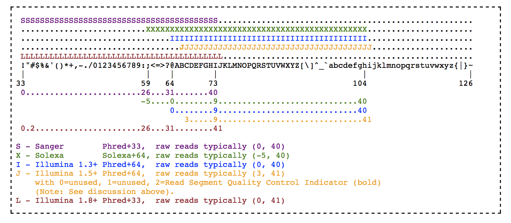

## Learning Objective

Upon completion of this section on fastq quality scores the learner will understand the following:

-   ASSCI character encodings are used to represent quality scores
-   These numbers are converted to values between -5 and 41 to represent quality score depending on the encoding method

[This table was taken from  wikipedia](https://en.wikipedia.org/wiki/FASTQ_format) where more information can be found on this topic.

To determine if the score is <blockcode>Phred+33</blockcode>, <blockcode>Phred+64</blockcode> or <blockcode>Solexa+64</blockcode>, use this one-liner (you can use <blockcode>zcat</blockcode>  if the <blockcode>fastq</blockcode> file is gzipped):

    head -n 10000 input.fastq |\
      awk '{if(NR%4==0) printf("%s",$0);}' |  od -A n -t u1 | \
      awk 'BEGIN{min=100;max=0;} \
          {for(i=1;i<=NF;i++) \
              {if($i>max) max=$i; \
                   if($i<min) min=$i;}}END \
              {if(max<=74 && min<59) \
                         print "Phred+33"; \
               else \
               if(max>73 && min>=64) \
                         print "Phred+64"; \
               else \
               if(min>=59 && min<64 && max>73) \
                         print "Solexa+64"; else print "Unknown score encoding!";}'
---
[Table of contents](terminology_index.md)
