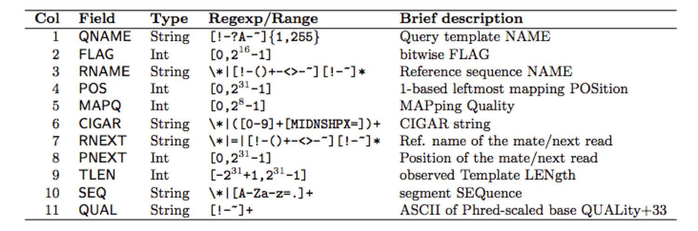
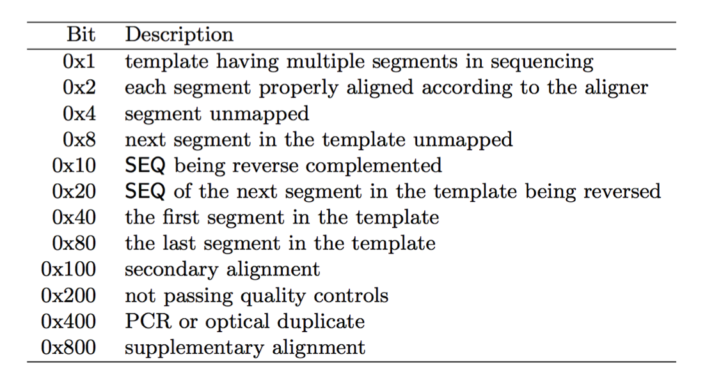
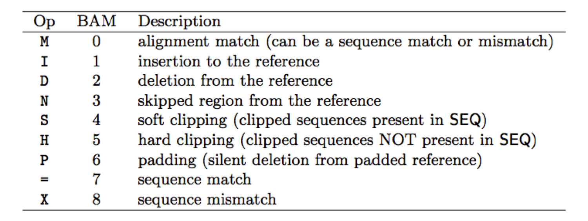

# File Formats
---
## Learning Objective
Upon completion of this section you will have a better understanding of the following file formats, how to read them and interpret the information they contain.

* FASTA – plain sequences
* FASTQ – sequencing reads
* GFF – gene models 
* GTF - variation of GFF
* VCF – sequence variants
* SAM – sequence alignments
* BAM – alignments in binary


---
## FASTA

Text file format for storing sequences
for nucleotide & amino acid data.  For a given sequence, a single line description and ID is supplied followed by one or more lines of sequence.  Multiple sequences can be placed in a single file and empty lines are typically ignored by programs.  The recommended number of sequence characters per line is 60 – 80.

```
Line 1: starts with “>” followed by ID  
Line 2: Sequence data
```
---
##### Examples
```
>gi|296581|emb|Z22600.1| D.tigrina homeodomain mRNA
ttcgcggttcataactacctgacgaggttgagacggtacgagctggcggtggccctcaatcttaacgaaa
gacagataaaagtttgg
```
```
>gi|425153|gb|L26238.1|MUSHOME Mus domesticus (lbx) homeodomain mRNA, partial cds
CCATTTCAACAAGTACCTGACCAGGGCTCGGCGAGTGGAAGTTGCCGCTATTCTCGAGCTCAACGAAACT
CAAGTGAAAATT
```
```
>gi|2695691|gb|AAC36493.1| BRCA1 [Rattus norvegicus]
MDLSAVRIQEVQNVLHAMQKILECPICLELIKEPVSTQCDHIFCKFCMLKLLNQKKGPSQCPLCKNEITK
RSLQGSARFSQLVEELLKIIDAFELDTGMQCANGFSFSKKKNSSSELLNEDASIIQSVGYRNRVKKLQQI
ESGSATLKDSLSVQLSNLGIVRSMKKNRQTQPQNKSVYIALESDSSEERVNAPDGCSVRDQELFQIAPGG
AGDEGKLNSAKKAACDFSEGIRNIEHHQCSDKDLNPTENHATERHPEKCPRISVANVHVEPCGTDARASS
```
---
# Common Errors that occur with this file type

* Program requires the sequences to all be on a single but the fasta file is on multiple lines
* Program requies the sequences to be on multiple lines with a string length per line less than 80 characters but the sequences are written on a single lines

---

# FASTQ File Format

FASTQ files are similar to FASTA but contain the quality score of the sequence data (only nucleotide sequences). The format contains two additional lines beyond FASTA format.

```
Line 1: starts with “@” followed by ID  
Line 2: Sequence data  
Line 3: Starts with “+”       rest of the description is optional  
Line 4:Quality score for each base in the sequence
```

Text file format for storing sequences and its quality scores (only nucleotide sequences)
File extension is .fastq or .fq
4 lines per entry

```
@HISEQ:402:H147CADXX:1:1101:1250:2208 1:N:0:CGATGT
TGATGCTGCNAATTTTATTCAGTCAGCGGAGGGGGCTTACGTGTATTTTCTGCAACCTTT
+
CCCFFFFFH#4AFIJJJJJJJJIJJJJJJJJJJJJJJJJJJHHHHHHFFFFFFFEEEEED
```
---
# Quality score

* Probability of an error in base calling
* Higher score means low probability of error
* Different types of encoding available (Sanger, Phred, etc..)
* Different sequencing technologies use different encoding

For more information on Quality Score encoding see [Fastq Quality score Encoding](introduction/fastqquality-Score-encoding.md)


---

# GFF3: General Feature Format

This is a nine column tab separated text file that stores information about gene annotation.

```
Column 1  seqID (e.g. chromosome/scaffold, genome id, etc..)  
Column 2  Source (program used to generate or location of download)  
Column 3  Feature type (gene, mRNA, CDS, exon, etc.)  
Column 4  Start position of feature  
Column 5  End position of feature  
Column 6  Score (some program outputs will have a score of confidence for feature)  
Column 7  Strand (+,-,.)  
Column 8  Phase  
Column 9  List of attributes in the format tag=value. Multiple attributes are separated by “;”
```
Undefined fields are replaced with “.” character

---
# Example GFF File
```
##gff-version 3
##date Thu Nov  7 15:29:10 2013
##source gbrowse gbgff gff3 dumper
Chr1	TAIR9	gene	813471	816749	.	+	.	ID=AT1G03310;Note=protein_coding_gene;Name=AT1G03310
Chr1	TAIR9	mRNA	813471	816749	.	+	.	ID=AT1G03310.1;Parent=AT1G03310;Name=AT1G03310.1;Index=1
Chr1	TAIR9	protein	813975	816623	.	+	.	ID=AT1G03310.1-Protein;Name=AT1G03310.1;Derives_from=AT1G03310.1
Chr1	TAIR9	exon	813471	813581	.	+	.	Parent=AT1G03310.1
Chr1	TAIR9	five_prime_UTR	813471	813581	.	+	.	Parent=AT1G03310.1
Chr1	TAIR9	exon	813929	816749	.	+	.	Parent=AT1G03310.1
Chr1	TAIR9	five_prime_UTR	813929	813974	.	+	.	Parent=AT1G03310.1
Chr1	TAIR9	CDS	813975	816623	.	+	0	Parent=AT1G03310.1,AT1G03310.1-Protein;
Chr1	TAIR9	three_prime_UTR	816624	816749	.	+	.	Parent=AT1G03310.1
Chr1	TAIR9	mRNA	813486	816749	.	+	.	ID=AT1G03310.2;Parent=AT1G03310;Name=AT1G03310.2;Index=1
Chr1	TAIR9	protein	813975	816623	.	+	.	ID=AT1G03310.2-Protein;Name=AT1G03310.2;Derives_from=AT1G03310.2
Chr1	TAIR9	exon	813486	813604	.	+	.	Parent=AT1G03310.2
Chr1	TAIR9	five_prime_UTR	813486	813604	.	+	.	Parent=AT1G03310.2
Chr1	TAIR9	exon	813929	816749	.	+	.	Parent=AT1G03310.2
Chr1	TAIR9	five_prime_UTR	813929	813974	.	+	.	Parent=AT1G03310.2
Chr1	TAIR9	CDS	813975	816623	.	+	0	Parent=AT1G03310.2,AT1G03310.2-Protein;
Chr1	TAIR9	three_prime_UTR	816624	816749	.	+	.	Parent=AT1G03310.2
Chr1	TAIR9	gene	795532	798463	.	-	.	ID=AT1G03260;Note=protein_coding_gene;Name=AT1G03260
Chr1	TAIR9	mRNA	795532	798463	.	-	.	ID=AT1G03260.1;Parent=AT1G03260;Name=AT1G03260.1;Index=1
Chr1	TAIR9	protein	795678	798102	.	-	.	ID=AT1G03260.1-Protein;Name=AT1G03260.1;Derives_from=AT1G03260.1
Chr1	TAIR9	five_prime_UTR	798103	798463	.	-	.	Parent=AT1G03260.1
Chr1	TAIR9	CDS	798001	798102	.	-	0	Parent=AT1G03260.1,AT1G03260.1-Protein;
Chr1	TAIR9	exon	798001	798463	.	-	.	Parent=AT1G03260.1
Chr1	TAIR9	gene	799191	802436	.	+	.	ID=AT1G03270;Note=protein_coding_gene;Name=AT1G03270
Chr1	TAIR9	mRNA	799191	802436	.	+	.	ID=AT1G03270.1;Parent=AT1G03270;Name=AT1G03270.1;Index=1
Chr1	TAIR9	protein	799191	802436	.	+	.	ID=AT1G03270.1-Protein;Name=AT1G03270.1;Derives_from=AT1G03270.1
Chr1	TAIR9	exon	799191	799431	.	+	.	Parent=AT1G03270.1
```
---
# Example from GFF3, canonical gene definition by Lincoln Stein


```
##gff-version 3
##sequence-region   ctg123 1 1497228
ctg123 . gene            1000  9000  .  +  .  ID=gene00001;Name=EDEN

ctg123 . TF_binding_site 1000  1012  .  +  .  ID=tfbs00001;Parent=gene00001

ctg123 . mRNA            1050  9000  .  +  .  ID=mRNA00001;Parent=gene00001;Name=EDEN.1
ctg123 . mRNA            1050  9000  .  +  .  ID=mRNA00002;Parent=gene00001;Name=EDEN.2
ctg123 . mRNA            1300  9000  .  +  .  ID=mRNA00003;Parent=gene00001;Name=EDEN.3

ctg123 . exon            1300  1500  .  +  .  ID=exon00001;Parent=mRNA00003
ctg123 . exon            1050  1500  .  +  .  ID=exon00002;Parent=mRNA00001,mRNA00002
ctg123 . exon            3000  3902  .  +  .  ID=exon00003;Parent=mRNA00001,mRNA00003
ctg123 . exon            5000  5500  .  +  .  ID=exon00004;Parent=mRNA00001,mRNA00002,mRNA00003
ctg123 . exon            7000  9000  .  +  .  ID=exon00005;Parent=mRNA00001,mRNA00002,mRNA00003
##gff-version 3
##sequence-region   ctg123 1 1497228
ctg123 . gene            1000  9000  .  +  .  ID=gene00001;Name=EDEN

ctg123 . TF_binding_site 1000  1012  .  +  .  ID=tfbs00001;Parent=gene00001

ctg123 . mRNA            1050  9000  .  +  .  ID=mRNA00001;Parent=gene00001;Name=EDEN.1
ctg123 . mRNA            1050  9000  .  +  .  ID=mRNA00002;Parent=gene00001;Name=EDEN.2
ctg123 . mRNA            1300  9000  .  +  .  ID=mRNA00003;Parent=gene00001;Name=EDEN.3

ctg123 . exon            1300  1500  .  +  .  ID=exon00001;Parent=mRNA00003
ctg123 . exon            1050  1500  .  +  .  ID=exon00002;Parent=mRNA00001,mRNA00002
ctg123 . exon            3000  3902  .  +  .  ID=exon00003;Parent=mRNA00001,mRNA00003
ctg123 . exon            5000  5500  .  +  .  ID=exon00004;Parent=mRNA00001,mRNA00002,mRNA00003
ctg123 . exon            7000  9000  .  +  .  ID=exon00005;Parent=mRNA00001,mRNA00002,mRNA00003

ctg123 . CDS             1201  1500  .  +  0  ID=cds00001;Parent=mRNA00001;Name=edenprotein.1
ctg123 . CDS             3000  3902  .  +  0  ID=cds00001;Parent=mRNA00001;Name=edenprotein.1
ctg123 . CDS             5000  5500  .  +  0  ID=cds00001;Parent=mRNA00001;Name=edenprotein.1
ctg123 . CDS             7000  7600  .  +  0  ID=cds00001;Parent=mRNA00001;Name=edenprotein.1

ctg123 . CDS             1201  1500  .  +  0  ID=cds00002;Parent=mRNA00002;Name=edenprotein.2
ctg123 . CDS             5000  5500  .  +  0  ID=cds00002;Parent=mRNA00002;Name=edenprotein.2
ctg123 . CDS	     	   7000  7600  .  +  0  ID=cds00002;Parent=mRNA00002;Name=edenprotein.2

ctg123 . CDS             3301  3902  .  +  0  ID=cds00003;Parent=mRNA00003;Name=edenprotein.3
ctg123 . CDS	     	   5000  5500  .  +  1  ID=cds00003;Parent=mRNA00003;Name=edenprotein.3
ctg123 . CDS	     	   7000  7600  .  +  1  ID=cds00003;Parent=mRNA00003;Name=edenprotein.3

ctg123 . CDS             3391  3902  .  +  0  ID=cds00004;Parent=mRNA00003;Name=edenprotein.4
ctg123 . CDS	     	   5000  5500  .  +  1  ID=cds00004;Parent=mRNA00003;Name=edenprotein.4
ctg123 . CDS	     	   7000  7600  .  +  1  ID=cds00004;Parent=mRNA00003;Name=edenprotein.4
```
---
#  More information on GFF files

* [GFF3 definition](https://raw.githubusercontent.com/The-Sequence-Ontology/Specifications/master/img/figure1.png)

---

## GTF: Gene Transfer Formats

GTF is a slight variation on GFF. The first 8 columns are the same.  The 9th column has a different syntax requiring two attributes
* gene_id  
* transcript_id  

---
# GTF format
```
AB000381 Twinscan  CDS          380   401   .   +   0  gene_id "001"; transcript_id "001.1";
AB000381 Twinscan  CDS          501   650   .   +   2  gene_id "001"; transcript_id "001.1";
AB000381 Twinscan  CDS          700   707   .   +   2  gene_id "001"; transcript_id "001.1";
AB000381 Twinscan  start_codon  380   382   .   +   0  gene_id "001"; transcript_id "001.1";
AB000381 Twinscan  stop_codon   708   710   .   +   0  gene_id "001"; transcript_id "001.1";
```

### GFF format for comparison
```
ctg123 . mRNA            1050  9000  .  +  .  ID=mRNA00001;Parent=gene00001;Name=EDEN.1
ctg123 . mRNA            1050  9000  .  +  .  ID=mRNA00002;Parent=gene00001;Name=EDEN.2
ctg123 . mRNA            1300  9000  .  +  .  ID=mRNA00003;Parent=gene00001;Name=EDEN.3

```

---

# VCF: Variant Call Formats

VCF is a text file for storing sequence variants, SNPs and InDels.  It has **meta-information** lines, a single **header line** describing columns in the data, and the **data lines**.

# Example VCF

```
##fileformat=VCFv4.1
##FILTER=<ID=LowQual,Description="Low quality">
##FORMAT=<ID=AD,Number=.,Type=Integer,Description="Allelic depths for the ref and alt alleles in the order listed">
##FORMAT=<ID=DP,Number=1,Type=Integer,Description="Approximate read depth (reads with MQ=255 or with bad mates are filtered)">
##FORMAT=<ID=GQ,Number=1,Type=Integer,Description="Genotype Quality">
##FORMAT=<ID=GT,Number=1,Type=String,Description="Genotype">
##INFO=<ID=AC,Number=A,Type=Integer,Description="Allele count in genotypes, for each ALT allele, in the same order as listed">
##INFO=<ID=AF,Number=A,Type=Float,Description="Allele Frequency, for each ALT allele, in the same order as listed">
##INFO=<ID=AN,Number=1,Type=Integer,Description="Total number of alleles in called genotypes">
##INFO=<ID=BaseQRankSum,Number=1,Type=Float,Description="Z-score from Wilcoxon rank sum test of Alt Vs. Ref base qualities">
##INFO=<ID=ClippingRankSum,Number=1,Type=Float,Description="Z-score From Wilcoxon rank sum test of Alt vs. Ref number of hard clipped bases">
##INFO=<ID=DP,Number=1,Type=Integer,Description="Approximate read depth; some reads may have been filtered">
##INFO=<ID=DS,Number=0,Type=Flag,Description="Were any of the samples downsampled?">
##INFO=<ID=FS,Number=1,Type=Float,Description="Phred-scaled p-value using Fisher's exact test to detect strand bias">
##INFO=<ID=HaplotypeScore,Number=1,Type=Float,Description="Consistency of the site with at most two segregating haplotypes">
##contig=<ID=Chr4,length=18585056>
##contig=<ID=Chr5,length=26975502>
##contig=<ID=chloroplast,length=154478>
##contig=<ID=mitochondria,length=366924>
##reference=file:///projects/Arabidopsis.fasta
#CHROM  POS     ID      REF     ALT     QUAL    FILTER  INFO    FORMAT  Sample1
Chr1    27767199        .       G       GA      743.73  .       AC=2;AF=1.00;AN=2;BaseQRankSum=-1.985;ClippingRankSum=-0.117;DP=42;FS=0.000;MLEAC=2;MLEAF=1.00;MQ=41.32;MQ0=0;MQRankSum=-1.129;QD=17.71;ReadPosRankSum=-0.195   GT:AD:DP:GQ:PL  1/1:2,30:32:38:781,38,0
Chr1    27767571        .       CATAT   C       814.73  .       AC=2;AF=1.00;AN=2;DP=46;FS=0.000;MLEAC=2;MLEAF=1.00;MQ=43.25;MQ0=0;QD=4.43      GT:AD:DP:GQ:PL  1/1:0,19:19:64:852,64,0
Chr1    27768362        .       T       C       1676.77 .       AC=2;AF=1.00;AN=2;DP=39;FS=0.000;MLEAC=2;MLEAF=1.00;MQ=39.97;MQ0=0;QD=31.09     GT:AD:DP:GQ:PL  1/1:0,39:39:99:1705,117,0
Chr1    27768651        .       A       ATG     1909.73 .       AC=2;AF=1.00;AN=2;DP=52;FS=0.000;MLEAC=2;MLEAF=1.00;MQ=43.32;MQ0=0;QD=18.36     GT:AD:DP:GQ:PL  1/1:0,44:44:99:1947,129,0

```
---
# Meta information in VCF file

INFO

```
##INFO=<ID=GT,Number=number,Type=type,Description="description",Source="source",Version="version">
##INFO=<ID=DP,Number=1,Type=Integer,Description="Approximate read depth; some reads may have been filtered">

```
---
# ID and Type are mandatory

```
##INFO=<ID=AC,Number=A,Type=Integer,Description="Allele count in genotypes, for each ALT allele, in the same order as listed">
##INFO=<ID=AF,Number=A,Type=Float,Description="Allele Frequency, for each ALT allele, in the same order as listed">
##INFO=<ID=AN,Number=1,Type=Integer,Description="Total number of alleles in called genotypes">
##INFO=<ID=BaseQRankSum,Number=1,Type=Float,Description="Z-score from Wilcoxon rank sum test of Alt Vs. Ref base qualities">
##INFO=<ID=ClippingRankSum,Number=1,Type=Float,Description="Z-score From Wilcoxon rank sum test of Alt vs. Ref number of hard clipped bases">
##INFO=<ID=DP,Number=1,Type=Integer,Description="Approximate read depth; some reads may have been filtered">
##INFO=<ID=DS,Number=0,Type=Flag,Description="Were any of the samples downsampled?">
##INFO=<ID=FS,Number=1,Type=Float,Description="Phred-scaled p-value using Fisher's exact test to detect strand bias">
##INFO=<ID=HaplotypeScore,Number=1,Type=Float,Description="Consistency of the site with at most two segregating haplotypes">
```
---
# FILTER
```
##FILTER=<ID=ID,Description="description">
##FILTER=<ID=LowQual,Description="Low quality">
```
# FORMAT
```
##FORMAT=<ID=ID,Number=number,Type=type,Description="description">
##FORMAT=<ID=DP,Number=1,Type=Integer,Description="Approximate read depth (reads with MQ=255 or with bad mates are filtered)”>
```
---
# Header

```
Column 1: CHROM – chromosome name  
Column 2: POS – position in the chromosome  
Column 3:  ID – identifier  
Column 4: REF – reference base(s) in the   reference genome  
Column 5: ALT – alternate base(s) in the comparing sequence  
Column 6: QUAL – quality score  
Column 7: FILTER – filter status  
Column 8: INFO – additional information  
Column 9: FORMAT – genotype information  
Column 10: sample–1  
Column 11: sample–2 and so on …  


#CHROM  POS     ID      REF     ALT     QUAL    FILTER  INFO    FORMAT  sample1 sample2 ... sampleN
```
---
# Data lines Example

```
Chr1    27767199        .       G       GA      743.73  .       AC=2;AF=1.00;AN=2;BaseQRankSum=-1.985;ClippingRankSum=-0.117;DP=42;FS=0.000;MLEAC=2;MLEAF=1.00;MQ=41.32;MQ0=0;MQRankSum=-1.129;QD=17.71;ReadPosRankSum=-0.195   GT:AD:DP:GQ:PL  1/1:2,30:32:38:781,38,0
Chr1    27767571        .       CATAT   C       814.73  .       AC=2;AF=1.00;AN=2;DP=46;FS=0.000;MLEAC=2;MLEAF=1.00;MQ=43.25;MQ0=0;QD=4.43      GT:AD:DP:GQ:PL  1/1:0,19:19:64:852,64,0
Chr1    27768362        .       T       C       1676.77 .       AC=2;AF=1.00;AN=2;DP=39;FS=0.000;MLEAC=2;MLEAF=1.00;MQ=39.97;MQ0=0;QD=31.09     GT:AD:DP:GQ:PL  1/1:0,39:39:99:1705,117,0
Chr1    27768651        .       A       ATG     1909.73 .       AC=2;AF=1.00;AN=2;DP=52;FS=0.000;MLEAC=2;MLEAF=1.00;MQ=43.32;MQ0=0;QD=18.36     GT:AD:DP:GQ:PL  1/1:0,44:44:99:1947,129,0
```
---
# More information for VCF files

[VCF 4.2 specification PDF](http://samtools.github.io/hts-specs/VCFv4.2.pdf)

---
# SAM Sequence Alignment/Map

SAM is a tab limited text file that stores sequence alignments.  Header lines start with @.  There are 11 mandatory columns

### Examples
```
@HD     VN:1.0  SO:unsorted
@PG     ID:GSNAP        PN:gsnap        VN:2014-06-10   CL:gsnap -d TAIR10 --dir=./GSNAPdb//TAIR10 --failed-input=./GSNAPout//1ab-1_failed_alignments -t 4 -N 1 -B 5 -m 5 --part=0/8 --input-buffer-size=1000000 --output-buffer-size=1000000 -A sam --split-output=./GSNAPout//OUT.gsnap.1ab-1_CGATGT_L008_R1_001.fastq.0.8 .//1ab-1_CGATGT_L008_R1_001.fastq .//1ab-1_CGATGT_L008_R2_001.fastq
@SQ     SN:1    LN:30427671
@SQ     SN:2    LN:19698289
@SQ     SN:3    LN:23459830
@SQ     SN:4    LN:18585056
@SQ     SN:5    LN:26975502
@SQ     SN:chloroplast  LN:154478
@SQ     SN:mitochondria LN:366924
HISEQ:496:C4KY7ACXX:8:1101:1606:2994    73      4       13740599        36      100M    *       0       0       ATCACAAAGAATATTCATCAATGCTTCACAAAACATTGGAAGGGGTAATAATGATGGAGACGTTTCCAAAAACAACCGTTGATGTTTTTCCATTGTTTCT    ;;?=?;=BDDCA:CEEE@4A?,AEB?A?9A?<+?::?CCCD1))08?BD4B?<BBD:C=)(5-;A7@AA=CC/=??(3>@5;;AD###############    MD:Z:32G10T45G5G4       NH:i:1  HI:i:1  NM:i:4  SM:i:36 XQ:i:40 X2:i:0  XO:Z:HU PG:Z:A
HISEQ:496:C4KY7ACXX:8:1101:1606:2994    133     *       0       0       *       4       13740599        0       ATACAATCGAAAATCATAGTTATTTATGCTCATTCATCGGAAGCTGGGGCAGACTGTTTCAGACAATTACCCATTATTTCTCGAACACTTGAACTAGCAT    (85@34?#############################################################################################    XO:Z:HU
```
---
# Columns in SAM file



```
HISEQ:496:C4KY7ACXX:8:1101:1606:2994    73      4       13740599        36      100M    *       0       0
    ATCACAAAGAATATTCATCAATGCTTCACAAAACATTGGAAGGGGTAATAATGATGGAGACGTTTCCAAAAACAACCGTTGATGTTTTTCCATTGTTTCT
    ;;?=?;=BDDCA:CEEE@4A?,AEB?A?9A?<+?::?CCCD1))08?BD4B?<BBD:C=)(5-;A7@AA=CC/=??(3>@5;;AD###############
    MD:Z:32G10T45G5G4       NH:i:1  HI:i:1  NM:i:4  SM:i:36 XQ:i:40 X2:i:0  XO:Z:HU PG:Z:A
HISEQ:496:C4KY7ACXX:8:1101:1606:2994    133     *       0       0       *       4       13740599        0
    ATACAATCGAAAATCATAGTTATTTATGCTCATTCATCGGAAGCTGGGGCAGACTGTTTCAGACAATTACCCATTATTTCTCGAACACTTGAACTAGCAT
    (85@34?#############################################################################################
    XO:Z:HU
```
---
##### FLAG definitions



|Flag value| definition|
|----------|-----------|
|1 | Multiple segments|
|4 | Segment unmapped |
|8 | Next segment unmapped|
|64| First segment|
|128| Last segment|


##### CIGAR string definition



100M – 100 matches
2S98M – 2 soft clipped followed by 98 matches
61M3I36M – 61 matches, 3 insertions, 36 matches
```

---
##### More information

[SAM specifications PDF](https://samtools.github.io/hts-specs/SAMv1.pdf)
## BAM

BAM is the binary format for storing sequencing alignments.  It has a smaller storage footprint and needs to be decompressed to be human readable.


[Table of contents](https://isugenomics.github.io/bioinformatics-workbook/)
