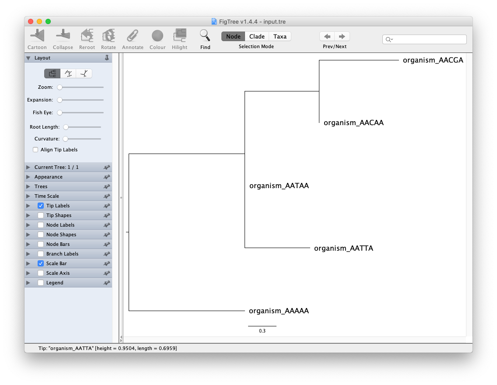
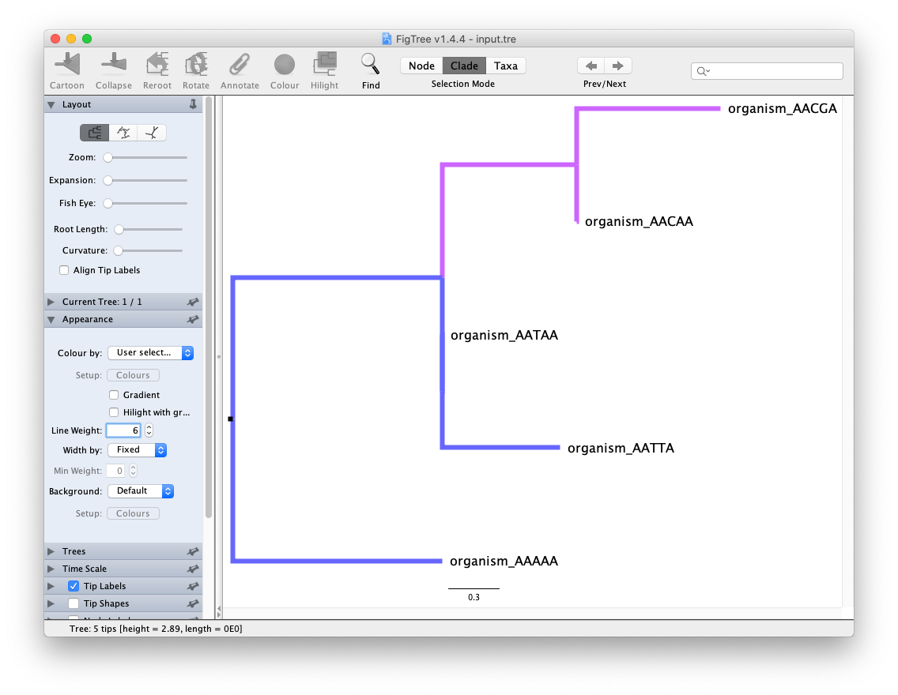

**Last Update:** 11 Jan 2021

# FastTree

A phylogenetic tree is a hypothesis of the evolutionary inheritance of genes across individual taxa. Trees have been used to summarize an organism's pedigree, infer viral host-spillover events ([Zhou et al., 2020](https://pubmed.ncbi.nlm.nih.gov/32015507/)), and determine if the red panda is a bear or a raccoon ([Slattery & O'Brien, 1995](https://pubmed.ncbi.nlm.nih.gov/8568209/))

There are a number of phylogenetic tree building programs including BEAST, MrBayes, PAUP, PhyML, RAxML, IQ-Tree, and FastTree. We are focusing on FastTree because it tends to be a faster tree building program to provide a quick draft tree. We recommend running FastTree to get a general sense of individuals in the tree, subsample down or add references taxa to create a well formed tree, and then move on to the other tree-building programs for more detailed diversity and time-scaled analysis.


## Software required

* [MAFFT](https://mafft.cbrc.jp/alignment/software/) - for aligning your sequences
* [FastTree](http://tree.bio.ed.ac.uk/software/figtree/) - for building a quick phylogenetic tree from aligned sequences
  ```
  curl -O http://www.microbesonline.org/fasttree/FastTree.c
  gcc -O3 -finline-functions -funroll-loops -Wall -o FastTree FastTree.c -lm
  ```
* [FigTree](http://tree.bio.ed.ac.uk/software/figtree/) - for viewing your phylogenetic tree

## Overview of the pipeline:

```
  sequences -> MAFFT -> FastTree -> FigTree -> pdf figure that can go into your manuscript
```

## Example Dataset

Let's start with an example fasta file where we have 5 sequences. 

* Organism AAAAA - hypothetical ancesteral organism of all A's
* Organism AACAA - single mutation in the middle to a C
* Organism AACGA - same C mutation but with a G mutation
* Organism AATAA - single mutation in the middle to a T
* Organism AATTA - same T mutation but wiht another T mutation

Copy the following and save it as a text file and rename it to `input.fasta`.

``` text
>organism_AAAAA
AAAAAAAAAAAAAAAAAAAAAAAAAAAAAAAAAAAAAAAAAAAAAAAA
>organism_AACAA
AAAAAAAAAAAAAAAAAAAAAAACAAAAAAAAAAAAAAAAAAAAAAAA
>organism_AACGA
AAAAAAAAAAAAAAAAAAAAAAACGAAAAAAAAAAAAAAAAAAAAAAA
>organism_AATAA
AAAAAAAAAAAAAAAAAAAAAAATAAAAAAAAAAAAAAAAAAAAAAAA
>organism_AATTA
AAAAAAAAAAAAAAAAAAAAAAATTAAAAAAAAAAAAAAAAAAAAAAA
```

## Step 1: MAFFT

<details><summary>See MAFFT Help Statment</summary>

``` bash
mafft --help
------------------------------------------------------------------------------
  MAFFT v7.453 (2019/Nov/8)
  https://mafft.cbrc.jp/alignment/software/
  MBE 30:772-780 (2013), NAR 30:3059-3066 (2002)
------------------------------------------------------------------------------
High speed:
  % mafft in > out
  % mafft --retree 1 in > out (fast)

High accuracy (for <~200 sequences x <~2,000 aa/nt):
  % mafft --maxiterate 1000 --localpair  in > out (% linsi in > out is also ok)
  % mafft --maxiterate 1000 --genafpair  in > out (% einsi in > out)
  % mafft --maxiterate 1000 --globalpair in > out (% ginsi in > out)

If unsure which option to use:
  % mafft --auto in > out

--op # :         Gap opening penalty, default: 1.53
--ep # :         Offset (works like gap extension penalty), default: 0.0
--maxiterate # : Maximum number of iterative refinement, default: 0
--clustalout :   Output: clustal format, default: fasta
--reorder :      Outorder: aligned, default: input order
--quiet :        Do not report progress
--thread # :     Number of threads (if unsure, --thread -1)
--dash :         Add structural information (Rozewicki et al, submitted)
```
</details>

For a quick nucleotide alignment, we can run the following with the automatically (`--auto`) detected parameters. We can save the alignment in a `input_aln.fasta` file. 

``` bash
mafft --auto input.fasta > input_aln.fasta
```

The `input_aln.fasta` should look like the following. We do not have gaps `-` since this data was mostly aligned already.

``` text
>organism_AAAAA
aaaaaaaaaaaaaaaaaaaaaaaaaaaaaaaaaaaaaaaaaaaaaaaa
>organism_AACAA
aaaaaaaaaaaaaaaaaaaaaaacaaaaaaaaaaaaaaaaaaaaaaaa
>organism_AACGA
aaaaaaaaaaaaaaaaaaaaaaacgaaaaaaaaaaaaaaaaaaaaaaa
>organism_AATAA
aaaaaaaaaaaaaaaaaaaaaaataaaaaaaaaaaaaaaaaaaaaaaa
>organism_AATTA
aaaaaaaaaaaaaaaaaaaaaaattaaaaaaaaaaaaaaaaaaaaaaa
```

## Step 2: FastTree

```
# For a nucleotide alignment
FastTree -nt -gtr -gamma input_aln.fasta > input.tre

# For a protein alignment
FastTree input_aln.fasta > input.tre
```

Since `input.fasta` was nucelotide, we will use the following FastTree command.

``` bash
FastTree -nt -gtr -gamma input_aln.fasta > input.tre
```

Looking at the `input.tre`, the organisms are grouped in a newick file format, and should look similar to the following:

``` text
(organism_AATAA:0.00077,organism_AATTA:0.69589,(organism_AAAAA:2.48515,(organism_AACAA:0.00077,organism_AACGA:0.85100)0.600:0.79602)0.160:0.00077);
```

For more information about the NEWICK Tree format:

* [Wikipedia - Newick](https://en.wikipedia.org/wiki/Newick_format)

## Step 3: FigTree

Open FigTree application and use `File/Open Tree` to select your `input.tre`. The tree is unrooted, so you we usually use midpoint (Ctrl-M) and sorted upward (Ctrl-U) as a reasonable guess for the root of the tree. If you are working with viruses or have dates, we set the root close to the earliest viral sequence.



Experiment visualization features in FigTree. Try out the visualization features on the left (expandable sections), select the Node/Clade/Taxa buttons on top, and see if you can color the branches by selecting and using the "Colour" pop-up menu.



After saving the tree, the `input.tre` is converted to NEXUS format. The original NEWICK tree is in the `begin trees;` section.

<details><summary>See NEXUS input.tre file</summary>

``` text

#NEXUS
begin taxa;
	dimensions ntax=5;
	taxlabels
	organism_AAAAA
	organism_AACAA
	organism_AACGA
	organism_AATAA
	organism_AATTA
;
end;

begin trees;
	tree tree_1 = [&R] (organism_AATAA[&!color=#6666ff]:7.7E-4,organism_AATTA[&!color=#6666ff]:0.69589,(organism_AAAAA[&!color=#6666ff]:2.48515,(organism_AACAA[&!color=#cc66ff]:7.7E-4,organism_AACGA[&!color=#cc66ff]:0.851)[&label=0.6,!rotate=true,!color=#cc66ff]:0.79602)[&label=0.16,!color=#6666ff]:7.7E-4);
end;

begin figtree;
	set appearance.backgroundColorAttribute="Default";
	set appearance.backgroundColour=#ffffff;
	set appearance.branchColorAttribute="User selection";
	set appearance.branchColorGradient=false;
	set appearance.branchLineWidth=6.0;
	set appearance.branchMinLineWidth=0.0;
	set appearance.branchWidthAttribute="Fixed";
	set appearance.foregroundColour=#000000;
	set appearance.hilightingGradient=false;
	set appearance.selectionColour=#2d3680;
	set branchLabels.colorAttribute="User selection";
	set branchLabels.displayAttribute="Branch times";
	set branchLabels.fontName="sansserif";
	set branchLabels.fontSize=8;
	set branchLabels.fontStyle=0;
	set branchLabels.isShown=false;
	set branchLabels.significantDigits=4;
	set layout.expansion=0;
	set layout.layoutType="RECTILINEAR";
	set layout.zoom=0;
	set legend.attribute="label";
	set legend.fontSize=10.0;
	set legend.isShown=false;
	set legend.significantDigits=4;
	set nodeBars.barWidth=4.0;
	set nodeBars.displayAttribute=null;
	set nodeBars.isShown=false;
	set nodeLabels.colorAttribute="User selection";
	set nodeLabels.displayAttribute="Node ages";
	set nodeLabels.fontName="sansserif";
	set nodeLabels.fontSize=8;
	set nodeLabels.fontStyle=0;
	set nodeLabels.isShown=false;
	set nodeLabels.significantDigits=4;
	set nodeShapeExternal.colourAttribute="User selection";
	set nodeShapeExternal.isShown=false;
	set nodeShapeExternal.minSize=10.0;
	set nodeShapeExternal.scaleType=Width;
	set nodeShapeExternal.shapeType=Circle;
	set nodeShapeExternal.size=4.0;
	set nodeShapeExternal.sizeAttribute="Fixed";
	set nodeShapeInternal.colourAttribute="User selection";
	set nodeShapeInternal.isShown=false;
	set nodeShapeInternal.minSize=10.0;
	set nodeShapeInternal.scaleType=Width;
	set nodeShapeInternal.shapeType=Circle;
	set nodeShapeInternal.size=4.0;
	set nodeShapeInternal.sizeAttribute="Fixed";
	set polarLayout.alignTipLabels=false;
	set polarLayout.angularRange=0;
	set polarLayout.rootAngle=0;
	set polarLayout.rootLength=100;
	set polarLayout.showRoot=true;
	set radialLayout.spread=0.0;
	set rectilinearLayout.alignTipLabels=false;
	set rectilinearLayout.curvature=0;
	set rectilinearLayout.rootLength=100;
	set scale.offsetAge=0.0;
	set scale.rootAge=1.0;
	set scale.scaleFactor=1.0;
	set scale.scaleRoot=false;
	set scaleAxis.automaticScale=true;
	set scaleAxis.fontSize=8.0;
	set scaleAxis.isShown=false;
	set scaleAxis.lineWidth=1.0;
	set scaleAxis.majorTicks=1.0;
	set scaleAxis.minorTicks=0.5;
	set scaleAxis.origin=0.0;
	set scaleAxis.reverseAxis=false;
	set scaleAxis.showGrid=true;
	set scaleBar.automaticScale=true;
	set scaleBar.fontSize=10.0;
	set scaleBar.isShown=true;
	set scaleBar.lineWidth=1.0;
	set scaleBar.scaleRange=0.0;
	set tipLabels.colorAttribute="User selection";
	set tipLabels.displayAttribute="Names";
	set tipLabels.fontName="sansserif";
	set tipLabels.fontSize=16;
	set tipLabels.fontStyle=0;
	set tipLabels.isShown=true;
	set tipLabels.significantDigits=4;
	set trees.order=true;
	set trees.orderType="increasing";
	set trees.rooting=true;
	set trees.rootingType="User Selection";
	set trees.transform=false;
	set trees.transformType="cladogram";
end;

```

</details>

For more information about the NEXUS file format:

* [Wikipedia - Nexus File](https://en.wikipedia.org/wiki/Nexus_file)

## Citations

* Katoh, K., Misawa, K., Kuma, K.I. and Miyata, T., 2002. [MAFFT: a novel method for rapid multiple sequence alignment based on fast Fourier transform](https://pubmed.ncbi.nlm.nih.gov/12136088). Nucleic acids research, 30(14), pp.3059-3066.
* Price, M.N., Dehal, P.S. and Arkin, A.P., 2009. [FastTree: computing large minimum evolution trees with profiles instead of a distance matrix](https://pubmed.ncbi.nlm.nih.gov/19377059). Molecular biology and evolution, 26(7), pp.1641-1650.
* Rambaut, A., 2007. [FigTree, a graphical viewer of phylogenetic trees.](http://tree.bio.ed.ac.uk/software/figtree/)

# In Summary

We have walked through:

1. aligning a nucelotide fasta file with **MAFFT**
2. generating a phylogenetic tree from that alignment with **FastTree** 
3. and visualizing a phylogenetic tree with **FigTree**. 

Next steps include changing the nucleotide fasta file (to see how it affects tree structure), changing alignment/tree building parameters, and exploring the visualization features in FigTree. Change the input file and see if you can develop an intuition for what the phylogenetic tree means.

We will be providing an example phylogenetic analysis of Human Influenza viruses (in development).


