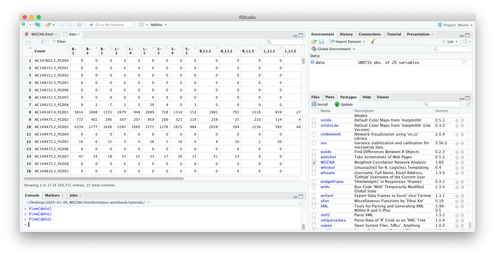

```{r setup, include=FALSE}
knitr::opts_chunk$set(
  echo = TRUE,
  collapse = TRUE,
  comment = "#>",
  fig.path = "Assets/wgcna_"
)
```

<!--
---
title: "WGCNA Gene Correlation Network Analysis"
layout: single
author: Jennifer Chang
author1: Siva Chudalayandi
author_profile: true
header:
  overlay_color: "444444"
  overlay_image: /assets/images/dna.jpg
---
-->

**Last Update**: 4 Jan 2021 <br/>
**R Markdown**: [WGCNA.Rmd](https://bioinformaticsworkbook.org/tutorials/WGCNA.Rmd)

# Network analysis with WGCNA

There are many gene correlation network builders but we shall provide an example of the WGCNA R Package. 

The **WGCNA R package** builds “weighted gene correlation networks for analysis” from expression data. 
It was originally published in 2008 and cited as the following:

  * Langfelder, P. and Horvath, S., 2008. [WGCNA: an R package for
    weighted correlation network
    analysis](https://bmcbioinformatics.biomedcentral.com/articles/10.1186/1471-2105-9-559).
    BMC bioinformatics, 9(1), p.559.
  * Zhang, B. and Horvath, S., 2005. [A general framework for weighted
    gene co-expression network
    analysis](https://pubmed.ncbi.nlm.nih.gov/16646834/). Statistical
    applications in genetics and molecular biology, 4(1).

**More information**

  * [Recent PubMed Papers](https://pubmed.ncbi.nlm.nih.gov/?term=wgcna&sort=date)
  * [Original WGCNA
    tutorials - Last updated 2016](https://horvath.genetics.ucla.edu/html/CoexpressionNetwork/Rpackages/WGCNA/Tutorials/)
  * [Video: ISCB Workshop 2016 - Co-expression network analysis using RNA-Seq data (Keith Hughitt)](https://youtu.be/OdqDE5EJSlA)

## Installing WGCNA

We will assume you have a working R environment. If not, please see the following tutorial:

* [Seting up an R and RStudio Environment](https://bioinformaticsworkbook.org/dataWrangling/R/r-setup.html)

Since WGCNA is an R package, we will need to start an R environment and install from R's package manager, CRAN.

```{r, eval=FALSE}
install.packages("WGCNA")   # WGCNA is available on CRAN
library(WGCNA)
```

## Overview ##

The **WGCNA** pipeline is expecting an input matrix of RNA Sequence counts. Usually we need to rotate (transpose) the input data so `rows` = `treatments` and `columns` = `gene probes`.


The output of **WGCNA** is a list of clustered genes, and weighted gene correlation network files.

# Example Dataset

We shall start with an example dataset about Maize and Ligule Development. [Add description of data and maybe link to paper here] For more information, please see the following paper:

* Johnston, R., Wang, M., Sun, Q., Sylvester, A.W., Hake, S. and Scanlon, M.J., 2014. [Transcriptomic analyses indicate that maize ligule development recapitulates gene expression patterns that occur during lateral organ initiation](https://pubmed.ncbi.nlm.nih.gov/25516601/). The Plant Cell, 26(12), pp.4718-4732.

While the wt and lg1 were from the area marked in purple in plants that exhibited either wt or no ligule (liguleless phenotype)… so this encompasses the entire pre-ligule, pre-blade and pre-sheath area.

* [Download Dataset](https://www.ncbi.nlm.nih.gov/geo/query/acc.cgi?acc=GSE61333)

```{bash, eval=FALSE}
wget ftp://ftp.ncbi.nlm.nih.gov/geo/series/GSE61nnn/GSE61333/suppl/GSE61333_ligule_count.txt.gz
gunzip GSE61333_ligule_count.txt.gz

ls -ltr *.txt
#> -rw-r--r--  1 username  staff   7.5M Jan  4 09:48 GSE61333_ligule_count.txt
```

## Load R Libraries 

This analysis requires the following R libraries. You might need to install the library if it's not already on your system.

We're going to conform to the [tidyverse]() ecosystem. For a discussion on its benefits see  ["Welcome to the Tidyverse" (Wickham et al, 2019)](https://tidyverse.tidyverse.org/articles/paper.html). This allows us to organize the pipeline in the following framework ([Fig. from "R for Data Science" (Wickham and Grolemund, 2017)](https://r4ds.had.co.nz/)):


```{r, warning=FALSE, message=FALSE}
# Uncomment and modify the following to install any missing packages
# install.packages(c("tidyverse", "magrittr", "WGCNA))
library(tidyverse)     # tidyverse will pull in ggplot2, readr, other useful libraries
library(magrittr)      # provides the %>% operator
library(WGCNA)        
```

## Tidy the Dataset, and using exploratory graphics

Load and look at the data

```{r}
# ==== Load and clean data
data <- readr::read_delim("data/GSE61333_ligule_count.txt",     # <= path to the data file
                          delim = "\t")

data[1:5,1:10]        # Look at first 5 rows and 10 columns

# str(data)           # str = structure of data, useful for debugging data type mismatch errors

names(data)[1] = "GeneId"
names(data)           # Look at the column names
```

If you are in RStudio, you can also click on the `data` object in the Environment tab to see an Excel-like view of the data.



From looking at the data, we can come to the following insights:

* We see that `rows` = `gene probes` which probably means `columns` = `treatments` which is the opposite of what's needed in WGCNA (`rows` = `treatment`, `columns` = `gene probes`). This dataset will need to be rotated (transposed) before sending to WGCNA.
* This is also wide data, we will convert this to tidy data before visualization. For [Hadley Wickham](http://hadley.nz/)'s tutorial on the what and why to convert to tidy data, see [https://r4ds.had.co.nz/tidy-data.html](https://r4ds.had.co.nz/tidy-data.html).
* The column names are prefixed with the treatment group (e.g. `B-3`, `B-4`, and `B-5` are three replicates of the treatment "B").

* **CSiva** please add a table describing treatments here mean here. `e.g. B=?, S=?, L=?`

The following R commands clean and tidy the dataset for exploratory graphics.

```{r}
col_sel = names(data)[-1]                                  # Get all but first column name
mdata <- data %>% 
  tidyr::pivot_longer( 
    .,                                                     # The dot is the the input data, magrittr tutorial
    col = all_of(col_sel)
    ) %>%  
  mutate(
    group = gsub("-.*","", name) %>% gsub("[.].*","", .)   # Get the shorter treatment names 
  )

# This sets the order of the hours in the plot... otherwise 48mk will be between "3" and "6".
# mdata$group = factor(mdata$group,
#                     levels = c("0", "3", "6", "12", "24","36","48","48mk"))
```

Think through what kinds of plots may tell you something about the dataset. Below, we have provided an example plot to identify any obvious outliers.

```{r group_by_hour, fig.width=8, fig.height=4}
# ==== Plot groups (Sample Groups vs RNA Seq Counts) to identify outliers
p <- mdata %>%
    ggplot(., aes(x = name, y = value)) +             # x = treatment, y = RNA Seq count
    geom_violin() +                                   # violin plot, show distribution
    geom_point(alpha = 0.2) +                         # scatter plot
    theme_bw() +
    theme(
      axis.text.x = element_text(angle = 90)          # Rotate treatment text
    ) +
    labs(x = "Treatment Groups", y = "RNA Seq Counts") +
    facet_grid(cols = vars(group), drop = TRUE, scales = "free_x")      # Facet by hour
```

<!--
> From here, we can see there's something strange in some of the hour 24 samples. One has very high RNASeq values `24II_S15_L006` with maybe a wide range, while another has very low range of RNASeq values `24_S15_L007`. We should follow up with the wet lab folks on an explanation of those samples, but for now, we'll remove the 24 hour group and maybe the 48 hour group.
> 
> ```{r}
> #keep_cols = names(data) %>% grep("24", .,  invert = T, value = T) %>% grep("48I+_", ., invert=T, value=T)
> #cdata = data %>% select(all_of(keep_cols))
> 
> #temp <- data[rowSums(data[,-1]) > 0.1, ]      # Remove genes with all 0 values
> #row_var <- apply(temp[,-1], 1, var)           # Remove genes with variance below 100
> #cdata <- temp[row_var > 1, ]
> #cdata[1:5, 1:10]
> ```
> 
> You can look at the `cdata` object (click on item in `environment` or use `names(cdata)`) to convince yourself that the "24 hour" group is gone. The original dataset had 46,430 genes (too many to explore), subsetting by variance and other strange artifacts reduced it down to 25,088 genes. Let's continue and determine the correlation networks for these 25,088 genes.
-->

## Normalize Counts with DESeq

We'll use DESeq to normalize the counts before sending to WGCNA. Optionally you could subset to only genes that are differentially expressed between groups. (The smaller the number of genes, the faster WGCNA will run. Although there is some online discussion if this breaks the scale-free network assumption.)

```{r, warning=F, message=F}
library(DESeq2)
```

Prepare DESeq input, which is expecting a matrix of integers.

```{r}
de_input = as.matrix(data[,-1])
row.names(de_input) = data$GeneId
de_input[1:5,1:10]
#str(de_input)

meta_df <- data.frame( Sample = names(data[-1])) %>% 
  mutate(
    Type = gsub("-.*","", Sample) %>% gsub("[.].*","", .)
  )

dds <- DESeqDataSetFromMatrix(round(de_input),
                              meta_df,
                              design = ~Type)

dds <- DESeq(dds)
vsd <- varianceStabilizingTransformation(dds)
library(genefilter)      # <= why is this here?
wpn_vsd <- getVarianceStabilizedData(dds)
rv_wpn <- rowVars(wpn_vsd)
summary(rv_wpn)

q75_wpn <- quantile( rowVars(wpn_vsd), .75)  # <= original
q95_wpn <- quantile( rowVars(wpn_vsd), .95)  # <= increased to reduce dataset
expr_normalized <- wpn_vsd[ rv_wpn > q95_wpn, ]

expr_normalized[1:5,1:10]
dim(expr_normalized)

expr_normalized_df <- data.frame(expr_normalized) %>%
  mutate(
    Gene_id = row.names(expr_normalized)
  ) %>%
  pivot_longer(-Gene_id)

expr_normalized_df %>% ggplot(., aes(x = name, y = value)) +
  geom_violin() +
  geom_point() +
  theme_bw() +
  theme(
    axis.text.x = element_text( angle = 90)
  ) +
  ylim(0, NA) +
  labs(
    title = "Normalized and 95 quantile Expression",
    x = "treatment",
    y = "normalized expression"
  )
```

## WGCNA

Now let's transpose the data and prepare the dataset for WGCNA.

```{r}
input_mat = t(expr_normalized)

input_mat[1:5,1:10]           # Look at first 5 rows and 10 columns
```

We can see now that the `rows` = `treatments` and `columns` = `gene probes`. We're ready to start WGCNA. A correlation network will be a complete network (all genes are connected to all other genes). Ergo we will need to pick a threshhold value (if correlation is below threshold, remove the edge). We assume the true biological network follows a scale-free structure (see papers by [Albert Barabasi](https://en.wikipedia.org/wiki/Barab%C3%A1si%E2%80%93Albert_model)). 

To do that, WGCNA will try a range of soft thresholds and create a diagnostic plot. This step will take several minutes so feel free to run and get coffee.

```{r soft_threshold, fig.width=8, fig.height=4}
#library(WGCNA)
allowWGCNAThreads()          # allow multi-threading (optional)

# Choose a set of soft-thresholding powers
powers = c(c(1:10), seq(from = 12, to = 20, by = 2))

# Call the network topology analysis function
sft = pickSoftThreshold(
  input_mat,             # <= Input data
  #blockSize = 30,
  powerVector = powers,
  verbose = 5
  )

par(mfrow = c(1,2));
cex1 = 0.9;

plot(sft$fitIndices[, 1],
     -sign(sft$fitIndices[, 3]) * sft$fitIndices[, 2],
     xlab = "Soft Threshold (power)", 
     ylab = "Scale Free Topology Model Fit, signed R^2",
     main = paste("Scale independence")
)
text(sft$fitIndices[, 1], 
     -sign(sft$fitIndices[, 3]) * sft$fitIndices[, 2],
     labels = powers, cex = cex1, col = "red"
)
abline(h = 0.90, col = "red")
plot(sft$fitIndices[, 1],
     sft$fitIndices[, 5],
     xlab = "Soft Threshold (power)",
     ylab = "Mean Connectivity", type = "n", main = paste("Mean connectivity")
)
text(sft$fitIndices[, 1], 
     sft$fitIndices[, 5], 
     labels = powers, 
     cex = cex1, col = "red")
```

Pick a soft threshold power near the curve of the plot, so here we could pick 9 or 10. We'll pick 10 but feel free to experiment with other powers to see how it affects your results. Now we can create the network using the `blockwiseModules` command. The `blockwiseModule` will take a long time to run, since it is constructing the TOM (topological overlap matrix) and several other steps. While it runs, take a look at the `blockwiseModule` documentation (link to [vignette](https://www.rdocumentation.org/packages/WGCNA/versions/1.69/topics/blockwiseModules)) for more information on the parameters. How might you change the parameters to get more or less modules?

```{r}
picked_power = 9
temp_cor <- cor       
cor <- WGCNA::cor         # Force it to use WGCNA cor function (fix a namespace conflict issue)
netwk <- blockwiseModules(input_mat,                # <= input here
                          
                          # == Adjacency Function ==
                          power = picked_power,                # <= power here
                          networkType = "signed",
                          
                          # == Tree and Block Options ==
                          deepSplit = 2,
                          pamRespectsDendro = F,
                          # detectCutHeight = 0.75,
                          minModuleSize = 30,
                          maxBlockSize = 4000,
                          
                          # == Module Adjustments ==
                          reassignThreshold = 0, 
                          mergeCutHeight = 0.25, 
                          
                          # == TOM == Archive the run results in TOM file (saves time)
                          saveTOMs = T, 
                          saveTOMFileBase = "ER",
                          
                          # == Output Options
                          numericLabels = T,
                          verbose = 3)

cor <- temp_cor     # Return cor function to original namespace
```


Let's take a look at the modules, there

```{r dendro, fig.width=8, fig.height=4}
# Convert labels to colors for plotting
mergedColors = labels2colors(netwk$colors)
# Plot the dendrogram and the module colors underneath
plotDendroAndColors(
  netwk$dendrograms[[1]], 
  mergedColors[netwk$blockGenes[[1]]],
  "Module colors",
  dendroLabels = FALSE, hang = 0.03,
  addGuide = TRUE, guideHang = 0.05)
#                    netwk$colors[netwk$blockGenes[[1]]]
#table(netwk$colors)
```

# Module (cluster) assignments

We can pull out the list of modules

```{r}
module_df <- data.frame(
  gene_id = names(netwk$colors),
  colors = labels2colors(netwk$colors)
)

module_df[1:5,]
```

However we need to figure out which modules are associated with each trait/treatment group. WGCNA will calcuate an Eigangene (hypothetical central gene) for each module, so it easier to determine if modules are associated with different treatments.

```{r module_trait, fig.width=7, fig.height=8}
# Get Module Eigengenes per cluster
MEs0 <- moduleEigengenes(input_mat, mergedColors)$eigengenes

# Reorder modules so similar modules are next to each other
MEs0 <- orderMEs(MEs0)
module_order = names(MEs0) %>% gsub("ME","", .)

# Add treatment names
MEs0$treatment = row.names(MEs0)

# tidy & plot data
mME = MEs0 %>%
  pivot_longer(-treatment) %>%
  mutate(
    name = gsub("ME", "", name),
    name = factor(name, levels = module_order) 
  )

mME %>% ggplot(., aes(x=treatment, y=name, fill=value)) +
  geom_tile() +
  theme_bw() + 
  scale_fill_gradient2(
    low = "blue", 
    high = "red", 
    mid = "white", 
    midpoint = 0, 
    limit = c(-1,1)) +
  theme(axis.text.x = element_text(angle=90)) +
  labs(title = "Module-trait Relationships", y = "Modules", fill="corr")
```

Looking at the heatmap, `Green` is positively associated with the `L` groups, `turquoise` module is positive for the `L` but negative for the `L_L1` groups, `tan` module is positive in the `S` groups but negative elsewhere. There are other patterns **CSiva** feel free to add comments.
# Examine Expression Profiles

We'll pick out a few modules of interest, and plot their expression profiles

```{r mod_profile, fig.width=7, fig.height=5}
# pick out a few modules of interest here
modules_of_interest = c("green", "turquoise", "tan")

# Pull out list of genes in that module
submod = module_df %>%
  subset(colors %in% modules_of_interest)

row.names(module_df) = module_df$gene_id

# Get normalized expression for those genes
expr_normalized[1:5,1:10]
subexpr = expr_normalized[submod$gene_id,]

submod_df = data.frame(subexpr) %>%
  mutate(
    gene_id = row.names(.)
  ) %>%
  pivot_longer(-gene_id) %>%
  mutate(
    module = module_df[gene_id,]$colors
  )

submod_df %>% ggplot(., aes(x=name, y=value, group=gene_id)) +
  geom_line(aes(color=module), alpha=0.2) +
  theme_bw() +
  theme(
    axis.text.x = element_text(angle = 90)
  ) +
  facet_grid(rows = vars(module)) +
  labs(x = "treatment",
       y = "normalized expression")
```

`Green` module genes are higher in the `L` groups. `Tan` genes seem higher in the `S` groups, and `Turquoise` genes are low at `L_L1` and `S_L1` and maybe `B_L1` groups.

# Generate and Export Network 

The network file can be generated for Cytoscape or as an edge/vertices file.

```{r}
genes_of_interest = module_df %>%
  subset(colors %in% modules_of_interest)

expr_of_interest = expr_normalized[genes_of_interest$gene_id,]
expr_of_interest[1:5,1:5]

# Only recalculate TOM for modules of interest (faster, altho there's some online discussion if this will be slightly off)
TOM = TOMsimilarityFromExpr(t(expr_of_interest),
                            power = picked_power)

# Add gene names to row and columns
row.names(TOM) = row.names(expr_of_interest)
colnames(TOM) = row.names(expr_of_interest)

edge_list = data.frame(TOM) %>%
  mutate(
    gene1 = row.names(.)
  ) %>%
  pivot_longer(-gene1) %>%
  dplyr::rename(gene2 = name, correlation = value) %>%
  unique() %>%
  subset(!(gene1==gene2)) %>%
  mutate(
    module1 = module_df[gene1,]$colors,
    module2 = module_df[gene2,]$colors
  )

head(edge_list)

# Export Network file to be read into Cytoscape, VisANT, etc
write_delim(edge_list, 
            file = "edgelist.tsv",
            delim = "\t")
```

The `edgelist.txt` exported is the complete correlation network for modules `green`, `tan`, and `turquoise`. The network still needs to be subsetted down (by weight or minimal spanning) to identify hub genes. Steps forward include identifying hub genes and gene ontology enrichment. The edgelist can be loaded into igraph (R package) or Cytoscape (standalone Java Application) for further network analysis.