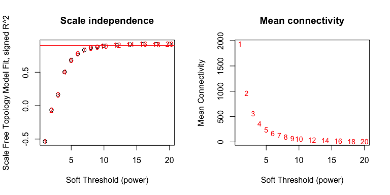
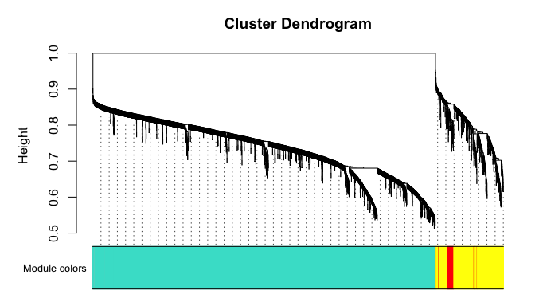
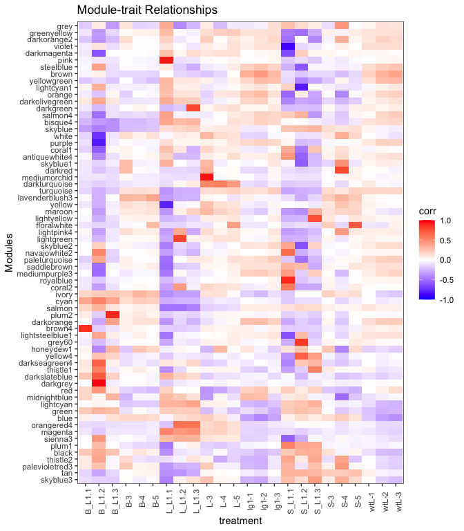

**Last Update**: 22 Dec 2020 <br/> **R Markdown**:
[WGCNA.Rmd](https://bioinformaticsworkbook.org/tutorials/WGCNA.Rmd)

# Network analysis with WGCNA

There are many gene correlation network builders but we shall provide an
example of the WGCNA R Package.

The **WGCNA R package** builds “weighted gene correlation networks for
analysis” from expression data. It was originally published in 2008 and
cited as the following:

-   Langfelder, P. and Horvath, S., 2008. [WGCNA: an R package for
    weighted correlation network
    analysis](https://bmcbioinformatics.biomedcentral.com/articles/10.1186/1471-2105-9-559).
    BMC bioinformatics, 9(1), p.559.
-   Zhang, B. and Horvath, S., 2005. [A general framework for weighted
    gene co-expression network
    analysis](https://pubmed.ncbi.nlm.nih.gov/16646834/). Statistical
    applications in genetics and molecular biology, 4(1).

**More information**

-   [Recent PubMed
    Papers](https://pubmed.ncbi.nlm.nih.gov/?term=wgcna&sort=date)
-   [Original WGCNA tutorials - Last updated
    2016](https://horvath.genetics.ucla.edu/html/CoexpressionNetwork/Rpackages/WGCNA/Tutorials/)
-   [Video: ISCB Workshop 2016 - Co-expression network analysis using
    RNA-Seq data (Keith Hughitt)](https://youtu.be/OdqDE5EJSlA)

## Installing WGCNA

We will assume you have a working R environment. If not, please see the
following tutorial:

-   [Seting up an R and RStudio
    Environment](https://bioinformaticsworkbook.org/dataWrangling/R/r-setup.html)

Since WGCNA is an R package, we will need to start an R environment and
install from R’s package manager, CRAN.

``` r
install.packages("WGCNA")   # WGCNA is available on CRAN
library(WGCNA)
```

## Overview

The **WGCNA** pipeline is expecting an input matrix of RNA Sequence
counts. Usually we need to rotate (transpose) the input data so `rows` =
`treatments` and `columns` = `gene probes`.


The output of **WGCNA** is a list of clustered genes, and weighted gene
correlation network files.

# Example Dataset

We shall start with an example dataset about ER (Endocrine Reticulum)
cell death response. \[Add description of data and maybe link to paper
here\]

-   [All\_Counts\_ER.txt](data/All_Counts_ER.txt)

``` bash
wget https://bioinformaticsworkbook.org/tutorials/data/All_Counts_ER.txt
```

## Load R Libraries

This analysis requires the following R libraries. You might need to
install the library if it’s not already on your system.

We’re going to conform to the [tidyverse]() ecosystem. For a discussion
on its benefits see [“Welcome to the Tidyverse” (Wickham et al,
2019)](https://tidyverse.tidyverse.org/articles/paper.html). This allows
us to organize the pipeline in the following framework ([Fig. from “R
for Data Science” (Wickham and Grolemund,
2017)](https://r4ds.had.co.nz/)):


``` r
# Uncomment and modify the following to install any missing packages
# install.packages(c("tidyverse", "magrittr", "WGCNA))
library(tidyverse)     # tidyverse will pull in ggplot2, readr, other useful libraries
library(magrittr)      # provides the %>% operator
library(WGCNA)        
```

## Tidy the Dataset, and using exploratory graphics

Load and look at the data

``` r
# ==== Load and clean data
data <- readr::read_delim("data/All_Counts_ER.txt", delim="\t")
#>
#> ── Column specification ────────────────────────────────────────────────────────
#> cols(
#>   .default = col_double(),
#>   Geneid = col_character()
#> )
#> ℹ Use `spec()` for the full column specifications.

data[1:5,1:10]        # Look at first 5 rows and 10 columns
#> # A tibble: 5 x 10
#>   Geneid `0I_S3_L006` `0I_S3_L007` `0II_S11_L006` `0II_S11_L007` `0III_S19_L006`
#>   <chr>         <dbl>        <dbl>          <dbl>          <dbl>           <dbl>
#> 1 Zm000…          103          135             98            103             187
#> 2 Zm000…         1280         1370            876            970            1602
#> 3 Zm000…            0            2              0              0               0
#> 4 Zm000…            0            6              3              2              18
#> 5 Zm000…            0            0              0              0               0
#> # … with 4 more variables: `0III_S19_L007` <dbl>, `3I_S4_L006` <dbl>,
#> #   `3I_S4_L007` <dbl>, `3II_S12_L006` <dbl>

# str(data)           # str = structure of data, useful for debugging data type mismatch errors

names(data)           # Look at the column names
#>  [1] "Geneid"           "0I_S3_L006"       "0I_S3_L007"       "0II_S11_L006"    
#>  [5] "0II_S11_L007"     "0III_S19_L006"    "0III_S19_L007"    "3I_S4_L006"      
#>  [9] "3I_S4_L007"       "3II_S12_L006"     "3II_S12_L007"     "3III_S20_L006"   
#> [13] "3III_S20_L007"    "6I_S5_L006"       "6I_S5_L007"       "6II_S13_L006"    
#> [17] "6II_S13_L007"     "6III_S21_L006"    "6III_S21_L007"    "12I_S6_L006"     
#> [21] "12I_S6_L007"      "12II_S14_L006"    "12II_S14_L007"    "12III_S22_L006"  
#> [25] "12III_S22_L007"   "24I_S7_L006"      "24I_S7_L007"      "24II_S15_L006"   
#> [29] "24II_S15_L007"    "24III_S23_L006"   "24III_S23_L007"   "36I_S8_L006"     
#> [33] "36I_S8_L007"      "36II_S16_L006"    "36II_S16_L007"    "36III_S24_L006"  
#> [37] "36III_S24_L007"   "48I_S9_L006"      "48I_S9_L007"      "48II_S17_L006"   
#> [41] "48II_S17_L007"    "48III_S25_L006"   "48III_S25_L007"   "48mkI_S27_L007"  
#> [45] "48Imk_S10_L006"   "48mkII_S28_L007"  "48IImk_S18_L006"  "48mkIII_S29_L007"
#> [49] "48IIImk_S26_L006"
```

If you are in RStudio, you can also click on the `data` object in the
Environment tab to see an Excel-like view of the data.


From looking at the data, we can come to the following insights:

-   We see that `rows` = `gene probes` which probably means `columns` =
    `treatments` which is the opposite of what’s needed in WGCNA (`rows`
    = `treatment`, `columns` = `gene probes`). This dataset will need to
    be rotated (transposed) before sending to WGCNA.
-   This is also wide data, we will convert this to tidy data before
    visualization. For [Hadley Wickham](http://hadley.nz/)’s tutorial on
    the what and why to convert to tidy data, see
    <https://r4ds.had.co.nz/tidy-data.html>.
-   The column names are prefixed with the hour of treatment
    (e.g. `0I_S3_L006` is 0 hours, `3I_S4_L006` is 3 hours,
    `48mkII_S28_L007` is 48 hours mock.)

The following R commands clean and tidy the dataset for exploratory
graphics.

``` r
col_sel = names(data)[-1]                                  # Get all but first column name
mdata <- tidyr::pivot_longer( data,                        # Convert to Tidy Data
                              col = all_of(col_sel)
                             ) %>%  
  mutate(
    group = gsub("I.*", "", name) %>% gsub("_.*", "", .),  # Add a "Group" column for the hour
  )

mdata$group[grepl("mk", mdata$name)] = "48mk"              # Deal with columns where it's 48mk or 48IIImk,

# This sets the order of the hours in the plot... otherwise 48mk will be between "3" and "6".
mdata$group = factor(mdata$group,
                     levels = c("0", "3", "6", "12", "24","36","48","48mk"))
```

Think through what kinds of plots may tell you something about the
dataset. This example plots the data to identify any outliers.

``` r
# ==== Plot groups (Sample Groups vs RNA Seq Counts) to identify outliers
p <- mdata %>%
    ggplot(., aes(x=name, y=value)) +     # x = treatment, y = RNA Seq count
    geom_violin() +                       # violin plot, show distribution
    geom_point(alpha=0.2) +               # scatter plot
    theme_bw() +
    theme(
      axis.text.x = element_text(angle=90)                          # Rotate treatment text
    ) +
    facet_grid(cols = vars(group), drop=TRUE, scales="free_x")      # Facet by hour

p + labs(x="Treatment Groups", y = "RNA Seq Counts")
```

<!-- -->

From here, we can see there’s something strange in some of the hour 24
samples. One has very high RNASeq values `24II_S15_L006` with maybe a
wide range, while another has very low range of RNASeq values
`24_S15_L007`. We should follow up with the wet lab folks on an
explanation of those samples, but for now, we’ll remove the 24 hour
group and maybe the 48 hour group.

``` r
keep_cols = names(data) %>% grep("24", .,  invert = T, value = T) %>% grep("48I+_", ., invert=T, value=T)
cdata = data %>% select(all_of(keep_cols))

temp <- cdata[rowSums(cdata[,-1]) > 0.1, ]      # Remove genes with all 0 values
row_var <- apply(temp[,-1], 1, var)             # Remove genes with variance below 100
cdata <- temp[row_var > 1, ]
#cdata[1:5, 1:10]
```

You can look at the `cdata` object (click on item in `environment` or
use `names(cdata)`) to convince yourself that the “24 hour” group is
gone. The original dataset had 46,430 genes (too many to explore),
subsetting by variance and other strange artifacts reduced it down to
25,088 genes. Let’s continue and determine the correlation networks for
these 25,088 genes.

## WGCNA

Now let’s transpose the data and prepare the dataset for WGCNA.

``` r
input_mat = t(as.matrix(cdata[,-1]))
colnames(input_mat) = cdata$Geneid

input_mat[1:5,1:10]           # Look at first 5 rows and 10 columns
#>               Zm00001d027230 Zm00001d027231 Zm00001d027232 Zm00001d027233
#> 0I_S3_L006               103           1280              0              0
#> 0I_S3_L007               135           1370              2              6
#> 0II_S11_L006              98            876              0              3
#> 0II_S11_L007             103            970              0              2
#> 0III_S19_L006            187           1602              0             18
#>               Zm00001d027236 Zm00001d027239 Zm00001d027242 Zm00001d027244
#> 0I_S3_L006                 6            562            432              0
#> 0I_S3_L007                25            411            548              0
#> 0II_S11_L006               3            434            337              0
#> 0II_S11_L007              28            351            404              0
#> 0III_S19_L006              6           1999           1770              0
#>               Zm00001d027248 Zm00001d027250
#> 0I_S3_L006                 8              4
#> 0I_S3_L007                27             18
#> 0II_S11_L006              16              4
#> 0II_S11_L007               3              9
#> 0III_S19_L006             98              2
```

We can see now that the `rows` = `treatments` and `columns` =
`gene probes`. We’re ready to start WGCNA. A correlation network will be
a complete network (all genes are connected to all other genes). Ergo we
will need to pick a threshhold value (if correlation is below threshold,
remove the edge). We assume the true biological network follows a
scale-free structure (see papers by [Albert
Barabasi](https://en.wikipedia.org/wiki/Barab%C3%A1si%E2%80%93Albert_model)).

To do that, WGCNA will try a range of soft thresholds and create a
diagnostic plot. This step will take several minutes so feel free to run
and get coffee.

``` r
#library(WGCNA)
allowWGCNAThreads()          # allow multi-threading (optional)
#> Allowing multi-threading with up to 4 threads.

# Choose a set of soft-thresholding powers
powers = c(c(1:10), seq(from = 12, to=20, by=2))

# Call the network topology analysis function
sft = pickSoftThreshold(input_mat,             # <= Input data
                        #blockSize = 30,
                        powerVector = powers,
                        verbose = 5
                        )
#> pickSoftThreshold: will use block size 1415.
#>  pickSoftThreshold: calculating connectivity for given powers...
#>    ..working on genes 1 through 1415 of 31600
#>    ..working on genes 1416 through 2830 of 31600
#>    ..working on genes 2831 through 4245 of 31600
#>    ..working on genes 4246 through 5660 of 31600
#>    ..working on genes 5661 through 7075 of 31600
#>    ..working on genes 7076 through 8490 of 31600
#>    ..working on genes 8491 through 9905 of 31600
#>    ..working on genes 9906 through 11320 of 31600
#>    ..working on genes 11321 through 12735 of 31600
#>    ..working on genes 12736 through 14150 of 31600
#>    ..working on genes 14151 through 15565 of 31600
#>    ..working on genes 15566 through 16980 of 31600
#>    ..working on genes 16981 through 18395 of 31600
#>    ..working on genes 18396 through 19810 of 31600
#>    ..working on genes 19811 through 21225 of 31600
#>    ..working on genes 21226 through 22640 of 31600
#>    ..working on genes 22641 through 24055 of 31600
#>    ..working on genes 24056 through 25470 of 31600
#>    ..working on genes 25471 through 26885 of 31600
#>    ..working on genes 26886 through 28300 of 31600
#>    ..working on genes 28301 through 29715 of 31600
#>    ..working on genes 29716 through 31130 of 31600
#>    ..working on genes 31131 through 31600 of 31600
#>    Power SFT.R.sq   slope truncated.R.sq mean.k. median.k. max.k.
#> 1      1   0.8330  1.0600          0.923   15600     17500  21800
#> 2      2   0.2490  0.2150          0.702    9970     11300  17100
#> 3      3   0.0507 -0.0861          0.179    7090      7770  14100
#> 4      4   0.3070 -0.2590          0.191    5340      5540  12000
#> 5      5   0.4420 -0.3860          0.285    4180      4040  10500
#> 6      6   0.5040 -0.4850          0.370    3360      3010   9230
#> 7      7   0.5390 -0.5670          0.435    2760      2280   8220
#> 8      8   0.5670 -0.6330          0.497    2300      1750   7370
#> 9      9   0.5860 -0.6890          0.543    1940      1360   6660
#> 10    10   0.5920 -0.7490          0.575    1660      1070   6060
#> 11    12   0.6120 -0.8400          0.638    1240       670   5090
#> 12    14   0.6100 -0.9340          0.672     955       435   4340
#> 13    16   0.6200 -1.0000          0.712     750       290   3740
#> 14    18   0.6350 -1.0500          0.749     600       197   3250
#> 15    20   0.6530 -1.1000          0.782     487       144   2840

par(mfrow = c(1,2));
cex1 = 0.9;

plot(sft$fitIndices[, 1],
     -sign(sft$fitIndices[, 3]) * sft$fitIndices[, 2],
     xlab = "Soft Threshold (power)",
     ylab = "Scale Free Topology Model Fit, signed R^2",
     main = paste("Scale independence")
)
text(sft$fitIndices[, 1],
     -sign(sft$fitIndices[, 3]) * sft$fitIndices[, 2],
     labels = powers, cex = cex1, col = "red"
)
abline(h = 0.90, col = "red")
plot(sft$fitIndices[, 1],
     sft$fitIndices[, 5],
     xlab = "Soft Threshold (power)",
     ylab = "Mean Connectivity", type = "n", main = paste("Mean connectivity")
)
text(sft$fitIndices[, 1],
     sft$fitIndices[, 5],
     labels = powers,
     cex = cex1, col = "red")
```

<!-- -->

Pick a soft threshold power near the curve of the plot, so here we could
pick 9 or 10. We’ll pick 9 but feel free to experiment with other powers
to see how it affects your results. Now we can create the network using
the `blockwiseModules` command. See the
[vignette](https://www.rdocumentation.org/packages/WGCNA/versions/1.69/topics/blockwiseModules)
for more information on the parameters.

``` r
netwk <- blockwiseModules(input_mat,                # <= input here
                          power = 9,                # <= power here
                          #minModuleSize = 30,
                          #reassignThreshold = 0,
                          #mergeCutHeight = 0.25,
                          numericLabels = T,
                          pamRespectsDendro = F,
                          saveTOMs = T,
                          saveTOMFileBase = "ER",
                          verbose = 3,
                          #maxBlockSize = 40000,
                          deepSplit = 2,
                          #detectCutHeight = 0.5,
                          networkType = "signed")
#>  Calculating module eigengenes block-wise from all genes
#>    Flagging genes and samples with too many missing values...
#>     ..step 1
#>  ....pre-clustering genes to determine blocks..
#>    Projective K-means:
#>    ..k-means clustering..
#>    ..merging smaller clusters...
#> Block sizes:
#> gBlocks
#>    1    2    3    4    5    6    7
#> 5000 5000 4999 4998 4995 4978 1630
#>  ..Working on block 1 .
#>     TOM calculation: adjacency..
#>     ..will use 4 parallel threads.
#>      Fraction of slow calculations: 0.000000
#>     ..connectivity..
#>     ..matrix multiplication (system BLAS)..
#>     ..normalization..
#>     ..done.
#>    ..saving TOM for block 1 into file ER-block.1.RData
#>  ....clustering..
#>  ....detecting modules..
#>  ....calculating module eigengenes..
#>  ....checking kME in modules..
#>      ..removing 2 genes from module 2 because their KME is too low.
#>  ..Working on block 2 .
#>     TOM calculation: adjacency..
#>     ..will use 4 parallel threads.
#>      Fraction of slow calculations: 0.000000
#>     ..connectivity..
#>     ..matrix multiplication (system BLAS)..
#>     ..normalization..
#>     ..done.
#>    ..saving TOM for block 2 into file ER-block.2.RData
#>  ....clustering..
#>  ....detecting modules..
#>  ....calculating module eigengenes..
#>  ....checking kME in modules..
#>      ..removing 5 genes from module 1 because their KME is too low.
#>      ..removing 3 genes from module 2 because their KME is too low.
#>      ..removing 2 genes from module 4 because their KME is too low.
#>      ..removing 1 genes from module 6 because their KME is too low.
#>      ..removing 1 genes from module 7 because their KME is too low.
#>  ..Working on block 3 .
#>     TOM calculation: adjacency..
#>     ..will use 4 parallel threads.
#>      Fraction of slow calculations: 0.000000
#>     ..connectivity..
#>     ..matrix multiplication (system BLAS)..
#>     ..normalization..
#>     ..done.
#>    ..saving TOM for block 3 into file ER-block.3.RData
#>  ....clustering..
#>  ....detecting modules..
#>  ....calculating module eigengenes..
#>  ....checking kME in modules..
#>      ..removing 1 genes from module 1 because their KME is too low.
#>  ..Working on block 4 .
#>     TOM calculation: adjacency..
#>     ..will use 4 parallel threads.
#>      Fraction of slow calculations: 0.000000
#>     ..connectivity..
#>     ..matrix multiplication (system BLAS)..
#>     ..normalization..
#>     ..done.
#>    ..saving TOM for block 4 into file ER-block.4.RData
#>  ....clustering..
#>  ....detecting modules..
#>  ....calculating module eigengenes..
#>  ....checking kME in modules..
#>      ..removing 276 genes from module 1 because their KME is too low.
#>      ..removing 26 genes from module 2 because their KME is too low.
#>      ..removing 17 genes from module 3 because their KME is too low.
#>      ..removing 1 genes from module 4 because their KME is too low.
#>      ..removing 2 genes from module 5 because their KME is too low.
#>      ..removing 2 genes from module 6 because their KME is too low.
#>      ..removing 1 genes from module 7 because their KME is too low.
#>      ..removing 3 genes from module 8 because their KME is too low.
#>  ..Working on block 5 .
#>     TOM calculation: adjacency..
#>     ..will use 4 parallel threads.
#>      Fraction of slow calculations: 0.000000
#>     ..connectivity..
#>     ..matrix multiplication (system BLAS)..
#>     ..normalization..
#>     ..done.
#>    ..saving TOM for block 5 into file ER-block.5.RData
#>  ....clustering..
#>  ....detecting modules..
#>  ....calculating module eigengenes..
#>  ....checking kME in modules..
#>  ..Working on block 6 .
#>     TOM calculation: adjacency..
#>     ..will use 4 parallel threads.
#>      Fraction of slow calculations: 0.000000
#>     ..connectivity..
#>     ..matrix multiplication (system BLAS)..
#>     ..normalization..
#>     ..done.
#>    ..saving TOM for block 6 into file ER-block.6.RData
#>  ....clustering..
#>  ....detecting modules..
#>  ....calculating module eigengenes..
#>  ....checking kME in modules..
#>      ..removing 18 genes from module 1 because their KME is too low.
#>      ..removing 73 genes from module 2 because their KME is too low.
#>      ..removing 5 genes from module 3 because their KME is too low.
#>      ..removing 6 genes from module 5 because their KME is too low.
#>      ..removing 1 genes from module 6 because their KME is too low.
#>      ..removing 4 genes from module 7 because their KME is too low.
#>  ..Working on block 7 .
#>     TOM calculation: adjacency..
#>     ..will use 4 parallel threads.
#>      Fraction of slow calculations: 0.000000
#>     ..connectivity..
#>     ..matrix multiplication (system BLAS)..
#>     ..normalization..
#>     ..done.
#>    ..saving TOM for block 7 into file ER-block.7.RData
#>  ....clustering..
#>  ....detecting modules..
#>  ....calculating module eigengenes..
#>  ....checking kME in modules..
#>      ..removing 296 genes from module 1 because their KME is too low.
#>      ..removing 93 genes from module 2 because their KME is too low.
#>      ..removing 47 genes from module 3 because their KME is too low.
#>      ..removing 4 genes from module 4 because their KME is too low.
#>      ..removing 2 genes from module 5 because their KME is too low.
#>   ..reassigning 208 genes from module 1 to modules with higher KME.
#>   ..reassigning 151 genes from module 2 to modules with higher KME.
#>   ..reassigning 31 genes from module 3 to modules with higher KME.
#>   ..reassigning 6 genes from module 4 to modules with higher KME.
#>   ..reassigning 9 genes from module 5 to modules with higher KME.
#>   ..reassigning 7 genes from module 6 to modules with higher KME.
#>   ..reassigning 5 genes from module 7 to modules with higher KME.
#>   ..reassigning 7 genes from module 8 to modules with higher KME.
#>   ..reassigning 6 genes from module 10 to modules with higher KME.
#>   ..reassigning 1 genes from module 11 to modules with higher KME.
#>   ..reassigning 513 genes from module 14 to modules with higher KME.
#>   ..reassigning 28 genes from module 15 to modules with higher KME.
#>   ..reassigning 17 genes from module 16 to modules with higher KME.
#>   ..reassigning 11 genes from module 17 to modules with higher KME.
#>   ..reassigning 14 genes from module 18 to modules with higher KME.
#>   ..reassigning 2 genes from module 19 to modules with higher KME.
#>   ..reassigning 2 genes from module 20 to modules with higher KME.
#>   ..reassigning 1 genes from module 21 to modules with higher KME.
#>   ..reassigning 1 genes from module 22 to modules with higher KME.
#>   ..reassigning 1 genes from module 24 to modules with higher KME.
#>   ..reassigning 293 genes from module 31 to modules with higher KME.
#>   ..reassigning 49 genes from module 32 to modules with higher KME.
#>   ..reassigning 13 genes from module 33 to modules with higher KME.
#>   ..reassigning 15 genes from module 34 to modules with higher KME.
#>   ..reassigning 16 genes from module 35 to modules with higher KME.
#>   ..reassigning 4 genes from module 36 to modules with higher KME.
#>   ..reassigning 9 genes from module 37 to modules with higher KME.
#>   ..reassigning 2 genes from module 38 to modules with higher KME.
#>   ..reassigning 3 genes from module 42 to modules with higher KME.
#>  ..merging modules that are too close..
#>      mergeCloseModules: Merging modules whose distance is less than 0.15
#>        Calculating new MEs...
```

Let’s take a look at the modules, there

``` r
# Convert labels to colors for plotting
mergedColors = labels2colors(netwk$colors)
# Plot the dendrogram and the module colors underneath
plotDendroAndColors(
  netwk$dendrograms[[1]],
  mergedColors[netwk$blockGenes[[1]]],
  "Module colors",
  dendroLabels = FALSE, hang = 0.03,
  addGuide = TRUE, guideHang = 0.05)
```

<!-- -->

``` r
#                    netwk$colors[netwk$blockGenes[[1]]]
table(netwk$colors)
#>
#>     0     1     2     3     4     5     6     7     8     9    10    11    12
#>   892 21127  2686  1552   826   755   734   555   316   309   250   226   224
#>    13    14    15    16    17    18    19    20    21    22    23    24    25
#>   178   138   120   106    97    93    83    71    70    45    40    37    36
#>    26
#>    34
```

# Module (cluster) assignments

We can pull out the list of modules

``` r
module_df <- data.frame(
  gene_id = names(netwk$colors),
  colors = labels2colors(netwk$colors)
)

module_df[1:5,]
#>          gene_id    colors
#> 1 Zm00001d027230 turquoise
#> 2 Zm00001d027231 turquoise
#> 3 Zm00001d027232 turquoise
#> 4 Zm00001d027233 turquoise
#> 5 Zm00001d027236 turquoise
```

However we need to figure out which modules are associated with each
trait/treatment group. WGCNA will calcuate an Eigangene (hypothetical
central gene) for each module, so it easier to determine if modules are
associated with different treatments.

``` r
# Get Module Eigengenes per cluster
MEs0 <- moduleEigengenes(input_mat, mergedColors)$eigengenes

# Reorder modules so similar modules are next to each other
MEs0 <- orderMEs(MEs0)

# Add treatment names
MEs0$treatment = row.names(MEs0)

# tidy & plot data
mME = MEs0 %>%
  pivot_longer(-treatment) %>%
  mutate(
    name = gsub("ME", "", name)
  )

mME %>% ggplot(., aes(x=treatment, y=name, fill=value)) +
  geom_tile() +
  theme_bw() +
  theme(axis.text.x = element_text(angle=90)) +
  labs(title = "Module-trait Relationships", y = "Modules", fill="corr")
```

<!-- -->
