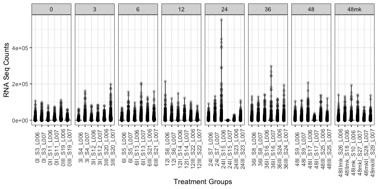
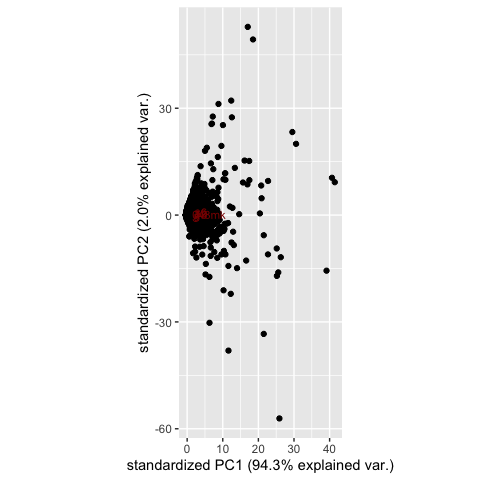
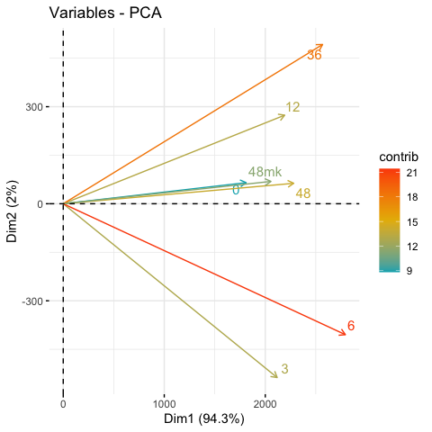
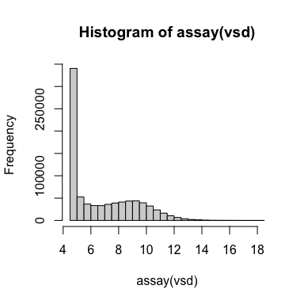
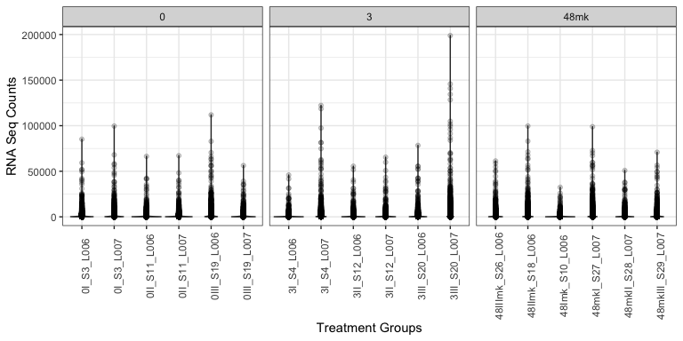
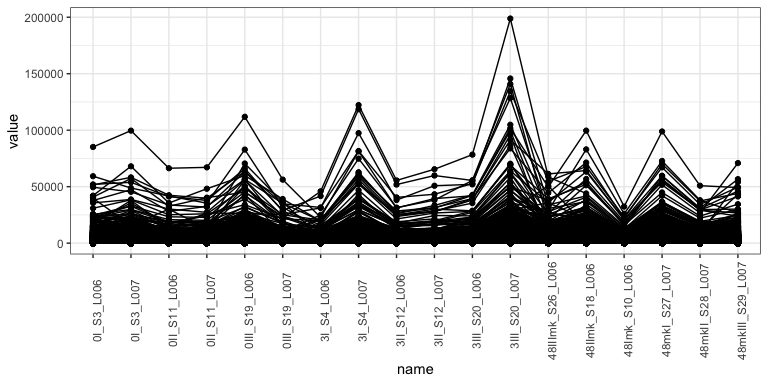

wgcna
================
Jennifer Chang
11/24/2020

<!--
---
title: "WGCNA Gene Correlation Network Analysis"
layout: single
author: Jennifer Chang
author1: Siva Chudalayandi
author_profile: true
header:
  overlay_color: "444444"
  overlay_image: /assets/images/dna.jpg
---
-->

**Last Update**: 14 Dec 2020 <br/> **R Markdown**:
[WGCNA.Rmd](https://bioinformaticsworkbook.org/tutorials/WGCNA.Rmd)

# Network analysis with WGCNA

<!--
  While there are multiple ways to build a co-expression network, we will focus on WGCNA to provide the motivation and framework.
-->

The **WGCNA R package** builds “weighted gene correlation networks for
analysis” from expression data. It was originally published in 2008 and
cited as the following:

-   Langfelder, P. and Horvath, S., 2008. [WGCNA: an R package for
    weighted correlation network
    analysis](https://bmcbioinformatics.biomedcentral.com/articles/10.1186/1471-2105-9-559).
    BMC bioinformatics, 9(1), p.559.
-   Zhang, B. and Horvath, S., 2005. [A general framework for weighted
    gene co-expression network
    analysis](https://pubmed.ncbi.nlm.nih.gov/16646834/). Statistical
    applications in genetics and molecular biology, 4(1).

<!--
  WGCNA continues to be used for many recent papers. Example papers include analyzing gray leaf disease response ([Yu et al, 2018](https://bmcgenomics.biomedcentral.com/articles/10.1186/s12864-018-5072-4#Sec2)) and development/nutrient/metabolism/stress response ([Ma et al, 2017](https://pubmed.ncbi.nlm.nih.gov/28764653/)).
-->

**More information**

-   [Recent PubMed
    Papers](https://pubmed.ncbi.nlm.nih.gov/?term=wgcna&sort=date)
-   [Original WGCNA tutorials - Last updated
    2016](https://horvath.genetics.ucla.edu/html/CoexpressionNetwork/Rpackages/WGCNA/Tutorials/)
-   [Video: ISCB Workshop 2016 - Co-expression network analysis using
    RNA-Seq data (Keith Hughitt)](https://youtu.be/OdqDE5EJSlA)

## Installing WGCNA

We will assume you have a working R environment. If not, please see the
following tutorial:

-   [Seting up an R and RStudio
    Environment](https://bioinformaticsworkbook.org/dataWrangling/R/r-setup.html)

Since WGCNA is an R package, we will need to start an R environment and
install from R’s package manager, CRAN.

``` r
install.packages("WGCNA")   # WGCNA is available on CRAN
library(WGCNA)
```

## Overview

The **WGCNA** pipeline is expecting an input matrix of RNA Sequence
counts. Usually we need to rotate (transpose) the input data so `rows` =
`treatments` and `columns` = `gene probes`.


The output of **WGCNA** is a list of clustered genes, and weighted gene
correlation network files.

<!--
## DESeq2

## Installing DESeq2


```r
# Install BiocManager for installing Bioconductor packages
install.packages("BiocManager")
BiocManager::install("DESeq2")
```
-->

# Dataset

<!--

## Dataset

We'll start with the dataset from the official WGCNA tutorial.

> The data are gene expression measurements from livers of female mouse of a specific F2 intercross. For a detailed description of the data and the biological implications we refer the reader to Ghazalpour et al (2006), Integrating Genetics and Network Analysis to Characterize Genes Related to Mouse Weight. We note that the data set contains 3600 measured expression profiles. These were filtered from the original over 20,000 profiles by keeping only the most variant and most connected probes. In addition to the expression data, several physiological quantitative traits were measured for the mice.

* [FemaleLiver-Data.zip](FemaleLiver-Data.zip)

From command line, you can also use `wget` or `curl`:

``` bash
wget https://horvath.genetics.ucla.edu/html/CoexpressionNetwork/Rpackages/WGCNA/Tutorials/FemaleLiver-Data.zip
unzip FemaleLiver-Data.zip
```
-->

ER Response, cell death description of data here.

## Load and Clean Dataset

Load any R libraries here

``` r
library(tidyverse)
library(magrittr)
library(WGCNA)
#library(devtools)
#install_github("vqv/ggbiplot")
library(ggbiplot)

# install.packages("BiocManager")
# BiocManager::install("DESeq2")
library(DESeq2)
```

Load and clean the data

``` r
# ==== Load and clean data
data <- readr::read_delim("data/All_Counts_ER.txt", delim="\t")
#> 
#> ── Column specification ────────────────────────────────────────────────────────
#> cols(
#>   .default = col_double(),
#>   Geneid = col_character()
#> )
#> ℹ Use `spec()` for the full column specifications.

col_sel = names(data)[-1]
mdata <- tidyr::pivot_longer(data,
                             col=all_of(col_sel)
                             ) %>%  
  mutate(
    group = gsub("I.*", "", name) %>% gsub("_.*", "", .),
  )

mdata$group[grepl("mk", mdata$name)]="48mk"
mdata$group = factor(mdata$group,
                     levels = c("0", "3", "6", "12", "24","36","48","48mk"))
```

Plot the data to identify outliers

``` r
# ==== Plot groups (Sample Groups vs RNA Seq Counts) to identify outliers
p <- mdata %>%
    ggplot(., aes(x=name, y=value)) +
    geom_violin() +
    geom_point(alpha=0.2) +
    theme_bw() +
    theme(
      axis.text.x = element_text(angle=90)
    ) +
    facet_grid(cols = vars(group), drop=TRUE, scales="free_x")

p + labs(x="Treatment Groups", y = "RNA Seq Counts")
```

<!-- -->

## PCA

``` r
# ==== Drop group 24 hours

# Maybe take average of each hour
msdata <- mdata %>%
  subset(group!="24") %>%                # Drop 24 hours
  dplyr::group_by(Geneid, group) %>%     # Get average value by hour
  dplyr::summarize(
    avg_count = mean(value)
  ) %>%
  ungroup()
#> `summarise()` regrouping output by 'Geneid' (override with `.groups` argument)

zero_data <- msdata %>%
  dplyr::group_by(Geneid) %>%
  dplyr::summarize(
    sum_count = sum(avg_count)
  ) %>%
  ungroup() %>%
  subset(sum_count == 0)
#> `summarise()` ungrouping output (override with `.groups` argument)

zero_genes = zero_data$Geneid

wide_msdata <- msdata %>%
  subset(., !(Geneid %in% zero_genes)) %>%
  tidyr::pivot_wider(., names_from=group, values_from = avg_count)

# ==== Run PCA
# https://bit.ly/362bJHA
data_pca <- prcomp(wide_msdata[,-1]) #, center = TRUE,scale. = TRUE)

# overplotted plot
ggbiplot(data_pca)
```

<!-- -->

Attempt two at a nice PCA plot

``` r
# looks a little better
# https://bit.ly/3o5GIcb
#install.packages("factoextra")
library("factoextra")
#> Welcome! Want to learn more? See two factoextra-related books at https://goo.gl/ve3WBa
fviz_pca_var(data_pca,
             col.var = "contrib", # Color by contributions to the PC
             gradient.cols = c("#00AFBB", "#E7B800", "#FC4E07"),
             repel = TRUE     # Avoid text overlapping
)
```

<!-- -->

## DESeq

Code contributed by Siva, thank you! Here we’re restricting the groups
to 0hr, 3hrs and 48 mock.

``` r
# keep only rows whose sums are greater than 10
# dim(dat)
# class(dat)
dat1 <- (data[rowSums(data[,-1]) > 10,])
dim(dat1)
#> [1] 32563    49
#30231    19

(sub_names = names(data) %>% {
  zero = grep("0I", ., value = T)
  three = grep("3I", ., value = T)
  mk = grep("mk", ., value=T)
  c(zero, three, mk)
  }
)
#>  [1] "0I_S3_L006"       "0I_S3_L007"       "0II_S11_L006"     "0II_S11_L007"    
#>  [5] "0III_S19_L006"    "0III_S19_L007"    "3I_S4_L006"       "3I_S4_L007"      
#>  [9] "3II_S12_L006"     "3II_S12_L007"     "3III_S20_L006"    "3III_S20_L007"   
#> [13] "48mkI_S27_L007"   "48Imk_S10_L006"   "48mkII_S28_L007"  "48IImk_S18_L006" 
#> [17] "48mkIII_S29_L007" "48IIImk_S26_L006"

sub_data <- data[,c("Geneid", sub_names)]

condition <- factor(c(rep("zero",times=6),
                      rep("three",times=6),
                      rep("mock",times=6)))

condition = relevel(condition, ref = "mock")
## Associating conditions with Samples

Sample.data = data.frame(row.names = colnames(sub_data[,-1]),
                         condition)
```

Start DESeq2 and plot PCA

``` r
dds <- DESeqDataSetFromMatrix(sub_data[,-1],
                              Sample.data,
                              design = ~condition)
#> converting counts to integer mode
dds <-DESeq(dds)
#> estimating size factors
#> estimating dispersions
#> gene-wise dispersion estimates
#> mean-dispersion relationship
#> final dispersion estimates
#> fitting model and testing
# Plot Dispersions:
#png("qc-dispersions.png", 1000, 1000, pointsize=20)
#plotDispEsts(dds, main="Dispersion plot2")
#dev.off()
# Regularized log transformation for clustering/heatmaps, etc
# rld <- rlogTransformation(dds)
vsd<-varianceStabilizingTransformation(dds)
head(assay(vsd))
#>      0I_S3_L006 0I_S3_L007 0II_S11_L006 0II_S11_L007 0III_S19_L006
#> [1,]   7.324933   7.339006     7.556410     7.434250      7.388262
#> [2,]  10.538700  10.274948    10.374993    10.293616     10.103856
#> [3,]   4.587224   4.974132     4.587224     4.587224      4.587224
#> [4,]   4.587224   5.253443     5.198798     5.049548      5.579642
#> [5,]   4.587224   4.587224     4.587224     4.587224      4.587224
#> [6,]   4.587224   4.587224     4.587224     4.587224      4.587224
#>      0III_S19_L007 3I_S4_L006 3I_S4_L007 3II_S12_L006 3II_S12_L007
#> [1,]      7.663647   8.134179   7.569463     7.544055     7.585466
#> [2,]      9.966643  10.209893  10.216762    10.153604    10.019453
#> [3,]      4.587224   4.587224   4.587224     4.587224     4.587224
#> [4,]      4.587224   5.704685   5.430443     5.583609     5.381642
#> [5,]      4.587224   4.587224   4.587224     4.587224     4.587224
#> [6,]      4.587224   4.587224   4.587224     4.587224     4.587224
#>      3III_S20_L006 3III_S20_L007 48mkI_S27_L007 48Imk_S10_L006 48mkII_S28_L007
#> [1,]      7.841968      7.791609       7.951395       7.236279        7.968322
#> [2,]     10.238828     10.062651      10.066793       9.929359       10.088653
#> [3,]      4.587224      5.199272       4.587224       4.587224        5.206554
#> [4,]      5.811940      5.525887       5.438891       5.375009        5.456616
#> [5,]      5.031587      4.587224       4.587224       4.587224        4.587224
#> [6,]      5.031587      4.587224       4.587224       4.587224        4.587224
#>      48IImk_S18_L006 48mkIII_S29_L007 48IIImk_S26_L006
#> [1,]        7.956463         7.982343         7.922119
#> [2,]       10.055192         9.648884         9.734524
#> [3,]        5.055699         4.587224         5.068207
#> [4,]        5.204954         5.467159         5.366789
#> [5,]        4.587224         4.587224         4.587224
#> [6,]        4.587224         4.587224         4.587224
hist(assay(vsd))
```

<!-- -->

``` r
# Principal Components Analysis
plotPCA(vsd)
```

<!-- -->

Pull out DE genes

``` r
res1 <- results(dds,contrast = c("condition","zero","three"))  #<=
table(res1$padj<0.05)
#> 
#> FALSE  TRUE 
#> 19014  8935
res2 <- results(dds,contrast = c("condition","zero","mock"))
table(res2$padj<0.05)
#> 
#> FALSE  TRUE 
#> 21690  5600
## Merge with normalized count data
temp <- as.data.frame(res1)
resdata1 <- merge(temp,
                  as.data.frame(counts(dds, normalized=TRUE)),
                  by = "row.names",
                  sort=FALSE)
#str(resdata1)  # Morloc (data type checking) R= type flexible C+ type strict
#names(resdata1) <- "gene"
resdata1$Row.names = sub_data$Geneid
#str(resdata1)
#head(resdata1)
names(resdata1)[1]="Gene_ID"
#str(resdata1)
#head(dat[,1])
resdata1_new<-(resdata1[,c(-2,-4:-6)])
```

Only focus on the DEseq genes between 0 and 3 hours.

``` r
# === Subset of genes DE between Zero & Three
sig_genes = resdata1_new %>%
  subset(padj < 0.05)

# Only focus on 8K sig DE genes
row.names(data) = data$Geneid
#> Warning: Setting row names on a tibble is deprecated.
head(row.names(data))
#> [1] "Zm00001d027230" "Zm00001d027231" "Zm00001d027232" "Zm00001d027233"
#> [5] "Zm00001d027234" "Zm00001d027235"
new_sub = data [ ,c("Geneid", sub_names)] %>%
  subset(., Geneid %in% sig_genes$Gene_ID)

(col_sel = names(new_sub)[-1])
#>  [1] "0I_S3_L006"       "0I_S3_L007"       "0II_S11_L006"     "0II_S11_L007"    
#>  [5] "0III_S19_L006"    "0III_S19_L007"    "3I_S4_L006"       "3I_S4_L007"      
#>  [9] "3II_S12_L006"     "3II_S12_L007"     "3III_S20_L006"    "3III_S20_L007"   
#> [13] "48mkI_S27_L007"   "48Imk_S10_L006"   "48mkII_S28_L007"  "48IImk_S18_L006" 
#> [17] "48mkIII_S29_L007" "48IIImk_S26_L006"
mdata <- tidyr::pivot_longer(new_sub,
                             col=col_sel
) %>%  
  mutate(
    group = gsub("I.*", "", name) %>% gsub("_.*", "", .),
  )
#> Note: Using an external vector in selections is ambiguous.
#> ℹ Use `all_of(col_sel)` instead of `col_sel` to silence this message.
#> ℹ See <https://tidyselect.r-lib.org/reference/faq-external-vector.html>.
#> This message is displayed once per session.

mdata$group[grepl("mk", mdata$name)]="48mk"
mdata$group = factor(mdata$group,
                     levels = c("0", "3", "6", "12", "24","36","48","48mk"))

  # ==== Plot groups (Sample Groups vs RNA Seq Counts) to identify outliers
  p <- mdata %>%
  ggplot(., aes(x=name, y=value)) +
  geom_violin() +
  geom_point(alpha=0.2) +
  theme_bw() +
  theme(
    axis.text.x = element_text(angle=90)
  ) +
  facet_grid(cols = vars(group), drop=TRUE, scales="free_x")

p + labs(x="Treatment Groups", y = "RNA Seq Counts")
```

<!-- -->

``` r
mdata %>% ggplot(., aes(x=name,
                        y = value,
                        group = Geneid)
                 ) +
  geom_point() +
  geom_line() +
  theme_bw() +
  theme (
    axis.text.x = element_text(angle=90)
  )
```

<!-- -->
