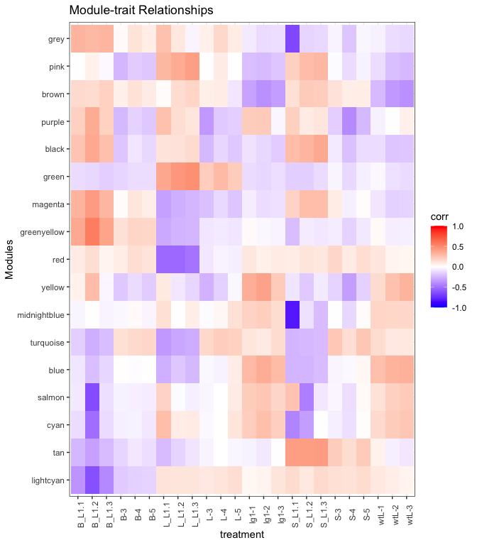

**Last Update**: 22 Dec 2020 <br/> **R Markdown**:
[WGCNA.Rmd](https://bioinformaticsworkbook.org/tutorials/WGCNA.Rmd)

# Network analysis with WGCNA

There are many gene correlation network builders but we shall provide an
example of the WGCNA R Package.

The **WGCNA R package** builds “weighted gene correlation networks for
analysis” from expression data. It was originally published in 2008 and
cited as the following:

-   Langfelder, P. and Horvath, S., 2008. [WGCNA: an R package for
    weighted correlation network
    analysis](https://bmcbioinformatics.biomedcentral.com/articles/10.1186/1471-2105-9-559).
    BMC bioinformatics, 9(1), p.559.
-   Zhang, B. and Horvath, S., 2005. [A general framework for weighted
    gene co-expression network
    analysis](https://pubmed.ncbi.nlm.nih.gov/16646834/). Statistical
    applications in genetics and molecular biology, 4(1).

**More information**

-   [Recent PubMed
    Papers](https://pubmed.ncbi.nlm.nih.gov/?term=wgcna&sort=date)
-   [Original WGCNA tutorials - Last updated
    2016](https://horvath.genetics.ucla.edu/html/CoexpressionNetwork/Rpackages/WGCNA/Tutorials/)
-   [Video: ISCB Workshop 2016 - Co-expression network analysis using
    RNA-Seq data (Keith Hughitt)](https://youtu.be/OdqDE5EJSlA)

## Installing WGCNA

We will assume you have a working R environment. If not, please see the
following tutorial:

-   [Seting up an R and RStudio
    Environment](https://bioinformaticsworkbook.org/dataWrangling/R/r-setup.html)

Since WGCNA is an R package, we will need to start an R environment and
install from R’s package manager, CRAN.

``` r
install.packages("WGCNA")   # WGCNA is available on CRAN
library(WGCNA)
```

## Overview

The **WGCNA** pipeline is expecting an input matrix of RNA Sequence
counts. Usually we need to rotate (transpose) the input data so `rows` =
`treatments` and `columns` = `gene probes`.


The output of **WGCNA** is a list of clustered genes, and weighted gene
correlation network files.

# Example Dataset

We shall start with an example dataset about Maize and Ligule
Development. \[Add description of data and maybe link to paper here\]

While the wt and lg1 were from the area marked in purple in plants that
exhibited either wt or no ligule (liguleless phenotype)… so this
encompasses the entire pre-ligule, pre-blade and pre-sheath area.

-   [Dataset](https://www.ncbi.nlm.nih.gov/geo/query/acc.cgi?acc=GSE61333)

> We shall start with an example dataset about ER (Endocrine Reticulum)
> cell death response. \[Add description of data and maybe link to paper
> here\]
>
> -   [All\_Counts\_ER.txt](data/All_Counts_ER.txt)
>
> ``` bash
> wget https://bioinformaticsworkbook.org/tutorials/data/All_Counts_ER.txt
> ```

## Load R Libraries

This analysis requires the following R libraries. You might need to
install the library if it’s not already on your system.

We’re going to conform to the [tidyverse]() ecosystem. For a discussion
on its benefits see [“Welcome to the Tidyverse” (Wickham et al,
2019)](https://tidyverse.tidyverse.org/articles/paper.html). This allows
us to organize the pipeline in the following framework ([Fig. from “R
for Data Science” (Wickham and Grolemund,
2017)](https://r4ds.had.co.nz/)):


``` r
# Uncomment and modify the following to install any missing packages
# install.packages(c("tidyverse", "magrittr", "WGCNA))
library(tidyverse)     # tidyverse will pull in ggplot2, readr, other useful libraries
library(magrittr)      # provides the %>% operator
library(WGCNA)        
```

## Tidy the Dataset, and using exploratory graphics

Load and look at the data

``` r
# ==== Load and clean data
#data <- readr::read_delim("data/All_Counts_ER.txt", delim="\t")

data <- readr::read_delim("data/GSE61333_ligule_count.txt", delim="\t")
#> 
#> ── Column specification ────────────────────────────────────────────────────────
#> cols(
#>   .default = col_double(),
#>   Count = col_character()
#> )
#> ℹ Use `spec()` for the full column specifications.
#data <- readr::read_delim("data/GSE61333_ligule_fpkm.txt", delim="\t")

data[1:5,1:10]        # Look at first 5 rows and 10 columns
#> # A tibble: 5 x 10
#>   Count            `B-3` `B-4` `B-5` `L-3` `L-4` `L-5` `S-3` `S-4` `S-5`
#>   <chr>            <dbl> <dbl> <dbl> <dbl> <dbl> <dbl> <dbl> <dbl> <dbl>
#> 1 AC147602.5_FG004     0     0     0     0     0     0     0     0     0
#> 2 AC148152.3_FG001     0     0     0     0     0     0     0     0     0
#> 3 AC148152.3_FG002     0     0     0     0     0     0     0     0     0
#> 4 AC148152.3_FG005     0     0     0     0     0     0     0     0     0
#> 5 AC148152.3_FG006     0     0     0     0     0     0     0     0     0

# str(data)           # str = structure of data, useful for debugging data type mismatch errors

names(data)[1] = "GeneId"
names(data)           # Look at the column names
#>  [1] "GeneId" "B-3"    "B-4"    "B-5"    "L-3"    "L-4"    "L-5"    "S-3"   
#>  [9] "S-4"    "S-5"    "B_L1.1" "B_L1.2" "B_L1.3" "L_L1.1" "L_L1.2" "L_L1.3"
#> [17] "S_L1.1" "S_L1.2" "S_L1.3" "wtL-1"  "wtL-2"  "wtL-3"  "lg1-1"  "lg1-2" 
#> [25] "lg1-3"
```

If you are in RStudio, you can also click on the `data` object in the
Environment tab to see an Excel-like view of the data.


From looking at the data, we can come to the following insights:

-   We see that `rows` = `gene probes` which probably means `columns` =
    `treatments` which is the opposite of what’s needed in WGCNA (`rows`
    = `treatment`, `columns` = `gene probes`). This dataset will need to
    be rotated (transposed) before sending to WGCNA.
-   This is also wide data, we will convert this to tidy data before
    visualization. For [Hadley Wickham](http://hadley.nz/)’s tutorial on
    the what and why to convert to tidy data, see
    <https://r4ds.had.co.nz/tidy-data.html>.

> -   The column names are prefixed with the treatment group (e.g. `B-3`
>     is B, `3I_S4_L006` is 3 hours, `48mkII_S28_L007` is 48 hours
>     mock.)

The following R commands clean and tidy the dataset for exploratory
graphics.

``` r
col_sel = names(data)[-1]                                  # Get all but first column name
mdata <- tidyr::pivot_longer( data,                        # Convert to Tidy Data
                              col = all_of(col_sel)
                             ) %>%  
  mutate(
    group = gsub("-.*","", name) %>% gsub("[.].*","", .)
#    group = gsub("I.*", "", name) %>% gsub("_.*", "", .),  # Add a "Group" column for the hour
  )

# mdata$group[grepl("mk", mdata$name)] = "48mk"              # Deal with columns where it's 48mk or 48IIImk,

# This sets the order of the hours in the plot... otherwise 48mk will be between "3" and "6".
# mdata$group = factor(mdata$group,
#                     levels = c("0", "3", "6", "12", "24","36","48","48mk"))
```

Think through what kinds of plots may tell you something about the
dataset. This example plots the data to identify any outliers.

``` r
# ==== Plot groups (Sample Groups vs RNA Seq Counts) to identify outliers
p <- mdata %>%
    ggplot(., aes(x=name, y=value)) +     # x = treatment, y = RNA Seq count
    geom_violin() +                       # violin plot, show distribution
    geom_point(alpha=0.2) +               # scatter plot
    theme_bw() +
    theme(
      axis.text.x = element_text(angle=90)                          # Rotate treatment text
    ) +
    facet_grid(cols = vars(group), drop=TRUE, scales="free_x")      # Facet by hour

p + labs(x="Treatment Groups", y = "RNA Seq Counts")
```

<!-- -->

From here, we can see there’s something strange in some of the hour 24
samples. One has very high RNASeq values `24II_S15_L006` with maybe a
wide range, while another has very low range of RNASeq values
`24_S15_L007`. We should follow up with the wet lab folks on an
explanation of those samples, but for now, we’ll remove the 24 hour
group and maybe the 48 hour group.

``` r
#keep_cols = names(data) %>% grep("24", .,  invert = T, value = T) %>% grep("48I+_", ., invert=T, value=T)
#cdata = data %>% select(all_of(keep_cols))

#temp <- data[rowSums(data[,-1]) > 0.1, ]      # Remove genes with all 0 values
#row_var <- apply(temp[,-1], 1, var)           # Remove genes with variance below 100
#cdata <- temp[row_var > 1, ]
#cdata[1:5, 1:10]
```

You can look at the `cdata` object (click on item in `environment` or
use `names(cdata)`) to convince yourself that the “24 hour” group is
gone. The original dataset had 46,430 genes (too many to explore),
subsetting by variance and other strange artifacts reduced it down to
25,088 genes. Let’s continue and determine the correlation networks for
these 25,088 genes.

## Normalize Counts with DESeq

``` r
library(DESeq2)
#> Loading required package: S4Vectors
#> Loading required package: stats4
#> Loading required package: BiocGenerics
#> Loading required package: parallel
#> 
#> Attaching package: 'BiocGenerics'
#> The following objects are masked from 'package:parallel':
#> 
#>     clusterApply, clusterApplyLB, clusterCall, clusterEvalQ,
#>     clusterExport, clusterMap, parApply, parCapply, parLapply,
#>     parLapplyLB, parRapply, parSapply, parSapplyLB
#> The following objects are masked from 'package:dplyr':
#> 
#>     combine, intersect, setdiff, union
#> The following objects are masked from 'package:stats':
#> 
#>     IQR, mad, sd, var, xtabs
#> The following objects are masked from 'package:base':
#> 
#>     anyDuplicated, append, as.data.frame, basename, cbind, colnames,
#>     dirname, do.call, duplicated, eval, evalq, Filter, Find, get, grep,
#>     grepl, intersect, is.unsorted, lapply, Map, mapply, match, mget,
#>     order, paste, pmax, pmax.int, pmin, pmin.int, Position, rank,
#>     rbind, Reduce, rownames, sapply, setdiff, sort, table, tapply,
#>     union, unique, unsplit, which, which.max, which.min
#> 
#> Attaching package: 'S4Vectors'
#> The following objects are masked from 'package:dplyr':
#> 
#>     first, rename
#> The following object is masked from 'package:tidyr':
#> 
#>     expand
#> The following object is masked from 'package:base':
#> 
#>     expand.grid
#> Loading required package: IRanges
#> 
#> Attaching package: 'IRanges'
#> The following objects are masked from 'package:dplyr':
#> 
#>     collapse, desc, slice
#> The following object is masked from 'package:purrr':
#> 
#>     reduce
#> Loading required package: GenomicRanges
#> Loading required package: GenomeInfoDb
#> Loading required package: SummarizedExperiment
#> Loading required package: Biobase
#> Welcome to Bioconductor
#> 
#>     Vignettes contain introductory material; view with
#>     'browseVignettes()'. To cite Bioconductor, see
#>     'citation("Biobase")', and for packages 'citation("pkgname")'.
#> Loading required package: DelayedArray
#> Loading required package: matrixStats
#> 
#> Attaching package: 'matrixStats'
#> The following objects are masked from 'package:Biobase':
#> 
#>     anyMissing, rowMedians
#> The following object is masked from 'package:dplyr':
#> 
#>     count
#> 
#> Attaching package: 'DelayedArray'
#> The following objects are masked from 'package:matrixStats':
#> 
#>     colMaxs, colMins, colRanges, rowMaxs, rowMins, rowRanges
#> The following object is masked from 'package:purrr':
#> 
#>     simplify
#> The following objects are masked from 'package:base':
#> 
#>     aperm, apply, rowsum

de_input = as.matrix(data[,-1])
row.names(de_input) = data$GeneId
de_input[1:5,1:10]
#>                  B-3 B-4 B-5 L-3 L-4 L-5 S-3 S-4 S-5 B_L1.1
#> AC147602.5_FG004   0   0   0   0   0   0   0   0   0      0
#> AC148152.3_FG001   0   0   0   0   0   0   0   0   0      0
#> AC148152.3_FG002   0   0   0   0   0   0   0   0   0      0
#> AC148152.3_FG005   0   0   0   0   0   0   0   0   0      0
#> AC148152.3_FG006   0   0   0   0   0   0   0   0   0      0
#str(de_input)

meta_df <- data.frame( Sample = names(data[-1])) %>% 
  mutate(
    Type = gsub("-.*","", Sample) %>% gsub("[.].*","", .)
  )

dds <- DESeqDataSetFromMatrix(round(de_input),
                              meta_df,
                              design = ~Type)
#> converting counts to integer mode
#> Warning in DESeqDataSet(se, design = design, ignoreRank): some variables in
#> design formula are characters, converting to factors

dds <- DESeq(dds)
#> estimating size factors
#> estimating dispersions
#> gene-wise dispersion estimates
#> mean-dispersion relationship
#> final dispersion estimates
#> fitting model and testing
vsd <-varianceStabilizingTransformation(dds)
library(genefilter)
#> 
#> Attaching package: 'genefilter'
#> The following objects are masked from 'package:matrixStats':
#> 
#>     rowSds, rowVars
#> The following object is masked from 'package:readr':
#> 
#>     spec
wpn_vsd<-getVarianceStabilizedData(dds)
rv_wpn <- rowVars(wpn_vsd)
summary(rv_wpn)
#>     Min.  1st Qu.   Median     Mean  3rd Qu.     Max. 
#>  0.00000  0.00000  0.00000  0.08044  0.03322 11.14529

q75_wpn <- quantile( rowVars(wpn_vsd), .75)
wpn_vsd_75 <- wpn_vsd[ rv_wpn > q75_wpn, ]

wpn_vsd_75[1:5,1:10]
#>                        B-3       B-4       B-5       L-3       L-4       L-5
#> AC148152.3_FG008  5.291822  5.193425  5.487940  5.101783  5.295309  5.762176
#> AC148167.6_FG001 10.360660  9.832517 10.136765 10.186714  9.820377  9.761429
#> AC149475.2_FG002  8.275312  8.537378  8.126494  8.047460  7.903629  8.296347
#> AC149475.2_FG003 11.068478 10.505163 10.410267 11.132275 10.596864 10.223615
#> AC149475.2_FG005  5.469075  5.436092  5.771927  5.156298  5.362260  5.627630
#>                        S-3       S-4       S-5    B_L1.1
#> AC148152.3_FG008  5.422534  4.858435  5.443877  4.858435
#> AC148167.6_FG001  9.772424 10.409788  9.889084 10.341011
#> AC149475.2_FG002  8.127217  8.547185  8.671973  7.751987
#> AC149475.2_FG003 10.541429 11.377578 10.684728 10.373376
#> AC149475.2_FG005  5.488132  5.690347  5.532934  5.453534
```

## WGCNA

Now let’s transpose the data and prepare the dataset for WGCNA.

``` r
#input_mat = t(as.matrix(cdata[,-1]))
#colnames(input_mat) = cdata$Geneid

input_mat = t(wpn_vsd_75)

input_mat[1:5,1:10]           # Look at first 5 rows and 10 columns
#>     AC148152.3_FG008 AC148167.6_FG001 AC149475.2_FG002 AC149475.2_FG003
#> B-3         5.291822        10.360660         8.275312         11.06848
#> B-4         5.193425         9.832517         8.537378         10.50516
#> B-5         5.487940        10.136765         8.126494         10.41027
#> L-3         5.101783        10.186714         8.047460         11.13227
#> L-4         5.295309         9.820377         7.903629         10.59686
#>     AC149475.2_FG005 AC149475.2_FG007 AC149810.2_FG008 AC149818.2_FG001
#> B-3         5.469075         5.890689         5.825066         7.600901
#> B-4         5.436092         5.992090         5.763014         7.077399
#> B-5         5.771927         5.855928         6.025468         7.803434
#> L-3         5.156298         5.800791         5.451045         7.220840
#> L-4         5.362260         5.722551         5.522448         7.410408
#>     AC149818.2_FG004 AC149818.2_FG005
#> B-3         5.365919         6.979453
#> B-4         5.436092         7.273319
#> B-5         5.530658         7.285711
#> L-3         5.884588         7.518189
#> L-4         5.609508         7.704308
```

We can see now that the `rows` = `treatments` and `columns` =
`gene probes`. We’re ready to start WGCNA. A correlation network will be
a complete network (all genes are connected to all other genes). Ergo we
will need to pick a threshhold value (if correlation is below threshold,
remove the edge). We assume the true biological network follows a
scale-free structure (see papers by [Albert
Barabasi](https://en.wikipedia.org/wiki/Barab%C3%A1si%E2%80%93Albert_model)).

To do that, WGCNA will try a range of soft thresholds and create a
diagnostic plot. This step will take several minutes so feel free to run
and get coffee.

``` r
#library(WGCNA)
allowWGCNAThreads()          # allow multi-threading (optional)
#> Allowing multi-threading with up to 4 threads.

# Choose a set of soft-thresholding powers
powers = c(c(1:10), seq(from = 12, to=20, by=2))

# Call the network topology analysis function
sft = pickSoftThreshold(input_mat,             # <= Input data
                        #blockSize = 30,
                        powerVector = powers,
                        verbose = 5
                        )
#> pickSoftThreshold: will use block size 1631.
#>  pickSoftThreshold: calculating connectivity for given powers...
#>    ..working on genes 1 through 1631 of 27429
#>    ..working on genes 1632 through 3262 of 27429
#>    ..working on genes 3263 through 4893 of 27429
#>    ..working on genes 4894 through 6524 of 27429
#>    ..working on genes 6525 through 8155 of 27429
#>    ..working on genes 8156 through 9786 of 27429
#>    ..working on genes 9787 through 11417 of 27429
#>    ..working on genes 11418 through 13048 of 27429
#>    ..working on genes 13049 through 14679 of 27429
#>    ..working on genes 14680 through 16310 of 27429
#>    ..working on genes 16311 through 17941 of 27429
#>    ..working on genes 17942 through 19572 of 27429
#>    ..working on genes 19573 through 21203 of 27429
#>    ..working on genes 21204 through 22834 of 27429
#>    ..working on genes 22835 through 24465 of 27429
#>    ..working on genes 24466 through 26096 of 27429
#>    ..working on genes 26097 through 27429 of 27429
#>    Power SFT.R.sq  slope truncated.R.sq mean.k. median.k. max.k.
#> 1      1   0.1240  1.310          0.968 7190.00   7130.00  10900
#> 2      2   0.0988 -0.632          0.942 2810.00   2670.00   5970
#> 3      3   0.4750 -1.300          0.958 1340.00   1190.00   3760
#> 4      4   0.6680 -1.640          0.964  718.00    594.00   2590
#> 5      5   0.7670 -1.830          0.973  419.00    319.00   1890
#> 6      6   0.8170 -1.940          0.977  261.00    182.00   1440
#> 7      7   0.8510 -1.980          0.983  171.00    109.00   1130
#> 8      8   0.8730 -2.010          0.987  116.00     67.70    906
#> 9      9   0.8930 -2.000          0.992   81.70     43.50    743
#> 10    10   0.9090 -1.970          0.995   59.10     28.50    620
#> 11    12   0.9210 -1.960          0.996   33.10     13.20    457
#> 12    14   0.9320 -1.920          0.997   19.90      6.56    352
#> 13    16   0.9380 -1.880          0.997   12.70      3.47    280
#> 14    18   0.9400 -1.840          0.994    8.50      1.93    228
#> 15    20   0.9450 -1.790          0.993    5.91      1.12    189

par(mfrow = c(1,2));
cex1 = 0.9;

plot(sft$fitIndices[, 1],
     -sign(sft$fitIndices[, 3]) * sft$fitIndices[, 2],
     xlab = "Soft Threshold (power)", 
     ylab = "Scale Free Topology Model Fit, signed R^2",
     main = paste("Scale independence")
)
text(sft$fitIndices[, 1], 
     -sign(sft$fitIndices[, 3]) * sft$fitIndices[, 2],
     labels = powers, cex = cex1, col = "red"
)
abline(h = 0.90, col = "red")
plot(sft$fitIndices[, 1],
     sft$fitIndices[, 5],
     xlab = "Soft Threshold (power)",
     ylab = "Mean Connectivity", type = "n", main = paste("Mean connectivity")
)
text(sft$fitIndices[, 1], 
     sft$fitIndices[, 5], 
     labels = powers, 
     cex = cex1, col = "red")
```

<!-- -->

Pick a soft threshold power near the curve of the plot, so here we could
pick 9 or 10. We’ll pick 10 but feel free to experiment with other
powers to see how it affects your results. Now we can create the network
using the `blockwiseModules` command. See the
[vignette](https://www.rdocumentation.org/packages/WGCNA/versions/1.69/topics/blockwiseModules)
for more information on the parameters.

``` r
cor <- WGCNA::cor
netwk <- blockwiseModules(input_mat,                # <= input here
                          power = 9,               # <= power here
                          minModuleSize = 30,
                          #reassignThreshold = 0, 
                          mergeCutHeight = 0.25, 
                          numericLabels = T,
                          pamRespectsDendro = F, 
                          saveTOMs = T, 
                          saveTOMFileBase = "ER",
                          verbose = 3, 
                          #maxBlockSize = 40000, 
                          deepSplit = 2, 
                          #detectCutHeight = 0.5,
                          networkType = "signed")
#>  Calculating module eigengenes block-wise from all genes
#>    Flagging genes and samples with too many missing values...
#>     ..step 1
#>  ....pre-clustering genes to determine blocks..
#>    Projective K-means:
#>    ..k-means clustering..
#>    ..merging smaller clusters...
#> Block sizes:
#> gBlocks
#>    1    2    3    4    5    6 
#> 4977 4955 4946 4938 4591 3022 
#>  ..Working on block 1 .
#>     TOM calculation: adjacency..
#>     ..will use 4 parallel threads.
#>      Fraction of slow calculations: 0.000000
#>     ..connectivity..
#>     ..matrix multiplication (system BLAS)..
#>     ..normalization..
#>     ..done.
#>    ..saving TOM for block 1 into file ER-block.1.RData
#>  ....clustering..
#>  ....detecting modules..
#>  ....calculating module eigengenes..
#>  ....checking kME in modules..
#>      ..removing 30 genes from module 1 because their KME is too low.
#>      ..removing 29 genes from module 2 because their KME is too low.
#>      ..removing 11 genes from module 3 because their KME is too low.
#>      ..removing 1 genes from module 4 because their KME is too low.
#>      ..removing 1 genes from module 5 because their KME is too low.
#>  ..Working on block 2 .
#>     TOM calculation: adjacency..
#>     ..will use 4 parallel threads.
#>      Fraction of slow calculations: 0.000000
#>     ..connectivity..
#>     ..matrix multiplication (system BLAS)..
#>     ..normalization..
#>     ..done.
#>    ..saving TOM for block 2 into file ER-block.2.RData
#>  ....clustering..
#>  ....detecting modules..
#>  ....calculating module eigengenes..
#>  ....checking kME in modules..
#>      ..removing 125 genes from module 1 because their KME is too low.
#>      ..removing 102 genes from module 2 because their KME is too low.
#>      ..removing 32 genes from module 3 because their KME is too low.
#>      ..removing 5 genes from module 4 because their KME is too low.
#>      ..removing 6 genes from module 5 because their KME is too low.
#>      ..removing 2 genes from module 6 because their KME is too low.
#>      ..removing 2 genes from module 11 because their KME is too low.
#>  ..Working on block 3 .
#>     TOM calculation: adjacency..
#>     ..will use 4 parallel threads.
#>      Fraction of slow calculations: 0.000000
#>     ..connectivity..
#>     ..matrix multiplication (system BLAS)..
#>     ..normalization..
#>     ..done.
#>    ..saving TOM for block 3 into file ER-block.3.RData
#>  ....clustering..
#>  ....detecting modules..
#>  ....calculating module eigengenes..
#>  ....checking kME in modules..
#>      ..removing 25 genes from module 1 because their KME is too low.
#>      ..removing 31 genes from module 2 because their KME is too low.
#>      ..removing 17 genes from module 3 because their KME is too low.
#>      ..removing 1 genes from module 4 because their KME is too low.
#>      ..removing 1 genes from module 5 because their KME is too low.
#>      ..removing 6 genes from module 6 because their KME is too low.
#>      ..removing 3 genes from module 7 because their KME is too low.
#>      ..removing 1 genes from module 8 because their KME is too low.
#>      ..removing 1 genes from module 11 because their KME is too low.
#>      ..removing 1 genes from module 12 because their KME is too low.
#>      ..removing 1 genes from module 13 because their KME is too low.
#>      ..removing 6 genes from module 15 because their KME is too low.
#>      ..removing 1 genes from module 16 because their KME is too low.
#>      ..removing 3 genes from module 20 because their KME is too low.
#>      ..removing 3 genes from module 21 because their KME is too low.
#>      ..removing 3 genes from module 23 because their KME is too low.
#>      ..removing 1 genes from module 25 because their KME is too low.
#>      ..removing 1 genes from module 26 because their KME is too low.
#>      ..removing 1 genes from module 27 because their KME is too low.
#>      ..removing 1 genes from module 35 because their KME is too low.
#>      ..removing 1 genes from module 36 because their KME is too low.
#>      ..removing 2 genes from module 37 because their KME is too low.
#>  ..Working on block 4 .
#>     TOM calculation: adjacency..
#>     ..will use 4 parallel threads.
#>      Fraction of slow calculations: 0.000000
#>     ..connectivity..
#>     ..matrix multiplication (system BLAS)..
#>     ..normalization..
#>     ..done.
#>    ..saving TOM for block 4 into file ER-block.4.RData
#>  ....clustering..
#>  ....detecting modules..
#>  ....calculating module eigengenes..
#>  ....checking kME in modules..
#>      ..removing 10 genes from module 1 because their KME is too low.
#>      ..removing 10 genes from module 2 because their KME is too low.
#>      ..removing 12 genes from module 3 because their KME is too low.
#>      ..removing 4 genes from module 4 because their KME is too low.
#>  ..Working on block 5 .
#>     TOM calculation: adjacency..
#>     ..will use 4 parallel threads.
#>      Fraction of slow calculations: 0.000000
#>     ..connectivity..
#>     ..matrix multiplication (system BLAS)..
#>     ..normalization..
#>     ..done.
#>    ..saving TOM for block 5 into file ER-block.5.RData
#>  ....clustering..
#>  ....detecting modules..
#>  ....calculating module eigengenes..
#>  ....checking kME in modules..
#>      ..removing 13 genes from module 1 because their KME is too low.
#>      ..removing 1 genes from module 2 because their KME is too low.
#>      ..removing 12 genes from module 3 because their KME is too low.
#>      ..removing 1 genes from module 4 because their KME is too low.
#>      ..removing 4 genes from module 10 because their KME is too low.
#>  ..Working on block 6 .
#>     TOM calculation: adjacency..
#>     ..will use 4 parallel threads.
#>      Fraction of slow calculations: 0.000000
#>     ..connectivity..
#>     ..matrix multiplication (system BLAS)..
#>     ..normalization..
#>     ..done.
#>    ..saving TOM for block 6 into file ER-block.6.RData
#>  ....clustering..
#>  ....detecting modules..
#>  ....calculating module eigengenes..
#>  ....checking kME in modules..
#>      ..removing 40 genes from module 1 because their KME is too low.
#>      ..removing 6 genes from module 2 because their KME is too low.
#>      ..removing 5 genes from module 3 because their KME is too low.
#>      ..removing 17 genes from module 4 because their KME is too low.
#>      ..removing 21 genes from module 5 because their KME is too low.
#>      ..removing 10 genes from module 6 because their KME is too low.
#>      ..removing 3 genes from module 8 because their KME is too low.
#>      ..removing 1 genes from module 9 because their KME is too low.
#>      ..removing 1 genes from module 11 because their KME is too low.
#>   ..reassigning 10 genes from module 1 to modules with higher KME.
#>   ..reassigning 6 genes from module 2 to modules with higher KME.
#>   ..reassigning 6 genes from module 3 to modules with higher KME.
#>   ..reassigning 3 genes from module 7 to modules with higher KME.
#>   ..reassigning 2 genes from module 8 to modules with higher KME.
#>   ..reassigning 1 genes from module 11 to modules with higher KME.
#>   ..reassigning 1 genes from module 13 to modules with higher KME.
#>   ..reassigning 1 genes from module 29 to modules with higher KME.
#>   ..reassigning 2 genes from module 31 to modules with higher KME.
#>   ..reassigning 1 genes from module 38 to modules with higher KME.
#>   ..reassigning 1 genes from module 44 to modules with higher KME.
#>   ..reassigning 1 genes from module 53 to modules with higher KME.
#>   ..reassigning 10 genes from module 71 to modules with higher KME.
#>   ..reassigning 6 genes from module 72 to modules with higher KME.
#>   ..reassigning 3 genes from module 73 to modules with higher KME.
#>   ..reassigning 1 genes from module 74 to modules with higher KME.
#>   ..reassigning 2 genes from module 75 to modules with higher KME.
#>  ..merging modules that are too close..
#>      mergeCloseModules: Merging modules whose distance is less than 0.25
#>        Calculating new MEs...

cor<-stats::cor
```

Let’s take a look at the modules, there

``` r
# Convert labels to colors for plotting
mergedColors = labels2colors(netwk$colors)
# Plot the dendrogram and the module colors underneath
plotDendroAndColors(
  netwk$dendrograms[[1]], 
  mergedColors[netwk$blockGenes[[1]]],
  "Module colors",
  dendroLabels = FALSE, hang = 0.03,
  addGuide = TRUE, guideHang = 0.05)
```

<!-- -->

``` r
#                    netwk$colors[netwk$blockGenes[[1]]]
#table(netwk$colors)
```

# Module (cluster) assignments

We can pull out the list of modules

``` r
module_df <- data.frame(
  gene_id = names(netwk$colors),
  colors = labels2colors(netwk$colors)
)

module_df[1:5,]
#>            gene_id    colors
#> 1 AC148152.3_FG008 turquoise
#> 2 AC148167.6_FG001       red
#> 3 AC149475.2_FG002      blue
#> 4 AC149475.2_FG003      blue
#> 5 AC149475.2_FG005      pink
```

However we need to figure out which modules are associated with each
trait/treatment group. WGCNA will calcuate an Eigangene (hypothetical
central gene) for each module, so it easier to determine if modules are
associated with different treatments.

``` r
# Get Module Eigengenes per cluster
MEs0 <- moduleEigengenes(input_mat, mergedColors)$eigengenes

# Reorder modules so similar modules are next to each other
MEs0 <- orderMEs(MEs0)

# Add treatment names
MEs0$treatment = row.names(MEs0)

# tidy & plot data
mME = MEs0 %>%
  pivot_longer(-treatment) %>%
  mutate(
    name = gsub("ME", "", name)
  )

mME %>% ggplot(., aes(x=treatment, y=name, fill=value)) +
  geom_tile() +
  theme_bw() + 
  theme(axis.text.x = element_text(angle=90)) +
  labs(title = "Module-trait Relationships", y = "Modules", fill="corr")
```

<!-- -->
